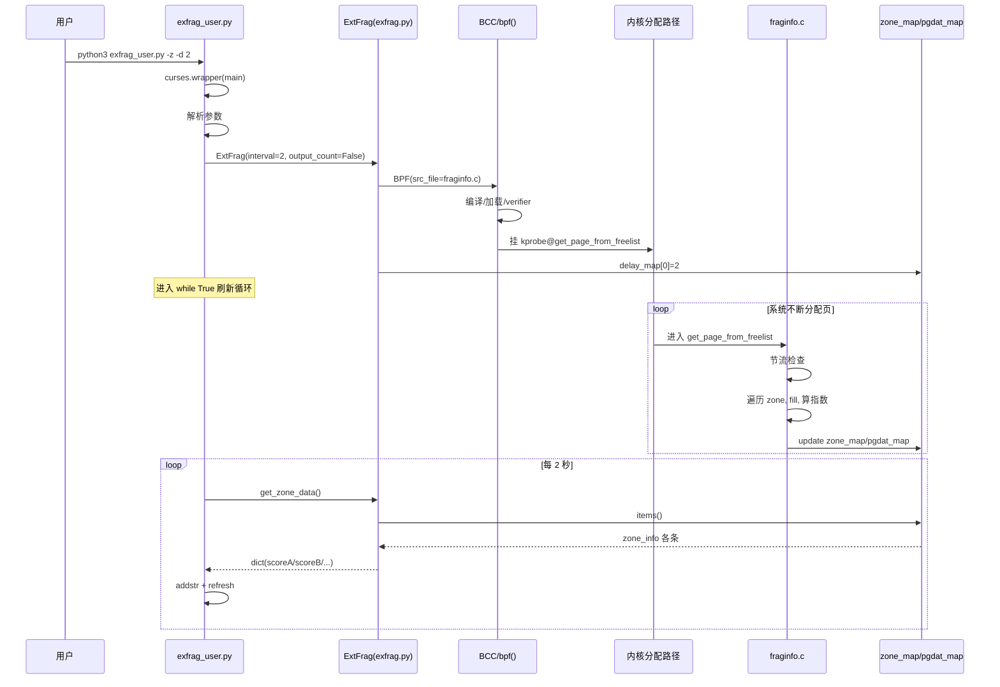

# Linux 物理内存碎片检测 —— 项目完整代码流程详解（逐行深读版）

> **文档目标**  
> 1. 文首给出**尽可能详细的总调用图**，先建立全局运行图景  
> 2. 对 4 个源码文件做**近逐行解释**，深入理解每一步在干什么  
> 3. 区分 **设计意图** vs **当前实现**（源码有阻断项时不装成“已经能跑”）
>
> **源码文件**  
> `exfrag_user.py`（入口 UI）→ `exfrag.py`（BCC 数据桥）→ `fraginfo.c` / `extfraginfo.c`（内核 eBPF）

---

# 第一部分：总调用流程图（请先看这里）

## 图 0：一句话总主线

```text
用户敲命令
  → exfrag_user.py 启动 curses、解析参数
  → 构造 ExtFrag（exfrag.py）
  → BCC 编译加载 eBPF C，挂 kprobe 或 tracepoint
  → 用户态写入 delay_map[0] = 采样间隔
  → 【之后】内核内存分配路径触发 eBPF 回调
  → eBPF 写 zone_map / pgdat_map 或 counts_map
  → Python 定时读 map、格式化
  → curses 画到终端
```

---

## 图 1：全局架构（谁依赖谁）

```text
┌──────────────────────────────────────────────────────────────────────────┐
│  终端用户                                                                  │
│  sudo python3 exfrag_user.py [-z|-s|-n|-v|-e|-u|-b|-d N|-i ID|-c NAME]   │
└─────────────────────────────────┬────────────────────────────────────────┘
                                  │
                                  ▼
┌──────────────────────────────────────────────────────────────────────────┐
│  exfrag_user.py  【用户态 UI / 控制流中枢】                                │
│  if __name__ == "__main__":                                              │
│      curses.wrapper(main)                                                │
│                                                                          │
│  main(screen):                                                           │
│    ① 初始化颜色 / 光标 / nodelay                                           │
│    ② 校验 & 解析 argv                                                     │
│    ③ extfrag = ExtFrag(...)          ───────────────┐                    │
│    ④ while True: 按模式分支刷新屏幕                    │                    │
└──────────────────────────────────────────────────────┼────────────────────┘
                                                       │ 构造 + 调用 get_*
                                                       ▼
┌──────────────────────────────────────────────────────────────────────────┐
│  exfrag.py :: class ExtFrag  【用户态数据桥】                              │
│                                                                          │
│  __init__:                                                               │
│    if output_count:  BPF("./bpf/extfraginfo.c")  ──事件模式──┐            │
│    else:             BPF("./bpf/fraginfo.c")     ──状态模式──┤            │
│    delay_map[0] = interval                                   │            │
│                                                              │            │
│  get_zone_data / get_node_data / get_view_data / get_count_data           │
│       ▲ 读 map                ▲ 读 map                                   │
└───────┼───────────────────────┼──────────────────────────────────────────┘
        │                       │
        │ BCC: 编译C→bpf()→verifier→挂探针→暴露 map
        ▼                       ▼
┌─────────────────────┐   ┌──────────────────────────┐
│  fraginfo.c         │   │  extfraginfo.c           │
│  【状态 eBPF】       │   │  【事件 eBPF】            │
│                     │   │                          │
│  kprobe 挂在:       │   │  tracepoint 挂在:        │
│  get_page_from_     │   │  kmem:                   │
│  freelist           │   │  mm_page_alloc_extfrag   │
│                     │   │                          │
│  写: zone_map       │   │  写: counts_map          │
│      pgdat_map      │   │  读: delay_map           │
│  读: delay_map      │   │      last_time_map       │
│      last_time_map  │   │                          │
└──────────▲──────────┘   └────────────▲─────────────┘
           │ 被动触发                    │ 被动触发
           │                            │
┌──────────┴────────────────────────────┴─────────────┐
│  Linux 内核内存子系统                                  │
│  进程申请页 → 伙伴系统分配路径                          │
│    · 快速路径调用 get_page_from_freelist  → 触发状态探针 │
│    · 发生 migratetype fallback 时        → 触发事件探针 │
└─────────────────────────────────────────────────────┘
```

---

## 图 2：启动期控制流（从进程起来到探针挂好）

```text
[T0]  shell: sudo python3 exfrag_user.py -z -d 2
        │
        ▼
[T1]  Python 加载 exfrag_user.py
        │  执行 import（注意：当前写 from extfrag，文件却是 exfrag.py）
        ▼
[T2]  if __name__ == "__main__":          # L418-419
        curses.wrapper(main)
        │  wrapper 内部：
        │    initscr → 调 main(screen) → 结束时 endwin 恢复终端
        ▼
[T3]  main(screen) 开头                # L68-84
        隐藏光标、nodelay、颜色对 init_pair(1..7)
        ▼
[T4]  参数校验循环                      # L90-140
        非法参数 → 报错 sleep(100)
        ▼
[T5]  若 -h/--help → 打印帮助退出等待   # L143-164
        否则进入正式解析                # L165-200
        ▼
[T6]  ExtFrag(                          # L202-207
          interval=delay,
          output_count=...,
          ...)
        │
        ▼
[T7]  ExtFrag.__init__                  # exfrag.py L8-22
        │
        ├─ output_count==True  → BPF(src_file="./bpf/extfraginfo.c")
        │                         BCC: 读C → clang编译BPF → bpf()加载
        │                         → 自动挂 TRACEPOINT(kmem,mm_page_alloc_extfrag)
        │
        └─ output_count==False → BPF(src_file="./bpf/fraginfo.c")
                                  BCC: 同上
                                  → 自动挂 kprobe__get_page_from_freelist
                                    到内核符号 get_page_from_freelist
        │
        ▼
[T8]  self.b["delay_map"][0] = interval # 用户态 → 内核 配置采样间隔
        │
        ▼
[T9]  回到 main，screen.clear()
        进入 while True 刷新循环         # L209+
        （此时 eBPF 已在内核里“待命”，等分配路径触发）
```

> ⚠️ **当前实现卡点（启动期）**  
> - L6：`from extfrag import ExtFrag` 与文件名 `exfrag.py` 不一致 → 可能 ImportError  
> - L18/20：路径 `./bpf/*.c`，仓库根目录实际是 `fraginfo.c`/`extfraginfo.c`，无 `bpf/` 目录  

---

## 图 3A：状态模式运行时（默认 / `-z` / `-n` / `-v`）

```text
                    ┌─────────────────────────────────────┐
                    │  某进程需要物理页                      │
                    │  内核进入伙伴系统快速路径               │
                    │  get_page_from_freelist(gfp, order,  │
                    │                        flags, ac)    │
                    └─────────────────┬───────────────────┘
                                      │ 函数入口被 kprobe 拦住
                                      ▼
              ┌───────────────────────────────────────────────┐
              │ fraginfo.c::kprobe__get_page_from_freelist    │
              │                                               │
              │ 1. bpf_ktime_get_ns() 取 now                  │
              │ 2. 读 delay_map[0]、查 last_time_map（节流）   │
              │    未到间隔 → return 0（当前实现节流基本失效）  │
              │ 3. pgdat = ac->preferred_zoneref              │
              │              ->zone->zone_pgdat               │
              │ 4. for i in 0..MAX_NR_ZONES:                  │
              │      z = pgdat->node_zonelists                │
              │            [ZONELIST_FALLBACK]._zonerefs[i]   │
              │      写 pgdat_map（节点首次）                  │
              │      读 zone 静态字段 + name                   │
              │      for a_order = 0..10:                     │
              │        fill_contig_page_info(z, a_order)      │
              │          └读 free_area[0..10].nr_free         │
              │        score_b = unusable_free_index()        │
              │        score_a = __fragmentation_index()      │
              │        zone_map[zone_ptr+order] = zone_info   │
              │ 5. last_time_map 更新                         │
              └───────────────────────┬───────────────────────┘
                                      │ map 中已有最新快照
                                      ▼
              ┌───────────────────────────────────────────────┐
              │ exfrag_user 主循环每 delay 秒：                 │
              │   extfrag.get_zone_data() / get_node_data()   │
              │     → 遍历 self.b["zone_map"].items()         │
              │     → calculate_scoreA/B 格式化               │
              │   screen.addstr(...) 画表                     │
              │   screen.refresh(); sleep(delay)              │
              └───────────────────────────────────────────────┘
```

### 状态模式：数据字段流动

```text
内核 zone->free_area[o].nr_free
        │
        ▼ fill_contig_page_info
   free_pages / free_blocks_total / free_blocks_suitable
        │
        ├──────────────► unusable_free_index ──► score_b ──┐
        └──────────────► __fragmentation_index ► score_a ──┤
                                                           │
        zone 静态字段 (pfn/spanned/present/name/node_id) ──┤
                                                           ▼
                                              zone_map 条目
                                                           │
                                                           ▼ Python
                                              dict: scoreA/scoreB/...
                                                           │
                                                           ▼ curses 列
                                              extfrag_index / unusable_index / ...
```

---

## 图 3B：事件模式运行时（`-s`）

```text
          ┌────────────────────────────────────────────┐
          │ 分配时发生外碎片 fallback                    │
          │ （从非理想 migratetype 取块等）              │
          │ 内核触发 tracepoint:                       │
          │   kmem:mm_page_alloc_extfrag               │
          │ 参数含: pfn, alloc_order, fallback_order…  │
          └──────────────────┬─────────────────────────┘
                             ▼
          ┌────────────────────────────────────────────┐
          │ extfraginfo.c::TRACEPOINT_PROBE(...)       │
          │  1. 时间节流（同 fraginfo，同样有 key 问题） │
          │  2. pid = bpf_get_current_pid_tgid()>>32   │
          │  3. counts_map 按 pid lookup               │
          │     无 → 新建 count=1，填字段+comm           │
          │     有 → count++，覆盖为“最近一次”字段      │
          │  4. counts_map.update(&pid, data)          │
          └──────────────────┬─────────────────────────┘
                             ▼
          ┌────────────────────────────────────────────┐
          │ exfrag.get_count_data()                    │
          │   遍历 counts_map，按 count 降序            │
          │ curses 画 COMM/PID/PFN/ORDER/COUNT 表      │
          └────────────────────────────────────────────┘
```

---

## 图 4：主循环模式决策树（exfrag_user.py）

```text
while True:
    │
    ├─ if node_info (-n)     → get_node_data()      → 节点表
    ├─ elif output_count(-s) → get_count_data()     → 事件表   ← 唯一加载 extfraginfo.c
    ├─ elif zone_info (-z)   → get_zone_data()      → 详细 zone 表
    ├─ elif view (-v)        → get_view_data()+get_zone_data() → 进度条矩阵
    └─ else                  → get_zone_data()      → 默认摘要表

修饰开关（不换大分支，只改列/过滤）：
    -e 只显示 extfrag_index
    -u 只显示 unusable_index
    -b 追加 BAR
    -c 按 zone 名过滤
    -i 按 node_id 过滤
    -d 刷新间隔（同时写入 delay_map）
```

优先级（if/elif 互斥）：**`-n` > `-s` > `-z` > `-v` > 默认**

---

## 图 5：时序总图（状态模式，Mermaid）



---

## 图 6：函数调用关系总表

| 调用方 | 调用 | 被调 | 作用 |
|---|---|---|---|
| OS/Python | → | `curses.wrapper(main)` | 入口 |
| `main` | → | `ExtFrag.__init__` | 加载 eBPF |
| `ExtFrag.__init__` | → | `BPF(...)` | 编译挂载 |
| `main` 循环 | → | `get_zone_data` 等 | 读结果 |
| `get_zone_data` | → | `calculate_scoreA/B` | 格式化 |
| 内核 | → | `kprobe__get_page_from_freelist` | 状态采集 |
| kprobe 内 | → | `fill_contig_page_info` | 扫 freelist |
| kprobe 内 | → | `unusable_free_index` | score_b |
| kprobe 内 | → | `__fragmentation_index` | score_a |
| 内核 | → | `TRACEPOINT mm_page_alloc_extfrag` | 事件采集 |
| `main` | → | `generate_fragmentation_bar` | `-b` |
| `main` | → | `createBar`/`setProgress` | `-v` |
| `main` | → | `screenEnough` | 窗口检查 |

---

## 图 7：两张时间线并行（理解“谁主动”）

```text
时间轴 ──────────────────────────────────────────────────────────►

用户态线程（exfrag_user 主循环）:
  [启动加载eBPF]----[sleep]----[读map画屏]----[sleep]----[读map画屏]--...

内核 + eBPF（另一条世界线，异步触发）:
  ......[分配][kprobe写map]....[分配][kprobe]....[fallback][tp写map]...

关键认识：
  · eBPF 不轮询；内核走到挂点才执行
  · 用户态不“调用”eBPF 函数，只读写共享 map
  · 两边靠 map 解耦，没有直接函数调用跨内核/用户
```

---

# 第二部分：四文件近逐行解析

下面按**运行时依赖顺序**讲解：先数据桥与内核（真正算数的地方），再 UI。  
（若你想严格跟启动顺序：先看 `exfrag_user` 入口段，再跳回这里。）

---

## A. `exfrag.py` —— 用户态数据桥（逐行）

### A.0 文件角色

- 封装 BCC：加载 C、暴露 map  
- 把内核结构体转成 Python dict  
- **不负责**画 UI，**不负责**重算碎片公式  

---

### A.1 头部 L1–L5

```python
#!/usr/bin/env python3          # L1: shebang，可直接 ./exfrag.py 执行
from bpfcc import BPF           # L2: 核心依赖——编译/加载/挂载/map 访问全靠它（部分环境包名是 bcc）
import os                       # L3: 引入但本文件几乎不用（冗余）
import time                     # L4: 仅 run() 里 sleep 用
import ctypes                   # L5: 写 delay_map 时需要 c_int 将 Python int 转 C int
```

---

### A.2 类与构造 L7–L22

```python
class ExtFrag:                                                           # L7: UI 通过这个类拿所有监控数据
    def __init__(self, interval=2, output_extfrag_index=False,            # L8: interval=刷新秒数
                 output_unusable_index=False, output_count=False,         #     output_count 是唯一真正改变加载行为的开关
                 zone_info=False):
        self.interval = interval                                         # L9
        self.output_extfrag_index = output_extfrag_index                 # L10: 后三个成员在本文件几乎不再用
        self.output_unusable_index = output_unusable_index               # L11: 列选择由 exfrag_user 的 args 字典控制
        self.output_count = output_count                                 # L12
        self.zone_info = zone_info                                       # L13

        if self.output_count:                                            # L17: True → 事件模式
            self.b = BPF(src_file="./bpf/extfraginfo.c")                 # L18: 加载事件 C（⚠️ 路径写死，需建 bpf/ 目录）
        else:                                                            # L19: False → 状态模式（默认）
            self.b = BPF(src_file="./bpf/fraginfo.c")                    # L20: 两份不能同时加载
        delay_key = 0                                                    # L21
        self.b["delay_map"][delay_key] = ctypes.c_int(interval)          # L22: 用户态→内核配置采样间隔
```

**难点说明**

1. **`BPF(src_file=...)` 做了什么**：同步执行「读 C 文件 → Clang 编译为 BPF 字节码 → bpf() 加载 → verifier 校验 → 按命名约定自动挂探针」。成功后 `self.b` 可像字典一样访问内核 map。
2. **`delay_map[0]` 的跨界通信**：用户态把采样间隔写入 BPF array 的第 0 号元素；eBPF 程序里 `delay_map.lookup(&key)` 的 `key=0` 与此对应——这是唯一的用户→内核配置通道。

#### `BPF(src_file=...)` 内部（设计意图，逻辑步骤）

```text
1. 打开 C 源文件
2. 预处理 + Clang 编译为 BPF 字节码
3. bpf(BPF_MAP_CREATE...) 创建各 map
4. bpf(BPF_PROG_LOAD...) 加载程序，verifier 检查
5. 按命名约定 attach：
   - kprobe__get_page_from_freelist → kprobe 到该内核函数
   - TRACEPOINT_PROBE(kmem, mm_page_alloc_extfrag) → 挂 tracepoint
6. 返回 Python BPF 对象
```

#### ⚠️ 当前实现

- 路径写成 `./bpf/...`，仓库根目录文件名是 `fraginfo.c` / `extfraginfo.c`  
- 未建 `bpf/` 或不改路径会加载失败  

---

### A.3 `calculate_scoreA` L25–L28

```python
def calculate_scoreA(self, extfrag_index):              # L25: 输入 score_a（千分制整数，可为负）
    extfrag_index_int_part = int(extfrag_index) // 1000  # L26: 整数部分，如 584//1000=0, -1000//1000=-1
    extfrag_index_dec_part = int(extfrag_index) % 1000   # L27: 千分位小数，如 584%1000=584
    return f"{extfrag_index_int_part:2d}.{extfrag_index_dec_part:03d}"  # L28: 格式如 " 0.584"、"-1.000"
```

这是展示变换，**不是**重新计算 extfrag 公式。Python `%` 对负数的行为：`(-1000) % 1000 == 0`，所以 `-1000` → `-1.000`，符合预期。

---

### A.4 `calculate_scoreB` L30–L33

与 A 完全对称，处理 `score_b`（0~1000）→ `" 0.xxx"` / `" 1.000"`。

---

### A.5 `get_zone_data` L35–L63（状态模式最重要读接口）

```python
def get_zone_data(self, filter_node_id=None):     # L35: 返回 {zone名: [各order字典]}，状态模式主读接口
    zone_data_dict = {}                           # L36
    zone_map = self.b["zone_map"]                 # L37: 拿 BCC 对内核 hash 的代理
                                                  #      ⚠️ 若加载的是 extfraginfo.c，无 zone_map → 异常

    for key, value in zone_map.items():           # L39: key=zone_ptr+order（本函数未用 key，只扫 value）
        comm = value.name.decode('utf-8', 'replace').rstrip('\x00')  # L40: C char[32] → str，replace防非法UTF-8
        node_id = value.node_id                   # L41
        if filter_node_id is not None and node_id != filter_node_id:  # L42-43: 对应 CLI -i
            continue
        data = {                                  # L44-56: 字段一一对应 struct zone_info
            'comm': comm,
            'zone_pfn': value.zone_start_pfn,
            'spanned_pages': value.spanned_pages,
            'present_pages': value.present_pages,
            'order': value.order,
            'free_blocks_total': value.free_blocks_total,
            'free_blocks_suitable': value.free_blocks_suitable,
            'free_pages': value.free_pages,
            'scoreA': self.calculate_scoreA(value.score_a),  # 千分制→字符串
            'scoreB': self.calculate_scoreB(value.score_b),
            'node_id': value.node_id
        }
        if comm not in zone_data_dict:            # L57-59: 按 zone 名字符串分组（不按 node）
            zone_data_dict[comm] = []             #          多 NUMA 同名 zone 会混在一起，需注意
        zone_data_dict[comm].append(data)
        for comm in zone_data_dict:               # L60-61: 每插入一条就全局重排——正确但 O(n²logn)，数据量小可接受
            zone_data_dict[comm].sort(key=lambda x: x['order'])

    return zone_data_dict                         # L63
```

**返回形状示例**：

```python
{
  "Normal": [
    {"order":0, "scoreA":" 0.000", "scoreB":" 0.100", ...},
    {"order":1, ...},
    ...
    {"order":10, ...}
  ],
  "DMA32": [ ... ]
}
```

---

### A.6 `get_view_data` L64–L86

```python
def get_view_data(self, filter_node_id=None):     # L64: -v 模式用，枚举有哪些 (node, zone)
    zone_data_dict = {}                           # L65
    ret_dict = {}                                 # L66
    zone_map = self.b["zone_map"]                 # L67

    for key, value in zone_map.items():           # L69
        comm = value.name.decode(...).rstrip('\x00')  # L70
        node_id = value.node_id                   # L71
        if filter_node_id is not None and node_id != filter_node_id:
            continue                              # L73-74
        data = {
            'scoreB': self.calculate_scoreB(value.score_b),  # L77
            'order': value.order,                 # L78
        }
        zone_data_dict[(node_id, comm)] = data    # L82: key=(node_id,comm)，同一zone被11个order轮流覆盖
                                                  #      ⚠️ 最终只保留最后一个order的scoreB
    sorted_keys = sorted(zone_data_dict.keys())   # L83: 稳定遍历顺序
    for key in sorted_keys:                       # L84-85
        ret_dict[key] = zone_data_dict[key]
    return ret_dict                               # L86: -v 里主要用它枚举 (node,zone)，真正11个order分数靠 get_zone_data
```

---

### A.7 `get_nr_zones` L87–L108

```python
def get_nr_zones(self, filter_node_id=None):      # L87: 返回 {node_id: [zone_comm, ...]}，被 get_node_data 调用
    node_zone_map = {}                            # L88
    zone_map = self.b["zone_map"]                 # L89
    for key, value in zone_map.items():           # L91
        comm = ...                                # L92
        node_id = value.node_id                   # L93
        if filter...: continue                    # L95-96
        data = {'scoreB': ..., 'order': ...}      # L98-101: ⚠️ 构造了却没用，死代码
        if node_id not in node_zone_map:          # L104-105
            node_zone_map[node_id] = []
        node_zone_map[node_id].append(comm)       # L106: ⚠️ 同一zone有11个order → 同名append11次
    return node_zone_map                          # L108: 下游用 len(list)/11 反推实际zone数
```

---

### A.8 `get_node_data` L109–L124

```python
def get_node_data(self):                          # L109
    node_data_dict = {}                           # L110
    pgdat_map = self.b["pgdat_map"]               # L111: 依赖 fraginfo 的 pgdat_map
    zone_data = self.get_nr_zones()               # L112

    for key, value in pgdat_map.items():          # L114
        node_id = value.node_id                   # L115
        nr_zones = int(len(zone_data.get(node_id, []))/11)  # L116: ÷11 反推zone数（魔法数 MAX_ORDER+1）
                                                             #        内核若改 MAX_ORDER 会算错
        data = {
            'pgdat_ptr': value.pgdat_ptr,         # L118: ⚠️ 字段名叫 ptr，实际存的是 node_start_pfn（见 fraginfo L133）
            'nr_zones': nr_zones,                 # L119: 没用 C 写好的 pgdat_info.nr_zones，自己用 len/11 推
            'node_id': value.node_id              # L120
        }
        node_data_dict[node_id] = data            # L122
    return node_data_dict                         # L124
```

---

### A.9 `get_count_data` L126–L148

```python
def get_count_data(self):                         # L126: 事件模式专用，返回按 fallback 次数降序列表
    count_data_list = []                          # L127
    counts_map = self.b["counts_map"]             # L128: ⚠️ 仅 extfraginfo 有此 map，状态模式调用会崩
    for key, value in counts_map.items():         # L131
        _comm = value.pcomm.decode(...).rstrip('\x00')  # L132
        data = {
            'pcomm': _comm,                       # L134
            'pid': value.pid,                     # L135
            'pfn': value.pfn,                     # L136: 最近一次事件的页帧号（非历史，会被覆盖）
            'alloc_order': value.alloc_order,     # L137: 最近一次请求阶
            'fallback_order': value.fallback_order, # L138: 最近一次 fallback 阶
            'count': value.count                  # L139: 唯一真正累计的字段
        }
        count_data_list.append(data)              # L143
    count_data_list.sort(key=lambda x: x['count'], reverse=True)  # L146: 热点进程排前面
    return count_data_list                        # L148: 解读时注意 count 旁的 order 字段是"最近一次"快照
```

---

### A.10 `run` L150–L155

```python
def run(self):                    # L150
    while True:                   # L151
        try:
            time.sleep(self.interval)  # L153
        except KeyboardInterrupt:
            exit()                # L155
```

**当前工程不调用它**。真正循环在 `exfrag_user.main` 的 `while True`。  
可视为预留/遗留 API。

---

## B. `fraginfo.c` —— 状态 eBPF（逐行）

### B.1 头文件与常量 L1–L6

```c
#include <linux/gfp.h>           // L1: gfp_t 等分配标志类型
#include <linux/mm.h>            // L2: 内存管理通用结构
#include <linux/mmzone.h>        // L3: zone/pgdat/free_area 等关键内存区结构
#include <uapi/linux/ptrace.h>   // L4: pt_regs，kprobe 上下文（⚠️ 内核版本不对可能编译失败）

#define MAX_ORDER 10             // L6: 伙伴系统最大阶；现代内核可能不同，写死有风险
```

---

### B.2 `struct pgdat_info` L8–L12

```c
struct pgdat_info {
  u64 pgdat_ptr;   // L9: 名是 ptr，L133 实际存 node_start_pfn
  int nr_zones;    // L10: 节点 zone 数（写入了，用户态却没用它显示）
  int node_id;     // L11
};
```

---

### B.3 `struct zone_info` L14–L27

```c
struct zone_info {
  u64 zone_ptr;                      // L15: zone* 转 u64，参与 map key
  u64 zone_start_pfn;                // L16: → UI ZONE_PFN
  u64 spanned_pages;                 // L17: → SUM_PAGES（含空洞跨度）
  u64 present_pages;                 // L18: → FACT_PAGES
  unsigned long free_pages;          // L19: 三量之一
  unsigned long free_blocks_total;   // L20: TOTAL
  unsigned long free_blocks_suitable;// L21: SUITABLE
  char name[32];                     // L22: DMA/Normal/...
  int order;                         // L23: 本条对应的目标阶 0..10
  int score_a;                       // L24: extfrag 千分制
  int score_b;                       // L25: unusable 千分制
  int node_id;                       // L26
};
```

**同一 zone 在 map 里有 11 条**（每个 order 一条），因为碎片程度必须相对“请求阶”定义。

---

### B.4 本地 `struct alloc_context` L28–L35

```c
struct alloc_context {
  struct zonelist *zonelist;              // L29
  nodemask_t *nodemask;                   // L30
  struct zoneref *preferred_zoneref;      // L31: 本程序核心用途——通过它拿到 pgdat（L113）
  int migratetype;                        // L32
  enum zone_type highest_zoneidx;         // L33
  bool spread_dirty_pages;                // L34
};
// ⚠️ 不是稳定 UAPI，是让 BCC 知道参数布局以便在 kprobe 里访问 ac->preferred_zoneref
//    内核字段顺序/对齐变化时 → 读到野指针级错误
```

---

### B.5 `struct contig_page_info` L37–L41

临时三量容器，不进 map，只在计算函数间传递。

---

### B.6 BPF map 声明 L43–L46

```c
BPF_HASH(pgdat_map, u64, struct pgdat_info);  // L43: key=pgdata指针
BPF_HASH(zone_map, u64, struct zone_info);    // L44: key=zone_ptr+order
BPF_HASH(last_time_map, u64, u64);            // L45: 设计用于节流
BPF_ARRAY(delay_map, int, 1);                 // L46: 长度1，下标0=间隔秒
```

BCC 宏展开后变成真正的 BPF map 定义 + 用户态可访问名。

---

### B.7 `unusable_free_index` L48–L55（score_b）

```c
static int unusable_free_index(unsigned int order,           // L48: 计算 score_b（0~1000，越大越碎）
                               struct contig_page_info *info) {
  if (info->free_pages == 0)                                 // L50: 无空闲页
    return 1000;                                             // L51: 直接最差，无需除法
  return div_u64(                                            // L52: BPF 安全的64位整除（不用普通 /）
      (info->free_pages - (info->free_blocks_suitable << order)) * 1000ULL, // L53: 分子=无法组成目标块的页×1000
      info->free_pages);                                     // L54: ÷ 总空闲页 → 千分比例
}
```

**难点说明**

1. **公式含义**：`score_b = (free_pages - suitable_pages) / free_pages × 1000`。`suitable_pages = free_blocks_suitable << order` 表示能满足该 order 分配的页数；分子是”有空闲但用不上”的页数，越高说明碎片越严重。
2. **为什么用 `div_u64`**：BPF verifier 会拒绝可能产生除以零异常的原生 `/`，`div_u64` 是内核提供的安全版本。

---

### B.8 `__fragmentation_index` L57–L69（score_a）

```c
static int __fragmentation_index(unsigned int order,
                                 struct contig_page_info *info) {
  unsigned long requested = 1UL << order;        // L59: 请求页数（order=3→8页）
  if (WARN_ON_ONCE(order > MAX_ORDER))           // L60: 超范围保护
    return 0;                                    // L61
  if (!info->free_blocks_total)                  // L62: 完全没有空闲块
    return 0;                                    // L63: 返回 0（非碎片，是”没有”）
  if (info->free_blocks_suitable)                // L64: 有合适块可直接满足
    return -1000;                                // L65: ⚠️ -1.000 表示”可分配”，非碎片语义
  return 1000 -                                  // L66-68: suitable=0时，值→1000 越像外碎片
         div_u64((1000 + (div_u64(info->free_pages * 1000ULL, requested))),   //              值→0 越像总量不足
                 info->free_blocks_total);
}
```

**难点说明**

1. **三种返回值的语义**：`0` = 没有任何空闲块；`-1000` = 有合适块，可以直接分配；`0~1000` = 没有合适块时的碎片程度，值越接近 1000 越说明是外碎片（空闲页多但分散），越接近 0 越说明总页不够。
2. **为什么有合适块返回 -1000 而不是 0**：这样设计让 UI 能一眼区分「可分配」和「完全没有」两种 score_a=0 的情况——前者显示 `-1.000`，后者显示 ` 0.000`。

---

### B.9 `fill_contig_page_info` L71–L89（三量来源，最核心）

```c
static void fill_contig_page_info(struct zone *zone,
                                  unsigned int suitable_order,
                                  struct contig_page_info *info) {
  unsigned int order;
  info->free_pages = 0;                          // L75: 初始化三量
  info->free_blocks_total = 0;                   // L76
  info->free_blocks_suitable = 0;                // L77
  for (order = 0; order <= MAX_ORDER; order++) { // L78: 扫全部阶 0..10
    unsigned long blocks;
    unsigned long nr_free;
    bpf_probe_read_kernel(&nr_free, sizeof(nr_free),          // L81: 必须用 helper 读内核内存
                          &zone->free_area[order].nr_free);   // L82: 直接 zone->... 在严格 BPF 里会被 verifier 拒绝
    blocks = nr_free;
    info->free_blocks_total += blocks;           // L84: 块计数（1个order0 和 1个order5 都只+1）
    info->free_pages += blocks << order;         // L85: 块→页（order3有2块 → +2<<3=+16页）
    if (order >= suitable_order)                 // L86: 只有 ≥ 目标阶的块才能满足请求
      info->free_blocks_suitable += blocks << (order - suitable_order); // L87: 折算为”虚拟 suitable_order 块”数
  }
}
```

**难点说明**

1. **为什么 suitable 要折算**：一个 order=4 的大块可以拆成 4 个 order=2 的块，所以 `blocks << (order - suitable_order)` 表示”若拆开能满足多少次 order=suitable_order 的分配”。这样 suitable 的含义是”等效分配次数”，而不是”块个数”。
2. **`bpf_probe_read_kernel` 的必要性**：BPF verifier 禁止直接解引用内核指针（安全隔离要求），必须通过 helper 进行受控读取。

---

### B.10 主探针 `kprobe__get_page_from_freelist` L91–L168

#### 函数签名 L91–L93

```c
int kprobe__get_page_from_freelist(struct pt_regs *ctx, gfp_t gfp_mask,
                                   unsigned int order, int alloc_flags,
                                   const struct alloc_context *ac)
```

| 部分 | 含义 |
|---|---|
| 函数名 `kprobe__XXX` | BCC 约定：自动 attach 到内核 `XXX` |
| `ctx` | 寄存器上下文（本函数未直接用） |
| `gfp_mask/order/alloc_flags` | 与内核原型对齐；**本实现几乎没用 order 参数**，而是自己对 0..10 全扫 |
| `ac` | 分配上下文，用来找 pgdat/zonelist |

#### 节流段 L94–L105

```c
  u64 *last_time, current_time;                  // L94
  current_time = bpf_ktime_get_ns();             // L95  单调纳秒时间
  last_time = last_time_map.lookup(&current_time); // L96 ⚠️ key=本次时间
  int key = 0;                                   // L97
  int *delay_ptr = delay_map.lookup(&key);       // L98  读用户态配置
  int delay;                                     // L99  ⚠️ 未初始化
  if (delay_ptr) {                               // L100
    delay = *delay_ptr;                          // L101
  }
  if (last_time && (current_time - *last_time < delay * 1000000000)) { // L103: 未到间隔则跳过
    return 0;                                    // L104
  }
```

**难点说明**

1. **节流 bug 根因**：L96 用 `current_time`（每次都是新值）当 key 去查 `last_time_map`，几乎永远 miss，导致 L103 条件几乎不成立——探针基本不节流，kprobe 会在每次 `get_page_from_freelist` 都执行全套扫描，开销很大。
2. **`delay` 未初始化**：若 `delay_ptr` 为 NULL（`delay_map` 异常），`delay` 保留垃圾值，L103 比较结果未定义。
3. **正确节流应类似**：

```c
u64 zkey = 0;
last_time = last_time_map.lookup(&zkey);
...
last_time_map.update(&zkey, &current_time);
```

```c
u64 zkey = 0;
last_time = last_time_map.lookup(&zkey);
...
last_time_map.update(&zkey, &current_time);
```

#### 取 pgdat L107–L113

```c
  struct pglist_data *pgdat;                     // L107
  struct zone *z;                                // L108
  struct zoneref *zref;                          // L109
  int i, tmp, index, res;                        // L110  res 未使用
  unsigned int a_order;                          // L111

  pgdat = ac->preferred_zoneref->zone->zone_pgdat; // L113
```

指针链：

```text
ac
 └─ preferred_zoneref   (本次首选 zone 引用)
     └─ zone
         └─ zone_pgdat  → 得到该 NUMA 节点的 pglist_data*
```

#### 外层循环：遍历 zonelist L115–L165

```c
  for (i = 0; i < MAX_NR_ZONES; i++) {           // L115: 最多扫 MAX_NR_ZONES 个槽
    struct zone_info zone_data = {};             // L116: 零初始化
    struct pgdat_info pgdat_data = {};           // L117
    struct pgdat_info *a_pgdat;                  // L118
    struct pglist_data *pgdata;                  // L119
    u64 node_key, zone_key;                      // L120
    zref = &pgdat->node_zonelists[ZONELIST_FALLBACK]._zonerefs[i]; // L121: 使用 FALLBACK zonelist（允许回退）
    z = zref->zone;                              // L122
    if (!z)                                      // L123: 空槽跳过
      continue;                                  // L124

#### 更新 pgdat_map L126–L137

```c
    pgdata = z->zone_pgdat;                      // L127
    if (!pgdata)                                 // L128
      continue;                                  // L129
    node_key = (u64)pgdata;                      // L130  用指针值当 key
    a_pgdat = pgdat_map.lookup(&node_key);       // L131
    if (!a_pgdat) {                              // L132  仅首次写入
      pgdat_data.pgdat_ptr = (u64)pgdata->node_start_pfn; // L133 ⚠️ 名不副实
      pgdat_data.nr_zones = pgdata->nr_zones;    // L134
      pgdat_data.node_id = pgdata->node_id;      // L135
      pgdat_map.update(&node_key, &pgdat_data);  // L136
    }
```

#### 填充 zone 静态字段 L139–L145

```c
    zone_data.zone_ptr = (u64)z;                 // L139
    zone_data.zone_start_pfn = z->zone_start_pfn; // L141
    zone_data.spanned_pages = z->spanned_pages;  // L142
    zone_data.present_pages = z->present_pages;  // L143
    zone_data.node_id = z->zone_pgdat->node_id;  // L144
    bpf_probe_read_kernel_str(&zone_data.name, sizeof(zone_data.name), z->name); // L145
```

L145 用 str helper 安全拷贝 zone 名字符串。

#### 内层循环：每个 order 计算并写入 L147–L164

```c
    for (a_order = 0; a_order <= MAX_ORDER; ++a_order) {  // L147
      zone_data.order = a_order;                          // L148
      zone_key = zone_data.zone_ptr + zone_data.order;    // L149: key=zone地址+order，唯一性依赖 zone 地址间距>>11

      struct contig_page_info ctg_info;                   // L151
      fill_contig_page_info(z, a_order, &ctg_info);       // L152: 每次order都完整扫0..10（有重复计算，逻辑简单）
      zone_data.free_blocks_suitable = ctg_info.free_blocks_suitable; // L153
      zone_data.free_blocks_total = ctg_info.free_blocks_total;       // L154
      zone_data.free_pages = ctg_info.free_pages;         // L155

      tmp = unusable_free_index(a_order, &ctg_info);      // L157
      zone_data.score_b = tmp;                            // L158: 先算B
      index = __fragmentation_index(a_order, &ctg_info);  // L159
      zone_data.score_a = index;                          // L160: 再算A，写入同一 zone_data

      zone_map.update(&zone_key, &zone_data);             // L162: 覆盖写最新快照
      zone_key++;                                         // L163: ⚠️ 无实际作用，下轮重算
    }
```

#### 收尾 L166–L167

```c
  last_time_map.update(&current_time, &current_time); // L166
  return 0;                                           // L167  kprobe 惯例返回 0
}
```

---

### B.11 fraginfo 执行路径缩微

```text
进入 kprobe
 → (本应)节流
 → ac 找 pgdat
 → 每个 zone:
     → 首次写 pgdat_map
     → 读 zone 元数据
     → 每个 order 0..10:
          fill → score_b → score_a → zone_map.update
 → 写 last_time
 → return
```

---

## C. `extfraginfo.c` —— 事件 eBPF（逐行）

### C.1 头与结构 L1–L18

```c
#include <linux/gfp.h>            // L2
#include <linux/mm.h>             // L3
#include <linux/sched.h>          // L4: 进程相关（配合取 pid/comm）
#include <uapi/linux/ptrace.h>    // L5

struct data_t {                   // L7-14
  u64 pfn;                        // 页帧号（tracepoint 参数）
  int alloc_order;                // 请求阶
  int fallback_order;             // fallback 实际阶
  pid_t pid;                      // 进程号
  u64 count;                      // 该 pid 累计次数
  char pcomm[32];                 // 进程名
};

BPF_HASH(counts_map, pid_t, struct data_t); // L16: 每 pid 一条
BPF_HASH(last_time_map, u64, u64);          // L17
BPF_ARRAY(delay_map, int, 1);               // L18
```

无 zone 相关 map：事件模式不做全景体检。

---

### C.2 探针体 L20–L59

```c
TRACEPOINT_PROBE(kmem, mm_page_alloc_extfrag) {  // L20: BCC宏自动挂载该tracepoint，args为事件参数结构
  u64 *last_time, current_time;
  current_time = bpf_ktime_get_ns();             // L22
  last_time = last_time_map.lookup(&current_time); // L23: ⚠️ 同 fraginfo bug：用 now 当 key 永远 miss
  int key = 0;
  int *delay_ptr = delay_map.lookup(&key);       // L25
  int delay;                                     // L26: ⚠️ 未初始化，delay_ptr为NULL时垃圾值
  if (delay_ptr) {
    delay = *delay_ptr;                          // L28
  }
  if (last_time && (current_time - *last_time < delay * 1000000000)) {
    return 0;                                    // L31
  }

  struct data_t *data, zero = {};                // L34: zero全0，用于首次插入
  pid_t pid = bpf_get_current_pid_tgid() >> 32;  // L35: 右移32位取高位=TGID（通常等于PID）

  data = counts_map.lookup(&pid);                // L38
  if (!data) {                                   // L39: 首次见到该 pid
    zero.pid = pid;
    zero.pfn = args->pfn;                        // L42: 来自内核 tracepoint 字段
    zero.alloc_order = args->alloc_order;        // L43: 请求阶
    zero.fallback_order = args->fallback_order;  // L44: fallback 实际阶
    zero.count = 1;
    bpf_get_current_comm(&zero.pcomm, sizeof(zero.pcomm)); // L46: 读当前任务comm（进程名）
    counts_map.update(&pid, &zero);              // L47
  } else {                                       // L48: 已存在
    data->count += 1;                            // L50: 唯一累计字段
    data->pfn = args->pfn;                       // L51: 覆盖为最近一次快照
    data->alloc_order = args->alloc_order;       // L52
    data->fallback_order = args->fallback_order; // L53
    bpf_get_current_comm(&data->pcomm, sizeof(data->pcomm)); // L54
    counts_map.update(&pid, data);               // L55
  }
  // ⚠️ 本文件没有 last_time_map.update！对比 fraginfo L166 有 update
  //    即使修了 lookup key，节流也不完整
  return 0;                                      // L58
}
```

> 读 `counts_map` 输出时要记住：它是**”某 PID 的 fallback 次数 + 最近一次事件快照”**，不是完整日志。`count` 是累计值，旁边的 `order/pfn` 只是最后一次触发时的值。

---

## D. `exfrag_user.py` —— 入口与 UI（分段近逐行）

文件较长，按**执行块**覆盖每一段行号；重复的“拼行字符串”模式会说明一次，避免无信息重复。

### D.1 导入 L1–L7

```python
#!/usr/bin/env python3
import traceback    # L2: 引入但未使用
import time
import curses
import sys
from extfrag import ExtFrag   # L6 ⚠️ 文件实际名 exfrag.py
from datetime import datetime # L7: -v 模式时间戳
```

---

### D.2 `generate_fragmentation_bar` L10–L14

```python
def generate_fragmentation_bar(score, max_length=20):
    proportion = min(max(score, 0), 1)   # 夹紧到 [0,1]
    bar_length = int(proportion * max_length)
    return '#' * bar_length + '-' * (max_length - bar_length)
```

例：`score=0.6` → 12 个 `#` + 8 个 `-`。  
用于 `-b`。负分被 `max(...,0)` 变成 0（全 `-`）。

---

### D.3 `createBar` L15–L20

```python
def createBar(height,width,y,x,title:str):
    winbar = curses.newwin(height,width,y,x)  # 在屏幕 (y,x) 开子窗口
    winbar.border(0)
    winbar.addstr(0,1,title)                  # 标题一般是 order 号 "0".."10"
    winbar.refresh()
    return winbar
```

`-v` 模式：每个 (node,zone,order) 一个 3×21 小窗。

---

### D.4 `setProgress` L22–L40

```python
def setProgress(win, progress):
    h,w = win.getmaxyx()
    char_max_w = w-3
    displayclear = "█"*char_max_w
    win.addstr(1, 1, displayclear, color_pair(1))  # 先黑条清空
    rangex = (char_max_w / 100.0) * progress
    pos = int(rangex)
    res = 0
    if pos==0:
        res = 1
        pos += 1          # 至少 1 格？但 res=1 时下面不画红条
    display = "█"*pos
    numstr = format(progress, '.1f')
    win.addstr(0, w-9, f"{numstr}% ...")
    if res==0:
        win.addstr(1, 1, display, color_pair(2))  # 红色进度
        win.refresh()
    else:
        win.refresh()     # progress 极小时只刷新，几乎空白
```

`progress` 期望 0~100（`-v` 里 `scoreB*100`）。

---

### D.5 `screenEnough` L42–L66

```python
def screenEnough(screen):
    height, width = screen.getmaxyx()
    if height < 50 or width < 250:    # 硬门槛：很多笔记本默认终端不够 → 卡在这
        显示错误居中
        while True:
            若已拉大到 50x250 → clear break
            getch；Ctrl+C → endwin exit
# ⚠️ _boo=True 但函数没有 return _boo，外面的 _boo 基本一直是 False（L69初始化）
#    → if not _boo 几乎恒真，尺寸检查更多是”阻塞直到够大”，而不是用 _boo 门控
```

---

### D.6 `main` 初始化 L68–L84

```python
def main(screen):
    _boo = False
    _show = False
    last_update_time = time.time()   # -v 节流用
    curses.curs_set(0)
    screen.nodelay(True)             # 非阻塞键盘
    curses.noecho(); curses.cbreak()
    screen.clear()
    curses.start_color()
    init_pair 1..7                   # 1黑 2红 3绿 4蓝 ...
```

---

### D.7 参数校验 L89–L140

```text
若 len(sys.argv)>1:
  遍历每个 arg:
    若是以-开头且不在白名单 → 错误页 + sleep(100)
    若 -d / -i：检查下一参数是数字，i+=1 跳过值
    若 -c：检查下一参数在 Moveable/DMA/Normal/DMA32/Device
    最后 i+=1
```

| 注意 | 说明 |
|---|---|
| 白名单 | `-d -n -i -c -h --help -e -u -b -s -z -v` |
| `Moveable` | 内核常见 `Movable`，过滤可能对不上 |
| 校验失败 | `sleep(100)` 而不是立刻 exit，体验体验体验住 |
| 长选项 | 校验白名单**没有** `--delay` 等，但后面解析认长选项——若只写 `--delay` 可能先被“未识别”打 |

---

### D.8 帮助 L143–L164

若 `-h`/`--help`：`screenEnough` → 打印 Usage 各参数说明 → `sleep(100)` 等 Ctrl+C。

---

### D.9 正式解析 + 构造 ExtFrag L165–L208

```python
args = {
  'delay': 2,
  'node_info': False,
  'node_id': None,
  'comm': None,
  'extfrag_index': False,
  'unusable_index': False,
  'output_count': False,
  'bar': False,
  'zone_info': False,
  'view': False
}
for i in range(1, len(sys.argv)):
    根据 -d/-n/-i/-c/-e/-u/-s/-b/-z/-v 填 args
    # 注意：取 -d/-i/-c 的值时用 sys.argv[i+1]，不跳过 i，
    # 下一轮会把数字再当 arg 扫一次（通常不匹配任何分支，无害）

extfrag = ExtFrag(
    interval=args['delay'],
    output_count=args['output_count'],          # 唯一决定加载哪份 C
    output_extfrag_index=args['extfrag_index'],  # 传入但数据层基本不用
    output_unusable_index=args['unusable_index'],
    zone_info=args['zone_info'])
screen.clear()
```

**分叉点**：`output_count` → 事件 C vs 状态 C。

---

### D.10 主循环骨架 L209–L411

```python
while True:
    row = 0
    max_rows, max_cols = screen.getmaxyx()

    if args['node_info']:      # ----- 模式 N -----
        ...
    elif args['output_count']: # ----- 模式 S -----
        ...
    elif args['zone_info']:    # ----- 模式 Z -----
        ...
    elif args['view']:         # ----- 模式 V -----
        ...
    else:                      # ----- 默认 -----
        ...

    if args['view']:
        screen.refresh()
    else:
        screen.refresh()
        time.sleep(args['delay'])
```

下面按模式说明**每一步读什么、画什么**。

---

### D.11 模式 `-n` 节点信息 L214–L231

```text
screenEnough
node_data = extfrag.get_node_data()
表头: NODE_ID | Number of Zones | NODE_START_PFN
每行: node_id, nr_zones, pgdat_ptr
边界: row < max_rows-1，超宽截断
```

依赖 **fraginfo** 的 pgdat_map；若误与 `-s` 同时写，elif 优先 `-n` 但仍可能加载了错误程序（取决于构造时 output_count）。  
实际互斥：先看 if 链；加载在构造时已定，**只看有没有 -s**。

---

### D.12 模式 `-s` 事件表 L232–L248

```text
event_data = extfrag.get_count_data()
表头: COMM PID PFN ALLOC_ORDER FALLBACK_ORDER COUNT
逐行 addstr
```

必须 `output_count=True` 已加载 extfraginfo，否则 `counts_map` 不存在。

---

### D.13 模式 `-z` 详细 zone L250–L305

```text
zone_data = get_zone_data(node_id?)
按 -e/-u/默认 选表头列集合
若 -b 表头加 BAR
for comm, zones in zone_data:
    若 -c 过滤 comm
    for zone in zones:
        默认绿色
        若 order>5 且 scoreB>0.5 → 红色
        按 -e/-u/默认 拼 line
        若 -b: bar(scoreA或scoreB)
        控制行列边界后 addstr
```

这是信息最全的状态视图：PFN、页数、TOTAL/SUITABLE/FREE、双指数。

**着色阈值**（项目自定义，非内核官方）：

```python
order > 5 and float(scoreB) > 0.5  → 红色高风险
```

---

### D.14 模式 `-v` 进度矩阵 L307–L358

```text
显示当前时间字符串
用 last_update_time 与 delay 比较，到点 _show=True
若 _show:
  view_data = get_view_data()   # 枚举 (node,comm)
  zone_data = get_zone_data()   # 全 order 分数
  对每个 (node,comm):
    打印 "Node x, zone y"
    for i in 0..10: createBar + setProgress(0)
  对 zone_data 每个 order:
    progress = float(scoreB)
    若变化: setProgress(bar, progress*100)
```

- 循环末尾 view 只 refresh，靠时间戳节流重绘（**不调 sleep**）
- 每次 `_show` 重建 bars：可能闪烁 / 开销大
- scoreB 解析用 `strip().split()[0]` 防格式异常

---

### D.15 默认摘要表 L360–L405

与 `-z` 类似，但列更少：主要 ZONE_COMM / NODE_ID / ORDER / 指数 / 可选 BAR。  
同样绿/红着色规则。

---

### D.16 刷新与退出 L407–L419

```python
                    if args['view']:
                        screen.refresh()
                    else:
                        screen.refresh()
                        time.sleep(args['delay'])
    except KeyboardInterrupt:
        pass

if __name__ == "__main__":
    curses.wrapper(main)
```

Ctrl+C → 跳出 try，wrapper 恢复终端。

---

# 第三部分：指数手算 + 对照（加深“运行时在算什么”）

## 手算 1：有大块 + 不少碎页（order=2）

| order | nr_free | 页 | 折 order2 |
|---:|---:|---:|---:|
| 0 | 8 | 8 | 0 |
| 1 | 2 | 4 | 0 |
| 2 | 0 | 0 | 0 |
| 3 | 1 | 8 | 2 |

```text
free_pages=20, total_blocks=11, suitable=2
score_b=(20-8)*1000/20=600
score_a=-1000  (suitable>0)
```

## 手算 2：全是小块

```text
order0:8, order1:4 → pages=16, suitable=0
score_b=1000
score_a=1000-(1000+16000/4)/12=1000-416=584
```

## 手算 3：页也很少

```text
2 个 order0 → score_b=1000, score_a=250  （更像不够而非碎）
```

---

# 第四部分：当前实现问题（读运行过程必须知道）

| # | 问题 | 位置 | 对“运行过程”的影响 |
|---:|---|---|---|
| 1 | `from extfrag` vs `exfrag.py` | user L6 | 进程可能根本起不来 |
| 2 | `./bpf/*.c` 路径 | exfrag L18/20 | BPF 加载失败 |
| 3 | 节流 lookup key=current_time | 两 C 文件 | 设计有节流，运行几乎不节流，kprobe 可能很重 |
| 4 | extfraginfo 未 update last_time | extfraginfo | 即使修 key 也缺“记上次” |
| 5 | delay 未初始化 | 两 C | delay_map 异常时未定义 |
| 6 | 一次只加载一个程序 | exfrag L17-20 | 状态/事件不能同屏 |
| 7 | `/11` 魔法数 | get_node_data | zone 数可能错 |
| 8 | `pgdat_ptr` 实为 start_pfn | fraginfo L133 | 读字段名易误解 |
| 9 | 50×250 屏幕 | screenEnough | UI 卡住 |
| 10 | counts 非流水账 | extfraginfo | 解读 count 旁 order 字段要当心 |

---

# 第五部分：建议阅读路径（深入代码）

```text
第1遍（建立动态图）
  本文 第一部分 全部图
  → 场景：默认 -z 在脑子里走一遍图 3A

第2遍（内核怎么算）
  fraginfo 逐行 B.7 → B.10
  自己手算第三部分 3 道题

第3遍（事件怎么记）
  extfraginfo 全文逐行

第4遍（用户态怎么接）
  exfrag.py 逐行
  exfrag_user 主循环 D.10–D.16

第5遍（对照坑）
  第四部分问题清单
  问自己：若修节流 key，运行时序哪一步变了？
```

---

# 文末可背总串

```text
启动：wrapper(main) → 解析参数 → ExtFrag
加载：BPF(C) → 挂 kprobe 或 tracepoint → delay_map[0]=N
待命：eBPF 不跑，等内核
触发A：get_page_from_freelist
        → 扫 zone/order → 三量 → 两指数 → zone_map
触发B：mm_page_alloc_extfrag
        → 按 pid 累加 → counts_map
展示：get_* → 格式化 → curses → sleep
```

**项目本质**：在伙伴系统关键路径上用 eBPF 采样，把外部碎片变成 zone/order 指数与进程事件计数，经 BPF map 送到 Python curses 实时观察。

---

*本文为逐行深读增强版；与仓库四文件行号对齐（fraginfo 168 行 / extfraginfo 59 行 / exfrag 155 行 / exfrag_user ~419 行）。若你改了源码行号，请以文件为准微调。*
