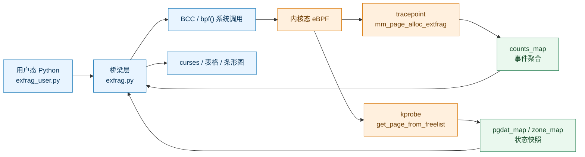
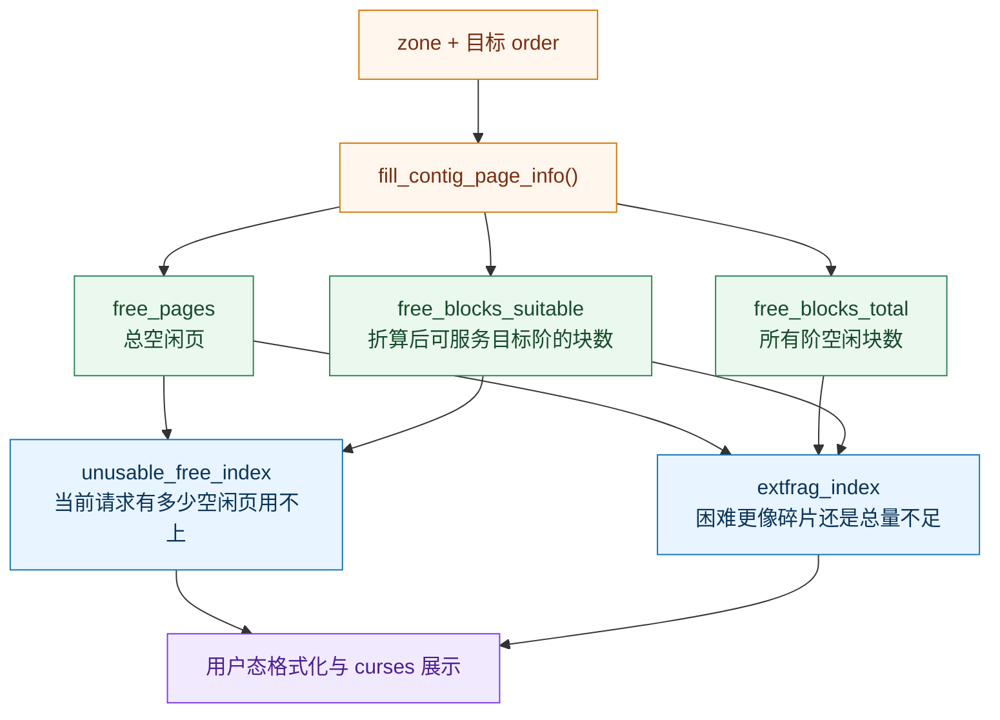

# 学习总览与架构地图

<!-- WIKI_NAV_START -->
> [!info] 物理内存 Wiki 导航
> [[projects/Linux物理内存检测项目/index|项目首页]] · [[2.1 项目概述与价值|下一篇：2.1 项目概述与价值 →]]
<!-- WIKI_NAV_END -->

> **入口页** · 先看这页建立地图，再按薄弱点进入专题。当前 wiki 以“源码事实可校验、执行链路可追踪、指标可以手算、知识可以闭卷重建”为验收标准。

<table>
<tr><td><strong>项目定位</strong></td><td>BCC/eBPF 采集 Linux 物理内存碎片状态与外碎片事件，Python/curses 在终端展示。</td></tr>
<tr><td><strong>学习重点</strong></td><td>伙伴系统、order/zone/node、tracepoint/kprobe、BPF map、两个碎片化指数、Python 数据适配。</td></tr>
<tr><td><strong>事实边界</strong></td><td>始终区分“上游内核机制”“项目设计意图”“当前源码实际行为”。当前源码仍有路径、节流、兼容性和并发风险。</td></tr>
</table>

## 一张图看懂运行链路

记忆句：**Python 负责装载与展示，eBPF 负责在内核现场采集，map 负责双向传递配置和结果。**

## 按什么顺序学习

| 学习阶段 | 入口页面 | 学完要能回答 |
|---|---|---|
| 1. 建立动机与事实边界 | [[projects/Linux物理内存检测项目/2 快速入门/2.1 项目概述与价值|项目概述与价值]] → [[projects/Linux物理内存检测项目/4 深度学习/4.1 源码审计与事实边界|源码审计与事实边界]] | 这个工具测什么？当前版本哪些命令还不能直接运行？ |
| 2. 建立内存模型 | [[projects/Linux物理内存检测项目/3 深入理解/3.2 内存管理核心概念/3.2.1 Linux物理内存与伙伴系统|Linux物理内存与伙伴系统]] → [[projects/Linux物理内存检测项目/3 深入理解/3.2 内存管理核心概念/3.2.2 内存碎片化问题分析|内存碎片化问题分析]] | 为什么总空闲页很多，仍可能无法完成高阶分配？ |
| 3. 读懂采集层 | [[projects/Linux物理内存检测项目/3 深入理解/3.3 eBPF程序深度解析/3.3.1 tracepoint探针机制|tracepoint探针机制]] → [[projects/Linux物理内存检测项目/3 深入理解/3.3 eBPF程序深度解析/3.3.2 kprobe动态插桩技术|kprobe动态插桩技术]] → [[projects/Linux物理内存检测项目/3 深入理解/3.3 eBPF程序深度解析/3.3.3 BPF map通信机制|BPF map通信机制]] | 两个挂点各自观察什么？数据经过哪些 map？ |
| 4. 读懂指标 | [[projects/Linux物理内存检测项目/3 深入理解/3.4 数据采集与处理/3.4.2 内存状态统计方法|内存状态统计方法]] → [[projects/Linux物理内存检测项目/3 深入理解/3.4 数据采集与处理/3.4.3 碎片化指数计算算法|碎片化指数计算算法]] | `free_blocks_suitable` 为什么要折算高阶块？两个指数如何配合？ |
| 5. 串起用户态 | [[projects/Linux物理内存检测项目/3 深入理解/3.5 用户态展示与优化/3.5.1 curses终端可视化实现|curses终端可视化实现]] → [[projects/Linux物理内存检测项目/3 深入理解/3.5 用户态展示与优化/3.5.3 数据解析与格式化输出|数据解析与格式化输出]] | Python 是采集层还是适配/展示层？ |
| 6. 验收与迁移 | [[projects/Linux物理内存检测项目/4 深度学习/4.2 主动学习与推演/4.2.1 全链路手工追踪|全链路手工追踪]] → [[projects/Linux物理内存检测项目/4 深度学习/4.2 主动学习与推演/4.2.2 深度学习路线与VCQ诊断|深度学习路线与VCQ诊断]] → [[projects/Linux物理内存检测项目/4 深度学习/4.3 实战重构与面试追问|实战重构与面试追问]] | 不看文档能否画链路、手算、改一个变体并说明取舍？ |

## 指标关系图：不要把两个分数混成一个“碎片率”

核心区分：`unusable_free_index` 更像“当前请求有多难”，`extfrag_index` 更像“困难是否主要由外部碎片造成”。

## 每个专题页都用同一套读法

1. **本页目标**：先知道要解决哪个真实问题。
2. **心智模型**：把抽象结构映射到伙伴系统或数据通道。
3. **代码地标**：定位到函数、map、字段或关键分支。
4. **手工追踪**：用具体输入走完一次状态变化。
5. **故意改坏**：预测删除/替换一行后的失败形态。
6. **闭卷验收**：用自己的话讲清楚，并能迁移到新场景。

## 开始前的 VCQ 五问

请先不要查答案，直接用自己的话回答：

1. 这个工具到底检测什么？为什么“空闲内存还很多”仍可能分配失败？
2. 从 `exfrag_user.py` 启动到 eBPF 被触发，中间至少经过哪些步骤？
3. `mm_page_alloc_extfrag` 和 `get_page_from_freelist` 各自位于什么观察视角？
4. `counts_map`、`pgdat_map`、`zone_map`、`delay_map`、`last_time_map` 分别存什么？
5. `free_blocks_total`、`free_blocks_suitable`、`free_pages` 如何共同进入两个指数？

根据答案进入 [[4.2.2 深度学习路线与VCQ诊断|深度学习路线与VCQ诊断]]：能画链路就跳过基础，讲不清字段/map/公式就回到对应专题做手算和变体题。

## 下一步

- 想先理解“为什么”：读 [[4.2.3 核心难点精讲|核心难点精讲]]。
- 想先读代码：读 [[4.2.1 全链路手工追踪|全链路手工追踪]]。
- 想准备面试或继续改造：读 [[4.3 实战重构与面试追问|实战重构与面试追问]]。

<!-- WIKI_FOOTER_START -->
---
> [!tip] 继续阅读
> [[projects/Linux物理内存检测项目/index|项目首页]] · [[2.1 项目概述与价值|下一篇：2.1 项目概述与价值 →]]
<!-- WIKI_FOOTER_END -->
