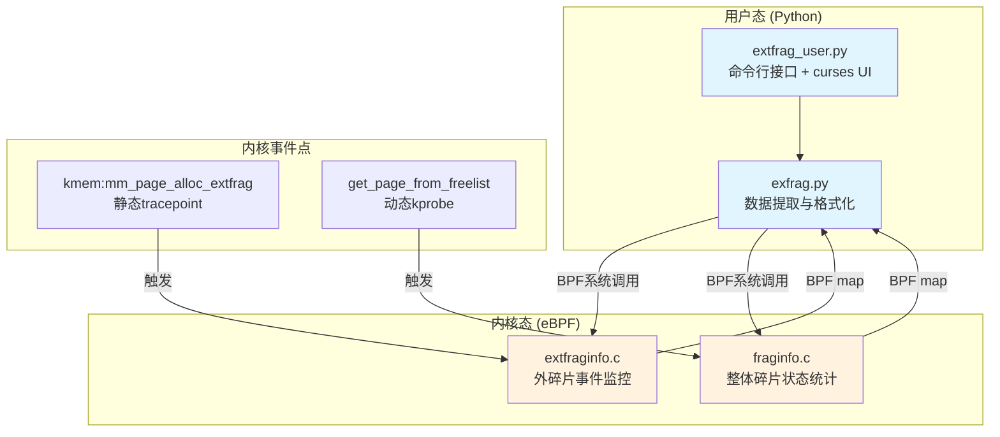

# 项目概述与价值

<!-- WIKI_NAV_START -->
> [!info] 物理内存 Wiki 导航
> [[projects/Linux物理内存检测项目/index|项目首页]] · [[1.1 学习总览与架构地图|← 上一篇：1.1 学习总览与架构地图]] · [[2.2 快速搭建与运行|下一篇：2.2 快速搭建与运行 →]]
<!-- WIKI_NAV_END -->

本页是项目动机与定位页；建议先从 [[1.1 学习总览与架构地图|学习总览与架构地图]] 建立整张地图，再回到本页理解为什么要做这个工具。

本页面为“快速入门”的起点。新版 wiki 建议先走这条主线：

1. 本页建立项目动机；
2. [[4.1 源码审计与事实边界|源码审计与事实边界]] 区分内核机制、设计意图和当前实现；
3. [[4.2.3 核心难点精讲|核心难点精讲]] 深挖五个高频卡点；
4. [[4.2.1 全链路手工追踪|全链路手工追踪]] 完成代码与指标推演；
5. [[4.2.2 深度学习路线与VCQ诊断|深度学习路线与 VCQ 诊断]] 根据自己的薄弱点动态复习；
6. [[4.3 实战重构与面试追问|实战重构与面试追问]] 做闭卷重建。

当前仓库更适合定位为**包含完整技术主线、但仍有可运行性和正确性缺口的教学原型**。学习价值很高，但不能在未修复、未基准测试前直接宣称生产可用。

## 项目核心定位

**本项目是一个基于 BCC/eBPF 的 Linux 物理内存碎片实时监控和终端可视化工具**。它不是用于查看"内存使用了多少"，而是专注于回答一个更关键的问题：

**系统还能不能顺利分出大块连续物理内存？**

在实际生产环境中，常常出现这样的现象：系统总空闲内存看起来充足，但高阶连续页已经无法满足需求。这种"明明有空闲页，却分配不出大块连续内存"的情况，正是本项目要监控和诊断的核心目标。传统工具如 `/proc/buddyinfo` 主要提供静态文本快照，缺乏直观性和实时性，而本项目通过 eBPF 技术实现内核级实时采集，再配合 Python curses 实现终端可视化，为系统管理员和开发人员提供了更强大的碎片化分析能力。

Sources: [[1.1 学习总览与架构地图|linux-ebpf内存碎片监控复习.md]]

## 项目解决的核心问题

Linux 系统长时间运行后，物理内存会因频繁分配和释放而逐渐碎片化。这种碎片化会导致以下典型问题：

| 问题现象 | 根本原因 | 本项目解决方案 |
|---------|---------|--------------|
| 系统空闲内存充足但分配失败 | 空闲页被打散，无法拼出大块连续页 | 实时监控 `extfrag_index` 和 `unusable_index` 指数 |
| 高阶内存分配性能下降 | 内核需要降级分配（fallback） | 通过 `mm_page_alloc_extfrag` 事件捕获降级行为 |
| 内存分配延迟增加 | 碎片化导致需要更复杂的分配策略 | 监控 `get_page_from_freelist` 快速路径效率 |
| 系统稳定性风险 | 碎片化严重时可能导致分配失败 | 提供可视化预警和诊断数据 |

Sources: `linux物理内存检测工具原作者开发文档.md#L155-L176`

## 项目整体架构

本项目采用标准的**"内核态采集 + 用户态展示"**双层架构设计：



**架构执行流程**：Python 执行 → 通过系统调用进入内核 → 内核执行到目标函数跳到 eBPF 执行 → 收集数据共享给应用。这种设计确保了监控的实时性和低侵入性。

Sources: `简述.md#L26-L29`

## 核心功能特性

本项目提供了以下核心功能，满足不同场景下的内存碎片化监控需求：

### 外碎片化事件实时捕获

通过挂载 `kmem:mm_page_alloc_extfrag` tracepoint，当内存分配因碎片化需要降级（fallback）时触发捕获。记录的关键信息包括：

| 字段 | 说明 | 意义 |
|------|------|------|
| `PFN` | 实际分配的物理页帧号 | 标识分配的物理内存位置 |
| `ALLOC_ORDER` | 初始请求的内存阶数 | 反映原始分配需求 |
| `FALLBACK_ORDER` | 实际分配的内存阶数 | 反映降级程度 |
| `COUNT` | 外碎片化事件次数 | 量化碎片化频率 |

Sources: `extfraginfo.c#L20-L59`

### 整体碎片状态统计

通过挂载 `get_page_from_freelist` kprobe，在内存分配快速路径上收集所有内存节点和区域的碎片化状态。支持计算两个关键指数：

- **`extfrag_index`（标准碎片化指数）**：衡量碎片化程度的核心指标
- **`unusable_index`（不可用页指数）**：衡量不可用内存比例


Sources: `fraginfo.c#L91-L168`

### 终端可视化展示

使用 Python curses 库实现终端界面可视化，支持以下展示模式：

- **表格模式**：展示详细的 zone 信息、节点信息和碎片化指数
- **条形图模式**：直观显示碎片化程度
- **实时更新**：可配置的采样间隔（默认2秒）
- **多维度筛选**：支持按节点、区域名称等条件过滤

Sources: `exfrag_user.py#L1-L200`

## 项目文件结构

本项目由4个核心文件组成，各文件职责清晰分离：

| 文件 | 类型 | 职责 | 关键技术 |
|------|------|------|----------|
| `extfraginfo.c` | 内核态eBPF | 监控外碎片化事件 | Tracepoint探针 |
| `fraginfo.c` | 内核态eBPF | 统计整体碎片状态 | kprobe动态插桩 |
| `exfrag.py` | 用户态Python | 数据提取与格式化 | BCC Python API |
| `exfrag_user.py` | 用户态Python | 命令行接口与UI | curses可视化 |

**文件依赖关系**：
```
exfrag_user.py → exfrag.py → extfraginfo.c / fraginfo.c
     ↓              ↓              ↓
  命令行界面    数据处理层      内核数据采集
```

Sources: `linux物理内存检测工具原作者开发文档.md#L14-L22`

## 项目价值总结

本项目在以下场景中具有重要价值：

| 应用场景 | 价值体现 | 典型用户 |
|---------|---------|---------|
| 系统性能调优 | 识别碎片化热点，指导内存优化策略 | 系统管理员、性能工程师 |
| 故障诊断 | 定位内存分配失败的根本原因 | 运维工程师、开发人员 |
| 容量规划 | 评估内存碎片化趋势，预测扩容需求 | 架构师、运维规划人员 |
| 内核研究 | 理解伙伴系统和内存分配机制 | 内核开发者、研究人员 |
| 面试准备 | 深入掌握Linux内存管理和eBPF技术 | 求职者、技术面试官 |

Sources: `linux物理内存检测工具原作者开发文档.md#L177-L248`

## 快速体验指引

如果你已经准备好开始实践，建议按以下路径进行：


1. **环境准备**：确保系统支持 eBPF 和 BCC，详见 [[2.2 快速搭建与运行|快速搭建与运行]]
2. **运行工具**：执行 `sudo python3 exfrag_user.py -h` 查看帮助，体验基本功能
3. **深入学习**：理解 eBPF 技术栈和内存管理原理，详见 [[3.1.1 eBPF与BCC技术栈|eBPF与BCC技术栈]]

Sources: `简述.md#L1-L29`

## 推荐学习路径

基于本项目的知识体系，建议按以下顺序深入学习：

| 阶段 | 学习内容 | 对应页面 |
|------|---------|---------|
| 快速入门 | 项目概述、环境搭建 | [[projects/Linux物理内存检测项目/2 快速入门/2.1 项目概述与价值|项目概述与价值]]、[[projects/Linux物理内存检测项目/2 快速入门/2.2 快速搭建与运行|快速搭建与运行]] |
| 核心技术 | eBPF技术栈、内核态程序设计 | [[projects/Linux物理内存检测项目/3 深入理解/3.1 核心技术架构/3.1.1 eBPF与BCC技术栈|eBPF与BCC技术栈]]、[[projects/Linux物理内存检测项目/3 深入理解/3.1 核心技术架构/3.1.2 内核态eBPF程序设计|内核态eBPF程序设计]] |
| 内存管理 | 伙伴系统、碎片化原理 | [[projects/Linux物理内存检测项目/3 深入理解/3.2 内存管理核心概念/3.2.1 Linux物理内存与伙伴系统|Linux物理内存与伙伴系统]]、[[projects/Linux物理内存检测项目/3 深入理解/3.2 内存管理核心概念/3.2.2 内存碎片化问题分析|内存碎片化问题分析]] |
| 数据采集 | tracepoint、kprobe、BPF map | [[projects/Linux物理内存检测项目/3 深入理解/3.3 eBPF程序深度解析/3.3.1 tracepoint探针机制|tracepoint探针机制]]、[[projects/Linux物理内存检测项目/3 深入理解/3.3 eBPF程序深度解析/3.3.2 kprobe动态插桩技术|kprobe动态插桩技术]] |
| 可视化展示 | curses实现、性能优化 | [[projects/Linux物理内存检测项目/3 深入理解/3.5 用户态展示与优化/3.5.1 curses终端可视化实现|curses终端可视化实现]]、[[projects/Linux物理内存检测项目/3 深入理解/3.5 用户态展示与优化/3.5.2 性能优化与采样控制|性能优化与采样控制]] |

<!-- WIKI_FOOTER_START -->
---
> [!tip] 继续阅读
> [[projects/Linux物理内存检测项目/index|项目首页]] · [[1.1 学习总览与架构地图|← 上一篇：1.1 学习总览与架构地图]] · [[2.2 快速搭建与运行|下一篇：2.2 快速搭建与运行 →]]
<!-- WIKI_FOOTER_END -->
