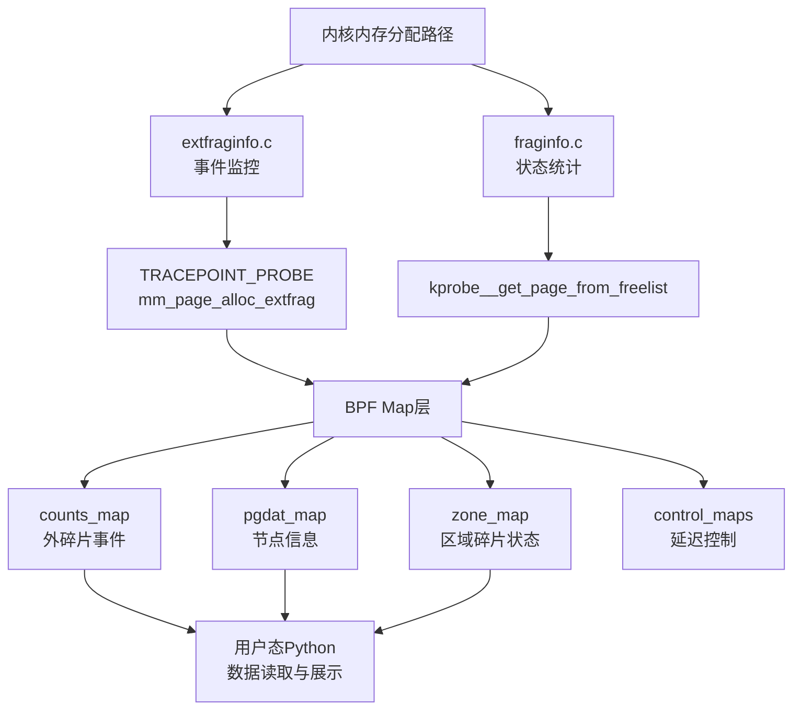
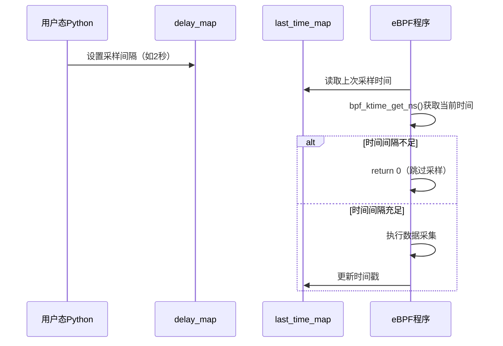

# 内核态eBPF程序设计

<!-- WIKI_NAV_START -->
> [!info] 物理内存 Wiki 导航
> [[projects/Linux物理内存检测项目/index|项目首页]] · [[3.1.1 eBPF与BCC技术栈|← 上一篇：3.1.1 eBPF与BCC技术栈]] · [[3.1.3 用户态Python架构|下一篇：3.1.3 用户态Python架构 →]]
<!-- WIKI_NAV_END -->

> **源码事实优先。** 两份 C 文件体现了完整的原型思路，但当前时间 map 没有形成有效节流闭环：`fraginfo.c` 用每次变化的时间戳作 key，`extfraginfo.c` 还缺少更新时间戳。下文出现的“周期采样/低开销”应理解为设计目标，具体问题与修正模型见 [[4.1 源码审计与事实边界|源码审计与事实边界]]。

内核态eBPF程序是Linux物理内存碎片检测系统的核心数据采集层，负责在内核运行时捕获内存分配事件和计算碎片化指标。本文将深入剖析两个关键的eBPF程序——`extfraginfo.c`和`fraginfo.c`，详细解析其架构设计、数据结构、探针机制以及算法实现。

## 内核态eBPF程序架构概览

整个内核态eBPF程序采用"事件驱动+周期采样"的双模式设计，通过两个独立的.c文件实现不同的监控策略。



Sources: `extfraginfo.c#L1-L60`, `fraginfo.c#L1-L168`

两个程序的设计理念互补：`extfraginfo.c`专注于捕获**具体的外碎片化事件**（当内存分配降级时触发），而`fraginfo.c`则负责**周期性地扫描系统中所有内存区域的碎片化状态**。这种设计使得系统既能捕获瞬时事件，又能获得整体状态视图。

Sources: `linux物理内存检测工具原作者开发文档.md#L19-L21`

## 核心数据结构设计

内核态eBPF程序使用精心设计的C语言结构体来组织采集到的内存碎片化信息，这些结构体直接映射到内核内部数据结构。

### extfraginfo.c 的数据结构

```c
struct data_t {
    u64 pfn;              // 物理页帧号
    int alloc_order;      // 请求的分配阶数
    int fallback_order;   // fallback freelist 中找到的空闲块阶数
    pid_t pid;            // 进程PID
    u64 count;            // 外碎片事件计数
    char pcomm[32];       // 进程名称
};
```

Sources: `extfraginfo.c#L7-L14`

### fraginfo.c 的数据结构

```c
struct pgdat_info {
    u64 pgdat_ptr;        // pgdat起始页帧号
    int nr_zones;         // 包含的zone数量
    int node_id;          // NUMA节点ID
};

struct zone_info {
    u64 zone_ptr;                 // zone指针地址
    u64 zone_start_pfn;           // zone起始页帧号
    u64 spanned_pages;            // spanned页面数
    u64 present_pages;            // 实际存在的页面数
    unsigned long free_pages;     // 空闲页面总数
    unsigned long free_blocks_total; // 空闲块总数
    unsigned long free_blocks_suitable; // 适合当前order的空闲块数
    char name[32];                // zone名称（如"DMA", "Normal"）
    int order;                    // 当前统计的order值
    int score_a;                  // extfrag_index碎片化指数
    int score_b;                  // unusable_free_index不可用内存指数
    int node_id;                  // 所属NUMA节点ID
};
```

Sources: `fraginfo.c#L8-L27`

这些结构体的设计体现了**按需采集**的原则：`data_t`专注于事件详情，而`pgdat_info`和`zone_info`则提供系统级的内存布局视图。结构体字段直接对应Linux内核的内存管理概念，便于后续分析。

Sources: `linux物理内存检测工具原作者开发文档.md#L83-L96`

## BPF Map 通信机制

BPF Map是连接内核态eBPF程序与用户态Python程序的核心数据通道。本项目使用了两种类型的BPF Map：**BPF_HASH**用于存储动态数据，**BPF_ARRAY**用于存储固定大小的控制数据。

### 结果数据Map

```c
// extfraginfo.c
BPF_HASH(counts_map, pid_t, struct data_t);  // 进程PID -> 外碎片事件数据

// fraginfo.c
BPF_HASH(pgdat_map, u64, struct pgdat_info); // pgdat指针 -> 节点信息
BPF_HASH(zone_map, u64, struct zone_info);   // zone指针+order -> 区域碎片信息
```

### 控制数据Map

```c
// 两个程序共用的控制Map
BPF_HASH(last_time_map, u64, u64);  // 上次采样时间戳
BPF_ARRAY(delay_map, int, 1);       // 采样间隔（秒）
```

Sources: `extfraginfo.c#L16-L18`, `fraginfo.c#L43-L46`

### Map键值设计策略

| Map名称 | 键类型 | 值类型 | 设计目的 |
|---------|--------|--------|----------|
| `counts_map` | `pid_t` | `data_t` | 按进程聚合外碎片事件，便于分析哪些进程触发了内存分配降级 |
| `pgdat_map` | `u64` (pgdat指针) | `pgdat_info` | 避免重复采集同一NUMA节点的信息 |
| `zone_map` | `u64` (zone指针+order) | `zone_info` | 为每个zone的每个order维护独立的碎片化指标 |
| `delay_map` | `int` (固定键0) | `int` | 用户态可动态调整采样间隔 |
| `last_time_map` | `u64` (固定键) | `u64` | 实现采样频率控制 |

这种Map键值设计确保了**数据的高效组织和快速检索**，同时避免了不必要的重复计算。

Sources: [[1.1 学习总览与架构地图|linux-ebpf内存碎片监控复习.md]]

## 探针机制：Tracepoint vs Kprobe

两个eBPF程序采用了不同的探针机制，体现了**静态追踪与动态追踪**的互补设计。

### extfraginfo.c：Tracepoint探针

```c
TRACEPOINT_PROBE(kmem, mm_page_alloc_extfrag) {
    // 当内核发生外碎片化内存分配时自动触发
    // args->pfn, args->alloc_order, args->fallback_order 来自内核tracepoint定义
}
```

**Tracepoint的优势**：
- **稳定性**：Tracepoint是内核稳定的追踪点，接口不易变化
- **低开销**：静态编译到内核中，触发时几乎无额外开销
- **精确事件**：`mm_page_alloc_extfrag`专门在内存分配降级（fallback）时触发

Sources: `extfraginfo.c#L20`, [[1.1 学习总览与架构地图|linux-ebpf内存碎片监控复习.md]]

### fraginfo.c：Kprobe动态插桩

```c
int kprobe__get_page_from_freelist(struct pt_regs *ctx, gfp_t gfp_mask,
                                   unsigned int order, int alloc_flags,
                                   const struct alloc_context *ac) {
    // 当内核调用get_page_from_freelist函数时触发
    // 可以获取完整的函数参数，包括alloc_context中的zonelist信息
}
```

**Kprobe的优势**：
- **灵活性**：可以插桩任何内核函数，不限于预定义的tracepoint
- **参数访问**：能够获取函数的完整参数，包括复杂的内核数据结构
- **时机选择**：在内存分配快速路径（fast path）入口处触发，能观察到分配决策过程

Sources: `fraginfo.c#L91-L93`, `linux物理内存检测工具原作者开发文档.md#L99-L116`

### 探针选择策略对比

| 特性 | Tracepoint (extfraginfo.c) | Kprobe (fraginfo.c) |
|------|---------------------------|---------------------|
| **触发时机** | 事件发生时（内存分配降级） | 函数调用时（分配路径入口） |
| **稳定性** | 高（内核稳定接口） | 中（依赖函数签名） |
| **性能开销** | 低 | 中 |
| **数据完整性** | 事件特定参数 | 函数完整参数 |
| **适用场景** | 监控特定事件 | 监控函数调用过程 |

Sources: [[1.1 学习总览与架构地图|linux-ebpf内存碎片监控复习.md]]

## 时间过滤与采样控制机制

为了平衡监控精度和系统性能，两个eBPF程序都实现了**基于时间的采样频率控制**。

### 双Map时间控制设计

```c
// 时间控制的核心逻辑（两个程序相同）
u64 *last_time, current_time;
current_time = bpf_ktime_get_ns();  // 获取当前时间（纳秒精度）
last_time = last_time_map.lookup(&current_time);

int key = 0;
int *delay_ptr = delay_map.lookup(&key);
int delay;
if (delay_ptr) {
    delay = *delay_ptr;
}

// 如果距离上次采样时间不足delay秒，则跳过本次采样
if (last_time && (current_time - *last_time < delay * 1000000000)) {
    return 0;
}

// 采样完成后更新时间戳
last_time_map.update(&current_time, &current_time);
```

Sources: `extfraginfo.c#L21-L32`, `fraginfo.c#L94-L105`

### 采样控制的工作流程



这种设计确保了：
1. **用户可控性**：通过`delay_map`，用户态可以动态调整采样频率
2. **性能保护**：避免高频触发导致的系统性能下降
3. **时间精度**：使用纳秒级时间戳，确保精确的时间控制

Sources: `linux物理内存检测工具原作者开发文档.md#L76-L80`

## 碎片化指数计算算法

`fraginfo.c`实现了两个关键的碎片化指数算法，这些算法直接借鉴了Linux内核的内存碎片化评估逻辑。

### unusable_free_index 计算

```c
static int unusable_free_index(unsigned int order,
                               struct contig_page_info *info) {
    if (info->free_pages == 0)
        return 1000;  // 无空闲页面，返回最大值
    return div_u64(
        (info->free_pages - (info->free_blocks_suitable << order)) * 1000ULL,
        info->free_pages);
}
```

**算法含义**：
- 衡量**无法用于当前order分配的空闲内存比例**
- 返回值范围：0-1000（千分比），1000表示所有空闲内存都无法使用
- 计算公式：`(总空闲页 - 适合当前order的页) / 总空闲页 * 1000`

Sources: `fraginfo.c#L48-L55`

### extfrag_index 计算

```c
static int __fragmentation_index(unsigned int order,
                                 struct contig_page_info *info) {
    unsigned long requested = 1UL << order;
    if (WARN_ON_ONCE(order > MAX_ORDER))
        return 0;
    if (!info->free_blocks_total)
        return 0;  // 无空闲块
    if (info->free_blocks_suitable)
        return -1000;  // 有适合的块，碎片化程度最低
    return 1000 -
           div_u64((1000 + (div_u64(info->free_pages * 1000ULL, requested))),
                   info->free_blocks_total);
}
```

**算法含义**：
- 衡量**内存碎片化的整体程度**
- 返回值范围：-1000 到 1000
  - -1000：有适合的连续块，碎片化程度最低
  - 0：中性值
  - 1000：严重碎片化
- 计算公式基于空闲页面的分布情况

Sources: `fraginfo.c#L57-L69`

### fill_contig_page_info 数据收集

```c
static void fill_contig_page_info(struct zone *zone,
                                  unsigned int suitable_order,
                                  struct contig_page_info *info) {
    unsigned int order;
    info->free_pages = 0;
    info->free_blocks_total = 0;
    info->free_blocks_suitable = 0;
    for (order = 0; order <= MAX_ORDER; order++) {
        unsigned long blocks;
        unsigned long nr_free;
        bpf_probe_read_kernel(&nr_free, sizeof(nr_free),
                              &zone->free_area[order].nr_free);
        blocks = nr_free;
        info->free_blocks_total += blocks;
        info->free_pages += blocks << order;
        if (order >= suitable_order)
            info->free_blocks_suitable += blocks << (order - suitable_order);
    }
}
```

**关键点**：
- 遍历从order 0到MAX_ORDER（10）的所有空闲链表
- 使用`bpf_probe_read_kernel`安全读取内核数据结构
- 统计三个关键指标：总空闲块数、总空闲页数、适合当前order的块数

Sources: `fraginfo.c#L71-L89`

## 内核数据采集与安全读取

eBPF程序在内核态运行，必须使用安全的辅助函数来访问内核数据结构，避免直接指针解引用导致的内核崩溃。

### bpf_probe_read_kernel 的使用

```c
// 读取zone->free_area[order].nr_free
bpf_probe_read_kernel(&nr_free, sizeof(nr_free),
                      &zone->free_area[order].nr_free);

// 读取zone名称字符串
bpf_probe_read_kernel_str(&zone_data.name, sizeof(zone_data.name), z->name);
```

**安全读取的重要性**：
1. **防止内核崩溃**：eBPF验证器会检查内存访问的安全性
2. **处理无效指针**：即使指针无效，`bpf_probe_read_kernel`也会返回错误而非崩溃
3. **跨版本兼容**：保护eBPF程序免受内核数据结构布局变化的影响

Sources: `fraginfo.c#L81-L82`, `fraginfo.c#L145`

### 辅助函数使用总结

| 辅助函数 | 用途 | 使用场景 |
|---------|------|----------|
| `bpf_ktime_get_ns()` | 获取纳秒级时间戳 | 时间过滤控制 |
| `bpf_get_current_pid_tgid()` | 获取当前进程PID和线程组ID | 进程关联 |
| `bpf_get_current_comm()` | 获取当前进程名称 | 进程标识 |
| `bpf_probe_read_kernel()` | 安全读取内核内存 | 数据采集 |
| `bpf_probe_read_kernel_str()` | 安全读取内核字符串 | 字符串字段 |

Sources: `extfraginfo.c#L35-L46`, `fraginfo.c#L95-L96`

## 内存区域遍历策略

`fraginfo.c`中的`kprobe__get_page_from_freelist`函数实现了对系统内存区域的全面遍历。

### 遍历流程

```c
pgdat = ac->preferred_zoneref->zone->zone_pgdat;

for (i = 0; i < MAX_NR_ZONES; i++) {
    struct zone_info zone_data = {};
    struct pgdat_info pgdat_data = {};
    struct pgdat_info *a_pgdat;
    struct pglist_data *pgdata;
    u64 node_key, zone_key;
    
    // 从zonelist中获取zone引用
    zref = &pgdat->node_zonelists[ZONELIST_FALLBACK]._zonerefs[i];
    z = zref->zone;
    if (!z)
        continue;  // 跳过无效的zone
    
    // 更新节点信息
    pgdata = z->zone_pgdat;
    if (!pgdata)
        continue;
    
    // ... 更新pgdat_map和zone_map ...
    
    // 遍历所有order（0-10）
    for (a_order = 0; a_order <= MAX_ORDER; ++a_order) {
        // 计算每个order的碎片化指标
        // 更新zone_map
    }
}
```

Sources: `fraginfo.c#L107-L165`

### 遍历策略的特点

1. **基于alloc_context**：从内存分配上下文中获取初始的zonelist，确保遍历的是分配路径会考虑的区域
2. **完整的zone覆盖**：遍历`MAX_NR_ZONES`个可能的zone，包括DMA、DMA32、Normal等
3. **多order分析**：为每个zone计算0-10所有order的碎片化指标
4. **增量更新**：使用`pgdat_map`避免重复处理已知节点

Sources: `linux物理内存检测工具原作者开发文档.md#L123-L126`

## 性能优化与设计考量

### 采样频率控制

- **默认采样间隔**：2秒（可配置）
- **时间过滤**：避免高频触发导致的CPU开销
- **用户态控制**：通过`delay_map`实现动态调整

### 内存使用优化

- **哈希表设计**：`BPF_HASH`自动处理键冲突和内存管理
- **结构体大小**：精心设计结构体字段，避免不必要的内存开销
- **数据聚合**：`counts_map`按PID聚合事件，减少map条目数量

### 安全性与稳定性

- **eBPF验证器**：所有eBPF程序都经过内核验证器的严格检查
- **安全内存访问**：使用`bpf_probe_read_kernel`系列函数
- **边界检查**：算法中包含必要的边界条件检查

Sources: `extfraginfo.c#L21-L32`, `fraginfo.c#L94-L105`

## 用户态与内核态数据流

整个系统的数据流设计体现了清晰的**分层架构**：


1. **内核态采集**：eBPF程序在内核事件触发时执行
2. **BPF Map存储**：数据存储在内核与用户态共享的BPF Map中
3. **用户态读取**：Python通过BCC库读取BPF Map数据
4. **数据处理**：`extfrag.py`负责数据格式化和计算
5. **可视化展示**：`exfrag_user.py`实现curses终端UI

Sources: `exfrag.py#L7-L23`, `linux物理内存检测工具原作者开发文档.md#L127-L153`

## 内核态eBPF程序设计总结

### 设计模式总结

| 设计方面 | extfraginfo.c | fraginfo.c |
|---------|---------------|------------|
| **探针类型** | Tracepoint | Kprobe |
| **监控目标** | 外碎片化事件 | 内存区域状态 |
| **数据组织** | 按进程聚合 | 按zone+order组织 |
| **触发条件** | 事件发生 | 函数调用 |
| **采集频率** | 事件驱动 | 周期采样 |
| **算法复杂度** | 低 | 高（多order遍历） |

### 关键设计决策

1. **双程序分离**：事件监控与状态统计分离，职责清晰
2. **Map键值优化**：精心设计的键值确保数据高效组织
3. **时间过滤机制**：平衡监控精度与系统性能
4. **安全内存访问**：使用eBPF辅助函数确保内核安全
5. **算法借鉴**：碎片化指数计算借鉴内核成熟算法

### 技术优势

- **低侵入性**：eBPF程序对系统性能影响极小
- **实时性**：能够捕获瞬时的内存分配事件
- **灵活性**：用户态可动态调整采样参数
- **安全性**：eBPF验证器保证程序安全性
- **可扩展性**：基于BPF Map的架构易于扩展新的监控指标

内核态eBPF程序设计展示了如何利用现代Linux内核的eBPF技术实现高效、安全的系统监控。通过合理的探针选择、数据结构设计和算法实现，本项目为物理内存碎片化监控提供了可靠的内核级数据采集基础。

<!-- WIKI_FOOTER_START -->
---
> [!tip] 继续阅读
> [[projects/Linux物理内存检测项目/index|项目首页]] · [[3.1.1 eBPF与BCC技术栈|← 上一篇：3.1.1 eBPF与BCC技术栈]] · [[3.1.3 用户态Python架构|下一篇：3.1.3 用户态Python架构 →]]
<!-- WIKI_FOOTER_END -->
