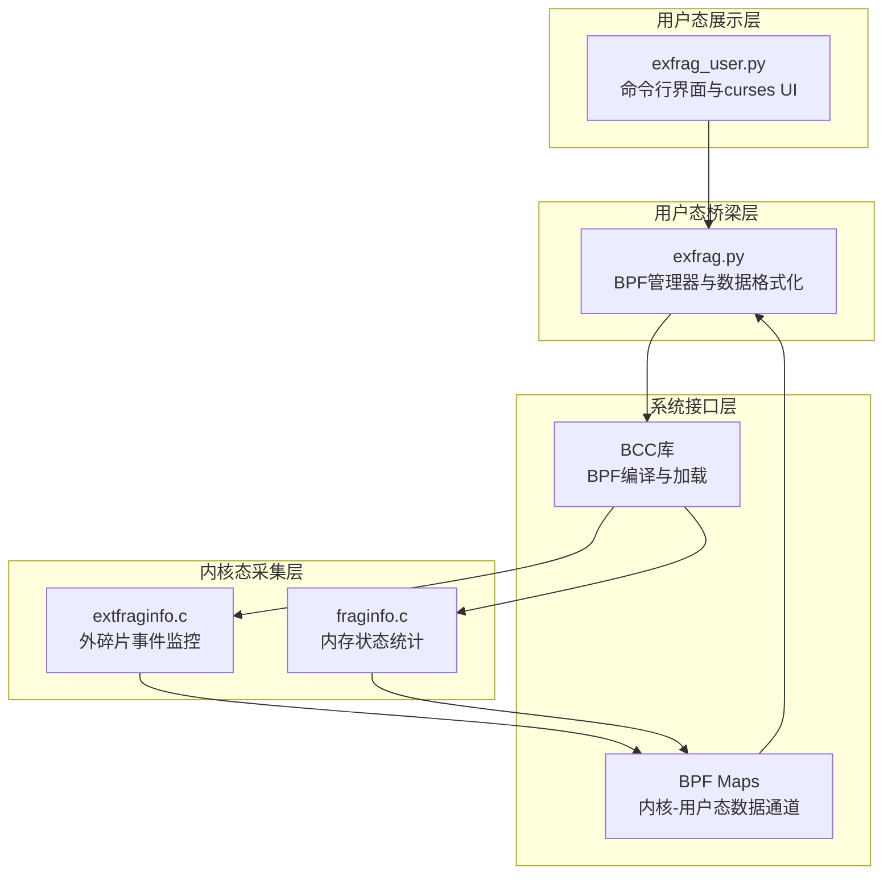
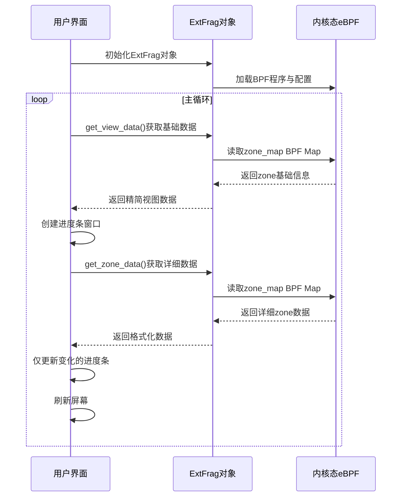
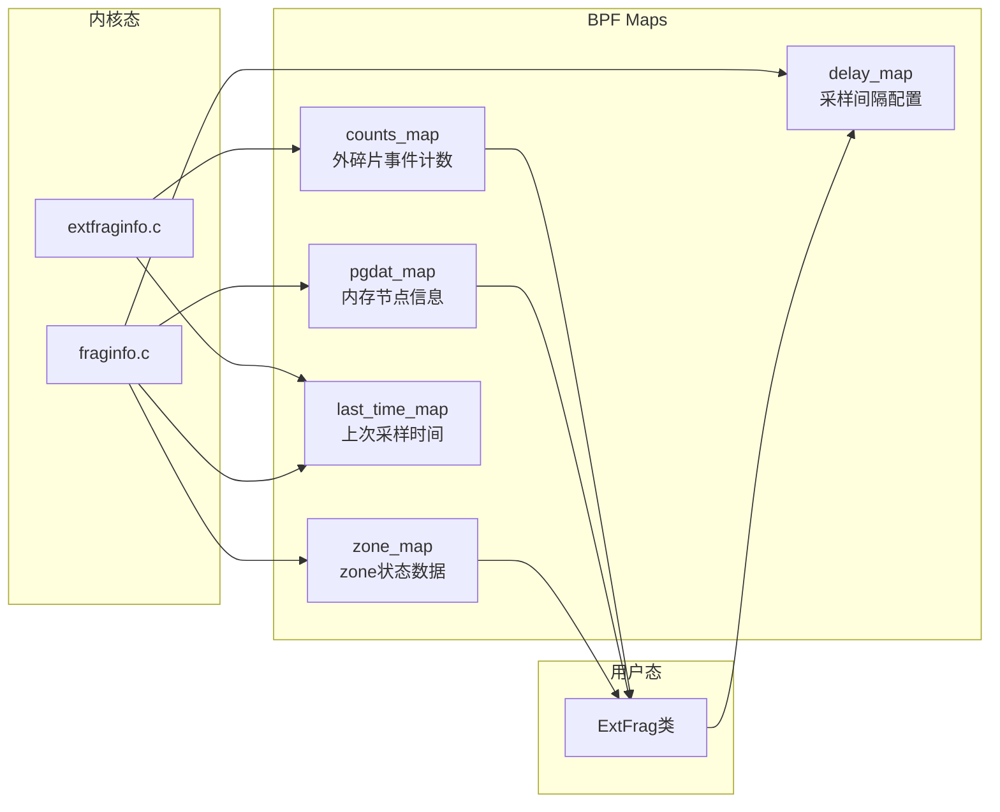

# 用户态Python架构

<!-- WIKI_NAV_START -->
> [!info] 物理内存 Wiki 导航
> [[projects/Linux物理内存检测项目/index|项目首页]] · [[3.1.2 内核态eBPF程序设计|← 上一篇：3.1.2 内核态eBPF程序设计]] · [[3.2.1 Linux物理内存与伙伴系统|下一篇：3.2.1 Linux物理内存与伙伴系统 →]]
<!-- WIKI_NAV_END -->

> **当前快照有启动阻断项。** `exfrag_user.py` 写的是 `from extfrag import ExtFrag`，实际文件名为 `exfrag.py`；`exfrag.py` 又加载当前目录不存在的 `./bpf/*.c`。本页先用于理解职责分层，运行前按 [[4.1 源码审计与事实边界|源码审计与事实边界]] 修复并验证。

用户态Python架构是Linux物理内存碎片检测工具的上层组件，目标是加载eBPF内核程序、读取采集数据、处理格式化输出以及提供交互式终端可视化界面。该架构由两个核心Python文件构成：`exfrag.py`（桥梁层）和`exfrag_user.py`（命令行界面）。

## 架构层次与组件关系

用户态Python架构采用经典的三层架构模式，实现了内核态数据采集与用户态展示的有效解耦。



**层次职责说明**：
- **展示层**（exfrag_user.py）：处理命令行参数、初始化curses终端、管理UI刷新循环
- **桥梁层**（exfrag.py）：封装BPF程序加载、提供数据读取接口、实现数据格式化转换
- **采集层**（extfraginfo.c/fraginfo.c）：在内核态执行实际的内存碎片检测与数据采集
- **系统接口层**：BCC库负责eBPF程序的编译与加载，BPF Maps作为内核态与用户态的数据共享通道

Sources: `exfrag.py#L1-L155`, `exfrag_user.py#L1-L423`, `linux物理内存检测工具原作者开发文档.md#L1-L50`

## 核心组件：ExtFrag类

`ExtFrag`类是用户态Python架构的核心桥梁组件，位于`exfrag.py`文件中。它封装了BPF程序的生命周期管理、数据读取逻辑以及数据格式化转换功能。

### 类结构与初始化

`ExtFrag`类通过构造函数接收配置参数，并根据参数选择加载不同的eBPF程序：

```python
class ExtFrag:
    def __init__(self, interval=2, output_extfrag_index=False, 
                 output_unusable_index=False, output_count=False, zone_info=False):
        self.interval = interval
        # 根据参数选择eBPF程序
        if self.output_count:
            self.b = BPF(src_file="./bpf/extfraginfo.c")  # 外碎片事件监控
        else:
            self.b = BPF(src_file="./bpf/fraginfo.c")     # 内存状态统计
        
        # 通过BPF Map传递采样间隔参数
        delay_key = 0
        self.b["delay_map"][delay_key] = ctypes.c_int(interval)
```

**关键设计决策**：
1. **动态程序加载**：根据监控需求（外碎片事件统计 vs 内存状态统计）加载不同的eBPF程序
2. **参数传递机制**：通过`delay_map` BPF数组将采样间隔参数传递给内核态程序
3. **配置封装**：将配置参数封装为类属性，便于在数据读取方法中使用

Sources: `exfrag.py#L7-L23`

### 数据读取接口设计

`ExtFrag`类提供多个数据读取接口，分别对应不同类型的数据查询需求：

| 方法名 | 数据源 | 返回格式 | 主要用途 |
|--------|--------|----------|----------|
| `get_zone_data()` | `zone_map` | 字典按comm分组，每个comm对应zone列表 | 获取各zone的详细内存状态与碎片化指数 |
| `get_view_data()` | `zone_map` | 字典按(node_id, comm)排序 | 获取可视化视图所需的精简数据 |
| `get_node_data()` | `pgdat_map` | 字典按node_id索引 | 获取内存节点信息 |
| `get_count_data()` | `counts_map` | 列表按count降序排序 | 获取外碎片事件统计 |

**数据读取模式**：
所有数据读取方法遵循统一的模式：
1. 从对应的BPF Map中迭代所有键值对
2. 解码二进制字符串（如进程名、zone名称）
3. 应用过滤条件（如指定节点ID）
4. 构建结构化数据字典或列表
5. 返回格式化后的数据

Sources: `exfrag.py#L35-L148`

## 命令行界面架构

`exfrag_user.py`实现了完整的命令行界面，包含参数解析、UI初始化、数据展示循环等核心功能。

### 参数解析与配置管理

命令行界面支持丰富的参数选项，通过字典统一管理：

```python
args = {
    'delay': 2,              # 更新延迟（秒）
    'node_info': False,      # 显示节点信息
    'node_id': None,         # 指定节点ID过滤
    'comm': None,            # 按zone名称过滤
    'extfrag_index': False,  # 仅显示extfrag_index
    'unusable_index': False, # 仅显示unusable_index
    'output_count': False,   # 输出事件计数
    'bar': False,            # 显示碎片化条形图
    'zone_info': False,      # 显示详细zone信息
    'view': False            # 显示可视化视图
}
```

**参数验证机制**：
- 使用循环遍历参数，识别不支持的参数
- 对需要后续参数的选项（如`-d`、`-i`、`-c`）进行格式验证
- 在屏幕不足时显示错误信息并等待用户调整

Sources: `exfrag_user.py#L87-L200`

### 终端UI初始化

curses终端UI的初始化包含颜色配置、窗口属性设置等关键步骤：

```python
def main(screen):
    # 隐藏光标，设置非阻塞模式
    curses.curs_set(0)
    screen.nodelay(True)
    curses.noecho()
    curses.cbreak()
    
    # 初始化颜色对（用于不同状态的高亮显示）
    curses.init_pair(1, curses.COLOR_BLACK, curses.COLOR_BLACK)  # 背景色
    curses.init_pair(2, curses.COLOR_RED, curses.COLOR_BLACK)    # 高风险警告
    curses.init_pair(3, curses.COLOR_GREEN, curses.COLOR_BLACK)  # 正常状态
    curses.init_pair(4, curses.COLOR_BLUE, curses.COLOR_BLACK)   # 表头
```

**屏幕自适应处理**：
- 定义`screenEnough()`函数检查屏幕尺寸（最小要求：50行×250列）
- 在屏幕不足时显示错误信息，等待用户调整窗口大小
- 支持键盘中断（Ctrl+C）安全退出

Sources: `exfrag_user.py#L68-L84`, `exfrag_user.py#L42-L67`

## 数据展示模式

命令行界面支持多种数据展示模式，每种模式对应不同的参数组合和UI布局。

### 主要展示模式对比

| 模式 | 参数组合 | 显示内容 | 刷新机制 |
|------|----------|----------|----------|
| **节点信息模式** | `-n` | NODE_ID、zone数量、起始PFN | 固定延迟刷新 |
| **事件计数模式** | `-s` | COMM、PID、PFN、分配阶数、计数 | 固定延迟刷新 |
| **详细zone模式** | `-z` | 完整zone信息与碎片化指数 | 固定延迟刷新 |
| **可视化视图模式** | `-v` | 进度条显示的碎片化程度 | 增量更新（仅值变化时刷新） |
| **默认模式** | 无参数 | zone名称、节点ID、阶数、碎片化指数 | 固定延迟刷新 |

**可视化条形图生成**：
```python
def generate_fragmentation_bar(score, max_length=20):
    """生成用于显示碎片化程度的条形图"""
    proportion = min(max(score, 0), 1)
    bar_length = int(proportion * max_length)
    return '#' * bar_length + '-' * (max_length - bar_length)
```

Sources: `exfrag_user.py#L10-L14`, `exfrag_user.py#L214-L406`

### 可视化视图模式实现

可视化视图模式（`-v`参数）采用特殊的增量更新机制，通过curses窗口实现进度条显示：



**增量更新优化**：
- 使用字典`current_progress`记录每个进度条的当前值
- 仅在值发生变化时更新对应的进度条窗口
- 通过`createBar()`和`setProgress()`函数管理进度条的创建与更新

Sources: `exfrag_user.py#L307-L359`, `exfrag_user.py#L15-L40`

## 数据流与内存映射机制

用户态Python架构通过BPF Maps实现与内核态的数据交换，形成了高效的数据流通道。

### BPF Maps通信架构



**Maps类型与用途**：
1. **BPF_HASH**：用于存储键值对数据（如`counts_map`、`pgdat_map`、`zone_map`）
2. **BPF_ARRAY**：用于存储固定大小数组（如`delay_map`）
3. **数据流向**：内核态程序写入Maps，用户态Python程序读取Maps

Sources: `extfraginfo.c#L16-L18`, `fraginfo.c#L43-L46`

### 数据格式化处理

`ExtFrag`类中的数据格式化方法确保内核态原始数据能够正确转换为用户态可读格式：

1. **字符串解码**：
   ```python
   comm = value.name.decode('utf-8', 'replace').rstrip('\x00')
   pcomm = value.pcomm.decode('utf-8', 'replace').rstrip('\x00')
   ```

2. **数值转换**：
   ```python
   def calculate_scoreA(self, extfrag_index):
       extfrag_index_int_part = int(extfrag_index) // 1000
       extfrag_index_dec_part = int(extfrag_index) % 1000
       return f"{extfrag_index_int_part:2d}.{extfrag_index_dec_part:03d}"
   ```

3. **结构化数据组装**：
   ```python
   data = {
       'comm': comm,
       'zone_pfn': value.zone_start_pfn,
       'spanned_pages': value.spanned_pages,
       'present_pages': value.present_pages,
       'order': value.order,
       'free_blocks_total': value.free_blocks_total,
       'free_blocks_suitable': value.free_blocks_suitable,
       'free_pages': value.free_pages,
       'scoreA': self.calculate_scoreA(value.score_a),
       'scoreB': self.calculate_scoreB(value.score_b),
       'node_id': value.node_id
   }
   ```

Sources: `exfrag.py#L25-L63`

## 性能优化与采样控制

用户态Python架构实现了多级性能优化机制，确保监控过程不会对系统性能造成显著影响。

### 采样频率控制

采样频率通过`delay_map` BPF Map传递给内核态程序，内核态程序使用时间戳比较实现频率限制：

```c
// 内核态采样频率控制逻辑
u64 *last_time, current_time;
current_time = bpf_ktime_get_ns();
last_time = last_time_map.lookup(&current_time);
int key = 0;
int *delay_ptr = delay_map.lookup(&key);
int delay;
if (delay_ptr) {
    delay = *delay_ptr;
}
if (last_time && (current_time - *last_time < delay * 1000000000)) {
    return 0;  // 未达到采样间隔，跳过本次执行
}
```

**采样间隔配置**：
- 默认采样间隔：2秒
- 可通过`-d`参数自定义
- 传递机制：Python → `delay_map` BPF Array → 内核态程序

Sources: `extfraginfo.c#L20-L32`, `fraginfo.c#L91-L105`

### UI刷新优化

不同展示模式采用不同的刷新策略以优化性能：

1. **固定延迟刷新**：大多数模式使用`time.sleep(args['delay'])`控制刷新频率
2. **增量更新**：可视化视图模式仅在数据变化时更新UI元素
3. **屏幕边界检查**：防止UI元素超出屏幕边界导致的渲染错误

```python
# 屏幕边界检查示例
if row < max_rows - 1:  # 确保不超出屏幕行数
    if len(line) < max_cols - 1:  # 确保行内字符数不超出屏幕宽度
        screen.addstr(row, 0, line, color)
        row += 1
    else:
        screen.addstr(row, 0, line[:max_cols - 1], color)
        row += 1
```

Sources: `exfrag_user.py#L299-L305`, `exfrag_user.py#L407-L411`

## 架构优势与设计模式

用户态Python架构体现了多个优秀的设计原则和模式，确保了代码的可维护性、可扩展性和性能。

### 核心设计模式

1. **分层架构**：明确分离展示层、业务逻辑层和数据访问层
2. **模板方法模式**：数据读取方法遵循统一的迭代-过滤-格式化模式
3. **策略模式**：不同展示模式对应不同的参数配置和UI渲染逻辑
4. **观察者模式**：可视化视图模式监听数据变化并增量更新UI

### 架构优势

1. **关注点分离**：数据采集（eBPF）与数据展示（Python curses）完全解耦
2. **配置驱动**：通过参数配置控制监控行为和展示内容
3. **性能优化**：多级采样控制和增量更新机制减少系统开销
4. **可扩展性**：新增展示模式或数据源只需扩展相应的方法和参数
5. **用户友好**：丰富的参数选项和多种展示模式满足不同使用场景

**架构局限性**：
- 依赖BCC库，需要在支持BCC的Linux环境中运行
- 终端UI依赖curses库，在非终端环境（如管道、重定向）中表现受限
- 所有数据展示基于文本，缺乏图形化界面支持

## 下一步学习建议

基于用户态Python架构的理解，建议按以下顺序深入学习相关主题：

1. **[[3.1.1 eBPF与BCC技术栈|eBPF与BCC技术栈]]**：深入理解BCC库如何编译和加载eBPF程序
2. **[[3.1.2 内核态eBPF程序设计|内核态eBPF程序设计]]**：了解`extfraginfo.c`和`fraginfo.c`的内核态实现细节
3. **[[3.3.3 BPF map通信机制|BPF map通信机制]]**：深入理解内核态与用户态的数据交换机制
4. **[[3.5.1 curses终端可视化实现|curses终端可视化实现]]**：详细了解终端UI的实现细节
5. **[[3.5.3 数据解析与格式化输出|数据解析与格式化输出]]**：学习数据格式化和输出的最佳实践

<!-- WIKI_FOOTER_START -->
---
> [!tip] 继续阅读
> [[projects/Linux物理内存检测项目/index|项目首页]] · [[3.1.2 内核态eBPF程序设计|← 上一篇：3.1.2 内核态eBPF程序设计]] · [[3.2.1 Linux物理内存与伙伴系统|下一篇：3.2.1 Linux物理内存与伙伴系统 →]]
<!-- WIKI_FOOTER_END -->
