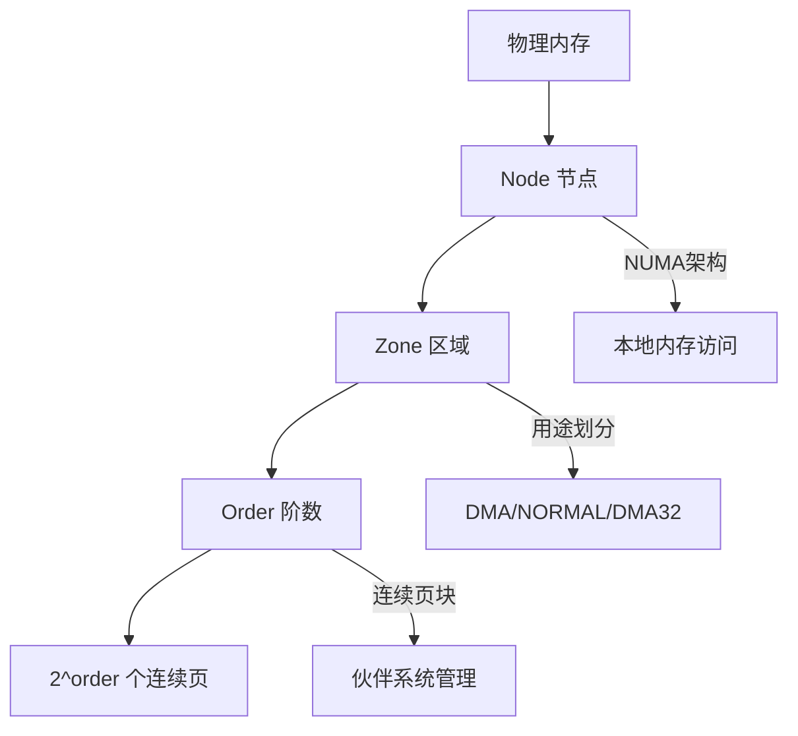
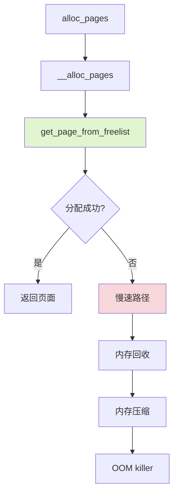

# Linux物理内存与伙伴系统

> [!abstract] 🎬 交互动画
> 👉 [**打开内存层次结构 & 伙伴系统动画**](animations/buddy-system-animation.html)
> 包含：Node→Zone→Order 层次可视化 · Order 滑块探索 · 伙伴系统分配/释放演示 · 拆分合并动画

<!-- WIKI_NAV_START -->
> [!info] 物理内存 Wiki 导航
> [[projects/Linux物理内存检测项目/index|项目首页]] · [[3.1.3 用户态Python架构|← 上一篇：3.1.3 用户态Python架构]] · [[3.2.2 内存碎片化问题分析|下一篇：3.2.2 内存碎片化问题分析 →]]
<!-- WIKI_NAV_END -->

Linux物理内存管理是操作系统内核中最核心且复杂的子系统之一。本页将深入解析Linux物理内存的组织方式、伙伴系统的工作原理，以及它们如何与内存碎片化问题紧密关联。理解这些基础概念是掌握物理内存碎片检测工具的关键前提。

## 物理内存基本单位：页与页框

Linux内核以**页（Page）**为基本单位管理物理内存，而非直接按字节操作。每个物理页框（Page Frame）都有一个唯一的编号，称为**PFN（Page Frame Number）**，它标识了该页在物理内存中的位置。

在我们的监控工具中，PFN相关字段频繁出现：
- `PFN`：单次外碎片化事件中实际分配到的物理页位置
- `ZONE_PFN`：内存区域（zone）的起始页框号
- `NODE_START_PFN`：内存节点（node）的起始页框号

这些字段反映了工具对物理内存位置的关注，因为内存碎片化问题本质上就是物理页分布不连续的问题。

Sources: [[1.1 学习总览与架构地图|linux-ebpf内存碎片监控复习.md]]

## 内存层次结构：Node、Zone与Order

Linux物理内存采用三级层次结构进行组织：



### Node（节点）
在NUMA（非统一内存访问）架构中，物理内存被划分为多个节点。每个节点代表一个内存访问延迟相对一致的区域，通常对应一个CPU插槽或一个内存控制器。工具通过`pgdat_info`结构体记录节点信息：
```c
struct pgdat_info {
    u64 pgdat_ptr;    // NUMA节点指针
    int nr_zones;     // 节点包含的zone数量
    int node_id;      // NUMA节点ID
};
```

### Zone（区域）
每个节点内部进一步按用途划分为不同的区域：
- **DMA**：直接内存访问区域，通常位于物理内存前16MB
- **DMA32**：32位DMA可访问的区域
- **NORMAL**：普通内存区域，内核可直接映射
- **HIGHMEM**（仅32位系统）：需要特殊映射的高端内存

工具通过`zone_info`结构体详细记录每个区域的状态，包括名称、起始页框号、总页数等。

Sources: [[1.1 学习总览与架构地图|linux-ebpf内存碎片监控复习.md]]

### Order（阶数）
Order表示连续页块的大小，关系为**2^order个页**：
- `order=0`：1页（通常4KB）
- `order=1`：2页（8KB）
- `order=2`：4页（16KB）
- `order=10`：1024页（4MB）

高阶分配更依赖大块连续物理内存，因此更容易受到内存碎片化的影响。这正是我们的监控工具重点关注不同order下内存状态的原因。

Sources: [[1.1 学习总览与架构地图|linux-ebpf内存碎片监控复习.md]]

## 伙伴系统（Buddy System）核心原理

伙伴系统是Linux内核管理物理内存分配的核心算法，其设计目标是高效分配和释放连续物理页块。

### 基本思想
1. **空闲块组织**：系统将所有空闲物理页按order组织成不同的链表，每个链表管理特定大小的连续页块
2. **分配策略**：当请求`2^order`个连续页时，系统首先在order对应的链表中查找
3. **拆分机制**：如果找不到合适大小的块，系统会从更高阶的链表中取出一个大块，然后拆分成两个"伙伴"块
4. **合并机制**：当释放页块时，如果其"伙伴"块也空闲，系统会将它们合并成更大的块

### 工作流程示例
假设请求order=2（4页）的内存：
1. 首先检查order=2的空闲链表
2. 如果没有，则检查order=3的链表
3. 找到一个order=3的块（8页）后，将其拆分成两个order=2的块
4. 分配其中一个，另一个放回order=2的链表

这种机制能有效减少外部碎片，但随着系统运行时间增长，仍然会出现碎片化问题。

Sources: [[1.1 学习总览与架构地图|linux-ebpf内存碎片监控复习.md]]

## 内存分配路径：快速路径与慢速路径

Linux内核的内存分配遵循特定的调用路径：



### 快速路径（Fast Path）
快速路径的核心函数是`get_page_from_freelist()`，它尝试从空闲内存链表中快速分配物理页面。这个函数是伙伴系统的"第一道防线"，也是我们监控工具的主要监控点之一。

### 慢速路径（Slow Path）
当快速路径分配失败时，内核会进入慢速路径，执行更复杂的内存管理操作：
1. **内存回收**：释放可回收的页面缓存和匿名页
2. **内存压缩**：将分散的页面移动到一起，创建更大的连续块
3. **OOM Killer**：在内存极度紧张时，终止占用内存最多的进程

我们的工具监控`get_page_from_freelist()`正是为了了解快速路径的成功率，从而评估内存碎片化的严重程度。

Sources: [[1.1 学习总览与架构地图|linux-ebpf内存碎片监控复习.md]]

## 外部碎片与内部碎片

理解碎片化类型对于内存监控至关重要：

### 外部碎片（External Fragmentation）
**定义**：空闲内存仍然存在，但被分散在不连续的位置，无法拼凑出足够大的连续块来满足大内存请求。

**特征**：
- 总空闲内存足够，但连续大块内存不足
- 高阶（high-order）分配失败的主要原因
- 伙伴系统试图通过合并机制缓解，但无法完全避免

**工具关注点**：我们的项目主要监控外部碎片化，因为它直接关系到大内存分配的可行性。

### 内部碎片（Internal Fragmentation）
**定义**：分配出去的内存块中，实际使用的部分小于分配的大小，导致块内部空间浪费。

**特征**：
- 发生在已分配的内存块内部
- SLAB/SLUB分配器主要优化此类碎片
- 与伙伴系统管理的页级碎片不同

### 与SLAB/SLUB的关系
- **伙伴系统**：管理页级分配，处理外部碎片
- **SLAB/SLUB**：建立在伙伴系统之上，管理小对象分配，优化内部碎片

两者协同工作：SLAB/SLUB向伙伴系统申请大页，然后分割成小对象分配给内核组件。

Sources: [[1.1 学习总览与架构地图|linux-ebpf内存碎片监控复习.md]]

## 伙伴系统在监控工具中的体现

我们的监控工具直接针对伙伴系统的关键数据结构进行采集：

### free_area数组
Linux内核在每个zone中维护一个`free_area[MAX_ORDER]`数组，每个元素对应一个order的空闲链表：
- `zone->free_area[order].nr_free`：该order下空闲块的数量
- 通过`bpf_probe_read_kernel()`安全读取

### 关键统计指标
工具通过`fill_contig_page_info()`函数遍历所有order，统计：
- `free_pages`：所有空闲页的总数
- `free_blocks_total`：所有order空闲块的总数
- `free_blocks_suitable`：满足当前order请求的连续块数（高阶块会折算）

这些统计数据是计算碎片化指数的基础。

Sources: `fraginfo.c#L71-L89`

## 内存分配上下文：alloc_context

当内核进行内存分配时，会传递一个`alloc_context`结构体，包含分配所需的所有上下文信息：

```c
struct alloc_context {
    struct zonelist *zonelist;           // 可分配zone列表
    nodemask_t *nodemask;               // 允许的NUMA节点掩码
    struct zoneref *preferred_zoneref;  // 首选zone引用
    int migratetype;                    // 页面迁移类型
    enum zone_type highest_zoneidx;    // 最高可用zone类型索引
    bool spread_dirty_pages;            // 是否分散脏页
};
```

这个结构体决定了内存分配的策略，包括NUMA亲和性、迁移类型等。我们的监控工具通过kprobe捕获这个结构体，从而了解分配决策的上下文。

Sources: `linux物理内存检测工具原作者开发文档.md#L311-L329`

## 碎片化评估指标

基于伙伴系统的统计数据，工具计算两个关键的碎片化指标：

### extfrag_index（外部碎片化指数）
计算公式：`1000 - ((1000 + (free_pages * 1000 / requested)) / free_blocks_total)`

**取值范围**：-1000到1000
- **负值**：表示存在足够大的连续块，分配容易
- **正值**：需要拆分更高阶块，反映外部碎片化程度
- **接近1000**：高碎片化
- **接近0**：低碎片化

### unusable_free_index（不可用页指数）
计算公式：`(free_pages - (free_blocks_suitable << order)) * 1000 / free_pages`

**取值范围**：0到1000
- 表示因碎片化无法满足当前order请求的空闲页比例
- 值越高，碎片化越严重

这两个指标从不同角度评估碎片化：extfrag_index关注"连续性"，unusable_free_index关注"可用性"。

Sources: `linux物理内存检测工具原作者开发文档.md#L542-L599`

## 与项目监控的关联

理解Linux物理内存和伙伴系统，是理解我们监控工具的基础：

1. **监控目标**：工具直接监控伙伴系统的核心函数`get_page_from_freelist()`
2. **数据采集**：从`alloc_context`、`zone`结构、`free_area`数组中采集关键数据
3. **问题诊断**：通过碎片化指标评估内存分配的健康状况
4. **优化指导**：为内存压缩、分配策略调整提供数据支持

伙伴系统的状态直接反映了物理内存的碎片化程度，而我们的工具正是通过eBPF技术实时观察这个系统的运行状态。

Sources: `fraginfo.c#L91-L168`

## 总结

Linux物理内存与伙伴系统构成了内存管理的基石。页、页框、PFN提供了物理内存的基本抽象；Node、Zone、Order建立了层次化的管理结构；伙伴系统通过拆分和合并机制高效管理连续页块；快速路径和慢速路径形成了完整的内存分配流程。

理解这些概念不仅有助于掌握内存碎片化问题的本质，也是理解我们基于eBPF的物理内存碎片检测工具的关键。在后续的文档中，我们将深入探讨内存碎片化问题的具体分析和检测方法。

## 下一步学习

建议继续阅读以下相关页面，以深入理解内存碎片化的检测和分析：
- [[3.2.2 内存碎片化问题分析|内存碎片化问题分析]]：深入了解碎片化成因、影响和解决方案
- [[3.2.3 内存分配快速路径监控|内存分配快速路径监控]]：具体了解如何监控`get_page_from_freelist()`函数
- [[3.1.1 eBPF与BCC技术栈|eBPF与BCC技术栈]]：了解监控工具的技术实现基础

<!-- WIKI_FOOTER_START -->
---
> [!tip] 继续阅读
> [[projects/Linux物理内存检测项目/index|项目首页]] · [[3.1.3 用户态Python架构|← 上一篇：3.1.3 用户态Python架构]] · [[3.2.2 内存碎片化问题分析|下一篇：3.2.2 内存碎片化问题分析 →]]
<!-- WIKI_FOOTER_END -->
