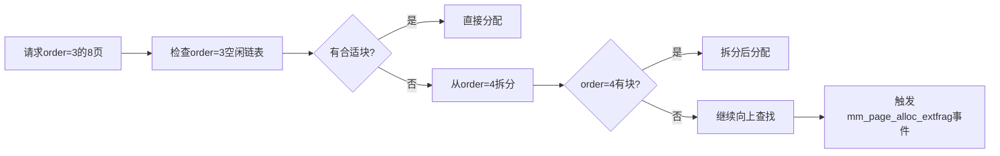

# 内存碎片化问题分析

<!-- WIKI_NAV_START -->
> [!info] 物理内存 Wiki 导航
> [[projects/Linux物理内存检测项目/index|项目首页]] · [[3.2.1 Linux物理内存与伙伴系统|← 上一篇：3.2.1 Linux物理内存与伙伴系统]] · [[3.2.3 内存分配快速路径监控|下一篇：3.2.3 内存分配快速路径监控 →]]
<!-- WIKI_NAV_END -->

本页面深入分析Linux物理内存碎片化问题的本质、成因、影响及检测机制。通过理解碎片化问题的核心原理，为后续的eBPF监控程序设计和实现提供理论基础。

## 内存碎片化的本质与定义

**内存碎片化**是指物理内存中的空闲区域无法满足特定大小连续内存请求的现象。这种现象的核心矛盾在于：系统总空闲内存可能足够，但大块连续物理页却无法分配。

在Linux内存管理中，碎片化主要分为两类：

| 类型 | 定义 | 影响 | 本项目关注程度 |
|------|------|------|----------------|
| **外部碎片** | 空闲页被打散，无法拼出大块连续页 | 高阶分配失败、降级、性能下降 | **主要关注** |
| **内部碎片** | 已分配块内部未完全利用 | 内存利用率降低 | 次要关注 |

本项目主要关注**外部碎片**，因为它直接关系到系统能否顺利分配大块连续物理内存。当外部碎片严重时，即使系统总空闲内存充足，也可能出现高阶分配失败的情况。

Sources: [[1.1 学习总览与架构地图|linux-ebpf内存碎片监控复习.md]]

## 伙伴系统与内存分配机制

Linux内核使用**伙伴系统（Buddy System）**管理物理内存。伙伴系统的核心思想是将空闲内存按`2^order`页组织成不同大小的块：

- `order=0`：1页（4KB）
- `order=1`：2页（8KB）
- `order=2`：4页（16KB）
- `order=10`：1024页（4MB）

内存分配的基本流程如下：


`get_page_from_freelist()`是伙伴系统快速路径的核心函数。当请求的`order`对应空闲链表中有合适块时，直接分配成功；否则需要从更高阶拆分或进入慢速路径。

Sources: [[1.1 学习总览与架构地图|linux-ebpf内存碎片监控复习.md]]

## 碎片化问题的成因分析

内存碎片化的产生主要源于以下几个因素：

### 频繁的内存分配与释放

系统长时间运行过程中，不同大小的内存块被频繁分配和释放。这种动态变化导致空闲内存块逐渐分散，难以形成大块连续空间。

### 不同迁移类型的内存混合

Linux内核将内存按迁移类型分类（如`Moveable`、`Unmoveable`、`Reclaimable`）。当不同类型内存混合时，会影响内存的合并效率。

### 高阶分配的降级需求

当请求的`order`对应空闲块不足时，系统会尝试从更高阶拆分，触发`mm_page_alloc_extfrag`事件。这种降级分配是碎片化影响的直接体现。



Sources: [[1.1 学习总览与架构地图|linux-ebpf内存碎片监控复习.md]]

## 碎片化问题的检测指标

本项目使用两个核心指标来量化内存碎片化程度：

### 不可用内存指数（unusable_free_index）

该指数衡量的是**无法被当前order请求使用的空闲内存比例**。计算公式为：

```c
unusable_free_index = (free_pages - (free_blocks_suitable << order)) * 1000 / free_pages
```

其中：
- `free_pages`：总空闲页数
- `free_blocks_suitable`：适合当前order请求的空闲块数（按高阶块折算）
- `order`：请求的连续页块阶数

当`free_pages`为0时，返回1000表示完全不可用。该指数越高，表示空闲内存中可用于当前order分配的比例越低。

Sources: `fraginfo.c#L48-L55`

### 碎片化指数（extfrag_index）

该指数衡量的是**内存碎片化的严重程度**。计算公式为：

```c
if (!free_blocks_total) return 0;
if (free_blocks_suitable) return -1000;
return 1000 - (1000 + (free_pages * 1000 / requested)) / free_blocks_total;
```

其中：
- `requested`：请求的连续页数（`1UL << order`）
- `free_blocks_total`：总空闲块数
- `free_blocks_suitable`：适合当前order的空闲块数

该指数的特殊之处在于：
- 当存在适合当前order的块时，直接返回-1000，表示碎片化程度很低
- 当没有适合的块时，指数越高表示碎片化越严重

Sources: `fraginfo.c#L57-L69`

## 碎片化检测的双探针架构

本项目采用双探针架构来全面监控内存碎片化问题：

### 事件型探针：mm_page_alloc_extfrag

**触发时机**：当内存分配因碎片化需要降级（fallback）时触发。

**监控内容**：
- `COMM`：触发事件的进程名
- `PID`：进程号
- `PFN`：分配的物理页帧号
- `ALLOC_ORDER`：原始请求的阶数
- `FALLBACK_ORDER`：从 fallback migratetype 找到的空闲块阶数
- `COUNT`：事件累计次数

**设计特点**：
- 使用`tracepoint`机制，稳定性高
- 按PID聚合事件，便于责任定位
- 通过`delay_map`和`last_time_map`控制采样频率

```c
TRACEPOINT_PROBE(kmem, mm_page_alloc_extfrag) {
    // 时间过滤逻辑
    pid_t pid = bpf_get_current_pid_tgid() >> 32;
    // 从args获取事件字段
    zero.pfn = args->pfn;
    zero.alloc_order = args->alloc_order;
    zero.fallback_order = args->fallback_order;
    // 按PID聚合更新counts_map
}
```

Sources: `extfraginfo.c#L20-L59`

### 状态型探针：get_page_from_freelist

**触发时机**：每次内核进行页分配、尝试快速路径时触发。

**监控内容**：
- **节点信息**：`NODE_ID`、`Number of Zones`、`NODE_START_PFN`
- **区域信息**：`ZONE_COMM`、`ZONE_PFN`、`SUM_PAGES`、`FACT_PAGES`
- **order维度状态**：`ORDER`、`TOTAL`、`SUITABLE`、`FREE`、`extfrag_index`、`unusable_index`

**设计特点**：
- 使用`kprobe`机制，可深入内核函数内部
- 遍历所有node和zone，统计各order维度状态
- 计算两个碎片化指数，提供全面的健康报告

```c
int kprobe__get_page_from_freelist(struct pt_regs *ctx, gfp_t gfp_mask,
                                   unsigned int order, int alloc_flags,
                                   const struct alloc_context *ac) {
    // 时间过滤逻辑
    // 遍历所有zonelist
    for (i = 0; i < MAX_NR_ZONES; i++) {
        // 更新node和zone信息
        for (a_order = 0; a_order <= MAX_ORDER; ++a_order) {
            // 统计各order维度状态
            // 计算碎片化指数
        }
    }
}
```

Sources: `fraginfo.c#L91-L168`

## 双探针的互补关系

两个探针不是重复监控，而是互补的：

| 探针 | 类型 | 视角 | 回答的问题 |
|------|------|------|------------|
| `mm_page_alloc_extfrag` | 事件型 | 故障单 | **问题已经发生给谁了？** |
| `get_page_from_freelist` | 状态型 | 体检报告 | **系统为什么会出这个问题？** |

**事件型探针**记录碎片化已经影响分配的具体事件，提供故障定位信息。

**状态型探针**监控当前系统各zone在不同order下的整体状态，提供健康诊断信息。

这种设计使得工具既能定位问题责任，又能理解问题根源。

Sources: [[1.1 学习总览与架构地图|linux-ebpf内存碎片监控复习.md]]

## 碎片化问题的实际影响

严重的内存碎片化会导致以下问题：

### 高阶分配失败
当系统无法提供足够大的连续物理内存时，高阶分配请求会失败，导致：
- 内核模块加载失败
- 设备驱动无法分配DMA缓冲区
- 大页（HugePage）分配失败

### 性能下降
即使分配最终成功，碎片化也会导致：
- 需要进入慢速路径，增加延迟
- 触发内存回收和压缩，消耗CPU资源
- 降低内存访问局部性，影响缓存效率

### 系统稳定性风险
极端情况下，碎片化可能导致：
- 关键进程因内存分配失败而崩溃
- 系统响应变慢，用户体验下降
- 需要重启系统来恢复内存布局

## 碎片化检测工具的应用场景

本工具适用于以下场景：

### 生产环境监控
- 长期运行的服务器内存健康监控
- 容器化环境中的内存碎片化检测
- 关键业务系统的内存性能优化

### 性能问题诊断
- 系统响应变慢时的内存分析
- 内存分配失败原因的定位
- 内存回收和压缩频率异常的分析

### 系统优化指导
- 内存分配策略的调整依据
- 内存压缩参数的优化参考
- 系统负载规划的内存容量评估

## 总结

内存碎片化问题是Linux系统长时间运行后不可避免的现象。通过理解碎片化的本质、成因和影响，我们可以：

1. **正确认识问题**：区分外部碎片和内部碎片，理解高阶分配失败的根本原因
2. **掌握检测方法**：使用`unusable_free_index`和`extfrag_index`两个指标量化碎片化程度
3. **理解监控架构**：掌握双探针（事件型+状态型）的互补监控设计
4. **应用解决方案**：基于监控数据，采取内存压缩、调整分配策略等优化措施

这种系统性的分析方法为后续的eBPF程序设计和实现提供了坚实的理论基础。

<!-- WIKI_FOOTER_START -->
---
> [!tip] 继续阅读
> [[projects/Linux物理内存检测项目/index|项目首页]] · [[3.2.1 Linux物理内存与伙伴系统|← 上一篇：3.2.1 Linux物理内存与伙伴系统]] · [[3.2.3 内存分配快速路径监控|下一篇：3.2.3 内存分配快速路径监控 →]]
<!-- WIKI_FOOTER_END -->
