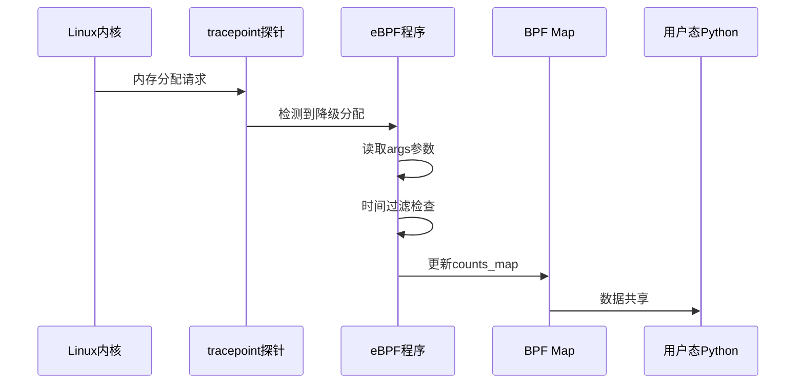

# tracepoint探针机制

<!-- WIKI_NAV_START -->
> [!info] 物理内存 Wiki 导航
> [[projects/Linux物理内存检测项目/index|项目首页]] · [[3.2.3 内存分配快速路径监控|← 上一篇：3.2.3 内存分配快速路径监控]] · [[3.3.2 kprobe动态插桩技术|下一篇：3.3.2 kprobe动态插桩技术 →]]
<!-- WIKI_NAV_END -->

> **关键纠错：** `fallback_order` 不是“实际降成更小的 order”。上游内核在从 fallback migratetype 找到块时传入 `current_order`，通常 `fallback_order >= alloc_order`，随后拆分到请求大小。完整推导见 [[4.2.3 核心难点精讲|核心难点精讲]]。tracepoint 相对稳定，但字段与格式仍应在目标内核的 tracefs 中核对，不能理解为永远不变。

本页面深入解析Linux物理内存碎片检测项目中的tracepoint静态插桩技术，重点剖析`extfraginfo.c`如何利用tracepoint机制捕获外碎片化事件。

## tracepoint技术原理概述

**tracepoint是Linux内核预定义的静态跟踪点**，由内核开发者在关键代码路径中预先埋设。它通常比内部函数 kprobe 更稳定、语义更清晰，但不能承诺跨所有内核版本永远不变；生产部署仍应检查目标内核的事件是否存在以及 tracefs `format` 字段。

tracepoint的核心特性体现在三个方面：**静态定义**，由内核开发者在源码中明确标记；**事件驱动**，仅在特定内核事件发生时触发；**参数结构化**，通过预定义的`args`结构体直接访问事件参数，无需解析寄存器上下文。

Sources: [[1.1 学习总览与架构地图|linux-ebpf内存碎片监控复习.md]], `linux物理内存检测面试高频点.md#L5-L9`

## 项目中的tracepoint应用

在本项目中，tracepoint机制被用于监控页分配器的 **migratetype fallback 事件**：当目标迁移类型无法提供块、分配器转而从其他迁移类型的 freelist 取块时，`mm_page_alloc_extfrag` 会被触发。它不是“只能给调用者更小低阶页”。

`extfraginfo.c`文件实现了基于tracepoint的eBPF程序，它通过`TRACEPOINT_PROBE(kmem, mm_page_alloc_extfrag)`宏挂载到内核的`kmem:mm_page_alloc_extfrag`事件点上。每当发生内存分配降级时，该程序就会被触发执行，捕获关键的碎片化事件信息。



Sources: `extfraginfo.c#L20-L59`, `linux物理内存检测工具原作者开发文档.md#L71-L96`

## tracepoint探针实现细节

### 代码结构分析

`extfraginfo.c`中的tracepoint探针实现遵循标准的eBPF程序结构，包含三个核心组件：**数据结构定义**、**BPF Map声明**和**探针回调函数**。

```c
// 数据结构定义
struct data_t {
  u64 pfn;              // 物理页帧号
  int alloc_order;      // 请求的分配阶数
  int fallback_order;   // fallback freelist 中找到的空闲块阶数
  pid_t pid;            // 进程PID
  u64 count;            // 事件计数
  char pcomm[32];       // 进程名称
};

// BPF Map声明
BPF_HASH(counts_map, pid_t, struct data_t);
BPF_HASH(last_time_map, u64, u64);
BPF_ARRAY(delay_map, int, 1);
```

Sources: `extfraginfo.c#L7-L18`

### 参数访问机制

tracepoint探针通过`args`结构体直接访问内核预定义的事件参数。在`mm_page_alloc_extfrag`事件中，`args`包含以下关键字段：

| 参数字段 | 数据类型 | 含义说明 |
|----------|----------|----------|
| `args->pfn` | `u64` | 实际分配的物理页帧号，标识分配的物理内存位置 |
| `args->alloc_order` | `int` | 初始分配请求的连续页块阶数（2^order页） |
| `args->fallback_order` | `int` | fallback freelist 中找到的空闲块阶数，通常大于等于 alloc_order |

这种直接参数访问方式是tracepoint相比kprobe的显著优势：kprobe需要从`pt_regs`寄存器上下文中解析参数，而tracepoint提供了结构化的参数接口，代码更简洁、性能更高、兼容性更好。

Sources: `extfraginfo.c#L42-L44`, `linux物理内存检测工具原作者开发文档.md#L83-L96`

## 采样控制与性能优化

tracepoint探针虽然稳定，但高频触发仍可能带来性能开销。`extfraginfo.c`实现了**基于时间的采样控制机制**，通过`delay_map`和`last_time_map`协同工作，避免高频事件导致系统性能下降。

```c
// 时间过滤逻辑
u64 *last_time, current_time;
current_time = bpf_ktime_get_ns();  // 获取当前时间
last_time = last_time_map.lookup(&current_time);
int key = 0;
int *delay_ptr = delay_map.lookup(&key);
int delay;
if (delay_ptr) {
    delay = *delay_ptr;
}
if (last_time && (current_time - *last_time < delay * 1000000000)) {
    return 0;  // 时间间隔不足，跳过本次采集
}
```

Sources: `extfraginfo.c#L21-L32`

这个采样控制机制的工作原理是：

1. **用户态初始化时**，Python程序通过`self.b["delay_map"][delay_key] = ctypes.c_int(interval)`设置采样间隔（单位：秒）
2. **内核态触发时**，eBPF程序首先检查当前时间与上次采样时间的差值是否大于设定的延迟
3. **时间窗口控制**：只有当时间间隔超过延迟阈值时，才执行实际的数据采集和更新

这种设计确保了即使`mm_page_alloc_extfrag`事件高频触发，eBPF程序也能按照可控的频率进行数据采集，平衡监控精度与系统性能。

Sources: `exfrag.py#L21-L22`, [[1.1 学习总览与架构地图|linux-ebpf内存碎片监控复习.md]]

## tracepoint与kprobe对比分析

为了更全面地理解tracepoint在项目中的作用，我们需要将其与kprobe进行对比。两者在本项目中形成互补关系：

| 对比维度 | tracepoint（静态插桩） | kprobe（动态插桩） |
|----------|----------------------|-------------------|
| **挂载目标** | 内核预定义的静态跟踪点 | 任意内核函数入口 |
| **稳定性** | 内核保证接口稳定，升级兼容 | 依赖函数签名，内核升级可能失效 |
| **参数获取** | 通过`args`结构体直接获取 | 通过`pt_regs`寄存器上下文解析 |
| **性能开销** | 较低，内核原生支持 | 较高，需要动态插桩机制 |
| **适用场景** | 捕获特定事件触发 | 观测函数内部状态变化 |
| **本项目用途** | `mm_page_alloc_extfrag`——记录降级分配事件 | `get_page_from_freelist`——采集zone整体碎片状态 |

项目同时使用两种方式的原因在于：**kprobe提供的是"状态视角"**，持续采集系统内存的碎片化程度；**tracepoint提供的是"事件视角"**，记录因碎片化导致分配降级的具体事件。两者互为补充，共同构建完整的碎片化监控体系。

Sources: [[1.1 学习总览与架构地图|linux-ebpf内存碎片监控复习.md]], [[3.1.1 eBPF与BCC技术栈|.zread/wiki/drafts/3-ebpfyu-bccji-zhu-zhan.md]]

## tracepoint探针数据流

tracepoint探针采集的数据通过BPF Map传递到用户态，形成完整的数据流链路。以下是`extfraginfo.c`中tracepoint探针的数据流架构：


Sources: `extfraginfo.c#L20-L59`

在数据流的每个环节，eBPF程序都遵循了严格的安全规范：
- **时间戳获取**：使用`bpf_ktime_get_ns()`获取单调递增的内核时间
- **进程信息获取**：使用`bpf_get_current_pid_tgid()`和`bpf_get_current_comm()`安全获取进程信息
- **Map操作**：使用BCC提供的`lookup()`和`update()`方法进行原子性的Map读写

Sources: `extfraginfo.c#L22-L56`

## tracepoint在内存碎片监控中的价值

tracepoint探针在本项目中扮演着**事件记录器**的角色，它专门捕获那些"有问题"的内存分配事件——即因碎片化导致的降级分配。这些事件具有以下特征：

1. **事件驱动性**：只有当内存分配失败并触发降级时才会发生
2. **即时性**：在问题发生的瞬间就能捕获，提供实时的故障诊断能力
3. **可追溯性**：记录了进程PID、进程名、物理页帧号等详细信息，便于问题定位
4. **统计价值**：通过`counts_map`按PID聚合，可以分析哪些进程频繁触发碎片化事件

这种设计使得系统不仅能监测内存碎片化的整体趋势（通过kprobe），还能精确定位碎片化问题的具体表现（通过tracepoint），为内存优化提供更全面的数据支持。

Sources: `linux物理内存检测工具原作者开发文档.md#L57-L70`, `linux物理内存检测面试高频点.md#L11-L15`

## 与kprobe探针的协同工作

tracepoint探针与kprobe探针在项目中形成了**互补的监控体系**。`extfraginfo.c`的tracepoint关注"事件"，而`fraginfo.c`的kprobe关注"状态"，两者的结合提供了更完整的内存碎片化视图。

| 监控维度 | tracepoint探针 | kprobe探针 |
|----------|---------------|------------|
| **监控目标** | 外碎片化事件（降级分配） | 内存区域碎片化状态 |
| **触发条件** | 内存分配降级时 | 每次调用`get_page_from_freelist`时 |
| **数据粒度** | 单个事件详情 | 系统整体碎片化指标 |
| **时间特性** | 瞬时事件捕获 | 周期性状态采样 |
| **分析价值** | 问题定位与根因分析 | 趋势监测与预警 |

这种双探针设计使得系统既能捕获碎片化问题的具体表现，又能掌握系统整体的碎片化程度，为内存管理和优化提供全面的数据支持。

Sources: [[3.1.2 内核态eBPF程序设计|.zread/wiki/drafts/4-nei-he-tai-ebpfcheng-xu-she-ji.md]], `linux物理内存检测面试高频点.md#L9-L15`

## 总结与最佳实践

tracepoint探针机制在Linux物理内存碎片检测项目中展现了其独特的优势：**稳定性高**、**性能开销低**、**参数访问简单**。通过`extfraginfo.c`的实现，我们看到了tracepoint在内存碎片监控中的典型应用模式。

对于开发者而言，使用tracepoint探针时应注意以下几点：
1. **选择合适的tracepoint**：确保目标事件点有内核预定义的tracepoint支持
2. **合理设计采样控制**：使用时间窗口机制平衡监控精度与性能
3. **结构化参数访问**：充分利用`args`结构体简化代码
4. **与kprobe互补使用**：根据监控需求选择合适的插桩技术组合

tracepoint探针机制为Linux内核监控提供了一种稳定、高效、标准化的解决方案，是生产环境内核监控的首选技术之一。

<!-- WIKI_FOOTER_START -->
---
> [!tip] 继续阅读
> [[projects/Linux物理内存检测项目/index|项目首页]] · [[3.2.3 内存分配快速路径监控|← 上一篇：3.2.3 内存分配快速路径监控]] · [[3.3.2 kprobe动态插桩技术|下一篇：3.3.2 kprobe动态插桩技术 →]]
<!-- WIKI_FOOTER_END -->
