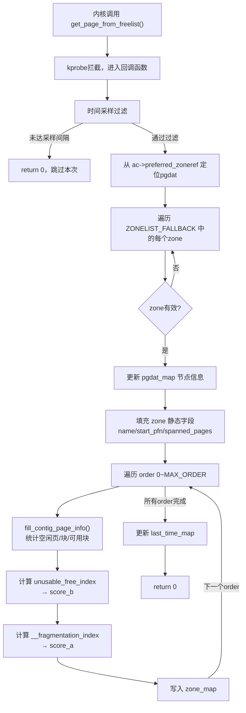
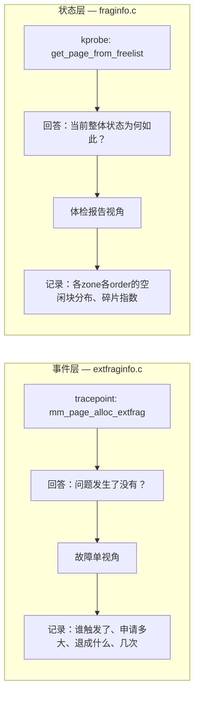

# kprobe动态插桩技术

<!-- WIKI_NAV_START -->
> [!info] 物理内存 Wiki 导航
> [[projects/Linux物理内存检测项目/index|项目首页]] · [[3.3.1 tracepoint探针机制|← 上一篇：3.3.1 tracepoint探针机制]] · [[3.3.3 BPF map通信机制|下一篇：3.3.3 BPF map通信机制 →]]
<!-- WIKI_NAV_END -->

> **调用时机校准：** `get_page_from_freelist` 不只代表“每个分配请求的一次 fast path”。它既用于首次快速尝试，也可能在 slowpath 的回收、规整或放宽条件后被再次调用。入口 kprobe 看到的是每次函数尝试前的状态，不直接知道最终返回结果。详见 [[4.2.3 核心难点精讲|核心难点精讲]]。

在Linux物理内存碎片检测项目中，kprobe是一种关键的**动态探针技术**，用于将eBPF程序挂钩到内核函数`get_page_from_freelist`的入口，从而深入伙伴系统内部采集内存分配现场的详细状态数据。与[[3.3.1 tracepoint探针机制|tracepoint探针机制]]的静态事件监控形成互补。

## kprobe技术原理与设计定位

**kprobe（Kernel Probe）**是Linux内核提供的一种**动态插桩机制**，允许开发者在运行时将探针挂钩到几乎任意内核函数的入口、返回点或指定偏移位置。与tracepoint需要内核开发者预先定义事件点不同，kprobe通过修改目标函数入口处的指令（插入断点指令如`int3`或替换为跳转指令）实现动态拦截。

在这个项目中，kprobe被用于`fraginfo.c`文件，挂钩的目标函数是**`get_page_from_freelist`**——这是Linux内核伙伴系统（Buddy System）快速路径（fast path）中的核心函数。每当内核进行页分配并进入快速路径时，都会调用此函数尝试从空闲链表中分配连续物理页。成功则直接返回，失败才进入慢速路径执行内存回收或压缩等更重的操作。

Sources: `fraginfo.c#L91-L168`, `linux物理内存检测工具原作者开发文档.md#L97-L107`

## BCC中的kprobe命名约定

在BCC（BPF Compiler Collection）框架下，kprobe的挂载遵循一种特殊的**命名约定**：如果eBPF C函数以`kprobe__`为前缀，BCC会自动将该函数挂钩到与后缀同名的内核函数入口。项目中的实际代码如下：

```cpp
int kprobe__get_page_from_freelist(struct pt_regs *ctx, gfp_t gfp_mask,
                                    unsigned int order, int alloc_flags,
                                    const struct alloc_context *ac)
```

这段函数签名遵循BCC的`kprobe__<内核函数名>`约定，BCC在编译加载阶段会自动完成：
1. 编译eBPF字节码
2. 通过`bpf()`系统调用将其加载到内核
3. 将探针点挂载到内核符号`get_page_from_freelist`的入口处

这意味着开发者无需手动指定挂载地址，只需保证函数名与目标内核函数匹配即可。

Sources: `fraginfo.c#L91-L93`, `linux物理内存检测工具原作者开发文档.md#L127-L140`

## kprobe回调函数的参数解析

当`get_page_from_freelist`被内核调用时，挂载在其入口的eBPF回调函数会先于原函数执行。回调函数的参数设计是理解kprobe工作方式的核心：

| 参数 | 类型 | 含义 | 数据来源 |
|------|------|------|----------|
| `ctx` | `struct pt_regs *` | CPU寄存器上下文，保存函数调用时的完整寄存器状态 | kprobe框架自动注入 |
| `gfp_mask` | `gfp_t` | 内存分配标志（如`GFP_KERNEL`），控制分配行为 | 原函数参数透传 |
| `order` | `unsigned int` | 请求的连续页块阶数，`2^order`页 | 原函数参数透传 |
| `alloc_flags` | `int` | 分配控制标志（如`ALLOC_HARDER`） | 原函数参数透传 |
| `ac` | `const struct alloc_context *` | 分配上下文，包含NUMA节点、zone优先级等关键信息 | 原函数参数透传 |

其中`struct pt_regs *ctx`是kprobe框架自动注入的寄存器上下文结构，而其余参数则直接对应目标内核函数`get_page_from_freelist`的原始参数签名。这正是kprobe相比tracepoint的关键差异：**tracepoint通过`args->field`访问预定义字段，而kprobe直接获取原函数的完整参数列表**。

Sources: `fraginfo.c#L91-L93`, `linux物理内存检测工具原作者开发文档.md#L758-L777`

## 从alloc_context提取内存拓扑

kprobe采集的第一步是从分配上下文`alloc_context`中定位当前相关的NUMA节点和zone。代码实现如下：

```cpp
struct pglist_data *pgdat;
struct zone *z;
struct zoneref *zref;

pgdat = ac->preferred_zoneref->zone->zone_pgdat;
```

这行代码的含义是：**从当前分配上下文的首选zone出发，找到它所属的NUMA节点描述符（pglist_data）**。`alloc_context`结构中包含以下关键字段：

| 字段 | 类型 | 作用 |
|------|------|------|
| `zonelist` | `struct zonelist *` | 可分配zone列表 |
| `nodemask_t` | `nodemask_t *` | 允许的NUMA节点掩码 |
| `preferred_zoneref` | `struct zoneref *` | 首选zone引用，项目由此出发找到node |
| `migratetype` | `int` | 页面迁移类型 |
| `highest_zoneidx` | `enum zone_type` | 最高可用zone类型索引 |

找到pgdat后，程序遍历其所有zone进行巡检：

```cpp
for (i = 0; i < MAX_NR_ZONES; i++) {
    zref = &pgdat->node_zonelists[ZONELIST_FALLBACK]._zonerefs[i];
    z = zref->zone;
    if (!z)
        continue;
    // 对每个有效zone执行采集...
}
```

`ZONELIST_FALLBACK`是后备zone列表，按分配优先级排序。程序沿着这个顺序逐个zone检查，跳过无效项。

Sources: `fraginfo.c#L107-L124`, `linux物理内存检测工具原作者开发文档.md#L808-L851`

## 内核数据的安全读取机制

kprobe中一个关键的技术难点是：**eBPF程序不能像普通内核代码那样直接解引用内核指针**。所有对内核数据结构的读取都必须通过eBPF helper函数完成，以确保安全性和通过eBPF验证器检查。

项目中使用了两种安全读取helper：

**`bpf_probe_read_kernel()`——读取数值数据**

```cpp
unsigned long nr_free;
bpf_probe_read_kernel(&nr_free, sizeof(nr_free),
                      &zone->free_area[order].nr_free);
```

用于安全读取`zone->free_area[order].nr_free`——各阶空闲页块数量。

**`bpf_probe_read_kernel_str()`——读取字符串数据**

```cpp
bpf_probe_read_kernel_str(&zone_data.name, sizeof(zone_data.name), z->name);
```

用于安全读取zone名称字符串（如"DMA"、"Normal"）。**字符串不能直接解引用，必须使用字符串专用的helper**，这是kprobe开发中最容易出错的地方。

这两个helper通过内核的`probe_kernel_read`机制实现安全访问，即使目标地址无效也不会导致内核崩溃。

Sources: `fraginfo.c#L80-L82`, `fraginfo.c#L145`, `linux物理内存检测工具原作者开发文档.md#L636-L695`

## 采样节流控制机制

由于`get_page_from_freelist`是内存分配的快速路径核心函数，系统运行时会被**极高频调用**。如果每次都完整执行采集逻辑，将产生严重的性能开销。项目通过`delay_map`和`last_time_map`两个BPF map实现时间窗口采样控制：

```cpp
u64 *last_time, current_time;
current_time = bpf_ktime_get_ns();           // 获取纳秒级时间戳
last_time = last_time_map.lookup(&current_time);
int key = 0;
int *delay_ptr = delay_map.lookup(&key);
int delay;
if (delay_ptr) {
    delay = *delay_ptr;                       // 读取用户配置的采样间隔
}
if (last_time && (current_time - *last_time < delay * 1000000000)) {
    return 0;                                  // 未到采样窗口，直接返回
}
```

| Map | 类型 | 作用 |
|-----|------|------|
| `delay_map` | `BPF_ARRAY(int, 1)` | 存储用户态配置的采样间隔（秒），由Python通过`b["delay_map"][0] = ctypes.c_int(interval)`写入 |
| `last_time_map` | `BPF_HASH(u64, u64)` | 记录上一次真正执行采样的纳秒时间戳 |

用户态Python在初始化时将间隔写入`delay_map`：

```python
self.b = BPF(src_file="./bpf/fraginfo.c")
delay_key = 0
self.b["delay_map"][delay_key] = ctypes.c_int(interval)
```

工作流程为：
1. 用`bpf_ktime_get_ns()`获取当前纳秒时间戳
2. 从`delay_map[0]`读取用户设置的采样间隔（秒）
3. 计算与上次采样的时间差
4. 若间隔未达`delay`秒，直接`return 0`不执行采集

这种设计确保了**工具能在生产环境长期低开销运行**，是项目区别于简单调试工具的关键设计。

Sources: `fraginfo.c#L43-L46`, `fraginfo.c#L94-L105`, `exfrag.py#L21-L22`, `linux物理内存检测工具原作者开发文档.md#L758-L807`

## zone+order维度的数据采集

通过采样过滤后，程序进入核心采集逻辑：**对每个zone的每个order统计碎片化状态**。这是`fraginfo.c`最核心的代码段：

```cpp
for (a_order = 0; a_order <= MAX_ORDER; ++a_order) {
    zone_data.order = a_order;
    zone_key = zone_data.zone_ptr + zone_data.order;

    struct contig_page_info ctg_info;
    fill_contig_page_info(z, a_order, &ctg_info);
    zone_data.free_blocks_suitable = ctg_info.free_blocks_suitable;
    zone_data.free_blocks_total = ctg_info.free_blocks_total;
    zone_data.free_pages = ctg_info.free_pages;

    tmp = unusable_free_index(a_order, &ctg_info);
    zone_data.score_b = tmp;
    index = __fragmentation_index(a_order, &ctg_info);
    zone_data.score_a = index;

    zone_map.update(&zone_key, &zone_data);
}
```

**为什么必须遍历所有order**：同一个zone的碎片化程度不能用单一数值概括。对`order=0`（单页）可能毫无压力，但对`order=8`（256页）可能已经无法分配。因此程序对每个`zone + order`组合生成一条独立记录。

**为什么必须遍历所有阶而不只是目标阶**：高阶块可以拆分为多个低阶块。如果只看`free_area[suitable_order]`，会遗漏大量"高阶块拆分后仍可服务当前请求"的可用资源。

Sources: `fraginfo.c#L147-L164`, [[1.1 学习总览与架构地图|linux-ebpf内存碎片监控复习.md]]

## 完整执行流程图



Sources: `fraginfo.c#L91-L168`

## kprobe与tracepoint的技术对比

项目同时使用了kprobe和tracepoint两种探针技术，它们在设计哲学和适用场景上有本质区别：

| 特性 | kprobe | tracepoint |
|------|--------|------------|
| **探针类型** | 动态探针，可挂钩任意内核函数 | 静态探针，内核预定义事件 |
| **稳定性** | 较低，依赖函数名、参数和结构体布局，内核版本升级可能失效 | 高，ABI稳定，跨内核版本一致 |
| **参数访问** | 通过`struct pt_regs *ctx`和原函数签名获取参数，需`bpf_probe_read_kernel()`安全读取 | 直接通过`args->field`访问预定义结构化数据 |
| **性能开销** | 较高，动态插入断点指令（`int3`），触发中断和上下文切换 | 低，编译时优化为NOP指令，未激活时几乎零开销 |
| **灵活性** | 极高，能深入函数内部查看`alloc_context`、`zone`、`free_area[order]`等 | 受限于预定义事件的字段暴露程度 |
| **适用场景** | 需要深入内核实现层获取详细状态数据 | 监控稳定的内核事件，适合生产环境长期运行 |
| **项目用途** | `get_page_from_freelist`——采集zone/order维度碎片状态 | `mm_page_alloc_extfrag`——采集降级分配事件 |

**为什么`get_page_from_freelist`必须用kprobe**：该函数没有对应的tracepoint事件点。项目需要从`alloc_context`结构中获取zone/node拓扑信息，需要读取`zone->free_area[order].nr_free`等底层数据，这些信息无法从任何现有静态tracepoint获得。

**为什么`mm_page_alloc_extfrag`用tracepoint**：该事件是内核预定义的`kmem`子系统事件，语义明确——页分配发生 migratetype fallback。参数由内核结构化提供，相比内部函数原型更稳定；长期监控仍要做目标内核事件格式检查。

## Anki 卡片

| 正面 | 反面 |
|------|------|
| kprobe 和 tracepoint 的本质区别是什么？ | kprobe 是**动态探针**，可挂钩任意内核函数；tracepoint 是**静态探针**，由内核开发者通过 TRACE_EVENT() 宏预定义，提供稳定 ABI |
| kprobe 的稳定性如何？为什么？ | 较低。依赖函数名、参数签名和结构体布局，内核版本升级可能导致失效 |
| tracepoint 的稳定性如何？ | 高，ABI 稳定，跨内核版本保持一致 |
| kprobe 如何访问函数参数？ | 通过 `struct pt_regs *ctx` 和原函数签名获取，需要 `bpf_probe_read_kernel()` 安全读取 |
| tracepoint 如何访问事件数据？ | 直接通过 `args->field` 访问预定义的结构化数据字段 |
| kprobe 的性能开销为什么较高？ | 动态插入断点指令（`int3`），触发中断和上下文切换 |
| tracepoint 的性能开销为什么低？ | 编译时优化为 NOP 指令，未激活时几乎零开销 |
| kprobe 相比 tracepoint 的最大优势是什么？ | 灵活性极高，能深入函数内部查看 `alloc_context`、`zone`、`free_area[order]` 等底层数据 |
| 项目中 kprobe 挂钩的函数是什么？ | `get_page_from_freelist`——伙伴系统快速路径核心函数 |
| 项目中 tracepoint 挂钩的事件是什么？ | `kmem:mm_page_alloc_extfrag`——页分配发生 migratetype fallback 的事件 |
| 为什么 `get_page_from_freelist` 必须用 kprobe 而非 tracepoint？ | 该函数没有对应的 tracepoint 事件点，且需要从 `alloc_context` 获取 zone/node 拓扑和 `free_area[order].nr_free` 等底层数据 |
| 项目中两个探针的互补关系是什么？ | 事件型探针（tracepoint）像**故障单**，记录碎片已影响分配的具体事件；状态型探针（kprobe）像**体检报告**，记录伙伴系统各 zone/order 的整体健康度 |
| BCC 中 kprobe 的命名约定是什么？ | 函数名以 `kprobe__` 为前缀，BCC 自动挂钩到同名内核函数入口，如 `kprobe__get_page_from_freelist` |
| kprobe 开发中读取内核数据必须用什么 helper？ | 数值用 `bpf_probe_read_kernel()`，字符串用 `bpf_probe_read_kernel_str()`，不能直接解引用内核指针 |
| kprobe 回调为什么始终 return 0？ | 因为这是**低侵入观察型工具**，只做数据采集不修改内核行为，避免影响系统正常内存管理 |

Sources: `linux物理内存检测工具原作者开发文档.md#L1262-L1398`, [[1.1 学习总览与架构地图|linux-ebpf内存碎片监控复习.md]], [[1.1 学习总览与架构地图|linux-ebpf内存碎片监控复习.md]]

## 两个挂点的互补关系

理解kprobe和tracepoint在本项目中的关系，关键在于认识到它们**不是重复监控，而是设计上的互补**：



`mm_page_alloc_extfrag`像故障单，记录"碎片已经影响到真实分配行为"的事件；`get_page_from_freelist`像体检报告，记录"当前伙伴系统整体健康度"。一个偏事件，一个偏状态。运维分析时，先看故障单定位问题进程，再看体检报告理解系统全貌。

Sources: [[1.1 学习总览与架构地图|linux-ebpf内存碎片监控复习.md]], `linux物理内存检测工具原作者开发文档.md#L97-L107`

## kprobe开发中的关键注意事项

基于项目代码实践，使用kprobe进行eBPF开发时需要注意以下几个关键点：

**1. 内核结构体兼容性风险**

kprobe依赖内核函数的签名和参数结构。当内核版本升级时，`struct alloc_context`、`struct zone`等结构体的字段布局可能变化，导致程序失效。项目中定义了`alloc_context`结构体副本以确保正确解析参数：

```cpp
struct alloc_context {
  struct zonelist *zonelist;
  nodemask_t *nodemask;
  struct zoneref *preferred_zoneref;
  int migratetype;
  enum zone_type highest_zoneidx;
  bool spread_dirty_pages;
};
```

Sources: `fraginfo.c#L28-L35`, `linux物理内存检测工具原作者开发文档.md#L311-L329`

**2. 安全内存访问不可省略**

所有对内核结构体字段的读取都必须使用`bpf_probe_read_kernel()`或`bpf_probe_read_kernel_str()`。直接解引用内核指针会导致eBPF验证器拒绝加载程序。项目中对`zone->free_area[order].nr_free`和`z->name`的读取都严格遵循这一规则。

Sources: `fraginfo.c#L80-L82`, `fraginfo.c#L145`

**3. 不修改内核行为**

kprobe回调函数始终`return 0`，仅做数据采集而不改变内核的页分配行为。这是一个**低侵入观察型工具**，不会影响系统的正常内存管理逻辑。

Sources: `fraginfo.c#L167`

## 下一步学习

理解了kprobe动态插桩技术的工作原理后，建议继续学习：

- [[3.3.3 BPF map通信机制|BPF map通信机制]]：深入了解kprobe采集的数据如何通过BPF map从内核态传递到用户态
- [[3.2.3 内存分配快速路径监控|内存分配快速路径监控]]：理解`get_page_from_freelist`在内存分配流程中的具体角色
- [[3.4.3 碎片化指数计算算法|碎片化指数计算算法]]：深入理解kprobe采集数据后如何计算`score_a`和`score_b`两个碎片化指标

<!-- WIKI_FOOTER_START -->
---
> [!tip] 继续阅读
> [[projects/Linux物理内存检测项目/index|项目首页]] · [[3.3.1 tracepoint探针机制|← 上一篇：3.3.1 tracepoint探针机制]] · [[3.3.3 BPF map通信机制|下一篇：3.3.3 BPF map通信机制 →]]
<!-- WIKI_FOOTER_END -->
