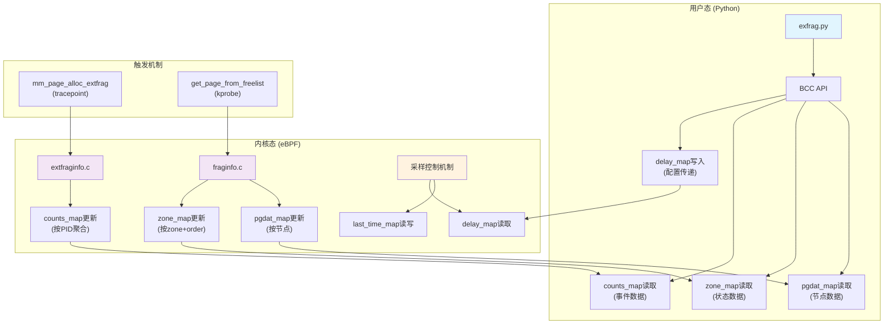
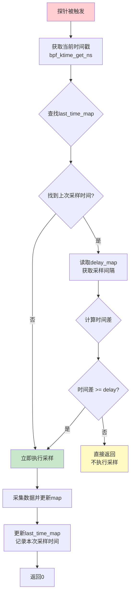

# BPF map通信机制

<!-- WIKI_NAV_START -->
> [!info] 物理内存 Wiki 导航
> [[projects/Linux物理内存检测项目/index|项目首页]] · [[3.3.2 kprobe动态插桩技术|← 上一篇：3.3.2 kprobe动态插桩技术]] · [[3.4.1 外碎片化事件采集|下一篇：3.4.1 外碎片化事件采集 →]]
<!-- WIKI_NAV_END -->

> **实现校准：** map 的设计意图包括结果共享、配置传递和节流状态，但当前 `last_time_map` 使用动态时间戳作 key，不能读到“上次时间”；`counts_map` 的 value 读改写也不能简单等同于严格原子计数。先读 [[4.1 源码审计与事实边界|源码审计与事实边界]] 的状态机与并发分析。

BPF map是eBPF程序实现内核态与用户态数据交换的核心机制。在本项目中，BPF map承担采集结果的存储与用户态配置传递；采样控制则是尚需修正和验证的设计目标。本文将解析map的设计架构、类型选择、数据流向和具体实现模式。

## BPF map基础概念

BPF map是内核提供的一种高效键值存储结构，允许eBPF程序和用户态应用程序共享数据。它具有以下核心特性：

- **类型安全**：每种map类型在编译时确定键值类型，运行时强制类型检查
- **并发访问能力**：map helper 能在多 CPU 环境工作，但“单次 map 操作安全”不等于 value 内多步读改写具有业务原子性
- **生命周期管理**：与eBPF程序绑定，程序卸载时自动清理
- **性能优化**：针对eBPF执行环境优化，支持高效的查找、更新操作

在本项目中，BPF map承担着双重角色：**数据通道**和**控制通道**。数据通道负责将内核采集的内存碎片信息传递给用户态Python程序；控制通道则允许用户态向内核传递采样间隔等配置参数。

Sources: [[1.1 学习总览与架构地图|linux-ebpf内存碎片监控复习.md]]

## 项目中BPF map的类型分布

本项目使用了两种主要的BPF map类型：`BPF_HASH`和`BPF_ARRAY`。根据功能职责，这些map可分为两类：**结果数据map**和**控制数据map**。

### 结果数据map

**counts_map**（外碎片事件统计）
- **类型**：`BPF_HASH(counts_map, pid_t, struct data_t)`
- **键**：`pid_t`（进程ID）
- **值**：`struct data_t`（包含pfn、alloc_order、fallback_order、count、pcomm等字段）
- **功能**：按进程聚合外碎片化降级分配事件，记录每个进程触发事件的累计次数和最近一次事件的详细信息
- **使用场景**：监控哪些进程频繁触发内存分配降级

Sources: `extfraginfo.c#L16`, [[1.1 学习总览与架构地图|linux-ebpf内存碎片监控复习.md]]

**pgdat_map**（内存节点信息）
- **类型**：`BPF_HASH(pgdat_map, u64, struct pgdat_info)`
- **键**：`u64`（节点内存地址）
- **值**：`struct pgdat_info`（包含pgdat_ptr、nr_zones、node_id等字段）
- **功能**：存储NUMA节点的基础信息，包括节点起始页帧号、区域数量和节点ID
- **使用场景**：提供节点级视图的基础数据

Sources: `fraginfo.c#L43`, [[1.1 学习总览与架构地图|linux-ebpf内存碎片监控复习.md]]

**zone_map**（内存区域详细状态）
- **类型**：`BPF_HASH(zone_map, u64, struct zone_info)`
- **键**：`u64`（zone指针 + order的组合）
- **值**：`struct zone_info`（包含zone_start_pfn、spanned_pages、present_pages、free_pages、free_blocks_total、free_blocks_suitable、score_a、score_b、name等字段）
- **功能**：按zone + order维度存储碎片化状态，每个zone在每个order下都有一条独立记录
- **使用场景**：提供zone级、order级的详细碎片化指标

Sources: `fraginfo.c#L44`, [[1.1 学习总览与架构地图|linux-ebpf内存碎片监控复习.md]]

### 控制数据map

**delay_map**（采样间隔配置）
- **类型**：`BPF_ARRAY(delay_map, int, 1)`
- **键**：`int`（固定为0）
- **值**：`int`（采样间隔，单位：秒）
- **功能**：用户态向内核态传递采样间隔配置，控制eBPF程序的采集频率
- **使用场景**：防止高频路径采样过重，降低性能开销

Sources: `extfraginfo.c#L18`, `fraginfo.c#L46`, [[1.1 学习总览与架构地图|linux-ebpf内存碎片监控复习.md]]

**last_time_map**（上次采样时间）
- **类型**：`BPF_HASH(last_time_map, u64, u64)`
- **键**：`u64`（时间戳）
- **值**：`u64`（时间戳）
- **功能**：记录上一次真正执行采样的纳秒级时间戳，与delay_map配合实现采样节流
- **使用场景**：实现"虽然触发了，但不到采样窗口就不干活"的控制逻辑

Sources: `extfraginfo.c#L17`, `fraginfo.c#L45`, [[1.1 学习总览与架构地图|linux-ebpf内存碎片监控复习.md]]

## BPF map的数据流向架构

本项目中的BPF map形成了双向数据流：**配置流**（用户态→内核态）和**数据流**（内核态→用户态）。这种设计体现了eBPF作为"可编程监控探针"的核心价值。



**配置流**（用户态→内核态）：
1. Python程序通过BCC API初始化BPF程序
2. 将采样间隔写入`delay_map[0]`
3. eBPF程序在探针触发时读取`delay_map`获取配置

**数据流**（内核态→用户态）：
1. eBPF程序在探针触发时采集内存碎片数据
2. 将采集结果写入对应的map（counts_map/zone_map/pgdat_map）
3. Python程序通过BCC API从map中读取数据

Sources: `exfrag.py#L17-L23`, [[1.1 学习总览与架构地图|linux-ebpf内存碎片监控复习.md]]

## 采样控制机制的实现细节

采样控制是本项目希望实现的重要部分：`delay_map`提供间隔配置，`last_time_map`本应保存稳定的上次采样状态。但当前时间戳 key 设计没有形成闭环，以下流程应作为修复目标而非现状结论。

### 采样控制的工作流程



### 采样控制的关键代码

```cpp
// 采样控制的核心逻辑
u64 *last_time, current_time;
current_time = bpf_ktime_get_ns();  // 获取纳秒级时间戳
last_time = last_time_map.lookup(&current_time);  // 查找上次采样时间
int key = 0;
int *delay_ptr = delay_map.lookup(&key);  // 获取采样间隔配置
int delay;
if (delay_ptr) {
    delay = *delay_ptr;
}
// 如果距上次采样时间不足delay秒，则直接返回
if (last_time && (current_time - *last_time < delay * 1000000000)) {
    return 0;
}
// ... 执行实际的数据采集 ...
last_time_map.update(&current_time, &current_time);  // 更新采样时间
```

Sources: `extfraginfo.c#L21-L33`, `fraginfo.c#L94-L105`, [[1.1 学习总览与架构地图|linux-ebpf内存碎片监控复习.md]]

### 采样控制的设计意义

1. **性能保护**：`mm_page_alloc_extfrag`和`get_page_from_freelist`都是高频调用的内核函数，如果每次触发都执行完整的数据采集，会带来显著的性能开销
2. **数据实用性**：内存碎片状态通常不会在毫秒级发生剧烈变化，秒级采样已经足够反映系统状态
3. **配置灵活性**：用户可以通过命令行参数`-d`调整采样间隔，平衡监控精度和性能开销

## 用户态与map的交互模式

Python用户态程序通过BCC提供的API与BPF map交互，实现了三种典型的操作模式：

### 配置写入模式

```python
# 初始化BPF程序并写入配置
self.b = BPF(src_file="./bpf/fraginfo.c")
delay_key = 0
self.b["delay_map"][delay_key] = ctypes.c_int(interval)
```

这种模式体现了map作为**控制通道**的角色：用户态将采样间隔写入`delay_map`，内核态eBPF程序读取该配置来控制采集频率。

Sources: `exfrag.py#L17-L23`, [[1.1 学习总览与架构地图|linux-ebpf内存碎片监控复习.md]]

### 数据读取模式

```python
# 从zone_map读取数据
zone_map = self.b["zone_map"]
for key, value in zone_map.items():
    comm = value.name.decode('utf-8', 'replace').rstrip('\x00')
    # ... 处理数据 ...
```

这种模式体现了map作为**数据通道**的角色：内核态eBPF程序将采集结果写入map，用户态Python程序遍历map读取数据。

Sources: `exfrag.py#L35-L63`, [[1.1 学习总览与架构地图|linux-ebpf内存碎片监控复习.md]]

### 数据聚合读取模式

```python
# 从counts_map读取并排序数据
counts_map = self.b["counts_map"]
count_data_list = []
for key, value in counts_map.items():
    data = {
        'pcomm': value.pcomm.decode('utf-8', 'replace').rstrip('\x00'),
        'pid': value.pid,
        'count': value.count
    }
    count_data_list.append(data)
count_data_list.sort(key=lambda x: x['count'], reverse=True)
```

这种模式展示了内核态聚合+用户态排序的协同设计：eBPF程序在内核态按PID聚合事件，Python程序在用户态进行排序和展示。

Sources: `exfrag.py#L126-L148`, [[1.1 学习总览与架构地图|linux-ebpf内存碎片监控复习.md]]

## map键值设计模式分析

本项目中map的键值设计体现了不同的数据组织策略：

| Map名称 | 键类型 | 值类型 | 设计策略 | 适用场景 |
|---------|--------|--------|----------|----------|
| counts_map | pid_t | struct data_t | 按进程聚合 | 事件统计，责任定位 |
| pgdat_map | u64 | struct pgdat_info | 按节点存储 | 节点级信息，首次写入 |
| zone_map | u64 | struct zone_info | 按zone+order存储 | 多维状态，实时更新 |
| delay_map | int | int | 固定索引 | 配置传递，单值存储 |
| last_time_map | u64 | u64 | 时间戳索引 | 时间记录，节流控制 |

**键值设计的关键洞察**：

1. **counts_map的PID键设计**：外碎片事件需要责任定位，按进程聚合最符合运维分析需求，同时避免map空间爆炸
2. **zone_map的复合键设计**：`zone_key = zone_data.zone_ptr + zone_data.order`，将zone地址和order组合成唯一键，实现同一zone在不同order下的独立记录
3. **pgdat_map的指针键设计**：使用节点内存地址作为键，确保同一节点只记录一次基础信息

Sources: `extfraginfo.c#L16`, `fraginfo.c#L43-L46`, [[1.1 学习总览与架构地图|linux-ebpf内存碎片监控复习.md]]

## map在两个eBPF程序中的协同

本项目包含两个独立的eBPF程序，它们共享相同的控制map，但使用不同的结果map：

### extfraginfo.c的map使用

**职责**：监控外碎片化降级分配事件
**触发点**：`mm_page_alloc_extfrag`（tracepoint）
**结果map**：`counts_map`（按PID聚合事件）
**控制map**：`delay_map`、`last_time_map`

**执行流程**：
1. 读取`delay_map`获取采样间隔
2. 与`last_time_map`比较判断是否执行采样
3. 从tracepoint参数获取事件信息（pfn、alloc_order、fallback_order）
4. 通过`bpf_get_current_pid_tgid()`和`bpf_get_current_comm()`获取进程信息
5. 按PID更新`counts_map`

Sources: `extfraginfo.c#L20-L59`, [[1.1 学习总览与架构地图|linux-ebpf内存碎片监控复习.md]]

### fraginfo.c的map使用

**职责**：统计系统整体碎片化状态
**触发点**：`get_page_from_freelist`（kprobe）
**结果map**：`pgdat_map`、`zone_map`（按节点和zone+order存储状态）
**控制map**：`delay_map`、`last_time_map`

**执行流程**：
1. 读取`delay_map`获取采样间隔
2. 与`last_time_map`比较判断是否执行采样
3. 从`alloc_context`找到当前相关节点
4. 遍历zonelist，为每个zone计算碎片化指标
5. 更新`pgdat_map`（节点信息）
6. 更新`zone_map`（每个zone在每个order下的状态）

Sources: `fraginfo.c#L91-L168`, [[1.1 学习总览与架构地图|linux-ebpf内存碎片监控复习.md]]

## map数据的生命周期管理

BPF map的生命周期与eBPF程序绑定，但在本项目中存在一些特殊考虑：

### map的持久化特性

map中的数据在程序运行期间持续存在，不会因为探针触发而自动清理。这意味着：
- `counts_map`会持续累积各进程的事件计数
- `zone_map`会持续更新各zone在各order下的最新状态
- 用户态每次读取都获得的是累积/最新状态

### map的并发访问

虽然map helper支持并发环境，但value内的读改写、跨多个map操作和快照一致性仍需单独设计。在本项目中：
- 内核态eBPF程序可能在多个CPU上并发执行
- 用户态Python程序可能同时读取map
- 设计上避免了对同一key的频繁更新冲突

### map的内存开销

`zone_map`的键设计`zone_key = zone_data.zone_ptr + zone_data.order`可能导致map条目数量较多，但：
- 每个zone通常只有11个order（0-10）
- 系统zone数量有限
- 总体内存开销可控

## map使用的最佳实践总结

基于本项目的map使用模式，可以总结出以下最佳实践：

1. **明确map职责**：区分结果map和控制map，避免混用
2. **选择合适的键类型**：根据数据访问模式选择PID、指针、时间戳等作为键
3. **考虑聚合策略**：在内核态进行必要的聚合，减少用户态处理负担
4. **实现采样控制**：对于高频路径，使用时间戳和配置map实现节流
5. **明确一致性语义**：区分单次 helper 操作、value 原子更新、跨 map 快照和用户态读取一致性

## 下一步学习建议

理解了BPF map通信机制后，建议继续深入学习：
- [[3.4.1 外碎片化事件采集|外碎片化事件采集]]：了解extfraginfo.c如何捕获和记录外碎片化事件
- [[3.4.2 内存状态统计方法|内存状态统计方法]]：了解fraginfo.c如何计算碎片化指标
- [[3.4.3 碎片化指数计算算法|碎片化指数计算算法]]：深入理解extfrag_index和unusable_index的计算原理

<!-- WIKI_FOOTER_START -->
---
> [!tip] 继续阅读
> [[projects/Linux物理内存检测项目/index|项目首页]] · [[3.3.2 kprobe动态插桩技术|← 上一篇：3.3.2 kprobe动态插桩技术]] · [[3.4.1 外碎片化事件采集|下一篇：3.4.1 外碎片化事件采集 →]]
<!-- WIKI_FOOTER_END -->
