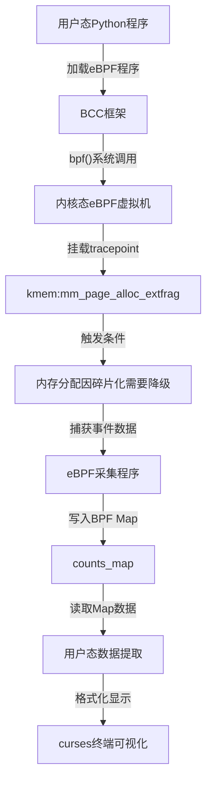

# 外碎片化事件采集

<!-- WIKI_NAV_START -->
> [!info] 物理内存 Wiki 导航
> [[projects/Linux物理内存检测项目/index|项目首页]] · [[3.3.3 BPF map通信机制|← 上一篇：3.3.3 BPF map通信机制]] · [[3.4.2 内存状态统计方法|下一篇：3.4.2 内存状态统计方法 →]]
<!-- WIKI_NAV_END -->

> **先纠正“降级”含义：** 这里是从其他 migratetype 的空闲链表 fallback 取块，不是把调用者请求静默改成更小 order。当前项目还没有采集 migratetype 与 ownership 字段，因此只能得到不完整的 fallback 事件视角。见 [[4.2.3 核心难点精讲|核心难点精讲]]。

本页面详细解析Linux物理内存碎片检测工具中外碎片化事件的采集机制。外碎片化事件采集是整个监控系统的核心功能之一，通过eBPF的tracepoint技术捕获伙伴系统的 fallback 事件，为系统内存碎片化诊断提供事件数据。

## 架构概览

外碎片化事件采集采用经典的"内核态采集+用户态展示"双层架构，通过BPF Map实现跨态数据通信。下图展示了完整的采集流程：



**Sources**: `linux物理内存检测工具原作者开发文档.md#L1-L20`, [[1.1 学习总览与架构地图|linux-ebpf内存碎片监控复习.md]]

## eBPF探针设计

外碎片化事件采集基于Linux内核的tracepoint机制，具体使用`kmem:mm_page_alloc_extfrag`这一静态探针点。该探针在内存分配因碎片化需要降级（fallback）时触发，是检测外部碎片问题的理想事件源。

**触发条件分析**：当内核尝试分配连续物理内存页（如order=3表示8个连续页）时，如果对应阶数的空闲链表无法满足请求，内核会从更高阶数拆分内存块。这个降级过程会触发`mm_page_alloc_extfrag`事件，表明系统存在外部碎片问题。

探针的核心代码位于`extfraginfo.c`文件中，使用`TRACEPOINT_PROBE`宏定义：

```c
TRACEPOINT_PROBE(kmem, mm_page_alloc_extfrag) {
    // 获取当前时间用于采样控制
    u64 *last_time, current_time;
    current_time = bpf_ktime_get_ns();
    last_time = last_time_map.lookup(&current_time);
    int key = 0;
    int *delay_ptr = delay_map.lookup(&key);
    int delay;
    if (delay_ptr) {
        delay = *delay_ptr;
    }
    // 采样频率控制：避免高频触发影响性能
    if (last_time && (current_time - *last_time < delay * 1000000000)) {
        return 0;
    }
    // 获取进程信息并更新数据
    pid_t pid = bpf_get_current_pid_tgid() >> 32;
    // ... 数据记录逻辑
}
```

**Sources**: `extfraginfo.c#L20-L59`, [[1.1 学习总览与架构地图|linux-ebpf内存碎片监控复习.md]]

## 数据结构与Map设计

eBPF程序定义了专用的数据结构来存储采集到的外碎片化事件信息。`data_t`结构体包含了事件的所有关键字段：

```c
struct data_t {
    u64 pfn;           // 物理页帧号，标识分配的物理内存位置
    int alloc_order;   // 初始分配内存的阶数（请求的连续页块大小）
    int fallback_order;// 实际分配的内存块阶数（可能因降级而变小）
    pid_t pid;         // 触发事件的进程ID
    u64 count;         // 该进程触发外碎片化事件的次数
    char pcomm[32];    // 进程名称
};
```

为了实现高效的数据存储和通信，程序使用了三种BPF Map：

1. **`counts_map`**（BPF_HASH）：以PID为键存储外碎片化事件数据，实现按进程聚合统计
2. **`last_time_map`**（BPF_HASH）：存储上次采样时间戳，用于采样频率控制
3. **`delay_map`**（BPF_ARRAY）：存储采样间隔时间（秒），由用户态程序配置

**数据结构设计考虑**：按PID聚合数据的设计使管理员能够快速识别哪些进程频繁触发外碎片化事件，便于针对性优化或问题排查。

**Sources**: `extfraginfo.c#L7-L19`, `linux物理内存检测工具原作者开发文档.md#L71-L96`

## 采样控制机制

为了平衡监控精度和系统性能，eBPF程序实现了基于时间的采样控制机制。该机制通过`last_time_map`和`delay_map`两个Map协同工作：

1. **时间戳记录**：每次事件触发时，程序获取当前时间戳（`bpf_ktime_get_ns()`）
2. **间隔检查**：比较当前时间与上次记录时间，如果间隔小于配置的延迟时间（`delay`），则跳过本次采集
3. **动态配置**：用户态程序通过修改`delay_map`的值来调整采样频率，默认间隔为2秒

这种设计确保了在高频事件场景下（如内存压力较大时），监控工具不会因过度采集而影响系统性能。同时，管理员可以根据实际需求调整采样频率，在监控精度和系统开销之间取得平衡。

**Sources**: `extfraginfo.c#L21-L33`, [[1.1 学习总览与架构地图|linux-ebpf内存碎片监控复习.md]]

## 用户态数据提取

用户态Python程序通过`exfrag.py`文件中的`ExtFrag`类实现对外碎片化事件数据的提取和处理。当用户指定`output_count=True`参数时，程序加载`extfraginfo.c`采集程序，并通过`get_count_data()`方法读取`counts_map`中的数据：

```python
def get_count_data(self):
    count_data_list = []
    counts_map = self.b["counts_map"]  # 从BPF哈希表获取数据
    for key, value in counts_map.items():
        _comm = value.pcomm.decode('utf-8', 'replace').rstrip('\x00')
        data = {
            'pcomm': _comm,
            'pid': value.pid,
            'pfn': value.pfn,
            'alloc_order': value.alloc_order,
            'fallback_order': value.fallback_order,
            'count': value.count
        }
        count_data_list.append(data)
    # 按事件次数降序排序，便于识别主要问题进程
    count_data_list.sort(key=lambda x: x['count'], reverse=True)
    return count_data_list
```

**数据提取流程**：
1. 访问`counts_map` BPF哈希表
2. 遍历所有条目，解码进程名称
3. 将数据转换为Python字典格式
4. 按事件次数降序排序
5. 返回结构化数据列表

**Sources**: `exfrag.py#L126-L148`, `linux物理内存检测工具原作者开发文档.md#L71-L96`

## 数据显示与可视化

用户态程序`exfrag_user.py`通过curses库实现终端可视化显示。当用户使用`-s`或`--output_count`参数时，程序会显示外碎片化事件统计表格：

```python
# 在main函数中的显示逻辑
elif args['output_count']:
    screenEnough(screen)
    if not _boo:
        event_data = extfrag.get_count_data()
        header = f"{'COMM':>25} {'PID':>30} {'PFN':>45}" \
                f"{'ALLOC_ORDER':>45} {'FALLBACK_ORDER':>45} {'COUNT':>35} \n"
        screen.addstr(0, 0, header, curses.color_pair(4))
        row = 1
        for event in event_data:
            line = f"{event['pcomm']:>25} {event['pid']:>30} {event['pfn']:>45}" \
                   f"{event['alloc_order']:>45} {event['fallback_order']:>45} {event['count']:>35} \n"
            # 屏幕边界检查和显示逻辑
```

**显示字段说明**：
- **COMM**：触发事件的进程名称
- **PID**：进程ID
- **PFN**：分配的物理页帧号
- **ALLOC_ORDER**：请求的分配阶数（如3表示请求8个连续页）
- **FALLBACK_ORDER**：从 fallback migratetype 找到的空闲块阶数（通常不小于请求阶）
- **COUNT**：该进程触发外碎片化事件的次数

**Sources**: `exfrag_user.py#L232-L248`, `linux物理内存检测工具原作者开发文档.md#L57-L70`

## 采集数据的诊断价值

外碎片化事件采集提供的数据具有重要的诊断价值，能够回答以下关键问题：

1. **碎片化影响评估**：通过比较`ALLOC_ORDER`和`FALLBACK_ORDER`，可以量化碎片化对内存分配的影响程度
2. **问题进程识别**：通过PID和COMM字段，可以识别频繁触发碎片化事件的进程
3. **分配模式分析**：通过PFN字段，可以分析内存分配的物理位置分布
4. **事件频率统计**：COUNT字段提供了事件发生的频率信息

这些数据与内存状态统计（见[[3.4.2 内存状态统计方法|内存状态统计方法]]）和碎片化指数计算（见[[3.4.3 碎片化指数计算算法|碎片化指数计算算法]]）相结合，为系统管理员提供了全面的内存碎片化诊断视图。

**Sources**: [[1.1 学习总览与架构地图|linux-ebpf内存碎片监控复习.md]], `linux物理内存检测工具原作者开发文档.md#L57-L70`

## 技术实现要点

在实现外碎片化事件采集时，需要注意以下技术要点：

1. **探针稳定性**：`mm_page_alloc_extfrag`是内核预定义的静态tracepoint，比kprobe更稳定，适合长期监控
2. **性能影响控制**：通过采样机制避免高频事件对系统性能的影响
3. **数据一致性**：使用BPF Map确保内核态和用户态数据的一致性
4. **内存安全**：eBPF程序在内核验证器的监督下运行，确保内存访问安全

**Sources**: [[1.1 学习总览与架构地图|linux-ebpf内存碎片监控复习.md]], `extfraginfo.c#L20-L59`

## 相关页面

要全面理解外碎片化事件采集，建议结合以下相关页面内容：

- **[[3.3.1 tracepoint探针机制|tracepoint探针机制]]**：深入了解静态探针的工作原理
- **[[3.3.3 BPF map通信机制|BPF map通信机制]]**：理解内核态与用户态的数据通信机制
- **[[3.4.2 内存状态统计方法|内存状态统计方法]]**：了解系统整体内存状态的采集方法
- **[[3.4.3 碎片化指数计算算法|碎片化指数计算算法]]**：学习量化碎片化程度的算法

外碎片化事件采集作为整个监控系统的"事件驱动"层，与内存状态统计的"状态监控"层形成互补，共同构成了完整的内存碎片化检测体系。

**Sources**: [[1.1 学习总览与架构地图|linux-ebpf内存碎片监控复习.md]], `linux物理内存检测工具原作者开发文档.md#L71-L96`

<!-- WIKI_FOOTER_START -->
---
> [!tip] 继续阅读
> [[projects/Linux物理内存检测项目/index|项目首页]] · [[3.3.3 BPF map通信机制|← 上一篇：3.3.3 BPF map通信机制]] · [[3.4.2 内存状态统计方法|下一篇：3.4.2 内存状态统计方法 →]]
<!-- WIKI_FOOTER_END -->
