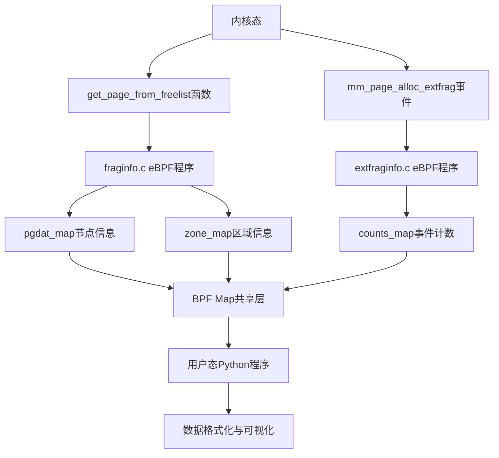

# 内存状态统计方法

<!-- WIKI_NAV_START -->
> [!info] 物理内存 Wiki 导航
> [[projects/Linux物理内存检测项目/index|项目首页]] · [[3.4.1 外碎片化事件采集|← 上一篇：3.4.1 外碎片化事件采集]] · [[3.4.3 碎片化指数计算算法|下一篇：3.4.3 碎片化指数计算算法 →]]
<!-- WIKI_NAV_END -->

> **解释边界：** `fraginfo.c` 在函数入口读取的是相关 zone 的状态快照，不是对内核真实分配决策每个条件的完整复刻，也不直接知道该次调用返回结果。order 范围、zonelist 遍历与节流均带有版本/实现假设，详见 [[4.1 源码审计与事实边界|源码审计与事实边界]]。

本页面详细介绍Linux物理内存碎片检测项目中的内存状态统计方法。该方法通过eBPF程序在内核态采集碎片化相关快照，为后续可视化分析提供基础数据。

## 统计架构概述

内存状态统计采用**内核态采集+用户态读取**的双层架构。内核态通过两个eBPF程序分别采集整体碎片状态和外碎片化事件，用户态Python程序通过BCC接口读取这些数据。这种设计实现了实时、低开销的内存状态监控。



Sources: `fraginfo.c#L1-L168`, `extfraginfo.c#L1-L60`

## 核心统计数据类型

内存状态统计采集三类关键数据，分别从不同维度反映系统内存的碎片化状况：

### 节点信息统计
节点信息通过`pgdat_info`结构体记录，用于分析NUMA架构下的内存分布情况。该结构体包含NUMA节点指针、zone数量和节点ID三个核心字段。

**主要字段说明**：
- `pgdat_ptr`：NUMA节点的pgdat结构体起始页帧号，用于唯一标识节点
- `nr_zones`：该节点包含的内存区域数量，反映内存分区情况
- `node_id`：NUMA节点标识符，多处理器系统中的节点编号

Sources: `fraginfo.c#L8-L12`, `linux物理内存检测工具原作者开发文档.md#L251-L261`

### 区域信息统计
区域信息通过`zone_info`结构体记录，是内存状态统计的核心数据。该结构体详细记录每个内存区域的碎片化状态，包括物理地址、容量、空闲内存分布和碎片化指数等。

**主要字段说明**：
- `zone_start_pfn`：区域起始页帧号，标识区域的物理起始位置
- `spanned_pages`：区域总页数（包含空洞），反映区域理论容量
- `present_pages`：实际存在的页数，反映区域实际可用容量
- `free_pages`：空闲页总数，反映当前可用内存总量
- `free_blocks_total`：空闲块总数（所有order），反映内存碎片化程度
- `free_blocks_suitable`：适合当前请求order的块数，反映满足高阶分配的能力
- `score_a`：标准碎片化指数（-1000到1000），负值表示内存充足
- `score_b`：不可用页指数（0-1000），值越高碎片化越严重

Sources: `fraginfo.c#L14-L27`, `linux物理内存检测工具原作者开发文档.md#L265-L299`

### 外碎片化事件统计
外碎片化事件通过`data_t`结构体记录，专门捕获内存分配因碎片化需要降级的事件。这些事件是内存碎片化问题的直接体现，对于诊断具体问题具有重要价值。

**主要字段说明**：
- `pfn`：实际分配的物理页帧号，标识分配的物理位置
- `alloc_order`：初始分配请求的阶数，反映原始需求
- `fallback_order`：从 fallback migratetype 找到的空闲块阶数，反映取块与拆分位置；不能解释为实际少分配页
- `pid`：发生事件的进程ID，用于关联分配行为
- `pcomm`：进程名称，便于识别问题进程
- `count`：事件发生次数，反映问题严重程度

Sources: `extfraginfo.c#L7-L14`, `linux物理内存检测工具原作者开发文档.md#L57-L69`

## 统计方法实现原理

### 基于eBPF的插桩机制
内存状态统计采用两种eBPF插桩机制，分别针对不同的监控场景：

**kprobe动态插桩**：用于监控`get_page_from_freelist`函数。该函数是Linux内核伙伴系统的核心分配函数，负责在快速路径中尝试分配物理页面。通过在该函数入口处插入eBPF程序，可以捕获每次内存分配尝试的详细信息。

```c
// kprobe挂载点示例
int kprobe__get_page_from_freelist(struct pt_regs *ctx, gfp_t gfp_mask,
                                   unsigned int order, int alloc_flags,
                                   const struct alloc_context *ac)
```

**tracepoint静态插桩**：用于监控`mm_page_alloc_extfrag`事件。该事件在内存分配因碎片化需要降级时触发，能够捕获具体的碎片化分配事件。

```c
// tracepoint挂载点示例
TRACEPOINT_PROBE(kmem, mm_page_alloc_extfrag) {
    // 事件处理逻辑
}
```

Sources: `fraginfo.c#L91-L93`, `extfraginfo.c#L20-L21`

### BPF Map数据共享机制
统计采集的数据通过BPF Map实现内核态与用户态的数据共享。项目中定义了四种不同用途的Map：

**数据存储Map**：
- `pgdat_map`：存储NUMA节点信息，以节点指针地址为键
- `zone_map`：存储区域信息，以`zone_ptr + order`组合为键，实现每个区域每个order的独立统计
- `counts_map`：存储外碎片化事件，以进程PID为键，按进程聚合事件

**控制Map**：
- `delay_map`：控制采样间隔，避免高频触发影响性能
- `last_time_map`：记录上次采样时间，与当前时间比较实现时间窗口控制

```c
// BPF Map定义示例
BPF_HASH(pgdat_map, u64, struct pgdat_info);
BPF_HASH(zone_map, u64, struct zone_info);
BPF_HASH(last_time_map, u64, u64);
BPF_ARRAY(delay_map, int, 1);
```

Sources: `fraginfo.c#L43-L46`, `linux物理内存检测工具原作者开发文档.md#L345-L359`

### 碎片化指数计算算法
内存状态统计的核心是碎片化指数的计算，包括两个关键指标：

**不可用内存比例（score_b）**：计算因碎片化导致无法满足当前order请求的空闲页比例。计算公式为：

```c
static int unusable_free_index(unsigned int order,
                               struct contig_page_info *info) {
  if (info->free_pages == 0)
    return 1000;
  return div_u64(
      (info->free_pages - (info->free_blocks_suitable << order)) * 1000ULL,
      info->free_pages);
}
```

**标准碎片化指数（score_a）**：评估外碎片化程度，取值范围-1000到1000。负值表示存在足够大的连续块，正值表示需要拆分更高阶块。

```c
static int __fragmentation_index(unsigned int order,
                                 struct contig_page_info *info) {
  unsigned long requested = 1UL << order;
  if (WARN_ON_ONCE(order > MAX_ORDER))
    return 0;
  if (!info->free_blocks_total)
    return 0;
  if (info->free_blocks_suitable)
    return -1000;
  return 1000 -
         div_u64((1000 + (div_u64(info->free_pages * 1000ULL, requested))),
                 info->free_blocks_total);
}
```

Sources: `fraginfo.c#L48-L69`, `linux物理内存检测工具原作者开发文档.md#L301-L309`

## 统计数据采集流程

### 数据采集触发机制
内存状态统计采用被动触发方式，eBPF程序不会主动执行，而是等待内核函数被调用时触发。这种设计确保了监控的实时性和低开销。

**时间窗口控制**：通过`last_time_map`和`delay_map`实现采样频率控制。每次触发时检查当前时间与上次采样时间的差值，只有超过设定延迟（默认2秒）才会执行数据采集。

```c
// 时间窗口控制示例
current_time = bpf_ktime_get_ns();
last_time = last_time_map.lookup(&current_time);
int key = 0;
int *delay_ptr = delay_map.lookup(&key);
int delay;
if (delay_ptr) {
  delay = *delay_ptr;
}
if (last_time && (current_time - *last_time < delay * 1000000000)) {
  return 0; // 跳过本次采集
}
```

Sources: `fraginfo.c#L95-L105`, `extfraginfo.c#L22-L32`

### 区域信息采集过程
区域信息采集通过`fill_contig_page_info`函数实现，该函数遍历指定zone的所有order，统计空闲页和空闲块信息。

**采集步骤**：
1. 遍历order 0到MAX_ORDER（10）
2. 从`zone->free_area[order].nr_free`读取各阶空闲块数量
3. 累加计算总空闲页数和总空闲块数
4. 计算适合当前请求order的块数（`free_blocks_suitable`）

```c
static void fill_contig_page_info(struct zone *zone,
                                  unsigned int suitable_order,
                                  struct contig_page_info *info) {
  unsigned int order;
  info->free_pages = 0;
  info->free_blocks_total = 0;
  info->free_blocks_suitable = 0;
  for (order = 0; order <= MAX_ORDER; order++) {
    unsigned long blocks;
    unsigned long nr_free;
    bpf_probe_read_kernel(&nr_free, sizeof(nr_free),
                          &zone->free_area[order].nr_free);
    blocks = nr_free;
    info->free_blocks_total += blocks;
    info->free_pages += blocks << order;
    if (order >= suitable_order)
      info->free_blocks_suitable += blocks << (order - suitable_order);
  }
}
```

Sources: `fraginfo.c#L71-L89`

### 全系统遍历统计
`fraginfo.c`中的`kprobe__get_page_from_freelist`函数实现了全系统内存状态的遍历统计。该函数通过遍历所有NUMA节点的所有zone，为每个zone的每个order计算碎片化指数。

**遍历逻辑**：
1. 从分配上下文获取首选NUMA节点
2. 遍历该节点的所有zone（最多MAX_NR_ZONES个）
3. 为每个zone遍历所有order（0到MAX_ORDER）
4. 计算每个order的碎片化指数并存储到`zone_map`
5. 同时更新节点信息到`pgdat_map`

```c
// 遍历所有zone和order
for (i = 0; i < MAX_NR_ZONES; i++) {
  // ... 获取zone引用
  for (a_order = 0; a_order <= MAX_ORDER; ++a_order) {
    // ... 计算碎片化指数
    zone_map.update(&zone_key, &zone_data);
  }
}
```

Sources: `fraginfo.c#L107-L165`

## 统计数据存储与访问

### BPF Map键值设计
统计数据的存储采用精心设计的键值结构，确保高效访问和唯一性：

**节点信息键**：使用`pgdat`结构体指针地址作为键，确保每个NUMA节点有唯一标识。

**区域信息键**：使用`zone_ptr + order`组合作为键，确保每个zone的每个order有独立记录。这种设计使得可以按zone和order维度进行碎片化分析。

```c
// 区域信息键计算
zone_key = zone_data.zone_ptr + zone_data.order;
zone_map.update(&zone_key, &zone_data);
```

**事件计数键**：使用进程PID作为键，按进程聚合外碎片化事件，便于分析哪些进程导致了碎片化问题。

Sources: `fraginfo.c#L130-L163`, `extfraginfo.c#L38-L55`

### 用户态数据读取接口
用户态Python程序通过BCC提供的接口读取BPF Map中的数据。`exfrag.py`文件中的`ExtFrag`类封装了数据读取和格式化功能。

**主要数据读取方法**：
- `get_node_data()`：读取节点信息，返回节点ID、zone数量和起始页帧号
- `get_zone_data()`：读取区域信息，返回zone的详细状态和碎片化指数
- `get_count_data()`：读取事件计数，返回按进程聚合的外碎片化事件

**数据格式化**：读取的原始数据经过格式化处理，包括：
- 碎片化指数的小数点格式化（如`-0.500`）
- 区域信息的排序和分组
- 数据结构的转换和简化

Sources: `exfrag.py#L7-L155`

## 统计方法的技术优势

### 实时性与低开销
相比传统工具（如`/proc/buddyinfo`），eBPF内存状态统计具有显著优势：

**实时性**：纳秒级精度的时间戳（`bpf_ktime_get_ns`），能够精确捕获内存状态变化。

**低开销**：
- JIT编译优化，减少运行时开销
- 时间窗口采样，避免高频触发
- BPF验证器确保安全性，避免内核崩溃

**多维度数据**：不仅提供空闲页块数量，还提供碎片化指数、NUMA本地性等多维度信息。

### 灵活的统计粒度
统计方法支持不同粒度的内存状态分析：

**全局视角**：遍历所有NUMA节点和zone，获取系统整体内存状态。

**局部视角**：可以按节点、按zone、按order进行精细化分析。

**事件视角**：捕获具体的碎片化分配事件，关联到具体进程。

### 可扩展的架构设计
统计架构具有良好的可扩展性：

**插件式采集**：`fraginfo.c`和`extfraginfo.c`可以独立使用或组合使用。

**配置化控制**：通过`delay_map`控制采样频率，适应不同监控需求。

**数据扩展**：BPF Map可以轻松添加新的统计字段，支持功能扩展。

## 与其他页面的关联

内存状态统计方法为项目其他部分提供基础数据，与多个页面存在密切关联：

**数据采集层**：本页面介绍的统计方法是[[3.4.1 外碎片化事件采集|外碎片化事件采集]]和[[3.4.3 碎片化指数计算算法|碎片化指数计算算法]]的基础。

**用户态层**：统计采集的数据被[[3.5.1 curses终端可视化实现|curses终端可视化实现]]用于可视化展示，被[[3.5.3 数据解析与格式化输出|数据解析与格式化输出]]用于数据处理。

**内核原理**：统计方法基于[[3.2.1 Linux物理内存与伙伴系统|Linux物理内存与伙伴系统]]和[[3.2.2 内存碎片化问题分析|内存碎片化问题分析]]的理论基础。

**技术实现**：统计方法的实现依赖[[3.1.1 eBPF与BCC技术栈|eBPF与BCC技术栈]]、[[3.1.2 内核态eBPF程序设计|内核态eBPF程序设计]]和[[3.3.3 BPF map通信机制|BPF map通信机制]]的技术支持。

<!-- WIKI_FOOTER_START -->
---
> [!tip] 继续阅读
> [[projects/Linux物理内存检测项目/index|项目首页]] · [[3.4.1 外碎片化事件采集|← 上一篇：3.4.1 外碎片化事件采集]] · [[3.4.3 碎片化指数计算算法|下一篇：3.4.3 碎片化指数计算算法 →]]
<!-- WIKI_FOOTER_END -->
