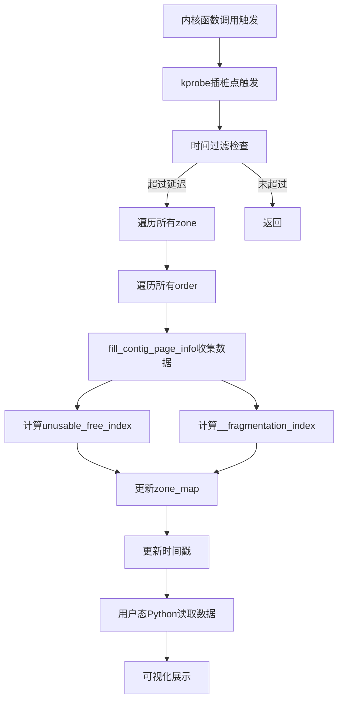

# 碎片化指数计算算法

<!-- WIKI_NAV_START -->
> [!info] 物理内存 Wiki 导航
> [[projects/Linux物理内存检测项目/index|项目首页]] · [[3.4.2 内存状态统计方法|← 上一篇：3.4.2 内存状态统计方法]] · [[3.5.1 curses终端可视化实现|下一篇：3.5.1 curses终端可视化实现 →]]
<!-- WIKI_NAV_END -->

> **学习重点：不要只背公式。** 先手算 `free_pages / free_blocks_total / free_blocks_suitable`，再分别解释 unusable 的“现象强度”和 extfrag 的“根因倾向”。指数必须结合 watermarks、reclaim、compaction 与目标请求理解。三组完整手算见 [[4.2.1 全链路手工追踪|全链路手工追踪]]，易混难点见 [[4.2.3 核心难点精讲|核心难点精讲]]。

本页面深入解析Linux物理内存碎片检测工具中碎片化指数的计算算法。碎片化指数通过数学公式将伙伴系统中的空闲块分布转化为针对特定 order 的诊断信号。

> [!abstract] 🎬 交互动画
> [打开“碎片化指数交互动画”](projects/Linux物理内存检测项目/assets/碎片化指数交互动画.html)，可以编辑各阶 `nr_free`，逐阶播放 `fill_contig_page_info`，并分别观察 `score_a` 与 `score_b` 的计算过程。


## 算法概述与设计背景

碎片化指数计算算法源于Linux内核的内存管理子系统，主要用于量化评估内存区域（zone）中连续空闲页面的可用性。在伙伴系统中，空闲内存被组织为不同阶数（order）的块，每个块包含2^order个连续页面。随着系统长时间运行，频繁的分配和释放会导致空闲页面分布不均，形成外部碎片化——即总空闲内存足够，但无法满足高阶连续分配需求的情况。

本工具实现了两个核心碎片化指数：**标准碎片化指数（extfrag_index）**和**不可用页指数（unusable_free_index）**。这两个指数从不同维度评估碎片化状态，前者侧重于判断分配困难是否由碎片主导，后者则量化当前空闲页面中无法满足分配需求的比例。

Sources: `fraginfo.c#L59-L168`, `linux物理内存检测工具原作者开发文档.md#L400-L600`

## 数据收集基础：contig_page_info结构体

碎片化指数的计算依赖于准确的内存状态数据，这些数据通过`contig_page_info`结构体收集：

```c
struct contig_page_info {
  unsigned long free_pages;           // 总空闲页数
  unsigned long free_blocks_total;    // 总空闲块数（所有order）
  unsigned long free_blocks_suitable; // 适合当前order的块数
};
```

数据收集的核心函数是`fill_contig_page_info`，它遍历伙伴系统的所有阶（0到MAX_ORDER），统计每个阶的空闲块信息：

1. **空闲页总数（free_pages）**：累加所有阶的空闲块数乘以对应阶的大小（`blocks << order`）
2. **空闲块总数（free_blocks_total）**：累加所有阶的空闲块数量
3. **适合当前请求的块数（free_blocks_suitable）**：统计阶数大于等于请求order的块数，并转换为等效的请求order块数（`blocks << (order - suitable_order)`）

这种设计使得算法能够准确评估当前内存状态下，满足特定阶数请求的连续内存块的可用性。

Sources: `fraginfo.c#L23-L58`, `linux物理内存检测工具原作者开发文档.md#L600-L800`

## 标准碎片化指数（extfrag_index）算法

标准碎片化指数（`__fragmentation_index`）是评估内存碎片化程度的主要指标，其计算公式为：

```
碎片化指数 = 1000 - [(1000 + (总空闲页数 × 1000 / 请求页数)) / 总空闲块数]
```

具体实现如下：

```c
static int __fragmentation_index(unsigned int order,
                               struct contig_page_info *info) {
  unsigned long requested = 1UL << order;
  if (WARN_ON_ONCE(order > MAX_ORDER))
    return 0;
  if (!info->free_blocks_total)
    return 0;
  if (info->free_blocks_suitable)
    return -1000;
  return 1000 -
         div_u64((1000 + (div_u64(info->free_pages * 1000ULL, requested))),
                 info->free_blocks_total);
}
```

**算法解析**：

1. **请求页数计算**：`requested = 1 << order`，表示请求的连续页面数
2. **边界条件处理**：
   - 若order超过MAX_ORDER，返回0
   - 若没有空闲块，返回0
   - 若存在满足需求的块（`free_blocks_suitable > 0`），直接返回-1000
3. **核心计算**：
   - 计算总空闲页数能满足多少个请求：`info->free_pages * 1000 / requested`
   - 添加基线值1000：`1000 + (info->free_pages * 1000 / requested)`
   - 除以总空闲块数：`(1000 + ...) / info->free_blocks_total`
   - 最终指数：`1000 - 除法结果`

**取值范围与含义**：
- **-1000**：存在满足需求的连续块，内存状态良好
- **0~1000**：指数越高，碎片化程度越严重
- **接近1000**：分配困难主要由碎片化主导
- **接近0**：分配困难主要由总空闲内存不足导致

Sources: `fraginfo.c#L31-L46`, `linux物理内存检测工具原作者开发文档.md#L400-L600`

## 不可用页指数（unusable_free_index）算法

不可用页指数（`unusable_free_index`）量化了当前空闲页面中无法满足特定order请求的比例，其计算公式为：

```
不可用页指数 = (总空闲页数 - 满足需求的连续页数) × 1000 / 总空闲页数
```

具体实现如下：

```c
static int unusable_free_index(unsigned int order,
                               struct contig_page_info *info) {
  if (info->free_pages == 0)
    return 1000;
  return div_u64(
      (info->free_pages - (info->free_blocks_suitable << order)) * 1000ULL,
      info->free_pages);
}
```

**算法解析**：

1. **特殊情况处理**：若没有空闲页，返回1000（100%不可用）
2. **核心计算**：
   - 满足需求的连续页数：`info->free_blocks_suitable << order`
   - 无法满足需求的页数：`info->free_pages - (info->free_blocks_suitable << order)`
   - 比例计算：`(无法满足需求的页数 * 1000) / 总空闲页数`

**取值范围与含义**：
- **0**：所有空闲页都能满足需求
- **1000**：所有空闲页都无法满足需求
- **比例解读**：值除以10得到百分比，例如500表示50%的空闲页无法使用

Sources: `fraginfo.c#L23-L30`, `linux物理内存检测工具原作者开发文档.md#L400-L600`

## 两个指数的协同分析与应用场景

两个碎片化指数从不同维度评估内存状态，协同分析能提供更准确的诊断：

| 场景 | score_b（不可用页指数） | score_a（标准碎片化指数） | 诊断结论 | 建议措施 |
|------|------------------------|--------------------------|----------|----------|
| 场景1 | 高（>500） | 高（>500） | 碎片化主导的分配困难 | 考虑内存压缩（compaction） |
| 场景2 | 高（>500） | 不高 | 总空闲内存不足 | 增加物理内存或优化内存使用 |
| 场景3 | 不高 | -1000 | 内存状态健康 | 无需干预 |

**实际应用场景**：

1. **性能监控**：定期采集碎片化指数，建立基线，及时发现碎片化恶化趋势
2. **故障诊断**：当内存分配失败时，通过指数判断是碎片化还是内存不足导致
3. **调优决策**：根据指数决定是否触发内存压缩、调整分配策略或增加物理内存
4. **容量规划**：结合碎片化趋势预测内存需求，提前规划扩展

**与内核阈值的关联**：
Linux内核通过`/proc/sys/vm/extfrag_threshold`（默认500）控制碎片化处理的敏感度。当碎片化指数超过阈值时，内核会更积极地触发kswapd或内存压缩。

Sources: [[1.1 学习总览与架构地图|linux-ebpf内存碎片监控复习.md]], `linux物理内存检测工具原作者开发文档.md#L600-L800`

## 算法实现流程与数据流

整个碎片化指数计算算法的实现流程如下：



**数据流说明**：

1. **触发阶段**：当内核调用`get_page_from_freelist`时，kprobe插桩点触发eBPF程序
2. **数据收集**：遍历所有zone和order，调用`fill_contig_page_info`收集空闲块统计
3. **指数计算**：基于收集的数据计算两个碎片化指数
4. **数据共享**：将计算结果存储在`zone_map`中，通过BPF map与用户态共享
5. **用户态处理**：Python程序从`zone_map`读取数据，转换为可展示的格式
6. **可视化展示**：通过curses终端UI展示碎片化指数和趋势

Sources: `fraginfo.c#L59-L168`, `exfrag.py#L1-L155`

## 性能优化与采样控制

碎片化指数计算算法通过多种机制优化性能，避免高频触发导致的系统开销：

**时间窗口采样控制**：
```c
// 时间过滤机制
u64 *last_time, current_time;
current_time = bpf_ktime_get_ns();
last_time = last_time_map.lookup(&current_time);
int key = 0;
int *delay_ptr = delay_map.lookup(&key);
int delay;
if (delay_ptr) {
    delay = *delay_ptr;
}
if (last_time && (current_time - *last_time < delay * 1000000000)) {
    return 0;  // 未超过延迟间隔，直接退出
}
```

**性能优化策略**：

1. **延迟采样**：通过`delay_map`控制最小采样间隔，避免高频触发
2. **增量更新**：仅在时间间隔超过阈值时执行完整计算
3. **安全内存访问**：使用`bpf_probe_read_kernel`避免直接解引用内核指针
4. **数据结构优化**：使用BPF_HASH和BPF_ARRAY高效存储和检索数据

**配置建议**：
- 监控模式：建议采样间隔2-5秒，平衡实时性与性能开销
- 故障诊断：可临时缩短间隔至1秒，获取更详细数据
- 长期监控：使用默认间隔，定期分析趋势

Sources: `fraginfo.c#L60-L80`, `exfrag.py#L20-L30`

## 用户态数据处理与展示

碎片化指数计算完成后，用户态Python程序负责数据转换和可视化展示：

**数据格式转换**：
```python
def calculate_scoreA(self, extfrag_index):
    extfrag_index_int_part = int(extfrag_index) // 1000
    extfrag_index_dec_part = int(extfrag_index) % 1000
    return f"{extfrag_index_int_part:2d}.{extfrag_index_dec_part:03d}"

def calculate_scoreB(self, unusable_index):
    unusable_index_int_part = int(unusable_index) // 1000
    unusable_index_dec_part = int(unusable_index) % 1000
    return f"{unusable_index_int_part:2d}.{unusable_index_dec_part:03d}"
```

**展示模式**：
1. **表格模式**：展示所有zone的碎片化指数，包括zone名称、order、scoreA、scoreB
2. **趋势模式**：显示碎片化指数随时间的变化趋势
3. **详细模式**：展示原始数据，包括free_pages、free_blocks_total、free_blocks_suitable

**可视化元素**：
- **颜色编码**：使用颜色区分不同碎片化程度（绿色：健康，黄色：警告，红色：危险）
- **进度条**：直观展示碎片化指数的大小
- **节点过滤**：支持按NUMA节点过滤数据

Sources: `exfrag.py#L30-L60`, `exfrag_user.py#L1-L200`

## 算法局限性与改进方向

当前碎片化指数计算算法存在一些局限性，了解这些局限性有助于正确解读结果和规划改进：

**算法局限性**：

1. **静态快照**：算法提供的是触发时刻的内存状态快照，无法反映碎片化动态变化
2. **order依赖**：指数计算依赖于特定的order值，不同order的结果可能差异很大
3. **区域独立性**：每个zone独立计算指数，无法反映跨zone的碎片化情况
4. **简化假设**：算法假设空闲块分布均匀，实际情况可能更复杂

**改进建议**：

1. **多维度评估**：结合多个order的指数，提供综合碎片化评分
2. **时间序列分析**：记录历史数据，分析碎片化变化趋势
3. **跨区域分析**：考虑跨zone的内存分布，评估整体碎片化状态
4. **机器学习应用**：使用机器学习算法预测碎片化发展趋势，提前预警

**实际应用中的注意事项**：

1. **结合上下文**：碎片化指数应结合系统负载、内存使用率等指标综合分析
2. **阈值调整**：根据应用场景调整`extfrag_threshold`，优化内存管理策略
3. **定期监控**：建立定期监控机制，及时发现碎片化恶化趋势
4. **根因分析**：当指数异常时，分析具体原因（内存泄漏、频繁分配释放等）

Sources: [[1.1 学习总览与架构地图|linux-ebpf内存碎片监控复习.md]], `linux物理内存检测工具原作者开发文档.md#L200-L400`

## 下一步学习建议

理解碎片化指数计算算法后，建议深入学习以下相关内容：

1. **[[3.4.2 内存状态统计方法|内存状态统计方法]]**：了解如何收集更全面的内存状态信息
2. **[[3.5.1 curses终端可视化实现|curses终端可视化实现]]**：学习如何将碎片化指数转化为直观的终端可视化
3. **[[3.5.2 性能优化与采样控制|性能优化与采样控制]]**：深入理解如何优化碎片化监控的性能开销
4. **[[3.2.3 内存分配快速路径监控|内存分配快速路径监控]]**：了解碎片化指数在内存分配监控中的应用

通过综合学习这些内容，可以全面掌握Linux物理内存碎片检测工具的核心技术，为系统性能优化和故障诊断提供有力支持。

<!-- WIKI_FOOTER_START -->
---
> [!tip] 继续阅读
> [[projects/Linux物理内存检测项目/index|项目首页]] · [[3.4.2 内存状态统计方法|← 上一篇：3.4.2 内存状态统计方法]] · [[3.5.1 curses终端可视化实现|下一篇：3.5.1 curses终端可视化实现 →]]
<!-- WIKI_FOOTER_END -->
