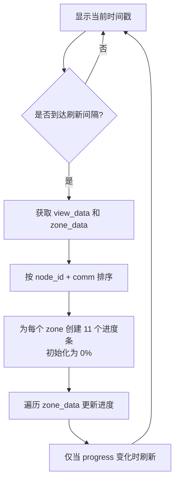

# curses终端可视化实现

<!-- WIKI_NAV_START -->
> [!info] 物理内存 Wiki 导航
> [[projects/Linux物理内存检测项目/index|项目首页]] · [[3.4.3 碎片化指数计算算法|← 上一篇：3.4.3 碎片化指数计算算法]] · [[3.5.2 性能优化与采样控制|下一篇：3.5.2 性能优化与采样控制 →]]
<!-- WIKI_NAV_END -->

本文档深入解析项目的终端可视化层——如何利用 Python curses 库，将 eBPF 采集到的内核态内存碎片数据，渲染为支持颜色高亮、进度条和多种显示模式的交互式终端界面。整套可视化逻辑集中在 `exfrag_user.py` 中，是用户与底层 eBPF 数据采集系统之间的最终呈现桥梁。

## 整体架构与数据流

curses 可视化层位于整个项目架构的最顶层，它不直接参与 eBPF 数据采集，而是从 [[3.1.3 用户态Python架构|extfrag.py]] 提供的接口读取已整理好的 Python 数据结构，然后通过 curses 库将其渲染到终端屏幕。其数据流路径如下：


整个可视化层的核心入口是 `curses.wrapper(main)`，它负责初始化 curses 环境并将 `stdscr` 屏幕对象传递给 `main(screen)` 函数。这种设计保证了即使程序异常退出，终端也能被正确恢复到原始状态。

Sources: `exfrag_user.py#L308-L423`

## curses 环境初始化

`main(screen)` 函数的前段代码完成了整个 curses 环境的初始化，这些调用共同建立了可视化所需的基础运行时状态：

| 初始化调用 | 作用 | 设计意图 |
|:---|:---|:---|
| `curses.curs_set(0)` | 隐藏光标 | 纯展示模式，不需要用户输入 |
| `screen.nodelay(True)` | 非阻塞键盘读取 | `getch()` 不会阻塞刷新循环 |
| `curses.noecho()` | 关闭输入回显 | 防止用户按键干扰屏幕内容 |
| `curses.cbreak()` | 禁用行缓冲 | 单键即时响应 |
| `curses.start_color()` | 启用颜色支持 | 为后续颜色对定义做准备 |

初始化完成后，程序定义了 **7 组颜色对**，用于不同数据元素的语义化高亮显示：

| 颜色对编号 | 前景/背景 | 用途 |
|:---|:---|:---|
| 1 | 黑/黑 | 进度条清空背景 |
| 2 | 红/黑 | 高风险碎片化指标、错误提示 |
| 3 | 绿/黑 | 正常状态的 zone 数据行 |
| 4 | 蓝/黑 | 表头标题文字 |
| 5 | 品红/黑 | 预留（已定义但未使用） |
| 6 | 青/黑 | 预留（已定义但未使用） |
| 7 | 白/黑 | 预留（已定义但未使用） |

Sources: `exfrag_user.py#L64-L82`

## 屏幕尺寸自适应检测

项目实现了一个阻塞式的屏幕尺寸检测函数 `screenEnough(screen)`，该函数要求终端窗口**至少 50 行 × 250 列**才能正常显示。当屏幕尺寸不满足条件时，会在屏幕中央显示红色错误提示，并阻塞等待用户调整窗口大小或按 `Ctrl+C` 退出。检测逻辑使用 `curses.KEY_RESIZE` 事件监听窗口大小变化，一旦满足条件即自动清除提示并继续执行。

这种设计源于碎片化可视化需要同时展示多个 zone 的多阶数据（order 0～10），加上表头和进度条，需要较大的终端窗口面积。如果屏幕尺寸不足，会导致 `curses.error` 异常。

Sources: `exfrag_user.py#L38-L62`

## 命令行参数解析与显示模式

`exfrag_user.py` 通过 `sys.argv` 手动解析命令行参数，支持多种显示模式组合。不同的参数组合决定了数据的获取方式和渲染形式：

```mermaid
flowchart TD
    A["程序启动"] --> B{参数解析}
    B -->|"-h" / "--help"| C["帮助信息模式"]
    B -->|"-n"| D["节点信息模式"]
    B -->|"-s"| E["外碎片化事件计数模式"]
    B -->|"-z"| F["详细 zone 信息模式"]
    B -->|"-v"| G["可视化进度条模式"]
    B -->|无特殊参数| H["紧凑 zone 摘要模式"]
```

参数及其控制逻辑的完整对应关系如下：

| 参数 | 短选项 | 作用 | 影响的 ExtFrag 方法 |
|:---|:---|:---|:---|
| `--delay` | `-d` | 设置刷新间隔（秒） | 控制采样频率 |
| `--node_info` | `-n` | 显示 NUMA 节点信息 | `get_node_data()` |
| `--node_id` | `-i` | 按节点 ID 过滤 | `get_zone_data(node_id)` |
| `--comm` | `-c` | 按 zone 名称过滤 | 过滤显示 |
| `--extfrag_index` | `-e` | 仅显示 extfrag_index | 控制表头和数据列 |
| `--unusable_index` | `-u` | 仅显示 unusable_index | 控制表头和数据列 |
| `--output_count` | `-s` | 显示外碎片化事件计数 | `get_count_data()` |
| `--bar` | `-b` | 在表格后追加碎片化条形图 | `generate_fragmentation_bar()` |
| `--zone_info` | `-z` | 显示详细 zone 信息 | `get_zone_data()` |
| `--view` | `-v` | 可视化进度条模式 | `get_view_data()` + `get_zone_data()` |

Sources: `exfrag_user.py#L85-L170`

## 表格渲染模式

除进度条模式外，其余显示模式均采用**表格渲染**的统一范式：先绘制带颜色的表头行，再逐行填充数据。每行输出前都会检查是否超出屏幕边界（`row < max_rows - 1` 且 `len(line) < max_cols - 1`），超出时会自动截断行内容，防止 `curses.error` 异常。

**节点信息模式**（`-n`）从 `extfrag.get_node_data()` 获取节点数据，展示 NODE_ID、zone 数量和节点起始页帧号：

```
                                NODE_ID                                              Number of Zones                                                       NODE_START_PFN
                                   0                                                       11                                                                    0x...
```

**外碎片化事件计数模式**（`-s`）从 `extfrag.get_count_data()` 获取按 count 降序排列的事件列表，展示进程名、PID、PFN、分配阶、降级阶和触发次数。这个排行榜能快速定位哪个进程最频繁触发外碎片化事件。

**详细 zone 信息模式**（`-z`）是最信息密集的表格视图，它同时展示 zone 的物理地址范围、空闲页统计和碎片化指数。当 `order > 5` 且 `scoreB > 0.5` 时，该行会被渲染为**红色**（`curses.color_pair(2)`），表示高碎片化风险区域。这是项目中唯一的**语义化条件高亮**机制。

Sources: `exfrag_user.py#L187-L295`

## 进度条可视化模式（-v）

进度条模式（`-v`）是项目中视觉效果最丰富的显示模式。它将每个 zone 在每个 order（0～10）上的 `unusable_index` 碎片化指数，渲染为独立的 curses 进度条小窗口。

### 进度条架构

该模式使用了两个辅助函数构建进度条组件：

**`createBar(height, width, y, x, title)`** — 创建带边框的子窗口，标题为 order 编号。每个进度条固定为 3 行 × 21 列，每个 zone 在一行中水平排列 11 个进度条（对应 order 0～10），形成"Node N, zone XXX"的可视化仪表板。

**`setProgress(win, progress)`** — 在进度条窗口内绘制百分比进度。使用全角字符 `█`（U+2588）作为填充块，通过计算 `progress` 对应的字符宽度来确定填充量。进度条右侧实时显示百分比数值（如 `45.2%`）。颜色策略为：已填充部分使用**绿色**（`color_pair(3)`），未填充部分使用**黑色**（`color_pair(1)`）形成对比。

### 渲染流程

进度条模式的渲染遵循严格的时序控制：



关键设计细节在于，进度条的**初始化**和**更新**是分两步完成的：第一步根据 `view_data` 创建所有进度条窗口并初始化为 0%；第二步遍历 `zone_data` 将实际的 `scoreB` 值写入对应的进度条。只有当数值发生变化时（`progress != current_progress[key]`）才会调用 `setProgress` 刷新，避免不必要的屏幕重绘。屏幕左上角持续显示当前时间戳，提供视觉上的实时感。

Sources: `exfrag_user.py#L12-L35`, `exfrag_user.py#L286-L330`

## 文本条形图辅助函数

独立于 curses 进度条之外，项目还实现了一个纯文本条形图函数 `generate_fragmentation_bar(score, max_length=20)`，可与表格模式的 `-b` 参数配合使用。该函数将 0～1 的碎片化分数映射为 20 字符宽的 ASCII 条形图，已填充部分用 `#` 表示，未填充部分用 `-` 表示。虽然视觉效果不如 curses 进度条丰富，但这种纯文本方案在日志记录或非 curses 环境下仍有实用价值。

Sources: `exfrag_user.py#L12-L16`

## 刷新机制与性能控制

不同显示模式采用了两种不同的刷新策略：

| 显示模式 | 刷新策略 | 原因 |
|:---|:---|:---|
| 表格模式（默认/-n/-s/-z） | 每次循环 `time.sleep(delay)` 后完整重绘 | 数据变化频率低，全量刷新即可 |
| 进度条模式（-v） | 基于 `last_update_time` 的时间差判断，仅更新变化项 | 进度条数量多（zone × 11），增量更新减少闪烁 |
| 时间戳显示 | 每次循环都更新 | 增强实时感 |

这种差异化的刷新设计体现了性能优化的考量：进度条模式需要管理大量子窗口（例如 3 个 zone × 11 个 order = 33 个进度条），如果每次都销毁重建会引入明显的视觉闪烁，因此采用"初始化一次 + 按需更新"的策略。

Sources: `exfrag_user.py#L220-L225`, `exfrag_user.py#L320-L330`

## 条件高亮与风险指示

项目中的颜色使用遵循一套简单但有效的语义规则：

| 条件 | 颜色 | 语义 |
|:---|:---|:---|
| `order > 5` 且 `scoreB > 0.5` | 红色 | 高碎片化风险，可能需要 compaction |
| 其他情况 | 绿色 | 碎片化程度可接受 |
| 表头 | 蓝色 | 结构化标识 |
| 错误/警告 | 红色 + 粗体 | 异常状态提示 |

`order > 5` 对应至少 64 个连续页面（256KB），而 `scoreB > 0.5` 表示超过一半的空闲页无法满足该阶数的分配请求。当这两个条件同时成立时，意味着系统在中大粒度连续内存分配上面临严重压力，这正是 [[3.4.3 碎片化指数计算算法|碎片化指数计算算法]] 中讨论的 `unusable_free_index` 的实际应用场景。

Sources: `exfrag_user.py#L260-L265`, `exfrag_user.py#L346-L350`

## 在项目架构中的位置

curses 可视化层是整个 eBPF 内存碎片检测系统中唯一面向用户交互的组件。它**不负责任何数据采集或计算**，仅从 `extfrag.py` 的 ExtFrag 类读取已处理好的数据并渲染。这种职责分离使得可视化层可以独立演进——例如替换为 Web UI 或 Grafana 插件——而不影响底层的 eBPF 采集逻辑和数据处理管道。了解本层之后，建议进一步阅读 [[3.5.2 性能优化与采样控制|性能优化与采样控制]] 和 [[3.5.3 数据解析与格式化输出|数据解析与格式化输出]] 来理解数据从内核态到终端屏幕的完整链路。

<!-- WIKI_FOOTER_START -->
---
> [!tip] 继续阅读
> [[projects/Linux物理内存检测项目/index|项目首页]] · [[3.4.3 碎片化指数计算算法|← 上一篇：3.4.3 碎片化指数计算算法]] · [[3.5.2 性能优化与采样控制|下一篇：3.5.2 性能优化与采样控制 →]]
<!-- WIKI_FOOTER_END -->
