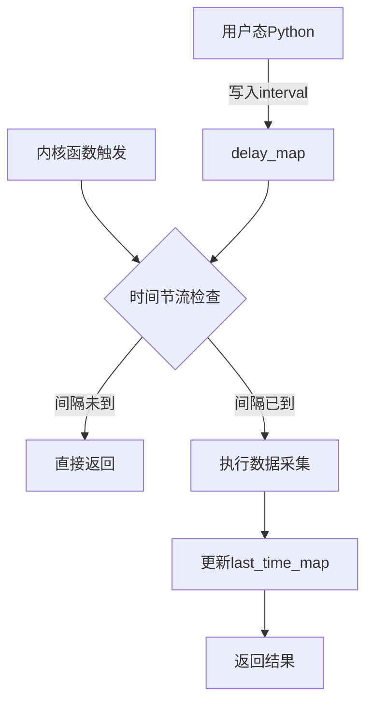

# 性能优化与采样控制

<!-- WIKI_NAV_START -->
> [!info] 物理内存 Wiki 导航
> [[projects/Linux物理内存检测项目/index|项目首页]] · [[3.5.1 curses终端可视化实现|← 上一篇：3.5.1 curses终端可视化实现]] · [[3.5.3 数据解析与格式化输出|下一篇：3.5.3 数据解析与格式化输出 →]]
<!-- WIKI_NAV_END -->

> **重要：本页原内容描述的是“预期的节流设计”，不是当前已验证的性能结论。** 源码用 `current_time` 作为 `last_time_map` key，下一次触发会查询另一个 key；`extfraginfo.c` 还没有更新时间戳。因此当前节流不闭环，也没有 benchmark 能证明生产低开销。请结合 [[4.1 源码审计与事实边界|源码审计与事实边界]] 阅读。

本文档解析Linux物理内存碎片检测工具希望采用的性能优化机制和采样控制策略，并对照当前实现理解修复方向。

## 采样控制机制概述

本工具的核心性能优化意图体现在**时间节流机制**上：希望通过`delay_map`和`last_time_map`两个BPF map协同工作，降低内核探针完整采集频率。其核心思想是：**即使内核函数被频繁调用，也不必每次都执行完整的数据采集逻辑**。但当前 key 与更新逻辑必须修复后才能达到这个目标。

在`extfraginfo.c`和`fraginfo.c`两个eBPF程序中，都采用了相同的采样控制模式。这种设计使得工具能够在高频内存分配路径上保持低开销运行，适合长期监控场景。



Sources: `extfraginfo.c#L20-L32`, `fraginfo.c#L91-L105`

## 时间节流原理

时间节流机制的实现遵循一个简单而高效的算法：**获取当前时间 → 查询上次采样时间 → 比较时间间隔 → 决定是否执行采集**。

### 核心代码逻辑

两个eBPF程序都包含相同的时间过滤逻辑：

```c
u64 *last_time, current_time;
current_time = bpf_ktime_get_ns();  // 获取当前时间
last_time = last_time_map.lookup(&current_time);
int key = 0;
int *delay_ptr = delay_map.lookup(&key);
int delay;
if (delay_ptr) {
    delay = *delay_ptr;
}
if (last_time && (current_time - *last_time < delay * 1000000000)) {
    return 0;
}
```

这段代码的工作流程如下：

1. **时间获取**：使用`bpf_ktime_get_ns()`获取纳秒级精度的系统启动时间
2. **查询历史**：从`last_time_map`中查找上次采样的时间戳
3. **读取配置**：从`delay_map[0]`中读取用户态设置的采样间隔（单位：秒）
4. **时间比较**：如果当前时间与上次采样时间的差值小于配置的间隔，则直接返回
5. **更新记录**：如果决定执行采集，则在采集完成后更新`last_time_map`

Sources: `extfraginfo.c#L21-L32`, `fraginfo.c#L94-L105`

### 关键数据结构

采样控制涉及两个关键的BPF map：

| Map名称 | 类型 | 作用 | 数据流向 |
|---------|------|------|----------|
| `delay_map` | `BPF_ARRAY` | 存储采样间隔配置（秒） | 用户态 → 内核态 |
| `last_time_map` | `BPF_HASH` | 存储上次采样时间戳 | 内核态内部使用 |

`delay_map`是一个长度为1的数组，本质上是一个配置项存储器。用户态Python程序通过修改`delay_map[0]`的值来动态调整采样频率。

当前 `last_time_map` 把当前时间戳同时作为 key 和 value。正因为每个时间戳几乎唯一，下一次触发不会命中上一条记录，所以它保存成了不断增长的时间戳集合，而不是可复用的“上次采样时间”。应改用固定 key，并另行定义多 CPU 并发语义。

Sources: `extfraginfo.c#L17-L18`, `fraginfo.c#L45-L46`

## 用户态配置传递

Python用户态程序负责将采样配置传递给内核态eBPF程序。这一过程通过BCC框架提供的map操作接口实现。

### 配置初始化流程

在`exfrag.py`的`ExtFrag`类构造函数中，采样间隔被写入`delay_map`：

```python
def __init__(self, interval=2, output_extfrag_index=False, 
             output_unusable_index=False, output_count=False, zone_info=False):
    self.interval = interval
    # ... 其他初始化代码 ...
    if self.output_count:
        self.b = BPF(src_file="./bpf/extfraginfo.c")
    else:
        self.b = BPF(src_file="./bpf/fraginfo.c")
    delay_key = 0
    self.b["delay_map"][delay_key] = ctypes.c_int(interval)
```

这段代码的关键点：
1. **默认间隔**：采样间隔默认值为2秒
2. **动态配置**：间隔值通过`interval`参数传入，支持命令行自定义
3. **类型转换**：使用`ctypes.c_int`确保数据类型匹配
4. **双向通信**：展示了map作为"用户态→内核态"配置通道的典型用法

Sources: `exfrag.py#L8-L22`

### 命令行参数接口

用户可以通过`-d`或`--delay`参数指定采样间隔：

```python
# 命令行参数解析
args = {
    'delay': 2,  # 默认值
    # ... 其他参数 ...
}
for i in range(1, len(sys.argv)):
    arg = sys.argv[i]
    if arg in ['-d', '--delay']:
        args['delay'] = int(sys.argv[i + 1])
```

使用示例：
```bash
# 使用默认2秒间隔
sudo ./exfrag_user.py -z

# 设置5秒采样间隔
sudo ./exfrag_user.py -d 5 -z

# 设置1秒间隔（更高频率监控）
sudo ./exfrag_user.py -d 1 -z
```

Sources: `exfrag_user.py#L147-L149`, `exfrag_user.py#L181-L182`

## 两种探针的采样策略

本工具的两个eBPF程序分别监控不同的内核函数，但都采用了相同的采样控制策略。这种设计体现了**事件监控与状态巡检的互补性**。

### Tracepoint探针：`extfraginfo.c`

**监控目标**：`mm_page_alloc_extfrag`内核事件
**触发时机**：当内存分配因碎片化需要降级（fallback）时触发
**采样特点**：事件驱动，只在碎片化问题发生时触发

```c
TRACEPOINT_PROBE(kmem, mm_page_alloc_extfrag) {
    // 时间节流检查
    // ...
    
    // 事件数据采集
    struct data_t *data, zero = {};
    pid_t pid = bpf_get_current_pid_tgid() >> 32;
    data = counts_map.lookup(&pid);
    if (!data) {
        zero.pid = pid;
        zero.pfn = args->pfn;
        zero.alloc_order = args->alloc_order;
        zero.fallback_order = args->fallback_order;
        zero.count = 1;
        bpf_get_current_comm(&zero.pcomm, sizeof(zero.pcomm));
        counts_map.update(&pid, &zero);
    } else {
        data->count += 1;
        // ... 更新数据 ...
    }
    return 0;
}
```

**设计考量**：
1. **按进程聚合**：使用PID作为key，统计每个进程触发碎片化事件的次数
2. **增量更新**：只更新变化的字段，减少map操作开销
3. **进程上下文补充**：通过eBPF helper函数获取进程名，因为tracepoint原始参数不包含此信息

Sources: `extfraginfo.c#L20-L59`

### Kprobe探针：`fraginfo.c`

**监控目标**：`get_page_from_freelist`内核函数
**触发时机**：每次内核尝试从空闲链表分配物理页面时（快速路径）
**采样特点**：状态巡检，采集系统整体内存碎片状态

```c
int kprobe__get_page_from_freelist(struct pt_regs *ctx, gfp_t gfp_mask,
                                   unsigned int order, int alloc_flags,
                                   const struct alloc_context *ac) {
    // 时间节流检查
    // ...
    
    // 遍历所有zone和order，采集状态数据
    struct pglist_data *pgdat;
    pgdat = ac->preferred_zoneref->zone->zone_pgdat;
    
    for (i = 0; i < MAX_NR_ZONES; i++) {
        // 更新node信息
        // 更新zone信息
        for (a_order = 0; a_order <= MAX_ORDER; ++a_order) {
            // 计算碎片化指标
            // 写入zone_map
        }
    }
    last_time_map.update(&current_time, &current_time);
    return 0;
}
```

**设计考量**：
1. **全量扫描**：遍历所有zone和order，提供系统全景视图
2. **状态快照**：记录每个zone在不同order下的碎片化状态
3. **低侵入性**：只读取内核数据结构，不修改任何内核状态

Sources: `fraginfo.c#L91-L168`

### 采样策略对比

| 特性 | `extfraginfo.c` (Tracepoint) | `fraginfo.c` (Kprobe) |
|------|------------------------------|------------------------|
| **监控类型** | 事件监控（故障单） | 状态巡检（体检报告） |
| **触发频率** | 较低（只在碎片化事件发生时） | 较高（每次页分配时） |
| **数据粒度** | 进程级事件统计 | zone+order级状态快照 |
| **性能影响** | 较小 | 需要更严格的节流 |
| **适用场景** | 故障定位、进程分析 | 系统健康评估、趋势分析 |

## 性能优化设计

### 为什么需要采样控制

内存分配是Linux内核中最频繁的操作之一。`get_page_from_freelist`作为伙伴系统快速路径的核心函数，每秒可能被调用数万次甚至更多。如果每次都执行完整的数据采集逻辑，会导致：

1. **CPU开销过高**：遍历所有zone和order的计算量较大
2. **map操作频繁**：大量的map读写操作会增加内核锁竞争
3. **系统性能下降**：监控工具本身成为性能瓶颈

通过时间节流机制，工具能够：
- **降低CPU使用率**：只在配置的时间间隔内执行采集
- **减少map操作**：大幅降低map的读写频率
- **保持数据新鲜度**：在合理间隔内提供足够的监控精度

### 时间节流的权衡

采样间隔的选择需要在**监控精度**和**系统开销**之间找到平衡：

| 采样间隔 | 监控精度 | 系统开销 | 适用场景 |
|---------|---------|---------|---------|
| 1秒 | 高 | 较高 | 调试环境、问题复现 |
| 2秒（默认） | 中等 | 适中 | 一般监控、日常运维 |
| 5秒 | 较低 | 较低 | 生产环境、长期监控 |
| 10秒+ | 低 | 很低 | 趋势分析、历史记录 |

### 内存使用优化

除了时间节流，工具还在数据存储方面进行了优化：

1. **按PID聚合**：`counts_map`不存储每个事件，而是按进程聚合统计，大幅减少map条目数
2. **增量更新**：只更新变化的字段，减少map操作的数据传输量
3. **结构体复用**：使用固定的结构体大小，避免动态内存分配

Sources: `extfraginfo.c#L7-L14`, `fraginfo.c#L8-L27`

## 配置参数详解

### 命令行参数

工具提供以下与性能相关的配置参数：

| 参数 | 长参数 | 默认值 | 说明 |
|------|--------|--------|------|
| `-d` | `--delay` | 2 | 采样间隔（秒），控制数据更新频率 |
| `-s` | `--output_count` | 无 | 输出外碎片化事件计数（使用extfraginfo.c） |
| `-z` | `--zone_info` | 无 | 显示详细zone信息（使用fraginfo.c） |
| `-v` | `--view` | 无 | 显示碎片化可视化图表 |

### 配置示例

**场景1：高精度调试**
```bash
sudo ./exfrag_user.py -d 1 -z -b
```
- 1秒采样间隔，提供最高监控精度
- 显示zone详细信息和碎片化条形图

**场景2：生产环境监控**
```bash
sudo ./exfrag_user.py -d 5 -z
```
- 5秒采样间隔，平衡精度和开销
- 只显示zone基本信息，减少屏幕刷新

**场景3：进程级故障定位**
```bash
sudo ./exfrag_user.py -d 2 -s
```
- 2秒采样间隔（默认）
- 输出外碎片化事件计数，定位问题进程

### 动态调整

采样间隔可以在程序运行时通过重启并指定新参数来调整。工具不支持运行时动态修改间隔，因为：
1. **简单性**：避免复杂的运行时配置机制
2. **稳定性**：避免并发修改配置带来的竞态条件
3. **可预测性**：用户明确知道当前配置

## 最佳实践和调优建议

### 选择合适的采样间隔

1. **开发测试环境**：使用1-2秒间隔，便于快速发现问题
2. **预生产环境**：使用2-3秒间隔，平衡监控效果和系统影响
3. **生产环境**：使用5-10秒间隔，最小化性能影响
4. **长期趋势分析**：使用10-30秒间隔，关注整体趋势而非瞬时值

### 组合使用监控模式

不同监控模式适合不同的分析需求：

| 分析目标 | 推荐参数组合 | 说明 |
|---------|-------------|------|
| **实时健康监控** | `-d 2 -z` | 快速了解系统整体状态 |
| **问题进程定位** | `-d 2 -s` | 找出频繁触发碎片化事件的进程 |
| **详细状态分析** | `-d 1 -z -b` | 获取每个zone的详细状态 |
| **可视化展示** | `-d 2 -v` | 直观查看碎片化趋势 |

### 性能监控建议

1. **监控工具自身开销**：观察`top`或`htop`中Python进程的CPU使用率
2. **调整间隔**：如果工具CPU使用率过高，增加采样间隔
3. **选择性监控**：使用`-c`参数只监控特定zone（如`Normal`）
4. **避免过度监控**：不要同时使用`-z`和`-s`，除非确实需要

### 故障排查

**问题1：工具响应缓慢**
- 原因：采样间隔过短，系统负载过高
- 解决：增加采样间隔，如`-d 5`

**问题2：数据更新不及时**
- 原因：采样间隔过长
- 解决：减少采样间隔，如`-d 1`

**问题3：终端显示异常**
- 原因：屏幕尺寸不足
- 解决：调整终端窗口大小，或使用`-e`/`-u`参数只显示关键指标

## 监控和调试

### 性能指标

工具的性能主要受以下因素影响：

1. **采样间隔**：直接影响数据新鲜度和系统开销
2. **监控模式**：`-z`模式比`-s`模式计算量更大
3. **系统内存规模**：zone数量越多，采集时间越长
4. **内核函数调用频率**：`get_page_from_freelist`调用频率越高，节流效果越明显

### 调试技巧

1. **验证采样控制**：
   ```bash
   # 使用极短间隔观察工具行为
   sudo ./exfrag_user.py -d 0.1 -z
   ```
   注意：过短的间隔可能导致工具不稳定

2. **检查map内容**：
   ```python
   # 在Python代码中添加调试输出
   print(f"delay_map[0] = {self.b['delay_map'][0]}")
   ```

3. **性能分析**：
   ```bash
   # 使用time命令测量工具启动时间
   time sudo ./exfrag_user.py -d 2 -z
   ```

### 扩展性考虑

当前的采样控制机制具有良好的扩展性：

1. **支持更复杂的节流策略**：可以扩展为基于事件频率的自适应节流
2. **支持多级采样**：不同重要性的指标使用不同的采样间隔
3. **支持运行时配置**：可以通过额外的map实现运行时间隔调整

## 总结

性能优化与采样控制是本工具走向可长期运行所必须完成的设计。修复 `last_time_map` 状态机并通过 benchmark 验证后，目标是实现：

1. **可量化的低开销监控**：用时间节流降低完整扫描频率，并用对照测试证明影响
2. **灵活配置**：用户可以根据需求调整采样精度
3. **智能权衡**：在监控精度和系统开销之间找到最佳平衡点

这种设计体现了eBPF监控工具的核心思想：**最小化侵入性，最大化实用性**。通过合理的采样控制，开发者能够在不影响系统正常运行的情况下，获得有价值的内存碎片化监控数据。

<!-- WIKI_FOOTER_START -->
---
> [!tip] 继续阅读
> [[projects/Linux物理内存检测项目/index|项目首页]] · [[3.5.1 curses终端可视化实现|← 上一篇：3.5.1 curses终端可视化实现]] · [[3.5.3 数据解析与格式化输出|下一篇：3.5.3 数据解析与格式化输出 →]]
<!-- WIKI_FOOTER_END -->
