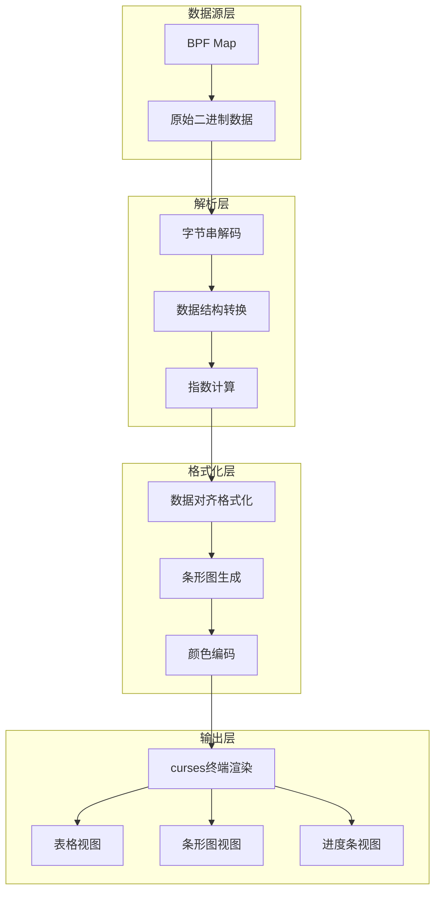

# 数据解析与格式化输出

<!-- WIKI_NAV_START -->
> [!info] 物理内存 Wiki 导航
> [[projects/Linux物理内存检测项目/index|项目首页]] · [[3.5.2 性能优化与采样控制|← 上一篇：3.5.2 性能优化与采样控制]] · [[4.1 源码审计与事实边界|下一篇：4.1 源码审计与事实边界 →]]
<!-- WIKI_NAV_END -->

数据解析与格式化输出是连接内核态eBPF数据采集与用户态终端可视化的关键桥梁。它负责将从BPF map中读取的原始二进制数据转换为人类可读的格式，并通过curses终端实现多样化的可视化展示。本页面详细解析从数据解析、格式化处理到最终输出的完整流程。

## 数据解析架构概览

数据解析与格式化输出采用分层架构设计，将原始数据转换为可视化输出的过程分为四个层次。这种分层设计确保了各层职责清晰，便于维护和扩展。



**数据解析的核心理念**：eBPF程序在内核态采集的原始数据需要经过系统化的解析、计算和格式化，才能转化为用户可理解的碎片化信息。这个过程不仅是简单的数据转换，更是将内核内存管理状态映射为直观指标的关键步骤。

## BPF Map数据读取与解码

BPF Map是内核态与用户态数据共享的核心机制。数据解析的第一步是从相应的BPF Map中读取原始数据，并进行必要的解码处理。不同的Map存储不同类型的数据，需要采用对应的解析策略。

```python
# 从zone_map读取区域数据的示例
zone_map = self.b["zone_map"]
for key, value in zone_map.items():
    comm = value.name.decode('utf-8', 'replace').rstrip('\x00')
    node_id = value.node_id
    # 构建数据字典
    data = {
        'comm': comm,
        'zone_pfn': value.zone_start_pfn,
        'spanned_pages': value.spanned_pages,
        # ... 其他字段
    }
```

**关键解析操作**：
1. **字节串解码**：进程名和区域名称在BPF中以字节数组存储，需要使用`decode('utf-8', 'replace')`解码
2. **空字符移除**：使用`rstrip('\x00')`移除C字符串的空终止符
3. **数据结构转换**：将ctypes结构体转换为Python字典，便于后续处理
4. **数据聚合**：按区域名称或节点ID聚合数据，构建层次化数据结构

**数据读取的性能考量**：BPF Map的读取操作涉及内核态到用户态的数据复制，需要考虑批量读取和缓存机制。当前实现采用全量读取策略，在数据量较大时可能成为性能瓶颈。

## 碎片化指数计算与格式化

碎片化指数是评估内存碎片化程度的核心指标，包括extfrag_index（外部碎片化指数）和unusable_index（不可用内存指数）。这些指数在内核态以整数形式存储，需要转换为用户可读的浮点数格式。

```python
def calculate_scoreA(self, extfrag_index):
    """将extfrag_index转换为可读格式"""
    extfrag_index_int_part = int(extfrag_index) // 1000
    extfrag_index_dec_part = int(extfrag_index) % 1000
    return f"{extfrag_index_int_part:2d}.{extfrag_index_dec_part:03d}"

def calculate_scoreB(self, unusable_index):
    """将unusable_index转换为可读格式"""
    unusable_index_int_part = int(unusable_index) // 1000
    unusable_index_dec_part = int(unusable_index) % 1000
    return f"{unusable_index_int_part:2d}.{unusable_index_dec_part:03d}"
```

**指数格式化原理**：
- **整数部分**：通过整除1000获得指数的整数部分
- **小数部分**：通过取模1000获得指数的小数部分（三位小数精度）
- **格式化输出**：使用f-string确保整数部分至少2位，小数部分固定3位
- **数值范围**：extfrag_index范围为-1000到1000，unusable_index范围为0到1000

**指数计算的内核实现**：这些指数在内核态通过`__fragmentation_index()`和`unusable_free_index()`函数计算，分别衡量连续页分配的难易程度和不可用内存的比例。

## 数据对齐与表格格式化

为了在终端中清晰展示内存碎片化信息，需要将数据格式化为对齐的表格形式。不同的数据字段需要不同的对齐策略和列宽，以确保表格的可读性。

```python
# 表头格式化示例
header = f"{'ZONE_COMM':>5} {'ZONE_PFN':>15} {'SUM_PAGES':>20} {'FACT_PAGES':>20} " \
         f"{'ORDER':>15} {'TOTAL':>20} {'SUITABLE':>20} {'FREE':>20} {'NODE_ID':>20} {'extfrag_index':>25}"

# 数据行格式化示例
line = f"{zone['comm']:^9} {zone['zone_pfn']:^20} {zone['spanned_pages']:^22} " \
       f"{zone['present_pages']:^18} {zone['order']:^15} {zone['free_blocks_total']:^25} " \
       f"{zone['free_blocks_suitable']:^15} {zone['free_pages']:^25} {zone['node_id']:^15} {zone['scoreA']:^20}"
```

**表格格式化策略**：
- **右对齐（>）**：用于数值型字段，便于数值比较
- **居中对齐（^）**：用于文本型字段，增强视觉平衡
- **列宽控制**：通过数字指定最小列宽，确保表格结构稳定
- **自适应截断**：当数据超出屏幕宽度时，进行智能截断处理

**多视图模式支持**：系统支持三种主要视图模式，每种模式采用不同的表格格式：
1. **完整信息视图**：显示所有字段，包括PFN、页数、块数等详细信息
2. **指数视图**：仅显示区域名称、节点ID、订单和指数信息
3. **外碎片事件视图**：显示进程名、PID、PFN、分配订单等事件信息

## 条形图可视化生成

条形图是碎片化指数的重要可视化形式，能够直观展示内存碎片化的程度。系统使用ASCII字符生成终端兼容的条形图，支持不同长度的条形和精确的比例表示。

```python
def generate_fragmentation_bar(score, max_length=20):
    """生成用于显示碎片化程度的条形图"""
    proportion = min(max(score, 0), 1)
    bar_length = int(proportion * max_length)
    return '#' * bar_length + '-' * (max_length - bar_length)
```

**条形图设计原理**：
- **比例缩放**：将0-1的分数映射到0-20的条形长度
- **边界处理**：使用`min(max(score, 0), 1)`确保比例在有效范围内
- **字符选择**：使用`#`表示已用部分，`-`表示剩余部分，确保视觉对比
- **长度控制**：通过`max_length`参数控制条形图的最大长度

**条形图集成**：条形图作为表格的最后一列集成，为每个内存区域提供直观的碎片化程度可视化。当启用`-b`或`--bar`参数时，系统会在表格中添加条形图列。

## 颜色编码与风险标识

系统使用颜色编码来标识内存碎片化的风险等级，帮助用户快速识别需要关注的内存区域。颜色编码基于订单大小和不可用指数两个维度进行综合评估。

```python
# 颜色编码逻辑
color = curses.color_pair(3)  # 绿色表示正常
if zone['order'] > 5 and float(zone['scoreB']) > 0.5:
    color = curses.color_pair(2)  # 红色表示高风险
```

**风险标识规则**：
- **正常状态**：绿色（color_pair(3)），表示内存碎片化程度较低
- **高风险状态**：红色（color_pair(2)），当订单大于5且不可用指数超过0.5时触发
- **中等风险**：黄色（color_pair(5)），用于中等碎片化程度（未在当前代码中实现）

**颜色编码的内存管理意义**：
- **订单大于5**：表示需要较大的连续内存块（64页或更多）
- **不可用指数超过0.5**：表示超过50%的空闲内存无法用于连续分配
- **组合条件**：两个条件同时满足时，表明系统面临严重的内存碎片化问题

## 参数驱动输出控制

系统支持丰富的命令行参数来控制输出格式和内容，满足不同场景下的监控需求。参数解析采用标准的命令行参数处理模式，支持长参数和短参数。

**核心参数及其作用**：

| 参数 | 长参数 | 功能 | 数据源 | 输出格式 |
|------|--------|------|--------|----------|
| `-d` | `--delay` | 设置更新间隔 | 用户输入 | 采样频率控制 |
| `-n` | `--node_info` | 显示节点信息 | `pgdat_map` | 节点表格 |
| `-i` | `--node_id` | 指定节点ID | 用户输入 | 数据过滤 |
| `-c` | `--comm` | 按区域名称过滤 | 用户输入 | 数据筛选 |
| `-e` | `--extfrag_index` | 仅显示extfrag指数 | `zone_map` | 指数视图 |
| `-u` | `--unusable_index` | 仅显示unusable指数 | `zone_map` | 指数视图 |
| `-s` | `--output_count` | 显示碎片化事件计数 | `counts_map` | 事件表格 |
| `-b` | `--bar` | 显示碎片化条形图 | `zone_map` | 可视化增强 |
| `-z` | `--zone_info` | 显示详细区域信息 | `zone_map` | 完整信息视图 |
| `-v` | `--view` | 显示碎片化图表 | `zone_map` | 进度条视图 |

**参数验证机制**：系统对参数进行严格验证，包括：
1. **参数存在性检查**：确保必需的参数已提供
2. **值类型验证**：确保数值参数为有效数字
3. **参数值范围验证**：确保参数值在合理范围内
4. **冲突参数检测**：检测互斥参数的组合使用

## 数据筛选与过滤

数据筛选是数据解析的重要环节，允许用户根据特定条件过滤数据，聚焦于关心的内存区域或节点。系统支持多种筛选维度，提供灵活的数据过滤能力。

**筛选维度**：
1. **节点ID筛选**：通过`-i`参数指定节点ID，仅显示该节点的数据
2. **区域名称筛选**：通过`-c`参数指定区域名称（如DMA、Normal、DMA32等）
3. **订单大小筛选**：通过代码逻辑过滤特定订单大小的数据（如仅显示order>5的数据）
4. **风险等级筛选**：基于颜色编码的风险标识，关注高风险区域

**筛选实现示例**：
```python
# 节点ID筛选
if filter_node_id is not None and node_id != filter_node_id:
    continue

# 区域名称筛选
if args['comm'] and comm != args['comm']:
    continue
```

**筛选策略优化**：
- **早期过滤**：在数据读取阶段进行过滤，减少不必要的数据处理
- **组合筛选**：支持多个筛选条件的组合使用
- **实时更新**：筛选条件可以实时更改，无需重启程序

## 屏幕自适应与错误处理

系统具备屏幕自适应能力，能够根据终端窗口大小调整输出格式，确保在不同环境下都能正常显示。同时，系统实现了完善的错误处理机制，提供友好的错误提示。

**屏幕自适应逻辑**：
```python
def screenEnough(screen):
    height, width = screen.getmaxyx()
    if height < 50 or width < 250:
        # 屏幕尺寸不足的处理逻辑
        screen.clear()
        errmsg = "[ERROR] Screen size is not enough!"
        screen.addstr(height // 2, abs(width - len(errmsg)) // 2, errmsg, curses.color_pair(2) | curses.A_BOLD)
        # 显示调整提示
        notemsg = "Resize your window and check the font size, or [Ctrl+C] to quit."
        screen.addstr(height // 2 + 1, abs(width - len(notemsg)) // 2, notemsg, curses.A_REVERSE)
```

**错误处理机制**：
1. **参数错误**：无效参数时显示错误信息并提示正确用法
2. **屏幕尺寸不足**：当终端窗口小于50行或250列时显示调整提示
3. **数据读取异常**：处理BPF Map读取失败的情况
4. **键盘中断**：优雅处理Ctrl+C中断信号

**自适应显示策略**：
- **窗口大小检测**：实时检测终端窗口大小变化
- **动态内容调整**：根据可用空间调整显示内容密度
- **滚动支持**：当内容超出屏幕时，支持键盘滚动查看

## 性能优化与采样控制

数据解析与格式化输出需要考虑性能优化，特别是在处理大量内存区域数据时。系统通过多种策略优化数据处理性能，确保监控工具不会成为系统负担。

**性能优化策略**：
1. **批量数据读取**：一次性读取BPF Map中的所有数据，减少系统调用次数
2. **数据缓存**：缓存解析后的数据，避免重复解析
3. **条件渲染**：仅渲染屏幕可见区域的数据，忽略超出部分
4. **采样频率控制**：通过`delay_map`控制数据采集频率，减少CPU开销

**采样控制机制**：
```python
# 通过delay_map控制采样频率
self.b["delay_map"][delay_key] = ctypes.c_int(interval)
```

**性能监控指标**：
- **数据读取延迟**：从BPF Map读取数据的时间消耗
- **数据解析延迟**：数据转换和格式化的时间消耗
- **渲染延迟**：curses终端渲染的时间消耗
- **内存占用**：数据缓存和处理过程中的内存使用

## 数据解析流程总结

数据解析与格式化输出的完整流程体现了从原始数据到用户界面的系统化转换过程。这个过程不仅涉及技术实现，更体现了对内存碎片化问题的深刻理解和用户需求的精准把握。

**流程关键节点**：
1. **数据源**：BPF Map中的原始二进制数据
2. **解析阶段**：字节串解码、数据结构转换、指数计算
3. **格式化阶段**：数据对齐、条形图生成、颜色编码
4. **输出阶段**：curses终端渲染、多视图模式支持

**技术价值**：
- **实时性**：eBPF采集的数据能够实时解析和展示
- **可视化**：通过表格、条形图、颜色编码等多种形式直观展示
- **灵活性**：参数驱动设计支持多种监控场景
- **可靠性**：完善的错误处理和屏幕自适应机制

<!-- WIKI_FOOTER_START -->
---
> [!tip] 继续阅读
> [[projects/Linux物理内存检测项目/index|项目首页]] · [[3.5.2 性能优化与采样控制|← 上一篇：3.5.2 性能优化与采样控制]] · [[4.1 源码审计与事实边界|下一篇：4.1 源码审计与事实边界 →]]
<!-- WIKI_FOOTER_END -->
