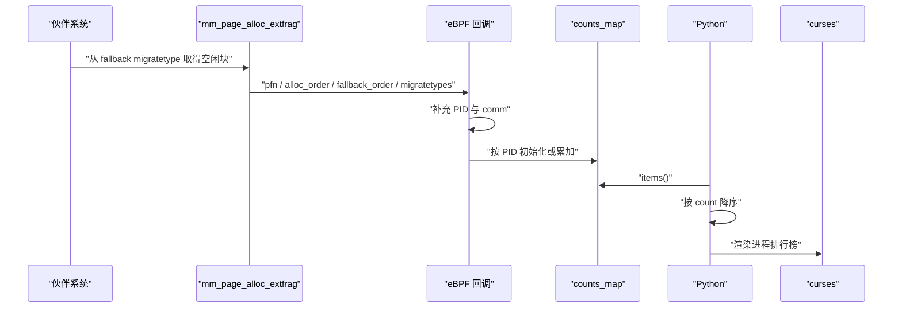

# 全链路手工追踪

<!-- WIKI_NAV_START -->
> [!info] 物理内存 Wiki 导航
> [[projects/Linux物理内存检测项目/index|项目首页]] · [[4.1 源码审计与事实边界|← 上一篇：4.1 源码审计与事实边界]] · [[4.2.2 深度学习路线与VCQ诊断|下一篇：4.2.2 深度学习路线与VCQ诊断 →]]
<!-- WIKI_NAV_END -->

## 全链路手工追踪：从命令到终端像素

本页不追求“再讲一遍架构”，而是要求你能沿着一次真实执行，把控制流和数据流逐步画出来。

> 前提：以下先描述项目的**目标链路**。当前源码快照的 import、文件路径和节流问题见 [[4.1 源码审计与事实边界|源码审计与事实边界]]。修复这些问题后，目标链路才可能真实运行。

## 先画两条线：控制流与数据流


控制流回答“谁调用谁”；数据流回答“哪一个字段从哪里来到哪里去”。不要把二者混成一句“Python 与内核交互”。

## 状态模式：一次 `zone + order` 数据如何形成

假设用户想看 node/zone/order 的碎片状态。

### 用户态选择程序

`exfrag_user.py` 解析参数，构造 `ExtFrag(output_count=False, ...)`。目标设计下，`ExtFrag` 选择 `fraginfo.c`。

关键追问：

- 为什么不是 Python 直接读 `struct zone`？
- `output_count=True` 时为什么要换另一份 C 程序？

### BCC 完成加载链

`BPF(src_file=...)` 背后不是一个动作，而是一组动作：

1. 读取 eBPF C 源码；
2. 用 Clang/LLVM 编译成 BPF 字节码；
3. 通过 `bpf()` 系统调用创建 map、加载程序；
4. 验证器检查程序；
5. JIT（若启用）将字节码编译成本机指令；
6. 按 BCC 命名约定把 `kprobe__get_page_from_freelist` 挂到内核函数。

任何一步失败，后面的 map 都不会凭空出现。

### 用户态写控制 map

Python 把 interval 写入 `delay_map[0]`。这是用户态到内核态方向：

```text
Python interval -> delay_map[0] -> eBPF 回调读取
```

注意：map 是双向共享容器，不是只允许“内核向用户传结果”。

### 内核触发 kprobe

内核在页分配路径调用 `get_page_from_freelist(gfp_mask, order, alloc_flags, ac)`。入口处先执行 kprobe 程序。

项目在这里采样的理由：

- 调用频率高，容易得到新鲜状态；
- 参数 `order` 和 `alloc_context` 与当前分配上下文直接相关；
- 可以从 preferred zone 找到相关 zonelist。

代价：

- 这是高频热路径，开销必须实测；
- 函数签名和内部结构体不是稳定 ABI；
- 入口采集看到的是“分配前状态”，不是该次分配最终结果。

### 从 `alloc_context` 找到 zonelist

项目代码走的是：

```text
ac
 -> preferred_zoneref
 -> zone
 -> zone_pgdat
 -> node_zonelists[ZONELIST_FALLBACK]
 -> _zonerefs[i]
 -> zone
```

这条链必须能口述，不能只说“遍历 NUMA 节点”。

### 每个 zone 扫描所有 order

对每个 zone，项目调用 `fill_contig_page_info()`，将各阶 `nr_free` 归并成三个量：

```text
free_pages
free_blocks_total
free_blocks_suitable
```

然后分别进入：

```text
unusable_free_index(order, info) -> score_b
__fragmentation_index(order, info) -> score_a
```

最后写入：

```text
zone_map[zone_key] = zone_info
pgdat_map[node_key] = pgdat_info
```

### Python 读 map

`get_zone_data()` 遍历 `zone_map.items()`：

1. 解码 zone 名称；
2. 取 node、PFN、页数、块数和两个 score；
3. 按 zone 名分组；
4. 按 order 排序；
5. 返回 Python 字典。

这里没有重新计算碎片指数；Python 只做格式化和组织。

### curses 渲染

UI 根据参数选择表格、bar 或 view 模式，在固定坐标重绘。高风险着色条件来自当前代码：

```python
zone['order'] > 5 and float(zone['scoreB']) > 0.5
```

这只是项目自定义展示规则，不是 Linux 内核官方阈值。

## 事件模式：一条 fallback 记录如何形成

事件模式选择 `extfraginfo.c`：



当前项目只保留 tracepoint 字段的一部分，因此应把输出解释为：

> 某 PID 最近一次被记录的 fallback 事件字段 + 该 PID 的累计次数。

它不是完整事件历史，也不能仅凭 count 断言该进程是碎片根因。

## 手算实验一：有 suitable block，但不少空闲页不可直接用于目标阶

目标请求：`order = 2`，即 4 个连续页。

伙伴系统快照：

| 当前 order | 块数 `nr_free` | 贡献空闲页 | 折算成 order-2 块 |
|---:|---:|---:|---:|
| 0 | 8 | 8 | 0 |
| 1 | 2 | 4 | 0 |
| 2 | 0 | 0 | 0 |
| 3 | 1 | 8 | 2 |
| 4+ | 0 | 0 | 0 |

得到：

```text
free_pages = 8 + 4 + 8 = 20
free_blocks_total = 8 + 2 + 1 = 11
free_blocks_suitable = 2
```

`unusable_free_index`：

```text
(20 - (2 << 2)) * 1000 / 20
= (20 - 8) * 1000 / 20
= 600
```

`extfrag_index`：因为 `free_blocks_suitable > 0`，直接返回 `-1000`。

### 为什么两个结果不矛盾

- `score_b = 600`：60% 空闲页不能组成 order-2 请求。
- `score_a = -1000`：当前至少还有合适连续块，只要水位条件允许，请求仍可能成功。

这正是两个指标不能互相替代的原因。

## 手算实验二：空闲页不少，但全是小块

目标仍是 order 2：

| 当前 order | 块数 | 贡献页 |
|---:|---:|---:|
| 0 | 8 | 8 |
| 1 | 4 | 8 |
| 2+ | 0 | 0 |

```text
free_pages = 16
free_blocks_total = 12
free_blocks_suitable = 0
requested = 4
```

`unusable_free_index = 1000`。

按项目整数公式：

```text
extfrag_index
= 1000 - (1000 + (16000 / 4)) / 12
= 1000 - 5000 / 12
= 1000 - 416
= 584
```

解释：当前请求完全没有 suitable block，而且总空闲页并不少，失败更偏向外部碎片。

## 手算实验三：根本就是总量不足

只有两个 order-0 空闲页：

```text
free_pages = 2
free_blocks_total = 2
free_blocks_suitable = 0
requested = 4
unusable_free_index = 1000
extfrag_index = 1000 - (1000 + 500) / 2 = 250
```

两个场景的 `unusable` 都是 1000，但 extfrag index 从 584 降到 250。原因是第二个场景连总页数都不够，更接近“内存不足”，compaction 也无法凭空增加空闲页。

官方语义是：extfrag index 趋近 0 表示失败更像内存不足，趋近 1000 表示更像碎片，`-1` 表示只要水位满足就能分配。参见 https:。项目内部把刻度放大为整数 `-1000..1000`，用户态再格式化。

## 手工追踪练习

### 练习 A：控制流

不看图，用 60 秒说完：

```text
参数 -> Python -> BCC -> bpf() -> verifier -> attach -> hook trigger
-> BPF map -> Python -> curses
```

要求每一步都说出一个具体函数、map 或字段。

### 练习 B：数据流

任选 `score_b`，回答：

1. 原始数据来自哪个内核结构？
2. 哪个函数累计三个中间量？
3. 哪个函数计算 score？
4. 写入哪个 map、哪个 value 字段？
5. Python 哪个方法读取？
6. UI 在哪个条件下把它标红？

### 练习 C：断点推理

如果 `zone_map` 一直为空，按顺序排查：

1. BCC import 是否成功；
2. C 文件路径是否正确；
3. 验证器是否接受程序；
4. kprobe 是否成功 attach；
5. 目标函数是否真的被调用；
6. `alloc_context` 读取是否适配该内核；
7. map update 是否失败；
8. Python 是否读了正确的 BPF 实例。

能完成这三个练习，才算真正掌握“完整链路”。

<!-- WIKI_FOOTER_START -->
---
> [!tip] 继续阅读
> [[projects/Linux物理内存检测项目/index|项目首页]] · [[4.1 源码审计与事实边界|← 上一篇：4.1 源码审计与事实边界]] · [[4.2.2 深度学习路线与VCQ诊断|下一篇：4.2.2 深度学习路线与VCQ诊断 →]]
<!-- WIKI_FOOTER_END -->
