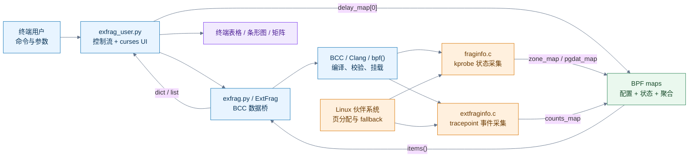
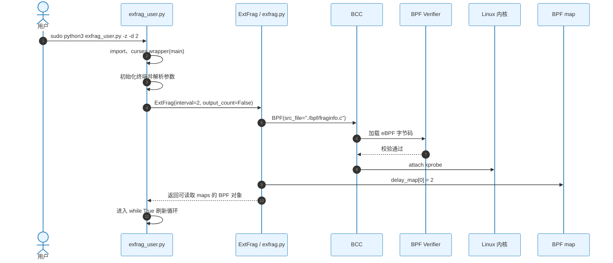
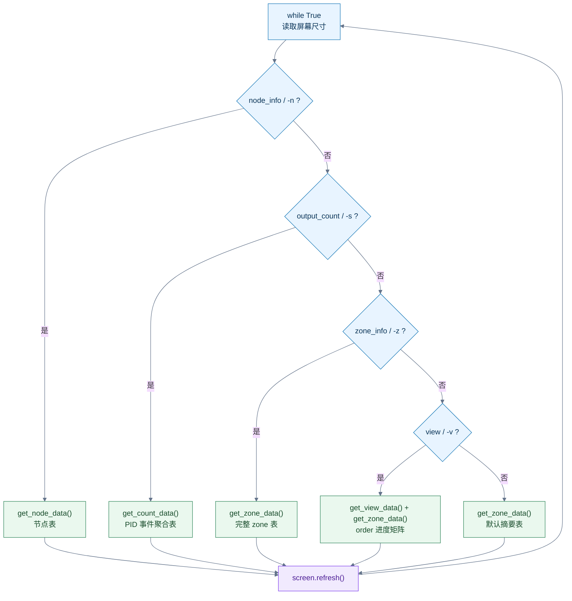
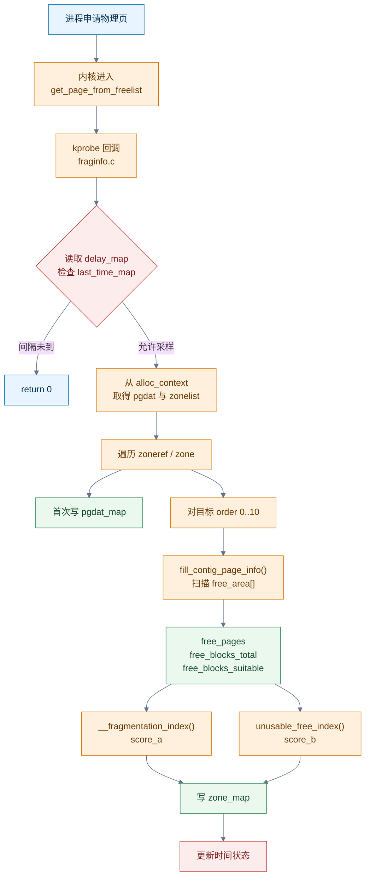
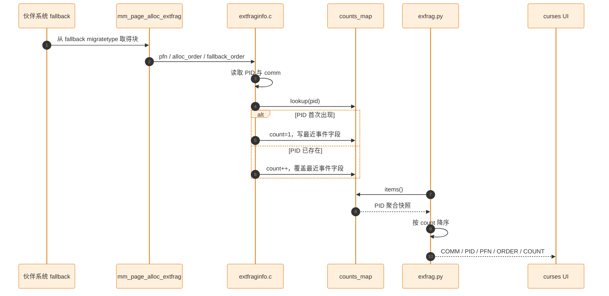
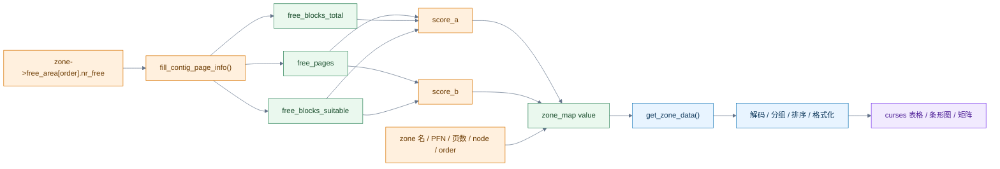
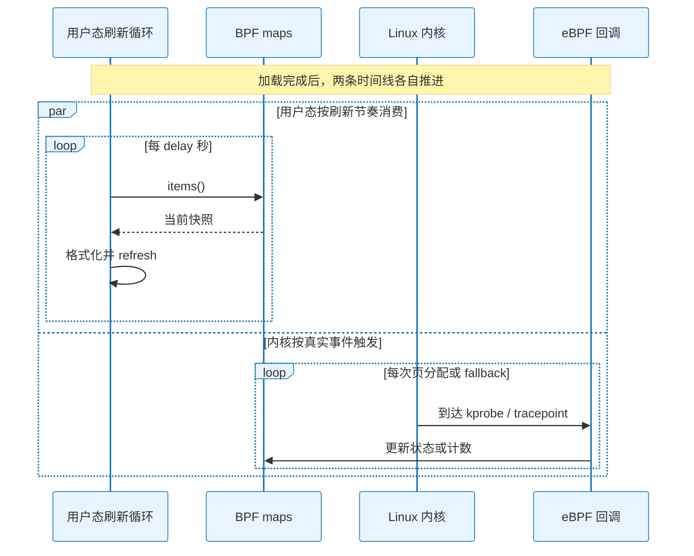

# Linux 物理内存碎片检测：项目完整代码流程详解

<!-- SOURCE_MANUAL_NAV_START -->
> [!info] 项目导航
> [[projects/Linux物理内存检测项目/index|项目首页]] ·
> [[1.1 学习总览与架构地图|架构地图]] ·
> [[4.1 源码审计与事实边界|源码事实边界]] ·
> [[4.2.1 全链路手工追踪|全链路练习]]
<!-- SOURCE_MANUAL_NAV_END -->

> [!abstract] 这是一份什么手册
> 这篇笔记按程序的**真实执行顺序**，从命令入口一直追到终端像素：
>
> `exfrag_user.py` → `exfrag.py` → BCC → eBPF 探针 → BPF map → Python → curses。
>
> 正文只保留建立心智模型必须看见的主线；完整源码片段和次要逐行说明默认折叠，需要时再展开。

> [!warning] 三层事实必须分开
> - **Linux 内核机制**：上游内核真实提供的伙伴系统、kprobe、tracepoint 和 BPF map 语义。
> - **项目设计意图**：作者希望实现的采样、聚合、指数计算与终端展示。
> - **当前源码事实**：当前四份源码实际做了什么，包括 import、路径、节流和兼容性问题。
>
> 文中凡是“目标链路”，不等于当前目录已经可以直接运行；所有已知阻断项集中在 [[#7 当前实现问题清单]]。

## 如何使用这篇手册

| 目标 | 推荐读法 |
|---|---|
| 5 分钟建立全局图 | 阅读 [[#0 一张图建立全局模型]] 和每节末尾的“记忆句” |
| 跟着程序走一遍 | 按第 1～5 章顺序阅读 |
| 深读源码 | 展开每节的“关键源码”和“逐行补充” callout |
| 准备调试 | 阅读 [[#7 当前实现问题清单]] |
| 准备面试或闭卷复习 | 阅读 [[#8 一页复习与闭卷检查]] |

## 目录

- [[#0 一张图建立全局模型]]
- [[#1 命令入口与模式选择：exfrag_user.py]]
- [[#2 BCC 数据桥：exfrag.py]]
- [[#3 状态模式：fraginfo.c]]
- [[#4 事件模式：extfraginfo.c]]
- [[#5 BPF map 到 curses：数据如何被消费]]
- [[#6 两个碎片化指数：统一手算]]
- [[#7 当前实现问题清单]]
- [[#8 一页复习与闭卷检查]]

## 四份源码职责速查

| 文件 | 当前行数 | 运行位置 | 核心职责 | 关键输出 |
|---|---:|---|---|---|
| `exfrag_user.py` | 422 | 用户态 | 参数解析、模式选择、curses 绘制与刷新 | 终端表格、颜色、条形图 |
| `exfrag.py` | 155 | 用户态 | 选择并加载 eBPF、配置 map、读取与格式化结果 | Python `dict` / `list` |
| `fraginfo.c` | 168 | 内核态 eBPF | 在页分配路径采集 node/zone/order 状态并计算指数 | `pgdat_map`、`zone_map` |
| `extfraginfo.c` | 59 | 内核态 eBPF | 捕获外碎片 fallback 事件并按 PID 聚合 | `counts_map` |

---

# 0 一张图建立全局模型

## 0.1 一句话总链路

```text
命令参数 → curses 入口 → ExtFrag → BCC 编译/加载/挂载
→ 内核事件触发 eBPF → BPF map 保存结果
→ Python 读取/整理 → curses 重绘
```

这条链里最容易混淆的是：**Python 不直接读取 `struct zone`，也不会周期性“调用 eBPF 函数”**。eBPF 由内核路径被动触发，Python 只通过 map 配置和消费数据。

## 0.2 分层架构与数据方向



**怎么看这张图：**

1. 从左上角沿实线走，是程序的加载与控制流。
2. 从 `Linux 伙伴系统` 指向两个 C 程序，是运行期的被动触发。
3. 所有跨用户态/内核态的数据都经过绿色的 BPF maps，最终回到 curses。

![[assets/linux-memory/Linux物理内存碎片高频面试题/project-data-flow_animated.svg|900]]

## 0.3 图例

| 颜色 | 含义 |
|---|---|
| 蓝色 | 用户态控制、加载与数据适配 |
| 橙色 | Linux 内核路径和 eBPF 回调 |
| 绿色 | BPF map 与数据状态 |
| 紫色 | 最终可视化输出 |
| 红色 | 文档中标出的当前实现缺陷 |

---

# 1 命令入口与模式选择：`exfrag_user.py`

## 1.1 文件职责

`exfrag_user.py` 是整个进程的入口和 UI 控制中枢。它负责：

- 初始化 curses；
- 校验并解析命令行参数；
- 构造 `ExtFrag`；
- 在主循环中选择一种展示模式；
- 调用 `get_*()` 读取数据；
- 将结果画成表格、颜色条或进度矩阵。

它**不负责**读取内核结构体，也**不负责**计算两个碎片化指数。

## 1.2 从启动到探针挂载完成



**怎么看这张图：**

- 前半段是同步启动链；任一步失败，主循环都不会拿到有效 map。
- `delay_map[0] = 2` 是用户态向内核态写配置，不是采集结果。
- “探针挂好”只表示 eBPF 已待命；必须等内核走到挂点，采集回调才执行。

> [!bug] 当前源码在启动前就可能失败
> `exfrag_user.py` 导入的是 `from extfrag import ExtFrag`，但当前文件名是 `exfrag.py`；即使导入修好，`exfrag.py` 又从 `./bpf/*.c` 加载，而当前两份 C 文件并不位于该目录。目标链路正确，不代表当前目录可直接跑通。

## 1.3 顶层入口：`curses.wrapper(main)`

文件末尾的入口是：

```python
if __name__ == "__main__":
    curses.wrapper(main)
```

`wrapper()` 大致完成：

1. 初始化 curses 屏幕；
2. 把 `screen` 传入 `main(screen)`；
3. `main` 正常返回或抛异常时恢复终端状态。

> [!example]- 展开：导入与入口源码
> ```python
> #!/usr/bin/env python3
> import traceback
> import time
> import curses
> import sys
> from extfrag import ExtFrag
> from datetime import datetime
>
> if __name__ == "__main__":
>     curses.wrapper(main)
> ```
>
> - `traceback` 当前被导入但没有使用。
> - `time` 同时用于刷新节奏和等待。
> - `datetime` 只用于 `-v` 视图显示时间。

## 1.4 curses 初始化

`main(screen)` 开头设置：

| 设置 | 作用 |
|---|---|
| `curses.curs_set(0)` | 隐藏光标 |
| `screen.nodelay(True)` | `getch()` 非阻塞 |
| `curses.noecho()` | 不回显键盘字符 |
| `curses.cbreak()` | 不等待整行输入 |
| `curses.start_color()` | 启用颜色 |
| `init_pair(1..7)` | 建立黑、红、绿、蓝、紫、青、白配色 |

> [!example]- 展开：`main` 初始化源码
> ```python
> def main(screen):
>     _boo = False
>     _show = False
>     last_update_time = time.time()
>     curses.curs_set(0)
>     screen.nodelay(True)
>     curses.noecho()
>     curses.cbreak()
>     screen.clear()
>     curses.start_color()
>     curses.init_pair(1, curses.COLOR_BLACK, curses.COLOR_BLACK)
>     curses.init_pair(2, curses.COLOR_RED, curses.COLOR_BLACK)
>     curses.init_pair(3, curses.COLOR_GREEN, curses.COLOR_BLACK)
>     curses.init_pair(4, curses.COLOR_BLUE, curses.COLOR_BLACK)
>     curses.init_pair(5, curses.COLOR_MAGENTA, curses.COLOR_BLACK)
>     curses.init_pair(6, curses.COLOR_CYAN, curses.COLOR_BLACK)
>     curses.init_pair(7, curses.COLOR_WHITE, curses.COLOR_BLACK)
> ```

## 1.5 参数校验与正式解析

代码对参数做了两遍处理：

1. 第 89～140 行：白名单和参数值校验；
2. 第 166～200 行：把参数写入 `args` 字典。

| 参数 | 写入字段 | 作用 |
|---|---|---|
| `-d N` / `--delay N` | `delay` | 用户态刷新间隔，同时写入 `delay_map` |
| `-n` / `--node_info` | `node_info` | 节点摘要 |
| `-i ID` / `--node_id ID` | `node_id` | 按 NUMA node 过滤 |
| `-c NAME` / `--comm NAME` | `comm` | 按 zone 名过滤 |
| `-e` / `--extfrag_index` | `extfrag_index` | 只展示 score A |
| `-u` / `--unusable_index` | `unusable_index` | 只展示 score B |
| `-s` / `--output_count` | `output_count` | 加载事件模式 |
| `-b` / `--bar` | `bar` | 追加字符条形图 |
| `-z` / `--zone_info` | `zone_info` | 展示完整 zone 字段 |
| `-v` / `--view` | `view` | 展示 order 进度矩阵 |
| `-h` / `--help` | — | 打印帮助 |

> [!bug] 参数系统存在的事实
> - 第一遍白名单只有短选项和 `--help`，但第二遍接受其他长选项；例如 `--delay` 可能先被判定为未识别。
> - 非法参数和帮助页使用 `time.sleep(100)`，不是立即退出。
> - `-c` 白名单写成 `Moveable`，而内核常见名称是 `Movable`。
> - 正式解析使用 `for i in range(...)`，读取带值参数后不会跳过值本身；下一轮只是通常不命中任何分支。

## 1.6 模式决策树



分支由 `if/elif` 决定，所以组合参数的展示优先级是：

```text
-n > -s > -z > -v > 默认
```

`-e`、`-u`、`-b`、`-c`、`-i` 是修饰或过滤开关，不创建新的最高层分支。

> [!info] 一个容易忽略的耦合
> UI 的分支优先级和 eBPF 程序的选择不是同一件事。是否加载 `extfraginfo.c` 只取决于构造 `ExtFrag` 时的 `output_count`。例如同时传 `-n -s`，UI 先进入节点分支，但底层已经因 `-s` 加载了事件程序，节点分支所需的 `pgdat_map` 并不存在。

## 1.7 UI 辅助函数

### `generate_fragmentation_bar`

```python
proportion = min(max(score, 0), 1)
bar_length = int(proportion * max_length)
return "#" * bar_length + "-" * (max_length - bar_length)
```

- 输入被夹在 `[0, 1]`；
- 默认宽度是 20；
- 负值会显示成全 `-`；
- `-b` 模式使用该函数。

### `createBar` 与 `setProgress`

- `createBar()` 为 `-v` 模式创建 3×21 的 curses 子窗口；
- `setProgress()` 先用黑色块清空，再按百分比用红色块覆盖；
- `progress == 0` 时保留空状态；
- `-v` 每个 `(node, zone, order)` 都对应一个子窗口。

### `screenEnough`

它要求终端至少达到 `50 × 250`。不足时会阻塞在提示页，直到窗口被放大或用户按 `Ctrl+C`。

> [!bug] `_boo` 并没有形成外部状态门控
> `screenEnough()` 内部修改的是局部变量 `_boo`，也没有返回值；`main()` 中的 `_boo` 基本一直保持初始化值 `False`。实际行为更接近“函数内部阻塞直到屏幕足够大”，而不是通过 `_boo` 向外通知状态。

## 1.8 五种展示分支

| 分支 | 数据方法 | 主要列 | 刷新方式 |
|---|---|---|---|
| `-n` | `get_node_data()` | node ID、zone 数、node start PFN | `sleep(delay)` |
| `-s` | `get_count_data()` | comm、PID、PFN、两个 order、count | `sleep(delay)` |
| `-z` | `get_zone_data()` | zone 静态字段、三量、两个指数 | `sleep(delay)` |
| `-v` | `get_view_data()` + `get_zone_data()` | 每个 order 的 score B 进度条 | 时间戳门控，不在末尾 sleep |
| 默认 | `get_zone_data()` | zone、node、order、两个指数 | `sleep(delay)` |

`-z` 和默认分支的红色条件是：

```python
zone["order"] > 5 and float(zone["scoreB"]) > 0.5
```

> [!warning] 这不是 Linux 官方风险阈值
> “order 大于 5 且 score B 大于 0.5 标红”是项目自己的展示规则。它可以用于提示，但不能被表述为内核对高风险碎片的官方判定。

## 1.9 输入、输出与记忆句

| 输入 | 中间动作 | 输出 |
|---|---|---|
| `sys.argv`、终端尺寸、键盘事件 | 解析模式、构造 `ExtFrag`、选择 `get_*()` | UI 控制流 |
| Python `dict/list` | 过滤、格式化、着色、截断 | curses 表格与进度条 |

> [!tip] 本节记忆句
> **`exfrag_user.py` 负责“选、读、画”：选模式，读 `ExtFrag`，画 curses；它不直接采内核，也不重算指数。**

---

# 2 BCC 数据桥：`exfrag.py`

## 2.1 文件职责与调用位置

`exfrag.py` 位于 UI 和 eBPF 之间，核心类是 `ExtFrag`：

- 构造阶段二选一加载 C 程序；
- 把采样间隔写入 `delay_map[0]`；
- 读取 `zone_map`、`pgdat_map` 或 `counts_map`；
- 把 ctypes 结构转换成 Python 字典或列表；
- 对指数做字符串格式化。

调用链中的位置：

```text
exfrag_user.main()
  → ExtFrag.__init__()
  → BPF(src_file=...)
  → get_zone_data() / get_node_data() / get_count_data()
```

## 2.2 构造函数：选择状态模式或事件模式

```python
if self.output_count:
    self.b = BPF(src_file="./bpf/extfraginfo.c")
else:
    self.b = BPF(src_file="./bpf/fraginfo.c")

delay_key = 0
self.b["delay_map"][delay_key] = ctypes.c_int(interval)
```

| 语句 | 运行意义 |
|---|---|
| `output_count=True` | 加载事件模式，只产生 `counts_map` |
| `output_count=False` | 加载状态模式，产生 `zone_map` 和 `pgdat_map` |
| `BPF(src_file=...)` | 读取 C、编译、加载、校验并按命名约定挂载 |
| `delay_map[0] = interval` | 把秒级采样间隔传给 eBPF |

> [!info] 为什么不是“两个 C 都加载”
> 当前类只保留一个 `self.b`，并通过 `if/else` 选择一份 C。状态视图和事件视图因此不能在同一个实例中同时工作。若要同屏展示，需要加载两份程序或重构为一份包含两类探针的程序，并分别管理 map 生命周期。

> [!example]- 展开：构造函数完整源码
> ```python
> class ExtFrag:
>     def __init__(
>         self,
>         interval=2,
>         output_extfrag_index=False,
>         output_unusable_index=False,
>         output_count=False,
>         zone_info=False,
>     ):
>         self.interval = interval
>         self.output_extfrag_index = output_extfrag_index
>         self.output_unusable_index = output_unusable_index
>         self.output_count = output_count
>         self.zone_info = zone_info
>
>         if self.output_count:
>             self.b = BPF(src_file="./bpf/extfraginfo.c")
>         else:
>             self.b = BPF(src_file="./bpf/fraginfo.c")
>
>         delay_key = 0
>         self.b["delay_map"][delay_key] = ctypes.c_int(interval)
> ```
>
> `output_extfrag_index`、`output_unusable_index` 和 `zone_info` 被保存为成员，但本文件后续几乎不使用；真正的列选择在 UI 的 `args` 字典里完成。

## 2.3 BCC 在 `BPF(src_file=...)` 背后做什么

目标链路可以拆成：

1. 打开 C 源文件；
2. Clang/LLVM 编译为 BPF 字节码；
3. 创建程序需要的 maps；
4. 通过 `bpf()` 加载程序；
5. BPF Verifier 检查安全性；
6. 按 BCC 命名约定挂载：
   - `kprobe__get_page_from_freelist` → kprobe；
   - `TRACEPOINT_PROBE(kmem, mm_page_alloc_extfrag)` → tracepoint；
7. 返回可从 Python 访问 map 的 `BPF` 对象。

![[assets/linux-memory/Linux物理内存碎片高频面试题/tracepoint-kprobe_animated.svg|900]]

**怎么看这张图：** kprobe 观察内核函数入口，灵活但更依赖内核内部实现；tracepoint 是内核预定义事件，字段语义通常更稳定。项目用二者分别观察“状态快照”和“fallback 事件”。

## 2.4 指数格式化：不是重新计算

`calculate_scoreA()` 和 `calculate_scoreB()` 都把内核返回的千分整数格式化：

```python
int_part = int(score) // 1000
dec_part = int(score) % 1000
return f"{int_part:2d}.{dec_part:03d}"
```

例如：

| 内核值 | Python 字符串 |
|---:|---:|
| `600` | `0.600` |
| `1000` | `1.000` |
| `-1000` | 受 Python 负数整除与取模影响，格式语义需谨慎核验 |

> [!warning] 用户态这里只负责显示
> `score_a` 和 `score_b` 的公式都在 `fraginfo.c` 中执行。Python 只是把整数拆成整数部分和三位小数，不能把 `calculate_scoreA/B()` 描述成“计算碎片化指数”。

## 2.5 `get_zone_data()`：状态模式最重要的读接口

核心流程：

1. 取得 `self.b["zone_map"]`；
2. 遍历 `(key, value)`；
3. 解码 `value.name`；
4. 可选地按 `node_id` 过滤；
5. 把 C 结构字段转成 Python `dict`；
6. 按 zone 名分组；
7. 每组按 `order` 排序。

返回结构：

```text
{
  "DMA": [
    {order: 0, scoreA: "...", scoreB: "...", ...},
    {order: 1, scoreA: "...", scoreB: "...", ...},
    ...
  ],
  "Normal": [...]
}
```

| C 字段 | Python 字段 | UI 含义 |
|---|---|---|
| `name` | `comm` | zone 名，不是进程 comm |
| `zone_start_pfn` | `zone_pfn` | zone 起始 PFN |
| `spanned_pages` | `spanned_pages` | 跨越页数 |
| `present_pages` | `present_pages` | 实际存在页数 |
| `order` | `order` | 目标阶 |
| `free_blocks_total` | 同名 | 所有阶空闲块数 |
| `free_blocks_suitable` | 同名 | 折算到目标阶后的可用块数 |
| `free_pages` | 同名 | 总空闲页数 |
| `score_a` | `scoreA` | extfrag index |
| `score_b` | `scoreB` | unusable index |
| `node_id` | `node_id` | NUMA node |

> [!example]- 展开：`get_zone_data()` 关键源码
> ```python
> def get_zone_data(self, filter_node_id=None):
>     zone_data_dict = {}
>     zone_map = self.b["zone_map"]
>
>     for key, value in zone_map.items():
>         comm = value.name.decode("utf-8", "replace").rstrip("\x00")
>         node_id = value.node_id
>         if filter_node_id is not None and node_id != filter_node_id:
>             continue
>
>         data = {
>             "comm": comm,
>             "zone_pfn": value.zone_start_pfn,
>             "spanned_pages": value.spanned_pages,
>             "present_pages": value.present_pages,
>             "order": value.order,
>             "free_blocks_total": value.free_blocks_total,
>             "free_blocks_suitable": value.free_blocks_suitable,
>             "free_pages": value.free_pages,
>             "scoreA": self.calculate_scoreA(value.score_a),
>             "scoreB": self.calculate_scoreB(value.score_b),
>             "node_id": value.node_id,
>         }
>         zone_data_dict.setdefault(comm, []).append(data)
>
>         for comm in zone_data_dict:
>             zone_data_dict[comm].sort(key=lambda x: x["order"])
>
>     return zone_data_dict
> ```
>
> 当前排序循环位于外层 map 遍历内部，因此每插入一条记录都会重新排序所有分组；结果正确但存在不必要开销。

## 2.6 `get_view_data()`：为 `-v` 提供索引

它把每个 `(node_id, zone_name)` 映射到一个只含 `scoreB` 和 `order` 的字典，再按键排序。

> [!bug] 当前字典会覆盖同一 zone 的多个 order
> 键只有 `(node_id, comm)`，没有 `order`。遍历同一 zone 的 11 条 order 记录时，前面的值会被后面的值覆盖。UI 随后主要依靠 `get_zone_data()` 填真正的每阶进度，因此该接口更像“枚举有哪些 node/zone”，而不是提供完整 order 数据。

## 2.7 `get_nr_zones()` 与 `get_node_data()`

`get_nr_zones()` 把每条 `zone_map` 记录的 zone 名追加到 `node_zone_map[node_id]`。因为每个 zone 当前有 11 个 order，`get_node_data()` 使用：

```python
nr_zones = int(len(zone_data.get(node_id, [])) / 11)
```

然后读取 `pgdat_map`：

```python
{
    "pgdat_ptr": value.pgdat_ptr,
    "nr_zones": nr_zones,
    "node_id": value.node_id,
}
```

> [!bug] `/11` 是硬编码假设
> 它假设每个 zone 恰好产生 order 0～10 的 11 条记录，而且所有 map update 都成功。只要内核阶数变化、记录缺失或 key 冲突，zone 数就会算错。更稳妥的语义应按 `(node_id, zone_name)` 或 zone 指针去重。

## 2.8 `get_count_data()`：事件聚合读取

它遍历 `counts_map`，解码进程名，取出：

- `pid`；
- `pfn`；
- `alloc_order`；
- `fallback_order`；
- `count`；

最后按 `count` 降序。

> [!info] 返回的是聚合快照，不是事件流
> map 的 key 只有 PID，value 中的 PFN 和两个 order 会被后续事件覆盖。因此输出语义是：
>
> **某 PID 的累计 fallback 次数 + 该 PID 最近一次被记录事件的字段。**

## 2.9 `run()` 为什么不在主链

`run()` 只是无限 `sleep(self.interval)`，当前入口没有调用它。真正的刷新循环在 `exfrag_user.py::main()`。

## 2.10 输入、输出与记忆句

| 输入 | 中间动作 | 输出 |
|---|---|---|
| CLI 模式、采样间隔 | 选择 C 程序、BCC 加载、写 `delay_map` | 可用的 BPF 对象 |
| C 结构体 map values | 解码、分组、排序、格式化 | Python `dict/list` |

> [!tip] 本节记忆句
> **`exfrag.py` 是桥：向下让 BCC 加载 eBPF，向内核写配置；向上读取 map，把 C 结构整理成 Python 数据。**

---

# 3 状态模式：`fraginfo.c`

## 3.1 文件职责与触发位置

`fraginfo.c` 通过函数名约定：

```c
int kprobe__get_page_from_freelist(...)
```

挂到内核页分配路径 `get_page_from_freelist` 的入口。每次内核进入该函数，都可能触发 eBPF 回调。

它的目标是：

1. 找到本次分配上下文对应的 NUMA node 和 zonelist；
2. 遍历 zone；
3. 对每个目标 order 扫描 `free_area[]`；
4. 计算三个中间量和两个指数；
5. 写入 `pgdat_map` 和 `zone_map`。

> [!info] 观察点的语义
> 这是页分配函数**入口处的状态采样**，更接近“分配前快照”。它不是该次分配最终成功或失败的直接返回结果，也不等于只覆盖某一种简单 fast path。

## 3.2 状态采集完整流程



**怎么看这张图：**

- 上半段解决“什么时候采”；中间解决“从哪里找到 zone”；下半段解决“怎么算并写到哪里”。
- `fill_contig_page_info()` 只产生三种原始量，两个指数由独立函数计算。
- 红色节流节点表示设计意图存在，但当前 key 设计没有形成正确状态闭环。

## 3.3 数据结构

### `pgdat_info`

| 字段 | 当前写入值 | 含义 |
|---|---|---|
| `pgdat_ptr` | `pgdata->node_start_pfn` | 名称看似指针，实际保存 node start PFN |
| `nr_zones` | `pgdata->nr_zones` | 当前 C 端写入，但 Python 没直接采用 |
| `node_id` | `pgdata->node_id` | NUMA node ID |

### `zone_info`

| 字段组 | 字段 |
|---|---|
| zone 身份 | `zone_ptr`、`name`、`node_id` |
| 静态容量 | `zone_start_pfn`、`spanned_pages`、`present_pages` |
| 当前目标 | `order` |
| 统计三量 | `free_pages`、`free_blocks_total`、`free_blocks_suitable` |
| 指数 | `score_a`、`score_b` |

### `alloc_context`

项目在 BPF C 中本地声明了 `struct alloc_context`，目的是从 kprobe 参数读取：

```text
ac
 → preferred_zoneref
 → zone
 → zone_pgdat
 → node_zonelists[ZONELIST_FALLBACK]
```

> [!warning] kprobe 兼容性边界
> `alloc_context` 和 `get_page_from_freelist` 都是内核内部实现，不是稳定 ABI。字段布局、函数签名或编译器优化变化，都可能让读取失败或被 verifier 拒绝。

## 3.4 BPF maps

```c
BPF_HASH(pgdat_map, u64, struct pgdat_info);
BPF_HASH(zone_map, u64, struct zone_info);
BPF_HASH(last_time_map, u64, u64);
BPF_ARRAY(delay_map, int, 1);
```

| map | key | value | 方向 |
|---|---|---|---|
| `delay_map` | 固定索引 0 | 秒级间隔 | Python → eBPF |
| `last_time_map` | 当前代码使用时间戳 | 上次时间 | eBPF 内部状态 |
| `pgdat_map` | `pgdata` 地址 | node 信息 | eBPF → Python |
| `zone_map` | `zone_ptr + order` | zone/order 快照 | eBPF → Python |

![[assets/linux-memory/Linux物理内存碎片高频面试题/bpf-map-data-flow_animated.svg|900]]

**怎么看这张图：** `delay_map` 是配置通道，另外三个 map 是状态或结果通道。map 是共享容器，不是从 eBPF 单向“打印”到 Python 的日志。

## 3.5 `fill_contig_page_info()`：最核心的三量

对每个目标 `suitable_order`，函数遍历 `order = 0..MAX_ORDER`：

```c
blocks = zone->free_area[order].nr_free;
free_blocks_total += blocks;
free_pages += blocks << order;

if (order >= suitable_order)
    free_blocks_suitable += blocks << (order - suitable_order);
```

三量的语义：

| 量 | 计算 | 回答的问题 |
|---|---|---|
| `free_pages` | 所有阶块数 × 每块页数 | zone 一共还有多少空闲页 |
| `free_blocks_total` | 所有阶空闲块数之和 | 空闲资源被分成多少块 |
| `free_blocks_suitable` | 高阶块折算为目标阶份数 | 有多少目标阶请求可以由现有大块满足 |

> [!tip] 为什么小块不能向上相加
> 比目标阶更高的块可以拆分，所以能折算；低阶块虽然页数总和可能足够，但不保证物理连续，不能直接拼成 suitable block。

> [!example]- 展开：`fill_contig_page_info()` 完整源码
> ```c
> static void fill_contig_page_info(
>     struct zone *zone,
>     unsigned int suitable_order,
>     struct contig_page_info *info) {
>   unsigned int order;
>   info->free_pages = 0;
>   info->free_blocks_total = 0;
>   info->free_blocks_suitable = 0;
>
>   for (order = 0; order <= MAX_ORDER; order++) {
>     unsigned long blocks;
>     unsigned long nr_free;
>     bpf_probe_read_kernel(
>         &nr_free,
>         sizeof(nr_free),
>         &zone->free_area[order].nr_free);
>
>     blocks = nr_free;
>     info->free_blocks_total += blocks;
>     info->free_pages += blocks << order;
>
>     if (order >= suitable_order)
>       info->free_blocks_suitable +=
>           blocks << (order - suitable_order);
>   }
> }
> ```

## 3.6 `unusable_free_index()`：score B

若没有空闲页，返回 `1000`；否则：

$$
\text{scoreB}
=
\frac{
  \text{free\_pages}
  -
  \left(\text{free\_blocks\_suitable} \ll \text{order}\right)
}{
  \text{free\_pages}
}
\times 1000
$$

它回答：

> 对当前 order 请求，现有空闲页中有多大比例不能直接组成可用连续块？

- 越接近 `0`：大部分空闲页可服务当前请求；
- 越接近 `1000`：空闲页对当前请求越不可用；
- 但高分本身不能区分“碎片很多”还是“总页数就不足”。

## 3.7 `__fragmentation_index()`：score A

分支语义：

| 条件 | 返回 | 含义 |
|---|---:|---|
| `order > MAX_ORDER` | `0` | 非法或越界 |
| 没有空闲块 | `0` | 更接近总量不足 |
| 有 suitable block | `-1000` | 已存在可服务当前请求的块 |
| 没有 suitable block | 按公式计算 | 判断困难更偏碎片还是总量不足 |

没有 suitable block 时：

$$
\text{scoreA}
=
1000
-
\frac{
  1000
  +
  \left(
    \frac{\text{free\_pages}\times 1000}{2^\text{order}}
  \right)
}{
  \text{free\_blocks\_total}
}
$$

它回答：

> 当目标块不存在时，当前困难更像外部碎片，还是总空闲量不足？

![[assets/linux-memory/Linux物理内存碎片高频面试题/fragmentation-index-logic_animated.svg|900]]

**怎么看这张图：** score B 看“多少空闲页用不上”，score A 看“为什么难”。`-1000` 是哨兵值，不能按普通百分比解释。

## 3.8 主探针逐段拆解

### 阶段 A：时间节流

当前代码：

```c
current_time = bpf_ktime_get_ns();
last_time = last_time_map.lookup(&current_time);
```

随后用 `delay_map[0]` 决定是否提前返回。

> [!bug] key 使用错误导致节流基本失效
> 当前时间每次都不同，下一次 lookup 几乎不会命中上次记录。函数末尾又以新的当前时间为 key 插入，结果更像不断增加时间戳记录，而不是更新“同一个上次采样时间”。

### 阶段 B：找到 node 与 zonelist

```c
pgdat = ac->preferred_zoneref->zone->zone_pgdat;
```

随后遍历：

```c
pgdat->node_zonelists[ZONELIST_FALLBACK]._zonerefs[i]
```

空 `zone` 或空 `pgdata` 会跳过。

### 阶段 C：写 `pgdat_map`

key 是 `pgdata` 地址。只有第一次 lookup 不到时才写入。

> [!bug] `pgdat_ptr` 字段名与内容不一致
> `pgdat_data.pgdat_ptr` 实际保存的是 `pgdata->node_start_pfn`，不是 `pgdata` 指针。UI 表头也把它解释成 `NODE_START_PFN`，因此显示含义尚可，但命名容易误导源码阅读者。

### 阶段 D：为每个 zone/order 建立快照

外层遍历 zone，内层遍历 `a_order = 0..10`：

1. 读取 zone 静态字段；
2. `fill_contig_page_info(z, a_order, &ctg_info)`；
3. 计算 score B；
4. 计算 score A；
5. 写入 `zone_map`。

当前 key：

```c
zone_key = zone_data.zone_ptr + zone_data.order;
```

它试图让同一 zone 的不同 order 获得不同 key。

### 阶段 E：结束

函数尝试更新 `last_time_map`，然后 `return 0`。eBPF kprobe 程序不改变原内核函数的业务返回值。

> [!example]- 展开：主探针缩微源码
> ```c
> int kprobe__get_page_from_freelist(..., const struct alloc_context *ac) {
>   // 1. 节流检查
>   current_time = bpf_ktime_get_ns();
>   last_time = last_time_map.lookup(&current_time);
>
>   // 2. 找到 pgdat
>   pgdat = ac->preferred_zoneref->zone->zone_pgdat;
>
>   // 3. 遍历 zonelist
>   for (i = 0; i < MAX_NR_ZONES; i++) {
>     zref = &pgdat->node_zonelists[ZONELIST_FALLBACK]._zonerefs[i];
>     z = zref->zone;
>     if (!z)
>       continue;
>
>     // 4. 首次写 node
>     pgdat_map.update(&node_key, &pgdat_data);
>
>     // 5. 每个目标 order 算三量与两指数
>     for (a_order = 0; a_order <= MAX_ORDER; ++a_order) {
>       fill_contig_page_info(z, a_order, &ctg_info);
>       zone_data.score_b = unusable_free_index(a_order, &ctg_info);
>       zone_data.score_a = __fragmentation_index(a_order, &ctg_info);
>       zone_map.update(&zone_key, &zone_data);
>     }
>   }
>
>   last_time_map.update(&current_time, &current_time);
>   return 0;
> }
> ```

## 3.9 输入、输出与记忆句

| 输入 | 中间动作 | 输出 |
|---|---|---|
| kprobe 参数、`alloc_context`、`zone->free_area[]` | 遍历 node/zone/order、累计三量、计算双指数 | `pgdat_map`、`zone_map` |
| `delay_map`、`last_time_map` | 目标上控制采样频率 | 当前实现未形成有效闭环 |

> [!tip] 本节记忆句
> **`fraginfo.c` 在分配入口拍快照：顺着 `alloc_context` 找 zone，扫 `free_area[]` 得三量，算两指数，再按 zone/order 写 map。**

---

# 4 事件模式：`extfraginfo.c`

## 4.1 文件职责与 tracepoint 语义

入口：

```c
TRACEPOINT_PROBE(kmem, mm_page_alloc_extfrag)
```

这个 tracepoint 发生在伙伴系统从其他迁移类型的 freelist 取得块的 fallback 路径。它观察的是迁移类型 fallback，不应简单解释为“高阶分配失败后退化为一个更小 order”。

> [!info] `fallback_order` 应如何解释
> `fallback_order` 表示 fallback 路径找到的空闲块阶数，通常满足 `fallback_order >= alloc_order`。内核可能从更高阶块拆分出请求大小。仅记录两个 order 不足以判断迁移类型污染，还应结合 `alloc_migratetype`、`fallback_migratetype` 和 `change_ownership`；当前项目没有保存这些字段。

## 4.2 事件聚合链



**怎么看这张图：**

- 事件从内核 tracepoint 开始，而不是由 Python 定时调用。
- `counts_map` 按 PID 聚合；count 累加，但 PFN、order 和 comm 表示最近一次被写入的值。
- Python 只排序和展示，不会恢复已经被聚合掉的事件历史。

## 4.3 `data_t` 与 maps

```c
struct data_t {
  u64 pfn;
  int alloc_order;
  int fallback_order;
  pid_t pid;
  u64 count;
  char pcomm[32];
};
```

| 字段 | 含义 |
|---|---|
| `pfn` | 最近一次记录的页帧号 |
| `alloc_order` | 请求阶数 |
| `fallback_order` | fallback 找到的块阶数 |
| `pid` | 当前进程 PID |
| `count` | 该 PID 的累计记录次数 |
| `pcomm` | 最近一次记录的进程名 |

maps：

```c
BPF_HASH(counts_map, pid_t, struct data_t);
BPF_HASH(last_time_map, u64, u64);
BPF_ARRAY(delay_map, int, 1);
```

## 4.4 探针体逐段拆解

### 阶段 A：时间节流

与 `fraginfo.c` 一样，当前代码用 `current_time` 作为 lookup key。

> [!bug] 事件程序的节流问题更完整
> - key 每次变化，lookup 基本不命中；
> - `delay` 未显式初始化；
> - 整个函数没有 `last_time_map.update()`；
> - 因而“读取上次时间 → 判断 → 写回本次时间”的状态闭环完全没有形成。

![[assets/linux-memory/Linux物理内存碎片高频面试题/sampling-throttle_animated.svg|900]]

**怎么看这张图：** 正确节流需要稳定 key 指向同一条“上次采样时间”；当前代码每次用新时间找新 key，事件程序还缺最后的更新时间动作。

### 阶段 B：取得 PID

```c
pid_t pid = bpf_get_current_pid_tgid() >> 32;
```

`bpf_get_current_pid_tgid()` 的高 32 位是 TGID，项目将其当作进程 PID 使用。

### 阶段 C：按 PID 初始化或累加

若 `counts_map.lookup(&pid)` 为空：

1. 设置 PID；
2. 复制 tracepoint 的 PFN 和两个 order；
3. `count = 1`；
4. 读取 `comm`；
5. 写入 map。

若已存在：

1. `count += 1`；
2. 覆盖 PFN 和两个 order；
3. 更新 `comm`；
4. 再写回 map。

> [!example]- 展开：tracepoint 探针核心源码
> ```c
> TRACEPOINT_PROBE(kmem, mm_page_alloc_extfrag) {
>   pid_t pid = bpf_get_current_pid_tgid() >> 32;
>   struct data_t *data, zero = {};
>
>   data = counts_map.lookup(&pid);
>   if (!data) {
>     zero.pid = pid;
>     zero.pfn = args->pfn;
>     zero.alloc_order = args->alloc_order;
>     zero.fallback_order = args->fallback_order;
>     zero.count = 1;
>     bpf_get_current_comm(&zero.pcomm, sizeof(zero.pcomm));
>     counts_map.update(&pid, &zero);
>   } else {
>     data->count += 1;
>     data->pfn = args->pfn;
>     data->alloc_order = args->alloc_order;
>     data->fallback_order = args->fallback_order;
>     bpf_get_current_comm(&data->pcomm, sizeof(data->pcomm));
>     counts_map.update(&pid, data);
>   }
>   return 0;
> }
> ```

## 4.5 聚合模型的能力边界

`counts_map` 不是 ring buffer，也不是 perf event 流。它会丢失：

- 同一 PID 每次事件的时间线；
- 同一 PID 不同 order 组合的分布；
- 迁移类型字段；
- PID 复用前后的进程身份边界；
- 多 CPU 同时更新同一个 value 时的严格精确计数保证。

因此它适合做“按 PID 的近似排行榜”，不适合替代完整审计日志。

## 4.6 输入、输出与记忆句

| 输入 | 中间动作 | 输出 |
|---|---|---|
| `mm_page_alloc_extfrag` 参数、当前 PID/comm | 按 PID lookup、初始化或累加 | `counts_map` |
| `delay_map`、`last_time_map` | 目标上做时间窗口采样 | 当前实现没有闭环 |

> [!tip] 本节记忆句
> **`extfraginfo.c` 记的是 fallback 事件：tracepoint 给事件字段，eBPF 补 PID/comm，再按 PID 保存“累计次数 + 最近快照”。**

---

# 5 BPF map 到 curses：数据如何被消费

## 5.1 map 总表

| map | 生产者 | 消费者 | 当前语义 |
|---|---|---|---|
| `delay_map` | `ExtFrag.__init__()` | 两个 eBPF 程序 | 采样间隔配置 |
| `last_time_map` | eBPF | eBPF | 节流状态；当前实现错误 |
| `pgdat_map` | `fraginfo.c` | `get_node_data()` | node 快照 |
| `zone_map` | `fraginfo.c` | `get_zone_data()` 等 | zone/order 快照 |
| `counts_map` | `extfraginfo.c` | `get_count_data()` | 按 PID 聚合事件 |

## 5.2 状态字段的完整流动



**怎么看这张图：** 最左边是内核原始库存，中间是 eBPF 的统计与指数，右边是 Python 的组织和 UI。只要沿任意一列反向追踪，就能找到它的内核来源。

## 5.3 两条异步时间线



**怎么看这张图：**

- 用户态按时间读取；内核态按事件写入，两者频率可以完全不同。
- map 解耦了两条时间线；Python 不需要阻塞等待某一个具体内核事件。
- UI 读到的是读取时刻 map 中的状态，不是与某一次 refresh 一一对应的完整事件批次。

## 5.4 模式与 map 的匹配关系

| UI 模式 | 必需 eBPF 程序 | 必需 map |
|---|---|---|
| `-n` | `fraginfo.c` | `pgdat_map`、`zone_map` |
| `-s` | `extfraginfo.c` | `counts_map` |
| `-z` | `fraginfo.c` | `zone_map` |
| `-v` | `fraginfo.c` | `zone_map` |
| 默认 | `fraginfo.c` | `zone_map` |

> [!bug] 组合参数没有做语义互斥校验
> 解析器允许用户组合多个主模式，但 eBPF 只按 `-s` 是否存在二选一加载。正确使用时应把 `-n`、`-s`、`-z`、`-v` 视为互斥主模式。

## 5.5 本节记忆句

> [!tip] 本节记忆句
> **内核按事件写 map，Python 按时间读 map；map 让采集与展示解耦，但快照和聚合都会舍弃一部分时间信息。**

---

# 6 两个碎片化指数：统一手算

下面三题统一使用目标请求 `order = 2`，即需要：

$$
2^2 = 4
$$

个连续物理页。

## 6.1 场景一：有大块，但也有不少碎页

### 输入

| 当前 order | `nr_free` 块数 | 贡献空闲页 | 折算为 order-2 块 |
|---:|---:|---:|---:|
| 0 | 8 | $8 \times 1 = 8$ | 0 |
| 1 | 2 | $2 \times 2 = 4$ | 0 |
| 2 | 0 | 0 | 0 |
| 3 | 1 | $1 \times 8 = 8$ | $1 \times 2 = 2$ |
| 4～10 | 0 | 0 | 0 |

### 三量

```text
free_pages           = 8 + 4 + 8 = 20
free_blocks_total    = 8 + 2 + 1 = 11
free_blocks_suitable = 2
```

### score B

```text
(20 - (2 << 2)) × 1000 / 20
= (20 - 8) × 1000 / 20
= 600
```

### score A

因为 `free_blocks_suitable > 0`：

```text
score_a = -1000
```

### 结论

| 指标 | 结果 | 解读 |
|---|---:|---|
| score B | `600` | 60% 空闲页不能直接服务 order-2 |
| score A | `-1000` | 当前仍有 suitable block |

两个结果不矛盾：碎页不少，但仍然存在能满足请求的大块。

## 6.2 场景二：空闲页不少，但全是小块

### 输入

| 当前 order | `nr_free` 块数 | 贡献空闲页 | 折算为 order-2 块 |
|---:|---:|---:|---:|
| 0 | 8 | 8 | 0 |
| 1 | 4 | 8 | 0 |
| 2～10 | 0 | 0 | 0 |

### 三量

```text
free_pages           = 16
free_blocks_total    = 12
free_blocks_suitable = 0
requested            = 4
```

### score B

```text
(16 - 0) × 1000 / 16 = 1000
```

### score A

按 C 整数除法顺序：

```text
1000 - (1000 + (16000 / 4)) / 12
= 1000 - 5000 / 12
= 1000 - 416
= 584
```

### 结论

| 指标 | 结果 | 解读 |
|---|---:|---|
| score B | `1000` | 没有空闲页能直接组成目标阶 |
| score A | `584` | 总页数并不少，困难更偏向碎片 |

## 6.3 场景三：总量本身不足

### 输入

| 当前 order | `nr_free` 块数 | 贡献空闲页 | 折算为 order-2 块 |
|---:|---:|---:|---:|
| 0 | 2 | 2 | 0 |
| 1～10 | 0 | 0 | 0 |

### 三量

```text
free_pages           = 2
free_blocks_total    = 2
free_blocks_suitable = 0
requested            = 4
```

### 两个指数

```text
score_b = 1000

score_a
= 1000 - (1000 + (2000 / 4)) / 2
= 1000 - 1500 / 2
= 250
```

### 结论

| 指标 | 结果 | 解读 |
|---|---:|---|
| score B | `1000` | 同样没有页能组成目标阶 |
| score A | `250` | 连总空闲量都不足，更偏向缺量 |

## 6.4 三个场景放在一起

| 场景 | suitable | score B | score A | 主要判断 |
|---|---:|---:|---:|---|
| 有大块也有碎页 | 2 | 600 | -1000 | 当前仍可满足 |
| 页不少但全是小块 | 0 | 1000 | 584 | 更偏外部碎片 |
| 总页数不足 | 0 | 1000 | 250 | 更偏内存不足 |

> [!tip] 指数记忆句
> **B 看“有多少不能用”，A 看“困难更像碎片还是缺量”；A 的 `-1000` 表示已经有 suitable block。**

---

# 7 当前实现问题清单

这些问题不是对项目价值的否定，而是阅读当前源码时必须保留的事实边界。

| # | 当前源码事实 | 位置 | 对运行链路的影响 |
|---:|---|---|---|
| 1 | `from extfrag import ExtFrag`，文件却叫 `exfrag.py` | `exfrag_user.py` 导入段 | 进程可能在入口阶段直接 `ImportError` |
| 2 | 加载路径写成 `./bpf/*.c`，当前 C 文件不在该目录 | `ExtFrag.__init__()` | BCC 无法打开源文件 |
| 3 | `from bpfcc import BPF` 的模块名依赖发行版安装方式 | `exfrag.py` 导入段 | 某些环境实际需要 `from bcc import BPF` |
| 4 | `last_time_map` lookup key 使用 `current_time` | 两份 C | 下一次几乎不命中，节流基本失效 |
| 5 | 事件程序没有更新 `last_time_map` | `extfraginfo.c` | 节流读写完全不闭环 |
| 6 | `delay` 未显式初始化 | 两份 C | lookup 异常路径存在未定义值风险 |
| 7 | 一次只加载状态或事件程序 | `ExtFrag.__init__()` | 状态与事件不能同屏，组合模式可能读错 map |
| 8 | `MAX_ORDER 10` 与循环 `<=` 被硬编码 | `fraginfo.c` | 强依赖目标内核的 `free_area[]` 布局 |
| 9 | zone 数通过记录数 `/11` 推导 | `get_node_data()` | order 数变化或记录缺失时统计错误 |
| 10 | `pgdat_ptr` 实际保存 `node_start_pfn` | `fraginfo.c` | 字段命名误导，但当前 UI 表头按 PFN 显示 |
| 11 | `counts_map` 只按 PID 聚合 | `extfraginfo.c` | 不是完整事件历史，字段只保留最近快照 |
| 12 | `get_view_data()` 的 key 不含 order | `exfrag.py` | 同一 zone 的多阶数据在该字典中互相覆盖 |
| 13 | UI 要求至少 50×250 | `screenEnough()` | 常见终端会阻塞在尺寸提示页 |
| 14 | `_boo` 是局部变量且无返回值 | `screenEnough()` | 外层状态判断没有实际门控作用 |
| 15 | 参数校验与正式解析支持的长选项不一致 | `exfrag_user.py` | 合法长选项可能先被拒绝 |
| 16 | 多主模式缺少互斥校验 | `exfrag_user.py` | UI 分支与底层 eBPF 程序可能不匹配 |

## 7.1 节流的最小正确模型

目标语义应使用稳定 key：

```c
u32 key = 0;
u64 now = bpf_ktime_get_ns();
u64 *last = last_time_map.lookup(&key);

if (last && now - *last < interval_ns)
    return 0;

last_time_map.update(&key, &now);
```

更深入的工程问题还包括：

- 多 CPU 能否同时越过检查；
- 是接受近似全局节流，还是使用 per-CPU map；
- 高频 kprobe 中遍历所有 zone/order 的实际开销；
- map update 失败和 verifier 限制如何观测。

## 7.2 order 范围不能靠记忆

正确步骤是：

1. 查看目标内核头文件里 `struct zone::free_area` 的真实长度；
2. 区分“最大有效 order”和“order 数量”；
3. 避免重新定义可能与内核冲突的 `MAX_ORDER`；
4. 让用户态从真实 key 或元数据去重，而不是固定除以 11。

## 7.3 当前项目应如何定位

> [!warning] 能力边界
> 当前源码适合作为 eBPF、BCC、伙伴系统、BPF map 和 curses 的教学原型，也能作为进一步修复与实验的基础；在完成可运行性修复、跨内核兼容验证、并发/丢数测试和开销基准前，不应直接称为生产级长期监控工具。

它可以帮助回答：

- node/zone/order 的空闲块结构是什么；
- 某些进程是否频繁触发迁移类型 fallback；
- 两个碎片化指数如何随状态变化；
- tracepoint、kprobe 和 BPF map 如何配合。

它不能单独证明：

- 某次分配失败完全由外部碎片导致；
- 某个进程制造了全部碎片；
- compaction 一定能解决问题；
- 数据无丢失、无竞态；
- 在所有内核版本上稳定。

---

# 8 一页复习与闭卷检查

## 8.1 函数与 map 对照

| 阶段 | 关键符号 | 一句话作用 |
|---|---|---|
| 入口 | `curses.wrapper(main)` | 初始化并托管终端 |
| 构造 | `ExtFrag.__init__()` | 二选一加载 eBPF，写采样配置 |
| 状态挂点 | `kprobe__get_page_from_freelist` | 分配入口拍 node/zone/order 快照 |
| 三量统计 | `fill_contig_page_info()` | 扫 `free_area[]` |
| score B | `unusable_free_index()` | 计算当前请求不可用空闲页比例 |
| score A | `__fragmentation_index()` | 区分碎片主导还是总量不足 |
| 事件挂点 | `TRACEPOINT_PROBE(kmem, mm_page_alloc_extfrag)` | 记录迁移类型 fallback |
| 状态读取 | `get_zone_data()` | 读取、分组、排序并格式化 zone 数据 |
| 节点读取 | `get_node_data()` | 组合 `pgdat_map` 与 zone 记录 |
| 事件读取 | `get_count_data()` | 读取 PID 聚合并按 count 排序 |
| UI | `generate_fragmentation_bar()` / `setProgress()` | 画字符条和进度矩阵 |

## 8.2 文末可背总串

```text
启动：wrapper(main) → 参数解析 → ExtFrag
加载：BPF(C) → verifier → attach kprobe 或 tracepoint
配置：Python → delay_map[0]
待命：eBPF 不轮询，等待内核到达挂点

状态：get_page_from_freelist
   → alloc_context → pgdat → zonelist → zone
   → 扫 free_area[] → 三量 → 两指数
   → pgdat_map / zone_map

事件：mm_page_alloc_extfrag
   → PID/comm + tracepoint 字段
   → 按 PID 累加 → counts_map

展示：get_*() → 解码/分组/排序 → curses → refresh
```

## 8.3 十个闭卷问题

1. 为什么 Python 不需要、也不应该直接读取 `struct zone`？
2. `BPF(src_file=...)` 从读文件到探针挂载，至少经过哪些步骤？
3. kprobe 和 tracepoint 在这个项目里各观察什么？
4. `delay_map` 与其他结果 map 的数据方向有什么不同？
5. 从 `alloc_context` 到 `zone` 的指针链是什么？
6. `free_pages`、`free_blocks_total`、`free_blocks_suitable` 分别如何计算？
7. score A 和 score B 回答的问题为什么不同？
8. `counts_map` 为什么不是完整事件日志？
9. 当前节流为何基本不生效？稳定 key 应表达什么？
10. 同时传 `-n -s` 时，UI 分支和底层 eBPF 程序为什么可能错配？

## 8.4 最终项目表述

> [!tip] 60 秒说明
> 这个项目用 BCC 加载两类 eBPF 程序：`fraginfo.c` 通过 kprobe 在页分配路径采集 node/zone/order 的伙伴系统状态，计算 unusable 和 extfrag 两个指数；`extfraginfo.c` 通过 `mm_page_alloc_extfrag` tracepoint 按 PID 聚合迁移类型 fallback 事件。数据经 BPF map 交给 `exfrag.py` 解码、分组和排序，再由 `exfrag_user.py` 用 curses 实时展示。当前源码仍有 import、C 文件路径、采样节流、order 硬编码和聚合语义等问题，因此应把它定位为技术主线完整、但仍需工程化修复与验证的教学原型。

---

> [!success] 读完的验收标准
> 不看文档，能够画出“命令 → BCC → 双探针 → maps → Python → curses”的链路；能手算三量和两个指数；能解释 `counts_map` 的聚合语义；能指出当前源码至少三个阻断项，才算真正掌握了这个项目。

<!-- SOURCE_MANUAL_FOOTER_START -->
> [!info] 继续阅读
> [[projects/Linux物理内存检测项目/index|返回项目首页]] ·
> [[4.1 源码审计与事实边界|核对源码事实]] ·
> [[4.2.1 全链路手工追踪|做一次手工追踪]] ·
> [[4.3 实战重构与面试追问|进入实战重构]]
<!-- SOURCE_MANUAL_FOOTER_END -->
