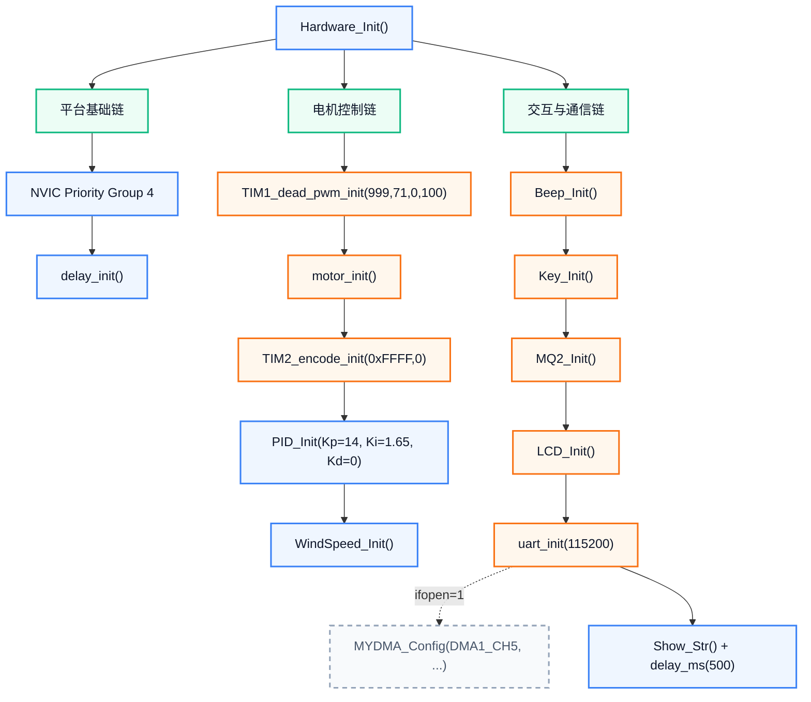
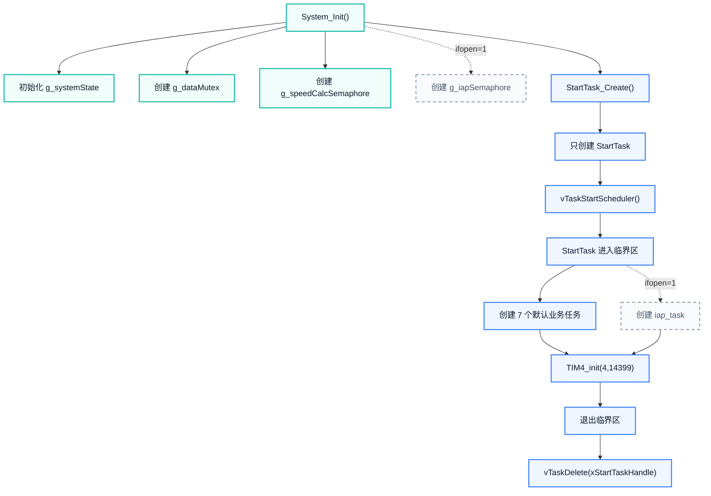
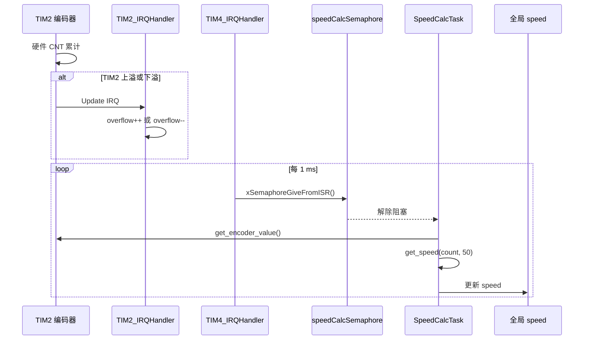
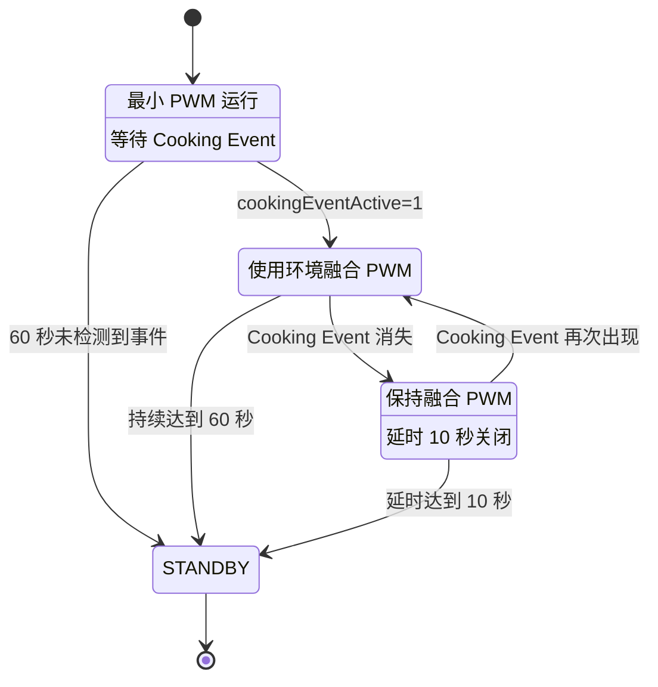
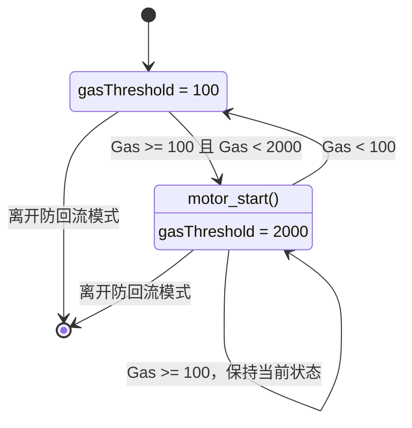
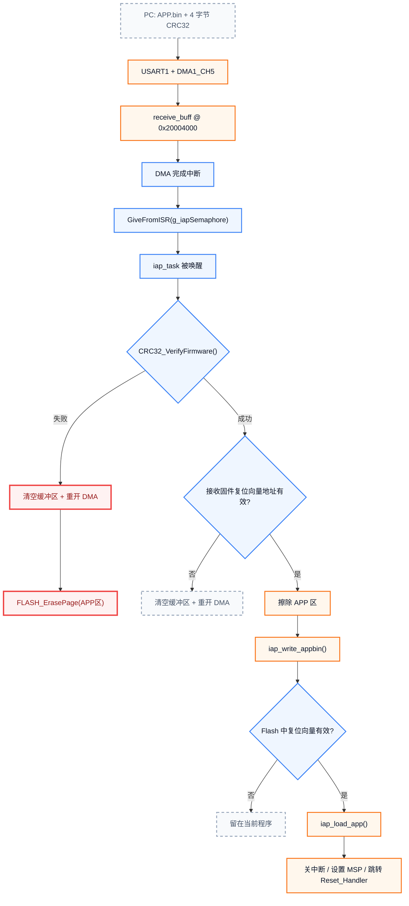
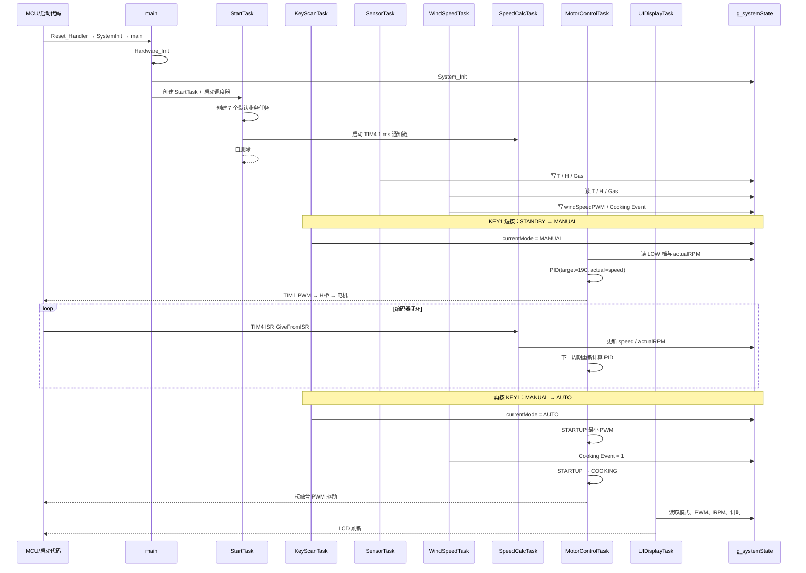

# RTOS 油烟机项目：完整代码流程走读

> [!abstract] 这篇文档解决什么问题
> 按程序的真实执行顺序，从复位入口一路跟到 `main`、FreeRTOS 任务、中断、共享状态和硬件驱动。每一节都回答四件事：**谁触发、调用谁、读写什么、下一步去哪里**。

> [!info] 当前源码的默认运行形态
> `SYSTEM/sys/sys.h` 中 `ifopen=0`，因此默认是 **7 个业务任务 + 2 个活动中断**。  
> 只有改为 `ifopen=1` 后，才会增加 `iap_task`、`g_iapSemaphore`、DMA1 Channel 5 及其中断路径。

## 阅读导航

| 学习链 | 先回答的问题 | 入口 |
|---|---|---|
| 1 | 整个系统怎样从上电变成多任务运行？ | [[#1. 一屏看懂系统]] |
| 2 | `main` 之前和 `Hardware_Init` 期间发生什么？ | [[#2. 上电、main 与硬件初始化]] |
| 3 | 状态、信号量和七个业务任务怎样建立？ | [[#3. System_Init、任务创建与调度]] |
| 4 | 按键怎样改变模式、档位和电机开关？ | [[#4. 按键与人机控制链]] |
| 5 | 传感器怎样变成 PWM 与 Cooking Event？ | [[#5. DHT11、MQ2 与风速决策链]] |
| 6 | 编码器怎样进入 PID 闭环？ | [[#6. 编码器、测速、PID 与电机闭环]] |
| 7 | 四种模式各自怎样控制电机？ | [[#7. 四种工作模式与防回流状态机]] |
| 8 | UI 怎样读状态，IAP 怎样接收并跳转？ | [[#8. UI 与可选 IAP 升级]] |
| 9 | 如何用一个真实场景串起全部代码？ | [[#9. 完整场景串联与源码索引]] |

相关入口：[[projects/RTOS项目/index|RTOS 项目导航]] · [[RTOS项目复习文档|RTOS 项目复习文档]]

---

## 1. 一屏看懂系统

### 1.1 本节结论

整个程序有一条不可混淆的分界线：

- `vTaskStartScheduler()` **之前**：CPU 沿 `main()` 顺序执行，没有业务任务并行。
- `vTaskStartScheduler()` **之后**：`StartTask` 先创建业务任务并自删除，之后由调度器、任务阻塞和中断共同推进系统。

![[assets/rtos/code-lifecycle-overview.svg]]

### 1.2 运行期谁和谁协作

![[assets/rtos/runtime-task-topology.svg]]

默认任务按优先级从高到低排列：

```text
SpeedCalc(6) > Motor(5) > Key(4) > Sensor(3) = Wind(3) > AntiBF(2) > UI(1)
```

若 `ifopen=1`，再增加最高优先级的 `iap_task(7)`。

> [!warning] 两套“优先级数字”方向相反
> FreeRTOS **任务优先级数字越大越高**；Cortex-M NVIC **中断优先级数字越小越高**。  
> 本工程能调用 `FromISR` API 的中断，数值必须不小于 `configLIBRARY_MAX_SYSCALL_INTERRUPT_PRIORITY=3`，所以 DMA=4、TIM4=5。

### 1.3 周期任务不是同时执行

![[assets/rtos/task-cadence-timeline.svg]]

这张图表示“应该多久运行一次”，不是说这些任务占用固定时间片。一次典型调度过程是：

1. 任务运行到 `delay_ms()` 或 `xSemaphoreTake()` 后阻塞。
2. 调度器选择当前最高优先级的就绪任务。
3. TIM2/TIM4 等中断可以抢占正在运行的任务。
4. `xSemaphoreGiveFromISR()` 可能让高优先级任务立即就绪并发生切换。

### 1.4 三条主数据链

| 数据链 | 写入方向 | 最终消费者 |
|---|---|---|
| 环境决策链 | DHT11/MQ2 → `SensorTask` → `g_systemState` → `WindSpeedTask` | 自动模式、UI |
| 速度闭环链 | 编码器 → TIM2/TIM4 → `SpeedCalcTask` → `speed` | 手动/防回流 PID |
| 人机控制链 | KEY → `KeyScanTask` → 模式/档位/开关字段 | `MotorControlTask`、UI |

> [!tip] 推荐阅读法
> 第一次只看本章和每章的“本节结论”；第二次再逐段看任务代码；第三次沿源码索引进入驱动层。

---

## 2. 上电、main 与硬件初始化

### 2.1 本节结论

`main()` 并不是 MCU 上电后的第一条 C 代码。复位向量先设置栈和运行时内存，`SystemInit()` 配置系统时钟，最后才进入 `main()`。

```text
Reset_Handler
  → 设置 MSP
  → 拷贝 .data、清零 .bss
  → SystemInit()
  → main()
```

启动文件：`CORE/startup_stm32f10x_*.s`  
时钟初始化：`USER/system_stm32f10x.c`  
程序入口：`USER/main.c`

### 2.2 main 的真实顺序

源码：`USER/main.c::main`

```c
int main(void)
{
    Hardware_Init();
    System_Init();
    StartTask_Create();
    vTaskStartScheduler();

    while (1)
    {
    }
}
```

四行代码对应四个上下文变化：

| 调用返回后 | 系统状态 |
|---|---|
| `Hardware_Init()` | 外设已配置，但调度器还未运行 |
| `System_Init()` | 公共状态、互斥量和测速信号量已存在 |
| `StartTask_Create()` | 就绪列表中只有一个 `StartTask` |
| `vTaskStartScheduler()` | FreeRTOS 开始调度，正常不会返回 |

![[assets/rtos/main-startup-flow.svg]]

### 2.3 Hardware_Init 调用图



### 2.4 Hardware_Init 关键代码

源码：`USER/main.c::Hardware_Init`

```c
static void Hardware_Init(void)
{
    NVIC_PriorityGroupConfig(NVIC_PriorityGroup_4);

    delay_init();

    TIM1_dead_pwm_init(1000-1, 72-1, 0, 100);
    motor_init();

    TIM2_encode_init(0xFFFF, 0);

    Beep_Init(&bep, GPIOB, GPIO_Pin_15);
    Key_Init();
    MQ2_Init();

    PID_Init(&g_speedPID, 14.0f, 1.65f, 0.0f, 1000.0f, 0.0f);
    WindSpeed_Init();
    LCD_Init();

    uart_init(115200);

#if ifopen
    MYDMA_Config(DMA1_Channel5, (u32)&USART1->DR,
                 (u32)receive_buff, buff_size);
#endif

    Show_Str(0, 0, BLUE, WHITE, "Init Complete! ", 16, 0);
    delay_ms(500);
}
```

### 2.5 初始化之后，硬件处于什么状态

- TIM1 已配置为约 1 kHz 的互补 PWM，并设置死区。
- `motor_init()` 先确定正转通道、停止电机，再使能 H 桥；真正通道输出仍由后续 `motor_pwm_set()` 决定。
- TIM2 已进入编码器模式，并允许更新中断修正溢出计数。
- 按键、MQ2、LCD、UART 已可使用。
- TIM4 **尚未启动**，它必须等 `System_Init()` 创建 `g_speedCalcSemaphore` 后才能启用。

> [!info] 调度器启动前的 delay_ms
> `Hardware_Init()` 最后的 `delay_ms(500)` 发生在调度器启动前，此时走普通延时。调度器启动后，`delay_ms()` 会先调用 `vTaskDelay()` 让出 CPU，剩余不足一个 tick 的部分才忙等。

> [!tip] 下一跳
> 硬件准备完成后，回到 `main()`，进入 [[#3. System_Init、任务创建与调度]]。

---

## 3. System_Init、任务创建与调度

### 3.1 本节结论

`System_Init()` 建立“公共白板”和“通知铃”；`StartTask` 再创建七个业务任务、启动 TIM4，最后删除自己。



### 3.2 公共状态结构体

源码：`APP_TASK/app_tasks.h::SystemState_t`

```c
typedef struct {
    WorkMode_t currentMode;
    SpeedLevel_t speedLevel;
    u8 motorRunning;

    u8 temperature;
    u8 humidity;
    float gasConcentration;

    float windSpeedPWM;
    float actualRPM;
    u16 targetRPM;

    u8 cookingEventActive;

    u8 antiBackflowActive;
    float gasThreshold;

    u32 autoModeCounter;
    u32 cookingEventCounter;
} SystemState_t;
```

![[assets/rtos/system-state-data-flow.svg]]

### 3.3 System_Init 完整代码

源码：`APP_TASK/app_tasks.c::System_Init`

```c
void System_Init(void)
{
    g_systemState.currentMode = MODE_STANDBY;
    g_systemState.speedLevel = SPEED_LOW;
    g_systemState.motorRunning = 0;
    g_systemState.temperature = 0;
    g_systemState.humidity = 0;
    g_systemState.gasConcentration = 0.0f;
    g_systemState.windSpeedPWM = 0.0f;
    g_systemState.actualRPM = 0.0f;
    g_systemState.targetRPM = 0;
    g_systemState.cookingEventActive = 0;
    g_systemState.antiBackflowActive = 0;
    g_systemState.gasThreshold = GAS_THRESHOLD_NORMAL;
    g_systemState.autoModeCounter = 0;
    g_systemState.cookingEventCounter = 0;

    g_dataMutex = xSemaphoreCreateMutex();
    g_speedCalcSemaphore = xSemaphoreCreateBinary();

#if ifopen
    g_iapSemaphore = xSemaphoreCreateBinary();
#endif
}
```

三种同步对象的职责：

| 对象 | 类型 | 生产者 | 消费者 |
|---|---|---|---|
| `g_dataMutex` | 互斥量 | 所有需要改共享状态的任务 | 所有需要一致读写的任务 |
| `g_speedCalcSemaphore` | 二值信号量 | TIM4 ISR | `SpeedCalcTask` |
| `g_iapSemaphore` | 二值信号量，可选 | DMA1_CH5 ISR | `iap_task` |

### 3.4 StartTask 完整代码

源码：`APP_TASK/app_tasks.c::StartTask_Create / StartTask`

```c
void StartTask_Create(void)
{
    xTaskCreate(StartTask, "StartTask", TASK_START_STK_SIZE, NULL,
                TASK_START_PRIORITY, &xStartTaskHandle);
}

void StartTask(void *pvParameters)
{
    taskENTER_CRITICAL();

    xTaskCreate(KeyScanTask, "KeyScan", TASK_KEY_STK_SIZE, NULL,
                TASK_KEY_PRIORITY, &xKeyScanTaskHandle);
    xTaskCreate(SensorTask, "Sensor", TASK_SENSOR_STK_SIZE, NULL,
                TASK_SENSOR_PRIORITY, &xSensorTaskHandle);
    xTaskCreate(WindSpeedTask, "WindSpeed", TASK_WIND_SPEED_STK_SIZE, NULL,
                TASK_WIND_SPEED_PRIORITY, &xWindSpeedTaskHandle);
    xTaskCreate(MotorControlTask, "Motor", TASK_MOTOR_STK_SIZE, NULL,
                TASK_MOTOR_PRIORITY, &xMotorControlTaskHandle);
    xTaskCreate(UIDisplayTask, "UI", TASK_UI_STK_SIZE, NULL,
                TASK_UI_PRIORITY, &xUIDisplayTaskHandle);
    xTaskCreate(AntiBackflowTask, "AntiBF",
                TASK_ANTI_BACKFLOW_STK_SIZE, NULL,
                TASK_ANTI_BACKFLOW_PRIORITY,
                &xAntiBackflowTaskHandle);
    xTaskCreate(SpeedCalcTask, "SpeedCalc",
                TASK_SPEED_CALC_STK_SIZE, NULL,
                TASK_SPEED_CALC_PRIORITY,
                &xSpeedCalcTaskHandle);

#if ifopen
    xTaskCreate(iap_task, "IAP", TASK_IAP_STK_SIZE, NULL,
                TASK_IAP_PRIORITY, &xIAPTaskHandle);
#endif

    TIM4_init(5-1, 14400-1);

    taskEXIT_CRITICAL();
    vTaskDelete(xStartTaskHandle);
}
```

### 3.5 任务目录

| 任务 | 优先级 | 触发方式 | 主要职责 |
|---|---:|---|---|
| `SpeedCalcTask` | 6 | TIM4 信号量 | 读取编码器并更新全局 `speed` |
| `MotorControlTask` | 5 | 50 ms | 模式状态机、PID、PWM |
| `KeyScanTask` | 4 | 10 ms | 按键状态机与用户命令 |
| `SensorTask` | 3 | 500 ms | DHT11 与 MQ2 采集 |
| `WindSpeedTask` | 3 | 100 ms | 融合计算和 Cooking Event |
| `AntiBackflowTask` | 2 | 100 ms | 防回流阈值迟滞 |
| `UIDisplayTask` | 1 | 200 ms | LCD 刷新 |
| `iap_task` | 7 | DMA 信号量，可选 | CRC、Flash 写入与跳转 |

### 3.6 delay_ms 为什么能让出 CPU

源码：`SYSTEM/delay/delay.c::delay_ms`

```c
void delay_ms(u32 nms)
{
    if (xTaskGetSchedulerState() != taskSCHEDULER_NOT_STARTED)
    {
        if (nms >= fac_ms)
        {
            vTaskDelay(nms / fac_ms);
        }
        nms %= fac_ms;
    }
    delay_us((u32)(nms * 1000));
}
```

因此任务里的 `delay_ms(10)` 不是纯忙等：绝大部分时间任务处于阻塞态，CPU 可以运行其他就绪任务。

> [!warning] 源码一致性风险
> `g_systemState` 的部分访问使用 `g_dataMutex`，部分访问直接读写。文档后续会按源码真实行为标记，而不是假设所有字段都已完整加锁。

> [!tip] 下一跳
> 调度器启动后，最常见的人机入口是 [[#4. 按键与人机控制链]]。

---

## 4. 按键与人机控制链

### 4.1 本节结论

按键并不直接改 PWM。它先经过状态机生成事件，再由 `KeyScanTask` 调用系统控制函数修改 `g_systemState`；`MotorControlTask` 在下一个 50 ms 周期看到新状态后改变电机行为。

```text
PB1/PB12 电平
  → Key_StateMachine()
  → SHORT / LONG / LONG_PRESSING / RELEASE
  → KeyScanTask
  → System_SwitchMode / SwitchSpeedLevel / ToggleMotor
  → g_systemState
  → MotorControlTask
```

![[assets/rtos/gpio-key-state-machine.svg]]

### 4.2 KeyScanTask 完整代码

源码：`APP_TASK/app_tasks.c::KeyScanTask`

```c
void KeyScanTask(void *pvParameters)
{
    KeyEvent_t key1Event, key2Event;

    while (1)
    {
        Key_Scan();

        key1Event = Key1_GetEvent();
        if (key1Event == KEY_EVENT_SHORT_PRESS)
        {
            System_SwitchMode();
            Buzzer_Beep(100, &bep);
            Key1_ClearEvent();
        }
        else if (key1Event == KEY_EVENT_LONG_PRESSING)
        {
            Beep_on(&bep);
        }
        else if (key1Event == KEY_EVENT_RELEASE)
        {
            Beep_off(&bep);
            Key1_ClearEvent();
        }

        key2Event = Key2_GetEvent();
        if (key2Event == KEY_EVENT_SHORT_PRESS)
        {
            System_SwitchSpeedLevel();
            Buzzer_Beep(100, &bep);
            Key2_ClearEvent();
        }
        else if (key2Event == KEY_EVENT_LONG_PRESS)
        {
            System_ToggleMotor();
        }
        else if (key2Event == KEY_EVENT_LONG_PRESSING)
        {
            Beep_on(&bep);
        }
        else if (key2Event == KEY_EVENT_RELEASE)
        {
            Beep_off(&bep);
            Key2_ClearEvent();
        }

        delay_ms(10);
    }
}
```

状态机的两个时间阈值来自 `BSP/KEY/key.h`：

```c
#define KEY_DEBOUNCE_TIME_MS    30
#define KEY_LONG_PRESS_TIME_MS  1000
```

### 4.3 模式、档位和电机开关

源码：`APP_TASK/app_tasks.c::System_SwitchMode / System_SwitchSpeedLevel / System_ToggleMotor`

```c
void System_SwitchMode(void)
{
    if (xSemaphoreTake(g_dataMutex, portMAX_DELAY) == pdTRUE)
    {
        switch (g_systemState.currentMode)
        {
            case MODE_STANDBY:
                g_systemState.currentMode = MODE_MANUAL;
                break;
            case MODE_MANUAL:
                g_systemState.currentMode = MODE_AUTO;
                g_autoModeState = AUTO_STATE_STARTUP;
                break;
            case MODE_AUTO:
                g_systemState.currentMode = MODE_ANTI_BACKFLOW;
                break;
            case MODE_ANTI_BACKFLOW:
                g_systemState.currentMode = MODE_STANDBY;
                break;
        }

        if (g_systemState.currentMode != MODE_AUTO)
        {
            g_systemState.motorRunning = 0;
            motor_stop();
        }

        xSemaphoreGive(g_dataMutex);
    }
}

void System_SwitchSpeedLevel(void)
{
    if (xSemaphoreTake(g_dataMutex, portMAX_DELAY) == pdTRUE)
    {
        switch (g_systemState.speedLevel)
        {
            case SPEED_LOW:
                g_systemState.speedLevel = SPEED_HIGH;
                break;
            case SPEED_HIGH:
                g_systemState.speedLevel = SPEED_LOW;
                break;
        }
        xSemaphoreGive(g_dataMutex);
    }
}

void System_ToggleMotor(void)
{
    if (xSemaphoreTake(g_dataMutex, portMAX_DELAY) == pdTRUE)
    {
        if (g_systemState.motorRunning)
        {
            motor_stop();
            g_systemState.motorRunning = 0;
            g_systemState.currentMode = MODE_STANDBY;
            Show_Str(0, 0, BLUE, WHITE,
                     "Motor Stopped", 16, 0);
        }
        else
        {
            motor_start();
            g_systemState.motorRunning = 1;
            g_systemState.currentMode = MODE_MANUAL;
            Show_Str(0, 0, BLUE, WHITE,
                     "Motor Started", 16, 0);
        }

        xSemaphoreGive(g_dataMutex);
    }
}
```

### 4.4 三种用户操作的结果

| 操作 | 立即改变 | 之后谁响应 |
|---|---|---|
| KEY1 短按 | `currentMode` 循环切换 | `MotorControlTask` |
| KEY2 短按 | `speedLevel` 在 LOW/HIGH 间切换 | 手动/防回流 PID |
| KEY2 长按 | 强制进入 MANUAL 或 STANDBY | `MotorControlTask`、UI |

> [!info] 为什么长按开机强制进入 MANUAL
> 如果只把 `motorRunning` 改成 1，而模式仍是 STANDBY，`MotorControlTask` 下一轮会再次执行 `motor_stop()`。强制改为 MANUAL 才能形成持续驱动。

> [!tip] 下一跳
> 用户改变的是控制状态；自动模式还需要环境输入，见 [[#5. DHT11、MQ2 与风速决策链]]。

---

## 5. DHT11、MQ2 与风速决策链

### 5.1 本节结论

`SensorTask` 只负责采集，`WindSpeedTask` 负责决策。二者通过 `g_systemState` 解耦：

```text
DHT11 / MQ2
  → SensorTask 写 temperature / humidity / gasConcentration
  → WindSpeedTask 读取三项环境量
  → WindSpeed_Update()
  → 写 windSpeedPWM / cookingEventActive
  → 自动模式和 UI 消费
```

### 5.2 DHT11 与 MQ2 驱动图

![[assets/rtos/dht11-read-flow.svg]]

![[assets/rtos/mq2-adc-sampling-flow.svg]]

### 5.3 SensorTask 完整代码

源码：`APP_TASK/app_tasks.c::SensorTask`

```c
void SensorTask(void *pvParameters)
{
    u8 temp, humi;
    float gasValue;
    u8 ret;

    while (1)
    {
        ret = DHT_Read_Data(&temp, &humi,
                            GPIOC, GPIO_Pin_14, &dht);
        if (ret == 1)
        {
            if (xSemaphoreTake(g_dataMutex,
                               portMAX_DELAY) == pdTRUE)
            {
                g_systemState.temperature = temp;
                g_systemState.humidity = humi;
                xSemaphoreGive(g_dataMutex);
            }
        }

        gasValue = MQ2_GetGasConcentration();
        if (xSemaphoreTake(g_dataMutex,
                           portMAX_DELAY) == pdTRUE)
        {
            g_systemState.gasConcentration = gasValue;
            xSemaphoreGive(g_dataMutex);
        }

#if SENSOR_DEBUG
        printf("Temp: %d, Humi: %d, Gas: %.2f\r\n",
               temp, humi, gasValue);
#endif

        delay_ms(500);
    }
}
```

> [!note] 源码注释与实际行为
> 源码注释写“采用两把锁”，实际是对同一个 `g_dataMutex` **分两次获取**。这样缩短了单次临界区，但并没有创建两把互斥量。

### 5.4 WindSpeedTask 完整代码

源码：`APP_TASK/app_tasks.c::WindSpeedTask`

```c
void WindSpeedTask(void *pvParameters)
{
    u8 temp, humidity;
    float gas;

    while (1)
    {
        if (xSemaphoreTake(g_dataMutex,
                           portMAX_DELAY) == pdTRUE)
        {
            temp = g_systemState.temperature;
            humidity = g_systemState.humidity;
            gas = (float)g_systemState.gasConcentration;
            xSemaphoreGive(g_dataMutex);
        }

        WindSpeed_Update(temp, humidity, gas);

        if (xSemaphoreTake(g_dataMutex,
                           portMAX_DELAY) == pdTRUE)
        {
            g_systemState.windSpeedPWM = WindSpeed_GetPWM();
            g_systemState.cookingEventActive =
                WindSpeed_IsCookingEvent();
            xSemaphoreGive(g_dataMutex);
        }

        delay_ms(100);
    }
}
```

### 5.5 WindSpeed_Update 的算法

源码：`BSP/WIND/wind_speed.c::WindSpeed_Update`

先把三种传感器值限制到 0～1：

$$
f_T=\operatorname{clamp}\left(\frac{T-T_{base}}{T_{max}-T_{base}},0,1\right)
$$

$$
f_H=\operatorname{clamp}\left(\frac{H-H_{base}}{H_{max}-H_{base}},0,1\right)
$$

$$
f_G=\operatorname{clamp}\left(\frac{G-G_{base}}{G_{max}-G_{base}},0,1\right)
$$

再按权重融合并映射为 PWM：

$$
F=0.2f_T+0.2f_H+0.6f_G
$$

$$
PWM=20+80F
$$

核心代码：

```c
g_windSpeedData.fusionValue =
    WEIGHT_TEMP * g_windSpeedData.f_T +
    WEIGHT_HUMIDITY * g_windSpeedData.f_H +
    WEIGHT_GAS * g_windSpeedData.f_G;

g_windSpeedData.pwmValue =
    PWM_MIN + (PWM_MAX - PWM_MIN) *
    g_windSpeedData.fusionValue;

g_windSpeedData.pwmValue =
    Constrain(g_windSpeedData.pwmValue, PWM_MIN, PWM_MAX);

if ((temp > COOKING_TEMP_THRESHOLD) &&
    (humidity > COOKING_HUMIDITY_THRESHOLD) &&
    (gas > COOKING_GAS_THRESHOLD))
{
    g_windSpeedData.isCookingEvent = 1;
}
else
{
    g_windSpeedData.isCookingEvent = 0;
}
```

### 5.6 谁读写这些字段

| 字段 | 写入者 | 读取者 |
|---|---|---|
| `temperature` / `humidity` | `SensorTask` | `WindSpeedTask`、UI 间接显示逻辑 |
| `gasConcentration` | `SensorTask` | `WindSpeedTask`、`AntiBackflowTask` |
| `windSpeedPWM` | `WindSpeedTask` | 自动模式、UI |
| `cookingEventActive` | `WindSpeedTask` | 自动模式状态机 |

> [!tip] 下一跳
> 环境算法给出的是“应该多快”；真正让电机闭环到目标速度的是 [[#6. 编码器、测速、PID 与电机闭环]]。

---

## 6. 编码器、测速、PID 与电机闭环

### 6.1 本节结论

这条链由两个定时器分工：

- TIM2 工作在编码器模式，硬件持续累计脉冲；溢出时 ISR 修正 `overflow`。
- TIM4 每 1 ms 产生一次中断，只负责释放信号量。
- `SpeedCalcTask` 被唤醒后读累计计数，`get_speed()` 约每 50 ms 形成一次新转速。
- `MotorControlTask` 在手动/防回流模式把目标转速和实际转速送入 PID。

![[assets/rtos/speed-calc-flow.svg]]

### 6.2 ISR 到任务的时序



### 6.3 SpeedCalcTask 与两个 ISR

源码：`APP_TASK/app_tasks.c`

```c
void SpeedCalcTask(void *pvParameters)
{
    int encoderCount;

    while (1)
    {
        if (xSemaphoreTake(g_speedCalcSemaphore,
                           portMAX_DELAY) == pdTRUE)
        {
            encoderCount = get_encoder_value();
            speed = get_speed(encoderCount, 50);
        }
    }
}

void TIM2_IRQHandler(void)
{
    if (TIM_GetITStatus(TIM2, TIM_IT_Update) != RESET)
    {
        TIM_ClearITPendingBit(TIM2, TIM_IT_Update);

        if (TIM_GetDirection(TIM2))
            overflow--;
        else
            overflow++;
    }
}

void TIM4_IRQHandler(void)
{
    BaseType_t xHigherPriorityTaskWoken = pdFALSE;

    if (TIM_GetITStatus(TIM4, TIM_IT_Update) != RESET)
    {
        TIM_ClearITPendingBit(TIM4, TIM_IT_Update);

        xSemaphoreGiveFromISR(g_speedCalcSemaphore,
                              &xHigherPriorityTaskWoken);
        portYIELD_FROM_ISR(xHigherPriorityTaskWoken);
    }
}
```

### 6.4 get_speed 的完整滤波路径

源码：`BSP/MOTOR/motor.c::get_encoder_value / get_speed`

```c
int get_encoder_value(void)
{
    u32 buffer;
    buffer = TIM_GetCounter(TIM2) + (overflow * 65536);
    return buffer;
}

float get_speed(int encode_value, u16 ms)
{
    u8 i = 0, j = 0;
    float temp = 0.0;
    static float speed = 0;
    static uint8_t sp_count = 0, k = 0;
    static float speed_arr[10] = {0.0};
    static int old_value = 0, now_value = 0;

    if (sp_count == ms)
    {
        now_value = encode_value;

        speed_arr[k++] =
            (float)((now_value - old_value) *
            ((1000 / ms) * 60.0) / 30 / (11 * 4));
        old_value = now_value;

        if (k == 10)
        {
            for (i = 10; i >= 1; i--)
            {
                for (j = 0; j < (i - 1); j++)
                {
                    if (speed_arr[j] > speed_arr[j + 1])
                    {
                        temp = speed_arr[j];
                        speed_arr[j] = speed_arr[j + 1];
                        speed_arr[j + 1] = temp;
                    }
                }
            }

            temp = 0.0;
            for (i = 2; i < 8; i++)
                temp += speed_arr[i];

            temp = (float)(temp / 6);
            speed = (float)(0.48 * temp + speed * 0.52);
            k = 0;
        }
        sp_count = 0;
    }

    sp_count++;
    return speed;
}
```

> [!info] 1 ms 唤醒不等于 1 ms 输出新速度
> `SpeedCalcTask` 每次 TIM4 中断都会运行，但 `get_speed()` 只有累计到约 50 次后才加入一个新样本；再累计 10 个样本后，才做排序、去掉两端值、平均和一阶低通。因此最终转速比原始计数稳定，但响应更慢。

### 6.5 PID 闭环

![[assets/rtos/pid-closed-loop-flow.svg]]

位置式 PID：

$$
u(k)=K_p e(k)+K_i\sum e(k)+K_d[e(k)-e(k-1)]
$$

源码：`BSP/PID/pid.c::PID_Calculate`

```c
float PID_Calculate(PID_TypeDef *pid, float actual)
{
    float p_out, i_out, d_out;

    pid->actual = actual;
    pid->error = pid->target - pid->actual;
    pid->integral += pid->error;

    if (pid->integral > pid->integral_max)
        pid->integral = pid->integral_max;
    else if (pid->integral < -pid->integral_max)
        pid->integral = -pid->integral_max;

    p_out = pid->Kp * pid->error;
    i_out = pid->Ki * pid->integral;
    d_out = pid->Kd * (pid->error - pid->last_error);

    pid->output = p_out + i_out + d_out;

    if (pid->output > pid->output_max)
        pid->output = pid->output_max;
    else if (pid->output < pid->output_min)
        pid->output = pid->output_min;

    pid->last_error = pid->error;
    return pid->output;
}
```

初始化参数为：

```c
PID_Init(&g_speedPID, 14.0f, 1.65f, 0.0f, 1000.0f, 0.0f);
```

即 `Kp=14`、`Ki=1.65`、`Kd=0`，输出限制到 0～1000，正好对应 TIM1 的 CCR 范围。

### 6.6 PID 输出怎样到电机

源码：`BSP/MOTOR/motor.c::motor_pwm_set`

```c
void motor_pwm_set(float para)
{
    int val = (int)para;

    if (val >= 0)
    {
        motor_dir(stright);
        motor_speed(val);
    }
    else
    {
        motor_dir(invert);
        motor_speed(-val);
    }
}
```

```text
PID 输出
  → motor_pwm_set()
  → motor_dir() 选择 CH1 或 CH1N
  → motor_speed() 写 TIM1 CCR1
  → H 桥
  → 电机
  → 编码器反馈到 TIM2
```

> [!tip] 下一跳
> 闭环只回答“怎样跟踪目标”；目标由哪种模式决定，见 [[#7. 四种工作模式与防回流状态机]]。

---

## 7. 四种工作模式与防回流状态机

### 7.1 本节结论

`MotorControlTask` 是模式心脏，每 50 ms 检查一次 `currentMode`：

| 模式 | 目标从哪里来 | 控制方式 |
|---|---|---|
| STANDBY | 无 | 停止电机、清自动模式计时 |
| MANUAL | LOW/HIGH 档位对应 190/220 RPM | PID 闭环 |
| AUTO | 环境融合得到的 PWM | 开环 PWM + 内部三态状态机 |
| ANTI_BACKFLOW | LOW/HIGH 档位 | 阈值触发后 PID 闭环 |

### 7.2 自动模式三态



三个计时阈值：

```c
#define AUTO_MODE_STARTUP_TIME   60000
#define COOKING_EVENT_TIMEOUT    60000
#define COOKING_EVENT_DELAY_OFF  10000
```

### 7.3 防回流迟滞



这里把触发阈值从 100 立即抬高到 2000，是为了避免气体值在 100 附近抖动时反复启动；只有降回 100 以下才停止。

### 7.4 MotorControlTask 完整代码

源码：`APP_TASK/app_tasks.c::MotorControlTask`

```c
void MotorControlTask(void *pvParameters)
{
    float pidOutput;

    while (1)
    {
        u16 pwmCompare = 0;

        if (xSemaphoreTake(g_dataMutex,
                           portMAX_DELAY) == pdTRUE)
        {
            g_systemState.actualRPM = speed;
            xSemaphoreGive(g_dataMutex);
        }

        switch (g_systemState.currentMode)
        {
            case MODE_STANDBY:
                motor_stop();
                g_systemState.motorRunning = 0;
                g_systemState.autoModeCounter = 0;
                g_systemState.cookingEventCounter = 0;
                g_autoModeState = AUTO_STATE_STARTUP;
                break;

            case MODE_MANUAL:
                if (g_systemState.motorRunning == 0)
                {
                    motor_start();
                    g_systemState.motorRunning = 1;
                }

                if (g_systemState.motorRunning)
                {
                    g_systemState.targetRPM =
                        WindSpeed_GetTargetRPM(
                            g_systemState.speedLevel);
                    PID_SetTarget(&g_speedPID,
                                  (float)g_systemState.targetRPM);
                    pidOutput =
                        PID_Calculate(&g_speedPID, speed);
                    motor_pwm_set(pidOutput);
                }
                break;

            case MODE_AUTO:
                switch (g_autoModeState)
                {
                    case AUTO_STATE_STARTUP:
                        if (!g_systemState.motorRunning)
                        {
                            g_systemState.motorRunning = 1;
                            motor_start();
                        }

                        motor_pwm_set(PWM_MIN * 10);
                        g_systemState.autoModeCounter += 50;

                        if (g_systemState.cookingEventActive)
                        {
                            g_autoModeState =
                                AUTO_STATE_COOKING;
                        }
                        else if (g_systemState.autoModeCounter >=
                                 AUTO_MODE_STARTUP_TIME)
                        {
                            g_systemState.currentMode =
                                MODE_STANDBY;
                            motor_stop();
                            g_systemState.motorRunning = 0;
                        }
                        break;

                    case AUTO_STATE_COOKING:
                        pwmCompare =
                            WindSpeed_GetPWMCompare(MAXCCR);
                        motor_pwm_set(pwmCompare);
                        g_systemState.cookingEventCounter += 50;

                        if (!g_systemState.cookingEventActive)
                        {
                            g_autoModeState =
                                AUTO_STATE_DELAY_OFF;
                            g_systemState.cookingEventCounter = 0;
                        }
                        else if (
                            g_systemState.cookingEventCounter >=
                            COOKING_EVENT_TIMEOUT)
                        {
                            g_systemState.currentMode =
                                MODE_STANDBY;
                            motor_stop();
                            g_systemState.motorRunning = 0;
                        }
                        break;

                    case AUTO_STATE_DELAY_OFF:
                        pwmCompare =
                            WindSpeed_GetPWMCompare(MAXCCR);
                        motor_pwm_set(pwmCompare);
                        g_systemState.cookingEventCounter += 50;

                        if (g_systemState.cookingEventActive)
                        {
                            g_autoModeState =
                                AUTO_STATE_COOKING;
                            g_systemState.cookingEventCounter = 0;
                        }
                        else if (
                            g_systemState.cookingEventCounter >=
                            COOKING_EVENT_DELAY_OFF)
                        {
                            g_systemState.currentMode =
                                MODE_STANDBY;
                            motor_stop();
                            g_systemState.motorRunning = 0;
                        }
                        break;
                }
                break;

            case MODE_ANTI_BACKFLOW:
                if (g_systemState.antiBackflowActive &&
                    g_systemState.motorRunning)
                {
                    g_systemState.targetRPM =
                        WindSpeed_GetTargetRPM(
                            g_systemState.speedLevel);
                    PID_SetTarget(&g_speedPID,
                                  (float)g_systemState.targetRPM);
                    pidOutput =
                        PID_Calculate(&g_speedPID, speed);
                    motor_pwm_set(pidOutput);
                }
                break;
        }

        delay_ms(50);
    }
}
```

### 7.5 AntiBackflowTask 完整代码

源码：`APP_TASK/app_tasks.c::AntiBackflowTask`

```c
void AntiBackflowTask(void *pvParameters)
{
    u8 isDetected = 0;

    while (1)
    {
        if (g_systemState.currentMode ==
            MODE_ANTI_BACKFLOW)
        {
            isDetected =
                (g_systemState.gasConcentration >=
                 g_systemState.gasThreshold) ? 1 : 0;

            if (isDetected)
            {
                if (g_systemState.gasConcentration <
                    GAS_THRESHOLD_HIGH)
                {
                    g_systemState.antiBackflowActive = 1;
                    g_systemState.motorRunning = 1;
                    motor_start();
                    g_systemState.gasThreshold =
                        GAS_THRESHOLD_HIGH;
                }
            }
            else if (g_systemState.gasConcentration <
                     GAS_THRESHOLD_NORMAL)
            {
                g_systemState.antiBackflowActive = 0;
                g_systemState.motorRunning = 0;
                motor_stop();
                g_systemState.gasThreshold =
                    GAS_THRESHOLD_NORMAL;
            }
        }
        else
        {
            g_systemState.antiBackflowActive = 0;
            g_systemState.gasThreshold =
                GAS_THRESHOLD_NORMAL;
        }

        delay_ms(100);
    }
}
```

> [!warning] 当前共享状态并非处处加锁
> `MotorControlTask` 和 `AntiBackflowTask` 直接读写了多个 `g_systemState` 字段。单个 8/16/32 位访问在 Cortex-M3 上通常可原子完成，但跨字段的一致快照并没有保证；这是源码现状，不应误解为完整的互斥保护。

> [!tip] 下一跳
> 控制结果还会被 UI 显示；如果启用升级功能，另有一条独立事件链，见 [[#8. UI 与可选 IAP 升级]]。

---

## 8. UI 与可选 IAP 升级

### 8.1 UIDisplayTask

UI 任务不参与控制决策，只读取状态并每 200 ms 刷新 LCD。

源码：`APP_TASK/app_tasks.c::UIDisplayTask`

```c
void UIDisplayTask(void *pvParameters)
{
    char dispBuf[32];

    LCD_Clear(WHITE);

    while (1)
    {
        sprintf(dispBuf, "Mode:%s",
                ModeNames[g_systemState.currentMode]);
        Show_Str(0, 20, BLUE, WHITE,
                 (u8*)dispBuf, 16, 0);

        sprintf(dispBuf, "Level:%s",
                SpeedLevelNames[g_systemState.speedLevel]);
        Show_Str(0, 40, BLUE, WHITE,
                 (u8*)dispBuf, 16, 0);

        sprintf(dispBuf, "WIND:%.1f%%  ",
                g_systemState.windSpeedPWM);
        Show_Str(0, 60, BLUE, WHITE,
                 (u8*)dispBuf, 16, 0);

        sprintf(dispBuf, "RPM:%.0f    ",
                g_systemState.actualRPM);
        Show_Str(0, 80, BLUE, WHITE,
                 (u8*)dispBuf, 16, 0);

        sprintf(dispBuf, "Auto:%s",
                AutoStateNames[g_autoModeState]);
        Show_Str(0, 100, BLUE, WHITE,
                 (u8*)dispBuf, 16, 0);

        sprintf(dispBuf, "AMCnt:%ds  ",
                g_systemState.autoModeCounter / 1000);
        Show_Str(0, 120, BLUE, WHITE,
                 (u8*)dispBuf, 16, 0);

        sprintf(dispBuf, "CECnt:%ds  ",
                g_systemState.cookingEventCounter / 1000);
        Show_Str(0, 140, BLUE, WHITE,
                 (u8*)dispBuf, 16, 0);

        delay_ms(200);
    }
}
```

> [!note] UI 的一致性
> UI 没有持有 `g_dataMutex`，因此一次刷新中的多个字段可能来自相邻的不同控制周期。对状态显示通常可以接受，但它不是严格一致的快照。

### 8.2 IAP 默认关闭

源码：`SYSTEM/sys/sys.h`

```c
#define ifopen 0
```

只有改为 1 后才会编译：

- 固定地址 `0x20004000` 的 `receive_buff`
- DMA1 Channel 5
- `g_iapSemaphore`
- `iap_task`
- `DMA1_Channel5_IRQHandler`

![[assets/rtos/flash-ram-layout.svg]]

### 8.3 IAP 的实际源码路径



> [!danger] CRC 失败分支会擦除 APP 页
> 当前源码在 CRC 校验失败后仍调用 `FLASH_ErasePage(FLASH_APP1_ADDR)`。这会破坏原 APP，和注释“等待重传”的意图冲突。本文只标注风险，不修改固件源码。

### 8.4 iap_task 关键完整分支

源码：`APP_TASK/app_tasks.c::iap_task`

```c
#if ifopen
void iap_task(void *pvParameters)
{
    uint16_t receivedLength;
    u32 firmwareLen;

    while (1)
    {
        xSemaphoreTake(g_iapSemaphore, portMAX_DELAY);

        receivedLength = GetReceivedDataLength();

        if (receive_buff[0])
        {
            if (CRC32_VerifyFirmware(
                    receive_buff, receivedLength) == 0)
            {
                Show_Str(0, 0, BLUE, WHITE,
                         "CRC32 Error!", 16, 0);
                memset(receive_buff, 0, buff_size);
                MYDMA_Enable(DMA1_Channel5);

                /* 当前源码风险：CRC 失败仍擦除 APP 页 */
                FLASH_ErasePage(FLASH_APP1_ADDR);
            }
            else
            {
                firmwareLen = receivedLength - 4;

                if (((*(vu32*)(0X20004000 + 4)) &
                     0xFF000000) == 0x08000000)
                {
                    LCD_Clear(WHITE);
                    Show_Str(0, 80, BLUE, WHITE,
                             "Firmware updating!", 16, 0);

                    FLASH_ErasePage(FLASH_APP1_ADDR);
                    iap_write_appbin(
                        FLASH_APP1_ADDR,
                        receive_buff,
                        firmwareLen);

                    Show_Str(0, 100, BLUE, WHITE,
                             " update completed", 16, 0);

                    if (((*(vu32*)(FLASH_APP1_ADDR + 4)) &
                         0xFF000000) == 0x08000000)
                    {
                        Show_Str(0, 120, BLUE, WHITE,
                                 " excute app", 16, 0);
                        iap_load_app(FLASH_APP1_ADDR);
                    }
                }
                else
                {
                    memset(receive_buff, 0, buff_size);
                    MYDMA_Enable(DMA1_Channel5);
                }
            }
        }
    }
}
#endif
```

DMA ISR 只做通知：

```c
void DMA1_Channel5_IRQHandler(void)
{
    BaseType_t xHigherPriorityTaskWoken = pdFALSE;

    if (DMA_GetITStatus(DMA1_IT_TC5))
    {
        DMA_ClearITPendingBit(DMA1_IT_TC5);
        xSemaphoreGiveFromISR(g_iapSemaphore,
                              &xHigherPriorityTaskWoken);
    }

    portYIELD_FROM_ISR(xHigherPriorityTaskWoken);
}
```

> [!warning] 单 APP 区没有 A/B 回滚
> 当前布局是 Bootloader + 单 APP 区。CRC 能发现传输错误，但一旦擦除 APP 后掉电，旧版本已经不存在；要实现自动回滚，需要 A/B 双 APP 分区和原子启动状态，这不属于当前源码行为。

> [!tip] 下一跳
> 现在用一个用户场景把任务、中断、状态和驱动全部串起来，见 [[#9. 完整场景串联与源码索引]]。

---

## 9. 完整场景串联与源码索引

### 9.1 场景：上电后手动运行，再进入自动模式



### 9.2 用数据变化复盘场景

| 阶段 | 关键状态变化 | 执行者 |
|---|---|---|
| 上电 | `currentMode=STANDBY`、互斥量/信号量建立 | `System_Init` |
| 调度启动 | 七个业务任务创建，TIM4 开始 1 ms 中断 | `StartTask` |
| KEY1 短按 | `STANDBY → MANUAL` | `KeyScanTask` |
| 手动低档 | `targetRPM=190`，PID 输出 CCR | `MotorControlTask` |
| 编码器反馈 | `speed` 更新，再写入 `actualRPM` | `SpeedCalcTask`、Motor |
| KEY1 再短按 | `MANUAL → AUTO/STARTUP` | `KeyScanTask` |
| 检测到烹饪 | `cookingEventActive=1` | `WindSpeedTask` |
| 自动调速 | `STARTUP → COOKING`，按融合 PWM 输出 | `MotorControlTask` |
| 显示 | Mode/WIND/RPM/计时器刷新 | `UIDisplayTask` |

### 9.3 源码索引

| 你要追的内容 | 源码位置 | 关键符号 |
|---|---|---|
| 程序入口与硬件初始化 | `USER/main.c` | `main`、`Hardware_Init` |
| 状态、任务与 ISR | `APP_TASK/app_tasks.c` | 全部业务任务、三个条件中断 |
| 状态结构与任务参数 | `APP_TASK/app_tasks.h` | `SystemState_t`、优先级、栈 |
| 条件编译开关 | `SYSTEM/sys/sys.h` | `ifopen` |
| RTOS 兼容延时 | `SYSTEM/delay/delay.c` | `delay_ms`、`SysTick_Handler` |
| 按键状态机 | `BSP/KEY/key.c/.h` | `Key_StateMachine` |
| 环境融合算法 | `BSP/WIND/wind_speed.c/.h` | `WindSpeed_Update` |
| 编码器、PWM、电机 | `BSP/MOTOR/motor.c/.h` | `get_speed`、`motor_pwm_set` |
| PID | `BSP/PID/pid.c/.h` | `PID_Calculate` |
| DHT11 | `BSP/DHT11/dht11.c/.h` | `DHT_Read_Data` |
| MQ2 | `BSP/MQ2/mq2.c/.h` | `MQ2_GetGasConcentration` |
| DMA | `BSP/DMA/dma.c/.h` | `MYDMA_Config` |
| CRC 与 IAP | `BSP/CRC32`、`BSP/IAP` | 校验、Flash 写入、跳转 |

### 9.4 深入专题

- [[2.3 系统启动流程与初始化顺序|系统启动流程与初始化顺序]]
- [[2.4 任务间通信：互斥信号量与全局状态管理|互斥信号量与全局状态管理]]
- [[3.2 任务创建、调度与优先级设计|任务创建、调度与优先级设计]]
- [[3.3 中断优先级配置与临界区保护|中断优先级与临界区]]
- [[4.1.3 PID闭环调速算法实现与调参|PID 闭环调速]]
- [[5.2 自动模式状态机与Cooking Event检测|自动模式与 Cooking Event]]
- [[5.3 固件升级（IAP）：Boot + 单APP分区与串口DMA传输|IAP 固件升级]]

> [!success] 一句话收束
> `main` 完成硬件与 RTOS 对象初始化，`StartTask` 创建业务任务后退出；此后传感器、按键和编码器分别把环境、用户意图和速度反馈写入系统，`MotorControlTask` 再依据模式选择开环 PWM 或 PID 闭环，最终通过 TIM1 和 H 桥驱动电机。

[[#阅读导航|↑ 返回阅读导航]]
