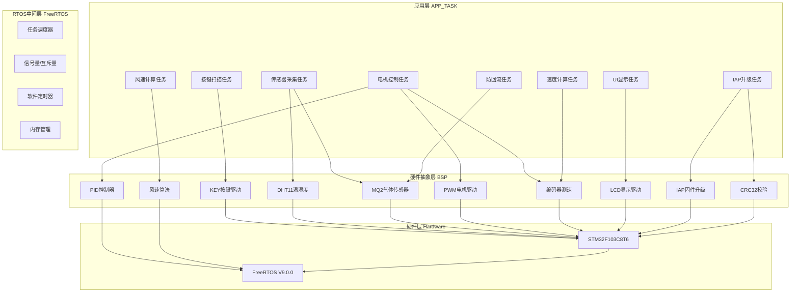
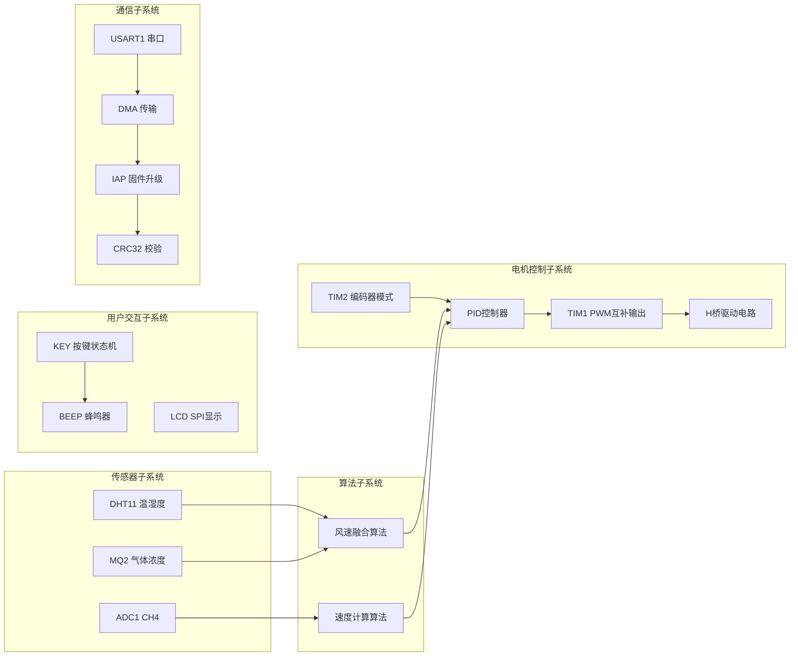
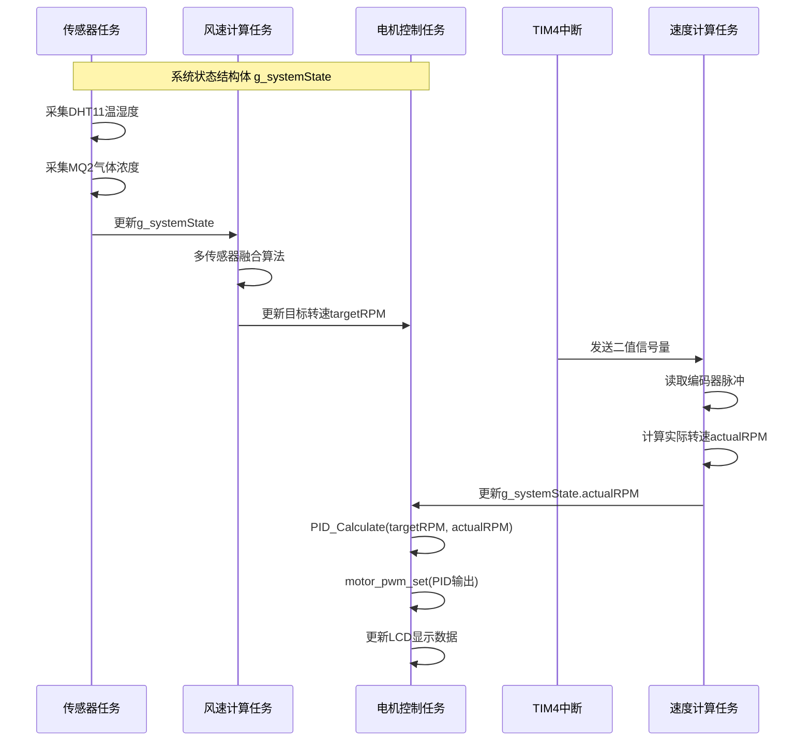

# 项目概述：STM32 + FreeRTOS 油烟机控制系统

<!-- WIKI_NAV_START -->
> [!info] RTOS Wiki 导航
> [[projects/RTOS项目/index|项目首页]] · [[1.2 快速入门：从零搭建开发环境并运行项目|下一篇：1.2 快速入门：从零搭建开发环境并运行项目 →]]
<!-- WIKI_NAV_END -->

> **实现状态（源码审计后）**：四种工作模式、电机控制、传感器采集、显示和测速代码已存在；IAP由 `ifopen` 控制且当前为 `0`，默认构建不会创建IAP任务或DMA接收链路。本文只把源码中能定位的行为视为“已实现”。

本文档用于建立系统的设计目标、核心架构和功能模块全局认知。

## 系统简介与设计目标

本项目基于 **STM32F103C8T6 + FreeRTOS V9.0.0**，通过多传感器融合和PID闭环算法控制风机转速。系统支持**四种工作模式**：待机、手动、自动和防回流。代码还提供Boot + APP单应用区IAP实验链路，但该功能默认关闭，只能在启用 `ifopen` 并匹配独立APP工程、链接地址和固件大小后使用。

代码体现的主要目标是：用FreeRTOS拆分不同周期的业务、用编码器和PID形成速度闭环、用状态机组织自动模式，并用CRC32验证可选IAP数据。工程目标芯片配置为64KB Flash、20KB RAM；源码没有提供“转速精度±5%”、看门狗保护或工业级认证的测试证据，因此不作此类结论。

Sources: `USER/main.c#L1-L23`, `APP_TASK/app_tasks.h#L1-L31`

## 系统架构总览

系统采用经典的**三层架构**设计，从下到上分别为：硬件抽象层（BSP）、RTOS中间层（FreeRTOS）、应用层（APP_TASK）。这种分层设计实现了**高内聚低耦合**的模块化结构，使得各层可以独立开发和测试。

三层架构的核心价值在于：**应用层专注业务逻辑**（如模式切换、状态机），**RTOS层提供并发保障**（任务调度、同步机制），**BSP层封装硬件细节**（时序协议、寄存器操作）。这种设计使得开发者可以专注于特定层的开发，而不必了解其他层的实现细节。

Sources: `USER/main.c#L29-L86`, `APP_TASK/app_tasks.c#L1-L30`

## 任务设计与调度策略

默认配置下，`StartTask` 是一次性启动任务，它创建**7个常驻业务任务**后删除自己；`iap_task` 是第8个候选业务任务，但因 `ifopen=0` 未编译。FreeRTOS还会创建Idle任务和Timer Service任务。任务间通过互斥量保护共享状态，通过二值信号量完成TIM4到测速任务的事件通知。

| 任务名称 | 优先级 | 栈大小 | 周期 | 主要职责 |
|---------|--------|--------|------|----------|
| 开始任务 | 1 | 64 | 一次性 | 创建其他任务后自删除 |
| 按键扫描任务 | 4 | 64 | 10ms | 按键消抖、事件检测、模式切换 |
| 传感器采集任务 | 3 | 128 | 500ms | 采集DHT11温湿度、MQ2气体浓度 |
| 风速计算任务 | 3 | 64 | 100ms | 多传感器融合计算目标PWM |
| 电机控制任务 | 5 | 256 | 50ms | PID闭环控制、PWM输出 |
| UI显示任务 | 1 | 256 | 200ms | LCD界面刷新、状态显示 |
| 防回流任务 | 2 | 64 | 100ms | 气体浓度超限保护 |
| 速度计算任务 | 6 | 128 | 1ms | 编码器脉冲计数、转速计算 |
| IAP升级任务 | 7 | 256 | 条件编译、事件驱动 | `ifopen=1` 时才创建 |

任务优先级设计的核心逻辑是：**速度计算任务（优先级6）最高**，因为它需要及时响应TIM4的1ms中断，确保编码器脉冲不丢失；**电机控制任务（优先级5）次高**，保证PID控制的实时性；**按键扫描任务（优先级4）**需要快速响应用户操作；**传感器和风速计算任务（优先级3）**属于周期性采集，对实时性要求适中；**防回流任务（优先级2）**作为安全保护机制，优先级低于控制任务；**UI显示任务（优先级1）**优先级最低，因为显示刷新不影响控制功能。

Sources: `APP_TASK/app_tasks.h#L76-L97`, `APP_TASK/app_tasks.c#L150-L192`

## 工作模式与状态机

系统定义了四种工作模式，每种模式对应不同的控制策略和用户交互方式。模式切换通过按键1短按实现，当前模式在LCD上实时显示。

| 模式 | 电机状态 | 控制策略 | 触发条件 | 特点 |
|------|----------|----------|----------|------|
| 待机模式 | 停止 | 无 | 默认状态 | 风机停止，但持续计算风速用于监测 |
| 手动模式 | 运行 | PID闭环 | 按键切换 | 两档调速（低档190RPM，高档220RPM） |
| 自动模式 | 运行 | 多传感器融合 | 按键切换 | 根据温湿度、气体浓度自动调节风速 |
| 防回流模式 | 强制运行 | 固定高速 | 气体浓度超阈值 | 安全保护，气体浓度降至阈值以下后退出 |

自动模式内部实现了一个**三阶段状态机**：启动阶段（等待60秒检测Cooking Event）、烹饪阶段（Cooking Event激活，根据传感器数据调节风速）、延时关闭阶段（烹饪结束后继续运行10秒排烟）。Cooking Event的判定条件为：**温度>26℃ 且 湿度>50% 且 气体浓度>100**，这三个条件同时满足才认为开始烹饪。

防回流模式采用**双阈值机制**：正常阈值（100.0f）用于检测气体泄漏，高阈值（2000.0f）用于防回流模式激活后的退出判断。当气体浓度从高阈值降至正常阈值以下时，系统自动退出防回流模式，恢复到之前的工作模式。

Sources: `APP_TASK/app_tasks.h#L25-L70`, `BSP/WIND/wind_speed.h#L45-L53`

## 硬件驱动模块概览

BSP（Board Support Package）层封装了所有硬件驱动，每个模块独立实现特定的硬件功能。这种设计使得硬件抽象层可以独立于应用层进行开发和测试。

**电机控制子系统**采用TIM1的PWM互补输出驱动H桥电路，实现电机正反转和调速；TIM2配置为编码器模式，实时测量电机转速；PID控制器根据目标转速和实际转速的误差计算PWM占空比。**传感器子系统**包括DHT11（单总线协议，测量温湿度）和MQ2（ADC采集，测量气体浓度），两者协同工作提供环境数据。**用户交互子系统**实现了按键状态机（支持短按、长按、释放检测）、LCD SPI显示（128×160像素）和蜂鸣器音频提示。**通信子系统**通过USART1+DMA实现高速串口通信，支持IAP固件升级，采用CRC32校验确保固件完整性。

Sources: `BSP/MOTOR/motor.h#L1-L42`, `BSP/PID/pid.h#L1-L60`, `BSP/DHT11/dht11.h#L1-L25`, `BSP/MQ2/mq2.h#L1-L31`

## 关键数据流与通信机制

系统运行过程中，数据在各个模块间流动，形成完整的控制回路。理解数据流是掌握系统工作原理的关键。

数据流的核心是全局状态 `g_systemState`。多数任务在成组读写时使用 `g_dataMutex`，但当前实现仍有未加锁访问（尤其AntiBackflowTask），因此它体现的是集中状态设计和部分互斥保护，而不是严格无竞争的数据模型。

**速度计算任务**与TIM4中断之间采用**二值信号量** `g_speedCalcSemaphore` 进行同步：TIM4每1ms触发一次中断，释放信号量；速度计算任务等待信号量，获取后立即读取编码器计数值并计算转速。这种设计确保了编码器脉冲的精确计数，避免了轮询方式的资源浪费。

Sources: `APP_TASK/app_tasks.c#L34-L37`, `APP_TASK/app_tasks.h#L43-L63`

## 目录结构与模块职责

项目采用**模块化目录结构**，每个目录对应一个功能模块，便于代码管理和团队协作。

| 目录 | 模块 | 主要文件 | 职责 |
|------|------|----------|------|
| `USER/` | 用户层 | main.c, main.h | 系统入口、硬件初始化、任务创建 |
| `APP_TASK/` | 应用层 | app_tasks.c, app_tasks.h | FreeRTOS任务实现、状态机逻辑 |
| `BSP/KEY/` | 按键驱动 | key.c, key.h | 按键状态机、消抖算法 |
| `BSP/DHT11/` | 温湿度传感器 | dht11.c, dht11.h | 单总线协议、数据采集 |
| `BSP/MQ2/` | 气体传感器 | mq2.c, mq2.h | ADC采集、浓度计算 |
| `BSP/MOTOR/` | 电机驱动 | motor.c, motor.h | PWM输出、编码器测速 |
| `BSP/PID/` | PID控制器 | pid.c, pid.h | 位置式PID算法 |
| `BSP/WIND/` | 风速算法 | wind_speed.c, wind_speed.h | 多传感器融合、PWM计算 |
| `BSP/LCD/` | LCD显示 | lcd.c, gui.c | SPI驱动、UI绘制 |
| `BSP/IAP/` | 固件升级 | iap.c, iap.h | Flash读写、程序跳转 |
| `BSP/DMA/` | DMA传输 | dma.c, dma.h | 串口DMA配置 |
| `BSP/CRC32/` | CRC校验 | crc32.c, crc32.h | 数据完整性验证 |
| `FreeRTOS/` | RTOS内核 | tasks.c, queue.c等 | 任务调度、同步机制 |
| `STM32F10x_FWLib/` | 标准外设库 | stm32f10x_*.c/h | STM32底层驱动 |
| `CORE/` | 核心文件 | core_cm3.c, startup_*.s | ARM内核、启动文件 |
| `SYSTEM/` | 系统服务 | delay.c, sys.c, usart.c | 延时、系统配置、串口 |

目录结构的设计遵循**高内聚低耦合**原则：每个BSP模块独立封装一个硬件功能，通过头文件对外提供接口；APP_TASK层依赖BSP层提供的接口实现业务逻辑；FreeRTOS层提供任务调度和同步机制，被APP_TASK层使用。

Sources: `.`, `USER/main.h#L23-L36`

## 开发环境与工具链

本项目使用 **Keil MDK-ARM** 作为集成开发环境，**J-Link** 作为调试器和烧录器。开发环境配置包括：编译器设置（ARM Compiler V5）、链接脚本配置（Flash起始地址0x08000000，大小64KB；RAM起始地址0x20000000，大小20KB）、调试配置（J-Link SWD接口）。

固件升级功能需要额外的工具支持：Python脚本 `add_crc32.py` 用于在APP固件末尾添加CRC32校验码，生成 `APP_crc.bin` 文件；串口调试工具用于发送固件文件。IAP功能通过条件编译宏 `ifopen` 控制，默认关闭以节省Flash空间。

Sources: `USER/main.c#L79-L81`, `tools/`

## 快速开始指引

如果你是第一次接触本项目，建议按照以下顺序学习：

1. **理解系统架构**：阅读本文档，建立全局认知；然后阅读[[2.1 三层架构：驱动层、RTOS中间层、应用层|三层架构：驱动层、RTOS中间层、应用层]]，深入理解分层设计。

2. **掌握启动流程**：阅读[[2.3 系统启动流程与初始化顺序|系统启动流程与初始化顺序]]，了解从上电到任务运行的完整过程。

3. **学习任务设计**：阅读[[3.2 任务创建、调度与优先级设计|任务创建、调度与优先级设计]]，理解FreeRTOS任务管理的核心概念。

4. **深入硬件驱动**：根据兴趣选择学习[[4.1.1 直流有刷电机驱动：H桥电路与PWM互补输出|直流有刷电机驱动：H桥电路与PWM互补输出]]或[[4.2.1 DHT11 温湿度传感器：单总线协议驱动|DHT11 温湿度传感器：单总线协议驱动]]。

5. **理解控制算法**：阅读[[4.1.3 PID闭环调速算法实现与调参|PID闭环调速算法实现与调参]]和[[4.2.3 多传感器融合风速算法|多传感器融合风速算法]]，掌握核心控制逻辑。

6. **学习高级功能**：阅读[[5.3 固件升级（IAP）：Boot + 单APP分区与串口DMA传输|固件升级（IAP）：Boot + APP分区与串口DMA传输]]，了解条件编译的实验性升级链路。

## 下一步学习

完成本文档阅读后，建议继续学习以下内容：

- [[1.2 快速入门：从零搭建开发环境并运行项目|快速入门：从零搭建开发环境并运行项目]] - 动手实践，搭建开发环境并运行第一个Demo
- [[2.1 三层架构：驱动层、RTOS中间层、应用层|三层架构：驱动层、RTOS中间层、应用层]] - 深入理解系统架构设计
- [[2.2 目录结构与模块职责划分|目录结构与模块职责划分]] - 了解代码组织方式

<!-- WIKI_FOOTER_START -->
---
> [!tip] 继续阅读
> [[projects/RTOS项目/index|项目首页]] · [[1.2 快速入门：从零搭建开发环境并运行项目|下一篇：1.2 快速入门：从零搭建开发环境并运行项目 →]]
<!-- WIKI_FOOTER_END -->
