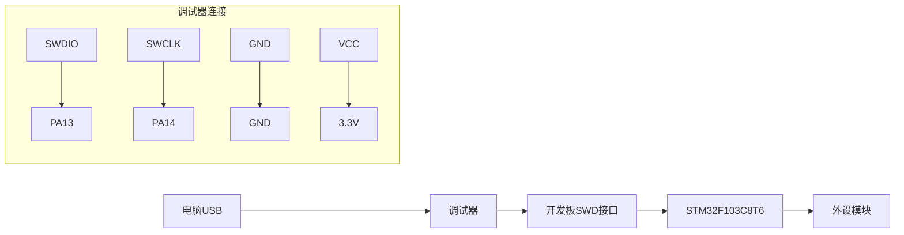

# 快速入门：从零搭建开发环境并运行项目

<!-- WIKI_NAV_START -->
> [!info] RTOS Wiki 导航
> [[projects/RTOS项目/index|项目首页]] · [[1.1 项目概述：STM32 + FreeRTOS 油烟机控制系统|← 上一篇：1.1 项目概述：STM32 + FreeRTOS 油烟机控制系统]] · [[1.3.1 Keil MDK 工程配置与编译|下一篇：1.3.1 Keil MDK 工程配置与编译 →]]
<!-- WIKI_NAV_END -->

本指南将引导您从零开始搭建STM32 + FreeRTOS油烟机控制系统的开发环境，并成功编译、烧录和运行项目。无论您是嵌入式开发新手还是有经验的开发者，都能通过本指南快速上手这个基于Cortex-M3的实时操作系统项目。

## 开发环境准备

### 硬件需求清单

开发此项目需要准备以下硬件设备：

| 硬件类型 | 具体型号/规格 | 用途说明 |
|---------|-------------|---------|
| 开发板 | STM32F103C8T6最小系统板 | 主控制器，Cortex-M3内核，72MHz主频 |
| 调试器 | J-Link或ST-Link | 程序烧录与在线调试 |
| 传感器模块 | DHT11温湿度传感器 | 温湿度数据采集 |
| 传感器模块 | MQ2气体传感器 | 烟雾/气体浓度检测 |
| 电机模块 | 直流有刷电机+H桥驱动 | 风机控制核心 |
| 显示模块 | SPI接口LCD显示屏 | 用户界面显示 |
| 输入设备 | 按键模块 | 用户交互输入 |
| 输出设备 | 蜂鸣器模块 | 声音提示功能 |

Sources: `USER/main.c#L29-L86`

### 软件工具链安装

开发环境基于Keil MDK-ARM，需要安装以下软件：

**1. Keil MDK-ARM V5.x**：集成开发环境，包含ARM编译器、调试器和工程管理器。本项目使用ARMCC V5.06编译器，支持Cortex-M3内核。

**2. STM32F1xx器件支持包**：从Keil官网下载`Keil.STM32F1xx_DFP`包，提供芯片头文件、启动文件和Flash算法。

**3. 驱动程序**：安装J-Link或ST-Link驱动程序，确保调试器能被Keil识别。

Sources: `USER/project.uvprojx#L338-L340`

## 工程结构解析

### 项目目录架构

本项目采用清晰的三层架构设计，目录结构如下：

```
项目根目录/
├── CORE/               → CMSIS核心文件 + 启动汇编（官方提供）
├── STM32F10x_FWLib/    → STM32标准库（官方提供，不用改）
├── FreeRTOS/           → FreeRTOS内核 + 移植层（官方提供，不用改）
├── SYSTEM/             → 串口、延时驱动（官方提供）
├── BSP/                → 硬件驱动（用户编写，每个外设独立.c/.h）
├── APP_TASK/           → 应用层任务（用户编写，业务逻辑核心）
├── USER/               → Keil工程 + main.c + 中断处理
├── OBJ/                → 编译输出（不要手动改）
└── tools/              → Python脚本 + 固件bin
```

Sources: `文件夹说明.txt#L1-L2`

### 核心文件功能说明

**用户编写的文件（面试重点）**：
- `BSP/MOTOR/motor.c/.h` → TIM1死区互补PWM + H桥驱动
- `BSP/PID/pid.c/.h` → 位置式PID控制器（Kp/Ki/Kd）
- `BSP/WIND/wind_speed.c/.h` → 多传感器融合风速算法
- `BSP/DHT11/dht11.c/.h` → DHT11温湿度（单总线模拟）
- `BSP/MQ2/mq2.c/.h` → MQ2气体传感器（ADC采集）
- `BSP/KEY/key.c/.h` → 按键状态机（消抖+长短按）
- `BSP/LCD/lcd.c/.h` → LCD显示驱动
- `APP_TASK/app_tasks.c/.h` → 7个默认常驻业务任务 + 1个可选IAP任务 + 系统状态中枢
- `USER/main.c` → 硬件初始化顺序 + 启动调度器

Sources: 

### Keil工程文件配置

工程文件`project.uvprojx`包含完整的项目配置：

**编译器设置**：
- 目标芯片：STM32F103C8
- CPU类型：Cortex-M3
- 时钟频率：72MHz
- 编译器：ARMCC V5.06

**预处理宏定义**：
```c
#define STM32F10X_MD,USE_STDPERIPH_DRIVER
```

**包含路径**：
```
..\SYSTEM\delay;..\SYSTEM\sys;..\SYSTEM\usart;..\USER;..\CORE;
..\STM32F10x_FWLib\inc;..\FreeRTOS\include;
..\FreeRTOS\portable\RVDS\ARM_CM3;..\BSP\BEEP;..\BSP\DHT11;
..\BSP\DMA;..\BSP\EXTI;..\BSP\IAP;..\BSP\KEY;..\BSP\LCD;
..\BSP\SPI;..\BSP\STMFLASH;..\BSP\MOTOR;..\BSP\GPIO;
```

**内存配置**：
- IROM：0x08000000，大小0x10000（64KB Flash）
- IRAM：0x20000000，大小0x5000（20KB RAM）

Sources: `USER/project.uvprojx#L338-L340`

## 编译与烧录流程

### 步骤一：打开工程

1. 启动Keil MDK-ARM
2. 选择`Project → Open Project`
3. 导航到`USER/project.uvprojx`文件并打开
4. 工程树将显示所有源文件分组

### 步骤二：配置工程选项

**1. 目标设备设置**：
- 点击`Project → Options for Target`
- 在`Device`选项卡选择`STM32F103C8`
- 确认`Pack`已安装`Keil.STM32F1xx_DFP`

**2. 编译器设置**：
- 在`C/C++`选项卡确认预处理宏：`STM32F10X_MD,USE_STDPERIPH_DRIVER`
- 包含路径已正确配置

**3. 调试器设置**：
- 在`Debug`选项卡选择调试器类型（J-Link或ST-Link）
- 勾选`Run to main()`选项
- 在`Utilities`选项卡配置Flash编程算法

### 步骤三：编译项目

1. 点击`Build`按钮（F7）或选择`Project → Build Target`
2. 观察输出窗口的编译信息
3. 确保0错误，0警告（或仅有可忽略警告）
4. 编译成功将在`OBJ/`目录生成`.hex`和`.axf`文件

### 步骤四：连接硬件

**硬件连接示意图**：


**连接步骤**：
1. 将调试器通过USB连接到电脑
2. 用杜邦线连接调试器与开发板的SWD接口
3. 确保开发板供电正常（3.3V或5V）
4. 检查调试器驱动是否正常安装

### 步骤五：烧录程序

**方法一：使用Keil烧录**：
1. 点击`Download`按钮（F8）或选择`Flash → Download`
2. 等待烧录完成，观察输出窗口的进度信息
3. 烧录成功后程序将自动运行

**方法二：使用J-Flash烧录**：
1. 打开J-Flash软件
2. 选择目标设备：STM32F103C8
3. 加载编译生成的`.hex`文件
4. 点击`Program`按钮烧录

### 步骤六：运行验证

**基本功能验证**：
1. 上电后LCD屏幕应显示"Init Complete!"
2. 按键1（PB1）短按可切换工作模式
3. 按键2（PB12）短按切换档位，长按开关风机
4. 蜂鸣器应有按键提示音

**调试功能验证**：
1. 连接串口调试助手（115200波特率）
2. 开启传感器调试：修改`sys.h`中`SENSOR_DEBUG`为1
3. 重新编译烧录，查看温湿度和气体浓度数据输出

Sources: `SYSTEM/sys/sys.h#L26-L27`

## 功能开关配置

项目提供多个功能开关，位于`SYSTEM/sys/sys.h`文件中：

| 宏定义 | 默认值 | 功能说明 |
|-------|--------|---------|
| `SYSTEM_SUPPORT_OS` | 1 | 系统支持OS，必须为1 |
| `DEBUG` | 0 | 调试功能开关 |
| `ifopen` | 0 | 固件升级功能开关 |
| `SENSOR_DEBUG` | 0 | 传感器数据调试开关 |

**启用固件升级功能**：
```c
#define ifopen 1  // 将0改为1启用IAP功能
```

**启用传感器调试**：
```c
#define SENSOR_DEBUG 1  // 启用后可查看传感器数据输出
```

Sources: `SYSTEM/sys/sys.h#L19-L35`

## FreeRTOS内核配置

FreeRTOS内核配置文件位于`FreeRTOS/include/FreeRTOSConfig.h`，关键配置项如下：

### 基础配置
```c
#define configUSE_PREEMPTION        1    // 抢占式内核
#define configCPU_CLOCK_HZ          (SystemCoreClock)  // 72MHz
#define configTICK_RATE_HZ          (1000)  // 1ms时钟节拍
#define configMAX_PRIORITIES        (32)   // 最大优先级
#define configMINIMAL_STACK_SIZE    ((unsigned short)130)  // 空闲任务栈
```

### 内存配置
```c
#define configSUPPORT_DYNAMIC_ALLOCATION  1  // 支持动态内存
#define configTOTAL_HEAP_SIZE            ((size_t)(10*1024))  // 10KB堆
```

### 中断配置
```c
#define configLIBRARY_LOWEST_INTERRUPT_PRIORITY      15
#define configLIBRARY_MAX_SYSCALL_INTERRUPT_PRIORITY 3
```

**中断优先级说明**：
- FreeRTOS可管理的最高中断优先级为3
- 优先级4-15的中断可以调用FreeRTOS API
- 优先级0-3的中断不能调用API，但能打断FreeRTOS

Sources: `FreeRTOS/include/FreeRTOSConfig.h#L89-L187`

## 启动流程解析

### 系统启动顺序

**1. 复位启动**：
- 上电或复位后，Cortex-M3从0x08000000读取初始栈指针
- 跳转到启动文件`startup_stm32f10x_md.s`的Reset_Handler

**2. 系统初始化**：
- 调用SystemInit()配置时钟系统（72MHz）
- 调用__main进行C库初始化和全局变量初始化

**3. 主函数入口**：
- 进入main()函数
- 执行Hardware_Init()硬件初始化
- 执行System_Init()系统状态初始化
- 创建StartTask并启动FreeRTOS调度器

### Hardware_Init初始化顺序

```c
NVIC分组4 → delay → TIM1 PWM → TIM2编码器 → 蜂鸣器 → 按键
→ MQ2 → PID → 风速算法 → LCD → 串口(必须最后) → DMA
```

**重要注意事项**：
- 串口初始化必须放在最后，否则会影响电机转动
- TIM4定时器在StartTask任务中初始化，避免信号量未创建时触发中断

Sources: `USER/main.c#L29-L86`

## 任务架构概览

### FreeRTOS任务结构

项目默认运行7个常驻业务任务；`StartTask`只在启动阶段存在，`iap_task`仅在 `ifopen=1` 时创建：

| 任务名称 | 优先级 | 栈大小 | 功能说明 |
|---------|--------|--------|---------|
| StartTask | 1 | 64字 | 启动任务，创建其他任务后自删除 |
| KeyScanTask | 4 | 64字 | 按键扫描，10ms周期 |
| SensorTask | 3 | 128字 | 传感器采集，500ms周期 |
| WindSpeedTask | 3 | 64字 | 风速计算，100ms周期 |
| MotorControlTask | 5 | 256字 | 电机控制，50ms周期 |
| UIDisplayTask | 1 | 256字 | UI显示，200ms周期 |
| AntiBackflowTask | 2 | 64字 | 防回流检测，100ms周期 |
| SpeedCalcTask | 6 | 128字 | 速度计算，1ms中断触发 |

Sources: `APP_TASK/app_tasks.h#L76-L97`

### 系统状态管理

任务通过全局状态 `g_systemState` 协作，多数成组访问使用 `g_dataMutex`；AntiBackflowTask仍有未加锁访问，详见任务通信页：

```c
typedef struct {
    WorkMode_t currentMode;         // 当前工作模式
    SpeedLevel_t speedLevel;        // 当前档位
    u8 motorRunning;                // 电机运行状态
    u8 temperature;                 // 温度值
    u8 humidity;                    // 湿度值
    float gasConcentration;         // 气体浓度
    float windSpeedPWM;             // 风速PWM值
    float actualRPM;                // 实际转速
    u16 targetRPM;                  // 目标转速
    u8 cookingEventActive;          // 烹饪事件标志
    u8 antiBackflowActive;          // 防回流标志
    float gasThreshold;             // 气体阈值
    u32 autoModeCounter;            // 自动模式计时器
    u32 cookingEventCounter;        // 烹饪事件计时器
} SystemState_t;
```

Sources: `APP_TASK/app_tasks.h#L43-L63`

## 常见问题排查

### 编译错误处理

**问题1：找不到头文件**
- 检查Keil工程包含路径是否正确
- 确认所有依赖的库文件都已添加到工程

**问题2：未定义符号**
- 检查是否遗漏源文件
- 确认预处理宏定义是否正确

### 运行时问题处理

**问题1：程序无法启动**
- 检查调试器连接
- 确认Flash算法配置正确
- 检查芯片供电是否正常

**问题2：外设不工作**
- 检查硬件连接
- 确认时钟配置
- 使用调试器检查寄存器状态

**问题3：FreeRTOS调度异常**
- 检查任务栈大小是否足够
- 确认中断优先级配置
- 启用栈溢出检测：`configCHECK_FOR_STACK_OVERFLOW`设为1或2

### 调试技巧

**1. 使用printf调试**：
- 启用串口调试：修改`DEBUG`宏为1
- 使用`printf()`输出关键变量值

**2. 使用Keil调试器**：
- 设置断点进行单步调试
- 使用Watch窗口监视变量
- 使用Memory窗口查看内存

**3. 逻辑分析仪调试**：
- 使用Keil的Logic Analyzer功能
- 监视GPIO输出波形
- 分析定时器中断时序

## 下一步学习建议

完成本快速入门后，建议按以下顺序深入学习：

1. **[[1.3.1 Keil MDK 工程配置与编译|Keil MDK 工程配置与编译]]** - 深入了解工程配置细节
2. **[[1.3.2 J-Link 调试器配置与烧录|J-Link 调试器配置与烧录]]** - 掌握高级调试技巧
3. **[[1.3.3 串口调试工具使用|串口调试工具使用]]** - 学习串口调试方法
4. **[[2.3 系统启动流程与初始化顺序|系统启动流程与初始化顺序]]** - 理解系统启动机制
5. **[[3.1 FreeRTOS 移植与配置详解|FreeRTOS 移植与配置详解]]** - 深入理解RTOS配置

<!-- WIKI_FOOTER_START -->
---
> [!tip] 继续阅读
> [[projects/RTOS项目/index|项目首页]] · [[1.1 项目概述：STM32 + FreeRTOS 油烟机控制系统|← 上一篇：1.1 项目概述：STM32 + FreeRTOS 油烟机控制系统]] · [[1.3.1 Keil MDK 工程配置与编译|下一篇：1.3.1 Keil MDK 工程配置与编译 →]]
<!-- WIKI_FOOTER_END -->
