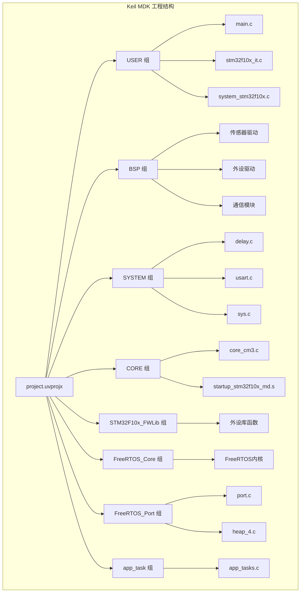
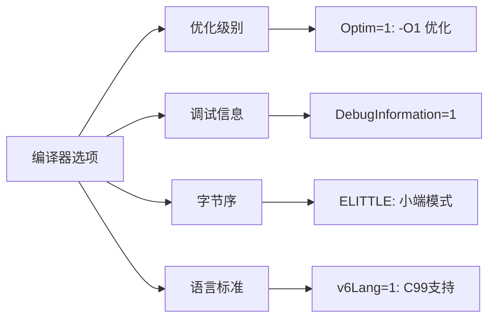
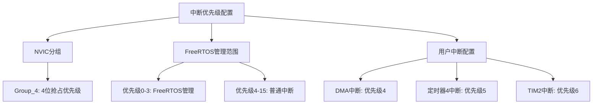
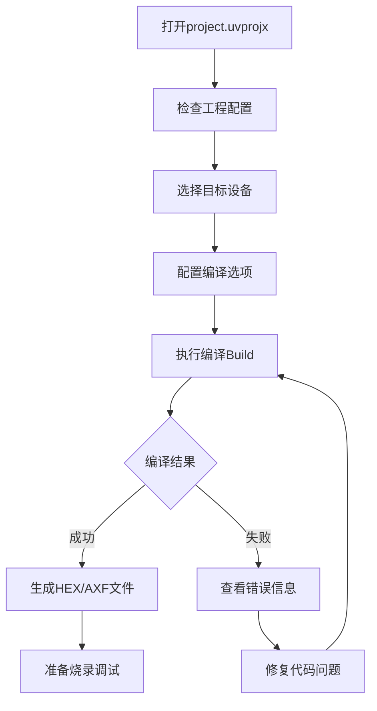

# Keil MDK 工程配置与编译

<!-- WIKI_NAV_START -->
> [!info] RTOS Wiki 导航
> [[projects/RTOS项目/index|项目首页]] · [[1.2 快速入门：从零搭建开发环境并运行项目|← 上一篇：1.2 快速入门：从零搭建开发环境并运行项目]] · [[1.3.2 J-Link 调试器配置与烧录|下一篇：1.3.2 J-Link 调试器配置与烧录 →]]
<!-- WIKI_NAV_END -->

本文档详细介绍STM32 + FreeRTOS油烟机控制系统的Keil MDK工程配置与编译过程，帮助开发者理解工程结构、编译选项和构建流程，为后续的开发调试奠定基础。

## 工程文件与项目结构

Keil MDK工程文件位于`USER/project.uvprojx`，采用uVision5格式。工程配置了ARMCC V5.06编译器，目标设备为**STM32F103C8**（Cortex-M3内核）。整个工程采用模块化分组管理，将源文件按功能职责划分为多个逻辑组。



Sources: `USER/project.uvprojx#L380-L636`

## 内存配置与地址映射

工程的内存配置直接关系到程序的运行效率和稳定性。本项目针对STM32F103C8的硬件特性，配置了精确的内存映射参数。

| 内存类型 | 起始地址 | 大小 | 用途说明 |
|---------|----------|------|----------|
| **IROM** | 0x08000000 | 0x10000 (64KB) | Flash存储区，存放程序代码和常量 |
| **IRAM** | 0x20000000 | 0x5000 (20KB) | SRAM存储区，存放变量和堆栈 |
| **Stack** | - | 0x400 (1KB) | 主堆栈空间，用于函数调用和中断 |
| **Heap** | - | 0x200 (512B) | 动态内存分配区域 |

**关键配置要点**：
- 启动文件选择`startup_stm32f10x_md.s`，适用于中等密度器件
- 链接器地址范围：Text=0x08000000，Data=0x20000000
- 输出格式选择Intel HEX（HexFormatSelection=1）

Sources: `USER/project.uvprojx#L21-L22`, `USER/project.uvprojx#L244-L253`, `CORE/startup_stm32f10x_md.s#L33-L48`

## 编译器选项与预处理配置

编译器配置是工程设置的核心部分，直接影响代码的优化程度、调试能力和兼容性。本项目使用ARMCC编译器，配置了特定的预处理宏和优化选项。

### 预定义宏配置

| 宏定义 | 作用说明 |
|--------|----------|
| **STM32F10X_MD** | 指定芯片型号为中等密度系列，启用对应的外设寄存器定义 |
| **USE_STDPERIPH_DRIVER** | 启用标准外设库驱动，使用库函数而非直接寄存器操作 |

### 编译优化选项



**编译选项详解**：
- **优化级别**：Optim=1（-O1），平衡代码大小和执行效率
- **调试信息**：启用，便于使用J-Link进行源码级调试
- **字节序**：小端模式（ELITTLE），与ARM Cortex-M3架构一致
- **语言标准**：支持C99标准，允许使用现代C语言特性

Sources: `USER/project.uvprojx#L338`, `USER/project.uvprojx#L314-L335`

## 头文件包含路径配置

正确的头文件路径配置是编译成功的关键。本项目采用相对路径引用，确保工程目录结构的可移植性。

### 包含路径列表

| 路径 | 模块说明 |
|------|----------|
| `..\SYSTEM\delay` | 延时函数模块 |
| `..\SYSTEM\sys` | 系统配置模块 |
| `..\SYSTEM\usart` | 串口通信模块 |
| `..\USER` | 用户主程序目录 |
| `..\CORE` | ARM内核文件和启动文件 |
| `..\STM32F10x_FWLib\inc` | STM32标准外设库头文件 |
| `..\FreeRTOS\include` | FreeRTOS内核头文件 |
| `..\FreeRTOS\portable\RVDS\ARM_CM3` | FreeRTOS Cortex-M3移植层 |
| `..\BSP\*` | 各硬件驱动模块（BEEP、DHT11、DMA等） |

**路径配置原则**：
1. 使用相对路径（`..`表示上级目录）增强工程可移植性
2. 每个功能模块独立目录，便于模块化管理和代码复用
3. BSP目录下按硬件外设类型细分，结构清晰

Sources: `USER/project.uvprojx#L340`

## 源文件分组与模块管理

工程采用分组管理策略，将源文件按功能职责组织到不同的逻辑组中，提高工程的可维护性和可读性。

### 文件分组结构表

| 分组名称 | 文件数量 | 主要文件 | 功能职责 |
|----------|----------|----------|----------|
| **USER** | 3 | main.c, stm32f10x_it.c, system_stm32f10x.c | 主程序、中断服务函数、系统初始化 |
| **BSP** | 15 | dht11.c, beep.c, motor.c, lcd.c等 | 硬件驱动层，各外设独立模块 |
| **SYSTEM** | 3 | sys.c, usart.c, delay.c | 系统级基础服务 |
| **CORE** | 2 | core_cm3.c, startup_stm32f10x_md.s | ARM内核支持和启动代码 |
| **STM32F10x_FWLib** | 11 | misc.c, stm32f10x_*.c | STM32标准外设库 |
| **FreeRTOS_Core** | 6 | tasks.c, queue.c, list.c等 | FreeRTOS内核模块 |
| **FreeRTOS_Port** | 2 | port.c, heap_4.c | FreeRTOS移植层和内存管理 |
| **app_task** | 1 | app_tasks.c | 应用层任务实现 |

**文件类型说明**：
- `.c`文件：C语言源文件（FileType=1）
- `.s`文件：汇编启动文件（FileType=2）
- `.h`文件：头文件，通过包含路径自动关联

Sources: `USER/project.uvprojx#L380-L636`

## 输出配置与编译产物

工程配置了编译输出目录和生成文件格式，便于后续的调试和烧录操作。

### 输出配置详情

| 配置项 | 设置值 | 说明 |
|--------|--------|------|
| **OutputDirectory** | `../OBJ/` | 编译输出目录，位于工程上级目录 |
| **OutputName** | PWM | 输出文件名前缀 |
| **CreateHexFile** | 1 | 生成HEX文件用于烧录 |
| **CreateExecutable** | 1 | 生成可执行ELF文件用于调试 |
| **DebugInformation** | 1 | 包含调试信息 |
| **BrowseInformation** | 1 | 生成浏览信息，支持代码导航 |

**编译产物清单**：
- `PWM.axf`：包含调试信息的可执行文件
- `PWM.hex`：Intel HEX格式烧录文件
- `PWM.map`：内存映射文件，分析内存使用情况
- 各种`.o`文件：目标文件（编译中间产物）

Sources: `USER/project.uvprojx#L51-L61`

## 工程清理与维护

项目提供了`keilkilll.bat`批处理脚本，用于清理Keil MDK编译过程中产生的临时文件，保持工程目录的整洁。

### 可清理文件类型

| 文件扩展名 | 文件类型 | 说明 |
|------------|----------|------|
| `.bak`, `.ddk`, `.edk` | 备份文件 | Keil自动备份文件 |
| `.lst`, `.lnp` | 列表文件 | 编译列表和链接参数 |
| `.obj`, `.o` | 目标文件 | 编译生成的中间目标文件 |
| `.axf` | 可执行文件 | 调试用可执行文件 |
| `.map` | 映射文件 | 内存映射信息 |
| `.dep`, `.crf` | 依赖文件 | 编译依赖关系文件 |
| `.htm`, `.iex` | 报告文件 | 编译报告和错误信息 |

**清理脚本使用方法**：
```batch
# 双击运行或在命令行执行
keilkilll.bat
```

**注意事项**：
- 脚本会递归删除所有子目录中的临时文件
- 保留`.opt`文件（J-Link设置文件）
- 清理后需重新编译生成可执行文件

Sources: `keilkilll.bat#L1-L28`

## FreeRTOS内核配置要点

FreeRTOS的配置通过`FreeRTOSConfig.h`文件实现，该文件位于`FreeRTOS/include/`目录下。配置参数直接影响RTOS的调度行为和资源使用。

### 关键配置参数

| 配置宏 | 设置值 | 功能说明 |
|--------|--------|----------|
| **configUSE_PREEMPTION** | 1 | 启用抢占式调度，高优先级任务可抢占低优先级任务 |
| **configCPU_CLOCK_HZ** | SystemCoreClock | CPU时钟频率，运行时获取实际值 |
| **configTICK_RATE_HZ** | 1000 | 系统节拍频率1kHz，即1ms时钟粒度 |
| **configMAX_PRIORITIES** | 32 | 最大优先级数量，支持32级优先级 |
| **configMINIMAL_STACK_SIZE** | 130 | 空闲任务堆栈大小（单位：字） |
| **configTOTAL_HEAP_SIZE** | 10*1024 | FreeRTOS堆总大小10KB |
| **configLIBRARY_MAX_SYSCALL_INTERRUPT_PRIORITY** | 3 | 可调用API的最高中断优先级 |

### 中断优先级配置



**中断配置原则**：
- NVIC分组设为Group_4，4位抢占优先级，0位子优先级
- FreeRTOS可管理的中断优先级范围：0-3
- 用户中断优先级必须≥4，避免干扰RTOS调度

Sources: `FreeRTOS/include/FreeRTOSConfig.h#L89-L195`

## 编译流程与常见问题

### 标准编译流程



### 常见编译问题排查

| 问题现象 | 可能原因 | 解决方案 |
|----------|----------|----------|
| **头文件找不到** | 包含路径配置错误 | 检查IncludePath配置，确保路径正确 |
| **未定义符号** | 源文件未添加到工程 | 将缺失的.c文件添加到对应分组 |
| **内存溢出** | 代码超出Flash容量 | 优化代码或启用编译优化选项 |
| **堆栈溢出** | Stack/Heap配置过小 | 增大启动文件中的堆栈配置 |
| **FreeRTOS启动失败** | 堆内存不足 | 调整configTOTAL_HEAP_SIZE参数 |

### 编译优化建议

1. **代码大小优化**：启用`OneElfS=1`，将所有代码放入单个ELF段
2. **调试效率**：开发阶段保持`DebugInformation=1`，发布时可关闭
3. **编译速度**：启用`interw=1`进行增量编译
4. **警告处理**：设置`wLevel=0`显示所有警告，及时修复潜在问题

Sources: `USER/project.uvprojx#L312-L342`

## 下一步学习建议

完成Keil MDK工程配置后，建议按照以下顺序继续学习：

1. **[[1.3.2 J-Link 调试器配置与烧录|J-Link 调试器配置与烧录]]**：配置硬件调试器，实现程序下载和在线调试
2. **[[1.3.3 串口调试工具使用|串口调试工具使用]]**：掌握串口通信调试方法
3. **[[2.3 系统启动流程与初始化顺序|系统启动流程与初始化顺序]]**：深入理解从上电到main函数的完整启动过程

通过系统掌握工程配置，您将能够高效地进行后续的驱动开发和RTOS任务调试工作。

<!-- WIKI_FOOTER_START -->
---
> [!tip] 继续阅读
> [[projects/RTOS项目/index|项目首页]] · [[1.2 快速入门：从零搭建开发环境并运行项目|← 上一篇：1.2 快速入门：从零搭建开发环境并运行项目]] · [[1.3.2 J-Link 调试器配置与烧录|下一篇：1.3.2 J-Link 调试器配置与烧录 →]]
<!-- WIKI_FOOTER_END -->
