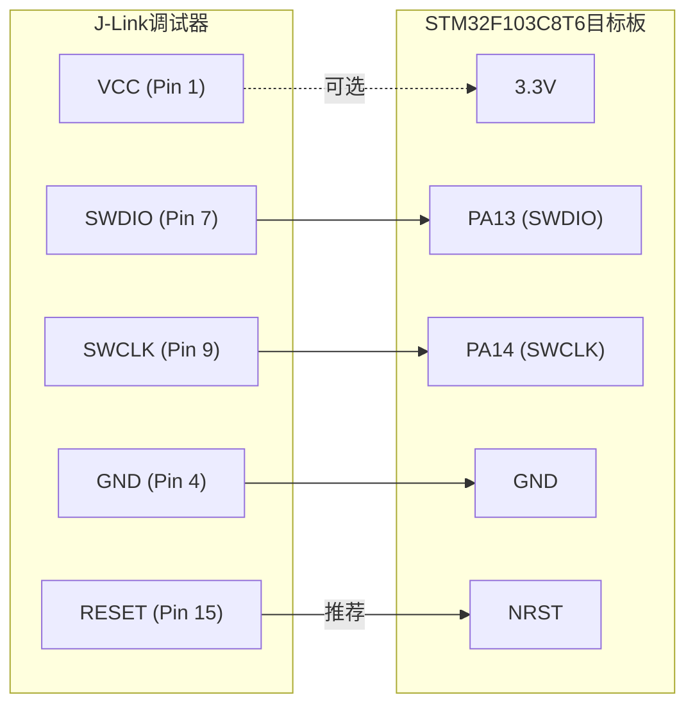
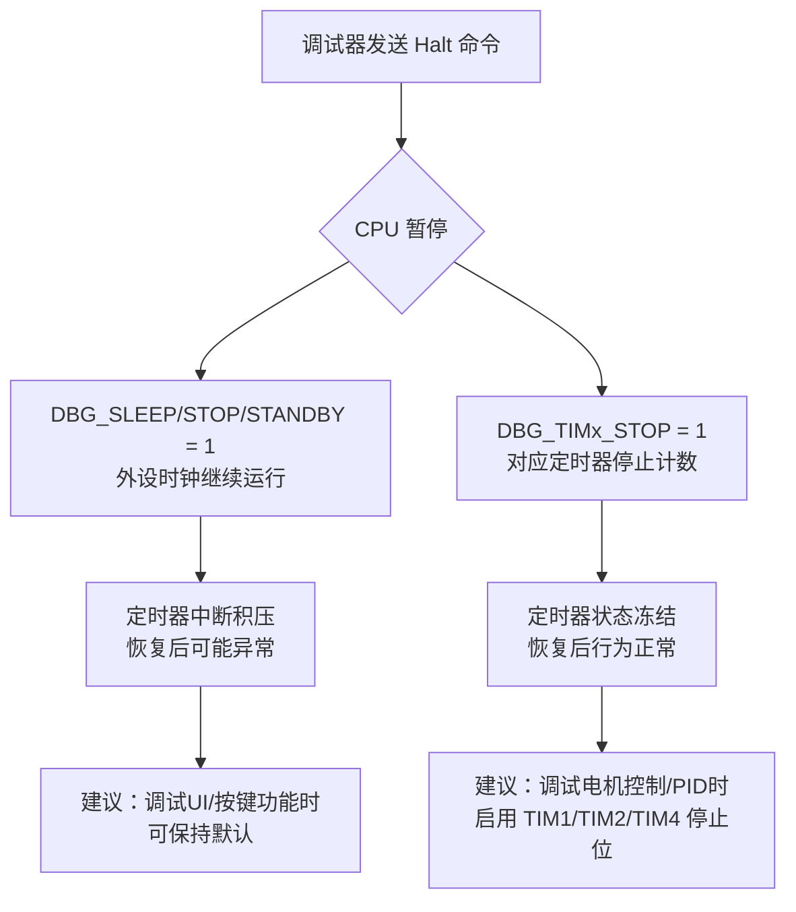
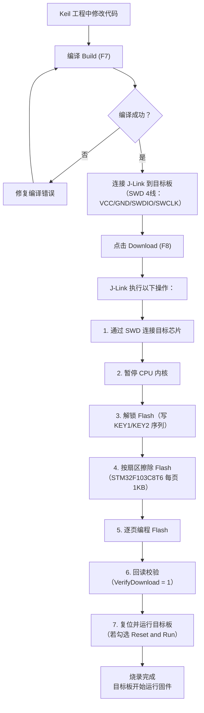

# J-Link 调试器配置与烧录

<!-- WIKI_NAV_START -->
> [!info] RTOS Wiki 导航
> [[projects/RTOS项目/index|项目首页]] · [[1.3.1 Keil MDK 工程配置与编译|← 上一篇：1.3.1 Keil MDK 工程配置与编译]] · [[1.3.3 串口调试工具使用|下一篇：1.3.3 串口调试工具使用 →]]
<!-- WIKI_NAV_END -->

> **实现状态（源码审计后）**：当前Keil工程链接到 `0x08000000` 并覆盖64KB IROM；仓库没有附带链接到 `0x0800F000` 的独立APP工程。涉及APP区调试的步骤是条件性指导，执行前必须核对实际工程与MAP文件。

本文档说明J-Link SWD连接、Keil调试器配置、固件烧录及Boot + 单APP地址规划下的注意事项。

## 硬件连接：J-Link 与 STM32F103 的 SWD 接口

本项目使用 **SWD（Serial Wire Debug）** 两线调试接口连接 J-Link 与 STM32F103C8T6。SWD 相比 JTAG 只需 2 根信号线（SWDIO + SWCLK），加上 VCC 和 GND 共 4 线即可完成调试与烧录。对于引脚资源有限的 STM32F103C8T6（48 脚封装），SWD 是最常用的调试方式。

**接线对应关系：**

| J-Link 引脚 | 信号名 | STM32F103C8T6 引脚 | 说明 |
|:---:|:---:|:---:|:---|
| Pin 1 | VCC | 3.3V | 目标板供电参考（可选，若目标板独立供电则无需连接） |
| Pin 7 | SWDIO | PA13 | 双向数据线，用于调试数据传输 |
| Pin 9 | SWCLK | PA14 | 时钟信号，由 J-Link 驱动 |
| Pin 4 | GND | GND | 共地，必须连接 |
| Pin 15 | RESET | NRST | 复位线（可选但强烈推荐，用于连接后复位目标板） |

> **关键提示**：SWDIO（PA13）和 SWCLK（PA14）是 STM32 的专用调试引脚，上电后默认即为调试功能，无需额外 GPIO 配置。但如果在代码中将 PA13/PA14 重新配置为普通 GPIO 输出，调试连接将立即断开。本项目中未对这两个引脚进行复用，因此调试连接不会受到影响。

此外，J-Link 还提供 **SWO（Serial Wire Output）** 引脚（对应 STM32 的 PB3），可用于输出 `printf` 重定向的调试信息或 RTOS 任务状态追踪（需配合 J-Link RTT 或 SWO Viewer 使用）。本项目当前未启用 SWO 功能。



Sources: `USER/project.uvprojx#L17-L21`

## Keil MDK 工程中的调试器配置

在 Keil MDK 中打开 `USER/project.uvprojx` 工程后，需要在 **Options for Target** 对话框中完成调试器的配置。配置分为两个核心环节：**Debug 选项卡**（调试器选择与初始化脚本）和 **Utilities 选项卡**（Flash 下载设置）。

### Debug 选项卡配置

在 **Project → Options for Target → Debug** 选项卡中，右半部分用于选择硬件调试器：

1. 在下拉列表中选择 **"J-LINK / J-TRACE Cortex"**，这表示使用 SEGGER J-Link 作为调试探针
2. 点击右侧的 **"Settings"** 按钮，进入 J-Link 接口设置
3. 在弹出的 **Cortex JLink/JTrace Driver Setup** 对话框中：
   - **Port**：选择 **SWD**（默认即为 SWD，也可手动切换 JTAG）
   - **Max Clock**：可选择 **Auto** 或手动设置为 **4 MHz**（SWD 最高可达 12 MHz，但 4 MHz 在大多数场景下足够稳定）
   - **Connect & Reset Options**：建议将 **Connect** 设为 **Normal**，**Reset** 设为 **Reset via SYSRESETREQ**

> **重要说明**：IAP代码把APP地址设为 `0x0800F000`，但当前工程仍从 `0x08000000` 链接。只有另建并正确重定位APP工程后，才适用这里的APP区调试步骤。

Sources: `USER/project.uvprojx#L24`, `BSP/IAP/iap.h#L18`

### Utilities 选项卡配置（Flash 下载）

在 **Project → Options for Target → Utilities** 选项卡中，配置 Flash 编程算法：

1. 选择 **"Use Target Driver for Flash Programming"**，并确认下拉列表选择的是 **J-LINK / J-TRACE Cortex**
2. 点击 **"Settings"** 进入 Flash 下载设置：
   - 在 **Programming Algorithm** 列表中添加正确的 Flash 算法文件
   - 对于 STM32F103C8T6（64KB Flash），应选择 **`STM32F10x_128.FLM`**（该算法覆盖 128KB 以内的 STM32F10x 系列）
   - **Download Function** 区域中勾选 **"Erase Full Chip"** 或 **"Erase Sectors"**（按需擦除）
   - 勾选 **"Reset and Run"** 可在烧录完成后自动复位运行

**Flash 下载关键参数（来自工程文件的配置）：**

| 参数 | 值 | 说明 |
|:---|:---|:---|
| Flash 驱动 | `UL2CM3` | Keil 通用 Cortex-M3 Flash 编程接口 |
| Flash 算法 | `STM32F10x_128.FLM` | 支持 STM32F10x 128KB 及以下 Flash |
| Flash 起始地址 | `0x08000000` | STM32 Flash 映射基地址 |
| Flash 大小 | `0x10000`（64KB） | STM32F103C8T6 的 Flash 容量 |
| RAM 起始地址 | `0x20000000` | STM32 SRAM 基地址 |
| RAM 大小 | `0x5000`（20KB） | STM32F103C8T6 的 SRAM 容量 |

> **地址规划注意**：当前IROM范围是 `0x08000000, 0x10000`。如果未来建立从 `0x0800F000` 链接的独立APP工程，应单独配置下载范围和向量表，并避免整片擦除。具体限制见[[5.3 固件升级（IAP）：Boot + 单APP分区与串口DMA传输|IAP页面]]。

Sources: `USER/project.uvprojx#L22-L25`

## JLinkSettings.ini 配置详解

J-Link 调试器在首次连接目标设备后会自动生成 `JLinkSettings.ini` 配置文件。本项目中该文件位于 `USER/JLinkSettings.ini`，包含了断点行为、Flash 编程、CPU 仿真、SWO 输出以及内存访问的配置。以下是各节配置的详细说明：

### 断点配置（BREAKPOINTS）

```ini
[BREAKPOINTS]
ForceImpTypeAny = 0     ; 0=自动选择断点类型（硬件/软件）
ShowInfoWin = 1          ; 1=断点命中时显示信息窗口
EnableFlashBP = 2        ; 2=启用Flash断点（无限Flash BP）
BPDuringExecution = 0    ; 0=不在CPU运行时设置断点
```

**`EnableFlashBP = 2`** 是一个关键设置：STM32F103C8T6 有 4 个硬件断点寄存器（FPB），超过 4 个断点时 J-Link 会自动使用 Flash 断点（在 Flash 中插入 `BKPT` 指令）。设置为 `2` 表示允许这种机制，使断点数量不受硬件限制。但 Flash 断点会修改 Flash 内容，调试结束移除断点后需要重新烧录原始固件。在 FreeRTOS 多任务调试中，经常需要同时在多个任务函数中设置断点，此配置可以避免硬件断点不足的问题。

> **FreeRTOS 调试建议**：在包含多个任务（如 `KeyScanTask`、`SensorTask`、`MotorControlTask`、`SpeedCalcTask`、`UIDisplayTask`、`iap_task`）的工程中调试时，4 个硬件断点常常不够用。`EnableFlashBP = 2` 配合 J-Link 的 Flash 断点功能可以显著提升调试效率。

Sources: `USER/JLinkSettings.ini#L1-L5`

### Flash 编程配置（FLASH）

```ini
[FLASH]
CacheExcludeSize = 0x00       ; 不排除任何缓存区域
CacheExcludeAddr = 0x00
MinNumBytesFlashDL = 0        ; 最小下载字节数（0=无限制）
SkipProgOnCRCMatch = 1        ; 1=若Flash内容与CRC匹配则跳过编程（加速烧录）
VerifyDownload = 1            ; 1=下载后自动校验
AllowCaching = 1              ; 1=允许Flash内容缓存（加速读取）
EnableFlashDL = 2             ; 2=启用Flash下载
Override = 0                  ; 0=不覆盖默认Flash设置
Device = "UNSPECIFIED"        ; 设备名由Keil工程指定，此处无需设置
```

**`SkipProgOnCRCMatch = 1`** 对于开发迭代非常有用：J-Link 在编程前会先读取 Flash 中已有内容并计算 CRC，若与待烧录数据一致则跳过该扇区的擦写操作。这在频繁编译-烧录-调试的循环中可以节省大量时间，尤其是在代码未修改的扇区（如标准库函数所在的扇区）。

**`VerifyDownload = 1`** 确保烧录完成后自动执行一次回读校验，防止因 Flash 损坏或接触不良导致的烧录不完整。

Sources: `USER/JLinkSettings.ini#L13-L22`

### CPU 与内存配置

```ini
[CPU]
OverrideMemMap = 0       ; 0=不覆盖内存映射（使用芯片默认映射）
AllowSimulation = 1      ; 1=允许CPU仿真模式（用于无目标板的调试）
ScriptFile = ""          ; 无自定义J-Link脚本

[GENERAL]
WorkRAMSize = 0x00       ; 工作RAM大小（0=使用默认值）
WorkRAMAddr = 0x00       ; 工作RAM地址
RAMUsageLimit = 0x00     ; RAM使用限制

[MEM]
RdOverrideOrMask = 0x00
RdOverrideAndMask = 0xFFFFFFFF
RdOverrideAddr = 0xFFFFFFFF
WrOverrideOrMask = 0x00
WrOverrideAndMask = 0xFFFFFFFF
WrOverrideAddr = 0xFFFFFFFF
```

`[MEM]` 节用于在读写内存时插入掩码操作，通常保持默认值即可。在极少数场景下（如需要模拟特定外设寄存器行为），可以通过这些掩码修改读写结果。

Sources: `USER/JLinkSettings.ini#L9-L11`, `USER/JLinkSettings.ini#L29-L35`

### SWO 配置

```ini
[SWO]
SWOLogFile = ""     ; SWO日志输出文件路径（空=不记录到文件）
```

SWO（Serial Wire Output）是 ARM CoreSight 提供的单向数据输出通道，可以通过 `ITM_SendChar()` 函数输出调试信息，也可以用于 FreeRTOS 的任务运行时间统计和状态追踪。若需启用 SWO，在 Keil 的 Debug → J-Link Settings → SWO 选项中配置时钟频率（需与 `SystemCoreClock` 一致，本项目为 72MHz）。

Sources: `USER/JLinkSettings.ini#L28`

## 调试 MCU 配置（DBGMCU_CR）

本项目的调试配置文件 `USER/DebugConfig/PWM_STM32F103ZE_1.0.0.dbgconf` 定义了 STM32 的 **DBGMCU_CR（调试 MCU 控制寄存器）** 的初始值。该寄存器决定了当 CPU 处于调试暂停状态时，各外设时钟是否继续运行。

**当前配置值：**

```c
DbgMCU_CR = 0x00000007;  // 即 bit0=1, bit1=1, bit2=1
```

对应的三个核心调试位：

| 位域 | 位 | 名称 | 含义 | 当前值 |
|:---:|:---:|:---|:---|:---:|
| bit0 | DBG_SLEEP | 调试睡眠模式 | 设为 1：CPU 暂停时 HCLK 保持运行 | ✅ 启用 |
| bit1 | DBG_STOP | 调试停止模式 | 设为 1：CPU 暂停时内部 RC 振荡器保持运行 | ✅ 启用 |
| bit2 | DBG_STANDBY | 调试待机模式 | 设为 1：CPU 暂停时数字部分保持供电 | ✅ 启用 |
| bit8 | DBG_IWDG_STOP | 看门狗暂停 | 设为 0：CPU 暂停时独立看门狗继续计数 | ❌ 未启用 |
| bit9 | DBG_WWDG_STOP | 窗口看门狗暂停 | 设为 0：CPU 暂停时窗口看门狗继续计数 | ❌ 未启用 |

**对 FreeRTOS 调试的实际影响：**

当在 Keil 中点击"暂停"打断点时，CPU 进入调试暂停状态。此时如果外设定时器仍在运行，恢复执行后定时器中断会积压大量未处理的中断请求，可能导致：
- **SysTick 继续运行**：FreeRTOS 的 Tick 计数持续增长，`vTaskDelay()` 等延时函数可能在恢复后立即超时
- **TIM4 继续运行**：速度计算信号量被不断释放，`SpeedCalcTask` 恢复后可能处理大量积压事件

**建议优化**：若调试时频繁遇到"暂停恢复后系统行为异常"的问题，可以将 `DBGMCU_CR` 中对应的定时器停止位启用。例如，若需要在暂停时停止 TIM4，可设置 `bit17`（`DBG_TIM4_STOP`）。但注意，本项目中 FreeRTOS 使用 SysTick 作为系统节拍源，停止 SysTick 可能导致调度器状态混乱，建议仅在调试非实时功能时启用。



Sources: `USER/DebugConfig/PWM_STM32F103ZE_1.0.0.dbgconf#L96`

## 烧录流程：从编译到运行

在 Keil MDK 中完成代码编写后，烧录到目标板的完整流程如下：



**烧录时的 Flash 擦除策略选择：**

| 策略 | Keil 选项 | 适用场景 | 注意事项 |
|:---|:---|:---|:---|
| 整片擦除 | "Erase Full Chip" | 首次烧录或需要完全清除旧固件 | 若使用Boot + 单APP规划，会同时擦除Boot范围，需谨慎 |
| 按扇区擦除 | "Erase Sectors Needed" | 仅擦除被修改的扇区 | 推荐日常开发使用，保护 Bootloader 区不被意外擦除 |
| 不擦除 | "Do not Erase" | 仅追加编程（非常规场景） | Flash 必须已被擦除（0xFF 状态）才能写入 |

> **IAP地址提醒**：代码为Boot预留 `0x08000000 ~ 0x0800EFFF`，APP从 `0x0800F000` 开始；这表示预留范围，不代表Boot实际占满60KB。调试独立APP时应只擦除所需页。

Sources: `USER/project.uvprojx#L22-L25`, `BSP/IAP/iap.h#L18`, `BSP/STMFLASH/stmflash.c`

## 调试操作：断点、变量监视与 FreeRTOS 感知调试

### 基本调试操作

在 Keil MDK 中通过 **Debug → Start/Stop Debug Session (Ctrl+F5)** 启动调试会话。J-Link 会连接目标板并暂停在 `main()` 函数入口处。常用调试功能：

| 操作 | 快捷键 | 说明 |
|:---|:---|:---|
| 设置/取消断点 | F9 | 在代码行左侧点击或按 F9 |
| 全速运行 | F5 | 从当前 PC 位置继续执行 |
| 单步执行（步入） | F11 | 进入函数内部 |
| 单步执行（步过） | F10 | 跳过函数调用 |
| 运行到光标处 | Ctrl+F10 | 执行到当前光标位置 |
| 查看变量值 | 鼠标悬停 | 在 Watch 窗口或直接悬停查看 |
| 查看外设寄存器 | Peripherals 菜单 | 实时查看 GPIO、TIM、USART 等寄存器状态 |

### FreeRTOS 任务感知调试

Keil MDK + J-Link 支持 FreeRTOS 感知调试（RTOS Task Awareness），可以在调试时查看各任务的状态、栈使用情况和切换历史。启用步骤：

1. 在 Keil 中进入 **Debug → OS Support → System and Thread Viewer**
2. 确保 `FreeRTOSConfig.h` 中启用了以下配置（本项目已启用）：
   - `configUSE_TRACE_FACILITY = 1`
   - `configUSE_STATS_FORMATTING_FUNCTIONS = 1`

启用后，调试器会显示类似以下的任务信息：

| 任务名 | 优先级 | 状态 | 栈剩余 | 说明 |
|:---|:---:|:---|:---:|:---|
| `KeyScanTask` | 中等 | Blocked | 充足 | 等待按键扫描周期 |
| `SensorTask` | 中低 | Blocked | 充足 | 等待 500ms 采集周期 |
| `SpeedCalcTask` | 高 | Blocked | 充足 | 等待信号量 |
| `MotorControlTask` | 高 | Blocked | 充足 | 等待 50ms 控制周期 |
| `UIDisplayTask` | 低 | Running | 充足 | LCD 刷新中 |
| `iap_task` | 最低 | Suspended | 充足 | 未收到升级命令，挂起 |
| `Tmr Svc` | 最高 | Blocked | 充足 | 软件定时器服务任务 |
| `IDLE` | 0 | Running | 充足 | 空闲任务 |

> **调试提示**：当需要调试某个特定任务时，可以在该任务的入口函数或关键代码行设置断点。由于本项目使用抢占式调度（`configUSE_PREEMPTION = 1`），高优先级任务会抢占低优先级任务，因此在高优先级任务中设断点可能会阻塞低优先级任务的执行。调试 UI 显示等低优先级功能时，可以临时降低其他任务的优先级或暂停调度器。

Sources: `FreeRTOS/include/FreeRTOSConfig.h#L133-L136`, `FreeRTOS/include/FreeRTOSConfig.h#L89`

## 常见问题排查

在使用 J-Link 调试和烧录过程中，可能遇到以下典型问题及解决方案：

| 问题现象 | 可能原因 | 解决方案 |
|:---|:---|:---|
| **"No device found" 或无法连接** | SWD 接线错误；目标板未供电；BOOT0 引脚被拉高导致进入 ISP 模式 | 检查 SWDIO/SWCLK 接线；确认目标板 3.3V 供电正常；将 BOOT0 拉低到 GND |
| **"Could not stop Cortex-M device"** | 芯片处于低功耗模式（STOP/STANDBY）且 DBGMCU 未配置；看门狗不断复位 | 确认 DBGMCU_CR 的 DBG_SLEEP/DBG_STOP 位已启用；检查是否开启了独立看门狗 IWDG |
| **Flash Download Failed - Target DLL has been cancelled** | Flash 算法不匹配；Flash 被写保护 | 确认选择了正确的 Flash 算法 `STM32F10x_128.FLM`；通过 J-Link Commander 执行 `Unlock STM32` |
| **烧录成功但程序不运行** | 向量表偏移未配置；APP 未设置正确的起始地址 | 确认 `system_stm32f10x.c` 中 `SCB->VTOR` 设置正确；检查启动文件中堆栈指针初始化 |
| **调试时断点不起作用** | 硬件断点已用完（4 个 FPB）；代码在 RAM 中执行 | 检查 JLinkSettings.ini 中 `EnableFlashBP = 2`；减少不必要的断点数量 |
| **暂停恢复后任务行为异常** | 外设定时器在暂停期间继续运行，中断积压 | 在 DBGMCU_CR 中启用对应定时器的停止位（如 `DBG_TIM4_STOP`） |
| **烧录时擦除了 Bootloader** | 选择了 "Erase Full Chip" | 改为 "Erase Sectors Needed"，或在 Flash 下载设置中手动配置擦除范围，排除 Bootloader 区域 |
| **J-Link 驱动版本不兼容** | J-Link 驱动版本过旧，不支持目标芯片 | 更新 SEGGER J-Link 软件包至最新版本（建议 v7.0 以上） |

> **快速诊断方法**：打开 SEGGER J-Link Commander（`JLink.exe`），输入以下命令快速排查：
> - `connect` → 输入设备型号 `STM32F103C8` → 选择接口 `SWD` → 选择速度 `4000`
> - 如果连接成功，输入 `mem 0x08000000 4` 读取 Flash 起始 4 字节，正常应返回栈顶地址（`0x2000xxxx` 格式）
> - 输入 `erase` 可执行整片擦除，`r` 复位，`g` 运行

Sources: `USER/JLinkSettings.ini#L1-L36`, `USER/DebugConfig/PWM_STM32F103ZE_1.0.0.dbgconf#L1-L97`

## 串口烧录方式（ISP 模式）

除 J-Link SWD 烧录外，STM32F103 还支持通过内置 Bootloader 进行串口 ISP 烧录。当 J-Link 不可用或需要在产线批量烧录时，这是一种替代方案：

**进入 ISP 模式的条件：**
1. 将 BOOT0 引脚拉高至 VCC（3.3V）
2. 将 BOOT1（PB2）引脚拉低至 GND
3. 复位 MCU

**ISP 烧录工具：** 使用 ST 官方的 **STM32 Flash Loader Demonstrator** 或开源的 **stm32flash** 工具，通过 USART1（PA9-TX, PA10-RX）连接 PC 进行烧录。

> **注意**：串口 ISP 烧录与本项目的 IAP 串口升级使用相同的 USART1 外设，但协议不同。ISP 模式使用 ST 自定义的Bootloader协议，而本项目的IAP使用固定长度DMA接收约定（详见 [[5.3 固件升级（IAP）：Boot + 单APP分区与串口DMA传输|Boot + 单APP分区与串口DMA传输]]）。

Sources: `BSP/IAP/iap.h#L18`, `BSP/IAP/iap.c#L44-L62`

## 延伸阅读

在完成 J-Link 调试器配置后，建议按以下顺序继续学习：

- **[[1.3.1 Keil MDK 工程配置与编译|Keil MDK 工程配置与编译]]**：了解工程的编译选项、头文件路径和链接脚本设置，这些直接影响烧录的固件内容
- **[[1.3.3 串口调试工具使用|串口调试工具使用]]**：掌握串口打印调试方法，作为 J-Link 断点调试的补充手段
- **[[projects/RTOS项目/6 调试与优化/6.1 嵌入式调试技巧与故障排查方法|嵌入式调试技巧与故障排查方法]]**：系统学习 HardFault 诊断、堆栈溢出检测等进阶调试技术
- **[[projects/RTOS项目/6 调试与优化/6.2 HardFault异常诊断与堆栈溢出检测|HardFault异常诊断与堆栈溢出检测]]**：深入理解异常处理机制与调试定位方法
- **[[projects/RTOS项目/6 调试与优化/6.3 FreeRTOS任务状态监控与性能分析|FreeRTOS任务状态监控与性能分析]]**：利用 J-Link 的 SWO 功能和 FreeRTOS 感知调试进行任务性能分析

<!-- WIKI_FOOTER_START -->
---
> [!tip] 继续阅读
> [[projects/RTOS项目/index|项目首页]] · [[1.3.1 Keil MDK 工程配置与编译|← 上一篇：1.3.1 Keil MDK 工程配置与编译]] · [[1.3.3 串口调试工具使用|下一篇：1.3.3 串口调试工具使用 →]]
<!-- WIKI_FOOTER_END -->
