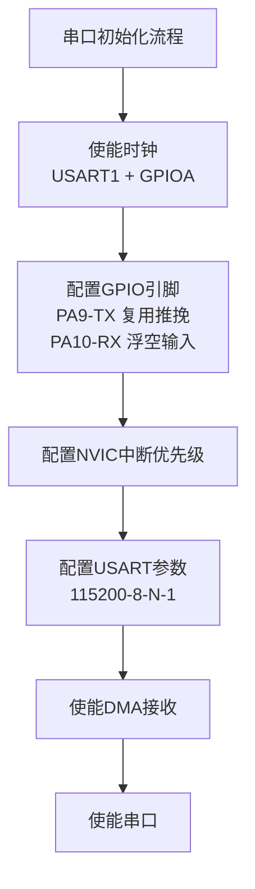
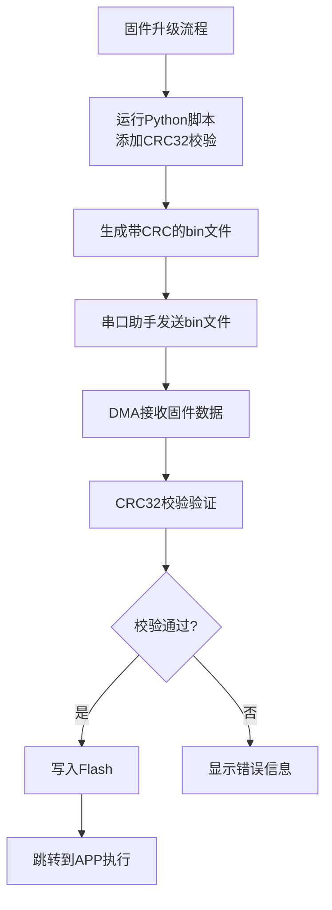

# 串口调试工具使用

<!-- WIKI_NAV_START -->
> [!info] RTOS Wiki 导航
> [[projects/RTOS项目/index|项目首页]] · [[1.3.2 J-Link 调试器配置与烧录|← 上一篇：1.3.2 J-Link 调试器配置与烧录]] · [[2.1 三层架构：驱动层、RTOS中间层、应用层|下一篇：2.1 三层架构：驱动层、RTOS中间层、应用层 →]]
<!-- WIKI_NAV_END -->

串口调试工具是嵌入式开发中不可或缺的调试手段，本项目通过USART1实现串口通信，支持printf重定向输出调试信息，并用于固件升级功能。本文档将详细介绍串口调试工具的配置、使用方法以及在固件升级中的应用。

## 串口硬件配置与初始化

项目采用STM32F103C8T6的USART1作为串口调试接口，配置为115200波特率、8位数据位、无奇偶校验、1个停止位。串口初始化代码位于`SYSTEM/usart/usart.c`文件中，采用DMA接收模式而非中断接收模式。



Sources: `SYSTEM/usart/usart.c#L71-L116`

串口初始化函数`uart_init(u32 bound)`的关键配置包括：

1. **时钟使能**：使能USART1和GPIOA的时钟
2. **GPIO配置**：PA9配置为复用推挽输出（TX），PA10配置为浮空输入（RX）
3. **NVIC配置**：设置USART1中断抢占优先级为3，子优先级为3
4. **USART配置**：波特率115200，8位数据，1位停止，无校验，无硬件流控制，收发模式
5. **DMA配置**：使能USART1的DMA接收功能

Sources: `SYSTEM/usart/usart.c#L78-L114`

## 串口调试输出配置

项目通过重定向`fputc`函数实现printf输出到串口的功能。在`SYSTEM/usart/usart.c`文件中，重写了`fputc`函数，将字符通过USART1发送。

```c
// 重定义fputc函数 
int fputc(int ch, FILE *f)
{      
    while((USART1->SR&0X40)==0);//循环发送,直到发送完毕   
    USART1->DR = (u8) ch;      
    return ch;
}
```

Sources: `SYSTEM/usart/usart.c#L35-L40`

调试输出通过`DEBUG`宏开关控制，在`SYSTEM/sys/sys.h`文件中定义：

```c
/*调试宏开关,0关闭调试功能,1打开*/
#define DEBUG	                0
```

当`DEBUG`设置为1时，项目中的`printf`语句会输出调试信息到串口助手。在应用层任务中，使用`#if DEBUG`条件编译来控制调试输出。

Sources: `SYSTEM/sys/sys.h#L21`

## 串口调试助手使用步骤

### 硬件连接
使用USB转TTL模块连接STM32的USART1接口：
- USB转TTL的TX连接STM32的PA10（RX）
- USB转TTL的RX连接STM32的PA9（TX）
- USB转TTL的GND连接STM32的GND

### 串口助手配置
推荐使用SSCOM、XCOM或串口调试助手等工具，配置参数如下：
- **端口号**：选择对应的COM端口（设备管理器查看）
- **波特率**：115200
- **数据位**：8
- **停止位**：1
- **校验位**：无
- **流控制**：无

### 调试信息查看
开启调试功能后，串口助手将显示以下调试信息：
- 系统初始化状态
- 传感器数据（温度、湿度、气体浓度）
- 电机运行状态（转速、PWM值）
- 工作模式切换信息
- 固件升级进度

Sources: `APP_TASK/app_tasks.c#L609-L611`

## 固件升级串口使用

项目采用串口+DMA方式接收固件文件，实现IAP（In-Application Programming）固件升级功能。固件升级流程如下：



### 固件预处理
使用`tools/add_crc32.py`脚本为原始固件添加CRC32校验码：

```bash
python add_crc32.py app.bin
```

脚本会生成`app_crc.bin`文件，该文件包含原始固件数据和4字节的CRC32校验值。

Sources: `tools/add_crc32.py#L19-L62`

### 固件发送
在串口助手中，使用"发送文件"功能发送`app_crc.bin`文件。发送时需要注意：
- 确保串口助手配置正确（115200-8-N-1）
- 发送完成后等待系统处理
- 观察LCD屏幕显示的升级进度

### 升级过程监控
升级过程中，系统会通过LCD屏幕显示状态信息：
- "Firmware updating!" - 正在升级
- "update completed" - 升级完成
- "excute app" - 执行APP
- "CRC32 Error!" - CRC校验失败

当`DEBUG`宏开启时，还会通过串口输出详细的调试信息。

Sources: `APP_TASK/app_tasks.c#L617-L628`

## DMA接收配置

项目使用DMA1通道5进行串口接收，配置代码位于`BSP/DMA/dma.c`文件中。DMA配置实现了高效的固件数据接收，无需CPU频繁中断。

```c
// DMA配置参数
DMA_InitStructure.DMA_PeripheralBaseAddr = (u32)&USART1->DR;  // 串口数据寄存器地址
DMA_InitStructure.DMA_MemoryBaseAddr = (u32)receive_buff;     // 接收缓冲区地址
DMA_InitStructure.DMA_DIR = DMA_DIR_PeripheralSRC;            // 外设到内存
DMA_InitStructure.DMA_BufferSize = buff_size;                 // 缓冲区大小
DMA_InitStructure.DMA_Mode = DMA_Mode_Normal;                 // 正常模式
DMA_InitStructure.DMA_Priority = DMA_Priority_High;           // 高优先级
```

DMA接收完成中断会释放信号量，通知IAP任务处理接收到的固件数据。

Sources: `BSP/DMA/dma.c#L20-L52`

## 调试信息输出示例

项目中的调试信息通过条件编译控制，以下是一些典型的调试输出示例：

### 固件升级调试信息
```c
#if DEBUG
    printf("CRC32 verify passed!\r\n");
    printf("firmware updated complete!\r\n");
    printf("firmware execution started!\r\n");
#endif
```

### DMA接收调试信息
```c
#if DEBUG
    printf("CNDTR: %d\n", DMA_GetCurrDataCounter(DMA1_Channel5));
#endif
```

### 系统状态调试信息
在应用层任务中，可以根据需要添加更多调试输出，用于监控系统运行状态。

Sources: `APP_TASK/app_tasks.c#L609-L611`

## 常见问题与解决方案

### 串口无输出
**可能原因**：
- 硬件连接错误（TX/RX接反）
- 波特率配置不匹配
- DEBUG宏设置为0
- 串口驱动未安装

**解决方案**：
1. 检查硬件连接，确保TX-RX交叉连接
2. 确认串口助手波特率设置为115200
3. 将`SYSTEM/sys/sys.h`中的`DEBUG`宏设置为1
4. 安装CH340/CP2102等USB转串口驱动

### 固件升级失败
**可能原因**：
- 固件文件未添加CRC32校验
- 串口助手发送文件格式错误
- 缓冲区大小不足
- Flash空间不足

**解决方案**：
1. 使用`add_crc32.py`脚本处理固件文件
2. 使用串口助手的"发送文件"功能，而非粘贴文本
3. 检查`buff_size`宏定义是否与固件大小匹配
4. 确认Flash空间足够（APP区从0x0800F000开始）

### 数据接收不完整
**可能原因**：
- DMA缓冲区溢出
- 串口助手发送速度过快
- 系统处理不及时

**解决方案**：
1. 增大`buff_size`宏定义值
2. 降低串口助手发送速度
3. 检查DMA中断优先级配置

Sources: `SYSTEM/sys/sys.h#L29-L33`

## 调试技巧与最佳实践

### 分段调试
在开发过程中，建议先关闭固件升级功能（`ifopen`宏设为0），专注于系统功能调试。待系统稳定后再开启固件升级功能。

### 日志分级
建议在调试代码中使用不同级别的日志输出：
```c
#define LOG_INFO(fmt, ...)    printf("[INFO] " fmt "\r\n", ##__VA_ARGS__)
#define LOG_ERROR(fmt, ...)   printf("[ERROR] " fmt "\r\n", ##__VA_ARGS__)
#define LOG_DEBUG(fmt, ...)   printf("[DEBUG] " fmt "\r\n", ##__VA_ARGS__)
```

### 性能监控
通过串口输出关键性能指标：
- 任务执行时间
- 中断响应时间
- 内存使用情况
- CPU占用率

### 安全注意事项
- 调试完成后关闭DEBUG宏，避免影响系统性能
- 固件升级前备份重要数据
- 确保固件文件来源可靠，避免损坏系统

## 串口调试工具选择

### Windows平台
- **SSCOM**：功能强大，支持多种协议
- **XCOM**：界面简洁，易于使用
- **串口调试助手**：轻量级，适合快速调试

### Linux平台
- **minicom**：命令行工具，功能全面
- **picocom**：轻量级，易于配置
- **gtkterm**：图形界面，操作简单

### 跨平台工具
- **PuTTY**：支持串口、SSH等多种协议
- **CoolTerm**：图形界面，功能丰富
- **Arduino IDE串口监视器**：适合Arduino开发

## 与其他调试工具的配合

### 与J-Link调试器配合
串口调试可以与J-Link调试器配合使用：
- J-Link用于断点调试、变量监视
- 串口用于输出调试信息、固件升级
- 两者互不干扰，可同时使用

### 与LCD显示配合
项目中的LCD显示与串口输出形成互补：
- LCD显示实时状态（无需连接电脑）
- 串口输出详细调试信息（需要连接电脑）
- 两者结合提供完整的调试信息

### 与逻辑分析仪配合
对于时序敏感的调试，可以配合逻辑分析仪：
- 逻辑分析仪捕获串口波形
- 分析通信时序和数据完整性
- 验证波特率、数据位等配置

## 扩展应用场景

### 远程调试
通过WiFi模块（如ESP8266）将串口数据转发到网络，实现远程调试：
- 实时监控设备状态
- 远程固件升级
- 多设备集中管理

### 数据记录
将串口数据记录到SD卡或Flash中：
- 记录系统运行日志
- 分析长期运行稳定性
- 故障追溯和分析

### 自动化测试
编写脚本自动发送测试命令，验证系统功能：
- 自动发送固件升级
- 自动验证系统响应
- 批量测试设备功能

## 总结

串口调试工具在STM32+FreeRTOS油烟机控制系统中发挥着重要作用，不仅用于日常调试信息输出，还支持固件升级功能。通过合理配置和使用，可以大大提高开发效率，确保系统稳定运行。

关键要点：
1. 串口配置为115200-8-N-1，使用DMA接收模式
2. 通过`DEBUG`宏控制调试输出
3. 固件升级需要先使用Python脚本添加CRC32校验
4. 串口调试与J-Link、LCD等工具配合使用效果更佳

<!-- WIKI_FOOTER_START -->
---
> [!tip] 继续阅读
> [[projects/RTOS项目/index|项目首页]] · [[1.3.2 J-Link 调试器配置与烧录|← 上一篇：1.3.2 J-Link 调试器配置与烧录]] · [[2.1 三层架构：驱动层、RTOS中间层、应用层|下一篇：2.1 三层架构：驱动层、RTOS中间层、应用层 →]]
<!-- WIKI_FOOTER_END -->
