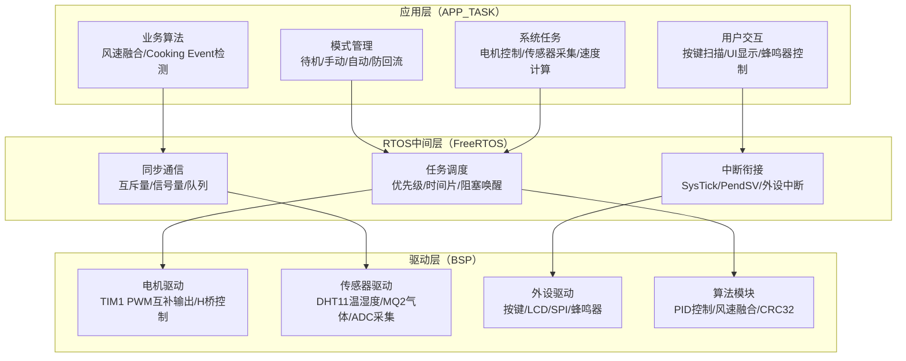
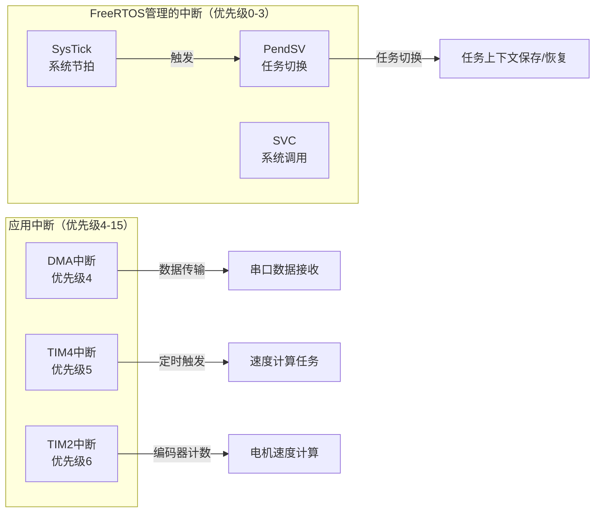
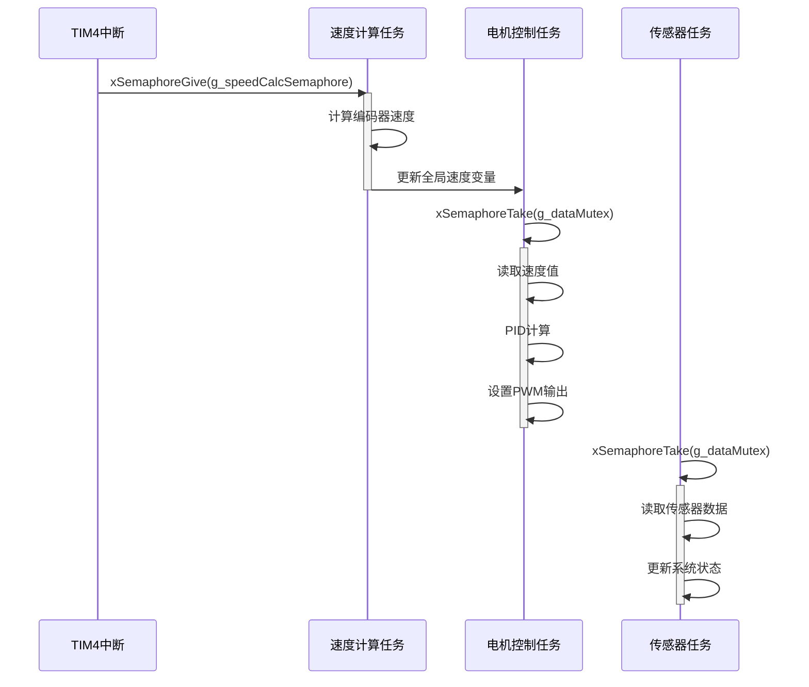
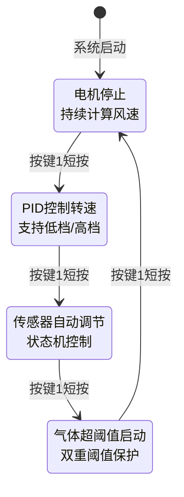
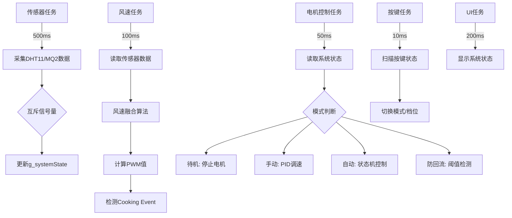
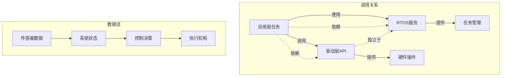
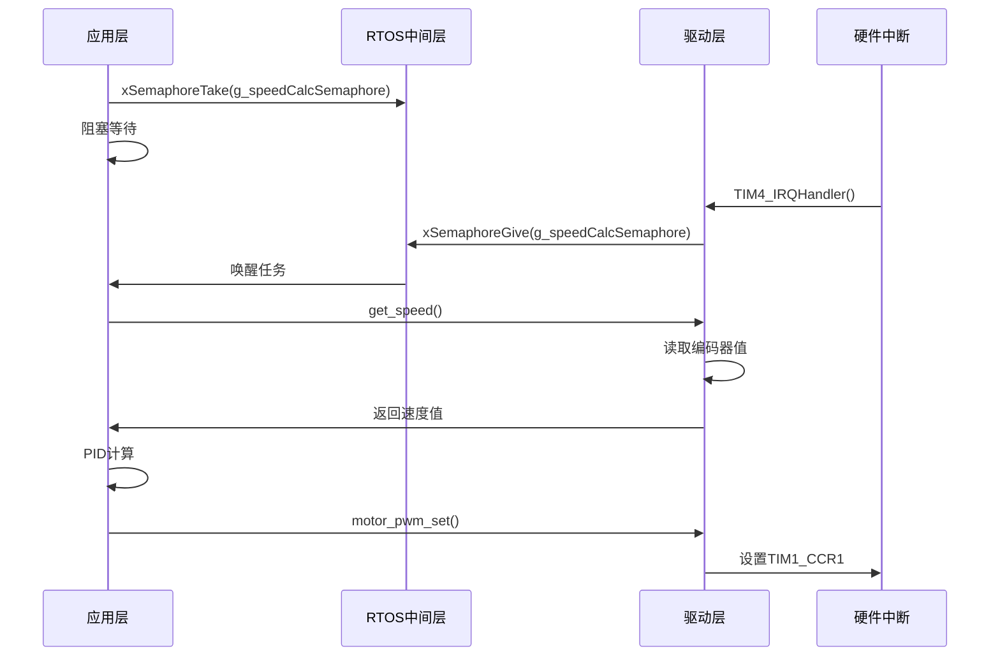

# 三层架构：驱动层、RTOS中间层、应用层

<!-- WIKI_NAV_START -->
> [!info] RTOS Wiki 导航
> [[projects/RTOS项目/index|项目首页]] · [[1.3.3 串口调试工具使用|← 上一篇：1.3.3 串口调试工具使用]] · [[2.2 目录结构与模块职责划分|下一篇：2.2 目录结构与模块职责划分 →]]
<!-- WIKI_NAV_END -->

> **实现状态（源码审计后）**：本页描述当前目录中的BSP、FreeRTOS和APP_TASK分层；IAP相关任务和同步对象默认被条件编译关闭。任务数量统一按“7个默认常驻业务任务 + 1个可选IAP任务”表述。

本页面阐述油烟机控制系统的三层架构，解析驱动层、RTOS中间层和应用层的职责、接口及协作机制。

## 三层架构概览

本项目采用经典的三层架构模式，将系统划分为**驱动层（BSP）**、**RTOS中间层（FreeRTOS）** 和 **应用层（APP_TASK）**。每一层都有明确的职责边界，通过标准化接口进行通信。



**Sources: **

## 驱动层（BSP）：硬件抽象与标准化接口

驱动层位于BSP（Board Support Package）目录，封装所有硬件操作细节，为上层提供**设备无关**的API接口。这种设计使得更换硬件平台时，只需修改驱动层实现，而应用层代码无需改动。

### 驱动层模块分类

| 模块类别 | 目录位置 | 核心功能 | 关键接口示例 |
|----------|----------|----------|--------------|
| **电机控制** | `BSP/MOTOR/` | TIM1 PWM互补输出、H桥驱动、编码器测速 | `motor_start()`, `motor_pwm_set()`, `get_speed()` |
| **传感器驱动** | `BSP/DHT11/`, `BSP/MQ2/` | 温湿度采集、气体浓度检测、ADC转换 | `DHT_Read_Data()`, `MQ2_GetGasConcentration()` |
| **用户交互** | `BSP/KEY/`, `BSP/LCD/`, `BSP/BEEP/` | 按键状态机、SPI LCD显示、蜂鸣器控制 | `Key_Scan()`, `LCD_Clear()`, `Buzzer_Beep()` |
| **算法模块** | `BSP/PID/`, `BSP/WIND/`, `BSP/CRC32/` | PID闭环控制、风速融合算法、数据校验 | `PID_Calculate()`, `WindSpeed_Update()`, `CRC32_Verify()` |
| **通信接口** | `BSP/DMA/`, `BSP/USART/`, `BSP/SPI/` | DMA传输、串口通信、SPI总线 | `MYDMA_Config()`, `uart_init()`, `SPI_Init()` |
| **存储管理** | `BSP/STMFLASH/`, `BSP/IAP/` | Flash读写、Boot + 单APP地址规划 | `STMFLASH_Write()`, `iap_load_app()` |

**Sources: `BSP/MOTOR/motor.h#L1-L43`**

### 驱动层设计原则

1. **硬件封装**：每个驱动模块封装特定硬件的所有操作，如电机驱动封装了TIM1的PWM配置、死区设置、H桥控制逻辑。

2. **接口标准化**：提供统一的函数命名规范，如初始化函数统一为 `XXX_Init()`，数据获取函数统一为 `XXX_GetData()`。

3. **配置分离**：硬件参数（引脚、时钟、定时器）在头文件中定义宏，便于硬件变更时的配置调整。

4. **中断服务分离**：驱动层只提供底层中断处理函数，中断与RTOS的衔接由中间层负责。

```mermaid
classDiagram
    class Motor_Driver {
        +TIM1_dead_pwm_init()
        +motor_start()
        +motor_stop()
        +motor_pwm_set()
        +get_speed()
    }
    
    class Sensor_Driver {
        +DHT_Read_Data()
        +MQ2_GetGasConcentration()
        +WindSpeed_Update()
    }
    
    class UI_Driver {
        +Key_Scan()
        +LCD_Clear()
        +Show_Str()
        +Buzzer_Beep()
    }
    
    class Algorithm_Module {
        +PID_Calculate()
        +WindSpeed_GetPWM()
        +CRC32_Verify()
    }
    
    Motor_Driver --> "硬件定时器" : TIM1
    Sensor_Driver --> "硬件ADC" : ADC1_CH4
    UI_Driver --> "硬件GPIO" : GPIOB
    Algorithm_Module --> "数学运算" : 浮点计算
```

**Sources: `BSP/PID/pid.h#L1-L67`**

## RTOS中间层（FreeRTOS）：任务调度与同步机制

RTOS中间层基于FreeRTOS实时操作系统，提供任务管理、同步通信、内存管理等核心服务。它连接驱动层与应用层，确保多任务系统的实时性和可靠性。

### FreeRTOS核心配置

系统通过 `FreeRTOSConfig.h` 进行精细配置，关键参数如下：

| 配置项 | 设置值 | 作用说明 |
|--------|--------|----------|
| `configUSE_PREEMPTION` | 1 | 启用抢占式调度，高优先级任务立即执行 |
| `configCPU_CLOCK_HZ` | 72MHz | STM32F103主频 |
| `configTICK_RATE_HZ` | 1000 | 1ms时钟节拍，提供精确时间基准 |
| `configMAX_PRIORITIES` | 32 | 支持32级优先级 |
| `configTOTAL_HEAP_SIZE` | 10KB | FreeRTOS堆内存大小 |
| `configLIBRARY_MAX_SYSCALL_INTERRUPT_PRIORITY` | 3 | FreeRTOS可管理的最高中断优先级 |

**Sources: `FreeRTOS/include/FreeRTOSConfig.h#L1-L197`**

### 中断优先级与RTOS协同

系统采用4位优先级分组（`NVIC_PriorityGroup_4`），FreeRTOS内核管理优先级0-3的中断，优先级4-15的中断不受RTOS管理。



**Sources: `USER/main.c#L30-L40`**

### 同步通信机制

系统使用三种主要的同步通信机制：

1. **互斥信号量（Mutex）**：保护共享数据 `g_systemState`，防止多任务同时访问导致的数据不一致。

2. **二值信号量（Binary Semaphore）**：用于任务间事件通知，如TIM4中断通过信号量触发速度计算任务。

3. **队列（Queue）**：虽然本项目未使用队列，但FreeRTOS配置中启用了队列支持，为功能扩展预留。



**Sources: `APP_TASK/app_tasks.c#L30-L50`**

## 应用层（APP_TASK）：业务逻辑与任务调度

应用层是系统的核心，负责实现具体的业务逻辑。它调用驱动层API，通过RTOS中间层进行任务管理和同步，实现油烟机的各项功能。

### 任务架构设计

`StartTask`创建7个默认常驻业务任务后自删除；IAP任务为条件编译候选任务：

| 任务名称 | 优先级 | 周期 | 核心职责 | 关键调用 |
|----------|--------|------|----------|----------|
| **StartTask** | 1 | 一次性 | 创建其他任务，初始化系统 | `xTaskCreate()` |
| **KeyScanTask** | 4 | 10ms | 按键扫描、模式切换、档位切换 | `Key_Scan()`, `System_SwitchMode()` |
| **SensorTask** | 3 | 500ms | 采集DHT11和MQ2传感器数据 | `DHT_Read_Data()`, `MQ2_GetGasConcentration()` |
| **WindSpeedTask** | 3 | 100ms | 风速融合算法、Cooking Event检测 | `WindSpeed_Update()`, `WindSpeed_IsCookingEvent()` |
| **MotorControlTask** | 5 | 50ms | 电机控制、PID调节、模式状态机 | `PID_Calculate()`, `motor_pwm_set()` |
| **UIDisplayTask** | 1 | 200ms | LCD显示更新、状态信息展示 | `Show_Str()`, `LCD_Clear()` |
| **AntiBackflowTask** | 2 | 100ms | 防回流模式检测、气体浓度阈值管理 | 读取 `g_systemState.gasConcentration` |
| **SpeedCalcTask** | 6 | TIM4每1ms通知 | 读取编码器；`get_speed(...,50)`每约50ms形成一次原始速度样本 | `get_encoder_value()`, `get_speed()` |
| **iap_task（可选）** | 7 | DMA事件触发 | CRC校验、Flash写入和跳转 | 仅 `ifopen=1` 时创建 |

**Sources: `APP_TASK/app_tasks.h#L70-L90`**

### 系统状态管理

应用层通过 `SystemState_t` 集中管理状态，多数任务使用互斥量读取或更新快照，但当前代码仍存在未加锁访问：

```c
typedef struct {
    WorkMode_t currentMode;         // 当前工作模式
    SpeedLevel_t speedLevel;        // 当前档位
    u8 motorRunning;                // 电机运行状态
    u8 temperature;                 // 温度值
    u8 humidity;                    // 湿度值
    float gasConcentration;         // 气体浓度值
    float windSpeedPWM;             // 风速PWM值(%)
    float actualRPM;                // 实际转速
    u16 targetRPM;                  // 目标转速
    u8 cookingEventActive;          // Cooking Event激活标志
    u8 antiBackflowActive;          // 防回流激活标志
    // ... 其他状态字段
} SystemState_t;
```

**Sources: `APP_TASK/app_tasks.h#L45-L75`**

### 模式状态机实现

电机控制任务实现了复杂的模式状态机，支持四种工作模式：



**Sources: `APP_TASK/app_tasks.c#L350-L450`**

### 任务间数据流

应用层任务间通过共享数据和同步机制进行协作，形成完整的数据流：



**Sources: `APP_TASK/app_tasks.c#L250-L350`**

## 三层架构的交互关系

### 调用链分析

三层架构的调用链遵循严格的依赖方向：**应用层 → RTOS中间层 → 驱动层**，禁止反向依赖。

1. **应用层调用驱动层**：应用层任务直接调用驱动层API，如 `motor_pwm_set()`、`DHT_Read_Data()`。

2. **应用层使用RTOS服务**：应用层任务使用 `xSemaphoreTake()`、`delay_ms()` 等RTOS API进行同步和延时。

3. **驱动层独立于RTOS**：驱动层只提供纯硬件操作函数，不依赖RTOS API（除了延时函数）。



### 中断与RTOS的衔接

系统通过以下机制实现中断与RTOS的无缝衔接：

1. **SysTick中断**：由RTOS内核管理，提供1ms的系统节拍。
2. **TIM4中断**：每1ms触发一次，通过二值信号量唤醒速度计算任务。
3. **TIM2中断**：编码器中断，直接更新全局速度变量。
4. **DMA中断**：串口数据接收，用于固件升级功能。



**Sources: `APP_TASK/app_tasks.c#L180-L200`**

## 架构优势与设计原则

### 三层架构的核心优势

1. **关注点分离**：驱动层关注硬件细节，RTOS层关注任务调度，应用层关注业务逻辑，各层职责单一明确。

2. **可维护性**：修改某一层的实现不会影响其他层，如更换传感器只需修改驱动层，应用层代码无需改动。

3. **可扩展性**：添加新功能只需在应用层创建新任务，调用现有驱动层API，无需修改底层代码。

4. **可测试性**：驱动层可以独立测试硬件功能，应用层可以模拟驱动层接口进行逻辑测试。

5. **代码复用**：驱动层模块可以在不同项目中复用，如PID控制器、风速算法等。

### 设计原则体现

1. **接口隔离原则**：每个驱动模块只暴露必要的API，隐藏内部实现细节。

2. **依赖倒置原则**：应用层依赖抽象接口（驱动层API），而不是具体硬件实现。

3. **单一职责原则**：每个任务只负责一个特定功能，如按键扫描、传感器采集等。

4. **开闭原则**：系统对扩展开放（可添加新任务），对修改关闭（无需修改现有任务逻辑）。

### 性能优化考虑

1. **任务优先级设计**：关键任务（电机控制、速度计算）设置高优先级，确保实时性。

2. **中断处理优化**：中断服务程序尽量简短，只做必要的数据更新，复杂计算交给任务处理。

3. **内存管理**：静态分配任务栈，避免动态内存分配的碎片化问题。

4. **同步机制选择**：根据数据访问频率选择互斥信号量或临界区，平衡性能和安全。

## 下一步学习

理解三层架构后，建议按以下顺序深入学习：

1. **[[2.2 目录结构与模块职责划分|目录结构与模块职责划分]]** - 详细解析每个目录和文件的职责
2. **[[2.3 系统启动流程与初始化顺序|系统启动流程与初始化顺序]]** - 了解系统从上电到任务运行的完整流程
3. **[[2.4 任务间通信：互斥信号量与全局状态管理|任务间通信：互斥信号量与全局状态管理]]** - 深入理解任务同步机制

通过掌握三层架构，你将具备分析复杂嵌入式系统的能力，为后续深入学习各个功能模块奠定坚实基础。

<!-- WIKI_FOOTER_START -->
---
> [!tip] 继续阅读
> [[projects/RTOS项目/index|项目首页]] · [[1.3.3 串口调试工具使用|← 上一篇：1.3.3 串口调试工具使用]] · [[2.2 目录结构与模块职责划分|下一篇：2.2 目录结构与模块职责划分 →]]
<!-- WIKI_FOOTER_END -->
