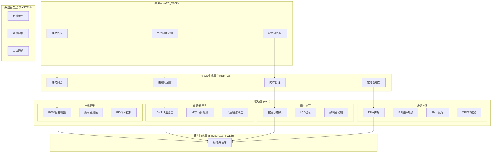
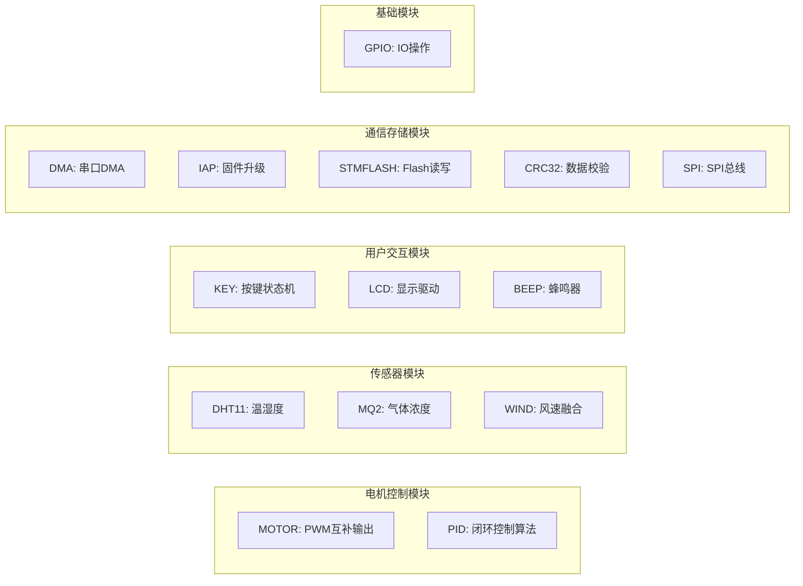
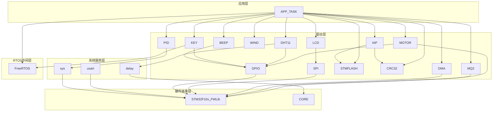

# 目录结构与模块职责划分

<!-- WIKI_NAV_START -->
> [!info] RTOS Wiki 导航
> [[projects/RTOS项目/index|项目首页]] · [[2.1 三层架构：驱动层、RTOS中间层、应用层|← 上一篇：2.1 三层架构：驱动层、RTOS中间层、应用层]] · [[2.3 系统启动流程与初始化顺序|下一篇：2.3 系统启动流程与初始化顺序 →]]
<!-- WIKI_NAV_END -->

本文档详细解析基于STM32F103C8T6与FreeRTOS的油烟机控制系统的目录结构设计和模块职责划分。通过清晰的层次划分和模块化设计，该系统实现了高内聚、低耦合的架构，便于维护、测试和扩展。

## 项目整体架构

该项目采用经典的**三层架构**设计，将系统划分为驱动层、RTOS中间层和应用层三个逻辑层次，每层承担明确的职责边界。



**Sources: `USER/main.c#L1-L113`, `APP_TASK/app_tasks.c#L1-L200`**

## 目录结构详解

### 核心目录概览

| 目录名称 | 层次归属 | 主要职责 | 文件数量 |
|---------|---------|---------|---------|
| **USER** | 用户入口 | 主程序、系统启动、中断服务 | 8个文件 |
| **APP_TASK** | 应用层 | 任务管理、业务逻辑 | 2个文件 |
| **BSP** | 驱动层 | 硬件驱动封装 | 14个子目录 |
| **SYSTEM** | 系统服务层 | 系统级服务 | 3个子目录 |
| **FreeRTOS** | RTOS中间层 | 实时操作系统内核 | 11个文件+2个目录 |
| **CORE** | 底层支持 | Cortex-M3核心支持 | 4个文件 |
| **STM32F10x_FWLib** | 硬件抽象层 | STM32标准外设库 | 46个文件 |

**Sources: `.#L1-L200`**

### USER目录 - 系统入口

USER目录是整个系统的入口点，包含主程序、系统初始化代码和中断服务程序。

**文件职责划分：**
- **main.c**：系统主入口，执行硬件初始化、系统状态初始化、创建启动任务、启动FreeRTOS调度器
- **main.h**：主程序头文件，包含全局宏定义和函数声明
- **system_stm32f10x.c**：系统时钟配置，设置PLL、AHB/APB总线时钟
- **stm32f10x_it.c**：中断服务程序模板，处理HardFault等异常
- **stm32f10x.h**：STM32芯片寄存器定义
- **stm32f10x_conf.h**：外设库配置文件
- **project.uvprojx**：Keil工程文件

**关键代码示例：**
```c
// main.c中的系统启动流程
int main(void)
{
    Hardware_Init();      // 硬件初始化
    System_Init();        // 系统状态初始化
    StartTask_Create();   // 创建启动任务
    vTaskStartScheduler(); // 启动FreeRTOS调度器
    while(1);             // 正常不会执行到这里
}
```

**Sources: `USER/main.c#L80-L113`, `USER/system_stm32f10x.c#L1-L80`**

### APP_TASK目录 - 应用逻辑层

APP_TASK目录是应用层的核心，负责业务逻辑实现和任务管理。

**核心文件：**
- **app_tasks.c**：包含所有应用任务实现，包括任务创建、状态机管理、业务逻辑
- **app_tasks.h**：定义系统状态结构体、任务优先级、栈大小等配置

**主要任务划分：**

| 任务名称 | 优先级 | 栈大小 | 功能描述 |
|---------|--------|--------|---------|
| **StartTask** | 1 | 64字节 | 启动任务，创建其他任务后自删除 |
| **KeyScanTask** | 4 | 64字节 | 按键扫描，处理用户输入 |
| **SensorTask** | 3 | 128字节 | 传感器数据采集 |
| **WindSpeedTask** | 3 | 64字节 | 风速计算与融合算法 |
| **MotorControlTask** | 5 | 256字节 | 电机控制与PID调节 |
| **UIDisplayTask** | 1 | 256字节 | LCD显示更新 |
| **AntiBackflowTask** | 2 | 64字节 | 防回流模式处理 |
| **SpeedCalcTask** | 6 | 128字节 | 编码器速度计算 |
| **IAPTask** | 7 | 256字节 | 固件升级处理 |

**Sources: `APP_TASK/app_tasks.h#L1-L129`, `APP_TASK/app_tasks.c#L100-L200`**

### BSP目录 - 板级支持包

BSP目录是驱动层的核心，包含所有硬件驱动的封装。每个子目录对应一个功能模块，实现高内聚设计。

**模块分类：**



**各模块职责详解：**

#### 电机控制模块
- **MOTOR**：TIM1 PWM互补输出驱动H桥电路，TIM2编码器测速，TIM4定时器中断
- **PID**：位置式PID算法，支持参数整定和输出限幅

#### 传感器模块
- **DHT11**：单总线协议驱动，实现温湿度数据采集
- **MQ2**：ADC采集气体浓度，支持阈值检测
- **WIND**：多传感器融合算法，计算PWM占空比

#### 用户交互模块
- **KEY**：状态机消抖，支持短按、长按、持续按检测
- **LCD**：SPI接口驱动128x160液晶屏
- **BEEP**：有源蜂鸣器控制

#### 通信存储模块
- **DMA**：串口DMA传输，用于固件接收
- **IAP**：默认关闭的Boot + 单APP写入实验链路
- **STMFLASH**：Flash读写操作
- **CRC32**：固件完整性校验
- **SPI**：硬件SPI驱动

**Sources: `BSP/MOTOR/motor.h#L1-L43`, `BSP/PID/pid.h#L1-L67`, `BSP/DHT11/dht11.h#L1-L55`**

### SYSTEM目录 - 系统服务层

SYSTEM目录提供系统级服务，为上层模块提供基础支持。

**子目录职责：**
- **delay**：延时服务，支持ms和us级延时
- **sys**：系统配置，包含功能开关、位带操作定义
- **usart**：串口通信服务

**关键配置项：**
```c
// sys.h中的功能开关
#define SYSTEM_SUPPORT_OS   1   // 支持OS
#define DEBUG               0   // 调试功能开关
#define ifopen              0   // 固件升级功能开关
#define SENSOR_DEBUG        0   // 传感器调试开关
```

**Sources: `SYSTEM/sys/sys.h#L1-L91`, `SYSTEM/delay/delay.h#L1-L46`**

### FreeRTOS目录 - RTOS内核

FreeRTOS目录包含实时操作系统内核，提供任务调度、进程间通信等核心功能。

**核心组件：**
- **tasks.c**：任务管理核心，实现任务创建、调度、状态管理
- **queue.c**：队列实现，支持任务间通信
- **list.c**：链表实现，内核数据结构基础
- **timers.c**：软件定时器
- **event_groups.c**：事件组
- **croutine.c**：协程支持

**移植层 (portable)：**
- **Keil**：Keil MDK编译器移植
- **RVDS**：ARM编译器移植
- **MemMang**：内存管理策略（heap_1到heap_5）

**配置文件 (FreeRTOSConfig.h)：**
- 时钟节拍频率：1000Hz
- 最大优先级数：32
- 空闲任务栈大小：130字节
- 支持抢占式调度和时间片调度

**Sources: `FreeRTOS/include/FreeRTOSConfig.h#L1-L100`, `FreeRTOS#L1-L20`**

### CORE目录 - Cortex-M3核心支持

CORE目录包含ARM Cortex-M3核心支持文件。

**文件组成：**
- **core_cm3.c/h**：Cortex-M3核心外设访问层
- **startup_stm32f10x_hd.s**：大容量芯片启动文件
- **startup_stm32f10x_md.s**：中容量芯片启动文件

**Sources: `CORE#L1-L10`**

### STM32F10x_FWLib目录 - 标准外设库

STM32F10x_FWLib目录包含STM32标准外设库，提供硬件抽象接口。

**库文件组织：**
- **inc**：头文件目录，包含所有外设驱动接口声明
- **src**：源文件目录，包含所有外设驱动实现

**支持的主要外设：**
- GPIO、USART、SPI、I2C
- TIM、ADC、DMA
- FLASH、CRC、RTC
- NVIC、EXTI、PWR

**Sources: `STM32F10x_FWLib#L1-L50`**

## 模块依赖关系

### 依赖层次图



**Sources: `APP_TASK/app_tasks.c#L1-L30`, `BSP/MOTOR/motor.h#L1-L43`**

### 关键依赖链

| 模块           | 直接依赖                 | 间接依赖                 | 说明          |
| ------------ | -------------------- | -------------------- | ----------- |
| **APP_TASK** | 所有BSP模块、FreeRTOS     | STM32F10x_FWLib、CORE | 应用层依赖所有下层服务 |
| **MOTOR**    | GPIO、STM32F10x_FWLib | CORE                 | 电机控制依赖硬件外设  |
| **PID**      | sys（系统配置）            | 无                    | 算法模块相对独立    |
| **DHT11**    | GPIO、delay           | CORE                 | 传感器依赖延时服务   |
| **KEY**      | GPIO、FreeRTOS        | CORE                 | 按键需要RTOS支持  |
| **LCD**      | SPI                  | STM32F10x_FWLib      | 显示依赖SPI驱动   |
| **IAP**      | STMFLASH、CRC32       | STM32F10x_FWLib      | 固件升级依赖存储和校验 |

**Sources: `APP_TASK/app_tasks.h#L1-L30`, `BSP/KEY/key.h#L1-L76`**

## 设计原则与最佳实践

### 分层隔离原则

**层次边界清晰：**
- 应用层不直接访问硬件寄存器
- 驱动层不包含业务逻辑
- 系统服务层提供通用服务，不依赖具体业务

**示例：**
```c
// 应用层调用驱动层接口
void MotorControlTask(void *pvParameters)
{
    motor_speed(pwm_value);  // 调用驱动层函数
    // 而不是直接操作寄存器
}
```

**Sources: `APP_TASK/app_tasks.c#L200-L300`**

### 模块化设计原则

**单一职责：**
- 每个BSP模块只负责一个功能域
- 模块内部高度内聚，模块间低耦合

**接口标准化：**
- 统一的初始化函数命名：`XXX_Init()`
- 统一的头文件保护宏命名：`__XXX_H`
- 统一的函数声明格式

**Sources: `BSP/MOTOR/motor.h#L1-L43`, `BSP/PID/pid.h#L1-L67`**

### 配置外置原则

**编译时配置：**
- 功能开关集中在`sys.h`中定义
- 任务参数集中在`app_tasks.h`中定义
- FreeRTOS配置集中在`FreeRTOSConfig.h`中

**运行时配置：**
- PID参数可通过函数接口调整
- 阈值参数可通过宏定义修改

**Sources: `SYSTEM/sys/sys.h#L20-L40`, `APP_TASK/app_tasks.h#L60-L100`**

### 中断优先级设计

**优先级分组：**
- 使用`NVIC_PriorityGroup_4`：4位抢占优先级，0位亚优先级
- FreeRTOS屏蔽优先级阈值设为3

**中断优先级分配：**
| 中断源 | 抢占优先级 | 说明 |
|--------|-----------|------|
| DMA中断 | 4 | 固件接收 |
| TIM4中断 | 5 | 速度计算定时器 |
| TIM2中断 | 6 | 编码器计数 |

**Sources: `USER/main.c#L30-L50`**

### 内存管理策略

**栈空间分配：**
- 每个任务独立栈空间，根据任务复杂度分配
- 关键任务（如MotorControlTask）分配较大栈空间

**堆内存管理：**
- FreeRTOS使用`heap_4.c`内存管理策略
- 支持内存碎片整理

**特殊内存区域：**
- IAP接收缓冲区固定在`0x20004000`地址
- 避免Bootloader和APP的RAM区域重叠

**Sources: `APP_TASK/app_tasks.h#L70-L100`, `APP_TASK/app_tasks.c#L50-L80`**

## 扩展性设计

### 添加新模块的步骤

1. **在BSP目录创建新模块目录**
   ```
   BSP/NEW_MODULE/
   ├── new_module.c
   └── new_module.h
   ```

2. **实现标准接口**
   ```c
   // new_module.h
   #ifndef __NEW_MODULE_H
   #define __NEW_MODULE_H
   #include "sys.h"
   
   void NewModule_Init(void);
   // 其他接口函数
   #endif
   ```

3. **在app_tasks.c中集成**
   ```c
   #include "new_module.h"
   
   // 在Hardware_Init()中调用初始化
   // 在任务中使用新模块功能
   ```

**Sources: `BSP#L1-L20`, `BSP/GPIO/gpiox.h#L1-L27`**

### 添加新任务的步骤

1. **在app_tasks.h中定义任务参数**
   ```c
   #define TASK_NEW_PRIORITY    3
   #define TASK_NEW_STK_SIZE    128
   ```

2. **在app_tasks.c中实现任务函数**
   ```c
   void NewTask(void *pvParameters)
   {
       while(1)
       {
           // 任务逻辑
           vTaskDelay(pdMS_TO_TICKS(100));
       }
   }
   ```

3. **在StartTask中创建任务**
   ```c
   xTaskCreate(NewTask, "NewTask", TASK_NEW_STK_SIZE, NULL,
               TASK_NEW_PRIORITY, &xNewTaskHandle);
   ```

**Sources: `APP_TASK/app_tasks.h#L60-L100`, `APP_TASK/app_tasks.c#L120-L180`**

## 调试与维护建议

### 模块级调试

**启用调试宏：**
```c
#define DEBUG           1   // 启用调试功能
#define SENSOR_DEBUG    1   // 启用传感器调试
```

**使用串口输出：**
```c
printf("[MOTOR] Speed: %.1f RPM\r\n", actual_speed);
printf("[PID] Output: %.1f%%\r\n", pid_output);
```

**Sources: `SYSTEM/sys/sys.h#L20-L40`**

### 性能监控

**任务状态监控：**
- 使用FreeRTOS任务状态查询函数
- 监控任务栈使用情况
- 检测任务执行时间

**内存使用监控：**
- 定期检查堆内存使用情况
- 监控内存碎片化程度

**Sources: `FreeRTOS/include/FreeRTOSConfig.h#L80-L100`**

## 总结

本项目通过清晰的目录结构和模块职责划分，实现了高可维护性和可扩展性的嵌入式系统架构。关键设计特点包括：

1. **层次分明**：三层架构（应用层、驱动层、系统服务层）职责清晰
2. **模块独立**：每个BSP模块独立封装，接口标准化
3. **配置集中**：关键配置集中在头文件中，便于管理
4. **扩展友好**：添加新模块或任务只需遵循既定模式

这种架构设计使得系统能够：
- 便于团队协作开发
- 支持功能模块的独立测试
- 简化故障定位和调试
- 为未来功能扩展预留空间

**Sources: `USER/main.c#L1-L113`, `APP_TASK/app_tasks.c#L1-L840`, `BSP#L1-L20`**

<!-- WIKI_FOOTER_START -->
---
> [!tip] 继续阅读
> [[projects/RTOS项目/index|项目首页]] · [[2.1 三层架构：驱动层、RTOS中间层、应用层|← 上一篇：2.1 三层架构：驱动层、RTOS中间层、应用层]] · [[2.3 系统启动流程与初始化顺序|下一篇：2.3 系统启动流程与初始化顺序 →]]
<!-- WIKI_FOOTER_END -->
