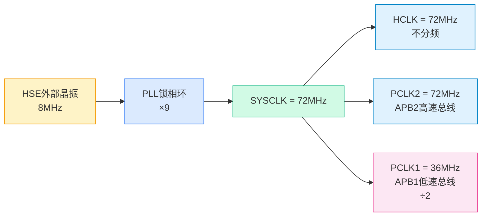
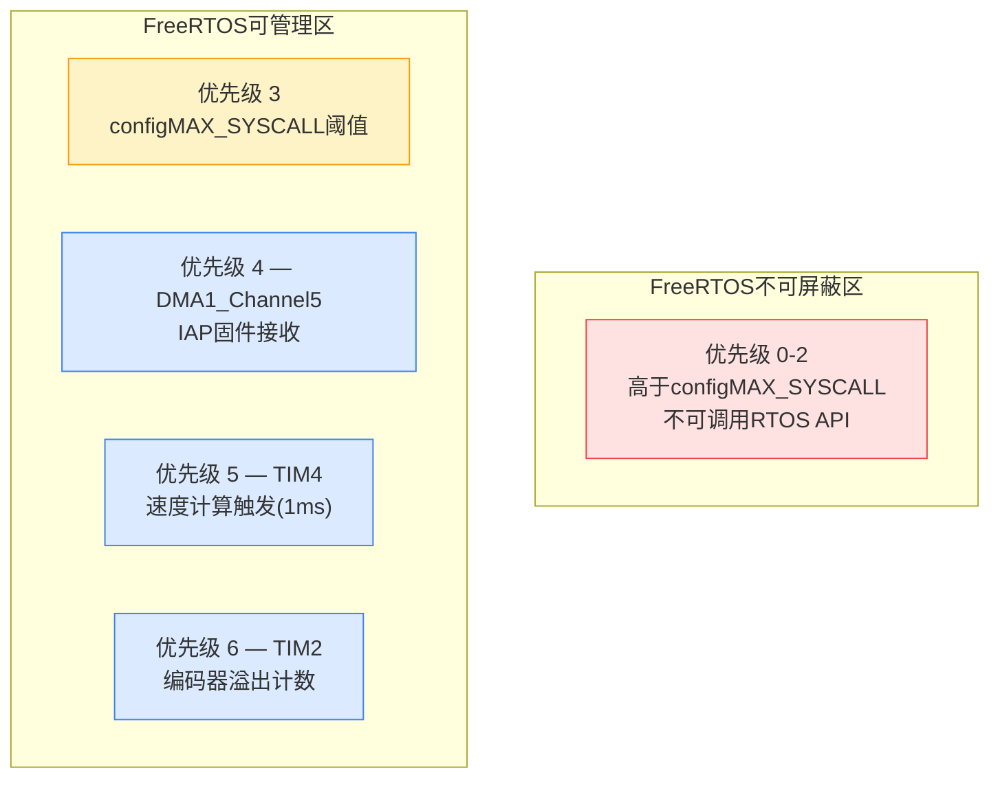
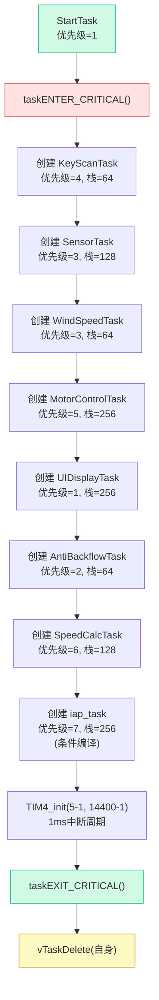

# 系统启动流程与初始化顺序

<!-- WIKI_NAV_START -->
> [!info] RTOS Wiki 导航
> [[projects/RTOS项目/index|项目首页]] · [[2.2 目录结构与模块职责划分|← 上一篇：2.2 目录结构与模块职责划分]] · [[2.4 任务间通信：互斥信号量与全局状态管理|下一篇：2.4 任务间通信：互斥信号量与全局状态管理 →]]
<!-- WIKI_NAV_END -->

> **实现状态（源码审计后）**：启动链路已按当前源码核对。TIM4必须在 `g_speedCalcSemaphore` 和 `SpeedCalcTask` 创建后启动；IAP初始化步骤默认不参与构建。

本文档梳理油烟机控制系统从上电复位到多任务并发运行的启动流程。

## 全景启动流程概览

系统上电后经历**四个阶段**：硬件复位与C库初始化 → 时钟系统配置 → 外设与状态初始化 → FreeRTOS调度器接管。下图展示了从复位向量到多任务运行的完整链路：

```mermaid
flowchart TD
    A["上电/复位 Reset"] --> B["Reset_Handler<br>startup_stm32f10x_md.s"]
    B --> C["SystemInit()<br>system_stm32f10x.c"]
    C --> C1["RCC时钟复位为默认值"]
    C1 --> C2["SetSysClockTo72()<br>HSE×9 = 72MHz"]
    C2 --> C3["向量表偏移设置<br>SCB->VTOR = FLASH_BASE"]
    C3 --> D["__main (C库入口)"]
    D --> D1[".data段拷贝到RAM"]
    D1 --> D2[".bss段清零"]
    D2 --> D3["堆/栈初始化"]
    D3 --> E["main() — 进入用户代码"]
    E --> F["Hardware_Init()"]
    F --> G["System_Init()"]
    G --> H["StartTask_Create()"]
    H --> I["vTaskStartScheduler()"]
    I --> I1["创建空闲任务<br>创建定时器任务"]
    I1 --> I2["启动SysTick<br>启动PendSV调度"]
    I2 --> J["StartTask 运行"]
    J --> J1["进入临界区"]
    J1 --> J2["创建全部业务任务<br>Key/Sensor/Motor/UI…"]
    J2 --> J3["初始化TIM4<br>速度计算定时器"]
    J3 --> J4["退出临界区"]
    J4 --> J5["vTaskDelete(自身)"]
    J5 --> K["多任务并发运行 🚀"]

    style A fill:#fee2e2,stroke:#ef4444
    style B fill:#fef3c7,stroke:#f59e0b
    style C fill:#dbeafe,stroke:#3b82f6
    style D fill:#dbeafe,stroke:#3b82f6
    style E fill:#d1fae5,stroke:#10b981
    style I fill:#ede9fe,stroke:#8b5cf6
    style K fill:#fef9c3,stroke:#ca8a04
```



Sources: `CORE/startup_stm32f10x_md.s#L147-L155`, `USER/system_stm32f10x.c#L212-L269`, `USER/main.c#L92-L110`, `APP_TASK/app_tasks.c#L145-L192`

## 阶段一：复位向量与SystemInit（C语言之前）

STM32F103上电复位后，Cortex-M3内核硬件行为固定：从地址 `0x0000_0000` 读取初始栈指针（SP），从地址 `0x0000_0004` 读取复位向量（PC），随即跳转到 `Reset_Handler`。Keil工程实际选用的启动汇编是 `startup_stm32f10x_md.s`。

```armasm
__Vectors       DCD     __initial_sp               ; 栈顶地址 → SP
                DCD     Reset_Handler              ; 复位向量 → PC
                DCD     NMI_Handler                ; NMI中断
                DCD     HardFault_Handler          ; 硬故障
                ; ... 后续为外设中断向量
```

**Reset_Handler** 只做两件事：先调用 `SystemInit()` 完成时钟配置，再跳转到C库入口 `__main`：

```armasm
Reset_Handler   PROC
                IMPORT  SystemInit
                IMPORT  __main
                LDR     R0, =SystemInit     ; 加载SystemInit地址
                BLX     R0                  ; 调用SystemInit()
                LDR     R0, =__main         ; 加载__main地址
                BX      R0                  ; 跳转到C库入口
                ENDP
```

此时C语言运行环境尚不存在，`SystemInit()` 必须以"不依赖任何全局变量初始化"的方式完成时钟配置。

Sources: `CORE/startup_stm32f10x_md.s#L56-L77`, `CORE/startup_stm32f10x_md.s#L147-L155`

## SystemInit：时钟系统配置

`SystemInit()` 是系统启动链中第一个C函数，职责是将时钟从复位后的默认 HSI（8MHz内部RC）切换到目标频率。本项目配置为 **SYSCLK = 72MHz**。

### RCC寄存器复位

函数首先将RCC时钟配置寄存器复位到已知状态，确保从干净的起点开始配置：

| 操作 | 寄存器 | 目的 |
|------|--------|------|
| 使能HSI | `RCC->CR \|= 0x00000001` | 确保内部RC振荡器运行 |
| 清除时钟选择位 | `RCC->CFGR &= 0xF8FF0000` | 重置SW/HPRE/PPRE分频 |
| 关闭HSE/PLL | `RCC->CR &= 0xFEF6FFFF` | 为重新配置做准备 |
| 清除PLL参数 | `RCC->CFGR &= 0xFF80FFFF` | 重置PLL源/倍频系数 |
| 禁用所有中断 | `RCC->CIR = 0x009F0000` | 清除RCC中断标志 |

### 时钟树配置（SetSysClockTo72）

`SetSysClock()` 根据宏定义 `SYSCLK_FREQ_72MHz`（在 `USER/system_stm32f10x.c#L115` 声明）调用 `SetSysClockTo72()`，完成以下配置：



具体寄存器配置序列：

| 步骤 | 配置内容 | 关键寄存器值 |
|------|---------|-------------|
| 1 | 使能HSE并等待就绪 | `RCC->CR \|= RCC_CR_HSEON`，轮询 `HSERDY` |
| 2 | 使能Flash预取缓冲 | `FLASH->ACR \|= FLASH_ACR_PRFTBE` |
| 3 | Flash等待周期 | `FLASH_ACR_LATENCY_2`（2个等待周期，72MHz必须） |
| 4 | AHB不分频 | `RCC->CFGR \|= RCC_CFGR_HPRE_DIV1` → HCLK=72MHz |
| 5 | APB2不分频 | `RCC->CFGR \|= RCC_CFGR_PPRE2_DIV1` → PCLK2=72MHz |
| 6 | APB1二分频 | `RCC->CFGR \|= RCC_CFGR_PPRE1_DIV2` → PCLK1=36MHz |
| 7 | PLL配置 | `RCC_CFGR_PLLSRC_HSE \| RCC_CFGR_PLLMULL9` → 8×9=72MHz |
| 8 | 使能PLL并等待锁定 | `RCC->CR \|= RCC_CR_PLLON`，轮询 `PLLRDY` |
| 9 | 切换系统时钟到PLL | `RCC->CFGR \|= RCC_CFGR_SW_PLL` |
| 10 | 确认切换完成 | 轮询 `RCC->CFGR_SWS == 0x08` |

### 向量表定位

时钟配置完成后，`SystemInit()` 最后一步设置中断向量表偏移：

```c
SCB->VTOR = FLASH_BASE | VECT_TAB_OFFSET;  // VECT_TAB_OFFSET = 0x0
```

本项目向量表位于Flash起始地址 `0x0800_0000`，偏移量为0。如果存在Bootloader分区，APP程序需要修改此偏移量以指向自身的向量表。

Sources: `USER/system_stm32f10x.c#L212-L269`, `USER/system_stm32f10x.c#L987-L1080`, `USER/system_stm32f10x.c#L115`

## 阶段二：C库初始化（__main）

`__main` 是ARM C库（armcc/armclang）的入口函数，由编译器工具链提供，**不是用户代码**。它在调用 `main()` 之前完成：

1. **`.data` 段拷贝**：将初始化的全局变量从Flash复制到RAM
2. **`.bss` 段清零**：将未初始化的全局变量所在RAM区域清零
3. **堆栈初始化**：根据启动文件中定义的 `Stack_Size`（0x400 = 1KB）和 `Heap_Size`（0x200 = 512B）配置
4. **C库初始化**：初始化stdio等基础库
5. **跳转到 `main()`**

> **关键认知**：`__main` 运行期间，所有C语言全局变量已就绪，但所有外设寄存器处于复位默认值，时钟已被 `SystemInit` 配置为72MHz。

Sources: `CORE/startup_stm32f10x_md.s#L35-L50`

## 阶段三：main() — 硬件与状态初始化

进入 `main()` 后，系统按照严格的先后顺序完成三层初始化：硬件驱动 → 系统状态 → RTOS任务创建。

### Hardware_Init()：硬件外设初始化

这是最核心的初始化函数，**初始化顺序不可随意调换**，因为存在时钟依赖和功能依赖：

```c
static void Hardware_Init(void)
{
    NVIC_PriorityGroupConfig(NVIC_PriorityGroup_4);   // ① 中断分组
    delay_init();                                       // ② SysTick配置
    
    TIM1_dead_pwm_init(1000-1, 72-1, 0, 100);         // ③ 电机PWM
    motor_init();                                       // ④ 电机GPIO
    TIM2_encode_init(0xFFFF, 0);                       // ⑤ 编码器
    
    Beep_Init(&bep, GPIOB, GPIO_Pin_15);               // ⑥ 蜂鸣器
    Key_Init();                                         // ⑦ 按键
    MQ2_Init();                                         // ⑧ 气体传感器ADC
    
    PID_Init(&g_speedPID, 14.0f, 1.65f, 0.0f, ...);    // ⑨ PID控制器
    WindSpeed_Init();                                   // ⑩ 风速算法
    LCD_Init();                                         // ⑪ LCD显示
    uart_init(115200);                                  // ⑫ 串口（必须最后）
    
    #if ifopen
    MYDMA_Config(DMA1_Channel5, ...);                  // ⑬ DMA(IAP)
    #endif
}
```

每个步骤的设计意图：

| 序号 | 初始化项 | 设计原因 | 关键参数 |
|------|---------|---------|---------|
| ① | NVIC分组4 | 4位抢占优先级/0位子优先级，匹配FreeRTOS要求 | `NVIC_PriorityGroup_4` |
| ② | delay/SysTick | 配置SysTick时钟源为HCLK，初始化节拍计数 | `configTICK_RATE_HZ=1000` |
| ③ | TIM1 PWM | 1kHz互补PWM输出+死区，驱动H桥 | CKD=DIV4且DTG=100时约5.56μs；源码中的22μs注释与寄存器配置不一致 |
| ④ | motor GPIO | PA2使能控制引脚 | 推挽输出 |
| ⑤ | TIM2编码器 | 4倍频编码器接口，ARR=65535 | TI1+TI2同时计数 |
| ⑥ | 蜂鸣器 | PB15，推挽输出 | - |
| ⑦ | 按键 | PB1(模式)/PB12(档位)，上拉输入 | 状态机消抖 |
| ⑧ | MQ2 ADC | ADC1通道4(PA4)，独立模式，12M采样时钟 | 72MHz/6=12MHz |
| ⑨ | PID | 速度环：Kp=14, Ki=1.65, Kd=0 | 输出限幅0~1000 |
| ⑩ | 风速算法 | 初始化归一化参数和融合权重 | 全部归零 |
| ⑪ | LCD | SPI1硬件初始化→GPIO→复位→ST7735S命令序列 | 128×160显示 |
| ⑫ | 串口 | **必须最后初始化**，否则会影响电机转动 | 115200波特率 |

> **重要提示**：`uart_init()` 必须放在硬件初始化末尾。根据代码注释，先初始化串口会干扰电机PWM输出，这可能与GPIO复用冲突或时钟配置有关。

Sources: `USER/main.c#L29-L86`, `SYSTEM/delay/delay.c#L40-L53`, `BSP/MOTOR/motor.c#L77-L100`, `BSP/KEY/key.c#L38-L60`, `BSP/MQ2/mq2.c#L17-L55`, `BSP/LCD/lcd.c#L190-L291`, `SYSTEM/usart/usart.c#L71-L80`

### 中断优先级分层

本项目共使用4个中断，全部采用NVIC_PriorityGroup_4（纯抢占优先级），并严格遵循"FreeRTOS可管理阈值以下"的规则：



FreeRTOS配置的关键参数：

| 配置项 | 值 | 含义 |
|--------|-----|------|
| `configLIBRARY_MAX_SYSCALL_INTERRUPT_PRIORITY` | 3 | 可调用API的最高中断优先级 |
| `configLIBRARY_LOWEST_INTERRUPT_PRIORITY` | 15 | 最低中断优先级 |
| `configPRIO_BITS` | 4 | STM32F103支持4位优先级 |

Sources: `FreeRTOS/include/FreeRTOSConfig.h#L184-L187`, `APP_TASK/app_tasks.c#L32-L36`, `BSP/MOTOR/motor.c#L243-L264`, `BSP/DMA/dma.c#L41-L52`

### System_Init()：RTOS同步原语创建

硬件就绪后，创建FreeRTOS同步原语。**这些必须在任务创建之前完成**，因为任务会立即使用它们：

| 原语 | 类型 | 用途 |
|------|------|------|
| `g_dataMutex` | 互斥信号量（Mutex） | 保护 `g_systemState` 全局状态，支持优先级继承防止反转 |
| `g_speedCalcSemaphore` | 二值信号量 | TIM4中断 → SpeedCalcTask 的通知通道 |
| `g_iapSemaphore` | 二值信号量（条件编译） | DMA传输完成 → IAP任务的通知通道 |

同时初始化 `g_systemState` 结构体，所有字段归零/默认值：模式为 `MODE_STANDBY`，档位为 `SPEED_LOW`，电机停止。

Sources: `APP_TASK/app_tasks.c#L103-L131`, `APP_TASK/app_tasks.h#L43-L63`

### StartTask_Create()：创建开始任务

在 `main()` 中最后一步是创建一个"开始任务"，它是所有业务任务的**孵化器**：

```c
xTaskCreate(StartTask, "StartTask", TASK_START_STK_SIZE, NULL, 
            TASK_START_PRIORITY, &xStartTaskHandle);
```

| 参数 | 值 | 说明 |
|------|-----|------|
| 优先级 | 1（最低） | 仅用于一次性创建任务，之后自删除 |
| 栈大小 | 64 words（256字节） | 足够执行创建任务的代码 |
| 名称 | "StartTask" | 调试用 |

Sources: `APP_TASK/app_tasks.c#L136-L140`, `APP_TASK/app_tasks.h#L76-L97`

## 阶段四：FreeRTOS调度器启动

`vTaskStartScheduler()` 是进入RTOS世界的"单向门"——调用后CPU控制权交给调度器，**不会返回**（除非内存不足）。

### 调度器内部行为

调用 `vTaskStartScheduler()` 后，FreeRTOS内核依次完成：

1. **创建空闲任务**（Idle Task）：优先级0，负责内存回收和低功耗处理
2. **创建定时器守护任务**：因 `configUSE_TIMERS=1`，优先级为 `configMAX_PRIORITIES-1 = 31`（最高）
3. **关闭中断**：准备切换到第一个任务
4. **配置SysTick**：根据 `configTICK_RATE_HZ=1000` 设置1ms节拍
5. **触发PendSV**：开始第一次上下文切换，跳转到StartTask

> **重要**：SysTick中断服务函数在 `SYSTEM/delay/delay.c#L26-L33` 中实现，它调用 `xPortSysTickHandler()` 驱动FreeRTOS节拍。`FreeRTOSConfig.h` 通过宏映射将启动文件中的 `PendSV_Handler` 和 `SVC_Handler` 重定向到FreeRTOS的 `xPortPendSVHandler` 和 `vPortSVCHandler`。

Sources: `FreeRTOS/include/FreeRTOSConfig.h#L89-L97`, `FreeRTOS/include/FreeRTOSConfig.h#L147-L150`, `FreeRTOS/include/FreeRTOSConfig.h#L192-L193`, `SYSTEM/delay/delay.c#L26-L33`

### StartTask：任务创建的临界区保护

StartTask是第一个运行的用户任务，它在**临界区**中批量创建所有业务任务：



**临界区保护的目的**：防止任务在创建过程中被调度。在临界区内，中断虽然可以触发（取决于优先级），但任务调度被禁止，确保所有任务一次性创建完毕后再开始运行。

**TIM4必须在信号量创建之后初始化**：因为TIM4中断会通过 `xSemaphoreGiveFromISR()` 释放 `g_speedCalcSemaphore`。如果信号量尚未创建，中断中的释放操作会导致HardFault。

### 任务优先级与职责总览

| 任务 | 优先级 | 栈(字) | 周期 | 核心职责 |
|------|--------|--------|------|---------|
| SpeedCalcTask | 6 | 128 | 由TIM4中断触发(1ms) | 编码器采样、转速计算、一阶滤波 |
| MotorControlTask | 5 | 256 | 50ms | PID闭环调速、模式联动控制 |
| KeyScanTask | 4 | 64 | 10ms | 状态机消抖、短按/长按检测 |
| SensorTask | 3 | 128 | 500ms | DHT11温湿度 + MQ2气体采集 |
| WindSpeedTask | 3 | 64 | 100ms | 多传感器融合风速计算 |
| AntiBackflowTask | 2 | 64 | 100ms | 气体浓度阈值检测与紧急响应 |
| StartTask | 1 | 64 | 一次性 | 创建其他任务后自删除 |
| UIDisplayTask | 1 | 256 | 200ms | LCD界面刷新 |
| iap_task | 7 | 256 | 事件驱动 | DMA接收固件+Flash写入+跳转 |

> **设计要点**：SpeedCalcTask优先级最高（6），因为速度计算需要精确的1ms定时触发，延迟会影响PID控制精度。MotorControlTask紧随其后（5），确保PID输出及时更新到PWM。

Sources: `APP_TASK/app_tasks.c#L145-L192`, `APP_TASK/app_tasks.h#L76-L97`, `APP_TASK/app_tasks.c#L783-L798`, `APP_TASK/app_tasks.c#L825-L839`

## SysTick中断与RTOS心跳

SysTick是FreeRTOS的心跳来源。本项目中SysTick中断服务函数位于 `SYSTEM/delay/delay.c#L26-L33`，而非启动文件的默认死循环：

```c
void SysTick_Handler(void)
{	
    if(xTaskGetSchedulerState() != taskSCHEDULER_NOT_STARTED)
    {
        xPortSysTickHandler();  // 驱动FreeRTOS节拍
    }
}
```

`delay_init()` 中的配置确保了SysTick与FreeRTOS的协调：

| 配置 | 值 | 意义 |
|------|-----|------|
| 时钟源 | `SysTick_CLKSource_HCLK` | 直接使用72MHz系统时钟 |
| 重载值 | `SystemCoreClock / configTICK_RATE_HZ` = 72000 | 每1ms产生一次中断 |
| `fac_us` | 72 | 用于 `delay_us()` 的精确微秒延时 |
| `fac_ms` | 1 | OS最小延时单位为1ms |

Sources: `SYSTEM/delay/delay.c#L40-L53`, `SYSTEM/delay/delay.c#L26-L33`

## 完整初始化时序对照表

下表展示了从上电到多任务运行的完整时间线，标注了每个阶段的状态：

| 阶段 | 执行上下文 | CPU频率 | 全局变量 | 中断状态 | 外设状态 |
|------|-----------|---------|---------|---------|---------|
| 复位 | Reset_Handler | HSI 8MHz | 未初始化 | 全部关闭 | 复位默认值 |
| SystemInit | Reset_Handler | HSI→72MHz PLL | 未初始化 | 全部关闭 | RCC配置中 |
| __main | C库运行时 | 72MHz | 已初始化(bss清零) | 全部关闭 | RCC已配置 |
| Hardware_Init | main() | 72MHz | 已初始化 | 部分开启 | 逐步初始化 |
| System_Init | main() | 72MHz | 已初始化 | 部分开启 | 已就绪 |
| vTaskStartScheduler | 调度器内核 | 72MHz | 已初始化 | SysTick+PendSV开启 | 已就绪 |
| StartTask | FreeRTOS任务 | 72MHz | 已初始化 | TIM4/DMA中断开启 | 全部就绪 |
| 业务任务运行 | FreeRTOS任务 | 72MHz | 已初始化 | 全部就绪 | 全部就绪 |

## 常见启动故障排查

| 故障现象 | 可能原因 | 排查方向 |
|---------|---------|---------|
| HardFault在SystemInit阶段 | HSE晶振未起振 | 检查晶振电路、负载电容 |
| 串口输出乱码 | 时钟频率配置不匹配 | 确认HSE_VALUE与实际晶振一致 |
| FreeRTOS卡在第一个任务 | 信号量在任务创建前使用 | 检查TIM4初始化是否在信号量创建之后 |
| 电机转动异常 | uart_init顺序错误 | 确保uart_init在Hardware_Init末尾 |
| LCD无显示 | SPI1未初始化 | LCD_Init内部会调用SPI1_Init，检查接线 |
| 编码器计数不准 | TIM2中断优先级被FreeRTOS屏蔽 | 确保抢占优先级 > configLIBRARY_MAX_SYSCALL |

Sources: `USER/main.c#L76`, `APP_TASK/app_tasks.c#L182-L186`, `USER/system_stm32f10x.c#L29-L37`

## 推荐阅读路径

理解本页内容后，建议按照以下顺序深入：

1. **[[2.1 三层架构：驱动层、RTOS中间层、应用层|三层架构：驱动层、RTOS中间层、应用层]]** — 建立模块间职责边界的全局认知
2. **[[3.1 FreeRTOS 移植与配置详解|FreeRTOS 移植与配置详解]]** — 深入理解 `FreeRTOSConfig.h` 中每个配置项的含义
3. **[[3.2 任务创建、调度与优先级设计|任务创建、调度与优先级设计]]** — 掌握任务间调度机制
4. **[[3.3 中断优先级配置与临界区保护|中断优先级配置与临界区保护]]** — 理解中断与RTOS的交互边界
5. **[[projects/RTOS项目/6 调试与优化/6.2 HardFault异常诊断与堆栈溢出检测|HardFault异常诊断与堆栈溢出检测]]** — 启动故障的高级诊断方法

<!-- WIKI_FOOTER_START -->
---
> [!tip] 继续阅读
> [[projects/RTOS项目/index|项目首页]] · [[2.2 目录结构与模块职责划分|← 上一篇：2.2 目录结构与模块职责划分]] · [[2.4 任务间通信：互斥信号量与全局状态管理|下一篇：2.4 任务间通信：互斥信号量与全局状态管理 →]]
<!-- WIKI_FOOTER_END -->
