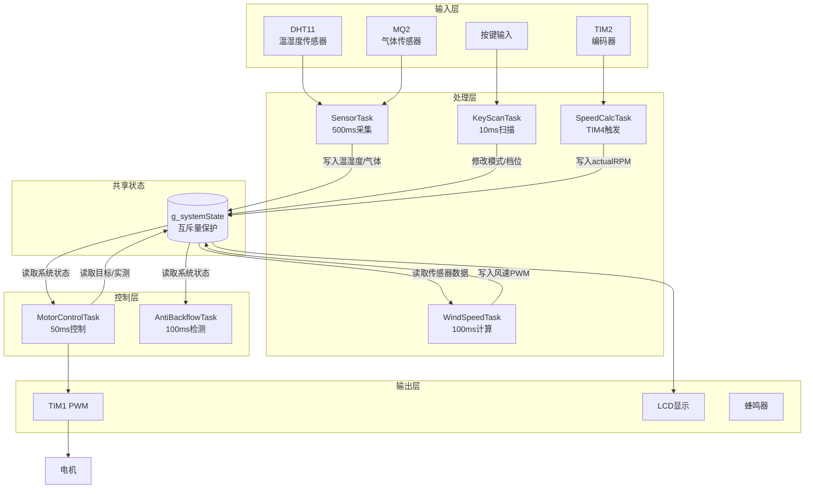

# 任务间通信：互斥信号量与全局状态管理

<!-- WIKI_NAV_START -->
> [!info] RTOS Wiki 导航
> [[projects/RTOS项目/index|项目首页]] · [[2.3 系统启动流程与初始化顺序|← 上一篇：2.3 系统启动流程与初始化顺序]] · [[3.1 FreeRTOS 移植与配置详解|下一篇：3.1 FreeRTOS 移植与配置详解 →]]
<!-- WIKI_NAV_END -->

> **实现状态（源码审计后）**：项目只创建一个 `g_dataMutex`。SensorTask对同一个互斥量分两次短暂获取；这不是“两把锁”。另外，AntiBackflowTask存在未加锁直接访问共享状态的代码，当前实现并非所有字段访问都完全受互斥量保护。

本页面分析任务间通信机制，重点讲解互斥量、二值信号量与全局状态结构体的协同设计及其现有限制。

## 互斥信号量基础与配置

FreeRTOS中的互斥信号量（Mutex）是一种特殊的二值信号量，具有**优先级继承机制**。当高优先级任务等待低优先级任务持有的互斥信号量时，低优先级任务会临时提升到高优先级，从而避免优先级反转问题。在本项目中，互斥信号量被配置为`configUSE_MUTEXES=1`，确保其功能可用。

互斥信号量与普通二值信号量的关键区别在于：互斥信号量必须由获取它的任务释放，而二值信号量可以由任何任务或中断释放。这种特性使互斥信号量成为保护共享资源的理想选择。在`FreeRTOSConfig.h`中，同时启用了`configUSE_RECURSIVE_MUTEXES=1`，支持递归互斥信号量的使用。

Sources: `FreeRTOS/include/FreeRTOSConfig.h#L106-L112`

## 全局状态结构体设计

系统的核心是一个名为`g_systemState`的全局状态结构体，类型为`SystemState_t`。这个结构体包含了油烟机控制系统的所有运行时状态信息，是任务间数据交换的中枢。

```mermaid
graph TB
    subgraph "SystemState_t 结构体"
        A[currentMode<br/>工作模式] --> B[speedLevel<br/>档位]
        B --> C[motorRunning<br/>电机状态]
        C --> D[temperature<br/>温度]
        D --> E[humidity<br/>湿度]
        E --> F[gasConcentration<br/>气体浓度]
        F --> G[windSpeedPWM<br/>风速PWM]
        G --> H[actualRPM<br/>实际转速]
        H --> I[targetRPM<br/>目标转速]
        I --> J[cookingEventActive<br/>烹饪事件]
        J --> K[antiBackflowActive<br/>防回流状态]
        K --> L[gasThreshold<br/>气体阈值]
        L --> M[autoModeCounter<br/>自动模式计数器]
        M --> N[cookingEventCounter<br/>烹饪事件计数器]
    end
```



结构体定义在`app_tasks.h`中，包含15个成员变量，涵盖系统控制的各个方面。这种集中式设计的优势在于：所有相关状态集中管理，便于维护和调试；通过单一互斥信号量保护，简化了并发控制逻辑。

Sources: `APP_TASK/app_tasks.h#L43-L63`

## 互斥信号量的创建与初始化

互斥信号量在系统初始化阶段创建，确保在任务启动前所有同步原语都已准备就绪。创建过程发生在`System_Init()`函数中，该函数在`main()`函数中被调用。

```c
/* 创建互斥信号量 */
g_dataMutex = xSemaphoreCreateMutex();

/* 创建速度计算二值信号量 */
g_speedCalcSemaphore = xSemaphoreCreateBinary();

/* 创建IAP信号量（条件编译） */
#if ifopen
    g_iapSemaphore = xSemaphoreCreateBinary();
#endif
```

系统使用了三种不同的信号量：
1. **互斥信号量**（`g_dataMutex`）：保护共享状态数据
2. **二值信号量**（`g_speedCalcSemaphore`）：用于TIM4中断与SpeedCalcTask之间的同步
3. **二值信号量**（`g_iapSemaphore`）：用于DMA中断与IAP任务之间的同步

这种分层设计体现了不同通信机制的适用场景：互斥信号量用于保护共享资源，二值信号量用于事件通知和任务同步。

Sources: `APP_TASK/app_tasks.c#L121-L131`

## 任务间数据访问模式分析

### 传感器数据写入模式

SensorTask负责采集传感器数据并写入全局状态。这个任务展示了典型的生产者模式，使用互斥信号量保护数据写入。

```c
/* 读取DHT11数据 */
ret = DHT_Read_Data(&temp,&humi,GPIOC, GPIO_Pin_14, &dht);
if (ret == 1)
{
    if (xSemaphoreTake(g_dataMutex, portMAX_DELAY) == pdTRUE)
    {
        g_systemState.temperature = temp;
        g_systemState.humidity = humi;
        xSemaphoreGive(g_dataMutex);
    }
}
```

代码注释写了“采用两把锁”，但真实代码只有一个 `g_dataMutex`：第一次获取后写温湿度并释放，完成MQ2采集后再次获取同一互斥量写气体浓度。这种做法缩短单次持锁范围，但不能称为两把锁。

Sources: `APP_TASK/app_tasks.c#L268-L284`

### 风速计算任务的数据流

WindSpeedTask展示了典型的数据流模式：读取输入数据、处理、写入输出结果。这个任务需要同时读取传感器数据和写入计算结果。

```c
/* 获取传感器数据 */
if (xSemaphoreTake(g_dataMutex, portMAX_DELAY) == pdTRUE)
{
    temp = g_systemState.temperature;
    humidity = g_systemState.humidity;
    gas = (float)g_systemState.gasConcentration;
    xSemaphoreGive(g_dataMutex);
}

/* 更新风速计算 */
WindSpeed_Update(temp, humidity, gas);

/* 更新系统状态 */
if (xSemaphoreTake(g_dataMutex, portMAX_DELAY) == pdTRUE)
{
    g_systemState.windSpeedPWM = WindSpeed_GetPWM();
    g_systemState.cookingEventActive = WindSpeed_IsCookingEvent();
    xSemaphoreGive(g_dataMutex);
}
```

这种模式的关键特点是：**数据读取和计算结果写入分离**。先获取输入数据，释放锁后进行计算，再获取锁写入结果。这避免了在持有锁期间进行耗时计算，减少了锁的持有时间。

Sources: `APP_TASK/app_tasks.c#L302-L324`

### 电机控制任务的复杂状态访问

MotorControlTask是系统中最复杂的任务之一，需要访问多个状态变量并执行不同的控制逻辑。该任务展示了状态机模式下的并发访问模式。

```c
/* 获取实际转速 */
if (xSemaphoreTake(g_dataMutex, portMAX_DELAY) == pdTRUE)
{
    g_systemState.actualRPM = speed;
    xSemaphoreGive(g_dataMutex);
}

switch (g_systemState.currentMode)
{
    case MODE_STANDBY:
        /* 待机模式：电机停止，但仍计算风速 */
        motor_stop();
        g_systemState.motorRunning = 0;
        // ...
        break;
        
    case MODE_MANUAL:
        /* 手动模式：PID控制电机转速 */
        if(g_systemState.motorRunning == 0)
        {
            motor_start();
            g_systemState.motorRunning = 1;
        }
        // ...
        break;
}
```

这里存在一个值得注意的问题：MotorControlTask在switch语句中直接访问`g_systemState.currentMode`而没有持有互斥信号量。这可能是因为：1）currentMode是枚举类型，读取是原子操作；2）或者开发者认为在这种上下文中数据竞争的风险可以接受。但严格来说，所有对共享状态的访问都应该在锁的保护下进行。

Sources: `APP_TASK/app_tasks.c#L340-L474`

## 系统状态修改函数

系统提供了三个专门的函数来修改全局状态，这些函数内部使用互斥信号量保护状态修改操作。

### 模式切换函数

`System_SwitchMode()`函数实现了工作模式的循环切换：待机 → 手动 → 自动 → 防回流 → 待机。

```c
void System_SwitchMode(void)
{
    if (xSemaphoreTake(g_dataMutex, portMAX_DELAY) == pdTRUE)
    {
        switch (g_systemState.currentMode)
        {
            case MODE_STANDBY:
                g_systemState.currentMode = MODE_MANUAL;
                break;
            case MODE_MANUAL:
                g_systemState.currentMode = MODE_AUTO;
                g_autoModeState = AUTO_STATE_STARTUP;
                break;
            // ... 其他模式切换
        }
        
        /* 切换模式时停止电机（除自动模式外） */
        if (g_systemState.currentMode != MODE_AUTO)
        {
            g_systemState.motorRunning = 0;
            motor_stop();
        }
        
        xSemaphoreGive(g_dataMutex);
    }
}
```

这个函数的特点是：在锁内完成所有状态修改，包括模式切换和电机控制。这种原子性操作确保了状态的一致性。

Sources: `APP_TASK/app_tasks.c#L690-L721`

### 档位切换函数

`System_SwitchSpeedLevel()`函数实现了档位的循环切换：低档 → 高档 → 低档。

```c
void System_SwitchSpeedLevel(void)
{
    if (xSemaphoreTake(g_dataMutex, portMAX_DELAY) == pdTRUE)
    {
        switch (g_systemState.speedLevel)
        {
            case SPEED_LOW:
                g_systemState.speedLevel = SPEED_HIGH;
                break;
            case SPEED_HIGH:
                g_systemState.speedLevel = SPEED_LOW;
                break;
        }
        xSemaphoreGive(g_dataMutex);
    }
}
```

Sources: `APP_TASK/app_tasks.c#L726-L742`

### 电机开关函数

`System_ToggleMotor()`函数实现了电机的开关切换，并强制切换到相应的工作模式。

```c
void System_ToggleMotor(void)
{
    if (xSemaphoreTake(g_dataMutex, portMAX_DELAY) == pdTRUE)
    {
        if (g_systemState.motorRunning)
        {
            /* 关闭电机：强制切换到待机模式 */
            motor_stop();
            g_systemState.motorRunning = 0;
            g_systemState.currentMode = MODE_STANDBY;
        }
        else
        {
            /* 开启电机：强制切换到手动模式 */
            motor_start();
            g_systemState.motorRunning = 1;
            g_systemState.currentMode = MODE_MANUAL;
        }
        
        xSemaphoreGive(g_dataMutex);
    }
}
```

这个函数的设计很巧妙：不仅切换电机状态，还强制切换到相应的工作模式，确保MotorControlTask不会重新启动电机。

Sources: `APP_TASK/app_tasks.c#L747-L770`

## 中断与任务间的信号量通信

系统中存在两种中断与任务间的信号量通信：

### TIM4中断与SpeedCalcTask

TIM4定时器中断每1ms触发一次，但每5次中断（5ms）才释放一次信号量，通知SpeedCalcTask执行速度计算。

```c
void TIM4_IRQHandler(void)
{
    BaseType_t xHigherPriorityTaskWoken = pdFALSE;
    
    if (TIM_GetITStatus(TIM4, TIM_IT_Update) != RESET)
    {
        TIM_ClearITPendingBit(TIM4, TIM_IT_Update);
        
        /* 发送信号量通知SpeedCalcTask执行速度计算 */
        xSemaphoreGiveFromISR(g_speedCalcSemaphore, &xHigherPriorityTaskWoken);
        
        /* 如果需要，触发上下文切换 */
        portYIELD_FROM_ISR(xHigherPriorityTaskWoken);
    }
}
```

SpeedCalcTask等待信号量并执行速度计算：

```c
void SpeedCalcTask(void *pvParameters)
{
    while (1)
    {
        /* 等待TIM4中断发送的信号量 */
        if (xSemaphoreTake(g_speedCalcSemaphore, portMAX_DELAY) == pdTRUE)
        {
            /* 获取编码器计数值 */
            encoderCount = get_encoder_value();
            
            /* 计算电机转速（50ms计算一次） */
            speed = get_speed(encoderCount, 50);
        }
    }
}
```

Sources: `APP_TASK/app_tasks.c#L825-L838`

### DMA中断与IAP任务

仅在 `ifopen=1` 时，DMA配置为固定接收 `buff_size` 字节；计数归零触发传输完成中断并释放信号量。这里的“完整”来自固定长度约定，不包含帧头、长度字段或串口空闲线判帧。

```c
void DMA1_Channel5_IRQHandler(void) 
{
    BaseType_t xHigherPriorityTaskWoken = pdFALSE;
    
    if (DMA_GetITStatus(DMA1_IT_TC5))
    {
        DMA_ClearITPendingBit(DMA1_IT_TC5);
        xSemaphoreGiveFromISR(g_iapSemaphore, &xHigherPriorityTaskWoken);
    }
    
    portYIELD_FROM_ISR(xHigherPriorityTaskWoken);
}
```

Sources: `APP_TASK/app_tasks.c#L667-L684`

## 优先级反转与锁优化策略

代码注释中多次提到优先级反转问题，开发者采取了以下优化策略：

1. **锁粒度控制**：将不同数据的锁分开，减少锁的持有时间。例如，温度和湿度使用同一个锁，但与气体浓度分开。

2. **读写分离**：在WindSpeedTask中，先获取输入数据，释放锁后进行计算，再获取锁写入结果。

3. **原子操作设计**：对于简单的状态切换，确保在锁内完成所有相关操作。

4. **优先级继承**：FreeRTOS的互斥信号量自动支持优先级继承，缓解优先级反转问题。

## 数据流架构图

系统数据流展现了任务间通过共享状态进行通信的完整模式：



## 最佳实践总结

基于本系统的实现，可以总结出以下任务间通信的最佳实践：

1. **单一职责原则**：每个任务专注于特定功能，通过共享状态与其他任务通信。

2. **锁粒度优化**：根据数据访问模式设计锁的粒度，避免过粗或过细的锁。

3. **最小化临界区**：在锁内只执行必要的状态修改操作，避免在锁内进行耗时计算。

4. **原子状态修改**：对于需要修改多个相关状态的操作，在同一个锁内完成。

5. **中断与任务通信**：使用二值信号量或计数信号量实现中断到任务的通知机制。

6. **优先级反转防护**：使用互斥信号量而非普通信号量保护共享资源，利用优先级继承机制。

Sources: `APP_TASK/app_tasks.c#L302-L324`, `APP_TASK/app_tasks.c#L690-L770`, `APP_TASK/app_tasks.h#L43-L63`

## 下一步学习建议

理解了任务间通信机制后，建议继续学习：
- [[3.1 FreeRTOS 移植与配置详解|FreeRTOS 移植与配置详解]]：深入了解FreeRTOS内核配置和移植细节
- [[3.2 任务创建、调度与优先级设计|任务创建、调度与优先级设计]]：学习任务管理和调度策略
- [[3.3 中断优先级配置与临界区保护|中断优先级配置与临界区保护]]：掌握中断与任务间的同步机制

<!-- WIKI_FOOTER_START -->
---
> [!tip] 继续阅读
> [[projects/RTOS项目/index|项目首页]] · [[2.3 系统启动流程与初始化顺序|← 上一篇：2.3 系统启动流程与初始化顺序]] · [[3.1 FreeRTOS 移植与配置详解|下一篇：3.1 FreeRTOS 移植与配置详解 →]]
<!-- WIKI_FOOTER_END -->
