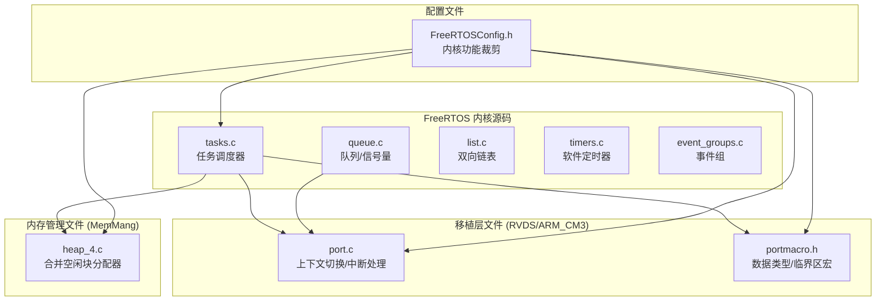
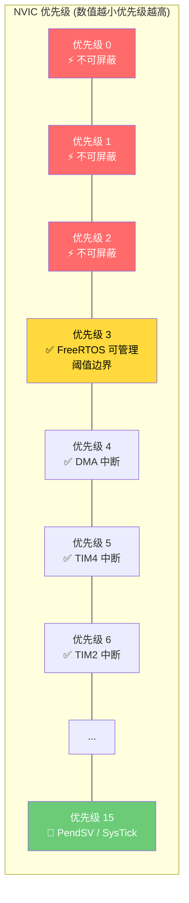
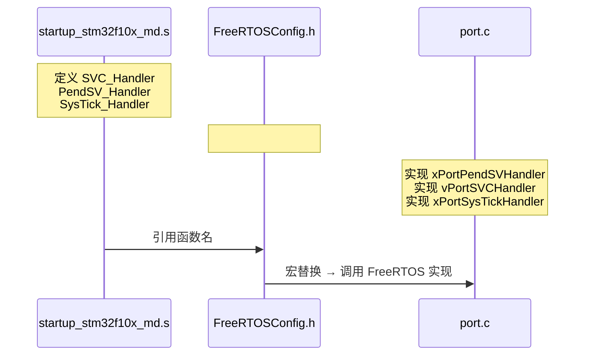
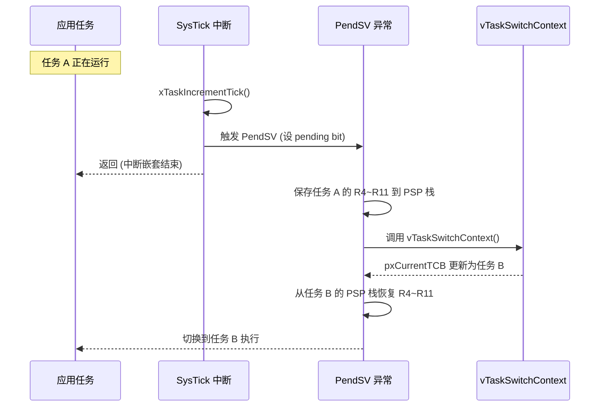

# FreeRTOS 移植与配置详解

<!-- WIKI_NAV_START -->
> [!info] RTOS Wiki 导航
> [[projects/RTOS项目/index|项目首页]] · [[2.4 任务间通信：互斥信号量与全局状态管理|← 上一篇：2.4 任务间通信：互斥信号量与全局状态管理]] · [[3.2 任务创建、调度与优先级设计|下一篇：3.2 任务创建、调度与优先级设计 →]]
<!-- WIKI_NAV_END -->

> **实现状态（源码审计后）**：工程使用RVDS/ARM_CM3移植层、heap_4动态分配、1kHz tick和抢占式调度；软件定时器功能已配置启用，但应用代码没有创建自己的 `TimerHandle_t` 定时器。任务均由 `xTaskCreate()` 动态创建。

本文档解析FreeRTOS V9.0.0在STM32F103C8T6平台上的移植与关键配置。

## FreeRTOS 源码结构与移植文件清单

FreeRTOS 的移植架构遵循三层分离设计：**内核公共文件**、**移植层接口文件**和**内存管理文件**。内核公共文件（`tasks.c`、`queue.c`、`list.c`）包含所有平台共享的调度器、队列和链表实现，与硬件无关。移植层接口文件位于 `FreeRTOS/portable/` 目录下，按「编译器/架构」两级目录组织，本项目使用 `RVDS/ARM_CM3` 子目录（RVDS 是 Keil MDK 使用的编译器代号）。内存管理文件位于 `FreeRTOS/portable/MemMang/` 目录下，提供五种堆分配策略（`heap_1.c` 到 `heap_5.c`），本项目选用 `heap_4.c`，它支持相邻空闲块合并，能有效降低内存碎片化。



以下是本项目中参与 FreeRTOS 移植与编译的核心文件清单：

| 文件路径 | 角色 | 关键职责 |
|---------|------|---------|
| `FreeRTOS/include/FreeRTOSConfig.h` | **用户配置** | 功能裁剪、中断优先级、堆大小、钩子函数开关 |
| `FreeRTOS/portable/RVDS/ARM_CM3/port.c` | **移植层实现** | 上下文切换（PendSV/SVC）、SysTick 配置、临界区管理 |
| `FreeRTOS/portable/RVDS/ARM_CM3/portmacro.h` | **移植层宏定义** | 数据类型别名、`portYIELD()`、中断屏蔽/使能宏 |
| `FreeRTOS/portable/MemMang/heap_4.c` | **内存管理** | `pvPortMalloc()` / `vPortFree()` 的合并空闲块实现 |
| `FreeRTOS/tasks.c` | **任务调度器** | 核心调度逻辑、TCB 管理、时间片处理 |
| `FreeRTOS/queue.c` | **队列引擎** | 消息队列、信号量、互斥量底层实现 |
| `FreeRTOS/include/FreeRTOS.h` | **主头文件** | 条件编译检查、`configASSERT` 框架 |

Sources: `FreeRTOS/readme.txt#L1-L17`, `FreeRTOS/portable/readme.txt#L1-L21`

## FreeRTOSConfig.h 关键配置解析

`FreeRTOSConfig.h` 是 FreeRTOS 移植的"控制中心"，所有内核功能的裁剪、中断优先级的映射、内存池大小的设定都集中在这一个文件中。本项目的配置文件位于 `FreeRTOS/include/FreeRTOSConfig.h`，其中加入了大量中文注释（标注为"不甘心的咸鱼注"），便于理解每个配置项的工程意义。

### 基础调度配置

调度器核心配置决定了 FreeRTOS 的行为模式。本项目采用**抢占式调度**加**时间片轮转**的经典组合，时钟节拍频率设为 1000Hz（即 1ms 一个 tick），系统最大支持 32 个优先级（0 最低，31 最高）。`configUSE_PORT_OPTIMISED_TASK_SELECTION` 设为 1，利用 Cortex-M3 的 CLZ（Count Leading Zeros）硬件指令加速就绪任务选择，时间复杂度从 O(n) 降至 O(1)。

| 配置宏 | 值 | 含义 |
|-------|-----|------|
| `configUSE_PREEMPTION` | 1 | 启用抢占式调度，高优先级任务可打断低优先级任务 |
| `configUSE_TIME_SLICING` | 1 | 同优先级任务轮流执行（时间片 = 1 tick = 1ms） |
| `configUSE_PORT_OPTIMISED_TASK_SELECTION` | 1 | 利用 CLZ 硬件指令快速查找最高优先级就绪任务 |
| `configCPU_CLOCK_HZ` | SystemCoreClock | CPU 主频（STM32F103 = 72MHz） |
| `configTICK_RATE_HZ` | 1000 | 系统节拍频率 1000Hz，tick 周期 = 1ms |
| `configMAX_PRIORITIES` | 32 | 支持 32 个任务优先级 |
| `configMINIMAL_STACK_SIZE` | 130 | 空闲任务栈大小 = 130 × 4 = 520 字节 |
| `configMAX_TASK_NAME_LEN` | 16 | 任务名称最大长度 16 字符 |
| `configUSE_16_BIT_TICKS` | 0 | tick 计数器使用 32 位变量（支持长达 49.7 天无溢出） |
| `configIDLE_SHOULD_YIELD` | 1 | 空闲任务在有同优先级用户任务就绪时主动让出 CPU |

Sources: `FreeRTOS/include/FreeRTOSConfig.h#L89-L104`

### 中断优先级配置（关键难点）

Cortex-M3 的 NVIC（嵌套向量中断控制器）支持 4 位优先级，共 16 个优先级级别。FreeRTOS 不使用亚优先级（sub-priority），因此本项目将 NVIC 优先级分组设为 `NVIC_PriorityGroup_4`——全部 4 位用于抢占优先级，亚优先级为 0 位。这一设置在 `main.c` 的 `Hardware_Init()` 中通过 `NVIC_PriorityGroupConfig(NVIC_PriorityGroup_4)` 完成。

FreeRTOS 的中断优先级管理有一个核心概念：**可屏蔽中断阈值**（`configLIBRARY_MAX_SYSCALL_INTERRUPT_PRIORITY`）。本项目将其设为 3，含义如下：
- **优先级 0~2** 的中断：FreeRTOS **无法屏蔽**，也不能调用以 `FromISR` 结尾的 API 函数。这些中断可以打断任何临界区，延迟必须极低
- **优先级 3~15** 的中断：FreeRTOS **可以管理**，能够安全调用 `FromISR` 系列 API（如 `xSemaphoreGiveFromISR()`）

PendSV 和 SysTick 的中断优先级被设为最低（15），确保它们不会打断任何用户中断，仅在所有中断处理完毕后才执行上下文切换和 tick 处理。



以下是本项目的中断优先级配置详情：

| 配置宏 | 值 | 含义 |
|-------|-----|------|
| `configPRIO_BITS` | 4 | MCU 使用 4 位优先级（由 `__NVIC_PRIO_BITS` 或默认值决定） |
| `configLIBRARY_LOWEST_INTERRUPT_PRIORITY` | 15 | 中断最低优先级（数值上最大） |
| `configLIBRARY_MAX_SYSCALL_INTERRUPT_PRIORITY` | 3 | FreeRTOS 可管理的最高中断优先级 |
| `configKERNEL_INTERRUPT_PRIORITY` | 15 << 4 = 0xF0 | 内核中断（PendSV/SysTick）优先级寄存器值 |
| `configMAX_SYSCALL_INTERRUPT_PRIORITY` | 3 << 4 = 0x30 | 可调用 FreeRTOS API 的中断优先级阈值寄存器值 |

> **注意**：Cortex-M3 优先级寄存器只有高 4 位有效，左移 4 位是为了将 4 位逻辑值对齐到 8 位寄存器的高 4 位。`port.c` 中的 `xPortStartScheduler()` 函数会在启动调度器前自动检测 MCU 实际实现了几位优先级，并进行验证。

Sources: `FreeRTOS/include/FreeRTOSConfig.h#L178-L187`, `USER/main.c#L36`, `FreeRTOS/portable/RVDS/ARM_CM3/port.c#L293-L337`

### 中断处理函数映射（移植关键步骤）

FreeRTOS内核依赖SVC、PendSV和SysTick完成首任务启动、上下文切换与系统节拍。Keil工程实际选用 `startup_stm32f10x_md.s`，项目通过 `FreeRTOSConfig.h` 的宏映射把处理函数指向移植层实现。

```c
// FreeRTOSConfig.h 中的映射宏
#define xPortPendSVHandler  PendSV_Handler
#define vPortSVCHandler     SVC_Handler
```



`SysTick_Handler` 的处理略有不同——启动文件中定义的 `SysTick_Handler` 需要调用 FreeRTOS 的 `xPortSysTickHandler()`。但查看 `stm32f10x_it.c` 可以发现，`SysTick_Handler`、`SVC_Handler` 和 `PendSV_Handler` 都被注释掉了，这意味着这些中断处理函数完全由 FreeRTOS 的移植层代码提供，通过宏重命名直接替换。

Sources: `FreeRTOS/include/FreeRTOSConfig.h#L192-L193`, `USER/stm32f10x_it.c#L67-L81`, `FreeRTOS/portable/RVDS/ARM_CM3/port.c#L250-L264`

## 移植层核心函数剖析

`FreeRTOS/portable/RVDS/ARM_CM3/port.c` 是移植层的核心实现，它封装了所有与 Cortex-M3 硬件相关的操作。以下逐一分析其关键函数。

### 任务栈初始化：pxPortInitialiseStack()

当创建新任务时，`xTaskCreate()` 内部会调用 `pxPortInitialiseStack()` 来模拟中断发生时的栈帧布局。Cortex-M3 在进入异常时硬件自动压入 8 个寄存器（xPSR、PC、LR、R12、R3、R2、R1、R0），其余寄存器（R4~R11）需要由软件保存。`pxPortInitialiseStack()` 的作用是在任务栈上预设这一布局，使得任务首次被调度时，`SVC_Handler` 可以通过 `LDMIA` 指令恢复上下文并跳转到任务函数入口。

| 压栈顺序 | 寄存器 | 值 | 说明 |
|---------|--------|-----|------|
| 1 | xPSR | 0x01000000 | Thumb 状态位 |
| 2 | PC | pxCode & 0xFFFFFFFE | 任务函数入口地址（bit0 清零） |
| 3 | LR | prvTaskExitError | 任务函数返回时的错误处理 |
| 4~8 | R12, R3, R2, R1 | 0 | 硬件自动压栈的寄存器 |
| 9 | R0 | pvParameters | 传给任务函数的参数指针 |
| 10~17 | R4~R11 | 0 | 软件保存的寄存器 |

Sources: `FreeRTOS/portable/RVDS/ARM_CM3/port.c#L217-L233`

### 调度器启动：xPortStartScheduler()

`xPortStartScheduler()` 是 FreeRTOS 调度器的启动入口，由 `vTaskStartScheduler()` 调用。它的执行流程如下：

1. **中断优先级验证**：在 `configASSERT` 启用时，检测 MCU 实际支持的优先级位数，验证 `configMAX_SYSCALL_INTERRUPT_PRIORITY` 设置的合理性
2. **设置 PendSV/SysTick 优先级为最低**：确保上下文切换和 tick 处理不会打断用户中断
3. **初始化 SysTick**：调用 `vPortSetupTimerInterrupt()` 配置 SysTick 重装值和使能中断
4. **启动第一个任务**：通过 `SVC 0` 触发 SVC 异常，在 `vPortSVCHandler` 中恢复第一个任务的上下文并开始执行

```mermaid
flowchart TD
    A[xPortStartScheduler] --> B{configASSERT 启用?}
    B -->|是| C[检测 NVIC 优先级位数<br>验证配置合法性]
    B -->|否| D[跳过验证]
    C --> D
    D --> E[设置 PendSV 优先级 = 最低(15)]
    E --> F[设置 SysTick 优先级 = 最低(15)]
    F --> G[vPortSetupTimerInterrupt<br>配置 SysTick 重装值]
    G --> H[uxCriticalNesting = 0]
    H --> I[prvStartFirstTask]
    I --> J[读取 MSP 初始值]
    J --> K[cpsie i / cpsie f<br>全局使能中断]
    K --> L[SVC 0<br>触发 SVC 异常]
    L --> M[vPortSVCHandler<br>恢复第一个任务上下文]
    M --> N[任务开始执行]
```

Sources: `FreeRTOS/portable/RVDS/ARM_CM3/port.c#L293-L355`

### SysTick 配置：vPortSetupTimerInterrupt()

`vPortSetupTimerInterrupt()` 负责配置 Cortex-M3 的 SysTick 定时器，使其以 `configTICK_RATE_HZ` 频率产生中断。SysTick 是一个 24 位递减计数器，重装值计算公式为：

$$
\text{RELOAD} = \frac{\text{configSYSTICK\_CLOCK\_HZ}}{\text{configTICK\_RATE\_HZ}} - 1 = \frac{72\text{MHz}}{1000} - 1 = 71999
$$

每次 SysTick 从 RELOAD 值递减到 0 时产生一次中断，中断频率恰好为 1000Hz（1ms 周期）。`xPortSysTickHandler()` 在每次 SysTick 中断时调用 `xTaskIncrementTick()` 递增系统 tick 计数器，检查是否有任务阻塞超时需要唤醒，如果需要则触发 PendSV 请求上下文切换。

Sources: `FreeRTOS/portable/RVDS/ARM_CM3/port.c#L615-L629`, `FreeRTOS/portable/RVDS/ARM_CM3/port.c#L431-L451`

### 上下文切换：PendSV 与 SVC 异常

FreeRTOS 使用 Cortex-M3 的两个异常来实现上下文切换：

- **SVC（Supervisor Call）**：仅在启动第一个任务时使用，通过 `SVC 0` 指令触发，从任务栈中恢复 R4~R11 和 PSP，然后以线程模式开始执行任务
- **PendSV（Pendable Service Request）**：所有后续的上下文切换都通过 PendSV 完成。PendSV 被设为最低优先级，确保它在所有中断处理完毕后才执行。切换过程为：保存当前任务的 R4~R11 到 PSP 栈 → 调用 `vTaskSwitchContext()` 选择最高优先级就绪任务 → 从新任务的 PSP 栈恢复 R4~R11



Sources: `FreeRTOS/portable/RVDS/ARM_CM3/port.c#L394-L428`, `FreeRTOS/portable/RVDS/ARM_CM3/port.c#L250-L264`

## 内存管理方案选择

FreeRTOS 提供五种堆内存管理方案，本项目选用 `heap_4.c`，它在 `heap_2.c` 的基础上增加了**相邻空闲块合并**功能，能有效应对动态分配/释放导致的内存碎片问题。`heap_4.c` 使用首次适配（First Fit）算法管理空闲块链表，每次释放内存时检查前后相邻块是否空闲，若是则合并为更大的连续空闲块。

堆总大小通过 `configTOTAL_HEAP_SIZE` 宏定义，本项目设置为 **10KB**（`10*1024`）。这个值需要根据任务数量和栈大小仔细规划，过大会导致 RAM 不足（STM32F103C8T6 仅有 20KB RAM），过小则任务创建失败。以下是本项目的任务栈分配统计：

| 任务名称 | 栈大小 (word) | 栈大小 (字节) | 优先级 |
|---------|-------------|-------------|--------|
| StartTask | 64 | 256 | 1 |
| KeyScan | 64 | 256 | 4 |
| Sensor | 128 | 512 | 3 |
| WindSpeed | 64 | 256 | 3 |
| Motor | 256 | 1024 | 5 |
| UI | 256 | 1024 | 1 |
| AntiBF | 64 | 256 | 2 |
| SpeedCalc | 128 | 512 | 6 |
| IAP (可选) | 256 | 1024 | 7 |
| 空闲任务 | 130 | 520 | 0 |
| 定时器任务 | 260 | 1040 | 31 |
| **合计（不含IAP）** | **~1428** | **~5712** | - |

> **注意**：`xTaskCreate()` 使用的栈大小单位是 **word**（4 字节），而非字节。另外 `heap_4.c` 的管理结构本身也会消耗少量内存（每个分配块有 8 字节头信息），实际可用内存略小于 10KB。

本项目还启用了 `configSUPPORT_DYNAMIC_ALLOCATION = 1`，意味着任务栈和内核对象（信号量、队列等）都在堆上动态分配。如果需要静态分配（`xTaskCreateStatic()`），还需额外设置 `configSUPPORT_STATIC_ALLOCATION = 1`。

Sources: `FreeRTOS/include/FreeRTOSConfig.h#L120-L121`, `APP_TASK/app_tasks.h#L89-L97`, `FreeRTOS/portable/MemMang/heap_4.c#L70-L77`

## 功能裁剪与钩子函数配置

FreeRTOS 通过条件编译实现高度可裁剪性，未启用的功能不会占用任何 ROM/RAM 资源。本项目的功能裁剪策略如下：

### 启用的功能

| 功能 | 配置宏 | 用途 |
|------|-------|------|
| 任务通知 | `configUSE_TASK_NOTIFICATIONS = 1` | 轻量级任务间通信（替代信号量） |
| 互斥信号量 | `configUSE_MUTEXES = 1` | 保护共享资源（`g_dataMutex`） |
| 递归互斥信号量 | `configUSE_RECURSIVE_MUTEXES = 1` | 嵌套临界区保护 |
| 计数信号量 | `configUSE_COUNTING_SEMAPHORES = 1` | 资源计数/事件计数 |
| 队列集合 | `configUSE_QUEUE_SETS = 1` | 同时等待多个队列/信号量 |
| 软件定时器 | `configUSE_TIMERS = 1` | 周期性/单次定时回调 |
| 可视化跟踪 | `configUSE_TRACE_FACILITY = 1` | 支持 `vTaskList()` 等调试函数 |
| 统计格式化 | `configUSE_STATS_FORMATTING_FUNCTIONS = 1` | 可读的任务状态输出 |
| 可选函数集 | `INCLUDE_vTaskDelay`, `INCLUDE_vTaskSuspend` 等 | 全部 10 个可选 API 函数均已启用 |

### 禁用的功能

| 功能 | 配置宏 | 原因 |
|------|-------|------|
| Tickless 低功耗模式 | `configUSE_TICKLESS_IDLE = 0` | 本项目为桌面供电系统，无需低功耗 |
| 协程 | `configUSE_CO_ROUTINES = 0` | 协程功能有限，已被任务通知替代 |
| 空闲钩子 | `configUSE_IDLE_HOOK = 0` | 无需在空闲时执行额外操作 |
| Tick 钩子 | `configUSE_TICK_HOOK = 0` | 无需在每个 tick 执行回调 |
| 堆栈溢出检测 | `configCHECK_FOR_STACK_OVERFLOW = 0` | 调试阶段建议设为 2 启用 |
| 内存分配失败钩子 | `configUSE_MALLOC_FAILED_HOOK = 0` | 生产环境建议启用 |
| 运行时间统计 | `configGENERATE_RUN_TIME_STATS = 0` | 未使用硬件定时器提供时间基准 |

Sources: `FreeRTOS/include/FreeRTOSConfig.h#L86-L164`

## 断言机制与调试支持

本项目在 `FreeRTOSConfig.h` 中定义了 `configASSERT` 宏，将断言失败转化为 `printf` 输出并附带文件名和行号，便于定位问题：

```c
#define vAssertCalled(char,int) printf("Error:%s,%d\r\n",char,int)
#define configASSERT(x) if((x)==0) vAssertCalled(__FILE__,__LINE__)
```

`configASSERT` 在 FreeRTOS 内核中被广泛使用，覆盖以下关键检查点：
- **堆栈初始化**：验证任务栈指针是否对齐
- **中断优先级合法性**：`port.c` 中的 `vPortValidateInterruptPriority()` 会检测是否在高于 `configMAX_SYSCALL_INTERRUPT_PRIORITY` 的中断中调用了 FreeRTOS API
- **NVIC 优先级分组**：验证是否使用了纯抢占优先级（无亚优先级）
- **任务退出**：`prvTaskExitError()` 确保任务函数不会意外返回

> **建议**：在开发调试阶段，将 `configCHECK_FOR_STACK_OVERFLOW` 设为 2（使用两种检测方法），并实现 `vApplicationStackOverflowHook()` 回调函数，以便在栈溢出发生时立即捕获。本项目当前将其设为 0，未启用此安全机制。

Sources: `FreeRTOS/include/FreeRTOSConfig.h#L83-L84`, `FreeRTOS/portable/RVDS/ARM_CM3/port.c#L643-L699`

## 移植验证清单

完成 FreeRTOS 移植后，可以通过以下清单逐项验证配置的正确性：

| 验证项 | 检查内容 | 本项目状态 |
|-------|---------|-----------|
| 编译器路径 | Keil 工程包含 `FreeRTOS/include`、`FreeRTOS/portable/RVDS/ARM_CM3`、`FreeRTOS/portable/MemMang` | ✅ |
| 源文件编译 | `tasks.c`、`queue.c`、`list.c`、`timers.c`、`port.c`、`heap_4.c` 加入工程 | ✅ |
| 中断分组 | `NVIC_PriorityGroup_4` 在调度器启动前调用 | ✅ |
| 中断函数映射 | `PendSV_Handler` 和 `SVC_Handler` 通过宏映射到 FreeRTOS 实现 | ✅ |
| SysTick | 由 `vPortSetupTimerInterrupt()` 自动配置，无需手动设置 | ✅ |
| 堆大小 | `configTOTAL_HEAP_SIZE` 不超过可用 RAM | ✅ (10KB) |
| 任务栈分配 | 所有任务栈总和 + 管理开销 < 堆大小 | ✅ (~5.7KB + 开销) |
| 内存管理 | `heap_4.c` 被选中编译（其他 heap 文件可排除） | ✅ |

Sources: `USER/project.uvprojx#L1-L24`

## 下一步学习建议

完成 FreeRTOS 移植与配置的理解后，建议按以下顺序深入学习：

1. **[[3.2 任务创建、调度与优先级设计|任务创建、调度与优先级设计]]**：理解任务生命周期、状态转换以及本项目的多任务优先级设计策略
2. **[[3.3 中断优先级配置与临界区保护|中断优先级配置与临界区保护]]**：深入掌握 `taskENTER_CRITICAL()` / `taskEXIT_CRITICAL()` 的嵌套机制和中断安全 API 的使用
3. **[[3.4 软件定时器与周期任务实现|软件定时器与周期任务实现]]**：学习如何使用 FreeRTOS 软件定时器替代 `delay_ms()` 实现精确的周期控制
4. **[[2.4 任务间通信：互斥信号量与全局状态管理|任务间通信：互斥信号量与全局状态管理]]**：理解 `g_dataMutex` 如何保护 `g_systemState` 全局状态结构体的并发访问安全

<!-- WIKI_FOOTER_START -->
---
> [!tip] 继续阅读
> [[projects/RTOS项目/index|项目首页]] · [[2.4 任务间通信：互斥信号量与全局状态管理|← 上一篇：2.4 任务间通信：互斥信号量与全局状态管理]] · [[3.2 任务创建、调度与优先级设计|下一篇：3.2 任务创建、调度与优先级设计 →]]
<!-- WIKI_FOOTER_END -->
