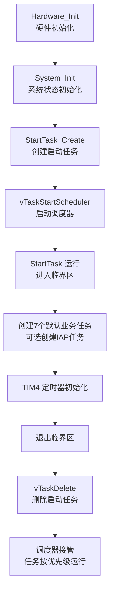
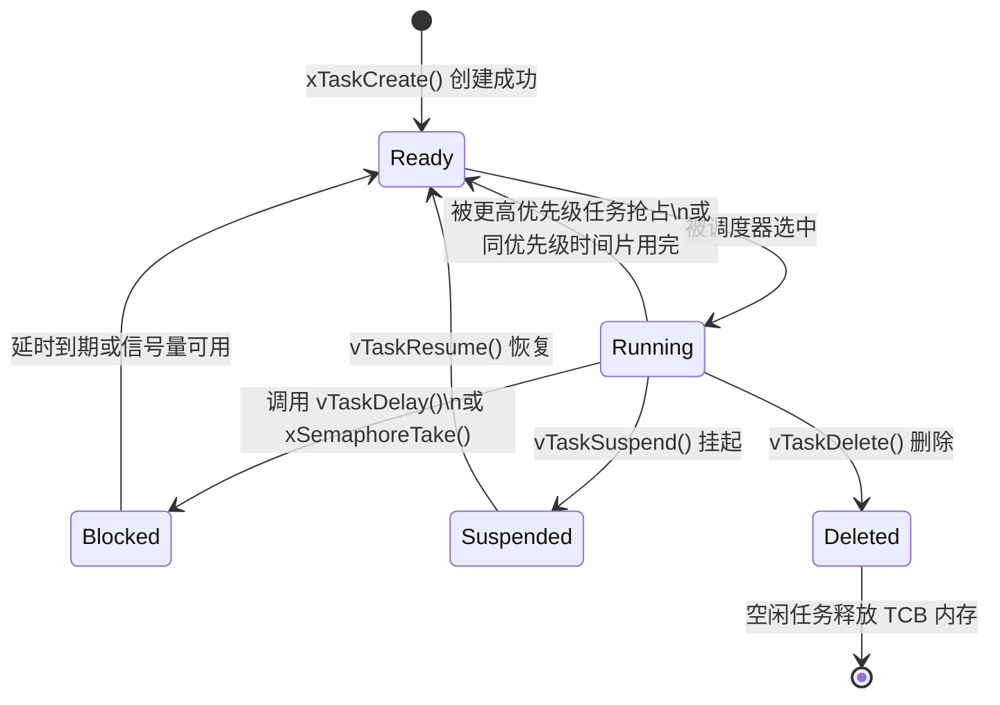
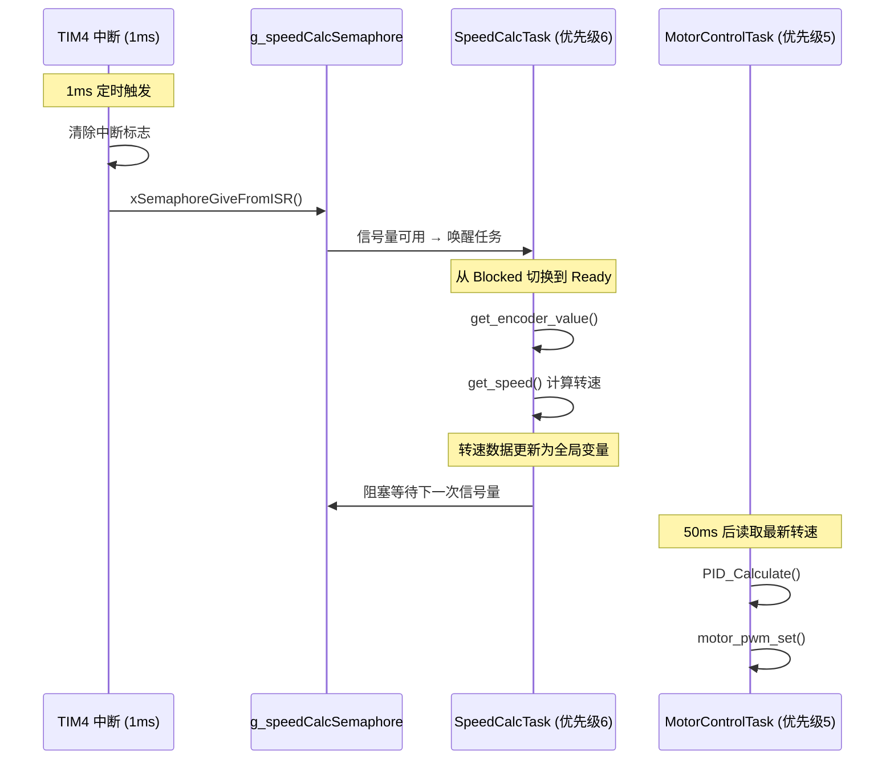
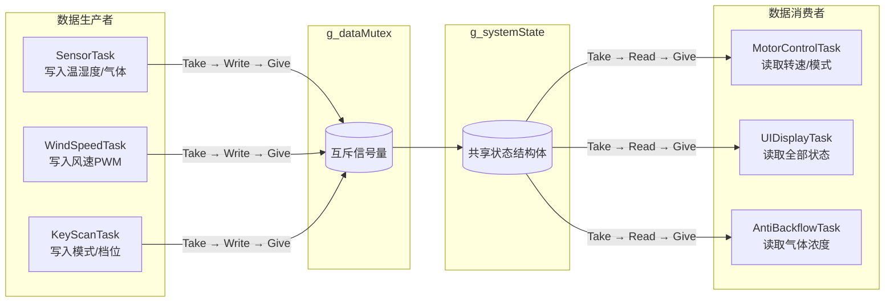

# 任务创建、调度与优先级设计

<!-- WIKI_NAV_START -->
> [!info] RTOS Wiki 导航
> [[projects/RTOS项目/index|项目首页]] · [[3.1 FreeRTOS 移植与配置详解|← 上一篇：3.1 FreeRTOS 移植与配置详解]] · [[3.3 中断优先级配置与临界区保护|下一篇：3.3 中断优先级配置与临界区保护 →]]
<!-- WIKI_NAV_END -->

> **实现状态（源码审计后）**：应用任务均由 `xTaskCreate()` 动态创建。默认常驻业务任务为7个；IAP任务可选。FreeRTOS还自动创建Idle和Timer Service任务，不能把业务任务数量与内核任务数量混为一谈。

本文档阐述任务创建模式、调度策略以及优先级分配方案。

## FreeRTOS 调度策略配置

FreeRTOS 的调度行为由 `FreeRTOSConfig.h` 中的关键宏控制。本项目同时启用了**抢占式调度**和**时间片调度**两种机制，形成"优先级抢占为主、同级时间片轮转为辅"的调度模型。

| 配置宏 | 值 | 含义 |
|--------|------|------|
| `configUSE_PREEMPTION` | 1 | 启用抢占式内核，高优先级任务可立即抢占低优先级任务 |
| `configUSE_TIME_SLICING` | 1 | 同优先级任务通过时间片轮转共享 CPU |
| `configUSE_PORT_OPTIMISED_TASK_SELECTION` | 1 | 利用 Cortex-M3 硬件前导零指令 (CLZ) 加速就绪任务查找 |
| `configTICK_RATE_HZ` | 1000 | 系统节拍 1ms，决定 `delay_ms()` 的精度和调度粒度 |
| `configMAX_PRIORITIES` | 32 | 最大支持 32 个优先级等级（0 为最低的空闲任务优先级） |
| `configIDLE_SHOULD_YIELD` | 1 | 空闲任务主动让出 CPU 给同优先级用户任务 |
| `configMINIMAL_STACK_SIZE` | 130 | 空闲任务栈大小（单位：字） |

抢占式调度的核心语义是：**只要就绪队列中出现更高优先级的任务，当前运行任务立即被挂起**。这在第 1026-1033 行的 `prvAddNewTaskToReadyList` 函数中有清晰体现——当新创建的任务优先级高于当前任务时，立即调用 `taskYIELD_IF_USING_PREEMPTION()` 触发上下文切换。

Sources: `FreeRTOS/include/FreeRTOSConfig.h#L89-L98`

## 任务创建架构：Start Task 模式

本项目采用经典的 **Start Task（启动任务）模式**进行任务初始化：先创建一个临时的高优先级启动任务，在该任务的临界区内批量创建所有业务任务，最后删除自身。这种模式确保所有任务的初始化按预期顺序完成，避免调度器在任务未完全就绪时就分配 CPU 时间。



启动任务的创建代码位于 `main.c` 的 `StartTask_Create()` 函数中，使用动态内存分配的 `xTaskCreate()` API：

```c
xTaskCreate(StartTask, "StartTask", TASK_START_STK_SIZE, NULL, 
            TASK_START_PRIORITY, &xStartTaskHandle);
```

启动任务的主体逻辑在 `app_tasks.c` 中，采用**临界区保护**确保所有子任务的创建是一个原子操作：

```c
void StartTask(void *pvParameters)
{
    taskENTER_CRITICAL();   /* 进入临界区 - 禁止调度切换 */
    
    /* 在临界区内创建所有业务任务 */
    xTaskCreate(KeyScanTask, "KeyScan", ...);
    xTaskCreate(SensorTask, "Sensor", ...);
    xTaskCreate(WindSpeedTask, "WindSpeed", ...);
    xTaskCreate(MotorControlTask, "Motor", ...);
    xTaskCreate(UIDisplayTask, "UI", ...);
    xTaskCreate(AntiBackflowTask, "AntiBF", ...);
    xTaskCreate(SpeedCalcTask, "SpeedCalc", ...);
    
    /* 初始化 TIM4 定时器（必须在信号量创建后调用） */
    TIM4_init(5-1, 14400-1);
    
    taskEXIT_CRITICAL();    /* 退出临界区 - 恢复调度 */
    
    /* 删除自身 */
    vTaskDelete(xStartTaskHandle);
}
```

启动任务的优先级设为 1（`TASK_START_PRIORITY`），栈大小仅 64 字，因为它只是一个临时的"播种者"——创建完成后即被回收。

Sources: `USER/main.c#L92-L110`, `APP_TASK/app_tasks.c#L136-L192`

## 任务优先级分配方案

任务优先级的设计遵循**实时性需求导向**原则：对响应时间要求越高的任务，优先级越高。本项目定义了从 1 到 7 共 7 个优先级层次，按功能重要性递增排列。

| 优先级 | 任务名称 | 栈大小 | 执行周期 | 调度方式 | 设计理由 |
|:------:|----------|:------:|:--------:|:--------:|----------|
| **7** | IAPTask | 256 | 事件驱动 | 信号量阻塞 | 固件升级是关键操作，必须最高优先级确保不丢数据 |
| **6** | SpeedCalcTask | 128 | TIM4每1ms通知；约50次调用计算原始速度 | 二值信号量 | 中断只通知，计算在任务上下文完成 |
| **5** | MotorControlTask | 256 | 50ms | `delay_ms` | 电机 PID 控制环路，直接影响用户体验和安全 |
| **4** | KeyScanTask | 64 | 10ms | `delay_ms` | 按键响应需要足够快的扫描频率，避免用户感知延迟 |
| **3** | SensorTask | 128 | 500ms | `delay_ms` | 温湿度和气体传感器采集，物理量变化缓慢 |
| **3** | WindSpeedTask | 64 | 100ms | `delay_ms` | 风速计算，依赖传感器数据，中等实时性需求 |
| **2** | AntiBackflowTask | 64 | 100ms | `delay_ms` | 防回流模式检测，安全相关但有阈值容错空间 |
| **1** | StartTask | 64 | 一次性 | 自删除 | 临时任务，创建完成后立即销毁 |
| **1** | UIDisplayTask | 256 | 200ms | `delay_ms` | UI 刷新，人眼不敏感于 200ms 延迟，最低优先级 |

这一优先级分配的关键设计决策有三：

**第一，SpeedCalcTask 优先级（6）高于 MotorControlTask（5）。** 速度计算任务由 TIM4 中断通过二值信号量唤醒，属于中断驱动的硬实时任务。如果测速延迟，PID 控制环路将基于过时数据计算输出，导致电机转速波动。

**第二，SensorTask 和 WindSpeedTask 共享优先级 3。** 这意味着在同一优先级下，它们通过时间片轮转获得 CPU。由于两个任务都使用 `delay_ms()` 阻塞等待，在任一任务阻塞期间另一个任务可以独占 CPU，时间片机制实际上不会频繁触发。

**第三，UIDisplayTask 优先级最低（1）。** LCD 显示是非实时功能，即使偶尔被高优先级任务延迟刷新也不会影响系统功能。这体现了"将最不关键的功能置于最低优先级"的设计原则。

Sources: `APP_TASK/app_tasks.h#L76-L97`

## 任务状态生命周期

FreeRTOS 中每个任务在其生命周期中经历以下状态转换。理解这些状态对于分析任务调度行为至关重要。



在本项目的运行时行为中，大部分业务任务处于 **Ready ↔ Blocked** 的循环中。以 SensorTask 为例：任务在 `DHT_Read_Data()` 和 `MQ2_GetGasConcentration()` 中读取传感器数据后，调用 `delay_ms(500)` 进入 Blocked 状态 500ms，到期后自动回到 Ready 状态等待调度器分配 CPU。

而 **StartTask** 的生命周期最为特殊：它在 `StartTask_Create()` 中被创建为 Ready 状态，被调度器选中后进入 Running 状态，在临界区内完成所有子任务创建，最后调用 `vTaskDelete()` 直接进入 Deleted 状态。空闲任务（优先级 0）会在后台负责回收其 TCB 和栈内存。

Sources: `APP_TASK/app_tasks.c#L145-L192`, `FreeRTOS/include/task.h#L112-L120`

## 任务阻塞与唤醒机制

本项目使用三种不同的任务阻塞/唤醒机制，每种机制适用于不同的场景。

| 阻塞机制 | 使用任务 | 触发源 | 唤醒条件 | 场景特点 |
|----------|----------|--------|----------|----------|
| `delay_ms()` | KeyScan, Sensor, WindSpeed, MotorControl, UI | 系统节拍中断 | 固定延时到期 | 周期性执行，时间精度要求适中 |
| 二值信号量 `g_speedCalcSemaphore` | SpeedCalcTask | TIM4 中断 | ISR 调用 `xSemaphoreGiveFromISR()` | 中断驱动，要求立即响应 |
| 二值信号量 `g_iapSemaphore` | IAPTask | DMA 中断 | ISR 调用 `xSemaphoreGiveFromISR()` | 固件数据接收完成事件 |

`delay_ms()` 的实现基于 `vTaskDelay()`，它将当前任务的 TCB 插入**延时列表**（`xDelayedTaskList1` 或 `xDelayedTaskList2`），每个系统节拍（1ms）由 SysTick 中断检查是否有任务到期。这是最简单的阻塞方式，但无法响应外部事件提前唤醒。

二值信号量则提供了**事件驱动**的阻塞/唤醒语义。以 SpeedCalcTask 为例，它在循环中调用 `xSemaphoreTake(g_speedCalcSemaphore, portMAX_DELAY)` 无限期阻塞等待，直到 TIM4 中断在 `TIM4_IRQHandler` 中调用 `xSemaphoreGiveFromISR()` 释放信号量。`portMAX_DELAY` 参数表示任务可以无限期等待，不会超时返回。



ISR 中的 `portYIELD_FROM_ISR(xHigherPriorityTaskWoken)` 调用确保了：**当信号量唤醒了一个优先级高于当前运行任务的任务时，中断返回后立即切换到被唤醒的任务**，而非继续执行被中断的低优先级代码。这正是抢占式调度在中断上下文中的体现。

Sources: `APP_TASK/app_tasks.c#L783-L799`, `APP_TASK/app_tasks.c#L825-L839`

## 任务间数据共享与互斥保护

多个任务需要读写共享的 `g_systemState` 全局状态结构体。本项目通过互斥信号量 `g_dataMutex` 保护对共享数据的访问，防止数据竞争。



在代码实现中，互斥锁的粒度经过精心设计。SensorTask 中对温度和气体浓度分别使用独立的临界区段，而非用一把锁保护所有传感器数据：

```c
/* 读取DHT11数据 - 使用独立临界区 */
if (xSemaphoreTake(g_dataMutex, portMAX_DELAY) == pdTRUE)
{
    g_systemState.temperature = temp;
    g_systemState.humidity = humi;
    xSemaphoreGive(g_dataMutex);
}

/* 读取MQ2数据 - 使用独立临界区 */
gasValue = MQ2_GetGasConcentration();
if (xSemaphoreTake(g_dataMutex, portMAX_DELAY) == pdTRUE)
{
    g_systemState.gasConcentration = gasValue;
    xSemaphoreGive(g_dataMutex);
}
```

这种细粒度锁定的设计原因在代码注释中明确说明：**如果获取两把传感器数据使用同一把锁，会导致占用资源时间过长，更容易带来优先级反转问题**。通过缩短每个临界区的持锁时间，降低了高优先级任务因等待低优先级任务释放锁而被阻塞的概率。

互斥信号量（Mutex）与二值信号量（Binary Semaphore）的关键区别在于**优先级继承**机制：当高优先级任务等待低优先级任务持有的互斥锁时，FreeRTOS 会临时提升低优先级任务的优先级到等待者的级别，以加速临界区的执行，减少优先级反转的持续时间。

Sources: `APP_TASK/app_tasks.c#L121-L131`, `APP_TASK/app_tasks.c#L262-L284`

## 软件定时器任务

FreeRTOS 的软件定时器服务运行在一个独立的高优先级任务中，其配置如下：

| 参数 | 值 | 说明 |
|------|------|------|
| `configUSE_TIMERS` | 1 | 启用软件定时器 |
| `configTIMER_TASK_PRIORITY` | 31 (`configMAX_PRIORITIES-1`) | 定时器任务优先级，仅次于系统内部 |
| `configTIMER_TASK_STACK_DEPTH` | 260 (`configMINIMAL_STACK_SIZE*2`) | 定时器任务栈大小 |
| `configTIMER_QUEUE_LENGTH` | 5 | 定时器命令队列长度 |

软件定时器任务的优先级被设为 31（`configMAX_PRIORITIES - 1`），这是系统中除了 FreeRTOS 内部保留优先级外最高的用户可用优先级。这意味着定时器回调函数的执行优先级高于所有应用任务。在 `vTaskStartScheduler()` 中，软件定时器任务会在空闲任务创建成功后、调度器正式启动前被创建。

Sources: `FreeRTOS/include/FreeRTOSConfig.h#L147-L150`, `FreeRTOS/tasks.c#L1868-L1879`

## 内存分配与栈规划

所有任务均使用 `xTaskCreate()` 进行动态内存分配，内存来源于 `configTOTAL_HEAP_SIZE` 定义的 10KB 堆空间。以下是各任务的栈占用总览：

| 任务 | 栈大小（字） | 栈大小（字节） | 说明 |
|------|:------------:|:--------------:|------|
| SpeedCalcTask | 128 | 512 | 编码器读取 + 速度计算 |
| MotorControlTask | 256 | 1024 | PID 计算 + 电机控制 |
| SensorTask | 128 | 512 | DHT11 + MQ2 读取 |
| WindSpeedTask | 64 | 256 | 纯算法计算 |
| KeyScanTask | 64 | 256 | 按键状态机 |
| UIDisplayTask | 256 | 1024 | LCD 显示 + sprintf |
| AntiBackflowTask | 64 | 256 | 简单阈值判断 |
| IAPTask（可选） | 256 | 1024 | 仅 `ifopen=1` 时存在 |
| 空闲任务 | 130 | 520 | FreeRTOS 自动创建 |
| 定时器任务 | 260 | 1040 | FreeRTOS 自动创建 |
| **默认稳态合计** | **1350** | **5400** | 7个业务任务 + Idle + Timer，不含TCB/队列等开销 |
| **启动瞬时合计** | **1414** | **5656** | 额外包含尚未删除的StartTask |
| **启用IAP后的启动峰值** | **1670** | **6680** | 再加IAPTask；仍不含内核对象开销 |

UIDisplayTask 和 MotorControlTask 分配了较大的栈空间（256 字），这是因为前者需要 `sprintf()` 格式化显示字符串（涉及浮点数转换），后者需要进行 PID 浮点运算。栈空间不足会导致 HardFault 异常，具体排查方法请参阅 [[projects/RTOS项目/6 调试与优化/6.2 HardFault异常诊断与堆栈溢出检测|HardFault异常诊断与堆栈溢出检测]]。

Sources: `APP_TASK/app_tasks.h#L89-L97`, `FreeRTOS/include/FreeRTOSConfig.h#L121`

## 中断与任务的优先级协同

本项目的中断优先级设计与 FreeRTOS 任务调度紧密配合。FreeRTOS 通过 `configLIBRARY_MAX_SYSCALL_INTERRUPT_PRIORITY` 设定可安全调用 FreeRTOS API 的中断优先级上限为 3。

| 中断源 | 优先级 | 说明 |
|--------|:------:|------|
| SysTick | 15（最低） | 系统节拍，由 FreeRTOS 管理 |
| PendSV | 15（最低） | 上下文切换，由 FreeRTOS 管理 |
| TIM4 | 5 | 速度计算定时器 |
| TIM2 | 6 | 编码器溢出处理 |
| DMA1 Channel5 | 4 | 固件升级串口接收 |

优先级数值越大，实际优先级越低。优先级 ≥ 3 的中断（TIM4=5, TIM2=6, DMA=4）均可安全调用 `xSemaphoreGiveFromISR()` 等 FreeRTOS API。优先级 < 3 的中断则不受 FreeRTOS 管理，不能调用任何 API，也不会被 FreeRTOS 临界区屏蔽——这为未来可能的高优先级硬件中断（如紧急制动）预留了空间。

Sources: `FreeRTOS/include/FreeRTOSConfig.h#L184-L187`, `USER/main.c#L32-L36`

## 任务设计模式总结

本项目的任务架构体现了嵌入式 RTOS 开发中几种重要的设计模式，值得在面试和工程实践中反复咀嚼：

**Start Task 模式**解决的是"调度器启动前如何安全创建多个任务"的问题。通过在临界区内批量创建，避免了任务间的初始化竞争。

**中断-任务解耦模式**（SpeedCalcTask）将硬件中断的处理延迟到任务上下文中执行，既满足了实时性要求，又避免了在 ISR 中执行复杂计算的风险。

**细粒度互斥模式**通过为不同数据组使用独立的临界区，最大限度减少了优先级反转的影响范围。

**优先级分层模型**将功能按实时性需求分为硬实时（速度计算）、软实时（电机控制、按键扫描）和非实时（UI 显示）三个层次，确保系统资源分配的合理性。

<!-- WIKI_FOOTER_START -->
---
> [!tip] 继续阅读
> [[projects/RTOS项目/index|项目首页]] · [[3.1 FreeRTOS 移植与配置详解|← 上一篇：3.1 FreeRTOS 移植与配置详解]] · [[3.3 中断优先级配置与临界区保护|下一篇：3.3 中断优先级配置与临界区保护 →]]
<!-- WIKI_FOOTER_END -->
