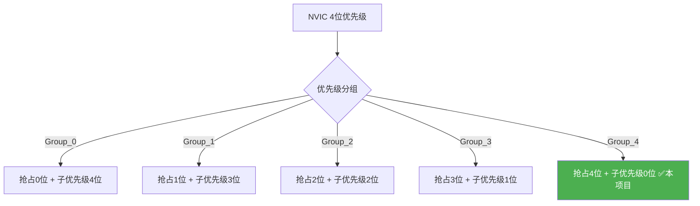
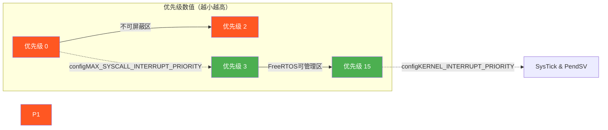
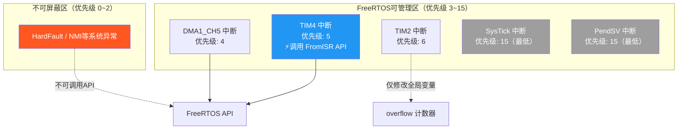
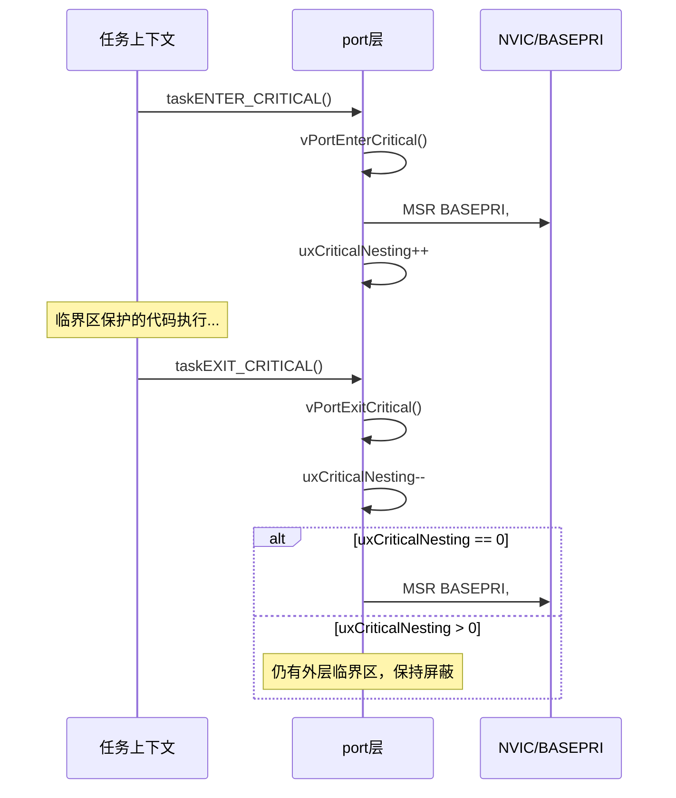
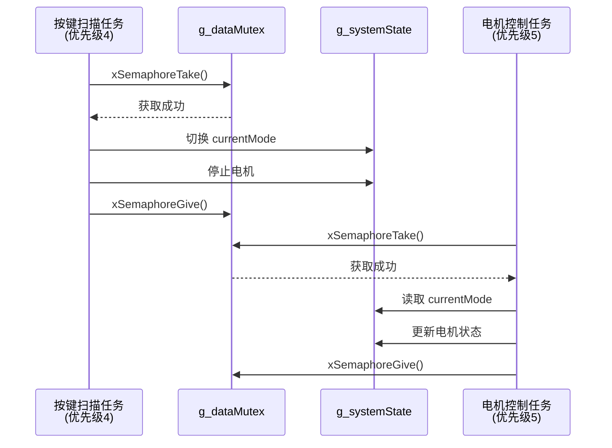
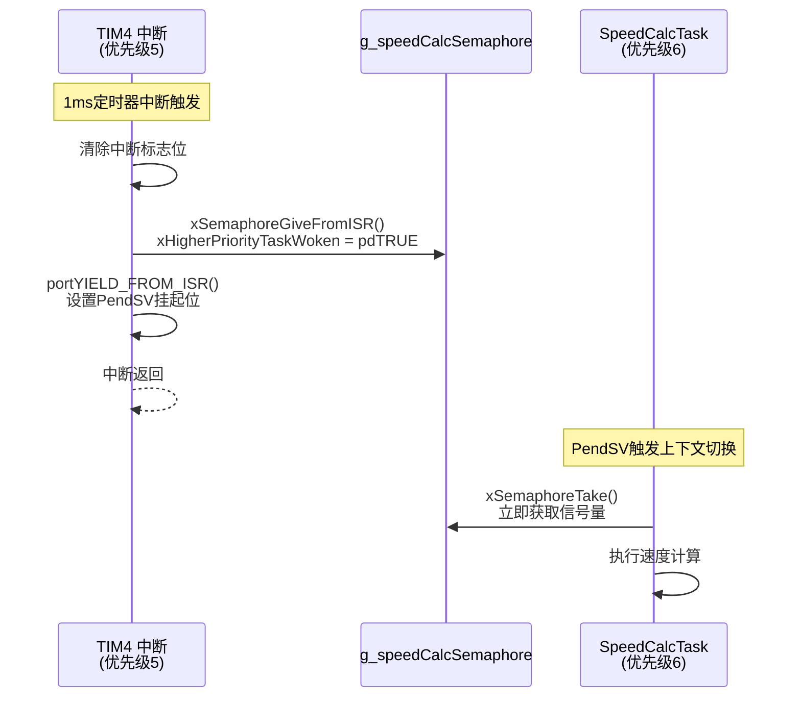

# 中断优先级配置与临界区保护

<!-- WIKI_NAV_START -->
> [!info] RTOS Wiki 导航
> [[projects/RTOS项目/index|项目首页]] · [[3.2 任务创建、调度与优先级设计|← 上一篇：3.2 任务创建、调度与优先级设计]] · [[3.4 软件定时器与周期任务实现|下一篇：3.4 软件定时器与周期任务实现 →]]
<!-- WIKI_NAV_END -->

> **实现状态（源码审计后）**：工程采用NVIC分组4；DMA/TIM4/TIM2优先级分别为4/5/6。数值越小优先级越高。调用FromISR API的DMA和TIM4均位于可调用内核API的范围；USART配置为3但当前IAP接收使用DMA链路。

本文解析NVIC优先级分组、FreeRTOS可管理阈值、安全FromISR API和临界区实现。

## Cortex-M3中断优先级体系与NVIC分组

STM32F103C8T6采用ARM Cortex-M3内核，其嵌套向量中断控制器（NVIC）支持4位优先级配置（共16级，数值越小优先级越高）。通过`NVIC_PriorityGroupConfig()`函数可将这4位拆分为**抢占优先级**和**子优先级**两部分。本项目在系统初始化阶段选择了`NVIC_PriorityGroup_4`分组方式，即全部4位均用于抢占优先级、子优先级占0位。

选择Group_4的原因与FreeRTOS内核机制密切相关：FreeRTOS不支持子优先级（Sub-Priority）的调度管理，将所有优先级位都用于抢占优先级可以最大化中断响应的灵活性。此时抢占优先级范围为0~15，共16级。

Sources: `USER/main.c#L31-L36`, `STM32F10x_FWLib/inc/misc.h#L78-L99`

## FreeRTOS中断优先级阈值配置

FreeRTOS通过两个关键宏定义划分出"可管理"与"不可管理"的中断边界。`configLIBRARY_MAX_SYSCALL_INTERRUPT_PRIORITY`定义了FreeRTOS能够屏蔽的最高中断优先级阈值，而`configLIBRARY_LOWEST_INTERRUPT_PRIORITY`定义了内核使用的最低优先级值。

本项目的FreeRTOSConfig.h中配置如下：**configLIBRARY_LOWEST_INTERRUPT_PRIORITY = 15**（SysTick和PendSV使用的最低优先级），**configLIBRARY_MAX_SYSCALL_INTERRUPT_PRIORITY = 3**（FreeRTOS可管理的最高中断优先级阈值）。这意味着优先级0~2的中断是"不可屏蔽"的，FreeRTOS无法屏蔽它们，这些中断的ISR也**不能调用任何FreeRTOS API**；优先级3~15的中断可以被FreeRTOS的BASEPRI机制屏蔽，其ISR可以安全调用以`FromISR`结尾的API。

FreeRTOS内部将这些逻辑优先级值左移到BASEPRI寄存器的高4位（`configPRIO_BITS`配置为4）。具体映射为：`configKERNEL_INTERRUPT_PRIORITY = 15 << 4 = 0xF0`（SysTick和PendSV设为此最低值），`configMAX_SYSCALL_INTERRUPT_PRIORITY = 3 << 4 = 0x30`（BASEPRI屏蔽阈值）。

| 配置宏 | 逻辑值 | 寄存器值 | 用途 |
|--------|--------|----------|------|
| `configLIBRARY_LOWEST_INTERRUPT_PRIORITY` | 15 | 0xF0 | SysTick、PendSV使用 |
| `configLIBRARY_MAX_SYSCALL_INTERRUPT_PRIORITY` | 3 | 0x30 | FreeRTOS可管理中断阈值 |
| 抢占优先级0~2 | 0~2 | 0x00~0x20 | 不可屏蔽，不可调用API |
| 抢占优先级3~15 | 3~15 | 0x30~0xF0 | 可被FreeRTOS管理 |

Sources: `FreeRTOS/include/FreeRTOSConfig.h#L178-L188`, `FreeRTOS/portable/RVDS/ARM_CM3/port.c#L293-L341`

## 项目中断优先级分配方案

本项目共涉及4个需要使用中断的外设模块，其优先级分配严格遵循FreeRTOS的规则：**需要调用FreeRTOS API的中断优先级必须≥3**（数值上大于或等于3）。

| 中断源 | 抢占优先级 | 子优先级 | 是否调用FreeRTOS API | 说明 |
|--------|-----------|----------|---------------------|------|
| DMA1_Channel5（串口DMA接收） | 4 | 0 | 否 | 固件升级时DMA接收数据 |
| TIM4（速度计算触发） | 5 | 0 | **是** `xSemaphoreGiveFromISR` | 每1ms触发，通知SpeedCalcTask |
| TIM2（编码器溢出） | 6 | 0 | 否 | 编码器计数溢出处理 |
| USART1（串口） | 3 | 3 | 否 | 预留，项目未实际使用 |

TIM4中断的优先级设置为5，高于configMAX_SYSCALL_INTERRUPT_PRIORITY阈值3（数值更大即逻辑优先级更低），因此可以安全调用`xSemaphoreGiveFromISR()`。TIM2中断仅修改全局计数变量`overflow`，不调用FreeRTOS API，但其优先级也被设为6以保持一致性。DMA中断设为4，在固件升级场景下用于接收串口数据。

Sources: `BSP/DMA/dma.c#L41-L45`, `BSP/MOTOR/motor.c#L228-L232`, `BSP/MOTOR/motor.c#L257-L261`, `SYSTEM/usart/usart.c#L93-L97`

## BASEPRI寄存器与临界区实现原理

Cortex-M3的BASEPRI寄存器是FreeRTOS实现中断屏蔽的核心硬件机制。当BASEPRI设为非零值时，所有优先级数值**大于等于**该值的中断将被屏蔽。FreeRTOS在移植层（portmacro.h）中定义了以下关键内联函数：

**vPortRaiseBASEPRI()**：将BASEPRI设为`configMAX_SYSCALL_INTERRUPT_PRIORITY`（0x30），屏蔽优先级3~15的中断。用于进入临界区。**vPortSetBASEPRI(0)**：将BASEPRI清零，解除所有中断屏蔽。用于退出临界区。**ulPortRaiseBASEPRI()**：保存当前BASEPRI值后设为阈值，返回原值。用于ISR中的临界区。

taskENTER_CRITICAL()的实现调用链为：`taskENTER_CRITICAL()` → `portENTER_CRITICAL()` → `vPortEnterCritical()` → `portDISABLE_INTERRUPTS()` → `vPortRaiseBASEPRI()`。在vPortEnterCritical()中还维护了一个`uxCriticalNesting`嵌套计数器，支持临界区的嵌套调用——只有当嵌套计数降为0时才真正解除中断屏蔽。

Sources: `FreeRTOS/portable/RVDS/ARM_CM3/portmacro.h#L143-L153`, `FreeRTOS/portable/RVDS/ARM_CM3/portmacro.h#L220-L262`, `FreeRTOS/portable/RVDS/ARM_CM3/port.c#L366-L391`

## 任务级临界区保护实践

本项目中，任务级临界区保护通过两种机制实现：**互斥信号量**用于保护共享数据的访问，**taskENTER_CRITICAL()/taskEXIT_CRITICAL()**用于保护临界区代码段。

### 互斥信号量保护共享状态

系统定义了全局互斥信号量`g_dataMutex`来保护`g_systemState`结构体的并发访问。所有需要读写系统状态的任务在操作前都必须先获取该互斥量。例如在模式切换函数`System_SwitchMode()`中，先调用`xSemaphoreTake(g_dataMutex, portMAX_DELAY)`获取互斥量，修改`currentMode`后调用`xSemaphoreGive(g_dataMutex)`释放。FreeRTOS的互斥信号量内置优先级继承机制，当高优先级任务等待低优先级任务持有的互斥量时，低优先级任务会临时提升到高优先级运行，有效避免了优先级反转问题。

### 任务创建的临界区保护

在`StartTask()`函数中，使用`taskENTER_CRITICAL()`和`taskEXIT_CRITICAL()`包裹所有任务创建和定时器初始化操作。这确保了在调度器运行期间，多个任务的创建过程不会被中断打断，避免了初始化过程中的竞态条件。退出临界区后，开始任务通过`vTaskDelete(xStartTaskHandle)`删除自身。

Sources: `APP_TASK/app_tasks.c#L34-L37`, `APP_TASK/app_tasks.c#L121-L131`, `APP_TASK/app_tasks.c#L145-L192`, `APP_TASK/app_tasks.c#L700-L770`

## 中断服务程序中的安全API调用

在中断上下文中，必须使用以`FromISR`结尾的FreeRTOS API变体。本项目中TIM4中断服务程序`TIM4_IRQHandler()`是典型的中断-任务同步案例。

TIM4配置为1ms周期中断，每次中断触发时通过`xSemaphoreGiveFromISR(g_speedCalcSemaphore, &xHigherPriorityTaskWoken)`释放二值信号量，唤醒等待中的`SpeedCalcTask`任务。关键参数`xHigherPriorityTaskWoken`用于指示是否需要触发上下文切换——当被唤醒的任务优先级高于当前被中断的任务时，该变量会被设为`pdTRUE`。

随后调用`portYIELD_FROM_ISR(xHigherPriorityTaskWoken)`宏，该宏在xHigherPriorityTaskWoken为pdTRUE时通过设置PendSV挂起位来触发上下文切换。中断返回后，PendSV中断将执行实际的任务切换，使SpeedCalcTask得以立即运行。

对比TIM2中断服务程序，其仅处理编码器溢出计数，不调用FreeRTOS API，因此实现更为简单直接——仅清除中断标志并更新`overflow`变量。

Sources: `APP_TASK/app_tasks.c#L804-L820`, `APP_TASK/app_tasks.c#L825-L839`

## 中断验证与断言保护

FreeRTOS在调试模式下提供了中断优先级验证机制。当`configASSERT`被定义时（本项目已定义），`portASSERT_IF_INTERRUPT_PRIORITY_INVALID()`宏会在调用FreeRTOS API的中断中检查当前中断优先级是否在可管理范围内。

该验证通过`vPortValidateInterruptPriority()`函数实现：首先通过`vPortGetIPSR()`获取当前执行的中断号，然后查找该中断在NVIC优先级寄存器中的配置值，最后断言该值必须大于等于`configMAX_SYSCALL_INTERRUPT_PRIORITY`。如果违反此规则（例如优先级为0~2的中断调用了FreeRTOS API），断言将触发`vAssertCalled()`输出错误信息并停止执行。

此外，函数还验证优先级分组是否为纯抢占模式——通过读取AIRCR寄存器的PRIGROUP字段，确保没有子优先级位被使用。这为开发者提供了双重安全保障。

Sources: `FreeRTOS/portable/RVDS/ARM_CM3/port.c#L643-L701`, `FreeRTOS/include/FreeRTOSConfig.h#L82-L84`

## 关键设计原则总结

在本项目的中断与临界区设计中，遵循了以下核心原则：

1. **统一优先级分组**：使用NVIC_PriorityGroup_4，全抢占无子优先级，与FreeRTOS兼容
2. **阈值划分清晰**：优先级0~2为不可屏蔽区（系统异常），3~15为FreeRTOS可管理区
3. **API调用规范**：ISR中只使用FromISR变体API，并在必要时触发上下文切换
4. **数据保护层次化**：互斥信号量保护共享状态结构体，临界区保护初始化序列
5. **中断服务精简化**：ISR仅完成最小工作（设置标志、释放信号量），计算逻辑委托给任务

这些设计确保了系统在多任务与多中断并发场景下的实时响应能力和数据一致性。

<!-- WIKI_FOOTER_START -->
---
> [!tip] 继续阅读
> [[projects/RTOS项目/index|项目首页]] · [[3.2 任务创建、调度与优先级设计|← 上一篇：3.2 任务创建、调度与优先级设计]] · [[3.4 软件定时器与周期任务实现|下一篇：3.4 软件定时器与周期任务实现 →]]
<!-- WIKI_FOOTER_END -->
