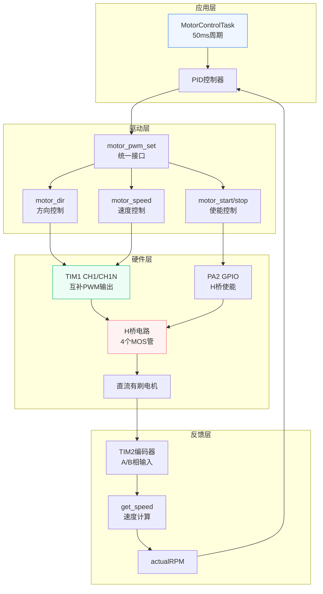
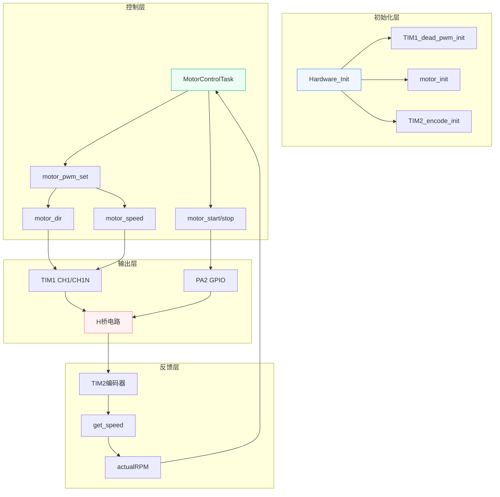
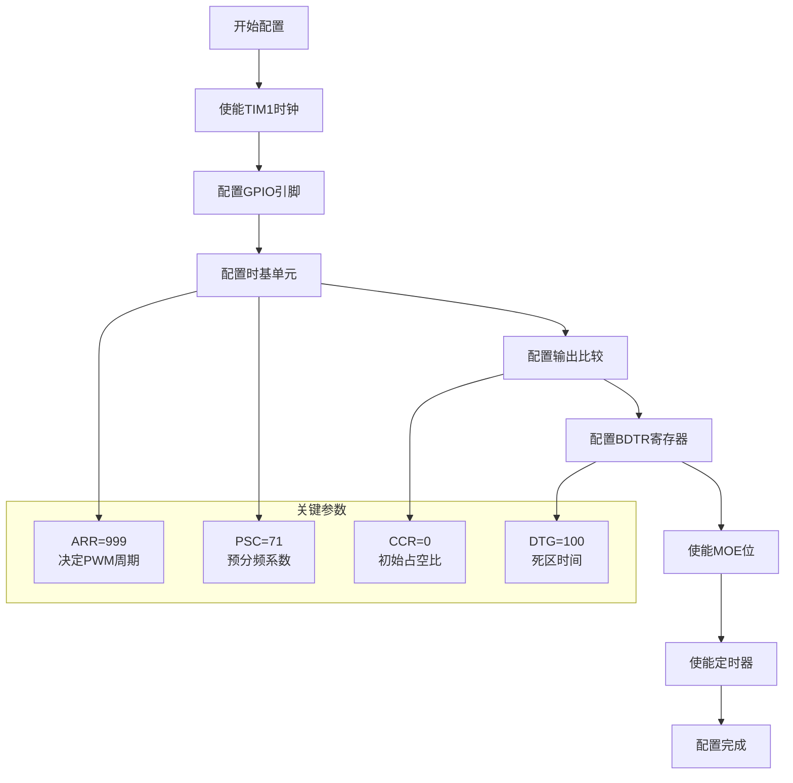
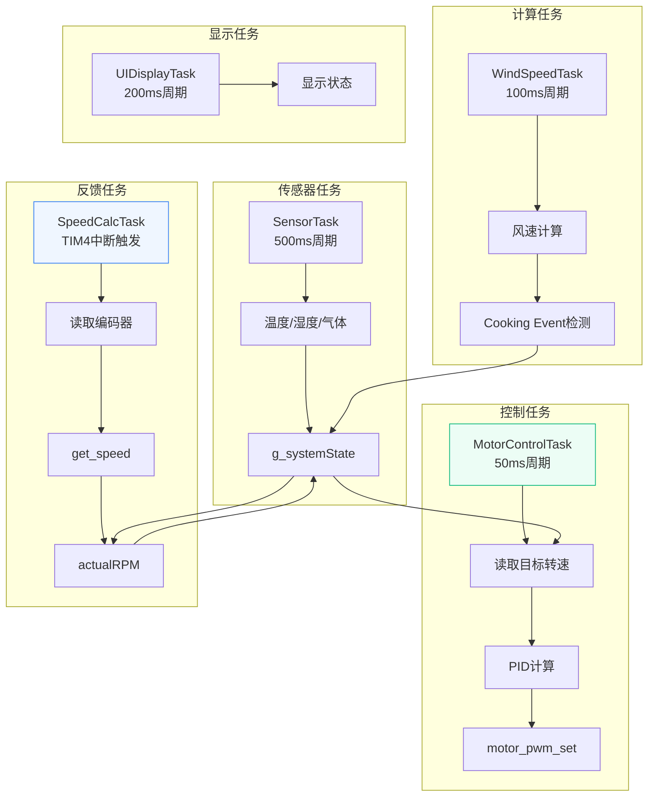

# 直流有刷电机驱动：H桥电路与PWM互补输出

<!-- WIKI_NAV_START -->
> [!info] RTOS Wiki 导航
> [[projects/RTOS项目/index|项目首页]] · [[3.4 软件定时器与周期任务实现|← 上一篇：3.4 软件定时器与周期任务实现]] · [[4.1.2 编码器测速原理与定时器编码器模式|下一篇：4.1.2 编码器测速原理与定时器编码器模式 →]]
<!-- WIKI_NAV_END -->

> **实现状态（源码审计后）**：活动代码使用TIM1 CH1/CH1N、PA2使能、PWM1、CKD_DIV4和DTG=100，死区约5.56μs；带BKIN刹车的另一个初始化函数位于 `#if 0`，属于未启用扩展。

本文档解析H桥、PWM互补输出、死区配置和电机控制接口。

## 电机驱动架构概述

直流有刷电机驱动系统采用分层架构设计，从底层硬件到上层应用形成完整的控制链路。系统以STM32F103的TIM1高级定时器为核心，产生互补PWM信号驱动H桥电路，通过改变占空比实现电机转速的精确控制。



Sources: `BSP/MOTOR/motor.c#L1-L346`, `BSP/MOTOR/motor.h#L1-L43`, `APP_TASK/app_tasks.c#L331-L475`

## H桥电路工作原理

H桥电路是电机驱动的核心，由4个MOS管组成桥式结构，通过控制对角MOS管的导通来改变电流方向，从而实现电机的正转和反转。

### H桥电路结构

H桥电路采用全桥拓扑，包含4个功率MOS管（Q1-Q4）和1个直流有刷电机。电路的关键在于**对角导通原则**：

- **正转**：Q1（左上）和Q4（右下）同时导通，电流从电源正极→Q1→电机→Q4→GND
- **反转**：Q3（右上）和Q2（左下）同时导通，电流从电源正极→Q3→电机→Q2→GND
- **禁止状态**：同侧上下管（如Q1和Q2）不能同时导通，否则会造成电源对地短路


### 电流路径分析

H桥的工作状态可以通过电流路径来理解。当需要电机正转时，控制逻辑确保Q1和Q4导通，形成完整的电流回路；反转时则切换为Q3和Q2导通。这种设计使得电机能够双向旋转，非常适合需要双向控制的油烟机风机应用。

**关键安全约束**：
- 同侧上下管不能同时导通（直通保护）
- 方向切换时必须先关断所有MOS管，再开启目标MOS管
- 需要插入死区时间防止切换瞬间的短暂直通

Sources: , `BSP/MOTOR/motor.c#L136-L149`

## PWM波形生成原理

PWM（脉冲宽度调制）是电机调速的基础，通过快速开关电源并改变占空比来控制电机平均电压，从而实现转速调节。

### PWM生成机制

STM32的TIM1定时器通过比较计数器CNT和比较值CCR来生成PWM波形。在PWM模式1下，当CNT < CCR时输出高电平，CNT ≥ CCR时输出低电平。

```mermaid
graph LR
    subgraph "TIM1定时器"
        A[时钟源<br/>72MHz] --> B[预分频器<br/>PSC=71]
        B --> C[计数器CNT<br/>0→999]
        C --> D[比较器]
        D --> E[输出逻辑<br/>PWM模式1]
    end
    
    subgraph "PWM输出"
        F[CCR比较值] --> D
        E --> G[CH1输出<br/>PA8]
        E --> H[CH1N输出<br/>PB13]
    end
    
    subgraph "波形特性"
        I[占空比 = CCR/ARR+1]
        J[频率 = 72MHz/(PSC+1)/(ARR+1)]
    end
```

### 关键计算公式

```
PWM频率 = 定时器时钟 / (PSC+1) / (ARR+1)
本项目：72MHz / 72 / 1000 = 1kHz

占空比 = CCR / (ARR+1)
本项目ARR=999，所以占空比 = CCR / 1000

平均电压 = 电源电压 × 占空比
例：12V × 50% = 6V
```


### PWM 代码实现

TIM1的PWM初始化通过`TIM1_dead_pwm_init`函数完成，该函数配置了完整的PWM生成环境：

```c
void TIM1_dead_pwm_init(u16 arr, u16 psc, u16 ccr, u16 dtg)
{
    // ① 开时钟（TIM1 在 APB2 总线上）
    RCC_APB2PeriphClockCmd(RCC_APB2Periph_TIM1, ENABLE);

    // ② 配引脚
    io_set(GPIOA, GPIO_Pin_8,  GPIO_Mode_AF_PP);  // PA8 = CH1（复用推挽）
    io_set(GPIOB, GPIO_Pin_13, GPIO_Mode_AF_PP);  // PB13 = CH1N（互补输出）
    io_set(GPIOA, GPIO_Pin_2,  GPIO_Mode_Out_PP); // PA2 = 普通GPIO，控制H桥使能

    // ③ 时基单元（决定 PWM 频率）
    // ARR=999, PSC=71 → 72MHz / 72 / 1000 = 1kHz

    // ④ 输出比较（决定占空比 + 互补输出）
    // PWM模式1, CH1 + CH1N 使能, CCR = 初始占空比（传0）

    // ⑤ BDTR（死区时间）
    // DTG=100, 本项目未用刹车功能

    // ⑥ 使能输出
    TIM_CtrlPWMOutputs(TIM1, ENABLE);  // MOE=1，高级定时器特有
    TIM_Cmd(TIM1, ENABLE);             // 计数器开始跑
}
```

Sources: , `BSP/MOTOR/motor.c#L77-L118`

## 互补输出与死区时间

互补输出和死区时间是电机驱动安全性的关键设计，确保H桥电路在方向切换时不会发生短路。

### 互补输出原理

TIM1高级定时器能够同时输出两路互补的PWM信号：CH1（主输出）和CH1N（互补输出）。这两路信号在相位上完全相反，用于驱动H桥的上下桥臂。

- **CH1高电平**：驱动上桥臂MOS管导通
- **CH1N高电平**：驱动下桥臂MOS管导通
- **互补关系**：CH1高时CH1N低，反之亦然

### 死区时间的重要性

在H桥电路中，当需要切换电流方向时，必须确保同一侧的上下桥臂不会同时导通。死区时间是在切换边沿插入的短暂"全关断"时间段，在此期间CH1和CH1N都输出低电平，确保所有MOS管都处于关断状态。


### 死区时间计算

```
死区时间 = DTG × (1 / 死区时钟)
死区时钟 = 定时器时钟 / CKD = 72MHz / 4 = 18MHz
本项目：100 / 18MHz ≈ 5.6μs
```

### 互补输出代码实现

死区时间通过BDTR（Break and Dead-Time Register）寄存器配置：

```c
/* 配置BDTR寄存器 */
TIM_BDTRStructInit(&TIM_BDTRInitStructure);                 // 将BDTR初始为默认值后初始化
TIM_BDTRInitStructure.TIM_DeadTime = dtg;                   // 设置死区时间
TIM_BDTRInitStructure.TIM_OSSRState = TIM_OSSRState_Enable; // OSSR位设置为1
TIM_BDTRInitStructure.TIM_OSSIState = TIM_OSSIState_Disable; // OSSI位设置为0
TIM_BDTRInitStructure.TIM_Break = TIM_Break_Disable;        // 注意：在本例程中没有用到刹车
TIM_BDTRInitStructure.TIM_BreakPolarity = TIM_BreakPolarity_Low; // BKIN低电平触发刹车
TIM_BDTRInitStructure.TIM_AutomaticOutput = TIM_AutomaticOutput_Enable; // 使能AOE位，刹车后自动恢复输出
TIM_BDTRConfig(TIM1, &TIM_BDTRInitStructure);               // BDTR初始化
```

Sources: , `BSP/MOTOR/motor.c#L107-L118`

## 电机控制函数详解

电机驱动模块提供了一套完整的控制函数，从底层硬件操作到上层应用接口，形成清晰的分层结构。

### 函数调用关系

电机控制模块采用三层架构：初始化层、控制层、输出层。每个函数都有明确的职责边界，确保代码的可维护性和可测试性。



### 核心控制函数

#### 统一输出接口：motor_pwm_set

```c
void motor_pwm_set(float para)
{
    int val = (int)para;

    if (val >= 0) 
    {
        motor_dir(stright);           /* 正转 */
        motor_speed(val);
    } 
    else 
    {
        motor_dir(invert);           /* 反转 */
        motor_speed(-val);
    }
}
```

这个函数是上层应用的主要接口，它根据输入值的正负自动判断电机转向，并设置相应的占空比。PID控制器输出的控制量直接传递给这个函数。

#### 方向控制：motor_dir

```c
void motor_dir(direction para)
{
    TIM_CCxCmd(TIM1, TIM_Channel_1, TIM_CCx_Disable);      // 关闭CH1通道PWM输出
    TIM_CCxNCmd(TIM1, TIM_Channel_1, TIM_CCxN_Disable);    // 关闭CH1N通道PWM输出

    if (para == stright)                /* 正转 */
    {
        TIM_CCxNCmd(TIM1, TIM_Channel_1, TIM_CCxN_Enable); // 开启互补通道输出
    } 
    else if (para == invert)           /* 反转 */
    {
        TIM_CCxCmd(TIM1, TIM_Channel_1, TIM_CCx_Enable);   // 开启CCX通道输出 
    }
}
```

**关键设计**：先全关两个通道，再开启目标通道。这种"先关后开"的策略可以防止方向切换时的短暂冲突。

#### 速度控制：motor_speed

```c
void motor_speed(u16 ccr)
{
    if(ccr <= 1000)    /* 限幅 */
    {
        TIM_SetCompare1(TIM1, ccr);    // 设置占空比
    }
}
```

CCR值直接决定PWM占空比，限幅在0-1000范围内（对应0-100%占空比）。

#### 安全控制：motor_stop

```c
void motor_stop(void)
{
    TIM_CCxCmd(TIM1, TIM_Channel_1, TIM_CCx_Disable);      // 关闭CH1通道PWM输出
    TIM_CCxNCmd(TIM1, TIM_Channel_1, TIM_CCxN_Disable);    // 关闭CH1N通道PWM输出
    io_reset_bit(GPIOA, GPIO_Pin_2);                        // 禁止驱动H桥电路
}
```

**三重保护机制**：
1. 关闭CH1通道 - 切断主输出信号
2. 关闭CH1N通道 - 切断互补输出信号
3. PA2拉低 - 切断H桥电源

Sources: `BSP/MOTOR/motor.c#L121-L168`, `BSP/MOTOR/motor.h#L27-L39`

## TIM1高级定时器配置详解

TIM1是STM32的高级定时器，具备普通定时器所没有的互补输出和死区时间控制功能，特别适合电机驱动应用。

### 配置流程

TIM1的配置遵循标准外设库的初始化流程，包括时钟使能、引脚配置、时基单元、输出比较、BDTR寄存器和最终使能六个步骤。



### 配置代码解析

#### 时钟使能与引脚配置

```c
RCC_APB2PeriphClockCmd(RCC_APB2Periph_TIM1, ENABLE);  // 使能定时器1时钟
io_set(GPIOA, GPIO_Pin_8, GPIO_Mode_AF_PP);          // CH1输出引脚
io_set(GPIOB, GPIO_Pin_13, GPIO_Mode_AF_PP);         // CH1N互补输出引脚
io_set(GPIOA, GPIO_Pin_2, GPIO_Mode_Out_PP);         // 使能控制IO初始化，推挽输出
```

**引脚配置要点**：
- PA8和PB13必须配置为**复用推挽输出**，因为它们由TIM1硬件自动控制
- PA2是普通GPIO，用于控制H桥驱动芯片的使能端

#### 时基单元配置

```c
TIM_TimeBaseStructure.TIM_Period = arr;                    // 自动重装载值
TIM_TimeBaseStructure.TIM_Prescaler = psc;                 // 预分频值
TIM_TimeBaseStructure.TIM_ClockDivision = TIM_CKD_DIV4;   // 时钟分割
TIM_TimeBaseStructure.TIM_CounterMode = TIM_CounterMode_Up; // 向上计数模式
TIM_TimeBaseInit(TIM1, &TIM_TimeBaseStructure);
```

**时基参数计算**：
- **PWM频率** = 72MHz / (PSC+1) / (ARR+1) = 72MHz / 72 / 1000 = 1kHz
- **计数周期** = ARR+1 = 1000个计数
- **时钟分割** = CKD_DIV4，影响死区时间的时钟源

#### 输出比较配置

```c
TIM_OCInitStructure.TIM_OCMode = TIM_OCMode_PWM1;         // PWM模式1
TIM_OCInitStructure.TIM_OCPolarity = TIM_OCPolarity_High; // 输出极性高
TIM_OCInitStructure.TIM_OCNPolarity = TIM_OCPolarity_High; // 互补输出极性高
TIM_OCInitStructure.TIM_OutputState = TIM_OutputState_Enable; // 比较输出使能
TIM_OCInitStructure.TIM_OutputNState = TIM_OutputNState_Enable; // 互补输出使能
TIM_OCInitStructure.TIM_Pulse = ccr;                      // 初始占空比
TIM_OC1Init(TIM1, &TIM_OCInitStructure);
TIM_OC1PreloadConfig(TIM1, TIM_OCPreload_Enable);         // 使能预装载
```

**PWM模式选择**：
- **PWM模式1**：CNT < CCR时输出有效电平（高电平）
- **PWM模式2**：CNT < CCR时输出无效电平（低电平）
- 本项目使用PWM模式1，CCR=0时输出全低，电机不转

#### BDTR寄存器配置

```c
TIM_BDTRStructInit(&TIM_BDTRInitStructure);
TIM_BDTRInitStructure.TIM_DeadTime = dtg;                 // 死区时间
TIM_BDTRInitStructure.TIM_OSSRState = TIM_OSSRState_Enable;
TIM_BDTRInitStructure.TIM_OSSIState = TIM_OSSIState_Disable;
TIM_BDTRInitStructure.TIM_Break = TIM_Break_Disable;      // 未使用刹车功能
TIM_BDTRInitStructure.TIM_BreakPolarity = TIM_BreakPolarity_Low;
TIM_BDTRInitStructure.TIM_AutomaticOutput = TIM_AutomaticOutput_Enable;
TIM_BDTRConfig(TIM1, &TIM_BDTRInitStructure);
```

**BDTR寄存器关键位**：
- **DTG[7:0]**：死区时间发生器，控制死区时间长度
- **OSSR**：运行模式下关闭状态选择
- **OSSI**：空闲模式下关闭状态选择
- **BKE**：刹车功能使能
- **AOE**：自动输出使能，刹车后自动恢复

#### 最终使能

```c
TIM_CtrlPWMOutputs(TIM1, ENABLE);  // 使能MOE位
TIM_Cmd(TIM1, ENABLE);             // 使能TIM1
```

**MOE位的重要性**：
- MOE（Main Output Enable）是高级定时器特有的输出使能位
- 即使配置了所有PWM参数，如果MOE=0，PWM信号也不会从引脚输出
- 这是安全设计，确保在配置完成前不会意外输出

Sources: `BSP/MOTOR/motor.c#L77-L118`, `USER/main.c#L41-L46`

## 安全设计与保护机制

电机驱动的安全性设计是系统可靠运行的关键，本项目采用了多层次的安全保护机制。

### 初始化安全设计

电机初始化时采用保守策略，确保系统上电后电机处于安全状态：

```c
void motor_init(void)
{
    motor_dir(stright);   // 设置默认方向为正转
    motor_stop();         // 立即停止电机
    motor_start();        // 使能H桥（但CCR=0，电机不转）
}
```

**设计考虑**：
1. **默认正转**：为系统提供确定的初始状态
2. **立即停止**：确保电机不会意外启动
3. **使能H桥**：为后续控制做好准备，但CCR=0保证安全

### 运行时保护

#### 三重停止保护

```c
void motor_stop(void)
{
    TIM_CCxCmd(TIM1, TIM_Channel_1, TIM_CCx_Disable);      // ① 关闭CH1通道
    TIM_CCxNCmd(TIM1, TIM_Channel_1, TIM_CCxN_Disable);    // ② 关闭CH1N通道
    io_reset_bit(GPIOA, GPIO_Pin_2);                        // ③ PA2拉低，H桥断电
}
```

**保护层次**：
- **信号层保护**：关闭PWM输出通道，切断控制信号
- **电源层保护**：拉低PA2，切断H桥电源
- **冗余设计**：即使PA2被意外拉高，PWM信号也不会输出

#### 方向切换保护

```c
void motor_dir(direction para)
{
    // 先全关两个通道（确保切换干净）
    TIM_CCxCmd(TIM1, TIM_Channel_1, TIM_CCx_Disable);
    TIM_CCxNCmd(TIM1, TIM_Channel_1, TIM_CCxN_Disable);

    if (para == stright)
        TIM_CCxNCmd(..., TIM_CCxN_Enable);  // 正转：开 CH1N
    else
        TIM_CCxCmd(..., TIM_CCx_Enable);    // 反转：开 CH1
}
```

**切换策略**：
- **先关后开**：避免方向切换时的短暂冲突
- **全关状态**：确保所有MOS管都处于关断状态
- **单通道开启**：每次只开启一个通道，避免直通

#### 速度限幅保护

```c
void motor_speed(u16 ccr)
{
    if(ccr <= 1000)    /* 限幅 */
    {
        TIM_SetCompare1(TIM1, ccr);
    }
}
```

**限幅作用**：
- 防止CCR值超出ARR范围，避免异常PWM输出
- 确保占空比在0-100%范围内
- 保护电机和驱动电路

### 故障保护机制

#### 刹车功能（可选）

TIM1支持硬件刹车功能，可通过外部信号紧急停止PWM输出：

```c
// 刹车功能配置（本项目未使用，但保留接口）
TIM_BDTRInitStructure.TIM_Break = TIM_Break_Enable;
TIM_BDTRInitStructure.TIM_BreakPolarity = TIM_BreakPolarity_Low; // 低电平触发
TIM_BDTRInitStructure.TIM_AutomaticOutput = TIM_AutomaticOutput_Enable; // 自动恢复
```

**刹车功能特点**：
- **硬件响应**：无需软件干预，响应速度快
- **自动恢复**：AOE位使能后，刹车信号消失自动恢复输出
- **极性可配置**：支持高电平或低电平触发

#### 看门狗保护

虽然本项目未实现，但完整的电机驱动系统通常包含：
- **独立看门狗**：监控软件运行状态
- **窗口看门狗**：确保任务按时执行
- **电机堵转检测**：通过电流或编码器反馈检测异常

Sources: `BSP/MOTOR/motor.c#L121-L168`, `BSP/MOTOR/motor.h#L21-L24`

## 系统集成与任务协调

电机驱动模块在RTOS系统中与多个任务协调工作，形成完整的控制系统。

### 任务架构

电机控制采用**周期任务+事件驱动**的混合架构：



### MotorControlTask工作流程

MotorControlTask是电机控制的核心任务，根据不同的工作模式执行相应的控制策略：

```c
void MotorControlTask(void *pvParameters)
{
    float pidOutput;
    
    while (1)
    {
        u16 pwmCompare = 0;

        /* 获取实际转速 */
        if (xSemaphoreTake(g_dataMutex, portMAX_DELAY) == pdTRUE)
        {
            g_systemState.actualRPM = speed;
            xSemaphoreGive(g_dataMutex);
        }
        
        switch (g_systemState.currentMode)
        {
            case MODE_STANDBY:
                // 待机模式：电机停止
                motor_stop();
                break;
                
            case MODE_MANUAL:
                // 手动模式：PID控制
                PID_SetTarget(&g_speedPID, (float)g_systemState.targetRPM);
                pidOutput = PID_Calculate(&g_speedPID, speed);
                motor_pwm_set(pidOutput);
                break;
                
            case MODE_AUTO:
                // 自动模式：状态机控制
                switch (g_autoModeState)
                {
                    case AUTO_STATE_STARTUP:
                        // 启动阶段：最小转速运行
                        motor_pwm_set(PWM_MIN * 10);
                        break;
                        
                    case AUTO_STATE_COOKING:
                        // Cooking Event：风速算法控制
                        pwmCompare = WindSpeed_GetPWMCompare(MAXCCR);
                        motor_pwm_set(pwmCompare);
                        break;
                        
                    case AUTO_STATE_DELAY_OFF:
                        // 延时关闭：风速算法控制
                        pwmCompare = WindSpeed_GetPWMCompare(MAXCCR);
                        motor_pwm_set(pwmCompare);
                        break;
                }
                break;
                
            case MODE_ANTI_BACKFLOW:
                // 防回流模式：PID控制
                PID_SetTarget(&g_speedPID, (float)g_systemState.targetRPM);
                pidOutput = PID_Calculate(&g_speedPID, speed);
                motor_pwm_set(pidOutput);
                break;
        }
        
        delay_ms(50);   /* 50ms控制周期 */
    }
}
```

### 信号量与同步机制

电机控制涉及多个任务的协作，通过信号量实现同步：

1. **g_dataMutex**：保护共享数据结构`g_systemState`
2. **g_speedCalcSemaphore**：TIM4中断释放，SpeedCalcTask等待
3. **编码器溢出计数**：TIM2中断维护，确保计数连续性

Sources: `APP_TASK/app_tasks.c#L331-L475`, `APP_TASK/app_tasks.c#L300-L325`

## 常见问题与故障排查

电机驱动系统在实际应用中可能遇到各种问题，本节提供系统的排查方法和解决方案。

### 故障现象与原因分析

| 故障现象 | 可能原因 | 排查方法 |
|---------|---------|---------|
| **电机完全不转** | MOE位未使能 | 检查`TIM_CtrlPWMOutputs(TIM1, ENABLE)`调用 |
| | CCR值为0 | 检查CCR初始值和PID输出 |
| | PA2未拉高 | 检查PA2电平，确认`motor_start()`调用 |
| | PWM引脚配置错误 | 确认PA8/PB13为复用推挽输出 |
| **只能正转不能反转** | motor_dir函数问题 | 检查CH1和CH1N的Enable/Disable逻辑 |
| | 互补输出未使能 | 确认`TIM_OutputNState_Enable`设置 |
| **方向切换时电机抖动** | 未先全关再开 | 检查`motor_dir()`是否先Disable再Enable |
| | 死区时间不足 | 增加DTG值，确保死区时间足够 |
| **改了CCR但速度不变** | CCR超出ARR范围 | 检查`motor_speed()`的限幅逻辑 |
| | 预装载未使能 | 确认`TIM_OC1PreloadConfig`调用 |
| **电机发热严重** | PWM频率过低 | 提高PWM频率，减少开关损耗 |
| | 死区时间过长 | 优化DTG值，平衡安全性和效率 |

### 调试技巧

#### 示波器检查

使用示波器检查以下信号：
- **PA8（CH1）**：主PWM输出信号
- **PB13（CH1N）**：互补PWM输出信号
- **PA2**：H桥使能信号
- **电机两端**：实际驱动电压

#### 软件调试

在关键函数中添加调试代码：

```c
void motor_debug(void)
{
    // 检查TIM1状态
    printf("TIM1 CR1: 0x%04X\r\n", TIM1->CR1);
    printf("TIM1 BDTR: 0x%04X\r\n", TIM1->BDTR);
    printf("TIM1 CCR1: %d\r\n", TIM1->CCR1);
    
    // 检查GPIO状态
    printf("PA2: %d\r\n", GPIO_ReadOutputDataBit(GPIOA, GPIO_Pin_2));
    printf("PA8: %d\r\n", GPIO_ReadOutputDataBit(GPIOA, GPIO_Pin_8));
}
```

#### 逐步验证

按照以下顺序验证系统功能：
1. **GPIO验证**：确认PA2可以正常控制
2. **PWM验证**：单独测试PWM输出，不接电机
3. **方向验证**：测试motor_dir函数，观察波形变化
4. **速度验证**：测试motor_speed函数，观察占空比变化
5. **集成验证**：连接电机，测试完整功能

### 性能优化建议

#### PWM频率选择

- **过低频率**（<1kHz）：电机噪音大，转矩脉动明显
- **过高频率**（>20kHz）：开关损耗大，效率降低
- **推荐范围**：8-20kHz，平衡噪音和效率

#### 死区时间优化

- **过短死区**：可能导致直通，损坏MOS管
- **过长死区**：影响PWM波形质量，降低效率
- **优化方法**：根据MOS管开关特性选择最小安全死区

#### 控制周期优化

- **MotorControlTask**：50ms周期，满足大多数应用需求
- **SpeedCalcTask**：由TIM4中断触发，确保测速实时性
- **传感器任务**：500ms周期，足够捕捉环境变化

Sources: `BSP/MOTOR/motor.c#L1-L346`, `APP_TASK/app_tasks.c#L331-L475`

## 扩展功能与高级特性

TIM1高级定时器还支持多种扩展功能，可根据具体应用需求进行配置。

### 刹车功能配置

刹车功能提供硬件级的紧急停止能力：

```c
// 刹车功能配置示例
TIM_BDTRInitStructure.TIM_Break = TIM_Break_Enable;
TIM_BDTRInitStructure.TIM_BreakPolarity = TIM_BreakPolarity_Low;
TIM_BDTRInitStructure.TIM_AutomaticOutput = TIM_AutomaticOutput_Enable;
```

**应用场景**：
- **过流保护**：检测到过流时立即停止PWM输出
- **急停按钮**：外部硬件信号触发紧急停止
- **安全门**：安全门打开时自动停止电机

### 编码器接口集成

TIM2编码器模式提供电机实际转速的精确测量：

```c
// 编码器初始化
TIM_EncoderInterfaceConfig(TIM2, TIM_EncoderMode_TI12, 
                          TIM_ICPolarity_Rising, 
                          TIM_ICPolarity_Rising);
```

**编码器模式**：
- **TI1模式**：仅使用A相计数
- **TI2模式**：仅使用B相计数
- **TI12模式**：A、B相同时计数，4倍频，精度最高

### DMA传输支持

TIM1支持DMA请求，可用于：
- **占空比动态调整**：通过DMA自动更新CCR值
- **波形生成**：生成复杂的PWM波形序列
- **减少CPU负载**：DMA传输无需CPU干预

### 多通道同步

TIM1支持多个通道的同步输出：
- **CH1/CH1N**：主通道互补输出
- **CH2/CH2N**：第二通道互补输出
- **CH3/CH3N**：第三通道互补输出
- **CH4**：第四通道（无互补输出）

Sources: `BSP/MOTOR/motor.c#L16-L65`, `BSP/MOTOR/motor.h#L28-L37`

## 总结与最佳实践

直流有刷电机驱动是嵌入式控制系统的核心技术，通过本文档的详细解析，开发者可以掌握从硬件原理到软件实现的完整知识体系。

### 关键要点回顾

1. **H桥电路**：掌握对角导通原则，理解电流路径和方向控制
2. **PWM生成**：理解TIM1的PWM模式1工作原理，掌握频率和占空比计算
3. **互补输出**：理解CH1和CH1N的互补关系，掌握死区时间配置
4. **安全设计**：掌握三重保护机制，理解"先关后开"的切换策略
5. **系统集成**：理解电机驱动在RTOS系统中的任务协调机制

### 开发流程建议

1. **硬件先行**：先确保H桥电路和电机硬件正常工作
2. **分步验证**：按照GPIO→PWM→方向→速度的顺序逐步验证
3. **安全第一**：始终优先考虑安全性，避免直通和过流
4. **日志完善**：添加足够的调试信息，便于问题排查
5. **文档同步**：及时更新文档，记录设计决策和配置参数

### 常见设计陷阱

1. **MOE位遗漏**：配置了所有参数但忘记使能MOE位
2. **PA2混淆**：将PA2误认为TIM1通道，实际是普通GPIO
3. **互补输出误解**：认为CH1N需要单独配置占空比
4. **方向切换顺序**：未先全关再开，导致短暂冲突
5. **死区时间不足**：未考虑MOS管开关延迟，导致直通
6. **限幅缺失**：CCR值超出范围，导致异常PWM输出

### 面试准备要点

1. **原理阐述**：能够清晰解释H桥工作原理和PWM生成机制
2. **代码分析**：能够分析TIM1配置代码和电机控制函数
3. **问题排查**：能够诊断常见的电机驱动故障
4. **设计决策**：能够解释安全设计和性能优化的权衡
5. **系统视角**：能够从RTOS角度理解电机控制的任务协调

<!-- WIKI_FOOTER_START -->
---
> [!tip] 继续阅读
> [[projects/RTOS项目/index|项目首页]] · [[3.4 软件定时器与周期任务实现|← 上一篇：3.4 软件定时器与周期任务实现]] · [[4.1.2 编码器测速原理与定时器编码器模式|下一篇：4.1.2 编码器测速原理与定时器编码器模式 →]]
<!-- WIKI_FOOTER_END -->
