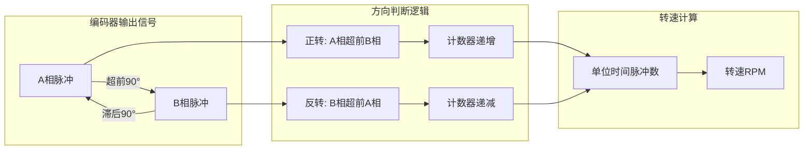
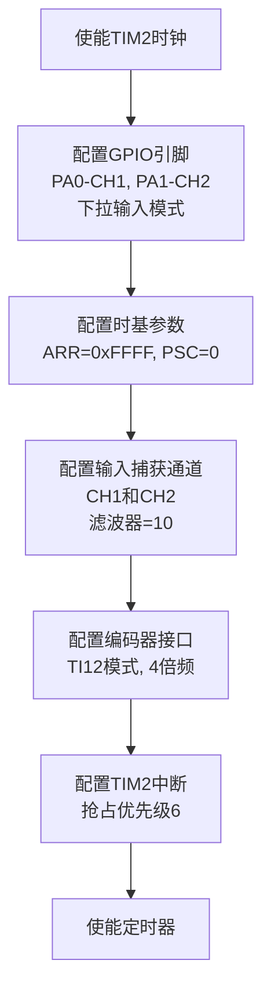
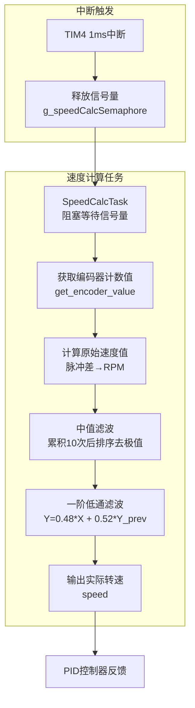
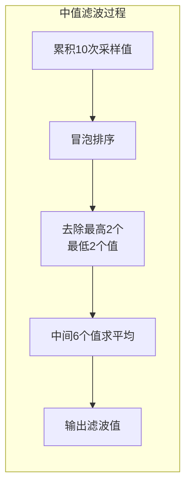
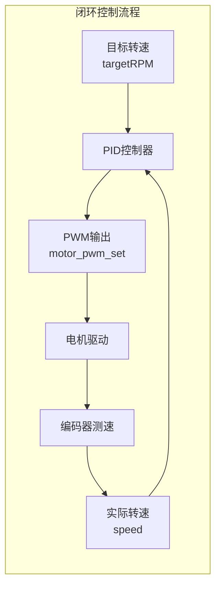

# 编码器测速原理与定时器编码器模式

<!-- WIKI_NAV_START -->
> [!info] RTOS Wiki 导航
> [[projects/RTOS项目/index|项目首页]] · [[4.1.1 直流有刷电机驱动：H桥电路与PWM互补输出|← 上一篇：4.1.1 直流有刷电机驱动：H桥电路与PWM互补输出]] · [[4.1.3 PID闭环调速算法实现与调参|下一篇：4.1.3 PID闭环调速算法实现与调参 →]]
<!-- WIKI_NAV_END -->

> **实现状态（源码审计后）**：TIM4硬件中断周期是1ms，每次只通知SpeedCalcTask；`get_speed(encode_value, 50)`内部累计约50次通知后才计算原始速度。它属于固定时间窗计数法，不是同时测量脉冲数和脉冲周期的M/T法。

本文档解析直流有刷电机的测速实现、TIM2编码器接口、TIM4通知链路和两级软件滤波。

## 编码器测速原理

增量式编码器是电机测速中最常用的传感器，它通过输出两路正交的脉冲信号（A相和B相）来反映电机的旋转状态。这两路信号存在90°的相位差，通过检测相位关系可以判断旋转方向，通过计数脉冲数量可以计算转速。



在本项目中，编码器采用11线规格，经过30:1的减速比后，电机每转一圈会产生 `11 × 30 = 330` 个脉冲。通过配置定时器的4倍频模式，可以进一步提高分辨率至 `330 × 4 = 1320` 个脉冲/转，显著提升测速精度。

Sources: `BSP/MOTOR/motor.c#L278-L285`

## STM32定时器编码器接口配置

STM32的通用定时器（TIM2、TIM3、TIM4、TIM5）具备硬件编码器接口功能，能够自动处理编码器信号的解码和计数。本项目使用TIM2作为编码器接口，配置为TI1和TI2同时计数的4倍频模式。

### 编码器接口初始化流程



### 关键配置参数

| 参数 | 配置值 | 说明 |
|------|--------|------|
| 定时器选择 | TIM2 | 通用定时器，支持编码器模式 |
| GPIO配置 | PA0(CH1), PA1(CH2) | 下拉输入模式，防止悬空 |
| ARR（自动重装载值） | 0xFFFF (65535) | 16位计数器最大值 |
| PSC（预分频值） | 0 | 不分频，72MHz计数频率 |
| 输入滤波器 | 10 | 滤除高频噪声干扰 |
| 编码器模式 | TIM_EncoderMode_TI12 | TI1和TI2同时计数（4倍频） |
| 中断优先级 | 抢占优先级6 | 低于FreeRTOS管理的中断阈值3 |

### 初始化代码解析

编码器初始化的核心代码位于 `TIM2_encode_init()` 函数中，该函数完成以下关键配置：

**输入捕获通道配置**：为CH1和CH2分别配置输入滤波器（值为10），滤除编码器信号中的高频噪声。滤波器值越大，滤波效果越强，但会引入一定的延迟。

**编码器接口配置**：调用 `TIM_EncoderInterfaceConfig()` 函数，选择TI12模式实现4倍频计数。在此模式下，定时器会在A相和B相的每个边沿（上升沿和下降沿）都进行计数，将分辨率提高4倍。

**溢出中断配置**：由于计数器为16位（最大值65535），当电机高速旋转或长时间运行时可能发生溢出。通过配置TIM2更新中断，在溢出时更新 `overflow` 变量，实现32位连续计数。

Sources: `BSP/MOTOR/motor.c#L200-L260`, `USER/main.c#L75-L76`

## 速度计算实现

TIM4每1ms产生一次中断并释放二值信号量；SpeedCalcTask每次被唤醒都读取累计计数，而 `get_speed(..., 50)` 在内部计满约50次调用后计算一次原始转速。

### 速度计算流程



### 编码器计数值获取

`get_encoder_value()` 函数负责将16位定时器计数值与溢出计数器组合成32位连续计数值：

```c
int get_encoder_value(void)
{
    u32 buffer;
    buffer = TIM_GetCounter(TIM2) + (overflow * 65536);
    return buffer;
}
```

其中 `overflow` 变量在TIM2中断服务程序中根据计数方向递增或递减，确保计数值的连续性。

Sources: `BSP/MOTOR/motor.c#L270-L275`, `APP_TASK/app_tasks.c#L780-L795`

### 转速计算公式

转速计算的核心公式为：

```
转速(RPM) = (当前计数 - 上次计数) × (1000/采样周期ms) × 60 / 减速比 / (编码器线数 × 倍频数)
```

代入本项目参数：
- 采样周期：50ms
- 减速比：30
- 编码器线数：11
- 倍频数：4

简化后：
```
转速(RPM) = (当前计数 - 上次计数) × 1000 / 50 × 60 / 30 / (11 × 4)
         = (当前计数 - 上次计数) × 9.09
```

Sources: `BSP/MOTOR/motor.c#L295-L300`

## 软件滤波算法

为了消除编码器信号的噪声干扰和测量波动，本项目采用两级滤波算法：中值滤波和一阶低通滤波。

### 中值滤波

中值滤波通过累积10次采样值，排序后去除最高2个和最低2个值，对中间6个值取平均。这种方法能有效消除脉冲干扰和偶然误差。



### 一阶低通滤波

一阶低通滤波采用递推算法，公式为：

```
Y(n) = q × X(n) + (1-q) × Y(n-1)
```

其中：
- `X(n)`：本次采样值
- `Y(n-1)`：上次滤波输出值
- `Y(n)`：本次滤波输出值
- `q`：滤波系数（本项目设为0.48）

滤波系数q越小，滤波效果越平滑，但对速度变化的响应越慢。本项目选择0.48的系数，在平滑性和响应速度之间取得平衡。

Sources: `BSP/MOTOR/motor.c#L310-L330`

## 中断服务程序设计

编码器测速涉及两个中断服务程序，分别处理编码器溢出和速度计算触发。

### TIM2中断：编码器溢出处理

TIM2中断服务程序根据计数方向更新溢出计数器，确保长周期运行时的计数连续性：

```c
void TIM2_IRQHandler(void)
{
    if (TIM_GetITStatus(TIM2, TIM_IT_Update) != RESET)
    {
        TIM_ClearITPendingBit(TIM2, TIM_IT_Update);
        
        // 根据计数方向更新溢出计数器
        if (TIM_GetDirection(TIM2))
        {
            overflow--;     // 递减计数（反转）
        }
        else
        {
            overflow++;     // 递增计数（正转）
        }
    }
}
```

### TIM4中断：速度计算触发

TIM4中断服务程序仅负责释放信号量，通知速度计算任务执行，避免在中断中进行复杂计算：

```c
void TIM4_IRQHandler(void)
{
    BaseType_t xHigherPriorityTaskWoken = pdFALSE;
    
    if (TIM_GetITStatus(TIM4, TIM_IT_Update) != RESET)
    {
        TIM_ClearITPendingBit(TIM4, TIM_IT_Update);
        
        // 发送信号量通知SpeedCalcTask执行速度计算
        xSemaphoreGiveFromISR(g_speedCalcSemaphore, &xHigherPriorityTaskWoken);
        
        // 如果需要，触发上下文切换
        portYIELD_FROM_ISR(xHigherPriorityTaskWoken);
    }
}
```

这种设计将耗时的速度计算放在任务中执行，中断只负责触发，符合FreeRTOS的中断处理最佳实践。

Sources: `APP_TASK/app_tasks.c#L780-L810`

## 与PID控制器的集成

编码器测速的结果作为PID控制器的反馈输入，形成完整的闭环控制系统。PID控制器根据目标转速与实际转速的误差，调整PWM占空比，实现精确的速度控制。



PID控制器的参数配置为：Kp=14.0, Ki=1.65, Kd=0.00，输出限幅0~1000。这些参数经过调试优化，能够在保证响应速度的同时避免超调和振荡。

Sources: `BSP/PID/pid.c#L40-L60`, `USER/main.c#L80-L85`

## 性能优化建议

### 采样周期选择

当前采样周期为50ms（20Hz采样率），对于大多数应用场景已经足够。如果需要更高的动态响应，可以适当缩短采样周期，但会增加CPU负载。

### 滤波参数调整

滤波系数可以根据实际应用场景调整：
- 响应优先：增大q值（如0.6~0.8）
- 平滑优先：减小q值（如0.3~0.5）

### 计数器溢出处理

当前使用32位计数器（16位硬件+16位软件扩展），对于长时间运行已经足够。如果需要更长的运行时间，可以考虑使用64位计数器。

### 中断优先级优化

TIM2中断优先级为6，TIM4中断优先级为5，都高于FreeRTOS管理的阈值3。这种配置确保了编码器测速的实时性，但可能影响其他低优先级任务的响应。

## 下一步学习

编码器测速为电机闭环控制提供了基础，建议继续学习以下内容：

- [[4.1.3 PID闭环调速算法实现与调参|PID闭环调速算法实现与调参]]：深入了解PID算法的实现细节和调参技巧
- [[4.1.1 直流有刷电机驱动：H桥电路与PWM互补输出|直流有刷电机驱动：H桥电路与PWM互补输出]]：理解电机驱动的硬件原理
- [[3.3 中断优先级配置与临界区保护|中断优先级配置与临界区保护]]：掌握中断管理和资源保护机制

<!-- WIKI_FOOTER_START -->
---
> [!tip] 继续阅读
> [[projects/RTOS项目/index|项目首页]] · [[4.1.1 直流有刷电机驱动：H桥电路与PWM互补输出|← 上一篇：4.1.1 直流有刷电机驱动：H桥电路与PWM互补输出]] · [[4.1.3 PID闭环调速算法实现与调参|下一篇：4.1.3 PID闭环调速算法实现与调参 →]]
<!-- WIKI_FOOTER_END -->
