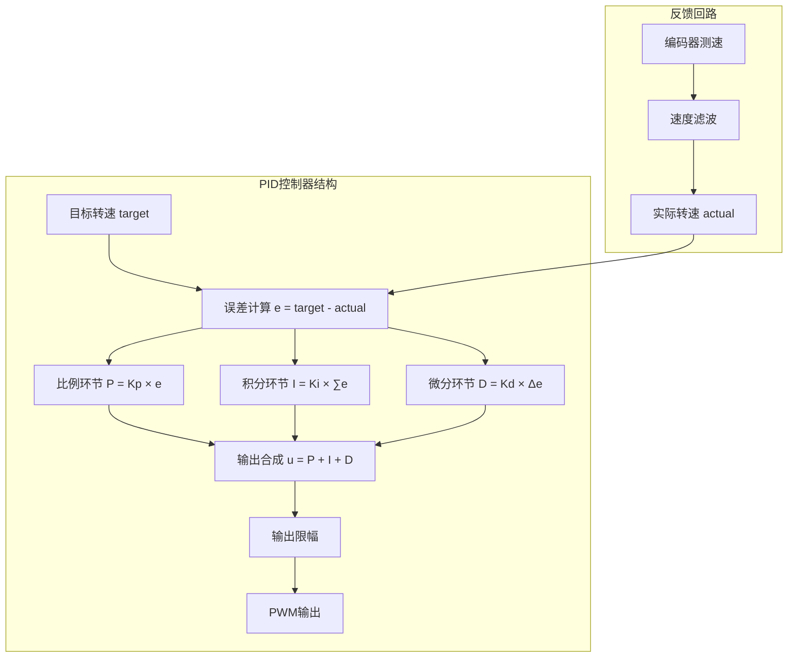

# PID闭环调速算法实现与调参

<!-- WIKI_NAV_START -->
> [!info] RTOS Wiki 导航
> [[projects/RTOS项目/index|项目首页]] · [[4.1.2 编码器测速原理与定时器编码器模式|← 上一篇：4.1.2 编码器测速原理与定时器编码器模式]] · [[4.2.1 DHT11 温湿度传感器：单总线协议驱动|下一篇：4.2.1 DHT11 温湿度传感器：单总线协议驱动 →]]
<!-- WIKI_NAV_END -->

> **实现状态（源码审计后）**：当前代码实现位置式PID、积分累计限幅和输出限幅；没有积分分离、自适应PID或参数自动整定。Kp=14、Ki=1.65、Kd=0是源码配置值，但仓库没有保存Ku、Tu、±5RPM或不同Kd实验记录。

本文档介绍油烟机控制系统中PID闭环调速算法的实现、代码架构和可验证的调参方法。

## PID算法原理与数学模型

### PID控制基本原理

PID控制器是一种线性控制器，它根据给定值r(t)与实际输出值c(t)构成控制偏差e(t)=r(t)-c(t)，将偏差的比例(P)、积分(I)和微分(D)通过线性组合构成控制量。本项目采用**位置式PID算法**，其离散化数学表达式为：

```
u(k) = Kp*e(k) + Ki*Σe(j) + Kd*[e(k)-e(k-1)]
```

其中：
- **Kp**：比例系数，决定系统响应速度，偏差一旦产生，控制器立即产生控制作用
- **Ki**：积分系数，消除稳态误差，提高系统无差度
- **Kd**：微分系数，预测偏差变化趋势，改善动态性能

### 项目中的PID架构

项目采用增量式与位置式相结合的PID架构，主要特点如下：



## PID控制器代码实现

### 数据结构定义

PID控制器的核心数据结构定义在`pid.h`文件中：

```c
typedef struct {
    float Kp;           /* 比例系数 */
    float Ki;           /* 积分系数 */
    float Kd;           /* 微分系数
    
    float target;       /* 目标值（设定值） */
    float actual;       /* 实际值（反馈值） */
    
    float error;        /* 当前误差 */
    float last_error;   /* 上次误差 */
    float integral;     /* 误差积分累加值 */
    
    float output;       /* PID输出值 */
    float output_max;   /* 输出上限 */
    float output_min;   /* 输出下限
    
    float integral_max; /* 积分上限（防止积分饱和） */
} PID_TypeDef;
```

Sources: `BSP/PID/pid.h#L18-L32`

### PID计算函数实现

PID计算的核心函数`PID_Calculate`实现了位置式PID算法：

```c
float PID_Calculate(PID_TypeDef *pid, float actual)
{
    float p_out, i_out, d_out;
    
    /* 更新实际值 */
    pid->actual = actual;
    
    /* 计算当前误差 */
    pid->error = pid->target - pid->actual;
    
    /* 积分累加 */
    pid->integral += pid->error;
    
    /* 积分限幅，防止积分饱和 */
    if (pid->integral > pid->integral_max)
    {
        pid->integral = pid->integral_max;
    }
    else if (pid->integral < -pid->integral_max)
    {
        pid->integral = -pid->integral_max;
    }
    
    /* 计算PID三个分量 */
    p_out = pid->Kp * pid->error;                           /* 比例项 */
    i_out = pid->Ki * pid->integral;                        /* 积分项 */
    d_out = pid->Kd * (pid->error - pid->last_error);       /* 微分项
    
    /* 计算PID输出 */
    pid->output = p_out + i_out + d_out;
    
    /* 输出限幅 */
    if (pid->output > pid->output_max)
    {
        pid->output = pid->output_max;
    }
    else if (pid->output < pid->output_min)
    {
        pid->output = pid->output_min;
    }
    
    /* 保存当前误差供下次使用 */
    pid->last_error = pid->error;
    
    return pid->output;
}
```

Sources: `BSP/PID/pid.c#L53-L97`

### 防积分饱和机制

本项目采用**积分限幅**的方法防止积分饱和，这是嵌入式PID控制中常用的抗饱和策略：

```c
/* 积分限幅设为输出限幅的一半，防止积分饱和 */
pid->integral_max = out_max / 2.0f;
```

积分限幅的作用是：
- 防止长时间误差累积导致积分项过大
- 避免执行器饱和时的积分继续累积
- 提高系统响应速度和稳定性

Sources: `BSP/PID/pid.c#L45`

## PID控制器在系统中的集成

### PID控制器初始化

PID控制器在`main.c`的`Hardware_Init()`函数中初始化：

```c
/* PID控制器初始化
 * 参数说明：
 * Kp=14.0:   比例系数
 * Ki=1.65:  积分系数
 * Kd=0.00: 微分系数
 * 输出限幅：0~1000
 */
PID_Init(&g_speedPID, 14.0f, 1.65f, 0.0f, 1000.0f, 0.0f);
```

初始化参数说明：
- **Kp=14.0**：提供较强的比例响应，确保快速跟踪目标转速
- **Ki=1.65**：提供适度的积分作用，消除稳态误差
- **Kd=0.0**：关闭微分作用，避免在转速反馈中引入高频噪声
- **输出限幅0~1000**：对应PWM占空比0%~100%

Sources: `USER/main.c#L82-L88`

### PID控制器在任务中的使用

PID控制器主要在两个场景中使用：

#### 手动模式下的PID控制

```c
case MODE_MANUAL:
    /* 手动模式：PID控制电机转速 */
    if(g_systemState.motorRunning == 0)
    {
        motor_start();
        g_systemState.motorRunning = 1;
    }

    if (g_systemState.motorRunning)
    {
        /*1.设置目标转速;2.计算PID输出;3.设置电机PWM*/
        g_systemState.targetRPM = WindSpeed_GetTargetRPM(g_systemState.speedLevel);
        PID_SetTarget(&g_speedPID, (float)g_systemState.targetRPM);
        pidOutput = PID_Calculate(&g_speedPID, speed);
        motor_pwm_set(pidOutput);
    }
    break;
```

#### 防回流模式下的PID控制

```c
case MODE_ANTI_BACKFLOW:
    /* 防回流模式：由防回流任务控制 */
    if (g_systemState.antiBackflowActive && g_systemState.motorRunning)
    {
        /* 使用用户设定的档位转速 */
        g_systemState.targetRPM = WindSpeed_GetTargetRPM(g_systemState.speedLevel);
        PID_SetTarget(&g_speedPID, (float)g_systemState.targetRPM);
        pidOutput = PID_Calculate(&g_speedPID, speed);
        motor_pwm_set(pidOutput);
    }
    break;
```

Sources: `APP_TASK/app_tasks.c#L338-L356`

### 目标转速设定

目标转速根据档位设定，在`wind_speed.h`中定义：

```c
/* 手动模式档位对应转速 (RPM) */
#define SPEED_LOW_RPM       190         /* 低档转速 */
#define SPEED_HIGH_RPM      220         /* 高档转速
```

Sources: `BSP/WIND/wind_speed.h#L82-L83`

## 速度反馈与滤波

### 编码器测速实现

编码器测速采用TIM2的编码器模式，支持4倍频计数：

```c
/* 配置编码器接口，选择TI1和TI2同时计数 */
TIM_EncoderInterfaceConfig(TIM2, TIM_EncoderMode_TI12, TIM_ICPolarity_Rising, TIM_ICPolarity_Rising);
```

### 速度计算算法

速度计算在`SpeedCalcTask`中实现，每50ms计算一次：

```c
/* 计算转速，30为减速比，4倍频，11线 */
speed_arr[k++] = (float)((now_value - old_value) * ((1000 / ms) * 60.0) / 30 / (11*4)); 
```

### 速度滤波算法

本项目采用**中值滤波+一阶低通滤波**的组合滤波策略：

```c
/* 一阶低通滤波
 * 公式为：Y(n)= qX(n) + (1-q)Y(n-1)
 * 其中X(n)为本次采样值，Y(n-1)为上次滤波输出值，Y(n)为本次滤波输出值，q为滤波系数
 * q值越小，上一次输出对本次输出的影响越大，输出越平稳，但是对速度变化的响应也就越慢
 */
speed = (float)( ((float)0.48 * temp) + (speed * (float)0.52) );
```

滤波参数说明：
- **滤波系数q=0.48**：平衡响应速度与平稳性
- **中值滤波窗口=10**：去除异常脉冲干扰
- **取中间6个数据平均**：进一步平滑滤波结果

Sources: `BSP/MOTOR/motor.c#L280-L310`

## PID参数整定方法

### 参数整定原则

PID参数整定是控制系统设计的核心内容，本项目采用**试凑法**结合**工程经验**进行参数整定：

| 参数 | 整定原则 | 影响分析 |
|------|----------|----------|
| **Kp** | 先调比例，确保系统响应 | 增大Kp：响应加快，但可能振荡 |
| **Ki** | 后调积分，消除稳态误差 | 增大Ki：消除误差更快，但可能超调 |
| **Kd** | 最后调微分，改善动态性能 | 增大Kd：抑制超调，但可能引入噪声 |

### 本项目的参数整定过程

#### 确定Kp范围

1. 首先将Ki、Kd设为0，只调整Kp
2. 从小值开始逐渐增大Kp并记录阶跃响应
3. 观察响应速度、超调和持续振荡趋势
4. 仓库只保留最终Kp=14.0，没有足够数据证明临界增益Ku

#### 调整Ki消除稳态误差

1. 固定Kp=14.0，逐渐增大Ki
2. 观察稳态误差是否消除
3. 如果出现超调或振荡，适当减小Ki
4. 当前源码选择Ki=1.65；稳态误差需要结合实测曲线评估，仓库没有提供±5RPM测试记录

#### Kd参数的选择

1. 由于转速反馈存在高频噪声，微分作用会放大噪声
2. 当前源码直接配置Kd=0.0
3. 若要说明关闭微分是为抑制噪声，应以实际波形或调参记录作为证据

### 参数整定经验公式

基于Ziegler-Nichols方法的经验公式（仅供参考）：

```
Kp = 0.6 × Ku
Ki = 2 × Kp / Tu
Kd = Kp × Tu / 8
```

其中：
- **Ku**：临界比例增益（系统开始振荡时的Kp）
- **Tu**：临界振荡周期

## 电机控制接口

### PWM输出控制

电机PWM输出通过`motor_pwm_set()`函数实现：

```c
void motor_pwm_set(float para)
{
    int val = (int)para;

    if (val >= 0) 
    {
        motor_dir(stright);           /* 正转 */
        motor_speed(val);
    } 
    else 
    {
        motor_dir(invert);           /* 反转 */
        motor_speed(-val);
    }
}
```

### PWM参数配置

PWM定时器TIM1的配置参数：

```c
/* 电机PWM初始化
 * TIM1: PWM频率 = 72MHz / 72 / 1000 = 1kHz
 * 代码传入DTG=100；结合TIM_CKD_DIV4，死区约为100×4/72MHz≈5.56us
 */
TIM1_dead_pwm_init(1000-1, 72-1, 0, 100);
```

PWM参数说明：
- **ARR=999**：计数周期1000
- **PSC=71**：预分频72
- **PWM频率1kHz**：适合电机驱动
- **死区时间约5.56us**：由当前CKD=DIV4、DTG=100推导；`main.c`中的22us注释不匹配实际配置

Sources: `USER/main.c#L46-L50`

## 调试与优化技巧

### 调试参数监控

系统通过LCD显示关键PID参数：

```c
/* 显示风速PWM */
sprintf(dispBuf, "WIND:%.1f%%  ", g_systemState.windSpeedPWM);
Show_Str(0, 60, BLUE, WHITE, (u8*)dispBuf, 16, 0);

/* 显示实际转速 */
sprintf(dispBuf, "RPM:%.0f    ", g_systemState.actualRPM);
Show_Str(0, 80, BLUE, WHITE, (u8*)dispBuf, 16, 0);
```

### 常见问题与解决方案

| 问题现象 | 可能原因 | 解决方案 |
|----------|----------|----------|
| 转速波动大 | Kp过大或滤波不足 | 减小Kp，增强滤波 |
| 响应迟缓 | Kp过小或Ki过大 | 适当增大Kp，减小Ki |
| 稳态误差大 | Ki过小 | 适当增大Ki |
| 启动超调大 | Kp过大或积分饱和 | 减小Kp，启用积分限幅 |
| 高频噪声 | Kd过大或编码器干扰 | 减小Kd或设为0，加强硬件滤波 |

### 性能优化建议

#### 控制周期优化

当前控制周期为50ms，可根据需要调整：

```c
/* 电机控制任务 - 周期50ms */
void MotorControlTask(void *pvParameters)
{
    // ...
    delay_ms(50);   /* 50ms控制周期 */
}
```

#### 滤波参数优化

可根据实际噪声情况调整滤波系数：

```c
/* 一阶低通滤波系数调整 */
speed = (float)( ((float)0.48 * temp) + (speed * (float)0.52) );
// q=0.48：响应较快，平稳性适中
// q=0.3：更平稳，响应稍慢
// q=0.6：响应快，平稳性稍差
```

#### 积分限幅优化

积分限幅设为输出限幅的一半，可根据实际情况调整：

```c
/* 积分限幅设为输出限幅的一半 */
pid->integral_max = out_max / 2.0f;
// 可调整为 out_max * 0.3 或 out_max * 0.7
```

## PID算法扩展应用

### 串级PID控制

对于更精确的控制，可以采用串级PID控制：

```
外环(位置环) → 内环(速度环) → 电机
```

### 自适应PID

根据负载变化自动调整PID参数：

```c
if (abs(error) > threshold_large)
{
    // 大误差时使用强比例
    pid->Kp = Kp_large;
}
else
{
    // 小误差时使用弱比例
    pid->Kp = Kp_small;
}
```

### 前馈补偿

在PID基础上增加前馈补偿，提高跟踪性能：

```
输出 = PID输出 + 前馈补偿
```

## 总结与最佳实践

### 项目中的PID应用特点

1. **位置式PID实现**：适合转速控制，便于理解
2. **积分限幅抗饱和**：防止长时间误差累积
3. **组合滤波策略**：中值滤波+低通滤波，兼顾抗干扰与响应速度
4. **模块化设计**：PID控制器独立封装，便于复用

### 参数整定检查清单

- [ ] 确认编码器测速准确
- [ ] 确认PWM输出正常
- [ ] 先调Kp，观察响应
- [ ] 再调Ki，消除稳态误差
- [ ] 最后考虑Kd，避免引入噪声
- [ ] 测试不同转速下的表现
- [ ] 验证抗干扰能力

### 调试记录建议

建议记录以下调试信息：
- 不同Kp值下的响应曲线
- 不同Ki值下的稳态误差
- 滤波参数对性能的影响
- 不同负载下的控制效果

<!-- WIKI_FOOTER_START -->
---
> [!tip] 继续阅读
> [[projects/RTOS项目/index|项目首页]] · [[4.1.2 编码器测速原理与定时器编码器模式|← 上一篇：4.1.2 编码器测速原理与定时器编码器模式]] · [[4.2.1 DHT11 温湿度传感器：单总线协议驱动|下一篇：4.2.1 DHT11 温湿度传感器：单总线协议驱动 →]]
<!-- WIKI_FOOTER_END -->
