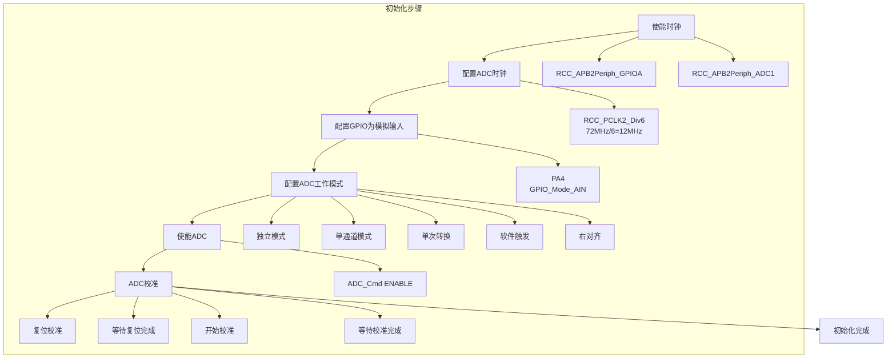
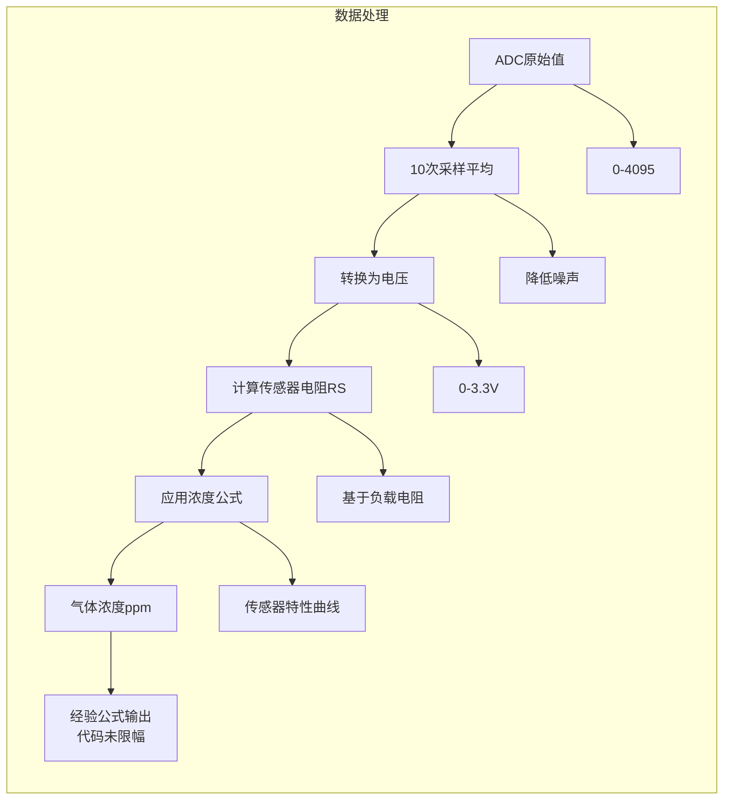
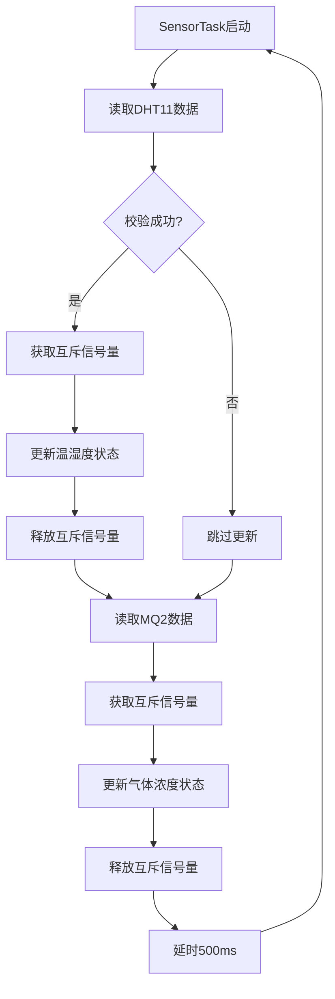
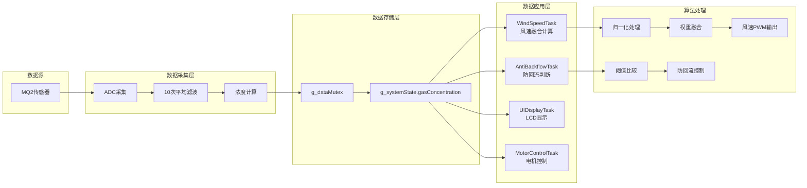
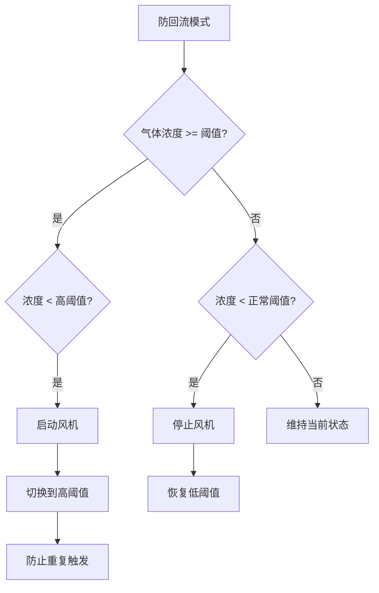

# MQ2 气体传感器：ADC采集与数据处理

<!-- WIKI_NAV_START -->
> [!info] RTOS Wiki 导航
> [[projects/RTOS项目/index|项目首页]] · [[4.2.1 DHT11 温湿度传感器：单总线协议驱动|← 上一篇：4.2.1 DHT11 温湿度传感器：单总线协议驱动]] · [[4.2.3 多传感器融合风速算法|下一篇：4.2.3 多传感器融合风速算法 →]]
<!-- WIKI_NAV_END -->

> **实现状态（源码审计后）**：当前代码进行10次ADC平均，再按经验公式计算浓度；没有把结果限制在0–500，也没有保存Ro标定、曲线拟合来源或ppm精度测试。因此该数值应视为项目控制量，不能直接宣称为准确的绝对ppm。

本文解析MQ2的ADC采集、数据处理公式及其在RTOS任务中的数据流。

## 传感器硬件原理与特性

MQ2传感器采用二氧化锡（SnO2）半导体气敏材料，在清洁空气中电导率较低，当接触可燃气体时电导率随气体浓度升高而增大。传感器输出模拟电压信号（AO引脚），电压范围与气体浓度呈正相关关系。

**硬件连接配置**：
- **模拟输出**：PA4引脚（ADC1通道4）
- **参考电压**：3.3V（STM32 ADC参考电压）
- **分辨率**：12位ADC，量化范围0-4095
- **采样时间**：239.5个ADC时钟周期（保证稳定采样）

Sources: `BSP/MQ2/mq2.h#L14-L17` | `BSP/MQ2/mq2.c#L30-L45`

## ADC外设初始化与配置

ADC初始化是MQ2传感器工作的基础，需要配置时钟、GPIO、工作模式等参数。本项目使用STM32标准库进行ADC配置，采用单通道单次转换模式，软件触发启动转换。

### ADC初始化流程



**关键配置参数**：
| 参数 | 配置值 | 说明 |
|------|--------|------|
| ADC模式 | ADC_Mode_Independent | 独立模式，单ADC工作 |
| 扫描模式 | DISABLE | 单通道模式，无需扫描 |
| 连续转换 | DISABLE | 单次转换模式 |
| 触发方式 | ADC_ExternalTrigConv_None | 软件触发 |
| 数据对齐 | ADC_DataAlign_Right | 右对齐，高12位有效 |
| 通道数 | 1 | 单通道转换 |
| 采样时间 | ADC_SampleTime_239Cycles5 | 239.5个周期，保证采样稳定 |

Sources: `BSP/MQ2/mq2.c#L20-L55` | `STM32F10x_FWLib/inc/stm32f10x_adc.h#L60-L100`

## ADC数据采集与转换

### ADC转换原理

ADC（模数转换器）将连续的模拟电压信号转换为离散的数字值。STM32F103的ADC为12位逐次逼近型ADC，参考电压为3.3V，量化精度为：

```
分辨率 = 3.3V / 4096 ≈ 0.806mV/LSB
```

**转换公式**：
```
数字值 = (模拟电压 / 参考电压) × 4095
模拟电压 = (数字值 / 4095) × 3.3V
```

### 单次采集实现

`MQ2_GetAdcValue()`函数实现单次ADC采集，主要步骤包括：配置ADC通道、启动转换、等待转换完成、读取结果。

```c
// ADC通道配置
ADC_RegularChannelConfig(ADC1, MQ2_ADC_CHANNEL, 1, ADC_SampleTime_239Cycles5);

// 启动转换
ADC_SoftwareStartConvCmd(ADC1, ENABLE);

// 等待转换完成（EOC标志位）
while (!ADC_GetFlagStatus(ADC1, ADC_FLAG_EOC));

// 读取转换结果
adc_value = ADC_GetConversionValue(ADC1);
```

**采样时间选择**：选择239.5个周期的采样时间，为传感器模拟信号提供足够的建立时间，避免采样误差。

Sources: `BSP/MQ2/mq2.c#L60-L80`

## 数据处理与浓度计算

### 多次采样平均算法

为减少ADC采样噪声的影响，采用10次采样取平均值的策略。这种数字滤波方法能有效抑制高频干扰，提高数据稳定性。

```c
// 采样10次取平均值
for (i = 0; i < 10; i++)
{
    sum += MQ2_GetAdcValue();
    delay_us(100);  // 100微秒间隔，避免采样过于密集
}
adc_avg = sum / 10;
```

### 气体浓度计算模型

MQ2传感器的浓度计算基于其电阻变化特性，通过以下步骤实现：

1. **ADC值转电压**：将数字值转换为模拟电压
   ```
   电压 = ADC值 × (3.3 / 4096)
   ```

2. **计算传感器电阻RS**：根据MQ2传感器特性公式
   ```
   RS = (5V - 电压) / 电压 × 0.5kΩ
   ```
   其中0.5kΩ为负载电阻值

3. **计算气体浓度ppm**：基于传感器灵敏度曲线
   ```
   浓度 = (11.5428 × 2 / RS)^0.6549 × 100
   ```
   该公式来源于MQ2传感器数据手册的灵敏度特性曲线

**计算流程图**：


**关键代码实现**：
```c
// 获取模拟电压值
voltage = (float)adc_avg * (3.3/4096);

// 计算传感器电阻RS
RS = (5 - voltage) / voltage * 0.5;

// 计算气体浓度
gas_concentration = pow(11.5428*2/RS, 0.6549f) * 100;
```

Sources: `BSP/MQ2/mq2.c#L85-L125`

## RTOS多任务环境集成

### 传感器采集任务架构

MQ2传感器数据采集集成在FreeRTOS的`SensorTask`任务中，该任务负责周期性读取温湿度传感器（DHT11）和气体传感器（MQ2）数据，并通过互斥信号量保护共享数据。

**任务配置**：
- **任务优先级**：3（中等优先级）
- **任务栈大小**：128字
- **采集周期**：500ms

**任务执行流程**：


**数据保护机制**：
```c
// 使用互斥信号量保护共享数据
if (xSemaphoreTake(g_dataMutex, portMAX_DELAY) == pdTRUE)
{
    g_systemState.gasConcentration = gasValue;
    xSemaphoreGive(g_dataMutex);
}
```

**设计要点**：
1. **独立数据锁**：温湿度和气体数据使用不同的锁，避免长时间占用资源
2. **非阻塞采集**：即使DHT11读取失败，MQ2采集仍继续执行
3. **调试支持**：可通过`SENSOR_DEBUG`宏开启串口调试输出

Sources: `APP_TASK/app_tasks.c#L250-L320` | `APP_TASK/app_tasks.h#L60-L70`

## 系统状态数据流

MQ2传感器数据在系统中形成完整数据流，从采集到应用经过多个处理环节：



**数据流向说明**：
1. **采集阶段**：每500ms采集一次，10次平均滤波
2. **存储阶段**：通过互斥信号量保护，写入全局状态结构体
3. **应用阶段**：三个任务并行读取数据，分别用于风速计算、防回流判断和UI显示

## 阈值配置与防回流机制

### 阈值定义与作用

MQ2传感器在系统中定义了两个关键阈值，用于防回流模式控制：

| 阈值名称 | 数值 | 作用 |
|----------|------|------|
| GAS_THRESHOLD_NORMAL | 100.0f | 正常状态阈值，低于此值认为气体浓度正常 |
| GAS_THRESHOLD_HIGH | 2000.0f | 高浓度阈值，防止极端情况下重复触发 |

**防回流工作原理**：


**状态切换逻辑**：
1. **启动条件**：气体浓度 ≥ 100ppm 且 < 2000ppm
2. **停止条件**：气体浓度 < 100ppm
3. **保护机制**：启动后立即切换到高阈值，避免频繁启停

**代码实现**：
```c
if(g_systemState.gasConcentration >= g_systemState.gasThreshold)
{
    if(g_systemState.gasConcentration < GAS_THRESHOLD_HIGH)
    {
        // 启动风机
        g_systemState.antiBackflowActive = 1;
        motor_start();
        
        // 切换到高阈值
        g_systemState.gasThreshold = GAS_THRESHOLD_HIGH;
    }
}
```

Sources: `APP_TASK/app_tasks.c#L500-L550` | `BSP/MQ2/mq2.h#L20-L22`

## 风速算法中的气体浓度权重

MQ2传感器数据在风速融合算法中占有重要权重（60%），是决定自动模式风速的主要因素：

**风速融合公式**：
```
风速PWM = PWM_MIN + (PWM_MAX - PWM_MIN) × F
F = 0.2×f_T + 0.2×f_H + 0.6×f_G
```

其中：
- `f_T`：温度归一化系数
- `f_H`：湿度归一化系数  
- `f_G`：气体浓度归一化系数

**气体浓度归一化**：
```c
// 气体浓度影响系数: f_G = (G - G_base) / (G_max - G_base)
g_windSpeedData.f_G = (gas - GAS_BASE) / (GAS_MAX - GAS_BASE);
g_windSpeedData.f_G = Constrain(g_windSpeedData.f_G, 0.0f, 1.0f);
```

**参数配置**：
| 参数 | 数值 | 说明 |
|------|------|------|
| GAS_BASE | 80.0f | 气体浓度基准值（正常空气） |
| GAS_MAX | 450.0f | 气体浓度上限值 |
| WEIGHT_GAS | 0.6f | 气体浓度权重 |
| COOKING_GAS_THRESHOLD | 100.0f | Cooking Event气体阈值 |

Sources: `BSP/WIND/wind_speed.c#L50-L80` | `BSP/WIND/wind_speed.h#L25-L35`

## 调试与故障排查

### 常见问题与解决方案

| 问题现象 | 可能原因 | 解决方案 |
|----------|----------|----------|
| ADC值始终为0 | GPIO配置错误 | 检查PA4是否配置为模拟输入模式 |
| ADC值为4095 | 传感器未连接或开路 | 检查MQ2传感器连接和供电 |
| 浓度值异常波动 | 采样噪声大 | 增加采样次数或使用中值滤波 |
| 浓度值不变化 | 传感器未预热 | MQ2需要2-5分钟预热时间 |
| 阈值判断不工作 | 互斥信号量问题 | 检查信号量创建和获取逻辑 |

### 调试方法

1. **串口调试**：
   ```c
   #define SENSOR_DEBUG 1  // 开启传感器调试
   printf("Gas: %.2f\r\n", gasValue);
   ```

2. **LCD显示**：
   ```c
   sprintf(dispBuf, "Gas:%.1f", g_systemState.gasConcentration);
   Show_Str(0, 160, BLUE, WHITE, (u8*)dispBuf, 16, 0);
   ```

3. **ADC原始值检查**：
   ```c
   u16 adc_raw = MQ2_GetAdcValue();
   printf("ADC Raw: %d, Voltage: %.3fV\r\n", adc_raw, adc_raw * 3.3 / 4096);
   ```

Sources: `APP_TASK/app_tasks.c#L320-L330` | `BSP/MQ2/mq2.c#L85-L125`

## 性能优化与扩展

### 采样策略优化

当前实现采用固定10次采样，可根据实际需求调整：

1. **动态采样次数**：根据气体浓度变化率调整采样次数
2. **滑动窗口滤波**：维护采样队列，实现更平滑的数据输出
3. **异常值剔除**：去除最大最小值后再平均

### 校准机制

MQ2传感器需要定期校准以保证测量精度：

1. **零点校准**：在清洁空气中校准基准值
2. **跨度校准**：使用标准气体校准高浓度点
3. **温度补偿**：根据环境温度修正测量结果

### 扩展应用场景

1. **多气体检测**：通过算法区分不同气体类型
2. **报警联动**：超过阈值时触发蜂鸣器报警
3. **数据记录**：存储历史浓度数据用于分析

## Next Steps

理解MQ2传感器的ADC采集与数据处理后，建议继续学习：

- **[[4.2.3 多传感器融合风速算法|多传感器融合风速算法]]**：深入了解气体浓度如何与其他传感器数据融合计算风速
- **[[5.2 自动模式状态机与Cooking Event检测|自动模式状态机与Cooking Event检测]]**：了解气体浓度如何触发自动模式状态转换
- **[[4.2.1 DHT11 温湿度传感器：单总线协议驱动|DHT11 温湿度传感器：单总线协议驱动]]**：学习另一种传感器的驱动实现

通过掌握MQ2传感器的完整技术链路，您将具备嵌入式传感器集成开发的完整能力，能够设计高精度、高可靠性的传感器数据采集系统。

<!-- WIKI_FOOTER_START -->
---
> [!tip] 继续阅读
> [[projects/RTOS项目/index|项目首页]] · [[4.2.1 DHT11 温湿度传感器：单总线协议驱动|← 上一篇：4.2.1 DHT11 温湿度传感器：单总线协议驱动]] · [[4.2.3 多传感器融合风速算法|下一篇：4.2.3 多传感器融合风速算法 →]]
<!-- WIKI_FOOTER_END -->
