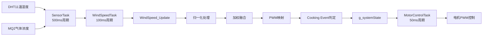
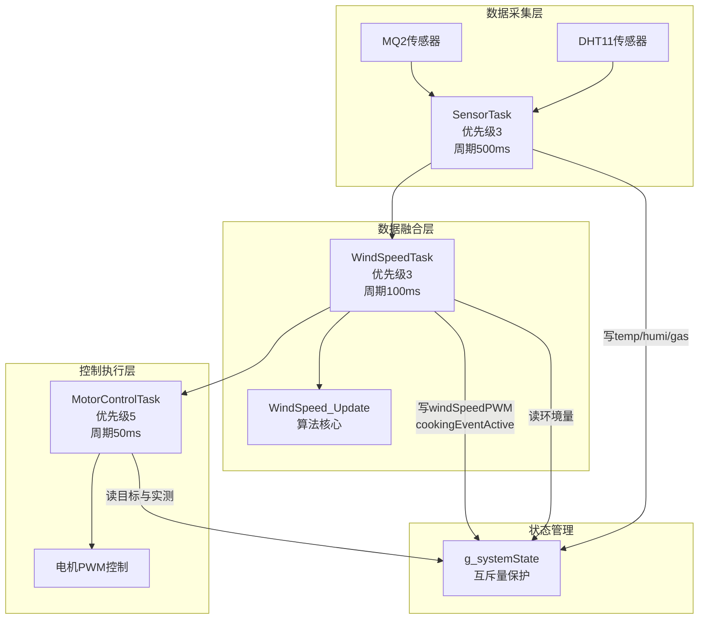
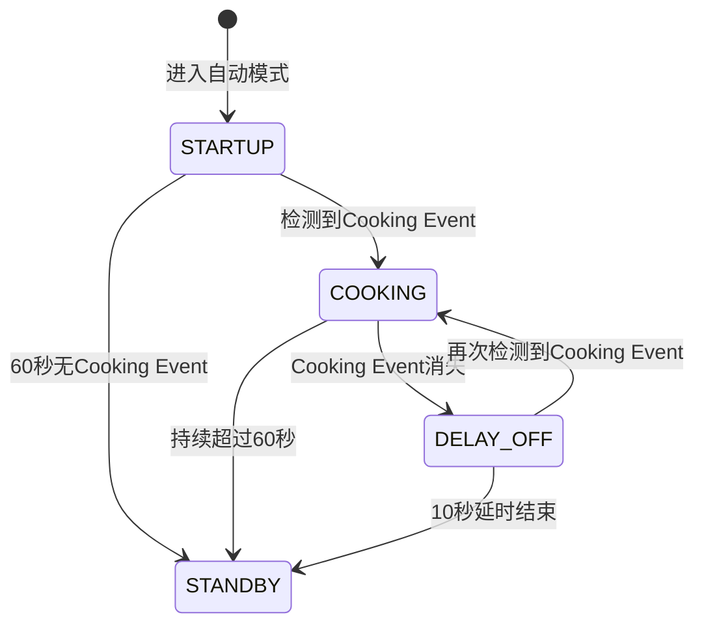

# 多传感器融合风速算法

<!-- WIKI_NAV_START -->
> [!info] RTOS Wiki 导航
> [[projects/RTOS项目/index|项目首页]] · [[4.2.2 MQ2 气体传感器：ADC采集与数据处理|← 上一篇：4.2.2 MQ2 气体传感器：ADC采集与数据处理]] · [[4.3.1 按键状态机：消抖、短按与长按检测|下一篇：4.3.1 按键状态机：消抖、短按与长按检测 →]]
<!-- WIKI_NAV_END -->

> **实现状态（源码审计后）**：算法已实现归一化、0.2/0.2/0.6加权、20%–100% PWM映射与独立Cooking Event阈值判断。权重是固定宏，没有在线学习或传感器可信度评估。

本页阐述多传感器融合风速算法及Cooking Event检测逻辑。

## 算法概述与设计目标

风速融合算法是连接传感器数据与电机控制的关键决策模块。其核心职责是将来自不同传感器的原始数据转化为可执行的控制指令。

**设计目标**：
- **多源数据融合**：整合温度、湿度、气体浓度三种异构传感器数据
- **智能调速**：根据环境变化自动调整风机转速
- **烹饪事件检测**：识别真实烹饪场景，避免误触发
- **安全兜底**：确保风机在最小转速以上运行，防止油烟倒灌

**核心数据流**：


Sources: `BSP/WIND/wind_speed.h#L1-L95`, `BSP/WIND/wind_speed.c#L1-L150`

## 算法原理与数学模型

风速融合算法采用"归一化 → 加权融合 → 线性映射"的经典数据融合管线。该设计基于以下工程考量：

### 归一化处理

传感器原始数据具有不同的物理量纲和数值范围：温度（20-35℃）、湿度（40-75%）、气体浓度（80-450）。直接相加没有物理意义，必须归一化到[0,1]区间才能进行数学运算。

**归一化公式**：
```
f_T = (T - T_base) / (T_max - T_base)
f_H = (H - H_base) / (H_max - H_base)  
f_G = (G - G_base) / (G_max - G_base)
```

其中：
- `T_base` = 20℃（温度基准值）
- `T_max` = 35℃（温度上限）
- `H_base` = 40%（湿度基准值）
- `H_max` = 75%（湿度上限）
- `G_base` = 80（气体浓度基准值）
- `G_max` = 450（气体浓度上限）

**归一化后的值域**：所有归一化后的值都被限制在[0,1]区间内，便于后续的加权计算。

### 加权融合

融合是算法的核心，通过权重分配反映各传感器对最终决策的影响程度。

**加权融合公式**：
```
F = w_T × f_T + w_H × f_H + w_G × f_G
```

其中：
- `w_T` = 0.2（温度权重）
- `w_H` = 0.2（湿度权重）
- `w_G` = 0.6（气体浓度权重）

**权重分配策略**：
气体浓度权重（0.6）远高于温湿度（各0.2），这是因为：
1. **信号强度**：MQ2传感器对油烟和异味的响应最直接、最强烈
2. **环境干扰**：温湿度容易受天气变化、厨房通风等非烹饪因素影响
3. **烹饪相关性**：气体浓度与油烟产生有最强的相关性

### PWM映射

将融合后的值[0,1]映射到PWM控制范围[20%,100%]。

**PWM映射公式**：
```
PWM = PWM_min + (PWM_max - PWM_min) × F
```

其中：
- `PWM_min` = 20%（最小占空比）
- `PWM_max` = 100%（最大占空比）

**设计考量**：PWM最小值设为20%而非0%，是安全性兜底设计。即使所有传感器都处于基准值以下，风机仍保持20%最低转速，避免完全停止导致油烟倒灌。

Sources: `BSP/WIND/wind_speed.h#L15-L53`, `BSP/WIND/wind_speed.c#L60-L80`

## 核心数据结构与参数配置

### WindSpeed_t 结构体

该结构体是算法的内部状态容器，存储所有计算中间结果和最终输出。

```c
typedef struct {
    float f_T;                  // 温度影响系数（归一化后，范围[0,1]）
    float f_H;                  // 湿度影响系数（归一化后，范围[0,1]）
    float f_G;                  // 气体浓度影响系数（归一化后，范围[0,1]）
    float fusionValue;          // 加权融合后的总值 F（范围[0,1]）
    float pwmValue;             // 映射后的PWM占空比（范围[20,100]%）
    u8 isCookingEvent;          // 烹饪事件标志（0或1）
} WindSpeed_t;
```

**字段关系**：
- `f_T`、`f_H`、`f_G`：原始传感器数据经过归一化后的中间变量
- `fusionValue` = 0.2×f_T + 0.2×f_H + 0.6×f_G（加权求和结果）
- `pwmValue` = 20 + 80×fusionValue（线性映射到PWM范围）
- `isCookingEvent`：独立于融合计算，由阈值比较逻辑单独决定

**实例化**：模块内部维护一个静态全局实例 `g_windSpeedData`，所有API函数操作该实例。

### 算法参数配置表

| 参数类别 | 宏定义 | 值 | 用途 |
|---------|--------|-----|------|
| **温度参数** | `TEMP_BASE` | 20 | 温度归一化基准值（℃） |
| | `TEMP_MAX` | 35 | 温度归一化上限（℃） |
| **湿度参数** | `HUMIDITY_BASE` | 40 | 湿度归一化基准值（%） |
| | `HUMIDITY_MAX` | 75 | 湿度归一化上限（%） |
| **气体参数** | `GAS_BASE` | 80.0f | 气体浓度归一化基准值 |
| | `GAS_MAX` | 450.0f | 气体浓度归一化上限 |
| **权重参数** | `WEIGHT_TEMP` | 0.2f | 温度权重 |
| | `WEIGHT_HUMIDITY` | 0.2f | 湿度权重 |
| | `WEIGHT_GAS` | 0.6f | 气体浓度权重 |
| **PWM参数** | `PWM_MIN` | 20.0f | PWM最小占空比（%） |
| | `PWM_MAX` | 100.0f | PWM最大占空比（%） |
| **定时器参数** | `MAXCCR` | 1000 | 定时器最大比较值 |

Sources: `BSP/WIND/wind_speed.h#L15-L53`

## Cooking Event 检测机制

Cooking Event（烹饪事件）是自动模式的核心触发条件，它独立于融合计算，由专门的阈值比较逻辑决定。

### 检测条件

```c
if ((temp > COOKING_TEMP_THRESHOLD) &&
    ((humidity > COOKING_HUMIDITY_THRESHOLD) && (gas > COOKING_GAS_THRESHOLD)))
{
    isCookingEvent = 1;
}
else
{
    isCookingEvent = 0;
}
```

**检测阈值**：
- 温度阈值：26℃
- 湿度阈值：50%
- 气体浓度阈值：100

**逻辑设计**：采用AND逻辑，要求温度必须超过阈值，同时湿度和气体都必须超过阈值。这种设计避免了：
1. 单独高湿度（如雨天潮湿）造成的误触发
2. 单独高气体浓度（如短暂烟雾）造成的误触发
3. 单独高温（如环境温度高）造成的误触发

### 设计权衡

**为什么Cooking Event独立于融合计算？**
- 融合计算输出PWM值，用于控制风机转速
- Cooking Event输出布尔值，用于控制自动模式状态机
- 两者逻辑独立，避免相互干扰

**为什么使用AND逻辑而非OR逻辑？**
- OR逻辑会导致任何一项超标就触发，误触发率高
- AND逻辑要求多项同时超标，更准确地识别真实烹饪场景

Sources: `BSP/WIND/wind_speed.h#L45-L48`, `BSP/WIND/wind_speed.c#L85-L93`

## 任务协作与数据流

风速算法不是独立运行的，而是嵌入在FreeRTOS任务协作框架中，与多个任务协同工作。

### 任务协作流程



### 关键任务职责

**SensorTask（传感器采集任务）**：
- 周期：500ms
- 职责：读取DHT11和MQ2传感器数据
- 输出：将温度、湿度、气体浓度写入 `g_systemState`
- 加锁策略：使用独立的互斥量保护，避免长时间占用

**WindSpeedTask（风速计算任务）**：
- 周期：100ms（比传感器采集快5倍）
- 职责：从 `g_systemState` 读取传感器数据，调用风速算法
- 输出：将 `windSpeedPWM` 和 `cookingEventActive` 写回 `g_systemState`
- 加锁策略：读写分离，计算放在锁外

**MotorControlTask（电机控制任务）**：
- 周期：50ms（最快响应）
- 职责：根据当前模式和状态控制电机
- 输入：读取 `g_systemState` 中的目标和实际值
- 输出：控制电机PWM

### WindSpeedTask 的加锁实现

```c
void WindSpeedTask(void *pvParameters)
{
    u8 temp, humidity;
    float gas;
    
    while (1)
    {
        // 1. 获取传感器数据（短时间加锁）
        if (xSemaphoreTake(g_dataMutex, portMAX_DELAY) == pdTRUE)
        {
            temp = g_systemState.temperature;
            humidity = g_systemState.humidity;
            gas = (float)g_systemState.gasConcentration;
            xSemaphoreGive(g_dataMutex);
        }
        
        // 2. 执行风速计算（无锁，计算密集型）
        WindSpeed_Update(temp, humidity, gas);
        
        // 3. 更新系统状态（短时间加锁）
        if (xSemaphoreTake(g_dataMutex, portMAX_DELAY) == pdTRUE)
        {
            g_systemState.windSpeedPWM = WindSpeed_GetPWM();
            g_systemState.cookingEventActive = WindSpeed_IsCookingEvent();
            xSemaphoreGive(g_dataMutex);
        }
        
        delay_ms(100);
    }
}
```

**关键点**：
- 拿锁时只复制输入或写回结果
- `WindSpeed_Update()` 这种计算放在锁外
- 缩短互斥量持有时间，减少其他任务等待
- 降低优先级反转风险

Sources: `APP_TASK/app_tasks.c#L285-L330`, `APP_TASK/app_tasks.h#L43-L63`

## 在不同工作模式中的应用

风速算法的输出在不同工作模式中有不同的使用方式。

### 模式应用对比表

| 工作模式 | 风速算法使用方式 | 控制逻辑 |
|---------|----------------|----------|
| **待机模式** | 持续计算但不使用 | 电机停止，仅监控 |
| **手动模式** | 不使用融合PWM | 用户选择档位 → 目标RPM → PID控制 |
| **自动模式** | 主要使用融合PWM | 状态机 + 融合PWM控制 |
| **防回流模式** | 使用档位目标RPM | 气体阈值触发 + PID控制 |

### 自动模式状态机

自动模式采用三段状态机，风速算法在其中发挥关键作用：



**各阶段风速算法的作用**：

1. **STARTUP阶段**：
   - 电机以PWM_MIN（20%）最低速运行
   - 等待Cooking Event触发
   - 风速算法持续计算，但结果暂不使用

2. **COOKING阶段**：
   - 使用 `WindSpeed_GetPWMCompare(MAXCCR)` 控制电机
   - PWM值由融合算法实时计算
   - Cooking Event消失则转入DELAY_OFF

3. **DELAY_OFF阶段**：
   - 继续使用融合算法计算PWM
   - 延时10秒排烟
   - 期间再次检测到Cooking Event则回到COOKING

### 手动模式与自动模式的区别

| 特性 | 手动模式 | 自动模式 |
|------|----------|----------|
| **控制源** | 用户选择档位 | 环境传感器数据 |
| **算法使用** | 不使用融合算法 | 主要使用融合算法 |
| **目标RPM** | 固定值（低档190/高档220） | 动态计算 |
| **控制方式** | PID闭环调速 | 直接PWM输出 |
| **响应速度** | 档位切换后立即响应 | 100ms计算周期 |

Sources: `APP_TASK/app_tasks.c#L400-L500`, `APP_TASK/app_tasks.h#L68-L70`

## API 函数详解

### 核心函数

| 函数签名 | 输入 | 输出 | 说明 |
|---------|------|------|------|
| `void WindSpeed_Init(void)` | 无 | 无 | 初始化模块，清零所有内部状态 |
| `void WindSpeed_Update(u8 temp, u8 humidity, float gas)` | temp: 温度(℃), humidity: 湿度(%), gas: 气体浓度 | 无（更新内部状态） | 核心计算函数 |
| `float WindSpeed_GetPWM(void)` | 无 | PWM占空比(20-100%) | 获取融合计算后的PWM百分比 |
| `u16 WindSpeed_GetPWMCompare(u16 maxCompare)` | maxCompare: 定时器ARR值 | 定时器CCR比较值 | 将PWM百分比转换为定时器硬件比较值 |
| `u8 WindSpeed_IsCookingEvent(void)` | 无 | 1=是烹饪事件, 0=不是 | 查询烹饪事件状态 |
| `WindSpeed_t* WindSpeed_GetData(void)` | 无 | 结构体指针 | 获取内部状态数据的只读指针 |
| `u16 WindSpeed_GetTargetRPM(u8 level)` | level: 0=低档, 1=高档 | 目标转速RPM | 手动模式下根据档位返回固定目标转速 |

### 关键函数实现解析

**WindSpeed_Update 函数**：
```c
void WindSpeed_Update(u8 temp, u8 humidity, float gas)
{
    // 1. 传感器归一化
    g_windSpeedData.f_T = Constrain((temp - TEMP_BASE) / (TEMP_MAX - TEMP_BASE), 0.0f, 1.0f);
    g_windSpeedData.f_H = Constrain((humidity - HUMIDITY_BASE) / (HUMIDITY_MAX - HUMIDITY_BASE), 0.0f, 1.0f);
    g_windSpeedData.f_G = Constrain((gas - GAS_BASE) / (GAS_MAX - GAS_BASE), 0.0f, 1.0f);
    
    // 2. 权重融合
    g_windSpeedData.fusionValue = WEIGHT_TEMP * g_windSpeedData.f_T +
                                  WEIGHT_HUMIDITY * g_windSpeedData.f_H +
                                  WEIGHT_GAS * g_windSpeedData.f_G;
    
    // 3. PWM映射
    g_windSpeedData.pwmValue = PWM_MIN + (PWM_MAX - PWM_MIN) * g_windSpeedData.fusionValue;
    g_windSpeedData.pwmValue = Constrain(g_windSpeedData.pwmValue, PWM_MIN, PWM_MAX);
    
    // 4. Cooking Event判定
    if ((temp > COOKING_TEMP_THRESHOLD) &&
        ((humidity > COOKING_HUMIDITY_THRESHOLD) && (gas > COOKING_GAS_THRESHOLD)))
    {
        g_windSpeedData.isCookingEvent = 1;
    }
    else
    {
        g_windSpeedData.isCookingEvent = 0;
    }
}
```

**Constrain 防护函数**：
```c
static float Constrain(float value, float min, float max)
{
    if (value < min) return min;
    if (value > max) return max;
    return value;
}
```

**作用**：
1. 归一化后的f_T/f_H/f_G被限制在[0,1]，防止传感器读数超出BASE-MAX范围时产生负值或超过1
2. 最终PWM值被限制在[PWM_MIN, PWM_MAX]，防止融合值溢出导致异常转速

Sources: `BSP/WIND/wind_speed.c#L30-L95`

## 常见修改场景与调试指南

### 参数调整场景

**场景1：调整传感器权重分配**
```c
// 修改前
#define WEIGHT_TEMP         0.2f
#define WEIGHT_HUMIDITY     0.2f
#define WEIGHT_GAS          0.6f

// 修改后（示例：三者等权）
#define WEIGHT_TEMP         0.33f
#define WEIGHT_HUMIDITY     0.33f
#define WEIGHT_GAS          0.34f
```

**注意事项**：
- 三个权重之和必须为1.0，否则PWM输出范围会偏移
- 修改后需要重新实测验证各场景下的风机响应是否合理

**场景2：修改烹饪事件判定阈值**
```c
// 修改前
#define COOKING_TEMP_THRESHOLD      26
#define COOKING_HUMIDITY_THRESHOLD  50
#define COOKING_GAS_THRESHOLD       100.0f

// 修改后（降低阈值，更容易触发）
#define COOKING_TEMP_THRESHOLD      24
#define COOKING_HUMIDITY_THRESHOLD  45
#define COOKING_GAS_THRESHOLD       80.0f
```

**注意事项**：
- 阈值过低会导致非烹饪场景误触发（如烧水壶蒸汽、开窗通风）
- 建议结合实际厨房环境数据逐步调试

**场景3：修改PWM范围**
```c
// 修改前
#define PWM_MIN             20.0f
#define PWM_MAX             100.0f

// 修改后（提高最小转速）
#define PWM_MIN             30.0f
#define PWM_MAX             100.0f
```

**注意事项**：
- PWM_MIN提高会增加基础功耗，但提供更好的排烟效果
- PWM_MAX一般保持100%，不要超过定时器ARR值对应的占空比

### 常见问题排查表

| 问题现象 | 可能原因 | 排查方法 |
|---------|----------|----------|
| 风机不转 | PWM_MIN设置为0 | 检查PWM_MIN宏定义 |
| 风机转速过低 | 权重分配不合理 | 调整WEIGHT_*参数 |
| Cooking Event不触发 | 阈值设置过高 | 降低COOKING_*_THRESHOLD |
| Cooking Event误触发 | 阈值设置过低 | 提高COOKING_*_THRESHOLD |
| 风机转速跳变 | 传感器数据抖动 | 增加滤波或调整权重 |
| 自动模式不启动 | 未进入自动模式 | 检查模式切换逻辑 |
| PWM输出异常 | 定时器ARR值不匹配 | 检查MAXCCR定义 |

### 调试技巧

1. **使用串口输出调试信息**：
   ```c
   #define SENSOR_DEBUG 1  // 在app_tasks.h中启用
   ```
   启用后，SensorTask会输出温度、湿度、气体浓度原始值。

2. **查看WindSpeed_t结构体**：
   ```c
   WindSpeed_t* data = WindSpeed_GetData();
   printf("f_T=%.2f, f_H=%.2f, f_G=%.2f\r\n", data->f_T, data->f_H, data->f_G);
   printf("fusion=%.2f, pwm=%.1f%%\r\n", data->fusionValue, data->pwmValue);
   printf("cooking=%d\r\n", data->isCookingEvent);
   ```

3. **LCD显示关键参数**：
   在UIDisplayTask中，当前已显示：
   - 模式、档位、风速PWM、实际转速
   - 自动模式状态、启动计时、Cooking Event计时

Sources: `APP_TASK/app_tasks.h#L75-L80`, `BSP/WIND/wind_speed.h#L33-L53`

## 设计优势与工程考量

### 算法优势

1. **计算效率高**：纯浮点运算，无复杂数学函数，适合嵌入式环境
2. **模块化设计**：算法独立于FreeRTOS和硬件，便于单元测试和移植
3. **参数可配置**：所有关键参数通过宏定义，便于调整
4. **防护机制完善**：Constrain函数防止数值溢出
5. **实时性良好**：100ms计算周期，50ms控制周期，响应及时

### 工程权衡

| 权衡点 | 选择 | 理由 |
|--------|------|------|
| **精度 vs 计算开销** | 使用浮点运算 | 代码可读性和调试便利性 |
| **响应速度 vs 稳定性** | 100ms计算周期 | 及时响应但避免电机抖动 |
| **模块独立性 vs 集成度** | 高度独立 | 便于测试和移植 |
| **误触发率 vs 漏触发率** | AND逻辑 | 降低误触发率优先 |

### 扩展性考虑

**添加新传感器**：
1. 在 `wind_speed.h` 中添加新传感器的归一化参数
2. 在 `WindSpeed_t` 结构体中添加对应字段
3. 修改 `WindSpeed_Update()` 函数签名和实现
4. 调整权重使总和为1.0
5. 在SensorTask中添加新传感器读取
6. 在WindSpeedTask中传递新数据

**算法升级**：
- 可考虑添加滑动平均滤波，平滑传感器数据
- 可引入自适应权重，根据环境动态调整
- 可增加机器学习模型，提高烹饪识别准确率

## 总结与学习路径建议

### 核心要点总结

1. **算法本质**：归一化 → 加权融合 → 线性映射
2. **权重策略**：气体浓度权重最高（0.6），温湿度各0.2
3. **Cooking Event**：独立于融合计算，AND逻辑判定
4. **任务协作**：SensorTask → WindSpeedTask → MotorControlTask
5. **状态管理**：g_systemState + g_dataMutex 保护

### 学习路径建议

基于目录结构和文档关联性，建议按以下顺序深入学习：

**前置知识**：
- [[4.2.2 MQ2 气体传感器：ADC采集与数据处理|MQ2 气体传感器：ADC采集与数据处理]]
- [[4.2.1 DHT11 温湿度传感器：单总线协议驱动|DHT11 温湿度传感器：单总线协议驱动]]

**当前内容**：
- [[4.2.3 多传感器融合风速算法|多传感器融合风速算法]]（本页）

**后续学习**：
- [[5.2 自动模式状态机与Cooking Event检测|自动模式状态机与Cooking Event检测]]
- [[4.1.3 PID闭环调速算法实现与调参|PID闭环调速算法实现与调参]]
- [[4.1.1 直流有刷电机驱动：H桥电路与PWM互补输出|直流有刷电机驱动：H桥电路与PWM互补输出]]

### 面试高频考点

1. **为什么使用加权融合而非简单平均？**
   - 不同传感器对烹饪的指示强度不同
   - 气体浓度最直接，温湿度易受干扰

2. **为什么Cooking Event使用AND逻辑？**
   - 降低误触发率，提高系统稳定性
   - 要求多项同时超标才触发

3. **为什么PWM最小值设为20%？**
   - 安全兜底设计，防止油烟倒灌
   - 保持基础通风，避免完全停止

4. **WindSpeedTask为什么比SensorTask快？**
   - 确保风速输出能及时响应传感器变化
   - 100ms计算周期，50ms控制周期，响应及时

5. **如何调整算法参数？**
   - 修改宏定义中的权重、阈值、PWM范围
   - 重新实测验证，确保满足实际需求

<!-- WIKI_FOOTER_START -->
---
> [!tip] 继续阅读
> [[projects/RTOS项目/index|项目首页]] · [[4.2.2 MQ2 气体传感器：ADC采集与数据处理|← 上一篇：4.2.2 MQ2 气体传感器：ADC采集与数据处理]] · [[4.3.1 按键状态机：消抖、短按与长按检测|下一篇：4.3.1 按键状态机：消抖、短按与长按检测 →]]
<!-- WIKI_FOOTER_END -->
