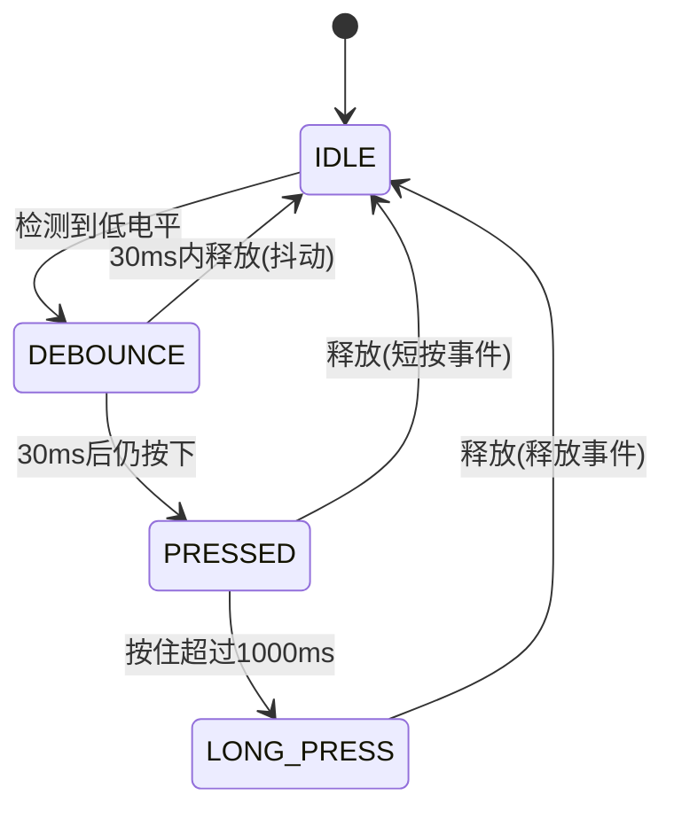

# 按键状态机：消抖、短按与长按检测

<!-- WIKI_NAV_START -->
> [!info] RTOS Wiki 导航
> [[projects/RTOS项目/index|项目首页]] · [[4.2.3 多传感器融合风速算法|← 上一篇：4.2.3 多传感器融合风速算法]] · [[4.3.2 LCD 显示驱动与UI设计|下一篇：4.3.2 LCD 显示驱动与UI设计 →]]
<!-- WIKI_NAV_END -->

> **实现状态（源码审计后）**：消抖30ms、长按阈值1000ms，使用 `xTaskGetTickCount()`。事件保存在每个按键结构体的单个 `event` 字段中，不是消息队列；`KEY_STATE_WAIT_RELEASE` 枚举当前未被状态机使用。

本文档介绍按键非阻塞状态机、短按、长按和持续长按事件。

## 硬件配置与引脚定义

项目使用两个物理按键，均采用上拉输入模式，按下时产生低电平信号。按键1（PB1）用于工作模式循环切换，按键2（PB12）具有双重功能：短按切换档位，长按控制风机开关。

| 按键 | GPIO端口 | 引脚 | 模式 | 功能 |
|:---|:---|:---|:---|:---|
| KEY1 | GPIOB | PB1 | 上拉输入（IPU） | 短按切换工作模式 |
| KEY2 | GPIOB | PB12 | 上拉输入（IPU） | 短按切换档位，长按开关风机 |

GPIO配置通过通用的`io_set()`函数完成，该函数会自动使能对应端口的时钟并配置引脚模式。上拉输入模式下，内部上拉电阻确保引脚在按键释放时保持高电平，按下时外部接地使电平变为低电平。

Sources: `BSP/KEY/key.h#L15-L20`, `BSP/KEY/key.c#L44-L50`, `BSP/GPIO/gpiox.c#L14-L25`

## 状态机架构设计

按键驱动的核心是一个四状态有限状态机，每个状态对应按键检测过程中的一个阶段。状态机通过对比`xTaskGetTickCount()`的时间差实现非阻塞延时判断，完全不依赖`delay_ms()`等阻塞函数。



**状态职责说明**：

| 状态 | 主要职责 | 转移条件 |
|:---|:---|:---|
| **IDLE** | 空闲等待，监测按键按下 | 检测到低电平 → DEBOUNCE |
| **DEBOUNCE** | 消抖等待30ms，过滤机械抖动 | 30ms后仍按下 → PRESSED；松开 → IDLE |
| **PRESSED** | 等待释放或判断长按 | 松手 → 短按事件；按住超1秒 → 长按事件 |
| **LONG_PRESS** | 长按持续检测 | 松手 → 释放事件，返回IDLE |

这种设计确保了按键检测的可靠性：消抖阶段过滤了机械抖动，按下确认阶段区分了短按和长按，长按阶段支持持续事件触发。

Sources: `BSP/KEY/key.h#L48-L54`, `BSP/KEY/key.c#L67-L151`, 

## 核心数据结构

按键驱动使用三个关键数据结构：事件枚举、状态枚举和控制结构体。这种设计将硬件操作与逻辑处理解耦，提高了代码的可维护性和可扩展性。

**事件枚举（KeyEvent_t）** 定义了五种按键事件类型，每种事件对应不同的用户操作：

```c
typedef enum {
    KEY_EVENT_NONE = 0,         // 无事件（初始或已清除）
    KEY_EVENT_SHORT_PRESS,      // 短按事件（按下后在长按时间内释放）
    KEY_EVENT_LONG_PRESS,       // 长按事件（首次达到长按阈值时触发一次）
    KEY_EVENT_LONG_PRESSING,    // 长按持续中（长按期间每个扫描周期都触发）
    KEY_EVENT_RELEASE           // 按键释放事件（从长按状态释放时触发）
} KeyEvent_t;
```

**控制结构体（Key_t）** 封装了单个按键的完整状态信息：

```c
typedef struct {
    KeyState_t state;           // 当前状态机状态
    TickType_t pressStartTick;  // 按下开始时间戳（FreeRTOS tick）
    u8 (*readPin)(void);        // 读取引脚电平的函数指针
    KeyEvent_t event;           // 当前产生的事件
    u8 longPressTriggered;      // 长按是否已触发的标志
} Key_t;
```

函数指针`readPin`是实现可扩展性的关键设计。在初始化时，每个按键实例绑定到不同的读取函数（如`Key1_ReadPin`和`Key2_ReadPin`），使得通用的`Key_StateMachine()`函数能够处理任意按键，无需修改状态机逻辑。

Sources: `BSP/KEY/key.h#L39-L63`, `BSP/KEY/key.c#L28-L42`

## 状态机实现细节

状态机的核心逻辑位于`Key_StateMachine()`函数中，该函数在每次`Key_Scan()`调用时处理一个按键实例的状态转移。以下是关键实现细节：

**消抖机制**：当从IDLE状态检测到按键按下时，记录当前tick值作为起始时间。进入DEBOUNCE状态后，通过比较当前tick与起始tick的差值判断是否达到30ms消抖时间。只有消抖完成后再次确认按键仍处于按下状态，才转移到PRESSED状态；否则视为抖动，返回IDLE状态。

**长按判断**：在PRESSED状态下，持续检测按键是否保持按下。当按下时间超过1000ms时，触发`KEY_EVENT_LONG_PRESS`事件并设置`longPressTriggered`标志。该标志有两个重要作用：一是防止长按事件重复触发，二是防止长按后释放时误触发短按事件。

**持续触发机制**：进入LONG_PRESS状态后，只要按键保持按下，每个扫描周期都会产生`KEY_EVENT_LONG_PRESSING`事件。这种设计在本项目中用于蜂鸣器持续鸣叫——按键按住多久，蜂鸣器就响多久。

**时间精度保障**：使用FreeRTOS的`xTaskGetTickCount()`获取系统tick，通过`pdMS_TO_TICKS()`宏将毫秒转换为tick数。这种方法的时间判断不受调用周期波动影响，即使扫描间隔有微小偏差，时间判断仍然准确。

Sources: `BSP/KEY/key.c#L87-L100`, `BSP/KEY/key.c#L105-L115`, `BSP/KEY/key.c#L127-L145`

## 事件驱动与任务集成

按键驱动采用事件驱动架构，将底层硬件操作与上层业务逻辑完全分离。`KeyScanTask`任务负责周期性调用`Key_Scan()`驱动状态机，然后通过`GetEvent()`接口获取事件并执行相应操作。

**任务配置参数**：
- 优先级：4（`TASK_KEY_PRIORITY`）
- 扫描周期：10ms
- 栈大小：64字（`TASK_KEY_STK_SIZE`）

10ms的扫描周期与30ms消抖时间配合良好：消抖期间约进行3次扫描，1000ms长按时间约进行100次扫描，确保了足够的时间分辨率。

**事件处理流程**：

```c
// 获取按键1事件（模式切换）
key1Event = Key1_GetEvent();
if (key1Event == KEY_EVENT_SHORT_PRESS)
{
    System_SwitchMode();           // 切换工作模式
    Buzzer_Beep(100, &bep);        // 短按提示音
    Key1_ClearEvent();             // 清除事件
}
else if (key1Event == KEY_EVENT_LONG_PRESSING)
{
    Beep_on(&bep);                 // 长按持续鸣叫
}
else if (key1Event == KEY_EVENT_RELEASE)
{
    Beep_off(&bep);                // 释放时停止鸣叫
    Key1_ClearEvent();
}
```

**事件消费模式**：上层任务必须通过`ClearEvent()`手动清除已处理的事件，否则事件会持续存在。对于`LONG_PRESSING`事件，由于每个扫描周期都会被状态机覆盖，通常不需要手动清除。

Sources: `APP_TASK/app_tasks.c#L197-L249`, `APP_TASK/app_tasks.h#L75-L77`

## 设计决策与取舍分析

该按键驱动在设计过程中面临多个关键决策点，每个选择都涉及性能、复杂度和可维护性的权衡。

**决策一：非阻塞状态机 vs 阻塞延时**

选择非阻塞状态机而非传统的`delay_ms(30)`消抖方案。虽然状态机代码复杂度更高，但在FreeRTOS多任务环境中，阻塞延时会浪费CPU时间片，影响其他同优先级任务的调度。非阻塞设计确保了系统的实时响应性。

**决策二：函数指针抽象 vs 直接GPIO读取**

使用函数指针`readPin`抽象引脚读取操作，而非在状态机中直接调用`GPIO_ReadInputDataBit()`。这种设计增加了少量函数调用开销，但带来了显著的扩展性优势：新增按键只需添加读取函数和实例，无需修改状态机逻辑。

**决策三：事件驱动 vs 轮询状态**

采用事件驱动而非直接轮询GPIO状态。事件驱动模式实现了驱动层与应用层的解耦，应用层只需关注"发生了什么事件"而非"当前引脚是什么电平"，降低了模块间的耦合度。

**决策四：手动清除事件 vs 自动清除**

事件需要调用方手动清除，而非在`GetEvent()`后自动清除。这种设计给予了上层任务更大的灵活性，但也增加了使用复杂度——开发者必须记得清除已处理的事件。

| 决策点 | 选择 | 优势 | 代价 |
|:---|:---|:---|:---|
| 消抖方式 | 非阻塞状态机 | 不阻塞CPU，实时性好 | 代码复杂度较高 |
| 时间源 | xTaskGetTickCount() | 精度高，不受调用周期影响 | 依赖FreeRTOS运行 |
| 引脚读取 | 函数指针抽象 | 可扩展性强 | 轻微函数调用开销 |
| 事件消费 | 手动清除 | 灵活性高 | 使用复杂度增加 |
| 长按触发 | 持续触发机制 | 支持持续操作（如蜂鸣器） | 调用方需处理事件流 |

Sources: `BSP/KEY/key.h#L57-L63`, `BSP/KEY/key.c#L67-L151`

## 扩展性与配置调整

该按键驱动具有良好的可扩展性和可配置性，支持多种常见的修改场景。

**新增按键**：只需四个步骤即可添加新按键：
1. 在`key.h`中定义引脚和读取宏
2. 在`key.c`中添加静态实例和读取函数
3. 在`Key_Init()`中初始化新实例
4. 在`Key_Scan()`中添加状态机调用

状态机函数`Key_StateMachine()`完全通用，无需修改。

**调整时间参数**：消抖时间和长按阈值通过宏定义控制，修改这些宏即可调整行为：

```c
#define KEY_DEBOUNCE_TIME_MS    30      // 消抖时间：30ms
#define KEY_LONG_PRESS_TIME_MS  1000    // 长按时间：1000ms
```

**修改按键功能**：按键功能映射位于`app_tasks.c`的`KeyScanTask()`中，修改事件处理逻辑即可改变按键功能，无需修改驱动层代码。

**自定义长按行为**：可通过修改`KEY_STATE_LONG_PRESS`状态的处理逻辑，控制长按期间是否持续产生`LONG_PRESSING`事件。

**硬件滤波配合**：如果按键硬件本身有RC滤波电路，可以适当缩短消抖时间（如从30ms改为10ms），提高响应速度。但需注意，过短的消抖时间可能导致机械抖动被误判。

Sources: `BSP/KEY/key.h#L34-L36`, `APP_TASK/app_tasks.c#L215-L248`

## 典型应用场景

基于事件类型，按键在系统中承担不同的交互职责：

**短按交互**：
- KEY1短按：循环切换工作模式（待机→手动→自动→防回流）
- KEY2短按：在手动模式下切换风速档位（低档↔高档）

**长按交互**：
- KEY2长按：开关风机（无论当前处于何种模式）
- KEY1/KEY2长按持续：蜂鸣器持续鸣叫，提供听觉反馈

**事件生命周期示例**：
1. 用户按下KEY2并保持1.5秒后释放
2. 系统产生事件序列：`LONG_PRESS` → `LONG_PRESSING`×150次 → `RELEASE`
3. 首次`LONG_PRESS`触发风机开关切换
4. 持续`LONG_PRESSING`期间蜂鸣器持续鸣叫
5. `RELEASE`事件停止蜂鸣器

这种设计提供了丰富的交互层次：短按用于轻量级操作，长按用于重要操作，持续触发用于状态反馈。

Sources: `APP_TASK/app_tasks.c#L215-L248`, `BSP/KEY/key.h#L39-L45`

## 常见问题与调试要点

**问题1：按键无响应**
- 检查时钟使能：`io_set()`函数会自动使能GPIO时钟，但需确认端口正确
- 检查引脚模式：必须配置为上拉输入（`GPIO_Mode_IPU`）
- 检查电平逻辑：确认`KEY_PRESSED_LEVEL`与实际硬件匹配

**问题2：事件持续触发**
- 检查事件清除：确认在事件处理后调用了`ClearEvent()`
- 检查状态机逻辑：确保`longPressTriggered`标志正确复位

**问题3：长按后松手误触发短按**
- 检查`longPressTriggered`标志：长按触发时应设为1，释放时应重置为0
- 检查条件判断：释放时应检查`!key->longPressTriggered`再触发短按

**问题4：消抖不彻底**
- 调整消抖时间：根据按键机械特性调整`KEY_DEBOUNCE_TIME_MS`
- 检查扫描周期：确保`Key_Scan()`调用频率足够（建议10ms）

**调试技巧**：
- 使用串口打印状态机状态和事件值
- 在`Key_StateMachine()`中添加调试输出
- 检查FreeRTOS系统tick是否正常递增

Sources: `BSP/KEY/key.c#L87-L100`, `BSP/KEY/key.c#L117-L125`

## 下一步学习建议

按键状态机作为用户交互的核心模块，与系统多个组件紧密关联。建议按以下顺序深入学习：

1. **[[4.3.2 LCD 显示驱动与UI设计|LCD显示驱动与UI设计]]**：了解按键事件如何驱动界面更新
2. **[[4.3.3 蜂鸣器控制与音频提示|蜂鸣器控制与音频提示]]**：学习按键反馈的听觉设计
3. **[[5.1 工作模式：待机、手动、自动、防回流|工作模式：待机、手动、自动、防回流]]**：理解按键切换的模式逻辑
4. **[[3.2 任务创建、调度与优先级设计|任务创建、调度与优先级设计]]**：掌握KeyScanTask的调度机制

<!-- WIKI_FOOTER_START -->
---
> [!tip] 继续阅读
> [[projects/RTOS项目/index|项目首页]] · [[4.2.3 多传感器融合风速算法|← 上一篇：4.2.3 多传感器融合风速算法]] · [[4.3.2 LCD 显示驱动与UI设计|下一篇：4.3.2 LCD 显示驱动与UI设计 →]]
<!-- WIKI_FOOTER_END -->
