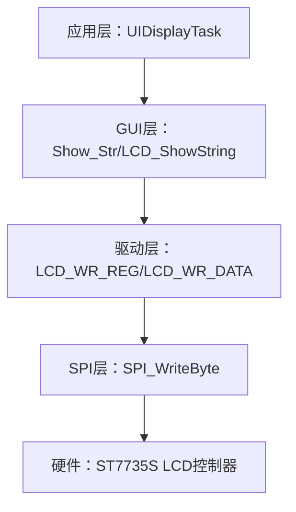
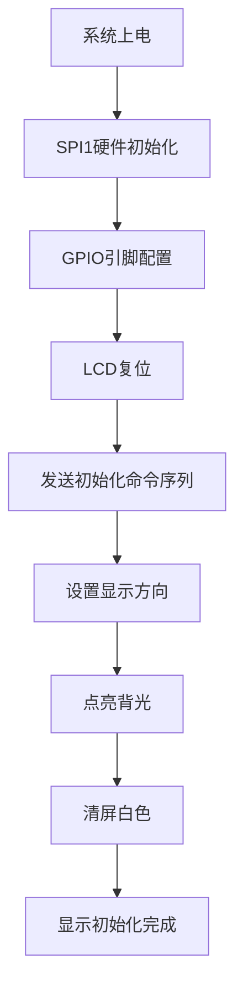
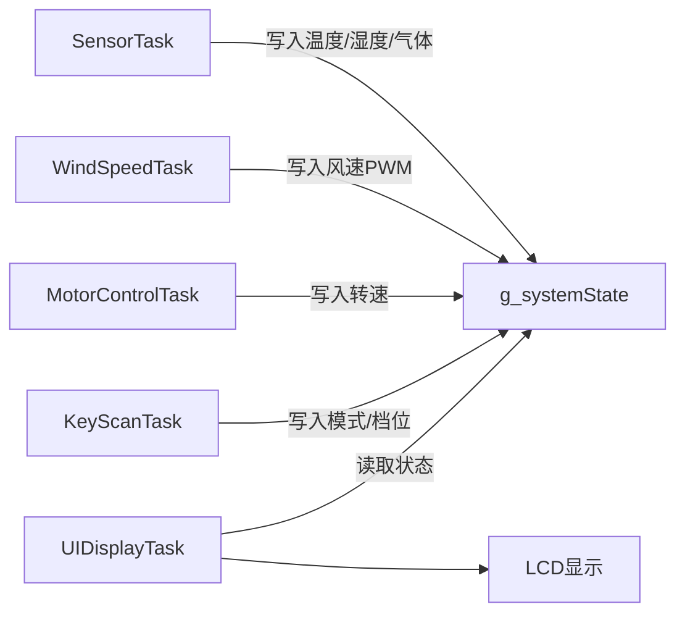

# LCD 显示驱动与UI设计

<!-- WIKI_NAV_START -->
> [!info] RTOS Wiki 导航
> [[projects/RTOS项目/index|项目首页]] · [[4.3.1 按键状态机：消抖、短按与长按检测|← 上一篇：4.3.1 按键状态机：消抖、短按与长按检测]] · [[4.3.3 蜂鸣器控制与音频提示|下一篇：4.3.3 蜂鸣器控制与音频提示 →]]
<!-- WIKI_NAV_END -->

> **实现状态（源码审计后）**：LCD驱动和200ms UI任务已接入。显示函数包含同步SPI写入和字符串格式化，属于低优先级周期刷新；仓库没有DMA刷新、双缓冲或帧率测试。

本文档阐述LCD驱动、SPI写入与FreeRTOS任务级UI刷新调用链。

## 硬件架构与引脚配置

LCD模块采用ST7735S控制器，支持128×160像素分辨率的TFT彩色屏幕。系统通过SPI总线与LCD通信，采用硬件SPI1接口，数据传输速率可达36MHz（72MHz/2）。引脚配置如下表所示：

| 信号 | 引脚 | 功能描述 |
|------|------|----------|
| SCK | PA5 | SPI时钟信号 |
| SDA | PA7 | SPI数据输出（MOSI） |
| LED | PB6 | 背光控制，高电平点亮 |
| RS | PB7 | 寄存器/数据选择，0=命令，1=数据 |
| RST | PB8 | 复位信号，低电平有效 |
| CS | PB9 | 片选信号，低电平有效 |

背光控制采用GPIO直接驱动，通过`LCD_LED`宏定义控制PB6引脚电平，实现屏幕开关控制。片选、复位和数据选择信号通过GPIOB的BSHR/BCR寄存器直接操作，提供高效的位操作性能。

Sources: `BSP/LCD/lcd.h#L1-L148`, `BSP/SPI/SPI.h#L1-L43`

## 三层软件架构设计

LCD驱动采用清晰的三层架构设计，每层职责明确，便于维护和扩展：



**第一层：SPI驱动层**
负责硬件SPI通信，通过`SPI_WriteByte()`函数实现字节级数据传输。该函数使用轮询方式等待发送缓冲区空，然后写入数据字节，实现可靠的同步通信。

Sources: `BSP/SPI/SPI.c#L40-L65`

**第二层：LCD驱动层**
封装LCD控制器的底层操作，包括命令/数据写入、光标设置、窗口管理等核心功能。关键函数包括：
- `LCD_WR_REG(u8 data)`：写入8位命令，RS引脚拉低
- `LCD_WR_DATA(u8 data)`：写入8位数据，RS引脚拉高
- `Lcd_WriteData_16Bit(u16 Data)`：写入16位像素数据，分两次SPI传输
- `LCD_SetWindows()`：设置绘图窗口范围

Sources: `BSP/LCD/lcd.c#L50-L120`

**第三层：GUI应用层**
提供高级绘图API，支持点、线、矩形、圆形、文字等图形元素绘制。核心函数`Show_Str()`实现中英文混合字符串显示，自动识别字符类型并调用相应字库。

Sources: `BSP/LCD/GUI.c#L600-L750`

## 字体系统与字库管理

系统内置完整的点阵字库，支持多种字符尺寸：

| 字符类型 | 尺寸 | 存储结构 | 内存占用 |
|----------|------|----------|----------|
| ASCII | 12×6 | `asc2_1206[95][12]` | 1,140字节 |
| ASCII | 16×8 | `asc2_1608[95][16]` | 1,520字节 |
| 中文 | 16×16 | `tfont16[]` | 按需加载 |
| 中文 | 24×24 | `tfont24[]` | 按需加载 |
| 中文 | 32×32 | `tfont32[]` | 按需加载 |

中文字符采用GB2312编码，字库数据以结构体数组形式存储，每个字符包含2字节索引和点阵数据。`Show_Str()`函数通过逐字节解析字符串，判断字符类型（ASCII或中文），然后调用相应的显示函数。

Sources: `BSP/LCD/FONT.H#L1-L437`, `BSP/LCD/GUI.c#L700-L750`

## FreeRTOS UI显示任务

UI显示任务作为系统中的低优先级任务运行，负责定期刷新屏幕显示内容。任务配置如下：

| 参数 | 值 | 说明 |
|------|-----|------|
| 优先级 | 1 | 最低优先级，不阻塞关键任务 |
| 栈大小 | 256字节 | 满足字符串格式化需求 |
| 刷新周期 | 200ms | 5Hz刷新率，平衡性能与功耗 |

任务主循环通过`sprintf()`函数格式化系统状态数据，然后调用`Show_Str()`函数显示。显示内容包括：

```c
// 显示内容示例
"Mode:Auto    "     // 当前工作模式
"Level:HIGH   "     // 档位设置
"WIND:85.5%   "     // 风速PWM百分比
"RPM:1250     "     // 实际转速
"Auto:Cooking "     // 自动模式状态
"AMCnt:30s    "     // 自动模式计时
"CECnt:15s    "     // Cooking Event计时
```

UIDisplayTask读取 `g_systemState` 生成显示内容。项目设计了 `g_dataMutex`，但并非所有任务访问都加锁；UI页只讨论显示任务自身的读取路径。

Sources: `APP_TASK/app_tasks.c#L560-L630`, `APP_TASK/app_tasks.h#L80-L129`

## 显示内容布局设计

LCD屏幕采用垂直布局，每行显示一项系统信息，行间距20像素：

| Y坐标 | 显示内容 | 数据来源 | 更新频率 |
|--------|----------|----------|----------|
| 0-19 | 初始化提示 | 固定文本 | 启动时 |
| 20-39 | 工作模式 | `g_systemState.currentMode` | 模式切换时 |
| 40-59 | 档位设置 | `g_systemState.speedLevel` | 档位切换时 |
| 60-79 | 风速PWM | `g_systemState.windSpeedPWM` | 200ms |
| 80-99 | 实际转速 | `g_systemState.actualRPM` | 200ms |
| 100-119 | 自动模式状态 | `g_autoModeState` | 状态变化时 |
| 120-139 | 自动模式计时 | `g_systemState.autoModeCounter` | 1s |
| 140-159 | Cooking Event计时 | `g_systemState.cookingEventCounter` | 1s |

颜色配置采用蓝色前景、白色背景的高对比度方案，确保在各种光照条件下的可读性。

Sources: `APP_TASK/app_tasks.c#L570-L625`

## SPI通信时序与性能优化

SPI通信采用模式0（CPOL=0, CPHA=1），数据在时钟上升沿采样。关键时序参数：

| 参数 | 值 | 说明 |
|------|-----|------|
| 时钟频率 | 36MHz | 72MHz/2分频 |
| 数据位宽 | 8位 | 标准SPI传输 |
| 传输模式 | 全双工 | 同时收发 |
| 片选管理 | 手动 | 每次传输前后控制CS |

性能优化策略包括：
1. **直接寄存器操作**：使用GPIO BSHR/BCR寄存器进行位操作，避免库函数调用开销
2. **窗口化写入**：通过`LCD_SetWindows()`设置绘图区域，减少光标设置开销
3. **批量数据传输**：`LCD_Clear()`函数在窗口设置后连续写入像素数据，提高刷新效率

Sources: `BSP/SPI/SPI.c#L50-L70`, `BSP/LCD/lcd.c#L150-L200`

## 初始化流程

LCD初始化遵循严格的时序要求，确保控制器正确启动：



初始化命令序列包括ST7735S的帧率设置、电源配置、伽马校正、显示方向设置等关键参数。其中`LCD_direction()`函数根据`USE_HORIZONTAL`宏定义设置屏幕旋转方向，支持0°、90°、180°、270°四种显示模式。

Sources: `BSP/LCD/lcd.c#L200-L300`, `USER/main.c#L80-L100`

## 图形绘制API详解

GUI层提供丰富的绘图函数，满足界面设计需求：

**基础图形绘制**
- `GUI_DrawPoint(x, y, color)`：绘制单个像素点
- `LCD_DrawLine(x1, y1, x2, y2)`：Bresenham直线算法
- `LCD_DrawRectangle(x1, y1, x2, y2)`：绘制矩形边框
- `LCD_DrawFillRectangle(x1, y1, x2, y2)`：填充矩形区域
- `gui_circle(xc, yc, c, r, fill)`：中点圆算法，支持填充

**文字显示函数**
- `LCD_ShowChar(x, y, fc, bc, num, size, mode)`：显示单个字符
- `LCD_ShowString(x, y, size, p, mode)`：显示英文字符串
- `Show_Str(x, y, fc, bc, str, size, mode)`：中英文混合显示
- `LCD_ShowNum(x, y, num, len, size)`：显示数字

所有绘图函数都支持颜色参数，采用RGB565格式（16位色深），提供65K色显示能力。

Sources: `BSP/LCD/GUI.c#L50-L200`, `BSP/LCD/GUI.h#L30-L50`

## 与系统其他模块的集成

LCD显示任务与系统其他模块通过全局状态结构体进行数据交互：



UI任务优先级为1并以200ms周期刷新；其优先级较低，但同步SPI写屏和格式化仍会占用CPU，不能笼统说“不会阻塞”其他任务，只能依靠更高优先级任务的抢占降低影响。

Sources: `APP_TASK/app_tasks.c#L30-L50`, `APP_TASK/app_tasks.h#L50-L80`

## 故障排查与调试技巧

常见显示问题及解决方案：

| 故障现象 | 可能原因 | 解决方案 |
|----------|----------|----------|
| 屏幕无显示 | 背光未开启 | 检查PB6引脚电平，`LCD_LED=1` |
| 显示错位 | SPI时序问题 | 调整SPI时钟极性/相位配置 |
| 颜色异常 | RGB顺序错误 | 修改`LCD_WriteReg(0x36)`参数 |
| 中文乱码 | 字库缺失 | 检查FONT.H中是否包含所需字符 |
| 刷新缓慢 | SPI速率过低 | 提高SPI分频系数，使用DMA传输 |

调试时可通过串口输出`g_systemState`结构体内容，验证数据是否正确更新。若显示内容不更新，检查UIDisplayTask是否正常运行，可通过任务状态监控确认。

Sources: `BSP/LCD/lcd.c#L250-L280`, `APP_TASK/app_tasks.c#L560-L580`

## 性能优化建议

针对当前实现，可考虑以下优化方向：

1. **DMA传输**：启用SPI DMA模式，减少CPU占用，提高数据传输效率
2. **局部刷新**：仅更新变化区域，避免全屏刷新
3. **双缓冲技术**：使用帧缓冲区，减少屏幕闪烁
4. **字体压缩**：采用压缩算法减少字库存储空间
5. **异步刷新**：使用消息队列实现非阻塞显示更新

当前实现已满足系统需求，200ms刷新周期在保证实时性的同时，为其他任务留出充足CPU时间。

Sources: `BSP/SPI/SPI.c#L40-L60`, `APP_TASK/app_tasks.c#L560-L580`

## 相关文档导航

为深入理解LCD显示在系统中的位置，建议按以下顺序阅读相关文档：

- [[2.1 三层架构：驱动层、RTOS中间层、应用层|三层架构：驱动层、RTOS中间层、应用层]] - 理解整体架构设计
- [[3.2 任务创建、调度与优先级设计|任务创建、调度与优先级设计]] - 掌握任务调度机制
- [[4.3.1 按键状态机：消抖、短按与长按检测|按键状态机：消抖、短按与长按检测]] - 了解用户输入处理
- [[4.2.3 多传感器融合风速算法|多传感器融合风速算法]] - 理解显示数据来源

<!-- WIKI_FOOTER_START -->
---
> [!tip] 继续阅读
> [[projects/RTOS项目/index|项目首页]] · [[4.3.1 按键状态机：消抖、短按与长按检测|← 上一篇：4.3.1 按键状态机：消抖、短按与长按检测]] · [[4.3.3 蜂鸣器控制与音频提示|下一篇：4.3.3 蜂鸣器控制与音频提示 →]]
<!-- WIKI_FOOTER_END -->
