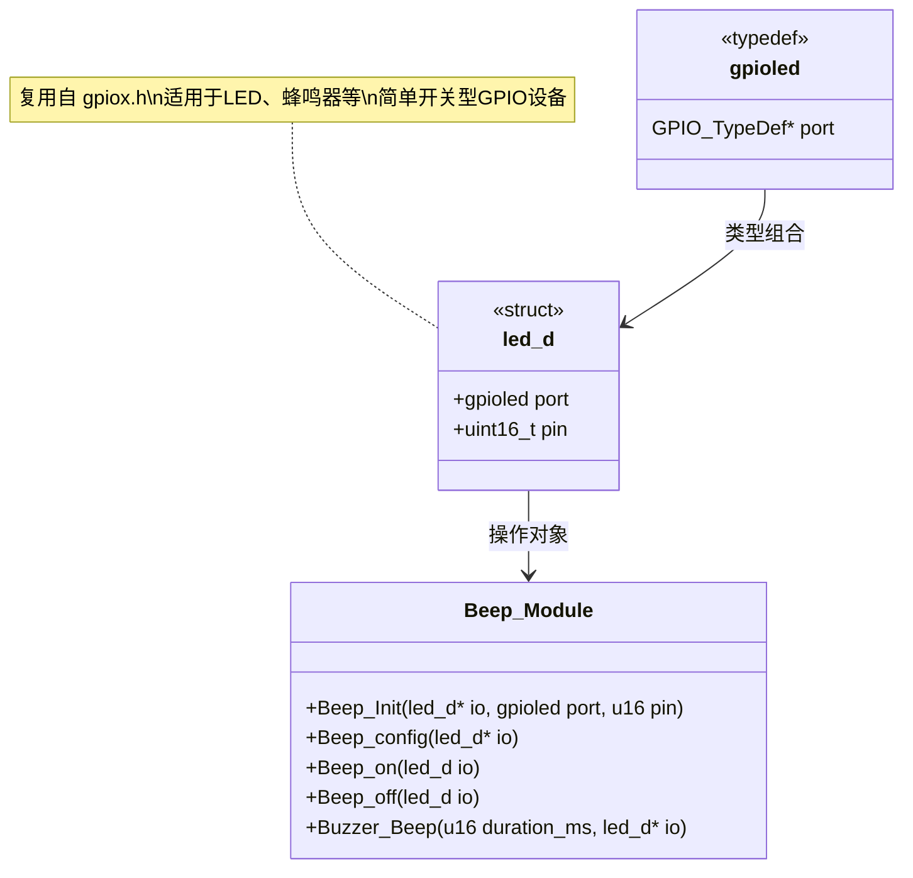
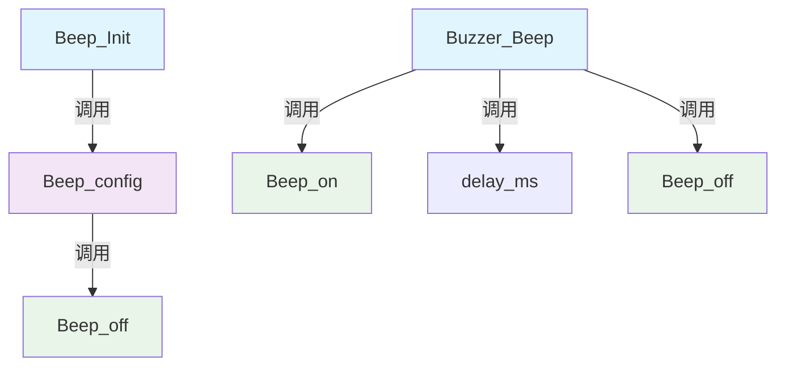
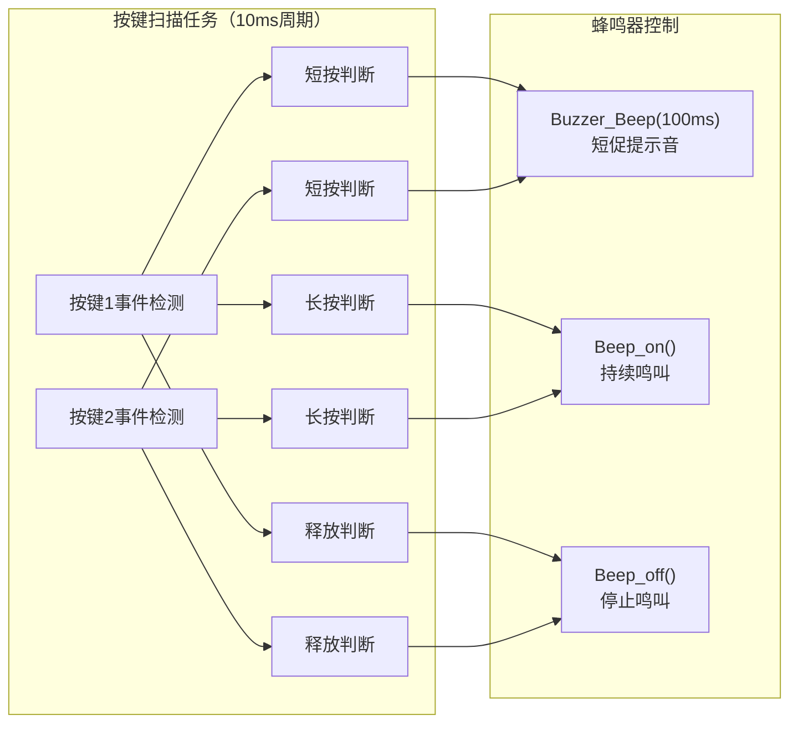
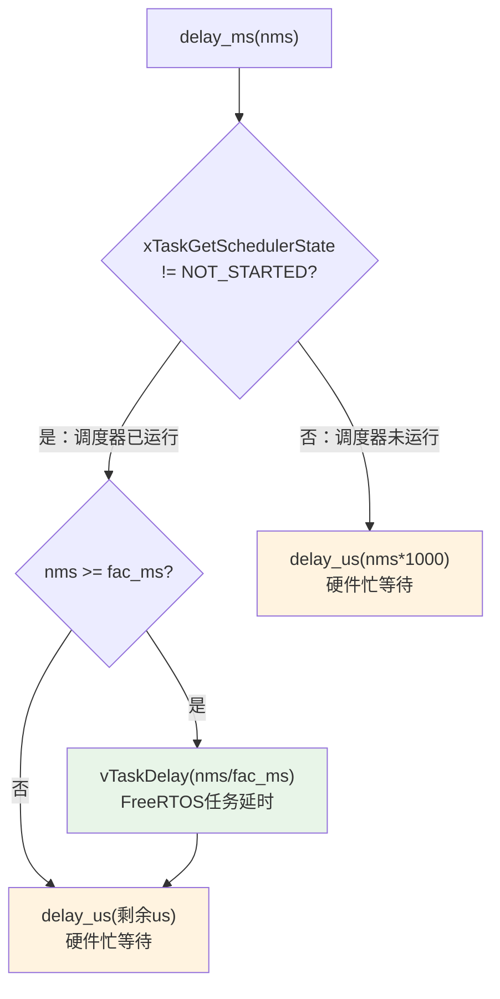
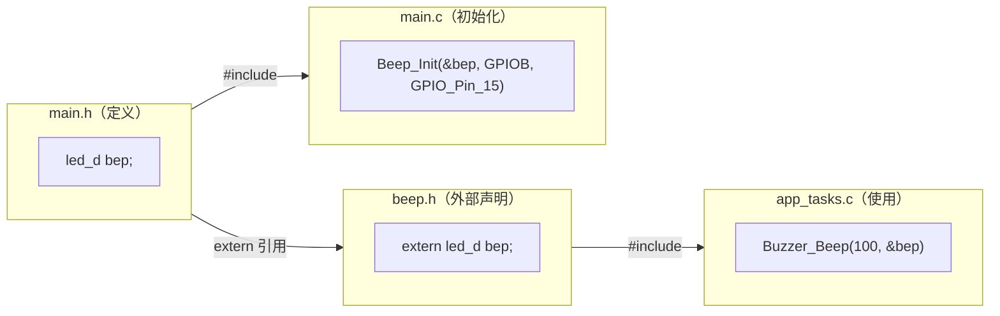
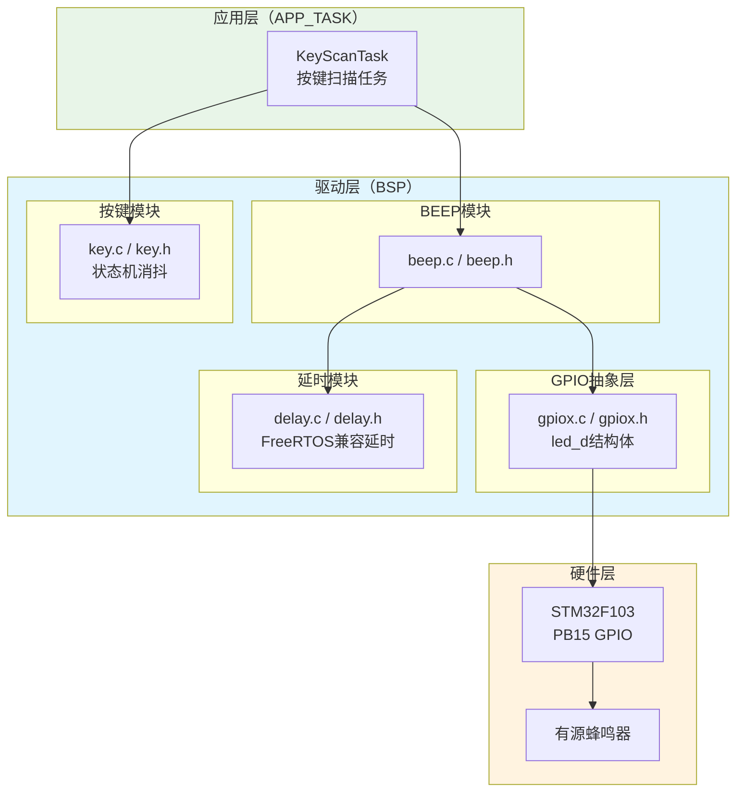

# 蜂鸣器控制与音频提示

<!-- WIKI_NAV_START -->
> [!info] RTOS Wiki 导航
> [[projects/RTOS项目/index|项目首页]] · [[4.3.2 LCD 显示驱动与UI设计|← 上一篇：4.3.2 LCD 显示驱动与UI设计]] · [[5.1 工作模式：待机、手动、自动、防回流|下一篇：5.1 工作模式：待机、手动、自动、防回流 →]]
<!-- WIKI_NAV_END -->

> **实现状态（源码审计后）**：蜂鸣器当前由KeyScanTask用于按键反馈，没有专用蜂鸣任务或事件队列。`Buzzer_Beep(100)`内部使用阻塞延时，会让按键任务在短按提示期间停约100ms；报警仲裁属于扩展方案。

本页面解析蜂鸣器GPIO封装与按键反馈调用链。

## 蜂鸣器硬件特性与选型

本项目采用**有源蜂鸣器**（Active Buzzer），其内部集成了振荡驱动电路，只需提供直流电平即可发声——**高电平响，低电平不响**。与无源蜂鸣器需要外部PWM信号驱动不同，有源蜂鸣器的控制极其简单，仅需GPIO的高低电平切换即可实现开关控制。

蜂鸣器硬件连接至STM32的**PB15引脚**，工作在推挽输出模式，驱动速率为50MHz。这一引脚选择避免了与系统中其他关键外设的冲突——PB1~PB2用于按键，TIM1用于电机PWM，TIM2用于编码器，PB15正好处于GPIOB端口的高引脚区域，不影响其他外设配置。

| 特性 | 说明 |
|------|------|
| 类型 | 有源蜂鸣器（内置振荡电路） |
| 控制引脚 | PB15（GPIOB Pin 15） |
| 工作电平 | 高电平发声，低电平静音 |
| GPIO模式 | 推挽输出（GPIO_Mode_Out_PP） |
| 驱动速率 | 50MHz |
| 控制方式 | 电平开关控制（非PWM频率控制） |

Sources: `BSP/BEEP/beep.h#L6-L9` | `BSP/BEEP/beep.c#L4-L5` | `USER/main.c#L51-L52`

## 驱动层架构：通用GPIO抽象与复用设计

蜂鸣器驱动的一个显著设计亮点是**复用了LED驱动的通用GPIO数据结构** `led_d`。这个看似命名不够精确的选择，实际上体现了一种实用的硬件抽象思路：将所有"简单开关型GPIO设备"统一为一个通用结构体，通过不同的初始化参数实现差异化控制。

`led_d` 结构体定义在 `BSP/GPIO/gpiox.h` 中，仅包含两个成员：GPIO端口指针 `port` 和引脚编号 `pin`。这种设计使得蜂鸣器驱动与LED驱动共享同一套底层抽象，新设备只需传入不同的端口和引脚参数即可复用全部驱动逻辑。

Sources: `BSP/GPIO/gpiox.h#L12-L18` | `BSP/BEEP/beep.h#L17`

## 驱动API详解：初始化流程与控制函数

蜂鸣器驱动层提供五个API函数，按照调用关系形成清晰的层次结构：

**初始化流程**（`Beep_Init` → `Beep_config`）：

`Beep_Init` 是对外的初始化入口，接收结构体指针、GPIO端口和引脚三个参数。函数内部首先根据端口参数使能对应的APB2时钟（通过 `RCC_APB2PeriphClockCmd`），然后将端口和引脚信息保存到结构体中，最后调用 `Beep_config` 完成GPIO配置。

`Beep_config` 配置GPIO为推挽输出模式，速率为50MHz，并在配置完成后立即将引脚拉低（`Beep_off`），确保蜂鸣器初始状态为静音——这是一个重要的安全设计，避免上电瞬间的意外发声。

| API函数 | 功能 | 参数说明 | 调用场景 |
|---------|------|----------|----------|
| `Beep_Init` | 初始化蜂鸣器IO口 | `io`: 结构体指针; `port`: GPIOA~G; `pin`: GPIO_Pin_x | 系统启动时调用一次 |
| `Beep_config` | 配置GPIO为推挽输出 | `io`: 结构体指针 | 被 `Beep_Init` 内部调用 |
| `Beep_on` | 打开蜂鸣器（输出高电平） | `io`: 结构体指针 | 长按持续鸣叫 |
| `Beep_off` | 关闭蜂鸣器（输出低电平） | `io`: 结构体指针 | 按键释放、短按结束 |
| `Buzzer_Beep` | 鸣叫指定毫秒后自动关闭 | `duration_ms`: 持续时间; `io`: 结构体指针 | 短按提示音 |

Sources: `BSP/BEEP/beep.c#L24-L96` | `BSP/BEEP/beep.h#L20-L24`

## 应用层集成：按键事件与音频反馈映射

蜂鸣器在应用层的使用完全集中在**按键扫描任务**（`KeyScanTask`）中，为两个物理按键提供差异化的音频反馈。这种设计将蜂鸣器控制逻辑与用户交互事件紧密绑定，实现了"事件驱动的音频反馈"模式。

两个按键的蜂鸣器反馈行为完全对称：

| 按键事件 | 按键1（模式切换） | 按键2（档位/开关） | 蜂鸣器行为 |
|----------|-------------------|-------------------|------------|
| 短按 (`KEY_EVENT_SHORT_PRESS`) | 切换工作模式 | 切换档位 | `Buzzer_Beep(100, &bep)` — 100ms短促提示音 |
| 长按持续 (`KEY_EVENT_LONG_PRESSING`) | — | — | `Beep_on(&bep)` — 持续鸣叫 |
| 长按完成 (`KEY_EVENT_LONG_PRESS`) | — | 切换电机开关 | （由按键状态机处理） |
| 释放 (`KEY_EVENT_RELEASE`) | — | — | `Beep_off(&bep)` — 停止鸣叫 |

**关键设计决策**：短按使用 `Buzzer_Beep` 函数产生100ms的阻塞式提示音，长按则使用 `Beep_on`/`Beep_off` 配对实现"按住响、松开停"的交互体验。由于 `KeyScanTask` 的扫描周期为10ms，100ms的短按提示音会阻塞任务约10个扫描周期，但对按键响应的影响可以接受。

Sources: `APP_TASK/app_tasks.c#L197-L249` | `BSP/KEY/key.h#L39-L45`

## delay_ms的FreeRTOS兼容性分析

`Buzzer_Beep` 内部调用的 `delay_ms` 并非简单的忙等待延时。该函数具有**FreeRTOS感知能力**：当调度器已启动时，会自动调用 `vTaskDelay` 让出CPU；当延时时间小于OS最小节拍时，退化为硬件忙等待。

这意味着在 `KeyScanTask` 中调用 `Buzzer_Beep(100, &bep)` 时，100ms的延时会让任务进入阻塞态，其他同优先级或更高优先级的任务可以正常执行，不会造成CPU资源浪费。但需要注意：**在中断上下文中绝对不能调用 `Buzzer_Beep`**，因为 `vTaskDelay` 不能在中断中使用。

| 延时场景 | 适用函数 | 行为 |
|----------|----------|------|
| 任务上下文中的常规延时 | `delay_ms` | 调用 `vTaskDelay`，让出CPU |
| 中断上下文中的短延时 | `delay_us` | 硬件忙等待，不涉及OS |
| 不希望引起任务调度的延时 | `delay_xms` | 纯忙等待，保持任务执行 |

Sources: `SYSTEM/delay/delay.c#L81-L92` | `BSP/BEEP/beep.c#L91-L96`

## 全局变量与作用域管理

蜂鸣器的核心数据结构 `bep` 采用**定义与声明分离**的作用域管理策略：

- **定义**：在 `main.h` 中声明 `led_d bep;`，这是全局变量的实际存储位置
- **外部引用声明**：在 `beep.h` 中通过 `extern led_d bep;` 声明，使得任何包含 `beep.h` 的源文件都能访问该变量
- **初始化**：在 `main.c` 的 `Hardware_Init()` 中调用 `Beep_Init(&bep, GPIOB, GPIO_Pin_15)` 完成硬件配置

这种模式与项目中DHT11传感器的 `dht` 变量管理方式完全一致，保持了代码风格的一致性。

Sources: `USER/main.h#L44` | `BSP/BEEP/beep.h#L17` | `USER/main.c#L51-L52`

## 线程安全性分析

蜂鸣器在当前系统中**仅由 `KeyScanTask` 单一任务访问**，不存在多任务竞争问题，因此无需使用互斥信号量保护。`KeyScanTask` 的优先级为4（`TASK_KEY_PRIORITY`），属于中高优先级任务，不会被低优先级的UI任务或防回流任务抢占后打断蜂鸣器的鸣叫时序。

但如果未来扩展蜂鸣器的使用场景——例如在气体浓度超标时发出报警提示音——就需要考虑以下线程安全问题：

| 扩展场景 | 涉及任务 | 风险 | 解决方案 |
|----------|----------|------|----------|
| 气体报警蜂鸣 | AntiBackflowTask（优先级2） | 与KeyScanTask同时操作蜂鸣器 | 使用 `g_dataMutex` 保护或设计优先级仲裁 |
| 模式切换提示 + 传感器报警 | KeyScanTask + SensorTask | 蜂鸣器状态冲突 | 引入蜂鸣器事件队列，统一由单一任务消费 |

当前设计中，蜂鸣器的简单性（仅开关控制）和单一任务访问模式使得线程安全问题不存在，这也体现了"不过度设计"的工程原则。

Sources: `APP_TASK/app_tasks.h#L76-L84` | `APP_TASK/app_tasks.c#L197-L249`

## 架构层次定位与模块关系

蜂鸣器模块在项目三层架构中的位置如下：

蜂鸣器模块的依赖链清晰而简洁：应用层的 `KeyScanTask` 通过 `beep.h` 接口调用驱动层的蜂鸣器控制函数，驱动层内部依赖 `gpiox.h` 的通用GPIO抽象和 `delay.h` 的FreeRTOS兼容延时，最终通过STM32标准库操作PB15引脚控制硬件蜂鸣器。

Sources: `BSP/BEEP/beep.c#L11-L13` | `APP_TASK/app_tasks.c#L16` | `USER/main.c#L51-L52`

## 设计局限与扩展方向

当前蜂鸣器模块存在以下设计特点与局限：

**已实现的功能**：
- ✅ 按键短按提供100ms短促提示音，确认用户操作
- ✅ 按键长按提供持续鸣叫，释放即停的交互体验
- ✅ 初始化时自动静音，避免上电误响

**设计局限**：
- ❌ 仅支持开关控制，无法产生不同频率/音调的提示音（受限于有源蜂鸣器硬件）
- ❌ 未用于系统报警场景（如气体浓度超标、模式切换异常等）
- ❌ `led_d` 命名不够语义化，对新开发者不够直观

**可能的扩展方向**：
1. **更换为无源蜂鸣器**：通过TIM定时器PWM输出不同频率，实现多音调提示（如"滴滴"报警、上升音确认音等）
2. **增加系统事件报警**：在 `AntiBackflowTask` 检测到气体浓度超标时触发报警蜂鸣
3. **抽象音频事件队列**：设计统一的蜂鸣事件队列，由专用任务消费，解决多任务并发控制问题

<!-- WIKI_FOOTER_START -->
---
> [!tip] 继续阅读
> [[projects/RTOS项目/index|项目首页]] · [[4.3.2 LCD 显示驱动与UI设计|← 上一篇：4.3.2 LCD 显示驱动与UI设计]] · [[5.1 工作模式：待机、手动、自动、防回流|下一篇：5.1 工作模式：待机、手动、自动、防回流 →]]
<!-- WIKI_FOOTER_END -->
