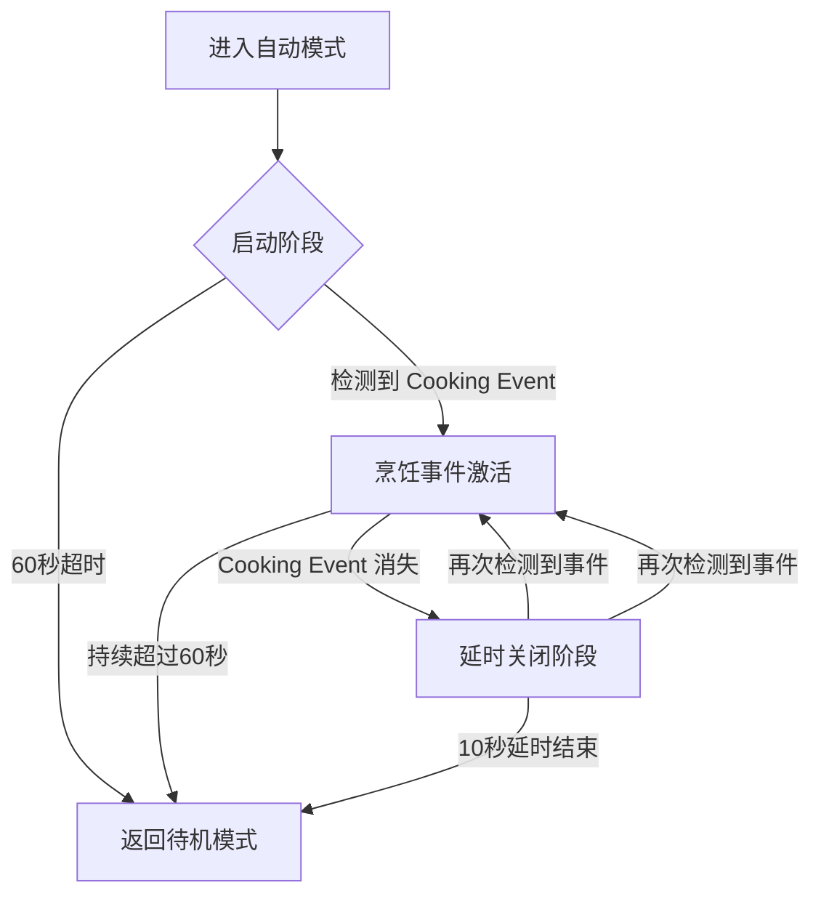

# 工作模式：待机、手动、自动、防回流

<!-- WIKI_NAV_START -->
> [!info] RTOS Wiki 导航
> [[projects/RTOS项目/index|项目首页]] · [[4.3.3 蜂鸣器控制与音频提示|← 上一篇：4.3.3 蜂鸣器控制与音频提示]] · [[5.2 自动模式状态机与Cooking Event检测|下一篇：5.2 自动模式状态机与Cooking Event检测 →]]
<!-- WIKI_NAV_END -->

> **实现状态（源码审计后）**：四种模式和自动模式三状态机均已实现。防回流代码使用100与2000两个数值，但 `GAS_THRESHOLD_HIGH` 不是常规“停止阈值”；若首次进入模式时浓度已经≥2000，当前代码反而不会启动电机，这是需要注意的边界缺陷。

本页解析四种工作模式、切换逻辑、状态机以及各模式的电机控制策略。

## 工作模式定义与状态管理

系统定义了四种工作模式，通过枚举类型 `WorkMode_t` 表示，存储在全局状态结构体 `g_systemState` 的 `currentMode` 字段中。所有模式共享同一个状态结构体，实现统一的状态管理。

```c
typedef enum {
    MODE_STANDBY = 0,       /* 待机模式 */
    MODE_MANUAL,            /* 手动模式 */
    MODE_AUTO,              /* 自动模式 */
    MODE_ANTI_BACKFLOW      /* 防回流模式 */
} WorkMode_t;
```

`SystemState_t` 包含模式、档位、电机状态、传感器数据和计时字段。多数任务使用 `g_dataMutex`，但防回流任务存在直接访问，需把这一点作为当前实现限制。

**Sources: `APP_TASK/app_tasks.h#L25-L30`, `APP_TASK/app_tasks.h#L43-L63`**

## 模式切换逻辑

模式切换由按键1（PB1）的短按事件触发，切换顺序为循环切换：待机 → 手动 → 自动 → 防回流 → 待机。按键2（PB12）短按切换档位（低档/高档），长按强制切换电机启停状态。


切换函数 `System_SwitchMode()` 在 `KeyScanTask` 中调用，切换时会重置相关状态（除自动模式外会停止电机）。该函数通过互斥信号量保护状态修改过程，确保数据一致性。

**Sources: `APP_TASK/app_tasks.c#L690-L721`, `APP_TASK/app_tasks.c#L206-L213`**

## 各模式详细说明

### 待机模式（MODE_STANDBY）

待机模式是系统的默认状态，也是切换到其他模式的起点。在此模式下，电机停止运行，但系统仍保持基础数据采集和显示功能。待机模式的设计体现了"节能但不休眠"的理念，系统持续监测环境数据，为随时响应用户操作做好准备。

电机控制任务 `MotorControlTask` 在待机模式下执行以下操作：
1. 调用 `motor_stop()` 停止电机
2. 设置 `motorRunning = 0`
3. 重置自动模式计时器和 Cooking Event 计时器
4. 将自动模式状态机重置为 `AUTO_STATE_STARTUP`

**Sources: `APP_TASK/app_tasks.c#L348-L355`**

### 手动模式（MODE_MANUAL）

手动模式为用户提供直接控制电机转速的能力，支持低档（SPEED_LOW）和高档（SPEED_HIGH）两种档位。该模式采用 PID 闭环控制，确保电机转速稳定在用户设定的目标值。

手动模式的工作流程：
1. 检测电机是否已启动，若未启动则调用 `motor_start()`
2. 根据当前档位获取目标转速（低档 190 RPM，高档 220 RPM）
3. 设置 PID 目标值并计算 PID 输出
4. 通过 `motor_pwm_set()` 设置电机 PWM 占空比

PID 控制器参数为：Kp=14.0，Ki=1.65，Kd=0.0，输出限幅 0-1000。编码器反馈的实际转速通过 `SpeedCalcTask` 计算，为 PID 提供闭环反馈。

**Sources: `APP_TASK/app_tasks.c#L357-L373`, `BSP/WIND/wind_speed.h#L52-L53`**

### 自动模式（MODE_AUTO）

自动模式是系统最智能的工作模式，它根据传感器数据自动调节电机转速。自动模式内部使用三状态状态机 `AutoModeState_t` 进行状态管理：

| 状态 | 说明 | 行为 |
|------|------|------|
| `AUTO_STATE_STARTUP` | 启动阶段 | 电机以最低 PWM 运行，等待 Cooking Event |
| `AUTO_STATE_COOKING` | 烹饪事件激活 | 根据风速算法自动调节 PWM |
| `AUTO_STATE_DELAY_OFF` | 延时关闭阶段 | 继续排风，10 秒后关闭 |

**Cooking Event 判定条件**：
- 温度 > 26℃ 且 湿度 > 50% 且 气体浓度 > 100

自动模式状态转换逻辑：



自动模式的时间参数：
- `AUTO_MODE_STARTUP_TIME`：60 秒启动等待时间
- `COOKING_EVENT_TIMEOUT`：60 秒 Cooking Event 超时时间
- `COOKING_EVENT_DELAY_OFF`：10 秒延时关闭时间

**Sources: `APP_TASK/app_tasks.c#L375-L458`, `APP_TASK/app_tasks.h#L68-L70`**

### 防回流模式（MODE_ANTI_BACKFLOW）

防回流模式由 `AntiBackflowTask` 独立控制。当浓度从正常范围上升并满足当前条件时启动风机，降到100以下时关闭。实现中直接读写 `g_systemState`，没有获取 `g_dataMutex`。

防回流模式的工作逻辑：
1. **气体检测**：当 `gasConcentration >= gasThreshold` 时，判断为气体超标
2. **启动条件**：气体浓度超过正常阈值 `GAS_THRESHOLD_NORMAL`（100.0），且低于高阈值 `GAS_THRESHOLD_HIGH`（2000.0）
3. **阈值切换**：启动风机后立即将阈值切换到高阈值，防止重复触发
4. **关闭条件**：气体浓度降到正常阈值以下时，停止风机并恢复阈值

两个数值的实际作用：
- `GAS_THRESHOLD_NORMAL=100.0`：初始触发条件与关闭条件。
- `GAS_THRESHOLD_HIGH=2000.0`：启动后写入 `gasThreshold`，用于避免重复执行启动分支；它不是电机关闭阈值。
- 边界限制：首次检测值≥2000时，外层检测为真但内层 `< GAS_THRESHOLD_HIGH` 为假，电机不会启动。

当进入防回流模式时，`AntiBackflowTask` 持续监测气体浓度，并控制电机启停。电机控制任务 `MotorControlTask` 在防回流模式下使用 PID 控制，根据用户设定的档位维持目标转速。

**Sources: `APP_TASK/app_tasks.c#L525-L568`, `BSP/MQ2/mq2.h#L22-L23`**

## 模式间的交互与优先级

不同工作模式间存在明确的优先级和交互规则。电机控制任务 `MotorControlTask` 是模式控制的核心，它根据当前模式选择不同的控制策略：

| 模式 | 电机控制策略 | PID 使用 | 风速算法使用 |
|------|-------------|----------|-------------|
| 待机 | 直接停止 | 否 | 否 |
| 手动 | PID 闭环控制 | 是 | 否 |
| 自动 | 风速算法 PWM | 否 | 是 |
| 防回流 | PID 闭环控制 | 是 | 否 |

模式切换时会重置相关状态，确保系统行为符合预期。例如，从其他模式切换到待机模式时，会强制停止电机并重置计时器；切换到自动模式时，会重置自动模式状态机。

按键2的长按功能具有最高优先级，可以在任何模式下强制切换电机状态：长按时如果电机正在运行，则强制切换到待机模式并停止电机；如果电机停止，则强制切换到手动模式并启动电机。

**Sources: `APP_TASK/app_tasks.c#L346-L471`, `APP_TASK/app_tasks.c#L747-L770`**

## 状态同步与数据流

系统通过 `g_systemState` 结构体实现集中状态管理，各任务通过互斥信号量访问共享数据。数据流遵循以下模式：

1. **数据采集**：`SensorTask` 读取 DHT11 和 MQ2，更新温度、湿度和气体浓度
2. **数据处理**：`WindSpeedTask` 计算风速 PWM 和 Cooking Event 状态
3. **状态控制**：`KeyScanTask` 和 `AntiBackflowTask` 修改模式、档位和电机状态
4. **控制执行**：`MotorControlTask` 根据模式和状态控制电机
5. **状态显示**：`UIDisplayTask` 读取状态并显示在 LCD 上

这种集中状态管理简化了任务间通信，避免了复杂的消息传递机制。每个任务只需要关注自己需要读取或修改的状态字段，降低了模块间的耦合度。

**Sources: `APP_TASK/app_tasks.c#L34-L38`, `APP_TASK/app_tasks.c#L254-L325`**

## 设计考虑与扩展性

工作模式的设计考虑了多个方面：

1. **用户操作逻辑清晰**：按键1负责模式切换，按键2负责模式内参数调整，职责分离明确
2. **状态机简化复杂逻辑**：自动模式使用状态机管理多个阶段，避免复杂的条件嵌套
3. **阈值状态化**：当前代码试图用动态阈值避免重复执行启动分支，但对首次浓度≥2000的情况处理不正确
4. **实时性保证**：电机控制任务优先级较高（5），确保控制响应及时
5. **并发限制**：多数任务使用互斥量，但AntiBackflowTask仍有直接访问共享状态的竞争风险

扩展性方面，当前架构支持以下扩展：
- 增加新的工作模式只需在枚举中添加，并在电机控制任务中添加相应 case
- 调整自动模式逻辑只需修改状态机转换条件
- 增加新的传感器只需在 `SensorTask` 中添加采集逻辑
- 调整防回流阈值只需修改 `mq2.h` 中的宏定义

**Sources: `APP_TASK/app_tasks.h#L76-L98`, `APP_TASK/app_tasks.c#L330-L475`**

## 面试要点与常见问题

### 为什么使用状态机管理自动模式？

自动模式涉及多个阶段（启动、烹饪、延时关闭）和超时逻辑，使用状态机可以：
1. 清晰表达状态转换关系
2. 避免复杂的条件嵌套和标志位管理
3. 便于后续维护和功能扩展
4. 提高代码可读性和可维护性

### 防回流模式中的两个阈值如何工作？

100用于首次启动和下降后的关闭判断；启动后代码把动态阈值切到2000，使100到1999区间不再重复执行启动分支。它不是标准的“高阈值启动、低阈值停止”迟滞写法，并且存在首次值≥2000不启动的边界问题。面试时应先说明当前代码，再给出更稳妥的显式运行状态或标准双阈值改法。

### 如何保证多任务访问系统状态的数据一致性？

设计意图是用 `g_dataMutex` 保护 `g_systemState`，但当前代码并未做到所有访问都加锁：AntiBackflowTask直接读写相关字段。正确的改进方向是统一用同一互斥量保护共享快照与状态更新，同时缩短持锁时间。

### 手动模式和防回流模式都使用 PID 控制，有什么区别？

两种模式的 PID 控制策略相同，但目标值来源不同：
- 手动模式：目标转速由用户设定的档位决定（低档 190 RPM，高档 220 RPM）
- 防回流模式：目标转速同样由用户设定的档位决定，但电机启停由气体浓度阈值控制

两种模式都使用相同的 PID 参数（Kp=14.0，Ki=1.65，Kd=0.0），确保转速控制的一致性。

## 下一步学习

理解工作模式后，建议深入学习以下相关主题：

- **[[5.2 自动模式状态机与Cooking Event检测|自动模式状态机与 Cooking Event 检测]]**：深入了解自动模式的三状态状态机实现和 Cooking Event 检测算法
- **[[4.1.3 PID闭环调速算法实现与调参|PID 闭环调速算法实现与调参]]**：学习 PID 算法原理和在电机调速中的应用
- **[[4.2.3 多传感器融合风速算法|多传感器融合风速算法]]**：了解温度、湿度和气体浓度如何融合计算风速 PWM
- **[[4.3.1 按键状态机：消抖、短按与长按检测|按键状态机：消抖、短按与长按检测]]**：学习按键事件处理机制，理解模式切换的触发源

通过这些页面的学习，你将全面掌握油烟机控制系统的核心业务逻辑和实现细节。

<!-- WIKI_FOOTER_START -->
---
> [!tip] 继续阅读
> [[projects/RTOS项目/index|项目首页]] · [[4.3.3 蜂鸣器控制与音频提示|← 上一篇：4.3.3 蜂鸣器控制与音频提示]] · [[5.2 自动模式状态机与Cooking Event检测|下一篇：5.2 自动模式状态机与Cooking Event检测 →]]
<!-- WIKI_FOOTER_END -->
