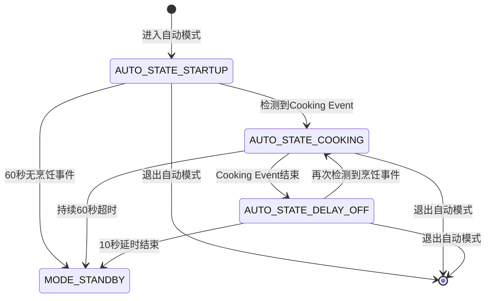
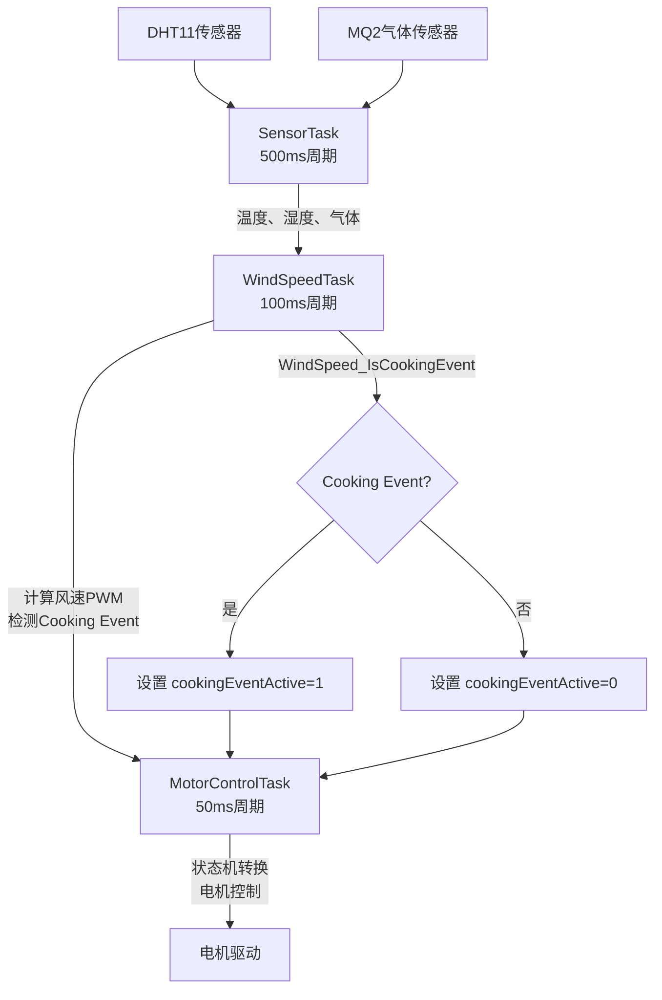
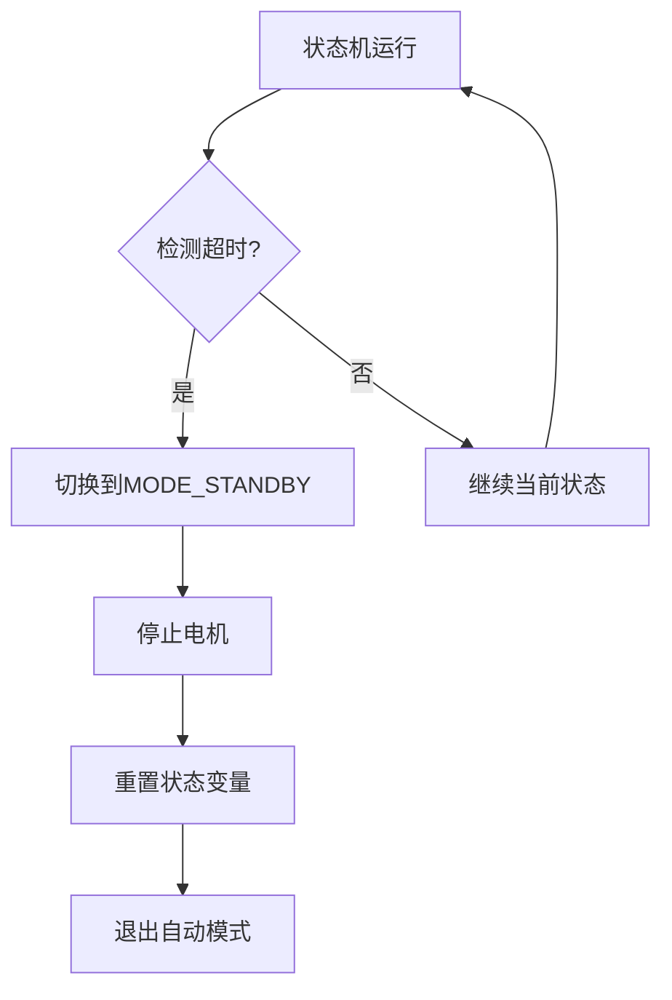

# 自动模式状态机与Cooking Event检测

<!-- WIKI_NAV_START -->
> [!info] RTOS Wiki 导航
> [[projects/RTOS项目/index|项目首页]] · [[5.1 工作模式：待机、手动、自动、防回流|← 上一篇：5.1 工作模式：待机、手动、自动、防回流]] · [[5.3 固件升级（IAP）：Boot + 单APP分区与串口DMA传输|下一篇：5.3 固件升级（IAP）：Boot + 单APP分区与串口DMA传输 →]]
<!-- WIKI_NAV_END -->

> **实现状态（源码审计后）**：自动模式三状态、60秒启动等待、60秒Cooking超时和10秒延时关闭均在MotorControlTask中实现，计数按50ms任务周期累加。Cooking Event条件为温度>26、湿度>50且气体值>100。

本文档阐述自动模式状态机与Cooking Event检测机制。

## 自动模式状态机架构

自动模式采用**有限状态机（FSM）**设计，包含三个核心状态：**启动阶段**、**烹饪事件激活**和**延时关闭**。状态机在`MotorControlTask`任务中以50ms周期运行，通过全局状态变量`g_autoModeState`管理状态转换。

### 状态定义与转换

自动模式状态机包含以下三个状态：

| 状态枚举 | 状态名称 | 功能描述 | 转换条件 |
|----------|----------|----------|----------|
| `AUTO_STATE_STARTUP` | 启动阶段 | 以最小转速运行，等待烹饪事件 | 检测到Cooking Event → COOKING；60秒超时 → STANDBY |
| `AUTO_STATE_COOKING` | 烹饪事件激活 | 根据传感器数据自动调节风速 | Cooking Event结束 → DELAY_OFF；60秒超时 → STANDBY |
| `AUTO_STATE_DELAY_OFF` | 延时关闭 | 保持当前风速，等待可能的烹饪恢复 | 再次检测到Cooking Event → COOKING；10秒延时结束 → STANDBY |



### 状态变量管理

自动模式状态机依赖以下关键全局变量（定义在`APP_TASK/app_tasks.c`）：

| 变量名 | 类型 | 作用域 | 功能描述 |
|--------|------|--------|----------|
| `g_autoModeState` | `AutoModeState_t` | 文件作用域 | 当前自动模式状态 |
| `g_systemState.autoModeCounter` | `u32` | 全局 | 启动阶段计时器（ms） |
| `g_systemState.cookingEventCounter` | `u32` | 全局 | 烹饪事件计时器（ms） |
| `g_systemState.cookingEventActive` | `u8` | 全局 | 烹饪事件激活标志 |

Sources: `APP_TASK/app_tasks.c#L59-L65`, `APP_TASK/app_tasks.h#L43-L63`

## Cooking Event检测机制

Cooking Event是自动模式的核心触发条件，通过**多传感器融合算法**检测烹饪活动。检测逻辑在`WindSpeed_Update()`函数中实现，采用**温度、湿度、气体浓度**三参数联合判断。

### 检测阈值与条件

Cooking Event检测采用**逻辑与组合**策略，必须同时满足以下条件：

| 传感器参数 | 阈值常量 | 检测值 | 判断逻辑 | 权重系数 |
|------------|----------|--------|----------|----------|
| 温度 | `COOKING_TEMP_THRESHOLD` | 26°C | `temp > 26` | 0.2 |
| 湿度 | `COOKING_HUMIDITY_THRESHOLD` | 50% | `humidity > 50` | 0.2 |
| 气体浓度 | `COOKING_GAS_THRESHOLD` | 100ppm | `gas > 100` | 0.6 |

```c
/* Cooking Event检测逻辑 */
if ((temp > COOKING_TEMP_THRESHOLD) &&
    ((humidity > COOKING_HUMIDITY_THRESHOLD) && (gas > COOKING_GAS_THRESHOLD)))
{
    g_windSpeedData.isCookingEvent = 1;
}
else
{
    g_windSpeedData.isCookingEvent = 0;
}
```

### 数据流与任务协作

Cooking Event检测涉及多个任务的协作，形成完整的数据流：



Sources: `BSP/WIND/wind_speed.c#L85-L93`, `APP_TASK/app_tasks.c#L319-L321`

### 风速算法与PWM映射

风速算法采用**加权融合**策略，将多传感器数据映射到PWM占空比：

| 算法阶段 | 计算公式 | 参数说明 |
|----------|----------|----------|
| 归一化 | `f_T = (T - T_base) / (T_max - T_base)` | `T_base=20°C`, `T_max=35°C` |
| 归一化 | `f_H = (H - H_base) / (H_max - H_base)` | `H_base=40%`, `H_max=75%` |
| 归一化 | `f_G = (G - G_base) / (G_max - G_base)` | `G_base=80ppm`, `G_max=450ppm` |
| 加权融合 | `F = w_t * f_T + w_h * f_H + w_g * f_G` | `w_t=0.2`, `w_h=0.2`, `w_g=0.6` |
| PWM映射 | `PWM = PWM_min + (PWM_max - PWM_min) * F` | `PWM_min=20%`, `PWM_max=100%` |

Sources: `BSP/WIND/wind_speed.c#L62-L82`, `BSP/WIND/wind_speed.h#L20-L39`

## 状态机详细实现

自动模式状态机在`MotorControlTask`中实现，根据当前状态执行不同的电机控制策略。

### 启动阶段（AUTO_STATE_STARTUP）

启动阶段是自动模式的初始状态，以最小转速运行并等待烹饪事件：

| 阶段 | 电机状态 | PWM设置 | 计时逻辑 | 转换条件 |
|------|----------|---------|----------|----------|
| 初始化 | 启动电机 | `PWM_MIN * 10`（200） | `autoModeCounter += 50` | - |
| 等待 | 保持运行 | 保持200 | 持续累加 | 检测到Cooking Event或60秒超时 |

```c
/* 启动阶段逻辑 */
case AUTO_STATE_STARTUP:
    if (!g_systemState.motorRunning)
    {
        g_systemState.motorRunning = 1;
        motor_start();
    }
    motor_pwm_set(PWM_MIN * 10);  // 200
    
    g_systemState.autoModeCounter += 50;
    
    if (g_systemState.cookingEventActive)
    {
        g_autoModeState = AUTO_STATE_COOKING;
    }
    else if (g_systemState.autoModeCounter >= AUTO_MODE_STARTUP_TIME)
    {
        g_systemState.currentMode = MODE_STANDBY;
        motor_stop();
        g_systemState.motorRunning = 0;
    }
    break;
```

### 烹饪事件激活（AUTO_STATE_COOKING）

烹饪事件激活阶段根据传感器数据自动调节风速：

| 阶段 | 电机状态 | PWM设置 | 计时逻辑 | 转换条件 |
|------|----------|---------|----------|----------|
| 自动调节 | 保持运行 | `WindSpeed_GetPWMCompare(MAXCCR)` | `cookingEventCounter += 50` | - |
| 持续监控 | 保持运行 | 动态调整 | 持续累加 | Cooking Event结束或60秒超时 |

```c
/* 烹饪事件激活逻辑 */
case AUTO_STATE_COOKING:
    pwmCompare = WindSpeed_GetPWMCompare(MAXCCR);
    motor_pwm_set(pwmCompare);
    
    g_systemState.cookingEventCounter += 50;
    
    if (!g_systemState.cookingEventActive)
    {
        g_autoModeState = AUTO_STATE_DELAY_OFF;
        g_systemState.cookingEventCounter = 0;
    }
    else if (g_systemState.cookingEventCounter >= COOKING_EVENT_TIMEOUT)
    {
        g_systemState.currentMode = MODE_STANDBY;
        motor_stop();
        g_systemState.motorRunning = 0;
    }
    break;
```

### 延时关闭（AUTO_STATE_DELAY_OFF）

延时关闭阶段保持当前风速，等待可能的烹饪恢复：

| 阶段 | 电机状态 | PWM设置 | 计时逻辑 | 转换条件 |
|------|----------|---------|----------|----------|
| 延时等待 | 保持运行 | `WindSpeed_GetPWMCompare(MAXCCR)` | `cookingEventCounter += 50` | - |
| 恢复检测 | 保持运行 | 动态调整 | 持续累加 | 再次检测到Cooking Event或10秒超时 |

```c
/* 延时关闭逻辑 */
case AUTO_STATE_DELAY_OFF:
    pwmCompare = WindSpeed_GetPWMCompare(MAXCCR);
    motor_pwm_set(pwmCompare);
    
    g_systemState.cookingEventCounter += 50;
    
    if (g_systemState.cookingEventActive)
    {
        g_autoModeState = AUTO_STATE_COOKING;
        g_systemState.cookingEventCounter = 0;
    }
    else if (g_systemState.cookingEventCounter >= COOKING_EVENT_DELAY_OFF)
    {
        g_systemState.currentMode = MODE_STANDBY;
        motor_stop();
        g_systemState.motorRunning = 0;
    }
    break;
```

Sources: `APP_TASK/app_tasks.c#L375-L458`

## 时序参数与超时机制

自动模式采用三级超时保护机制，确保系统在异常情况下能够安全退出：

| 参数常量 | 值（ms） | 作用阶段 | 功能描述 |
|----------|----------|----------|----------|
| `AUTO_MODE_STARTUP_TIME` | 60000 | 启动阶段 | 等待烹饪事件的最大时间 |
| `COOKING_EVENT_TIMEOUT` | 60000 | 烹饪事件激活 | 烹饪事件持续的最大时间 |
| `COOKING_EVENT_DELAY_OFF` | 10000 | 延时关闭 | 烹饪结束后的等待时间 |

### 超时处理流程

超时处理遵循统一的**安全退出**策略：



### 状态重置机制

当系统退出自动模式时，所有相关状态变量都会被重置：

| 重置操作 | 变量名 | 重置值 | 执行位置 |
|----------|--------|--------|----------|
| 状态重置 | `g_autoModeState` | `AUTO_STATE_STARTUP` | `MotorControlTask` |
| 计时器重置 | `autoModeCounter` | 0 | `MotorControlTask` |
| 计时器重置 | `cookingEventCounter` | 0 | `MotorControlTask` |
| 电机控制 | `motorRunning` | 0 | `MotorControlTask` |

Sources: `APP_TASK/app_tasks.h#L68-L70`, `APP_TASK/app_tasks.c#L402-L405`

## 任务间通信与同步

自动模式状态机涉及多个任务的协作，通过**互斥信号量**和**全局状态变量**实现数据同步。

### 数据访问保护

系统状态数据通过`g_dataMutex`互斥信号量保护，避免多任务并发访问导致的数据不一致：

| 任务 | 访问的数据 | 保护机制 | 访问频率 |
|------|------------|----------|----------|
| `SensorTask` | 温度、湿度、气体浓度 | `g_dataMutex` | 500ms |
| `WindSpeedTask` | 传感器数据、风速PWM、Cooking Event标志 | `g_dataMutex` | 100ms |
| `MotorControlTask` | 所有系统状态 | `g_dataMutex` | 50ms |
| `UIDisplayTask` | 显示相关状态 | `g_dataMutex` | 200ms |

### 状态更新流程

Cooking Event状态的更新涉及完整的任务链：

1. **数据采集**：`SensorTask`读取传感器数据
2. **算法计算**：`WindSpeedTask`计算风速并检测Cooking Event
3. **状态更新**：`WindSpeedTask`更新全局状态
4. **状态机执行**：`MotorControlTask`根据状态执行控制逻辑
5. **显示更新**：`UIDisplayTask`刷新显示内容

```c
/* WindSpeedTask中的状态更新 */
if (xSemaphoreTake(g_dataMutex, portMAX_DELAY) == pdTRUE)
{
    g_systemState.windSpeedPWM = WindSpeed_GetPWM();
    g_systemState.cookingEventActive = WindSpeed_IsCookingEvent();
    xSemaphoreGive(g_dataMutex);
}
```

Sources: `APP_TASK/app_tasks.c#L316-L321`

## 显示与调试支持

自动模式状态机提供丰富的显示信息，便于调试和监控：

### LCD显示内容

`UIDisplayTask`任务以200ms周期刷新以下信息：

| 显示行 | 显示内容 | 数据源 | 格式示例 |
|--------|----------|--------|----------|
| 第1行 | 当前模式 | `ModeNames[]` | `Mode:Auto` |
| 第2行 | 当前档位 | `SpeedLevelNames[]` | `Level:LOW` |
| 第3行 | 风速PWM | `g_systemState.windSpeedPWM` | `WIND:45.2%` |
| 第4行 | 实际转速 | `g_systemState.actualRPM` | `RPM:1850` |
| 第5行 | 自动模式状态 | `AutoStateNames[]` | `Auto:Cooking` |
| 第6行 | 启动计时 | `autoModeCounter / 1000` | `AMCnt:25s` |
| 第7行 | 烹饪计时 | `cookingEventCounter / 1000` | `CECnt:15s` |

### 调试信息

系统支持串口调试输出（需启用`SENSOR_DEBUG`宏）：

```c
#if SENSOR_DEBUG
    printf("Temp: %d, Humi: %d, Gas: %.2f\r\n", temp, humi, gasValue);
#endif
```

Sources: `APP_TASK/app_tasks.c#L480-L520`

## 异常处理与边界条件

自动模式状态机设计考虑了多种异常情况和边界条件：

### 模式切换时的状态重置

当用户通过按键切换模式时，自动模式状态会被重置：

| 切换场景 | 重置操作 | 执行位置 |
|----------|----------|----------|
| 退出自动模式 | 电机停止，状态重置 | `System_SwitchMode()` |
| 强制停止电机 | 切换到待机模式 | `System_ToggleMotor()` |
| 切换到其他模式 | 电机停止 | `MotorControlTask` |

### 传感器数据异常处理

传感器数据异常时的处理策略：

| 异常类型 | 处理方式 | 影响范围 |
|----------|----------|----------|
| DHT11读取失败 | 保持上次有效值 | 温湿度计算 |
| MQ2传感器异常 | 使用默认值 | 气体浓度计算 |
| 数据超限 | 归一化约束到[0,1] | 风速计算 |

### 并发访问保护

多任务并发访问时的保护机制：

| 保护对象 | 保护机制 | 临界区范围 |
|----------|----------|------------|
| 系统状态结构体 | `g_dataMutex` | 完整访问周期 |
| 自动模式状态 | 无（单任务访问） | `MotorControlTask` |
| 风速算法数据 | 无（单任务访问） | `WindSpeedTask` |

Sources: `APP_TASK/app_tasks.c#L690-L721`, `BSP/WIND/wind_speed.c#L33-L38`

## 性能优化与扩展性

### 算法优化

当前Cooking Event检测算法可进一步优化：

| 优化方向 | 当前实现 | 优化建议 | 预期效果 |
|----------|----------|----------|----------|
| 阈值自适应 | 固定阈值 | 基于历史数据动态调整 | 提高检测准确性 |
| 滤波算法 | 无 | 添加低通滤波 | 减少误触发 |
| 多条件组合 | 逻辑与 | 引入权重组合 | 提高灵活性 |

### 扩展接口

系统提供以下扩展点：

1. **新传感器集成**：在`SensorTask`中添加新传感器数据采集
2. **自定义阈值**：通过`g_systemState.gasThreshold`配置气体阈值
3. **状态机扩展**：在`AutoModeState_t`中添加新状态
4. **算法替换**：替换`WindSpeed_Update()`中的风速计算算法

Sources: `BSP/WIND/wind_speed.c#L59-L94`

## Next Steps

深入理解自动模式状态机与Cooking Event检测后，建议继续学习：

- [[5.1 工作模式：待机、手动、自动、防回流|工作模式：待机、手动、自动、防回流]] - 了解其他工作模式的实现
- [[4.2.3 多传感器融合风速算法|多传感器融合风速算法]] - 深入学习风速算法原理
- [[4.1.3 PID闭环调速算法实现与调参|PID闭环调速算法实现与调参]] - 掌握电机控制算法
- [[2.4 任务间通信：互斥信号量与全局状态管理|任务间通信：互斥信号量与全局状态管理]] - 理解多任务同步机制

<!-- WIKI_FOOTER_START -->
---
> [!tip] 继续阅读
> [[projects/RTOS项目/index|项目首页]] · [[5.1 工作模式：待机、手动、自动、防回流|← 上一篇：5.1 工作模式：待机、手动、自动、防回流]] · [[5.3 固件升级（IAP）：Boot + 单APP分区与串口DMA传输|下一篇：5.3 固件升级（IAP）：Boot + 单APP分区与串口DMA传输 →]]
<!-- WIKI_FOOTER_END -->
