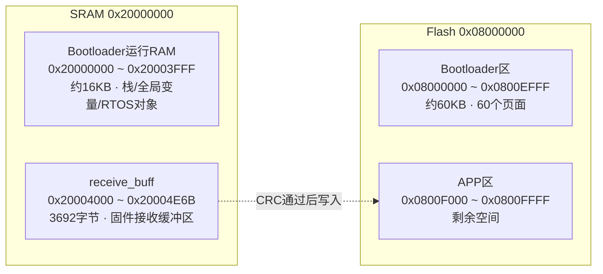
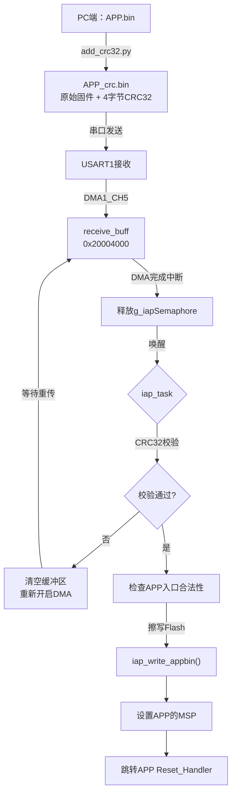
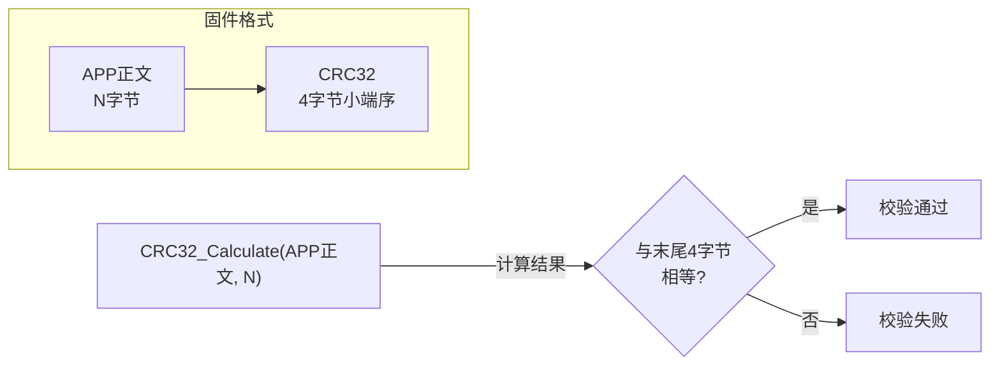

# 固件升级（IAP）：Boot + 单APP分区与串口DMA传输

<!-- WIKI_NAV_START -->
> [!info] RTOS Wiki 导航
> [[projects/RTOS项目/index|项目首页]] · [[5.2 自动模式状态机与Cooking Event检测|← 上一篇：5.2 自动模式状态机与Cooking Event检测]] · [[5.4 CRC32校验：数据完整性验证机制|下一篇：5.4 CRC32校验：数据完整性验证机制 →]]
<!-- WIKI_NAV_END -->

> **实现状态（源码审计后）**：这是默认关闭的实验性IAP链路（`ifopen=0`）。它是 **Boot代码区 + 单个APP区**，不是A/B双APP方案；当前代码没有备份槽、升级状态标记、断点续传、断电回滚或版本选择逻辑。串口是本地USART传输，不是网络远程OTA。

本项目提供IAP实验代码：PC端追加CRC32，USART1+DMA按固定长度接收，任务校验后写入单个APP区并尝试跳转。

整个升级系统涉及三层协作：**PC端预处理工具**负责计算CRC32校验码并附加到固件末尾，**串口DMA通道**负责高效搬运数据到RAM缓冲区，**IAP任务**负责校验、擦写Flash并跳转执行新程序。三者通过CRC32校验机制串联，形成完整的固件安全升级链路。

## Boot + 单APP地址规划：Flash与RAM

STM32F103C8T6拥有64KB Flash和20KB SRAM。为了实现IAP升级，Flash空间被划分为两个独立区域，RAM空间同样进行分区以避免运行时冲突。



**Flash分区的代码事实是 `FLASH_APP1_ADDR=0x0800F000`**。在64KB Flash上，这为APP地址范围留下约4KB，前60KB是为Boot代码预留的地址范围，不代表当前Boot二进制实际占满60KB。仓库中的Keil工程仍配置为从 `0x08000000` 使用整个64KB，且没有附带一个链接到 `0x0800F000` 的独立APP工程，因此完整可部署性不能仅凭这段代码确认。

Sources: `BSP/IAP/iap.h#L20-L21`, `SYSTEM/sys/sys.h#L32-L38`

`receive_buff` 被绝对放在 `0x20004000`，长度3692字节，占用到 `0x20004E6B`。20KB SRAM结束于 `0x20004FFF`，缓冲区之后只剩404字节，并非“剩余约4KB给APP”。当前链接配置也没有通过scatter文件把普通堆栈/堆限制在前16KB，因此“绝对不会重叠”需要结合MAP文件逐次验证。

```c
u8 receive_buff[buff_size] __attribute__((at(0X20004000)));
```

`buff_size` 宏定义为 `3692`，这个值等于APP程序的Code段 + RO段 + RW段 + 4字节CRC的总大小。在实际项目中，需要根据编译后的MAP文件调整此值。

Sources: `APP_TASK/app_tasks.c#L97-L99`, `SYSTEM/sys/sys.h#L36-L38`

## 串口DMA接收：免CPU逐字节搬运

固件数据通过USART1串口从PC端发送到STM32，采用DMA（Direct Memory Access）方式实现数据搬运。DMA允许外设直接访问内存，无需CPU介入每个字节的传输，大幅降低了CPU占用率。

### DMA通道配置

本项目使用 **DMA1 Channel5** 对应USART1的RX请求。配置过程在 `dma.c` 的 `MYDMA_Config()` 函数中完成：

| 参数 | 配置值 | 含义 |
|------|--------|------|
| DMA_DIR | PeripheralSRC | 数据方向：外设→内存 |
| DMA_PeripheralDataSize | Byte | 外设数据宽度：8位 |
| DMA_MemoryDataSize | Byte | 内存数据宽度：8位 |
| DMA_MemoryInc | Enable | 内存地址递增 |
| DMA_PeripheralInc | Disable | 外设地址固定 |
| DMA_Mode | Normal | 单次传输模式 |
| DMA_Priority | High | 高优先级 |
| DMA_M2M | Disable | 非内存到内存 |

DMA配置完成后，需要使能USART1的DMA接收请求，这样每当USART1接收到一个字节，DMA就会自动将其搬运到 `receive_buff` 中：

```c
USART_DMACmd(USART1, USART_DMAReq_Rx, ENABLE);
```

Sources: `BSP/DMA/dma.c#L30-L60`, `SYSTEM/usart/usart.c#L148`

### DMA传输完成中断

当DMA搬运完 `buff_size` 个字节后，会触发 **DMA1_Channel5中断**。中断服务程序位于 `app_tasks.c` 中，其核心逻辑极为简洁——清除中断标志并释放二值信号量：

```c
void DMA1_Channel5_IRQHandler(void)
{
    BaseType_t xHigherPriorityTaskWoken = pdFALSE;
    if (DMA_GetITStatus(DMA1_IT_TC5))
    {
        DMA_ClearITPendingBit(DMA1_IT_TC5);
        xSemaphoreGiveFromISR(g_iapSemaphore, &xHigherPriorityTaskWoken);
    }
    portYIELD_FROM_ISR(xHigherPriorityTaskWoken);
}
```

**DMA中断优先级设置为4**，这个设计是有意为之的。FreeRTOS的 `configMAX_SYSCALL_INTERRUPT_PRIORITY` 阈值为3，优先级≥4的中断不会被FreeRTOS管理，因此DMA中断可以安全地调用 `xSemaphoreGiveFromISR()` 而不会引发内核异常。

Sources: `APP_TASK/app_tasks.c#L757-L773`, `BSP/DMA/dma.c#L52-L57`, `APP_TASK/app_tasks.h#L107`

## IAP升级流程：从接收到跳转

IAP升级的完整流程可以概括为五个阶段：**预处理→接收→校验→写入→跳转**。下面逐一剖析每个阶段的实现细节。



### 阶段一：PC端预处理

固件升级的第一步发生在PC端。编译器生成的原始 `APP.bin` 不包含任何校验信息，直接传输无法检测数据损坏。Python脚本 `add_crc32.py` 为原始固件附加4字节CRC32校验码：

1. 读取原始 `APP.bin` 的全部内容
2. 使用 `zlib.crc32()` 计算CRC32值（多项式 `0xEDB88320`）
3. 将CRC32转换为4字节小端序格式
4. 拼接原始数据和CRC字节，输出 `APP_crc.bin`

输出文件格式为：`[原始固件数据][CRC32低字节][CRC32次低字节][CRC32次高字节][CRC32高字节]`。

Sources: `tools/add_crc32.py#L18-L49`

### 阶段二：IAP任务核心逻辑

`iap_task` 是IAP升级的核心任务，优先级为7（系统最高），栈大小为256字节。任务启动后立即阻塞在 `g_iapSemaphore` 信号量上，等待DMA传输完成中断唤醒。

**唤醒后的第一个操作是获取接收数据长度**。`GetReceivedDataLength()` 函数通过读取DMA剩余计数器计算已接收字节数：

```c
return buff_size - DMA_GetCurrDataCounter(DMA1_Channel5);
```

**随后进行CRC32校验**。`CRC32_VerifyFirmware()` 函数从数据末尾提取4字节CRC值，然后对前 `firmwareLen` 字节计算CRC32，两者相等则校验通过。STM32端的CRC32算法使用查找表实现，与Python的 `zlib.crc32()` 完全一致。

Sources: `APP_TASK/app_tasks.c#L571-L604`, `BSP/CRC32/crc32.c#L50-L73`, `BSP/DMA/dma.c#L78-L81`

### 阶段三：合法性双重检查

CRC校验通过后，程序会进行**两次入口地址合法性检查**，这是防止写入损坏固件的最后防线。

**第一次检查**发生在写入Flash之前，验证RAM中固件的复位向量是否指向Flash区域：

```c
if(((*(vu32*)(0X20004000+4)) & 0xFF000000) == 0x08000000)
```

这里检查的是 `receive_buff` 偏移4字节处的值（即APP的复位向量），确保其高8位为 `0x08`，即指向Flash地址空间。只有通过检查才会执行Flash擦写操作。

**第二次检查**发生在写入Flash之后，验证Flash中固件的复位向量：

```c
if(((*(vu32*)(FLASH_APP1_ADDR+4)) & 0xFF000000) == 0x08000000)
```

这次检查的是 `0x0800F004` 地址处的值，确保写入Flash的固件数据完整无误。只有两次检查都通过，才会执行跳转。

Sources: `APP_TASK/app_tasks.c#L624-L627`, `APP_TASK/app_tasks.c#L641-L644`

### 阶段四：Flash擦写

`iap_write_appbin()` 函数负责将固件数据写入Flash。由于STM32F103的Flash编程单位是**半字（16位）**，函数内部将接收到的字节流两两组合后再写入：

```c
temp = (u16)dfu[1] << 8;  // 高字节
temp += (u16)dfu[0];       // 低字节
```

函数使用512个半字（1024字节）的缓冲区 `iapbuf` 进行块写入，每满512个半字就调用 `STMFLASH_Write()` 执行一次Flash编程。`STMFLASH_Write()` 内部会自动处理扇区擦除——先读出整个扇区内容，检查是否需要擦除，擦除后再写回修改后的数据。

Sources: `BSP/IAP/iap.c#L26-L47`, `BSP/STMFLASH/stmflash.c#L42-L89`

### 阶段五：安全跳转

`iap_load_app()` 函数负责从Bootloader跳转到APP程序。跳转前需要完成一系列清理工作，否则APP将无法正常运行：

```c
void iap_load_app(u32 appxaddr)
{
    __disable_irq();                           // 1. 禁用全局中断
    DMA_Cmd(DMA1_Channel5, DISABLE);           // 2. 关闭DMA通道
    USART_Cmd(USART1, DISABLE);                // 3. 关闭串口
    DMA_ClearITPendingBit(DMA1_IT_TC5);        // 4. 清除DMA中断标志
    USART_ClearITPendingBit(USART1, ...);      // 5. 清除串口中断标志

    if(((*(vu32*)appxaddr) & 0x2FFE0000) == 0x20000000)  // 6. 检查栈顶地址
    {
        jump2app = (iapfun)*(vu32*)(appxaddr+4);  // 7. 获取复位向量
        MSR_MSP(*(vu32*)appxaddr);                 // 8. 设置主堆栈指针
        jump2app();                                 // 9. 跳转执行
    }
}
```

**栈顶地址检查** `(*(vu32*)appxaddr) & 0x2FFE0000 == 0x20000000` 验证APP的初始栈指针是否指向SRAM区域（`0x20000000`）。这是Cortex-M3架构的硬性要求——MSP必须指向有效的RAM地址。

**`MSR_MSP()` 是一个汇编函数**，通过 `MSR MSP, r0` 指令直接设置主堆栈指针。设置MSP必须在跳转前完成，因为APP的启动代码依赖正确的栈指针来初始化局部变量和函数调用。

Sources: `BSP/IAP/iap.c#L50-L73`

## 功能开关与工程集成

IAP应用链路通过 `sys.h` 中的 `ifopen` 宏控制。当它为0时，接收缓冲区、IAP任务、DMA配置及对应中断处理不会进入应用路径；但BSP中的IAP/CRC源文件是否仍占Flash取决于Keil工程和链接器的未引用段移除，不能笼统说“完全不占资源”。

```c
#define ifopen  0   // 0=禁用IAP，1=启用IAP
```

启用IAP后，还需要根据实际APP大小调整 `buff_size` 宏。这个值必须等于APP编译产物的总大小（Code + RO + RW + 4字节CRC），可以通过查看Keil编译后的MAP文件获取。当前项目设置为3692字节。

**在 `main.c` 中，串口初始化必须在DMA配置之前完成**，否则DMA通道可能在串口就绪前就开始工作，导致数据丢失。初始化顺序为：`uart_init(115200)` → `MYDMA_Config()`。

| 配置项 | 当前值 | 说明 |
|--------|--------|------|
| `ifopen` | 0 | 功能开关，改为1启用 |
| `DEBUG` | 0 | 调试输出开关 |
| `buff_size` | 3692 | 固件接收缓冲区大小 |
| `FLASH_APP1_ADDR` | 0x0800F000 | APP起始地址 |
| DMA中断优先级 | 4 | 必须≥4（FreeRTOS阈值3） |

Sources: `SYSTEM/sys/sys.h#L22-L38`, `USER/main.c#L69-L73`

## 错误处理与重传机制

IAP任务提供了本次会话内的失败重试准备。当CRC32校验失败时，系统不会写入Flash，而是执行以下操作：

1. 在LCD上显示 "CRC32 Error!" 提示信息
2. 调用 `memset()` 清空 `receive_buff`，防止残留数据影响下次接收
3. 调用 `MYDMA_Enable()` 重新开启DMA传输，等待PC端重新发送固件

如果固件入口地址检查失败（复位向量不指向Flash区域），同样会清空缓冲区并重新开启DMA。这只能恢复到本次运行中的重新接收状态；如果写Flash过程中断电，代码没有A/B备份或持久化升级状态，不能保证自动回滚。

Sources: `APP_TASK/app_tasks.c#L606-L618`, `APP_TASK/app_tasks.c#L648-L658`

## 与CRC32校验的协作

IAP升级与CRC32校验机制深度耦合。固件的完整数据格式为 `[APP正文][4字节CRC32小端序]`，CRC32校验码覆盖的是APP正文部分，不包括CRC字节本身。



PC端和STM32端都按 `0xEDB88320` 路径实现CRC32，并约定末尾4字节为小端序。兼容性应通过已知向量和实际 `APP_crc.bin` 回归测试确认；仓库没有提供可追溯记录证明“曾修正5处表项”。

Sources: `BSP/CRC32/crc32.c#L14-L47`, `tools/add_crc32.py#L20-L23`

## 升级操作流程

实际执行固件升级时，操作步骤如下：

1. **编译APP工程**，生成 `APP.bin` 文件
2. **运行预处理工具**：`python add_crc32.py APP.bin`，生成 `APP_crc.bin`
3. **连接串口**：使用USB转TTL模块连接STM32的USART1（PA9-TX, PA10-RX）
4. **发送固件**：使用串口助手以115200波特率发送 `APP_crc.bin` 文件
5. **等待完成**：LCD屏幕依次显示 "CRC32 verify passed" → "Firmware updating" → "update completed" → "execute app"
6. **自动跳转**：系统自动跳转到APP程序执行

整个过程无需按键触发，DMA接收满 `buff_size` 字节后自动启动升级流程。

Sources: `tools/add_crc32.py#L59-L87`, `APP_TASK/app_tasks.c#L629-L653`

## 总结

当前IAP学习样例包含三个主要环节：

- **Boot + 单APP地址规划**：APP起始地址配置为0x0800F000，只剩约4KB空间
- **DMA串口接收**：CPU无需逐字节搬运USART接收数据，但写Flash仍由CPU执行
- **CRC32完整性校验**：PC端预计算 + STM32端验证，防止损坏固件写入Flash

该链路具备传输后CRC检查、写入前后入口地址检查和MSP合法性检查，但仍缺少长度协议、签名认证、A/B回滚、断电保护、完整外设/中断清理及独立APP工程验证，适合作为IAP学习样例而非直接视为产品级安全升级方案。

<!-- WIKI_FOOTER_START -->
---
> [!tip] 继续阅读
> [[projects/RTOS项目/index|项目首页]] · [[5.2 自动模式状态机与Cooking Event检测|← 上一篇：5.2 自动模式状态机与Cooking Event检测]] · [[5.4 CRC32校验：数据完整性验证机制|下一篇：5.4 CRC32校验：数据完整性验证机制 →]]
<!-- WIKI_FOOTER_END -->
