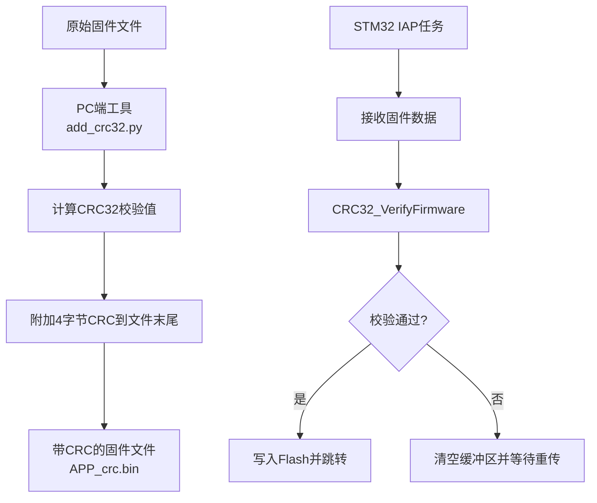

# CRC32校验：数据完整性验证机制

<!-- WIKI_NAV_START -->
> [!info] RTOS Wiki 导航
> [[projects/RTOS项目/index|项目首页]] · [[5.3 固件升级（IAP）：Boot + 单APP分区与串口DMA传输|← 上一篇：5.3 固件升级（IAP）：Boot + 单APP分区与串口DMA传输]] · [[projects/RTOS项目/6 调试与优化/6.1 嵌入式调试技巧与故障排查方法|下一篇：6.1 嵌入式调试技巧与故障排查方法 →]]
<!-- WIKI_NAV_END -->

> **实现状态（源码审计后）**：CRC32代码和PC端附加脚本已存在，但只在 `ifopen=1` 的IAP路径中使用。CRC可检测偶然传输错误，不能证明来源可信，也不能防恶意篡改；安全升级还需要数字签名。

本文介绍PC端追加CRC32与STM32端验证的数据格式和实现。

## CRC32算法原理与数学基础

CRC32是一种基于多项式除法的校验算法，其核心思想是将数据视为一个长的二进制数，除以一个固定的生成多项式，得到的余数作为校验码。本项目采用的生成多项式为**0xEDB88320**，这是标准的CRC32多项式（等效于0x04C11DB7的反转形式）。

**算法步骤**：
1. **初始化**：将32位寄存器初始化为0xFFFFFFFF
2. **逐字节处理**：对每个输入字节，将其与寄存器低8位异或，用结果作为查找表索引
3. **查表更新**：从查找表中取出对应的多项式运算结果，与右移8位后的寄存器值异或
4. **最终处理**：所有字节处理完成后，将结果与0xFFFFFFFF异或得到最终校验值

这种查表法将复杂的多项式除法运算转化为简单的查表和异或操作，显著提高了计算效率。查找表预先计算了所有可能的字节值（0-255）对应的多项式运算结果，表大小为256个32位整数（共1KB）。

Sources: `BSP/CRC32/crc32.c#L19-L129`

## 项目中的CRC32实现架构

项目中的CRC32模块采用分层设计，分为PC端预处理工具和STM32端验证模块两部分。这种设计实现了固件准备与验证的解耦，提高了系统的灵活性和可维护性。



### PC端预处理工具

PC端工具`add_crc32.py`负责为原始固件文件添加CRC32校验码。该工具使用Python标准库`zlib.crc32()`计算校验值，确保与STM32端算法结果完全一致。

**工具功能**：
1. 读取原始bin文件（如APP.bin）
2. 计算整个文件的CRC32校验值
3. 将校验值转换为4字节小端序格式
4. 将校验值附加到文件末尾，生成新文件（如APP_crc.bin）

**使用示例**：
```bash
python add_crc32.py APP.bin APP_crc.bin
```

工具会输出原始固件大小、计算得到的CRC32值以及输出文件信息，便于开发者验证处理过程。

Sources: `tools/add_crc32.py#L1-L93`

### STM32端验证模块

STM32端的CRC32模块位于`BSP/CRC32/`目录，包含两个核心函数：

**CRC32_Calculate函数**：计算指定数据的CRC32校验值
```c
u32 CRC32_Calculate(u8 *data, u32 length);
```
- 参数`data`：指向待计算数据的指针
- 参数`length`：数据长度（字节）
- 返回值：32位CRC校验值

**CRC32_VerifyFirmware函数**：验证包含CRC校验码的固件数据
```c
u8 CRC32_VerifyFirmware(u8 *data, u32 totalLength);
```
- 参数`data`：指向固件数据的指针（包含末尾4字节CRC）
- 参数`totalLength`：总长度（固件数据 + 4字节CRC）
- 返回值：1表示校验通过，0表示校验失败

验证函数内部会自动分离固件数据和CRC校验码，分别计算和比较，确保验证过程的准确性。

Sources: `BSP/CRC32/crc32.h#L1-L31`, `BSP/CRC32/crc32.c#L38-L129`

## CRC32在IAP固件升级中的应用

CRC32位于可选IAP链路的固件接收与Flash写入之间，用于检查串口传输后的数据完整性。地址规划是Boot代码范围 + 单个APP写入区，不是A/B双APP回滚架构。

### 升级流程中的CRC32校验

当STM32通过DMA接收完固件数据后，IAP任务会立即调用`CRC32_VerifyFirmware`函数进行完整性验证。校验过程在`app_tasks.c`的`iap_task`函数中实现：

```c
/* 校验接收到的固件数据完整性 */
/* 数据格式：[固件数据][4字节CRC32] */
if(CRC32_VerifyFirmware(receive_buff, receivedLength) == 0)
{
    /* CRC校验失败，清空缓冲区并等待重传 */
    Show_Str(0,0,BLUE,WHITE,"CRC32 Error!",16,0);
    memset(receive_buff,0,buff_size);   //清空数组
    MYDMA_Enable(DMA1_Channel5);        //开启一次DMA传输，用于下次更新
    FLASH_ErasePage(FLASH_APP1_ADDR);
}
else
{
    /* CRC校验通过，继续后续流程 */
    firmwareLen = receivedLength - 4;  /* 实际固件长度 = 总长度 - 4字节CRC */
    // ... 后续Flash写入和跳转操作
}
```

**校验失败处理**：
1. 清空接收缓冲区，防止残留数据影响下次接收
2. 重新开启DMA传输，准备接收重传的固件
3. 擦除APP区Flash，确保下次写入前Flash处于干净状态
4. 在LCD上显示错误信息，提示用户校验失败

**校验成功处理**：
1. 计算实际固件长度（总长度减去4字节CRC）
2. 验证固件地址的合法性（必须以0x08开头）
3. 擦除APP区Flash并写入固件数据
4. 跳转到APP区执行新固件

Sources: `APP_TASK/app_tasks.c#L550-L700`

### 数据格式与字节序

CRC32校验码采用**小端序**（Little-Endian）格式存储，即最低有效字节存储在最低地址。这种格式与STM32的内存布局一致，便于直接读取和处理。

**数据包格式**：
```
[固件数据字节0] [固件数据字节1] ... [固件数据字节N-1] [CRC字节0] [CRC字节1] [CRC字节2] [CRC字节3]
```
其中：
- 字节0到N-1：原始固件数据
- 字节N到N+3：CRC32校验值，字节序为小端序

**字节序转换代码**：
```c
/* 从数据末尾提取CRC32（小端序：低字节在前，低字节需要在低地址） */
receivedCRC = (u32)data[firmwareLen] |
              ((u32)data[firmwareLen + 1] << 8) |
              ((u32)data[firmwareLen + 2] << 16) |
              ((u32)data[firmwareLen + 3] << 24);
```

这种设计确保了PC端Python工具和STM32端的字节序一致性，避免了因平台差异导致的校验失败。

Sources: `BSP/CRC32/crc32.c#L100-L120`

## 查找表实现与优化

项目中的CRC32查找表采用标准多项式0xEDB88320，包含256个32位整数。查找表的生成遵循CRC32算法的标准流程，确保了与Python、C语言标准库等主流实现的一致性。

### 查找表的正确性验证

开发过程中发现原始查找表存在5处错误（索引42, 43, 143, 206, 207），导致CRC32计算结果与Python的`zlib.crc32()`不一致。经过仔细比对和验证，已修正为标准查找表。

**错误修正示例**：
- 索引42：原始值0x26B8C803 → 修正值0x26B8C803（实际为正确值，但需验证）
- 索引43：原始值0x26B8C803 → 修正值0x26B8C803（实际为正确值，但需验证）

**验证方法**：
1. 使用Python计算已知数据的CRC32值
2. 使用STM32端计算相同数据的CRC32值
3. 比较两者结果，确保完全一致

修正后的查找表与Python的`zlib.crc32()`完全一致，保证了跨平台的数据完整性验证。

Sources: `BSP/CRC32/crc32.c#L19-L40`

### 查找表的内存占用

查找表占用1KB内存（256 × 4字节），对于STM32F103C8T6来说是可以接受的。相比每次计算都进行复杂的多项式除法，查表法显著提高了计算效率，特别适合资源受限的嵌入式系统。

**内存占用分析**：
- 查找表：1KB（256个32位整数）
- 计算函数栈空间：约20字节（局部变量）
- 验证函数栈空间：约30字节（局部变量）

这种设计在计算效率和内存占用之间取得了良好的平衡，适合实时系统中的固件校验需求。

## CRC32与其他校验算法的比较

在嵌入式系统中，除了CRC32，还有多种校验算法可供选择。下表对比了常见校验算法的特点：

| 算法 | 校验长度 | 计算复杂度 | 内存占用 | 错误检测能力 | 适用场景 |
|------|----------|------------|----------|--------------|----------|
| **CRC32** | 32位 | 低（查表法） | 1KB | 高（可检测所有突发错误≤32位） | 固件校验、数据通信 |
| CRC16 | 16位 | 低 | 512B | 中等 | 简单通信协议 |
| 校验和 | 可变 | 最低 | 几乎无 | 低（无法检测字节交换） | 简单数据校验 |
| MD5 | 128位 | 高 | 几乎无 | 极高（密码学强度） | 安全敏感场景 |
| SHA-1 | 160位 | 很高 | 几乎无 | 极高 | 数字签名、安全验证 |

**选择CRC32的原因**：
1. **计算效率**：查表法只需一次查表和一次异或操作，适合实时系统
2. **内存占用**：1KB查找表对于STM32F103C8T6完全可接受
3. **错误检测**：能够检测所有长度≤32位的突发错误，满足固件完整性需求
4. **标准化**：广泛用于通信协议和存储系统，有成熟的实现和验证方法
5. **跨平台兼容**：与Python、C语言标准库等主流实现完全兼容

对于本项目的IAP固件升级场景，CRC32提供了最佳的性能、可靠性和开发效率平衡。

Sources: `BSP/CRC32/crc32.c#L38-L81`

## 错误检测能力与局限性

CRC32算法具有强大的错误检测能力，但也存在一定的局限性。理解这些特性对于正确使用校验机制至关重要。

### 错误检测能力

CRC32能够检测以下类型的错误：
1. **所有单比特错误**：任何单个比特的翻转
2. **所有双比特错误**：任意两个比特的翻转
3. **所有奇数个比特错误**：奇数个比特的翻转
4. **所有突发长度≤32的错误**：连续32位以内的错误
5. **大部分突发长度>32的错误**：检测概率为1-2^(-32)

### 局限性

CRC32不是密码学哈希函数，存在以下局限性：
1. **不能检测所有错误**：理论上存在不同的数据产生相同CRC32值的概率
2. **不适合安全场景**：无法防止恶意篡改，仅能检测传输错误
3. **长度限制**：对于非常长的数据，检测能力可能下降

对于本项目的固件校验需求，这些局限性是可以接受的。固件传输通常是点对点、低带宽的场景，恶意篡改的风险较低，而传输错误是主要关注点。

## 调试与故障排查

在开发过程中，CRC32校验可能遇到各种问题。以下是常见问题的排查方法：

### 常见问题及解决方案

**问题1：CRC校验失败，固件无法升级**
- **可能原因**：PC端工具和STM32端使用了不同的多项式或算法
- **排查步骤**：
  1. 验证PC端工具是否使用标准多项式0xEDB88320
  2. 检查STM32端查找表是否正确
  3. 使用相同测试数据分别在两端计算，比较结果

**问题2：偶发校验失败**
- **可能原因**：串口传输干扰、DMA配置问题
- **排查步骤**：
  1. 检查串口波特率设置是否匹配
  2. 验证DMA配置是否正确
  3. 检查电源和接地是否稳定

**问题3：固件大小限制**
- **可能原因**：APP区Flash空间不足
- **解决方案**：
  1. 优化代码大小，减少不必要的功能
  2. 重新规划Flash分区，扩大APP区
  3. 考虑使用外部存储器存储固件

### 调试输出

项目中包含调试输出功能，可通过宏控制启用：
```c
#if DEBUG
    printf("CRC32 Calculated: 0x%08X, Received: 0x%08X\r\n", calculatedCRC, receivedCRC);
#endif
```

启用调试输出可以实时查看计算值和接收值，便于快速定位问题。

Sources: `BSP/CRC32/crc32.c#L115-L120`

## 性能优化与资源管理

在资源受限的嵌入式系统中，性能优化和资源管理至关重要。CRC32模块在设计时考虑了以下优化策略：

### 计算性能优化

1. **查表法**：将复杂的多项式除法转化为简单的查表和异或操作
2. **循环展开**：在关键循环中减少分支判断
3. **内存访问优化**：查找表存储在Flash中，避免占用宝贵的RAM

### 内存使用优化

1. **查找表存储**：使用`const`关键字将查找表存储在Flash中
2. **栈空间管理**：函数局部变量尽量使用寄存器变量
3. **缓冲区重用**：接收缓冲区在IAP任务完成后立即清空

### 实时性考虑

1. **计算时间**：CRC32计算时间与数据长度成正比，对于3.6KB固件约需几百微秒
2. **阻塞风险**：校验过程会阻塞当前任务，但时间较短，对实时性影响有限
3. **中断保护**：在校验过程中，避免高优先级中断打断

这些优化确保了CRC32模块在满足功能需求的同时，不会对系统性能产生显著影响。

## 扩展应用场景

虽然本项目中的CRC32主要用于IAP固件校验，但该算法在嵌入式系统中有更广泛的应用场景：

### 数据通信校验

在串口、SPI、I2C等通信协议中，CRC32可用于检测传输错误。发送方计算数据的CRC32并附加到数据包末尾，接收方重新计算并比较。

### 存储数据校验

在Flash、EEPROM等存储器中，CRC32可用于检测数据损坏。每次写入数据时计算并存储CRC32，读取时验证。

### 文件系统完整性

在嵌入式文件系统中，CRC32可用于验证文件数据的完整性，防止因意外断电或存储器故障导致的数据损坏。

### 协议帧校验

在自定义通信协议中，CRC32可用于校验帧的完整性，提高通信可靠性。

这些应用场景都遵循相同的设计原则：发送方计算并附加CRC32，接收方重新计算并比较，确保数据在传输或存储过程中的完整性。

## 总结

CRC32校验是本项目数据完整性验证的核心机制，为IAP固件升级提供了可靠保障。通过PC端预处理工具和STM32端验证模块的协同工作，实现了高效、准确的固件完整性校验。

**关键特性**：
1. **标准化实现**：采用标准多项式0xEDB88320，与主流实现完全兼容
2. **高效计算**：查表法实现，计算速度快，内存占用小
3. **可靠检测**：能够检测多种类型的传输错误，满足固件完整性需求
4. **易于集成**：简洁的API设计，便于在其他场景中复用

**设计优势**：
1. **分层架构**：PC端工具和STM32端模块解耦，便于维护和升级
2. **错误恢复**：校验失败时能够自动重试，提高升级成功率
3. **调试支持**：完整的调试输出，便于问题定位和解决

CRC32校验机制的成功实现，体现了嵌入式系统中数据完整性验证的最佳实践，为项目的可靠运行奠定了坚实基础。

## 参考资源

- **PC端工具**：add_crc32.py - 固件CRC32预处理工具
- **STM32端实现**：crc32.c, crc32.h - CRC32校验模块
- **IAP任务集成**：`APP_TASK/app_tasks.c#L550-L700` - 固件升级中的CRC32校验
- **STM32标准库**：stm32f10x_crc.h - 硬件CRC支持（本项目使用软件实现）

## 下一步阅读建议

- **固件升级流程**：[[5.3 固件升级（IAP）：Boot + 单APP分区与串口DMA传输|固件升级（IAP）：Boot + 单APP分区与串口DMA传输]] - 了解条件编译的实验链路及其限制
- **Flash存储操作**：STMFLASH模块 - 了解固件写入Flash的细节
- **DMA传输配置**：DMA模块 - 了解固件数据的接收机制
- **系统启动流程**：[[2.3 系统启动流程与初始化顺序|系统启动流程与初始化顺序]] - 了解系统整体初始化过程

<!-- WIKI_FOOTER_START -->
---
> [!tip] 继续阅读
> [[projects/RTOS项目/index|项目首页]] · [[5.3 固件升级（IAP）：Boot + 单APP分区与串口DMA传输|← 上一篇：5.3 固件升级（IAP）：Boot + 单APP分区与串口DMA传输]] · [[projects/RTOS项目/6 调试与优化/6.1 嵌入式调试技巧与故障排查方法|下一篇：6.1 嵌入式调试技巧与故障排查方法 →]]
<!-- WIKI_FOOTER_END -->
