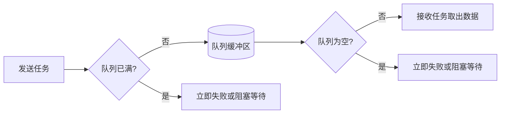

# RTOS 项目高频面试 30 题（背诵版）

> 本文对应原复习文档第 8.1～8.30 题，编号统一为 A1～A30。答案以原标准答案为基础，并结合本项目真实代码整理。

## 使用方法

1. 先遮住答案，只看题目并口述。
2. 再对照答案，重点检查是否说出“核心原理”和“项目实例”。
3. 不必逐字背诵，但技术关键词和因果关系不能说错。
4. 每次练习只回答一题，答完后再看下一题。

---

## A1. 为什么在 RTOS 的多任务间通信中，使用互斥量加全局变量的形式？

**答案：**本项目中的多个任务都需要读取或更新当前模式、温湿度、气体浓度、目标转速和实际转速等最新状态，所以把这些数据集中放在全局结构体 `g_systemState` 中，相当于系统的公共状态面板。FreeRTOS 是抢占式调度，如果一个任务正在更新结构体，另一个任务同时读取，就可能读到一半新、一半旧的数据，造成状态不一致。因此项目使用 `g_dataMutex` 保护关键读写，保证共享状态不会被多个任务同时修改或在更新过程中被读取。使用时只在锁内复制或更新必要字段，完成后立即释放，不能把 LCD 刷新、串口打印等耗时操作放在互斥区内。


## A2. 为什么本项目不主要采用队列进行任务间通信？

**答案：**队列是先进先出的，适合传递必须按顺序处理的命令、事件或数据流，例如连续收到的多条控制命令，每一条都不能漏掉。但本项目大部分任务只关心当前最新状态，例如 LCD 只需要当前模式和转速，电机控制只需要当前目标转速和实际转速，并不需要依次处理过去每一次传感器数据。如果每个状态都建立队列，会增加队列缓存、内存占用和同步逻辑。因此项目使用 `g_systemState` 保存一份最新状态，再用 `g_dataMutex` 保护关键读写，更简单，也更符合本项目需求。队列并不是不好，只是更适合“每条消息都要处理”的场景。

| 需求 | 更合适的方式 |
| --- | --- |
| 多个任务读取同一份最新状态 | 全局状态结构体 + 互斥量 |
| 命令、事件必须逐条处理 | 队列 |
| 中断只通知任务发生了一次事件 | 二值信号量或任务通知 |

## A3. 请说一下堆和栈的区别。

**答案：**栈主要保存函数调用现场、形参、局部变量和返回地址，按照后进先出的方式使用，由编译器和 CPU 自动管理，分配释放速度快，但容量固定，使用超过范围就会发生栈溢出。在 FreeRTOS 中，每个任务都有自己的独立任务栈。堆是一块供程序动态申请的内存区域，FreeRTOS 通过 `pvPortMalloc()` 和 `vPortFree()` 管理，创建任务、队列和信号量时通常会从 RTOS 堆中分配内存。堆使用灵活，但管理开销更大，还可能出现内存碎片或泄漏。这里所说的“内存堆”是一块动态内存区域，不等同于数据结构中的二叉堆。本项目配置了 10 KB FreeRTOS 堆，并实际使用 `heap_4.c` 管理。

| 对比项 | 栈 | 堆 |
| --- | --- | --- |
| 主要用途 | 调用现场、局部变量、返回地址 | 动态创建任务、队列、信号量等对象 |
| 管理方式 | 编译器和 CPU 自动管理 | 分配器动态管理 |
| 生命周期 | 随函数或任务调用变化 | 从申请成功到主动释放 |
| 速度 | 快、确定性较好 | 相对慢，取决于分配算法 |
| 主要风险 | 栈溢出 | 碎片、泄漏、申请失败 |

## A4. FreeRTOS 任务栈大小的单位是字还是字节？栈溢出会造成什么风险？

**答案：**`xTaskCreate()` 的栈深度参数单位不是固定的“字节”，而是 `StackType_t` 元素个数。在本项目的 Cortex-M3 移植中，`StackType_t` 是 32 位，因此一个单位是 4 字节。例如 `TASK_START_STK_SIZE` 为 64，实际任务栈空间就是 64×4，也就是 256 字节。栈溢出后会覆盖相邻内存，可能破坏局部变量、返回地址、TCB 或其他任务数据，表现为数据异常、程序跑飞或 HardFault，不一定立刻报错。本项目当前 `configCHECK_FOR_STACK_OVERFLOW` 为 0，正式工程建议开启栈溢出检测，并用 `uxTaskGetStackHighWaterMark()` 检查剩余栈空间。

## A5. 请说一下 FreeRTOS 的启动流程。

**答案：**STM32 上电复位后，Cortex-M3 先从向量表取出初始 MSP，再取出 `Reset_Handler` 地址开始执行。启动代码完成系统时钟和 C 运行环境初始化，把 `.data` 从 Flash 复制到 RAM、清零 `.bss`，然后进入 `main()`。本项目在 `main()` 中先执行 `Hardware_Init()` 初始化 TIM1 PWM、TIM2 编码器、传感器、PID、LCD、串口和 DMA，再执行 `System_Init()` 初始化 `g_systemState` 并创建互斥量、二值信号量，然后通过 `StartTask_Create()` 创建启动任务，最后调用 `vTaskStartScheduler()`。调度器会创建空闲任务，启用软件定时器时还会创建定时器服务任务，并由移植层配置 SysTick 和 PendSV，最后通过 SVC 恢复第一个任务的上下文。`StartTask` 运行后创建各业务任务，最后启动 TIM4 并删除自己。之后 SysTick 提供系统节拍，PendSV 负责后续任务切换，正常情况下 `vTaskStartScheduler()` 不会返回。


## A6. 什么是 Bootloader？STM32 的上电启动流程是怎样的？

**答案：**Bootloader 是上电后优先运行的一段引导程序，负责判断启动条件、完成必要初始化、校验应用程序，并选择进入升级流程还是跳转到 APP。STM32 复位后，会根据 BOOT 引脚把启动存储区映射到 `0x00000000`，内核从向量表第一个字读取初始 MSP，从第二个字读取复位入口地址，然后执行 `Reset_Handler`，完成时钟、`.data` 和 `.bss` 初始化后进入 C 程序。结合本项目，升级数据由 USART1 接收，DMA1_Channel5 搬运到 RAM，DMA 完成中断释放 `g_iapSemaphore`，`iap_task` 做 CRC32 校验；校验通过后才把固件正文写入 `FLASH_APP1_ADDR`。跳转前还要检查 APP 的初始栈地址是否合法，关闭相关中断和外设，设置 APP 的 MSP，再跳到 APP 的复位入口。Bootloader 的核心作用就是确保“能升级、能校验、能正确启动 APP”。

## A7. 移植 FreeRTOS 时需要配置或修改哪些文件？

**答案：**移植 FreeRTOS 一般不是修改内核算法，而是完成“加入内核源码、选择处理器移植层、配置工程参数、接管三个异常”这几件事。首先加入 `tasks.c`、`queue.c`、`list.c` 等需要的内核文件；然后根据编译器和内核选择本项目使用的 `portable/RVDS/ARM_CM3/port.c`、`portmacro.h`，并选择内存管理文件，本项目使用 `heap_4.c`。接着配置 `FreeRTOSConfig.h`，包括 CPU 主频、系统节拍、最大优先级、堆大小、中断优先级阈值和需要启用的 API。最后处理 SVC、PendSV 和 SysTick：本项目在配置文件中把 SVC、PendSV 映射到 FreeRTOS 处理函数，注释 `stm32f10x_it.c` 中重复的异常函数；SysTick 由 `SYSTEM/delay/delay.c` 转调 `xPortSysTickHandler()`。此外还要设置 NVIC 优先级分组，并保证调用 `FromISR` API 的中断优先级满足 `configMAX_SYSCALL_INTERRUPT_PRIORITY` 的限制。

## A8. 请说一下直流有刷电机的驱动原理。

**答案：**直流有刷电机的方向由电机两端电压方向决定，通常用 H 桥控制：导通一组对角 MOS 管时正转，导通另一组对角 MOS 管时反转。速度则通过 PWM 调节，改变占空比就改变电机两端的平均电压，从而改变转速。H 桥同一桥臂的上下管绝对不能同时导通，否则会造成电源直通，所以切换方向时要先关闭原通道，并通过互锁和死区时间留出 MOS 管关断时间。本项目使用 TIM1 的 CH1 和 CH1N 输出互补 PWM，频率为 1 kHz，PA2 控制 H 桥使能；`motor_dir()` 会先关闭 CH1/CH1N，再使能目标通道，`motor_stop()` 同时关闭两个通道并拉低 PA2。实际转速再由编码器反馈给 PID，形成闭环调速。

| 控制目标 | 本项目实现 |
| --- | --- |
| 正反转 | 在 CH1 与 CH1N 之间切换，改变 H 桥电流方向 |
| 调速 | 修改 TIM1 的 CCR1，改变 PWM 占空比 |
| 防直通 | 互补输出、死区时间、切换前先关闭通道 |
| 总使能 | PA2 控制 H 桥驱动使能 |

## A9. 请说一下编码器测速的原理。

**答案：**编码器把电机旋转转换成 A、B 两路相差 90° 的正交脉冲。定时器根据两路信号的相位先后判断方向，再统计脉冲数。本项目把 A、B 相接到 PA0/TIM2_CH1 和 PA1/TIM2_CH2，并把 TIM2 配置为 TI12 编码器模式进行计数，同时用溢出变量扩展 16 位计数范围。测速采用固定时间窗计数法：在确定的采样时间内读取计数变化量，再结合每圈计数数和采样周期换算 RPM。TIM4 只负责按固定节拍进入中断并通过 `xSemaphoreGiveFromISR()` 唤醒 `SpeedCalcTask`，真正的计数读取、速度换算和滤波放在任务中完成，最后把结果写入 `actualRPM`，供 PID 作为反馈。测速是否准确主要取决于编码器每圈脉冲数、倍频方式和实际采样周期是否一致。


## A10. 什么是 PID 算法？P、I、D 分别解决什么问题？

**答案：**PID 是一种反馈闭环控制算法，先计算误差 `e=目标值-实际值`，再根据比例、积分和微分三部分得到控制输出。P 看当前误差，误差越大调节越强，负责快速靠近目标，但单独使用可能留下稳态误差；I 累加过去误差，只要误差长期存在就持续补偿，负责消除稳态误差，但过大会产生积分饱和、超调和振荡；D 看误差变化趋势，能够提前抑制变化，减少超调，但对测量噪声比较敏感。本项目通过编码器得到 `actualRPM`，与 `targetRPM` 做差后，用位置式 PID 计算 TIM1 PWM，参数为 `Kp=14.0`、`Ki=1.65`、`Kd=0`，因此当前实际是 PI 控制。代码还对积分和最终输出做限幅，PID 输出范围为 0～1000，对应 PWM 比较值范围。

| 参数 | 关注什么 | 主要作用 | 过大风险 |
| --- | --- | --- | --- |
| P | 当前误差 | 提高响应速度 | 超调、振荡 |
| I | 历史累计误差 | 消除稳态误差 | 积分饱和、响应拖尾 |
| D | 误差变化速度 | 提前制动、减小超调 | 放大噪声 |

## A11. 如何用 C 语言实现面向对象思想？

**答案：**C 语言没有原生的类，但可以用结构体和函数模拟封装、继承和多态。封装是把对象状态放进结构体，再让相关函数接收结构体指针进行操作，从而把数据和操作组织到一个模块中；继承可以把“基类结构体”作为“子类结构体”的第一个成员，实现公共数据和接口复用；多态可以在结构体中保存函数指针，不同对象绑定不同实现，调用同一个接口时执行不同函数。本项目主要使用的是封装思想，例如 `PID_TypeDef` 保存 PID 参数、误差和输出，`PID_Init()`、`PID_Calculate()`、`PID_Reset()` 通过结构体指针操作同一个 PID 对象。这样比散落的全局变量更模块化，也便于创建多个独立控制器。

## A12. 请说一下 DHT11 单总线协议。

**答案：**DHT11 使用一根数据线通信，空闲时由上拉保持高电平，通信由 MCU 主动发起。主机先把总线拉低至少 18 ms，再释放并等待 20～40 μs；DHT11 收到起始信号后，先拉低约 80 μs、再拉高约 80 μs作为响应。随后发送 40 位数据，每一位都先保持约 50 μs 低电平，再通过高电平时间区分 0 和 1：约 26～28 μs 表示 0，约 70 μs 表示 1。40 位依次是湿度整数、湿度小数、温度整数、温度小数和校验和，最后一个字节应等于前四个字节之和的低 8 位。本项目驱动用 30 μs 采样点判断位值，并设置超时避免一直卡在等待电平的循环中；`SensorTask` 每 500 ms 读取一次，校验通过后才更新系统状态。

| 阶段 | 总线时序 |
| --- | --- |
| 主机起始 | 拉低至少 18 ms，再拉高 20～40 μs |
| 从机响应 | 约 80 μs 低电平 + 约 80 μs 高电平 |
| 数据 0 | 约 50 μs 低电平 + 约 26～28 μs 高电平 |
| 数据 1 | 约 50 μs 低电平 + 约 70 μs 高电平 |

## A13. 请说一下 SPI 的通信原理以及四种工作模式。

**答案：**SPI 是同步、全双工的串行通信总线，常用四根线：SCK 提供时钟，MOSI 传输主机到从机的数据，MISO 传输从机到主机的数据，CS/NSS 选择从机。主机产生时钟，主从双方的移位寄存器在每个时钟沿同时移出一位、采入一位，因此发送和接收会同时发生。SPI 模式由 CPOL 和 CPHA 决定：CPOL 决定时钟空闲电平，CPHA 决定在第一个还是第二个有效边沿采样。主从设备必须配置成相同模式。本项目 SPI1 作为主机，配置为 8 位、全双工、MSB 先行、`CPOL=0`、`CPHA=0`，也就是模式 0，用于 LCD 通信。

| SPI 模式 | CPOL | CPHA | 时钟空闲电平 | 采样边沿 |
| --- | ---: | ---: | --- | --- |
| Mode 0 | 0 | 0 | 低 | 第一个边沿 |
| Mode 1 | 0 | 1 | 低 | 第二个边沿 |
| Mode 2 | 1 | 0 | 高 | 第一个边沿 |
| Mode 3 | 1 | 1 | 高 | 第二个边沿 |

## A14. 请说一下编写 PWM 驱动的步骤。

**答案：**编写 PWM 驱动时，先根据芯片手册确定定时器、输出通道和对应 GPIO，然后打开 GPIO 与定时器时钟，把引脚配置成复用推挽输出。接着配置预分频器 PSC、自动重装值 ARR 和计数模式，PWM 频率通常按 `定时器时钟÷(PSC+1)÷(ARR+1)` 计算；再配置输出比较模式、极性、通道使能和 CCR，CCR 与 ARR 的比例决定占空比。为了让更新更平稳，通常还要打开 CCR 和 ARR 预装载。若使用 TIM1 这类高级定时器，还需要配置 CH1N 互补输出、BDTR 死区和主输出使能 MOE，最后使能定时器。本项目调用 `TIM1_dead_pwm_init(999,71,0,100)` 得到 1 kHz PWM，初始 CCR 为 0，并通过 `TIM_CtrlPWMOutputs()` 打开 MOE；运行时由 `motor_speed()` 修改 CCR1 调速。

## A15. 请说一下 FreeRTOS 的任务切换原理。

**答案：**任务切换的本质不是只换一个函数，而是保存当前任务的完整上下文，再恢复另一个任务的上下文。切换可能由系统节拍、任务阻塞、主动让出 CPU，或者高优先级任务被事件唤醒触发。Cortex-M3 进入异常时，硬件会自动把 R0～R3、R12、LR、PC 和 xPSR 压入当前任务栈；PendSV 再由软件保存 R4～R11，并把当前 PSP 保存到当前任务的 TCB 中。调度器选择最高优先级的就绪任务后，从它的 TCB 取出栈指针，恢复 R4～R11，再通过异常返回由硬件恢复剩余寄存器，CPU 就从新任务上次停止的位置继续执行。本项目把 PendSV 设置为最低优先级，使任务切换不会抢占更紧急的外设中断；SVC 用于启动第一个任务，之后主要由 PendSV 完成切换。


## A16. 什么是优先级反转？如何解决？

**答案：**优先级反转是指低优先级任务先占有了共享资源，高优先级任务需要这个资源时只能阻塞；此时如果一个不需要该资源的中优先级任务不断抢占低优先级任务，低优先级任务就无法及时运行和释放资源，结果是高优先级任务被中优先级任务间接拖延。常用解决方法是优先级继承：当高优先级任务等待互斥量时，内核临时把持锁的低优先级任务提升到高优先级，让它尽快完成临界区并释放锁，释放后再恢复原优先级。FreeRTOS 的互斥量支持优先级继承，而普通二值信号量不提供同样的互斥语义。本项目用 `g_dataMutex` 保护 `g_systemState`，还应尽量缩短持锁时间，避免在锁内显示、打印或延时。

```text
低优先级任务 L 持有互斥量
        ↓
高优先级任务 H 请求互斥量并阻塞
        ↓
中优先级任务 M 抢占 L
        ↓
L 无法释放锁，H 被 M 间接阻塞

优先级继承：临时把 L 提升到 H 的优先级 → L 尽快释放锁 → H 继续运行
```

## A17. RTOS 中的延时函数如何实现调度？

**答案：**RTOS 延时不是让 CPU 原地空转，而是把延时时间换算成系统 tick，记录任务的唤醒时刻，再把当前任务从就绪表移到延时列表，使它进入阻塞态并触发调度，CPU 就可以去运行其他就绪任务。每次 SysTick 到来时，内核增加 tick 计数，并检查是否有任务到达唤醒时间；到期任务会重新进入就绪态，如果它的优先级高于当前任务，就通过 PendSV 完成切换。本项目的 tick 频率是 1000 Hz，也就是 1 ms 一个 tick，`delay_ms()` 在调度器启动后会调用 `vTaskDelay()`。按键、传感器、电机和 UI 任务分别延时 10、500、50 和 200 ms，因此不会一直占用 CPU。只有 DHT11 这类微秒级严格时序才使用忙等待的 `delay_us()`。

## A18. RTOS 中二值信号量与计数信号量有什么区别？

**答案：**二值信号量的计数只能是 0 或 1，适合表示“事件有没有发生”或完成一次任务同步；如果事件尚未被取走时又连续发生多次，二值信号量仍然只能保持 1，多余次数会被合并。计数信号量的计数范围是 0 到设定上限，每释放一次计数加一、每获取一次计数减一，适合累计多次事件或管理多个同类资源。本项目用 `g_speedCalcSemaphore` 表示 TIM4 到来了一次测速通知，用 `g_iapSemaphore` 表示 DMA 完成了一次固件接收，这些都是二值事件。如果业务要求每次脉冲或每个缓冲块都不能漏，就应该使用计数信号量、队列或任务通知计数。互斥量虽然底层也与信号量有关，但它用于保护共享资源，并具有所有者和优先级继承语义，不能简单用二值信号量替代。

| 对比项 | 二值信号量 | 计数信号量 |
| --- | --- | --- |
| 计数范围 | 0 或 1 | 0～设定上限 |
| 主要用途 | 单次事件同步 | 累计事件、多个同类资源 |
| 连续发生多次 | 可能合并为一次 | 可累计次数 |
| 项目例子 | TIM4 通知测速、DMA 通知 IAP | 本项目当前未使用 |

## A19. 请说一下 FreeRTOS 的动态内存管理方式。

**答案：**FreeRTOS 对外统一提供 `pvPortMalloc()` 和 `vPortFree()`，内部可以选择五种堆实现。`heap_1` 只分配不释放，最简单、确定性好；`heap_2` 支持释放，但不会合并相邻空闲块，容易产生外部碎片；`heap_3` 直接封装 C 库的 `malloc/free`；`heap_4` 支持分配和释放，还能合并相邻空闲块，是多数单 RAM 区域项目的常用方案；`heap_5` 在 `heap_4` 基础上支持多个不连续内存区域。本项目在 Keil 工程中加入的是 `heap_4.c`，`configTOTAL_HEAP_SIZE` 配置为 10 KB，动态创建任务、队列、互斥量和信号量时会从这块 RTOS 堆中申请内存。选型时不只是看能否释放，还要考虑碎片、确定性以及是否存在多个内存区域。

| 实现 | 能否释放 | 是否合并相邻空闲块 | 典型场景 |
| --- | --- | --- | --- |
| heap_1 | 否 | 不需要 | 只在启动阶段创建、永不删除 |
| heap_2 | 是 | 否 | 兼容旧方案，易碎片化 |
| heap_3 | 是 | 取决于 C 库 | 直接使用标准库分配器 |
| heap_4 | 是 | 是 | 单个连续 RAM 区，本项目使用 |
| heap_5 | 是 | 是 | 多个不连续 RAM 区域 |

## A20. 什么是内存碎片？

**答案：**内存碎片主要是指动态内存经过多次不同大小的申请和释放后，空闲空间被分割成许多不连续的小块。即使所有空闲块加起来足够大，也可能因为找不到一块足够大的连续空间而申请失败，这叫外部碎片；如果分配器给出的内存块大于实际需要，多出来但无法利用的部分叫内部碎片。嵌入式系统内存小、运行时间长，碎片可能导致运行一段时间后才偶发申请失败，因此很难排查。本项目使用的 `heap_4` 会合并相邻空闲块，可以缓解外部碎片，但不能从根本上消除所有碎片。工程上应尽量在启动阶段一次性创建长期对象，避免在高频循环中反复申请和释放不同大小的内存。

## A21. 全局变量、静态全局变量和局部变量的存储区域及生命周期有什么区别？

**答案：**普通全局变量和静态全局变量都具有整个程序运行期的生命周期：显式非零初始化的一般放在 `.data` 段，未初始化或初始化为 0 的一般放在 `.bss` 段。区别主要是链接范围，普通全局变量具有外部链接属性，可以在其他文件中通过 `extern` 访问；静态全局变量用 `static` 修饰，只在当前源文件可见，可以减少命名冲突。普通局部变量一般位于当前函数所在线程或任务的栈中，进入函数或代码块时创建，退出后失效，所以不能返回它的地址继续使用。需要注意，`static` 局部变量虽然写在函数内部，但同样位于静态存储区，生命周期贯穿整个程序，只是作用域限制在该函数内。本项目的 `g_systemState` 是全局变量，而各任务循环里的临时采样值通常是任务栈上的局部变量。

## A22. 请说一下内存泄漏的原因。

**答案：**内存泄漏是程序申请了动态内存或创建了 RTOS 对象，但失去了释放它的机会，导致这块内存长期不能再次使用。常见原因包括：申请后忘记释放；错误分支或提前返回绕过释放代码；指针被重新赋值，导致原地址丢失；循环中不断创建任务、队列、定时器或缓冲区却不删除。泄漏不会一定马上崩溃，但可用堆会越来越少，最终造成 `pvPortMalloc()`、`xTaskCreate()` 或其他对象创建失败。本项目的大部分任务和信号量只在启动时创建一次，`StartTask` 完成任务创建后调用 `vTaskDelete()`，`heap_4` 会回收它的任务资源。工程上应检查所有申请与释放路径，并可通过 `xPortGetFreeHeapSize()` 和最小剩余堆监控内存变化。

## A23. GPIO 配置为输入模式时，上拉和下拉电阻有什么作用？

**答案：**GPIO 输入阻抗很高，如果外部设备没有主动输出，引脚就会悬空，容易受到电磁干扰而随机跳变。上拉电阻把空闲电平稳定在高电平，下拉电阻把空闲电平稳定在低电平，从而给输入一个确定的默认状态。选择哪一种取决于外部电路和有效电平，例如按键一端接地时通常用上拉，松开读到 1、按下读到 0。本项目按键采用上拉输入，就是为了避免松开时电平漂浮。内部上拉、下拉电阻阻值通常较大，适合普通输入；像 I²C 开漏总线或干扰较强的场景，往往还需要根据速度和负载选择合适的外部上拉电阻。

## A24. 裸机系统与 RTOS 系统的核心差异是什么？

**答案：**裸机系统通常采用“主循环 + 中断”的前后台结构，主循环中的功能按固定顺序执行，某个函数耗时过长就会拖慢后面的功能；代码简单、开销小，适合功能少、时序简单的系统。RTOS 把功能拆成多个具有独立栈、优先级和阻塞状态的任务，由调度器按照优先级和事件分配 CPU，并通过互斥量、信号量和队列完成同步通信。单核 MCU 上的多任务并不是真正并行，而是快速切换形成并发。本项目包含按键扫描、传感器采集、风速计算、电机控制、LCD 显示、编码器测速和 IAP，它们周期和实时性要求不同；使用 FreeRTOS 后，电机和测速可以保持较高实时性，显示慢一点也不会拖住整个主循环，同时代码职责更清晰。

| 对比项 | 裸机 | RTOS |
| --- | --- | --- |
| 执行组织 | 主循环顺序执行 + 中断 | 多任务调度 |
| 实时性 | 依赖主循环最坏执行时间 | 由优先级、阻塞和同步机制控制 |
| 资源隔离 | 通常共享主栈和全局状态 | 每个任务有独立任务栈 |
| 复杂度与开销 | 低 | 有调度和同步开销 |
| 适用场景 | 简单、功能少 | 多事件、多周期、逻辑复杂 |

## A25. RTOS 中消息队列的发送与接收过程是什么？队列满或空时如何处理？

**答案：**FreeRTOS 队列通常按固定长度和固定元素大小创建，发送时会把一份数据复制进队列，接收时再复制到接收变量中，因此发送方和接收方不需要共享同一块原始数据。发送时如果队列未满，数据入队，并唤醒等待接收的最高优先级任务；如果队列已满，等待时间为 0 就立即返回失败，等待时间大于 0 就把发送任务放入等待列表，直到有空位或超时。接收过程正好相反：队列非空就取出数据并可能唤醒等待发送的任务；队列为空时可以立即失败、限时阻塞或使用 `portMAX_DELAY` 一直等待。调用者必须检查返回值，决定重试、丢弃、覆盖还是报警。在 ISR 中不能使用普通队列 API，而要使用 `xQueueSendFromISR()` 等 `FromISR` 版本。



## A26. 请说一下 STM32 的中断响应过程。

**答案：**外设事件发生后先置位中断标志，并向 NVIC 发出请求。NVIC 检查中断是否使能、优先级是否允许抢占以及当前屏蔽状态；条件满足时，Cortex-M3 在完成当前指令后进入异常。硬件自动把 R0～R3、R12、LR、PC 和 xPSR 压入当前栈，再从中断向量表取出 ISR 地址并跳转执行。ISR 中通常先确认中断源、清除标志，再完成最必要的处理；执行异常返回指令后，硬件自动恢复之前压栈的寄存器，程序回到被打断的位置继续运行。若有更高优先级中断到来，可以发生中断嵌套。结合本项目，TIM4 中断清除更新标志后只释放速度计算信号量，DMA 中断清除传输完成标志后只释放 IAP 信号量，把耗时工作留给任务处理。

## A27. RTOS 的内存池机制如何优化内存分配？

**答案：**内存池是在系统初始化时预先申请一大块连续内存，再按固定大小切成多个内存块，并用空闲链表或位图管理。任务申请时直接取出一个空闲块，释放时再放回池中，不需要每次搜索和切割不同大小的区域，因此分配和释放速度快、执行时间更确定，也不会产生外部碎片，适合实时性要求高和对象大小固定的场景，例如消息节点、网络包或固定尺寸缓冲区。缺点是可能产生内部碎片：对象比块小时，剩余空间会浪费；对象比块大时又无法直接分配。因此工程上常建立多个不同块大小的内存池。本项目使用的是 `heap_4` 通用动态分配器，并没有专门实现固定块内存池；如果以后频繁创建固定大小的数据包，可以增加内存池来提高确定性。

## A28. FreeRTOS 中 ISR 与任务如何安全通信？为什么不建议在 ISR 中直接调用复杂函数？

**答案：**ISR 中应使用专门的 `FromISR` API，例如 `xSemaphoreGiveFromISR()`、`xQueueSendFromISR()`，因为这些接口不会让中断阻塞，并能通过 `xHigherPriorityTaskWoken` 告诉内核是否有更高优先级任务被唤醒；如果为真，就在退出中断前调用 `portYIELD_FROM_ISR()`，让高优先级任务尽快运行。ISR 必须尽量短，因为中断执行时间过长会增加其他中断的响应延迟；复杂函数还可能包含阻塞、动态内存、不可重入代码或长临界区，在中断上下文中调用可能破坏实时性甚至导致死锁。本项目的 TIM4 ISR 只清标志并通知 `SpeedCalcTask`，DMA ISR 只通知 `iap_task`；RPM 计算、滤波、CRC32、Flash 擦写和 APP 跳转全部放在任务上下文完成。


## A29. RTOS 任务优先级应如何分配？高优先级任务长期占用 CPU 会有什么问题？

**答案：**任务优先级应根据响应期限、执行周期和阻塞关系分配，而不是简单按照“功能重要程度”分配。实时性高、必须快速响应且执行时间短的任务优先级应较高；允许延迟、执行时间长的显示和日志任务优先级应较低。任务优先级设置后还必须保证每个任务有延时、信号量等待或其他阻塞点。如果高优先级任务在死循环中一直处于就绪态，它会持续抢占 CPU，使低优先级任务虽然已经就绪却永远得不到运行机会，这叫任务饥饿。本项目中 IAP、测速和电机控制优先级较高，UI 显示优先级最低；`SpeedCalcTask` 等待 TIM4 信号量，其他周期任务会主动延时。如果高优先级任务长期关闭中断或停留在临界区，还会进一步影响 SysTick 和外设中断，造成系统时间和实时性异常。

| 本项目任务 | 优先级 | 设计原因 |
| --- | ---: | --- |
| `iap_task` | 7 | 升级使能时及时处理完整固件 |
| `SpeedCalcTask` | 6 | 保证测速反馈及时 |
| `MotorControlTask` | 5 | 保证控制环响应 |
| `KeyScanTask` | 4 | 保证人机操作响应 |
| `SensorTask` / `WindSpeedTask` | 3 | 周期采集与计算 |
| `AntiBackflowTask` | 2 | 100 ms 周期保护判断 |
| `UIDisplayTask` | 1 | 显示延迟通常不影响控制安全 |

## A30. 固件升级时突然断电，再次上电如何保证系统恢复并重新升级？

**答案：**先要如实区分设计目标、当前代码和完整的抗断电方案。本项目采用 Bootloader 区与单 APP 区分离，固件通过 USART + DMA 接收，设计上应先做 CRC32 校验，只有通过后才能擦除并写入 `0x0800F000`，跳转前还要检查初始 MSP 和复位向量是否合法。需要注意，当前 `iap_task` 的 CRC 失败分支仍然调用了 `FLASH_ErasePage(FLASH_APP1_ADDR)`，这与“校验失败不擦除”的目标矛盾，是必须删除的风险代码，不能在面试中说成已经完全保护。即使修正这一点，写 APP 过程中突然断电仍可能留下不完整固件；再次上电时 Bootloader 应校验 APP，无效就留在升级模式等待重传。更可靠的量产方案是 A/B 双 APP 分区：新固件先写入非活动分区，完整校验通过后再原子切换启动标志；新版本启动成功后写确认标志，若启动失败或看门狗复位则自动回滚旧分区。因此，本项目已有 CRC、入口检查和非法 APP 不跳转的基础，但尚未完整实现 A/B 回滚与断点续传。


---

## 一句话复习主线

本项目用 FreeRTOS 把按键、传感器、风速计算、电机控制、显示、测速和 IAP 拆成不同任务；用互斥量保护最新系统状态，用二值信号量把 TIM4、DMA 中断事件交给任务处理；用 TIM1 互补 PWM 驱动 H 桥，用 TIM2 编码器和 PID 形成速度闭环，再用 USART + DMA + CRC32 完成可校验的固件升级。
