# Linux 视觉感知处理系统：完整代码流程与源码精读

> [!abstract] 系统一句话
> Qt 上位机负责采集、调度、展示和监控；集成版 `LSTR` 可执行程序逐帧执行 **LIME 低照度增强 → ONNX Runtime 车道线检测 → 后处理绘制**，两者主要通过磁盘图片和进程标准输出交换数据。

> [!warning] 先分清“设计意图”和“源码现状”
> 本文以仓库中的真实代码为准。源码中存在硬编码路径、阻塞等待、目录不一致、数组越界和资源释放不完整等问题；相关位置会明确标为“源码行为”或“风险”，不会把预期流程误写成已经可靠实现的流程。

## 快速导航

| 阅读目标 | 建议入口 |
|---|---|
| 5 分钟建立全局 | [[#图 0-A：整机运行边界与数据通道\|整机总览]] → [[#图 0-B：从选视频到屏幕出图的真实时序\|真实时序]] → [[#图 0-G：一帧图像的尺寸、类型与存储位置变化\|数据变化]] |
| 理解 Qt 调度 | [[#第一部分：Qt 上位机——源码精读\|Qt 上位机]] |
| 理解批处理入口 | [[#第二部分：集成版 LSTR main——批处理入口\|LSTR main]] |
| 理解低照度增强 | [[#第三部分：LIME——低照度增强主链\|LIME]] |
| 理解 ONNX 推理 | [[#第四部分：LSTR——构造、归一化、推理与后处理\|LSTR detect]] |
| 理解加速与替代模型 | [[#第五部分：LIME 加速版热点\|NEON/OpenMP]] · [[#第六部分：Unet NCNN 独立路径\|Unet]] |
| 快速排错 | [[#8.2 源码风险与易误判点\|风险清单]] |

### 图例

- **蓝色**：Qt/UI 与调度；**紫色**：算法与模型；**绿色**：文件和数据；**红色**：阻塞、断链或潜在缺陷。
- 实线表示当前代码中的直接调用或数据写入；虚线表示“逻辑相关但默认没有接通”或“等待关系并不可靠”。

---

# 0. 快速理解：先看图，再读代码

建议按 **整机边界 → 真实时序 → Qt 事件 → LIME/LSTR 算法 → 数据形态 → 依赖关系** 阅读。后文的逐行精读会回链到这些主图，避免重复画同一条流程。

---

## 图 0-A：整机运行边界与数据通道

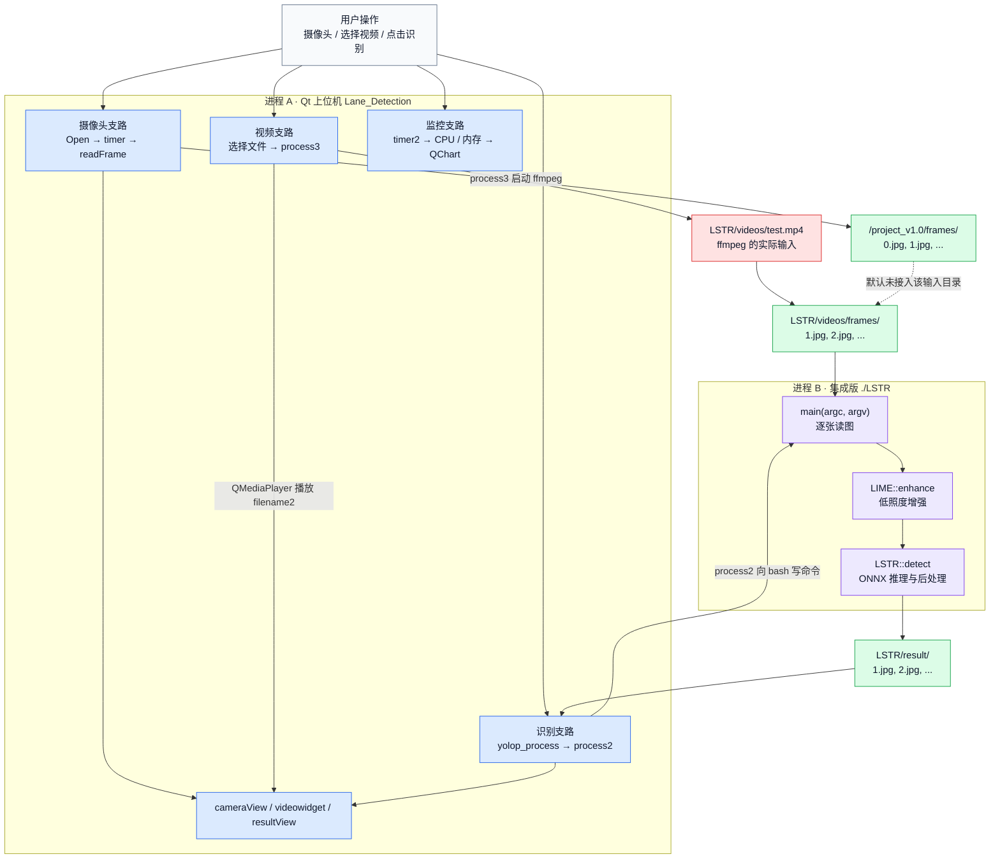

> [!important] 读图结论
> Qt 不执行卷积；集成版 `./LSTR` 对每张输入帧依次执行 **LIME → LSTR → 结果绘制**。但是摄像头保存目录与 `./LSTR` 默认读取目录不同，所以“开摄像头采集”并不等于“摄像头画面会被识别”。

---

## 图 0-B：从选视频到屏幕出图的真实时序

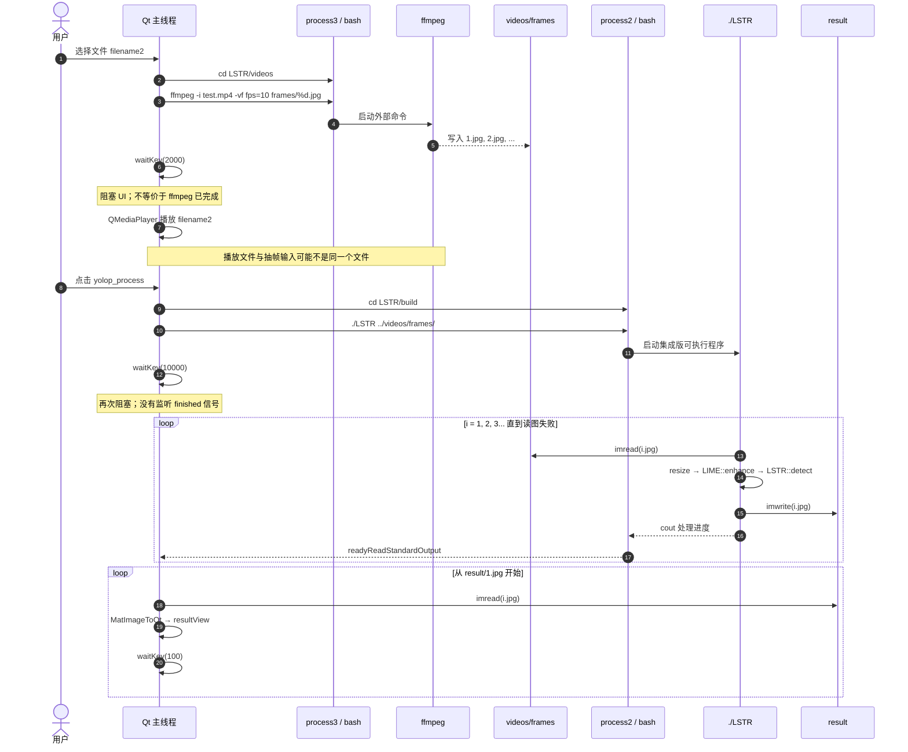

> [!danger] 这不是可靠的进程同步
> 两处 `waitKey()` 都只是固定时长暂停。结果目录可能尚未写完，也可能混入上一次运行遗留的图片；可靠实现应监听 `QProcess::finished`、清理输出目录并显式传入所选视频路径，但本文只解释现有源码，不修改程序。

---

## 图 0-C：Qt 启动与事件循环（进程 A 内部）

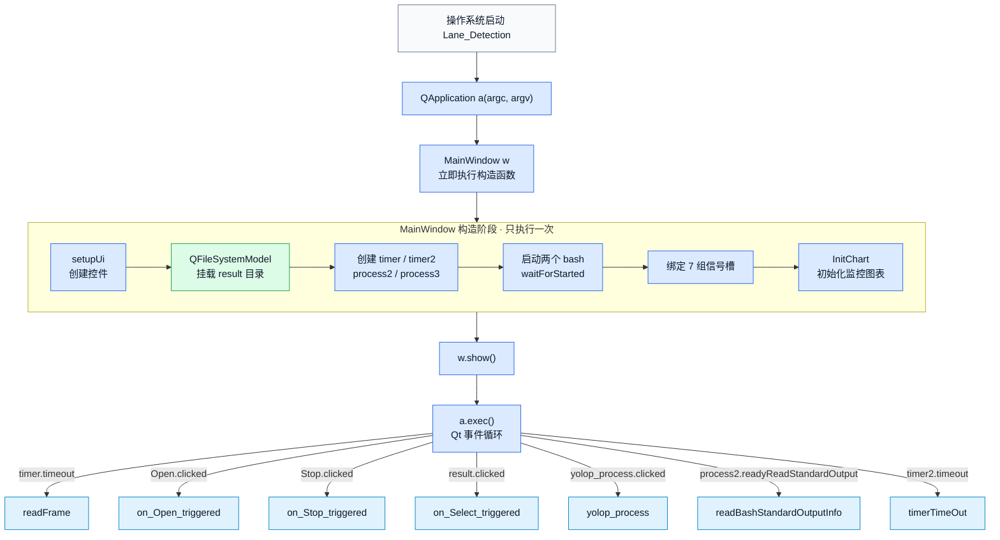

### 摄像头支路调用图

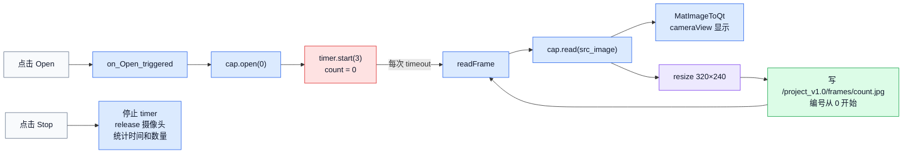

> [!warning] 实际边界
> `timer->start(3)` 表示 3 ms 定时周期上限，并不等于稳定 25 FPS；代码也没有检查 `cap.open(0)` 是否成功。摄像头帧写入 `/project_v1.0/frames/`，而识别按钮传给 LSTR 的是 `LSTR/videos/frames/`。

### 视频支路调用图

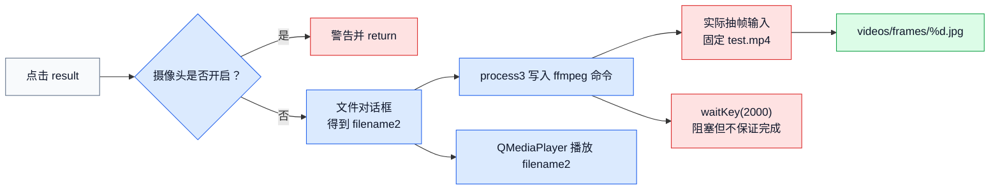

### 监控支路调用图

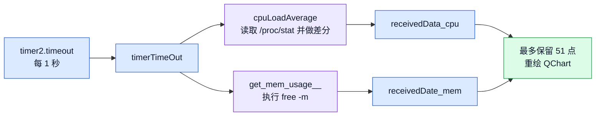

---

## 图 0-D：LIME::enhance 内部完整调用树

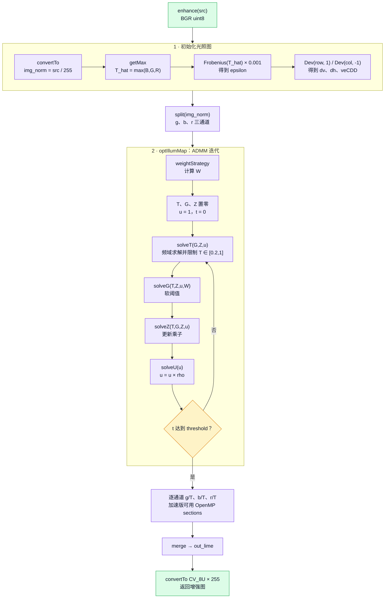

**数据主线**：


> [!note] 主链与辅助函数
> `enhance()` 主路径会调用 `_init_IllumMap()`、`getMax()`、`Frobenius()`、`Dev()`、`optIllumMap()` 及其求解函数；头文件中的 `Illum_filter()`、`Illumination()` 属于辅助/遗留实现，不在这条集成调用链中。

---

## 图 0-E：LSTR::detect 内部完整调用树

```mermaid
flowchart LR
    IN["增强图 d<br/>204×360×3 BGR uint8"]:::data
    SIZE["记录原始 H0、W0"]:::algo
    RESIZE["resize 到模型输入<br/>inpHeight × inpWidth"]:::algo
    NORM["normalize_<br/>BGR 字节 → CHW float"]:::algo
    IMG["图像 Tensor<br/>[1,3,H,W]"]:::data
    MASK["全零 mask Tensor<br/>[1,1,H,W]"]:::data
    RUN["ONNX Runtime Session::Run"]:::algo
    LOGITS["pred_logits<br/>候选分类分数"]:::data
    CURVES["pred_curves<br/>曲线参数"]:::data
    FILTER["逐候选 argmax<br/>仅 class id = 1"]:::algo
    DECODE["curves + log_space<br/>生成 50 个归一化点"]:::algo
    MAP["乘 W0、H0<br/>映射回输入图"]:::algo
    DRAW["画彩色点<br/>尝试构造绿色车道区域"]:::risk
    OUT["返回 visualization_img"]:::data

    IN --> SIZE --> RESIZE --> NORM --> IMG
    MASK --> RUN
    IMG --> RUN
    RUN --> LOGITS --> FILTER
    RUN --> CURVES --> DECODE
    FILTER --> DECODE --> MAP --> DRAW --> OUT

    classDef algo fill:#ede9fe,stroke:#7c3aed,color:#0f172a;
    classDef data fill:#dcfce7,stroke:#16a34a,color:#0f172a;
    classDef risk fill:#fee2e2,stroke:#dc2626,color:#0f172a;
```

> [!bug] 绿色区域的真实判断
> 源码不是“左右车道都存在才填充”，而是检查 `right_lane.size() == left_lane.size()` 后直接访问 `[0]`。当两侧都为空时条件仍成立，可能越界；当数量相等但不为 1 时也只使用第一组。绿色区域本身是后处理绘制，不是模型输出的 mask。

---

## 图 0-F：Unet 独立路径（不经 Qt 默认按钮）

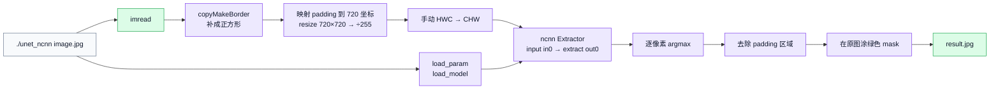

> [!info] 与集成主路径的关系
> 这是仓库中的独立 NCNN 语义分割示例。Qt 的默认识别按钮启动的是集成版 LSTR，而不是这个 Unet 可执行程序。

---

## 图 0-G：一帧图像的尺寸、类型与存储位置变化


> [!warning] 通道顺序
> `normalize_()` 按 OpenCV 的 BGR 字节顺序直接套用三组 `mean/std`，源码没有 `cvtColor(BGR→RGB)`。模型是否按这一顺序训练无法仅从调用代码确认，文中只记录实际行为。

---

## 图 0-H：模块依赖与「谁链接谁」

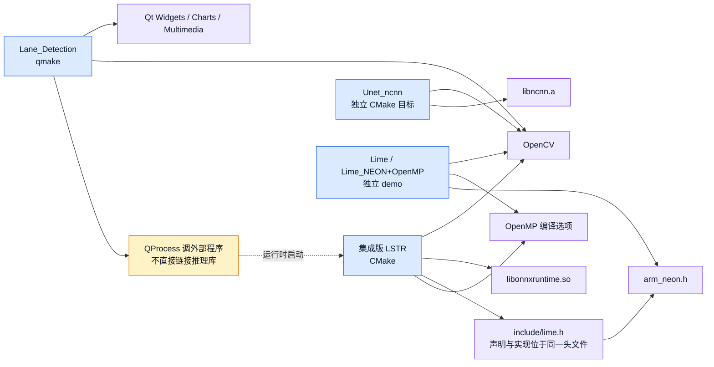

> [!note] 集成版 LIME 的来源
> `Lane_Detection/LSTR/CMakeLists.txt` 只把 `main.cpp` 加入目标，但 `include/lime.h` 同时包含 LIME 的声明与函数定义，因此 LIME 代码通过头文件进入这一翻译单元。

---

## 如何使用这篇双层文档

| 模式 | 读法 | 目标 |
|---|---|---|
| 快速理解 | 只读图 0-A、0-B、0-G 与各图下方 callout | 5～10 分钟说清进程、文件与算法主线 |
| 源码精读 | 按第一至第六部分逐函数阅读 | 能从按钮一路跟到模型输出和屏幕显示 |
| 故障排查 | 先读 [[#8.2 源码风险与易误判点\|风险清单]]，再回到对应函数 | 区分设计意图、实际行为和潜在缺陷 |
| 快速复习 | 阅读第七部分与 [[#8.1 函数调用速查表\|函数速查表]] | 重建时间顺序和模块边界 |

---

# 第一部分：Qt 上位机——源码精读

> [!info] 模块职责
> Qt 层只负责交互、采集、外部进程调度、结果显示和资源监控。网络推理位于独立的 `./LSTR` 进程中。

| 文件 | 关键入口 | 职责 |
|---|---|---|
| `Lane_Detection/main.cpp` | `main()` | 创建应用和窗口，进入 Qt 事件循环 |
| `mainwindow.cpp` | 构造、按钮槽、定时器槽 | 控件初始化、采集、抽帧、识别调度和显示 |
| `sysinfolinuximpl.cpp` | `cpuLoadAverage()`、`get_mem_usage__()` | 采集 Linux CPU 与内存占用 |

| 核心函数 | 调用者 | 主要输入/输出 | 关键风险 |
|---|---|---|---|
| `MainWindow::MainWindow()` | `main()` 中的 `MainWindow w` | 创建 UI、定时器、进程与图表 | 路径硬编码；部分对象没有父对象 |
| `on_Open_triggered()` / `readFrame()` | 按钮 / `timer` | 摄像头帧 → 预览与 JPEG | 3 ms 定时；目录与 LSTR 输入不一致 |
| `on_Select_triggered()` | `result.clicked` | 用户文件、ffmpeg 抽帧、视频预览 | 抽帧输入写死为 `test.mp4` |
| `yolop_process()` | `yolop_process.clicked` | 启动 LSTR、读取 result 图片 | 固定等待阻塞 UI；没有可靠完成信号 |
| `MatImageToQt()` | 采集与结果显示 | `cv::Mat` → `QImage` | 灰度分支误用 `memcmp` |
| `timerTimeOut()` | `timer2` | CPU/内存数据 → QChart | 每秒启动外部命令并同步等待 |

## 1.1 main.cpp 全文逐行

`[源文件]` `上位机程序/Lane_Detection/main.cpp`

| 项目 | 内容 |
|---|---|
| 职责 | 创建 Qt 应用、构造主窗口并进入事件循环 |
| 调用者 | 操作系统进程入口 |
| 输入 / 输出 | `argc/argv` → Qt 退出码 |
| 关键风险 | `a.exec()` 之前的构造逻辑都在 UI 主线程同步执行 |

### 完整代码（带行号）

```cpp
1  #include "mainwindow.h"
2  #include <QApplication>
3
4  int main(int argc, char *argv[])
5  {
6      QApplication a(argc, argv);
7      MainWindow w;
8      w.show();
9
10     return a.exec();
11 }
```

### 逐行解释

| 行 | 代码 | 逐行说明 |
|----|------|----------|
| 1 | `#include "mainwindow.h"` | 引入主窗口类声明。编译器由此知道 `MainWindow` 有哪些槽、成员。 |
| 2 | `#include <QApplication>` | Qt 应用程序类：事件循环、全局应用状态。 |
| 4 | `int main(int argc, char *argv[])` | 程序入口。`argc/argv` 传给 Qt 解析如 `-style` 等参数。 |
| 6 | `QApplication a(argc, argv);` | **必须先有** QApplication，才能创建窗口。对象 `a` 在整个进程生命周期存在（直到 main 结束）。内部会初始化 GUI 子系统。 |
| 7 | `MainWindow w;` | **栈上构造**主窗口。C++ 在此行**同步执行完整个构造函数**（创建 UI、QProcess、connect…）。构造失败会抛异常/直接崩，不会进事件循环。 |
| 8 | `w.show();` | 把窗口设为可见。此时可能还没真正画完，真正绘制在事件循环处理 `QPaintEvent` 时。 |
| 10 | `return a.exec();` | **进入事件循环**：线程阻塞在这里。循环伪代码：`while (还有窗口) { 取事件; 分发到对象; }`。返回值是应用退出码。没有这行，main 结束→析构 w→进程退出→窗口闪退。 |

### 调用关系

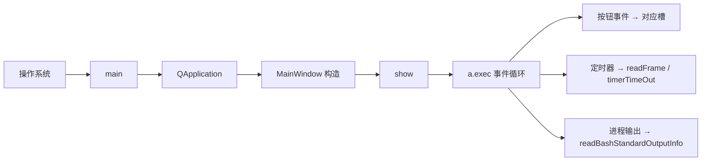

---

## 1.2 MainWindow 构造函数 —— 分段逐行

`[源文件]` `mainwindow.cpp` 构造函数

| 项目 | 内容 |
|---|---|
| 职责 | 创建控件、文件模型、定时器、外部进程、信号槽和监控图表 |
| 调用者 | `main()` 中的 `MainWindow w` |
| 输入 / 输出 | `QWidget *parent` → 一个可显示且已完成绑定的窗口对象 |
| 关键风险 | 路径全部写死；`process2/process3` 没有父对象；同步等待 bash 启动 |

### 完整代码

```cpp
MainWindow::MainWindow(QWidget *parent) :
    QMainWindow(parent),
    ui(new Ui::MainWindow)
{
    ui->setupUi(this);

    m_model = new QFileSystemModel;
    QString path = "/home/kylin/桌面/project_v1.0/LSTR/result/";
    m_model->setRootPath(path);
    ui->treeView->setModel(m_model);
    ui->treeView->setRootIndex(m_model->index(path));

    timer = new QTimer(this);
    timer2 = new QTimer(this);
    process2 = new QProcess;
    process3 = new QProcess;
    process2->start("bash");
    process3->start("bash");
    process2->waitForStarted();
    process3->waitForStarted();

    timer2->start(1000);

    connect(timer, SIGNAL(timeout()), this, SLOT(readFrame()));
    connect(ui->Open, SIGNAL(clicked()), this, SLOT(on_Open_triggered()));
    connect(ui->Stop, SIGNAL(clicked()), this, SLOT(on_Stop_triggered()));
    connect(ui->result, SIGNAL(clicked()), this, SLOT(on_Select_triggered()));
    connect(ui->yolop_process, SIGNAL(clicked()), this, SLOT(yolop_process()));
    connect(process2, SIGNAL(readyReadStandardOutput()), this, SLOT(readBashStandardOutputInfo()));
    connect(timer2, SIGNAL(timeout()), this, SLOT(timerTimeOut()));

    InitChart();
    setWindowTitle("神经网络车道线识别系统");
}
```

### 初始化列表逐行

| 代码 | 说明 |
|------|------|
| `QMainWindow(parent)` | 调用父类构造，嵌入 Qt 对象树，`parent` 负责生命周期时有用。 |
| `ui(new Ui::MainWindow)` | 堆上创建 Designer 生成的 UI 对象，后面 `setupUi` 用。 |

### 函数体逐行

| 代码 | 说明 |
|------|------|
| `ui->setupUi(this)` | 根据 `.ui` 文件创建按钮、Label、ChartView、TreeView 等，全部以 `this` 为父窗口布局好。**之后才能** `ui->Open`。 |
| `m_model = new QFileSystemModel` | 文件系统模型，把磁盘目录映射成树。 |
| `path = "/home/kylin/.../result/"` | **写死的结果目录**。换机器必改。 |
| `setRootPath(path)` | 模型监控该路径。 |
| `treeView->setModel` | 树控件使用该模型。 |
| `setRootIndex(...)` | 树的根显示为 result 目录，而不是整个磁盘。 |
| `timer = new QTimer(this)` | 采帧定时器；`this` 为 parent，窗口销毁时 Qt 自动删。 |
| `timer2 = new QTimer(this)` | 监控定时器。 |
| `process2 = new QProcess` | 将来跑 `./LSTR` 的进程封装（先只 start bash）。 |
| `process3 = new QProcess` | 将来跑 `ffmpeg`。 |
| `process2->start("bash")` | 启动一个交互 shell，stdin 可 write 命令。 |
| `process3->start("bash")` | 同上，专给抽帧。 |
| `waitForStarted()` | **阻塞**直到 bash 起来，避免过早 write。 |
| `timer2->start(1000)` | 每 1000ms 发 timeout → 将来连到 `timerTimeOut`。**注意 timer（采帧）这里还没 start。** |
| `connect(timer → readFrame)` | 以后 timer 一超时就采帧。 |
| `connect(Open → on_Open)` | 开摄像头按钮。 |
| `connect(Stop → on_Stop)` | 关摄像头。 |
| `connect(result → on_Select)` | 选视频（控件名 result 易混，实际是选视频）。 |
| `connect(yolop_process → yolop_process)` | 识别；名字遗留，实际 LSTR。 |
| `connect(process2 输出 → 日志槽)` | LSTR 的 cout 进界面。 |
| `connect(timer2 → timerTimeOut)` | 监控刷新。 |
| `InitChart()` | 创建 CPU/内存曲线图（见后）。 |
| `setWindowTitle(...)` | 标题栏文字。 |

### 构造结束后系统状态

> [!success] 构造完成后的状态
> - UI、文件模型和监控图表已经创建。
> - 两个 bash 已运行，空闲等待 `process2/process3->write()`。
> - `timer2` 已开始每秒采样；摄像头 `timer` 尚未启动。
> - 七组信号槽已经绑定，业务槽等待事件触发。

---

## 1.3 on_Open_triggered 逐行

| 项目 | 内容 |
|---|---|
| 职责 | 打开默认摄像头并启动采集定时器 |
| 调用者 | `Open.clicked` |
| 输入 / 输出 | 无显式输入 → 摄像头句柄、计时起点、`count=0` |
| 关键风险 | 不检查 `cap.open(0)` 返回值；3 ms 周期远高于注释中的 25 FPS |

```cpp
void MainWindow::on_Open_triggered()
{
    cap.open(0);
    timer->start(3);
    t = getTickCount();
    count = 0;
}
```

| 行 | 代码 | 说明 |
|----|------|------|
| 1 | `cap.open(0)` | OpenCV 打开索引 0 摄像头。成功后 `cap.isOpened()==true`。失败则后续 read 得到空图。 |
| 2 | `timer->start(3)` | 每 **3 毫秒** 进入事件队列一个 timeout（实际间隔 ≥3ms，且受系统调度影响）。与 `connect(timer, readFrame)` 联动。 |
| 3 | `t = getTickCount()` | 记录 CPU  tick，关摄像头时算运行秒数。 |
| 4 | `count = 0` | 保存帧文件名从 0 起：`0.jpg,1.jpg,...`。 |

**不在这里读图**——读图全在 `readFrame`。

---

## 1.4 readFrame 逐行（高频热点）

| 项目 | 内容 |
|---|---|
| 职责 | 抓取一帧、显示预览、缩放并保存 JPEG |
| 调用者 | `timer.timeout` |
| 输入 / 输出 | `VideoCapture cap` → `cameraView` 与 `/project_v1.0/frames/count.jpg` |
| 关键风险 | 高频磁盘写入；没有检查 `imwrite`；输出目录不是 LSTR 默认输入目录 |

```cpp
void MainWindow::readFrame()
{
    cap.read(src_image);
    if(!src_image.empty())
    {
        QImage qsrc = MatImageToQt(src_image);
        ui->cameraView->setPixmap(QPixmap::fromImage(qsrc));
        Mat re;
        cv::resize(src_image, re, cv::Size(320,240), cv::INTER_AREA);
        imwrite("/home/kylin/桌面/project_v1.0/frames/"+ to_string(count) + ".jpg", re);
        count ++;
    }
}
```

| 行 | 代码 | 说明 | 数据 |
|----|------|------|------|
| 1 | `cap.read(src_image)` | 从摄像头抓一帧写入成员 `src_image`。 | → BGR Mat，设备分辨率 |
| 2 | `if (!empty)` | 读失败（设备断、未 open）则整段跳过，避免崩。 | |
| 3 | `MatImageToQt(src_image)` | BGR Mat 转 QImage（见 1.9 逐行）。 | → QImage RGB |
| 4 | `setPixmap(...)` | 预览控件显示；**不参与算法**。 | 仅 UI |
| 5 | `Mat re;` | 准备缩小后的缓冲。 | |
| 6 | `resize(..., 320,240, INTER_AREA)` | 缩到 320×240；AREA 适合缩小。 | → 320×240 BGR u8 |
| 7 | `imwrite(.../frames/+count+.jpg)` | 落盘。路径写死。 | 磁盘文件 |
| 8 | `count++` | 下一文件名。 | |

**调用栈**：`timer timeout 信号 → Qt 元对象调用 readFrame`。

**注意**：LSTR 批处理默认读的是 `videos/frames/` 且从 1 起；摄像头写的是另一目录且从 0 起——两条输入链不要混。

---

## 1.5 on_Stop_triggered 逐行

| 项目 | 内容 |
|---|---|
| 职责 | 停止采集、释放摄像头并显示统计 |
| 调用者 | `Stop.clicked` |
| 输入 / 输出 | 计时起点与帧计数 → 运行时间、采集数量 |
| 关键风险 | 固定减去 1.5 秒可能得到负值或失真 |

```cpp
void MainWindow::on_Stop_triggered()
{
    timer->stop();
    cap.release();
    ui->cameraView->clear();
    t = ((double)getTickCount() - t) / getTickFrequency() - 1.500;
    ui->info_box->append(tr("摄像头运行了 %1 s, 采集了 %2 张图像").arg(t).arg(count));
}
```

| 行 | 说明 |
|----|------|
| `timer->stop()` | 停止再触发 readFrame。 |
| `cap.release()` | 释放设备节点。 |
| `clear()` | 预览变空。 |
| 时长公式 | `(现在tick - 开始tick)/频率 - 1.5`：作者认为启动有 1.5s 延迟要扣。 |
| `append` | 信息框追加一行中文统计。`tr` 为翻译宏。 |

---

## 1.6 on_Select_triggered 逐行

| 项目 | 内容 |
|---|---|
| 职责 | 选择并播放媒体，同时通过 ffmpeg 准备识别帧 |
| 调用者 | `result.clicked` |
| 输入 / 输出 | `filename2`、固定 `test.mp4` → 视频预览与 `videos/frames/*.jpg` |
| 关键风险 | 播放与抽帧可能不是同一文件；固定等待不保证 ffmpeg 完成；旧帧未清理 |

```cpp
void MainWindow::on_Select_triggered()
{
    if (cap.isOpened())
    {
        QMessageBox::warning(this, "Warning!", "请关闭摄像头再操作!");
        return;
    }
    vid_dir = "/home/kylin/桌面/project_v1.0/videos/";
    QString filename2 = QFileDialog::getOpenFileName(this, tr("文件夹"), vid_dir,
        tr("video files(*.avi *.mp4 *.wmv);;images(...);;All files(*.*)"));
    if(filename2.isEmpty())
        QMessageBox::warning(this, "Warning!", "文件夹路径错误!");
    else
    {
        process3->write("cd /home/kylin/桌面/project_v1.0/LSTR/videos/\n");
        process3->write("ffmpeg -i test.mp4 -vf fps=10 frames/%d.jpg\n");
        waitKey(2000);
        player=new QMediaPlayer;
        videowidget = ui->videowidget;
        videowidget->show();
        player->setVideoOutput(videowidget);
        player->setMedia(QUrl::fromLocalFile(filename2));
        player->play();
        if(player->state() == QMediaPlayer::StoppedState)
        {
           videowidget->close();
           return;
        }
    }
}
```

| 行/块 | 说明 |
|-------|------|
| `cap.isOpened` 检查 | 摄像头与视频互斥，开着则警告并 **return**，后面不执行。 |
| `vid_dir = ...` | 对话框默认打开目录（写死）。 |
| `getOpenFileName` | 阻塞式对话框；用户取消则 `filename2` 空。过滤器限制视频/图片类型。 |
| `isEmpty` 警告 | 用户取消或路径无效。 |
| `process3->write(cd...)` | 往 **ffmpeg 专用 bash** 发：进入 LSTR/videos。`\n` 表示回车执行。 |
| `process3->write(ffmpeg...)` | `-i test.mp4` 输入写死；`-vf fps=10` 每秒 10 帧；`frames/%d.jpg` 输出 1.jpg,2.jpg… |
| `waitKey(2000)` | OpenCV 等约 2 秒；给 ffmpeg 时间。**粗糙**，且在 UI 逻辑里调用。 |
| `new QMediaPlayer` | 播放器对象。 |
| `videowidget = ui->...` | 使用界面上的视频控件。 |
| `setVideoOutput` | 解码画面画到该控件。 |
| `setMedia(filename2)` | **播放用户选的文件**（可能与 ffmpeg 的 test.mp4 不同！）。 |
| `play()` | 开始播。 |
| `StoppedState` 判断 | 若立刻停止则关闭控件（边缘情况处理）。 |

**数据产物**：`LSTR/videos/frames/1.jpg,2.jpg,...` → 这才是后续 `./LSTR` 的输入。

---

## 1.7 yolop_process 逐行（整机最关键 UI 函数）

| 项目 | 内容 |
|---|---|
| 职责 | 启动集成版 LSTR，并把结果目录中的图片轮播到界面 |
| 调用者 | `yolop_process.clicked` |
| 输入 / 输出 | `videos/frames/` → `result/*.jpg` → `resultView` |
| 关键风险 | UI 主线程阻塞 10 秒；没有等待 `QProcess::finished`；旧结果和缺号会影响轮播 |

```cpp
void MainWindow::yolop_process()
{
    process2->write("cd /home/kylin/桌面/project_v1.0/LSTR/build\n");
    process2->write("./LSTR ../videos/frames/\n");

    waitKey(10000);
    for(int i = 1; i < INT_MAX; i++)
    {
        Mat r = imread("/home/kylin/桌面/project_v1.0/LSTR/result/" + to_string(i) + ".jpg");
        if(r.empty()) break;
        QImage rq = MatImageToQt(r);
        ui->resultView->setPixmap(QPixmap::fromImage(rq));
        waitKey(100);
    }
}
```

| 行 | 说明 | 运行时效果 |
|----|------|------------|
| `write(cd build)` | 算法工作目录切到 build，保证 `../lstr_....onnx` 相对路径正确。 | bash 执行 cd |
| `write(./LSTR ../videos/frames/)` | 启动算法；`argv[1]`=帧目录。 | **新子进程 LSTR 开始跑**（在 bash 里） |
| `waitKey(10000)` | 当前调用栈卡住 ~10s。希望此时 LSTR 多写出 result。 | UI 卡顿；不保证跑完 |
| `for i=1..` | 与 LSTR 写盘编号一致从 1。 | |
| `imread(result/i.jpg)` | 读算法输出。 | 文件→Mat |
| `empty break` | 读不到认为后面没有了（若中间缺号会提前停）。 | |
| `MatImageToQt` | 转 Qt 图。 | |
| `resultView setPixmap` | 结果显示区更新一帧。 | 用户看见车道图 |
| `waitKey(100)` | 间隔 100ms 当幻灯片。 | |

### 与进程 B 的时序关系（重要）

完整时序见 [[#图 0-B：从选视频到屏幕出图的真实时序|图 0-B]]。`./LSTR` 在另一进程中运行，但 Qt 主线程随后被 `waitKey(10000)` 阻塞；到时后再轮询结果文件，这不是 `waitForFinished()`，也没有使用 `QProcess::finished` 信号。

---

## 1.8 readBashStandardOutputInfo 逐行

| 项目 | 内容 |
|---|---|
| 职责 | 把算法进程的标准输出追加到日志控件 |
| 调用者 | `process2.readyReadStandardOutput` |
| 输入 / 输出 | stdout 字节 → `textBrowser` HTML |
| 关键风险 | 不读取 stderr；本地编码与子进程输出编码不一致时会乱码 |

```cpp
void MainWindow::readBashStandardOutputInfo()
{
    QByteArray _out = process2->readAllStandardOutput();
    if(!_out.isEmpty())
        ui->textBrowser->append("<font color=\"#FFFFFF\">" +
            QString::fromLocal8Bit(_out) + "</font> ");
}
```

| 行 | 说明 |
|----|------|
| 触发 | `process2` 有 stdout 可读时 Qt 发 `readyReadStandardOutput`。 |
| `readAllStandardOutput` | 一次读完当前缓冲。 |
| `isEmpty` | 无数据不刷 UI。 |
| `fromLocal8Bit` | 按系统本地编码（GBK/UTF-8 等）转 QString；中文 cout 依赖此。 |
| `append` HTML 白字 | 追加到日志框。内容如「正在处理第3张图片」。 |

---

## 1.9 MatImageToQt 逐行

| 项目 | 内容 |
|---|---|
| 职责 | 把灰度、BGR 或 BGRA `cv::Mat` 转为 `QImage` |
| 调用者 | `readFrame()`、`yolop_process()` |
| 输入 / 输出 | `const Mat&` → `QImage` |
| 关键风险 | 灰度分支用 `memcmp` 而非 `memcpy`；不同分支的缓冲区所有权不同 |

```cpp
QImage MainWindow::MatImageToQt(const Mat &src)
{
    if(src.type() == CV_8UC1)
    {
        QImage qImage(src.cols,src.rows,QImage::Format_Indexed8);
        qImage.setColorCount(256);
        for(int i = 0; i < 256; i ++)
            qImage.setColor(i,qRgb(i,i,i));
        uchar *pSrc = src.data;
        for(int row = 0; row < src.rows; row ++)
        {
            uchar *pDest = qImage.scanLine(row);
            memcmp(pDest,pSrc,src.cols);  // 问题：应 memcpy
            pSrc += src.step;
        }
        return qImage;
    }
    else if(src.type() == CV_8UC3)
    {
        const uchar *pSrc = (const uchar*)src.data;
        QImage qImage(pSrc,src.cols,src.rows,src.step,QImage::Format_RGB888);
        return qImage.rgbSwapped();
    }
    else if(src.type() == CV_8UC4)
    {
        const uchar *pSrc = (const uchar*)src.data;
        QImage qImage(pSrc, src.cols, src.rows, src.step, QImage::Format_ARGB32);
        return qImage.copy();
    }
    else
        return QImage();
}
```

### CV_8UC3 分支（摄像头/结果最常用）逐行

| 行 | 说明 |
|----|------|
| `pSrc = src.data` | 指向 BGR 数据首字节。 |
| `QImage(..., RGB888)` | 告诉 Qt「按 RGB 解释」；但内存实际是 BGR。 |
| `src.step` | 每行字节数=cols*3+对齐 padding。 |
| `rgbSwapped()` | 交换 R/B 通道，颜色正确。返回新 QImage。 |

### CV_8UC1 分支

| 行 | 说明 |
|----|------|
| `Format_Indexed8` | 8 位索引色。 |
| `setColorCount(256)` + 灰调色板 | 索引 i → RGB(i,i,i)。 |
| 逐行 `scanLine` | 目标行指针。 |
| `memcmp` | **只比较不拷贝**，疑为 `memcpy` 笔误。 |
| `pSrc += src.step` | 跳到 Mat 下一行。 |

### CV_8UC4

带 alpha；`copy()` 保证 QImage 拥有独立缓冲，避免 Mat 释放后悬空。

---

## 1.10 监控相关逐行

| 项目 | 内容 |
|---|---|
| 职责 | 每秒采样 CPU/内存并更新两条 QChart 曲线 |
| 调用者 | `timer2.timeout` |
| 输入 / 输出 | `/proc/stat`、`free -m` → 最多 51 个 CPU/内存数据点 |
| 关键风险 | 定时槽内同步启动命令并等待；字段索引依赖系统命令输出格式 |

### timerTimeOut

```cpp
void MainWindow::timerTimeOut()
{
    double cpuLoadAverage = sysinfo.cpuLoadAverage();
    double mem_used = sysinfo.get_mem_usage__();
    receivedData_cpu(cpuLoadAverage);
    receivedDate_mem(mem_used);
}
```

| 行 | 说明 |
|----|------|
| 每秒由 timer2 调用 | |
| `cpuLoadAverage()` | 见下，读 /proc/stat |
| `get_mem_usage__()` | 读 free -m |
| `receivedData_*` | 把数值点画进曲线 |

### cpuLoadAverage 逐行

```cpp
double sysinfolinuximpl::cpuLoadAverage()
{
    QProcess process;
    process.start("cat /proc/stat");
    process.waitForFinished();
    QString str = process.readLine();
    str.replace("\n","");
    str.replace(QRegExp("( ){1,}")," ");
    auto lst = str.split(" ");
    if(lst.size() > 3)
    {
        double use = lst[1].toDouble() + lst[2].toDouble() + lst[3].toDouble();
        double total = 0;
        for(int i = 1;i < lst.size();++i)
            total += lst[i].toDouble();
        if(total - pre_total > 0)
        {
            cpu_rate =(use - pre_user) / (total - pre_total) * 100.0;
            pre_total = total;
            pre_user = use;
        }
    }
    return cpu_rate;
}
```

| 行 | 说明 |
|----|------|
| 局部 `QProcess` | 每次采样临时进程执行 cat。 |
| `start("cat /proc/stat")` | 读内核累计 CPU 时间。 |
| `waitForFinished` | 等命令结束。 |
| `readLine` | 第一行形如 `cpu  user nice system idle ...` |
| 去换行、压缩空格、split | 得到字段列表；`lst[0]=="cpu"` |
| `use=lst[1]+[2]+[3]` | user+nice+system = 忙时间累计 |
| `total=sum(lst[1..])` | 所有状态时间总和 |
| 差分公式 | `(Δuse/Δtotal)*100` = 占用率% |
| 写回 `pre_*` | 供下秒差分 |
| `return cpu_rate` | 第一次可能仍是 0（还无上一次） |

### get_mem_usage__ 逐行

```cpp
process.start("free -m");
waitForFinished();
process.readLine();           // 跳过标题
str = process.readLine();     // Mem: total used free ... available
...
free = lst[6]; total = lst[1];
mem_rate = (total-free)/total*100;
```

| 行 | 说明 |
|----|------|
| `free -m` | 以 MB 显示内存 |
| 跳过第一行 | 表头 |
| 第二行 Mem | 字段随 util-linux 版本略有差异 |
| `lst[1]` total，`lst[6]` 作 available | 占用 = 1 - available/total |

### receivedData_cpu 逐行

```cpp
data_cpu.append(value);
while (data_cpu.size() > maxSize) data_cpu.removeFirst(); // 最多51点
series_cpu->clear();
int xSpace = maxX / (maxSize - 1);
for (int i = 0; i < data_cpu.size(); ++i)
    series_cpu->append(xSpace * i, data_cpu.at(i));
```

滑动窗口 + 全量重绘曲线点；X 均匀铺在 0…5000，Y 为占用率。

---

## 1.11 补齐：析构、图表初始化、内存曲线与图例交互

这些函数不改变“视频 → LSTR → 结果”的主链，但决定窗口资源和监控面板的完整行为。

### MainWindow 析构函数

```cpp
MainWindow::~MainWindow()
{
    delete ui;
}
```

| 项目 | 内容 |
|---|---|
| 职责 | 释放 `Ui::MainWindow` |
| 调用者 | 窗口生命周期结束时由 C++ 自动调用 |
| 输入 / 输出 | 当前窗口对象 → 释放 `ui` |
| 关键风险 | 只删除 `ui`；无父对象的 `process2`、`process3` 以及动态创建的 `player` 没有在此释放 |

### InitChart

```cpp
void MainWindow::InitChart()
{
    chart = new QChart();
    chart->setTitle("硬件监视器");

    maxSize = 51;
    maxX = 5000;
    maxY = 100;

    series_cpu = new QSplineSeries();
    series_mem = new QSplineSeries();
    series_cpu->setName("CPU");
    series_mem->setName("内存");

    chart->addSeries(series_cpu);
    chart->addSeries(series_mem);
    chart->createDefaultAxes();
    series_cpu->setPointsVisible(true);

    axisX = new QValueAxis;
    axisX->setRange(0, maxX);
    axisX->setTitleText("刷新率1秒/次");
    axisX->setLabelFormat("%i");
    axisX->setTickCount(3);
    axisX->setMinorTickCount(3);

    axisY = new QValueAxis;
    axisY->setRange(0, maxY);
    axisY->setTitleText("占用率");

    chart->setAxisX(axisX, series_cpu);
    chart->setAxisY(axisY, series_cpu);
    chart->setAxisX(axisX, series_mem);
    chart->setAxisY(axisY, series_mem);

    ui->graphicsView->setChart(chart);
    ui->graphicsView->setRenderHint(QPainter::Antialiasing);
    ui->graphicsView->setAttribute(Qt::WA_TranslucentBackground);
    ui->graphicsView->chart()->setTheme(QChart::ChartTheme(0));
    chart->setTheme(QChart::ChartThemeLight);

    foreach (QLegendMarker* marker, chart->legend()->markers())
    {
       QObject::disconnect(marker, SIGNAL(clicked()),
                           this, SLOT(on_LegendMarkerClicked()));
       QObject::connect(marker, SIGNAL(clicked()),
                        this, SLOT(on_LegendMarkerClicked()));
    }
}
```

| 阶段 | 作用 |
|---|---|
| 参数 | 最多 51 个点，X 范围 0～5000，Y 范围 0～100 |
| 序列 | 创建 CPU 和内存两条 `QSplineSeries` |
| 坐标轴 | 两条曲线共用 `axisX/axisY` |
| 显示 | 把 `QChart` 装入 `graphicsView` 并启用抗锯齿 |
| 交互 | 给每个图例标记绑定 `on_LegendMarkerClicked()` |

> [!note] X 轴的含义
> 数据每秒采样一次，但 X 坐标按 `5000 / 50 = 100` 递增，因此 0～5000 是显示刻度，不是实际毫秒时间戳。

### receivedDate_mem

```cpp
void MainWindow::receivedDate_mem(double value)
{
    data_mem.append(value);

    while (data_mem.size() > maxSize)
        data_mem.removeFirst();

    series_mem->clear();
    int xSpace = maxX / (maxSize - 1);

    for (int i = 0; i < data_mem.size(); ++i)
        series_mem->append(xSpace * i, data_mem.at(i));
}
```

它与 `receivedData_cpu()` 的算法相同：追加采样值、裁剪到 51 点、清空序列、按固定 X 间距全量重画。

### on_LegendMarkerClicked

```cpp
void MainWindow::on_LegendMarkerClicked()
{
    QLegendMarker* marker =
        qobject_cast<QLegendMarker*> (sender());

    switch (marker->type())
    {
        case QLegendMarker::LegendMarkerTypeXY:
        {
            marker->series()->setVisible(
                !marker->series()->isVisible());
            marker->setVisible(true);

            qreal alpha = marker->series()->isVisible()
                ? 1.0 : 0.5;

            QColor color;
            QBrush brush = marker->labelBrush();
            color = brush.color();
            color.setAlphaF(alpha);
            brush.setColor(color);
            marker->setLabelBrush(brush);

            brush = marker->brush();
            color = brush.color();
            color.setAlphaF(alpha);
            brush.setColor(color);
            marker->setBrush(brush);

            QPen pen = marker->pen();
            color = pen.color();
            color.setAlphaF(alpha);
            pen.setColor(color);
            marker->setPen(pen);
            break;
        }
        default:
            break;
    }
}
```

点击图例时反转对应序列的可见性；图例本身始终保留。隐藏曲线后把图例文字、色块和边框透明度降到 0.5，作为状态提示。

---

# 第二部分：集成版 LSTR main——批处理入口

`[源文件]` `上位机程序/Lane_Detection/LSTR/main.cpp` 底部 main

> [!info] 模块职责
> 这个 `main()` 是 Qt 启动的算法批处理入口：模型只构造一次，随后按连续编号读取帧，对每帧执行 LIME、LSTR 和结果写盘。

| 项目 | 内容 |
|---|---|
| 调用者 | `process2` 中的 bash 命令 `./LSTR ../videos/frames/` |
| 输入 | 恰好一个目录参数；目录字符串必须自带末尾 `/` |
| 输出 | `../result/i.jpg` 与 stdout 进度 |
| 结束条件 | 第一个无法读取的连续编号图片 |
| 关键风险 | 不清理旧结果；目录缺号会提前结束；异常与写盘失败未处理 |

## 2.1 完整代码（行号）

```cpp
209 int main(int argc, char** argv)
210 {
211     if (argc != 2)
212     {
213         fprintf(stderr, "Usage: %s [imagepath]\n", argv[0]);
214         return -1;
215     }
216     LSTR mynet;
217     Mat frame;
218     LIME::lime *l;
219     const char* filefolderpath = argv[1];
220     double time = cv::getTickCount();
221     cout << "开始计时" << endl;
222     for(int i = 1; i < INT_MAX; i++)
223     {
224         cv::Mat m = cv::imread(filefolderpath + to_string(i) + ".jpg", 1);
225         if (m.empty())
226         {
227             break;
228         }
229         cout << "正在处理第" << i <<"张图片" << endl;
230         Mat d;
231         cv::resize(m, d, cv::Size(360,204));
232         l = new LIME::lime(d);
233         d = l->enhance(d);
234         Mat dstimg = mynet.detect(d);
235         cv::imwrite("../result/" + to_string(i) + ".jpg", dstimg);
236         delete l;
237     }
238     time = ((double)cv::getTickCount() - time) / cv::getTickFrequency();
239     cout << "处理完成,共用时" << time << "秒" << endl;
240     return 0;
241 }
```

## 2.2 逐行解释

| 行 | 代码 | 说明 |
|----|------|------|
| 209 | `main(argc,argv)` | 由 Qt 侧 `./LSTR ../videos/frames/` 启动。 |
| 211-215 | `argc!=2` | 必须带且只带文件夹路径一个参数；否则打印 Usage 退出。 |
| 216 | `LSTR mynet` | **构造函数同步执行**：加载 onnx、节点名、log_space（见第四部分构造逐行）。只做一次。 |
| 217 | `Mat frame` | 声明了但本 main **未使用**（遗留变量）。 |
| 218 | `LIME::lime *l` | 指针，循环内每次 new/delete。 |
| 219 | `filefolderpath=argv[1]` | 如 `../videos/frames/`。后面直接字符串拼接，**依赖末尾是否有/**。 |
| 220 | `getTickCount` | 批处理计时起点。 |
| 221 | `cout 开始计时` | stdout → 被 Qt process2 捕获显示。 |
| 222 | `for i=1..` | 与 ffmpeg `%d` 从 1 编号对齐。 |
| 224 | `imread(path+i+".jpg",1)` | flag=1 彩色图。拼出 `.../1.jpg`。 |
| 225-228 | `empty break` | 文件不存在或读失败 → 结束循环（正常退出条件）。 |
| 229 | `cout 正在处理第i张` | 进度日志。 |
| 230 | `Mat d` | 缩小/增强用缓冲。 |
| 231 | `resize(m,d,Size(360,204))` | **宽360 高204**。降低 LIME 复杂度。 |
| 232 | `new LIME::lime(d)` | 构造只记 channels；大初始化在 enhance 内。 |
| 233 | `d=l->enhance(d)` | **整棵 LIME 树**（第三部分）。输出增强 u8 图，仍约 204×360。 |
| 234 | `dstimg=mynet.detect(d)` | **整棵 detect 树**（第四部分）。 |
| 235 | `imwrite("../result/"+i+".jpg")` | 相对 **build 目录** 的 `../result/`。 |
| 236 | `delete l` | 释放该帧 LIME 对象，避免循环泄漏。 |
| 238-239 | 总耗时秒 | 打印「处理完成」。 |
| 240 | `return 0` | 进程 B 结束；bash 回到提示符。 |

### 单次循环调用展开

```mermaid
flowchart LR
    READ["imread<br/>JPEG → Mat m"]:::data
    RESIZE["resize<br/>360×204"]:::algo
    NEW["new LIME::lime<br/>记录 channel"]:::algo
    INIT["_init_IllumMap"]:::lime
    OPT["optIllumMap"]:::lime
    ENH["通道 ÷ T → merge"]:::lime
    NORM["normalize_"]:::lstr
    RUN["Session::Run"]:::lstr
    DRAW["曲线解码与绘制"]:::lstr
    WRITE["imwrite result/i.jpg"]:::data
    DEL["delete lime"]:::algo

    READ --> RESIZE --> NEW --> INIT --> OPT --> ENH
    ENH --> NORM --> RUN --> DRAW --> WRITE --> DEL

    classDef data fill:#dcfce7,stroke:#16a34a,color:#0f172a;
    classDef algo fill:#f8fafc,stroke:#64748b,color:#0f172a;
    classDef lime fill:#ede9fe,stroke:#7c3aed,color:#0f172a;
    classDef lstr fill:#dbeafe,stroke:#2563eb,color:#0f172a;
```

---

# 第三部分：LIME——低照度增强主链

以下以 `Lime/lime.cpp` 原版为主（逻辑最清晰）。加速版仅在热点换实现，调用关系相同。

| 函数组 | 主链位置 | 作用 |
|---|---|---|
| `enhance()` | 总入口 | 组织归一化、光照估计、增强与输出 |
| `_init_IllumMap()`、`getMax()`、`Frobenius()`、`Dev()` | 初始化 | 构造 `T_hat`、收敛尺度与差分矩阵 |
| `weightStrategy()`、`optIllumMap()` | 优化控制 | 计算权重并驱动 ADMM 迭代 |
| `solveT/G/Z/U()`、`derivative()` | 迭代内部 | 更新主变量、梯度、乘子和惩罚参数 |
| `Mat2Vec()`、`reshape1D()`、`getReal()` | 数据整形 | 服务于频域求解 |
| `Illum_filter()`、`Illumination()` | 非集成主链 | 辅助/遗留实现，当前 `enhance()` 不调用 |

## 3.1 enhance 逐行（总入口）

| 项目 | 内容 |
|---|---|
| 调用者 | 集成版 `LSTR main()` 每帧创建的 `LIME::lime` 对象 |
| 输入 / 输出 | BGR `uint8 Mat&` → 增强后的 BGR `uint8 Mat` |
| 核心状态 | `img_norm`、`T_hat`、优化后的 `T` |
| 关键风险 | `T` 过小会放大噪声；输出依赖对象内部的尺寸和通道状态 |

```cpp
cv::Mat lime::enhance(cv::Mat &src){
    _init_IllumMap(src);                                      // L1
    cv::Size sz(img_norm.size());                             // L2
    R = cv::Mat(sz, CV_32F, cv::Scalar::all(0.0));            // L3
    std::vector<cv::Mat> img_norm_rgb;                        // L4
    cv::Mat img_norm_b, img_norm_g, img_norm_r;               // L5

    cv::split(img_norm, img_norm_rgb);                        // L6
    img_norm_g = img_norm_rgb.at(0);                          // L7
    img_norm_b = img_norm_rgb.at(1);                          // L8
    img_norm_r = img_norm_rgb.at(2);                          // L9
    cv::Mat T = optIllumMap();                                // L10

    auto g = img_norm_g / T;                                  // L11
    auto b = img_norm_b / T;                                  // L12
    auto r = img_norm_r / T;                                  // L13

    cv::Mat g1, b1, r1;                                       // L14
    threshold(g, g1, 0.0, 0.0, 3);                            // L15
    threshold(b, b1, 0.0, 0.0, 3);                            // L16
    threshold(r, r1, 0.0, 0.0, 3);                            // L17

    img_norm_rgb.clear();                                     // L18
    img_norm_rgb.push_back(g1);                               // L19
    img_norm_rgb.push_back(b1);                               // L20
    img_norm_rgb.push_back(r1);                               // L21

    cv::merge(img_norm_rgb, out_lime);                        // L22
    out_lime.convertTo(out_lime, CV_8U, 255);                 // L23
    return out_lime;                                          // L24
}
```

| 标记 | 说明 | 数据变化 |
|------|------|----------|
| L1 | 归一化、算 T_hat、差分算子、epsilon 等，见 3.2 | src→img_norm, T_hat |
| L2 | 取归一化图尺寸 | Size(h,w) |
| L3 | 成员 R 分配全 0（本函数后续未深用，占位/遗留） | |
| L4-L5 | 准备通道容器与三个 Mat 头 | |
| L6 | 把多通道 Mat 拆成 vector\<Mat\> | 1 张→3 张单通道 |
| L7-L9 | 命名绑定；OpenCV split 顺序为 B,G,R，这里变量名与 at(0/1/2) 对应关系以 split 为准 | |
| L10 | **核心迭代**求优化光照 T，见 3.5 | → T (H×W float) |
| L11-L13 | **增强公式** 反射≈观察/光照；暗处 T 小，商更大 | float 增强通道 |
| L14 | 阈值输出缓冲 | |
| L15-L17 | `THRESH_TOZERO` 类行为（type=3）：处理 ≤0 等，抑制非法值 | |
| L18-L21 | 按 B,G,R 顺序装回 vector | |
| L22 | 三通道合成彩色 | float BGR |
| L23 | ×255 并转为 uint8 | 可给后续 OpenCV/显示/再推理 |
| L24 | 返回增强图 | |

**为何三通道共用 T？** 光照是空间位置属性，不是每个颜色各一张无关光照图。

---

## 3.2 _init_IllumMap 逐行

| 项目 | 内容 |
|---|---|
| 职责 | 归一化输入，估计初始光照图并建立差分算子 |
| 输入 / 输出 | 原始图像 → `img_norm`、`T_hat`、`epsilon`、`dv/dh/veCDD` |
| 调用者 | `enhance()` |
| 关键风险 | `epsilon` 取决于 `Frobenius()`；错误并行归约会改变迭代行为 |

```cpp
void lime::_init_IllumMap(cv::Mat src){
    src.convertTo(img_norm, CV_32F, 1/255.0, 0);   // 1
    cv::Size sz(img_norm.size());                    // 2
    row = img_norm.rows;                             // 3
    col = img_norm.cols;                             // 4
    T_hat = lime::getMax(img_norm);                  // 5
    epsilon = Frobenius(T_hat)*0.001;                // 6
    dv = Dev(row, 1);                                // 7
    dh = Dev(col, -1);                               // 8
    float u = dv.at<float>(0,0);                     // 9  未再用于逻辑
    float u2 = dh.at<float>(0,0);                    // 10 未再用于逻辑
    veCDD = cv::Mat(1,row*col, CV_32F, cv::Scalar::all(0.0)); // 11
    veCDD.at<float>(0,0) = 4;                        // 12
    veCDD.at<float>(0,1) = -1;                       // 13
    veCDD.at<float>(0,row) = -1;                     // 14
    veCDD.at<float>(0,row*col-1) = -1;               // 15
    veCDD.at<float>(0,row*col-row) = -1;             // 16
}
```

| # | 说明 |
|---|------|
| 1 | 每个像素 `dst = src*1/255+0`，类型变 float。 |
| 2 | 尺寸对象（本函数内几乎不用，row/col 已够）。 |
| 3-4 | 成员 row/col，后面 getMax、reshape、Dev 都靠它。 |
| 5 | 初始光照 = 每像素通道最大。 |
| 6 | 用 T_hat 的 Frobenius 范数定 epsilon 尺度。 |
| 7-8 | 差分矩阵；k=±1 表示上下/左右邻居关系。 |
| 9-10 | 读了 dv/dh 的 (0,0) 元素但未参与后续（调试残留）。 |
| 11-16 | 频域分母相关的稀疏系数向量，供 solveT 里 `veCDD*u` 使用。 |

---

## 3.3 getMax 逐行（原版）

| 项目 | 内容 |
|---|---|
| 职责 | 对每个像素取 B、G、R 三通道最大值 |
| 输入 / 输出 | 三通道 float 图 → 单通道 `T_hat` |
| 调用者 | `_init_IllumMap()` |
| 关键风险 | 原版是逐像素热点；NEON 版必须单独处理不足 4 列的尾部 |

```cpp
cv::Mat lime::getMax(const cv::Mat& bgr)
{
    cv::Mat temp_mat(row, col, CV_32F, cv::Scalar::all(0.0)); // 1
    std::vector<cv::Mat> img_norm_rgb;                        // 2
    cv::Mat img_norm_b, img_norm_g, img_norm_r;               // 3
    cv::split(bgr, img_norm_rgb);                             // 4
    img_norm_g = img_norm_rgb.at(0);                          // 5
    img_norm_b = img_norm_rgb.at(1);                          // 6
    img_norm_r = img_norm_rgb.at(2);                          // 7
    for(int i = 0; i < row; i++){                             // 8
        for(int j = 0; j< col; j++){                          // 9
            temp_mat.at<float>(i,j) = MAX(MAX(
                img_norm_g.at<float>(i,j),
                img_norm_b.at<float>(i,j)),
                img_norm_r.at<float>(i,j));                   // 10
        }
    }
    return temp_mat;                                          // 11
}
```

| # | 说明 |
|---|------|
| 1 | 输出图，与图像同尺寸 float，初值 0。 |
| 2-4 | 拆通道。 |
| 5-7 | 绑定三个单通道（命名与通道序以 split 为准）。 |
| 8-9 | 遍历每个像素。 |
| 10 | `T_hat(i,j)=max(三通道)`。 |
| 11 | 返回初始光照图。 |

**加速版替换 8-10 行**：OpenMP 切四象限 + NEON 一次 4 像素 `vmaxq_f32`（见第五部分历史文档逻辑，此处不重复粘贴四份 section）。

---

## 3.4 Frobenius / Dev / derivative / weightStrategy 逐行要点

### Frobenius（原版）

```cpp
total = 0
for 每个元素: total += x*x
return sqrt(total)
```

即 √(Σx²)。

### Dev(n,k)

```cpp
I = 单位阵 * (-1)        // 对角全 -1
若 k>0: 把 (y, y+k) 置 1 // 超对角
若 k<0: 把 (y, y+k) 置 1 // 次对角
```

得到一阶差分矩阵。

### derivative(M)

```cpp
v = dv * M      // 行方向差分结构
h = M * dh      // 列方向
return vconcat(v,h)  // 高度变为约 2*row
```

### weightStrategy

```cpp
Wv = 1/(|dv*T_hat|+1)
Wh = 1/(|T_hat*dh|+1)
W = vconcat(Wv,Wh)
```

边缘（梯度大）权重小 → 保边。

---

## 3.5 optIllumMap 逐行

| 项目 | 内容 |
|---|---|
| 职责 | 初始化 ADMM 状态并循环调用 `solveT/G/Z/U` |
| 输入 / 输出 | `T_hat`、`W`、`epsilon` → 优化光照图 `T` |
| 调用者 | `enhance()` |
| 关键风险 | 首轮计算的迭代阈值依赖残差和 `epsilon`；异常值会改变循环次数 |

```cpp
cv::Mat lime::optIllumMap(){
    weightStrategy();                          // 1
    cv::Mat T(row,col, CV_32F, 0);             // 2
    cv::Mat G(row*2,col, CV_32F, 0);           // 3
    cv::Mat Z(row*2,col, CV_32F, 0);           // 4
    int t = 0;                                 // 5
    float u = 1;                               // 6
    while (true){                              // 7
        T = solveT(G,Z,u);                     // 8
        G = solveG(T,Z,u,W);                   // 9
        Z = solveZ(T,G,Z,u);                   // 10
        u = solveU(u);                         // 11
        if(t == 0){                            // 12
            float temp = Frobenius(derivative(T) - G);
            thd = ceil(2* log(temp / epsilon));
        }
        t += 1;                                // 13
        if(t >= thd) break;                    // 14
    }
    return T;                                  // 15
}
```

| # | 说明 |
|---|------|
| 1 | 先算 W。 |
| 2 | 光照图初值 0。 |
| 3-4 | G、Z 高度 2*row，匹配 derivative 输出。 |
| 5-6 | 迭代计数与惩罚初值。 |
| 7 | 直到 t 达到 thd。 |
| 8 | 更新 T（频域子问题）。 |
| 9 | 更新 G（软阈值）。 |
| 10 | 更新 Z（残差累积）。 |
| 11 | u ← u*rho，惩罚加大。 |
| 12 | **仅第一轮**估迭代次数 thd。 |
| 13-14 | 计数；满 thd 退出。 |
| 15 | 返回优化光照。 |

---

## 3.6 solveT / solveG / solveZ / solveU 逐行要点

### solveT

```text
X = G - Z/u
拆 X 的垂直/水平块 Xv,Xh
temp = dv*Xv + Xh*dh
mat_temp1 = Mat2Vec(2*T_hat + u*temp)   // 右端拉平
dft → numerator
dft(veCDD*u) → denominator; +2
商 → getReal → 再 dft → getReal → /cols
normalize 到 [0.2,1]                     // 关键安全
reshape1D 成 HxW
```

**逐概念行**：

| 步骤 | 为何 |
|------|------|
| 用 G,Z,u 组方程右端 | ADMM 子问题闭式解的分子 |
| DFT | 把卷积/循环结构变成频域点除 |
| normalize 0.2 | 避免 T 过小导致通道/T 爆炸 |
| reshape | 向量变回图 |

### solveG

```text
dT = derivative(T)
eps = alpha * W / u
X = dT + Z/u
sign 矩阵 S
S_ce = max(|X|-eps, 0)
G = S ⊙ S_ce            // soft-threshold
```

### solveZ

```text
Z ← Z + u * (derivative(T) - G)
```

### solveU

```text
return u * rho;  // rho 默认 2
```

---

# 第四部分：LSTR——构造、归一化、推理与后处理

| 阶段 | 关键函数/对象 | 职责 |
|---|---|---|
| 一次性初始化 | `LSTR::LSTR()` | 加载 ONNX、读取节点形状和 `log_space.bin` |
| 每帧预处理 | `normalize_()` | 把 OpenCV 像素写成 CHW float |
| 每帧推理 | `detect()` / `Session::Run()` | 创建双输入 Tensor 并取得两个输出 |
| 后处理 | `detect()` 后半段 | 筛选候选、解码曲线、映射坐标并绘图 |
| 释放 | `LSTR::~LSTR()` | 只释放 `log_space`；会话指针未释放 |

## 4.1 构造函数逐行

| 项目 | 内容 |
|---|---|
| 调用者 | 集成版 `main()` 中的 `LSTR mynet` |
| 输入 / 输出 | 模型文件与 `log_space.bin` → 可复用的 ONNX Session |
| 执行频率 | 每次启动 `./LSTR` 只执行一次 |
| 关键风险 | 文件打开和读取没有校验；局部 `model_path` 遮蔽成员；会话释放不完整 |

```cpp
LSTR::LSTR()
{
    const ORTCHAR_T* model_path = "../lstr_360x640.onnx";          // 1
    sessionOptions.SetGraphOptimizationLevel(ORT_ENABLE_BASIC);    // 2
    ort_session = new Session(env, model_path, sessionOptions);    // 3
    size_t numInputNodes = ort_session->GetInputCount();           // 4
    size_t numOutputNodes = ort_session->GetOutputCount();         // 5
    AllocatorWithDefaultOptions allocator;                         // 6
    for (int i = 0; i < numInputNodes; i++) {                      // 7
        auto input_name_Ptr = ort_session->GetInputNameAllocated(i, allocator); // 8
        inputNodeNameAllocatedStrings.push_back(std::move(input_name_Ptr));     // 9
        input_names.push_back(inputNodeNameAllocatedStrings.back().get());      // 10
        auto input_type_info = ort_session->GetInputTypeInfo(i);   // 11
        auto input_tensor_info = input_type_info.GetTensorTypeAndShapeInfo(); // 12
        auto input_dims = input_tensor_info.GetShape();            // 13
        input_node_dims.push_back(input_dims);                     // 14
    }
    // 对 output 做 8-14 的对称循环…                                    // 15
    this->inpHeight = input_node_dims[0][2];                       // 16
    this->inpWidth  = input_node_dims[0][3];                       // 17
    this->mask_tensor.resize(inpHeight * inpWidth, 0.0);           // 18
    log_space = new float[len_log_space];                          // 19
    FILE* fp = fopen("../log_space.bin", "rb");                    // 20
    fread(log_space, sizeof(float), len_log_space, fp);            // 21
    fclose(fp);                                                    // 22
}
```

| # | 说明 |
|---|------|
| 1 | 模型相对 **当前工作目录**（Qt 已 cd 到 build）。 |
| 2 | 基础图优化（算子融合等）。 |
| 3 | **磁盘读入 onnx，构建可执行 Session**——最重的一步。 |
| 4-5 | 输入/输出个数（LSTR 一般为 2 和 2）。 |
| 6 | ORT 分配器，用于取节点名字符串。 |
| 7 | 遍历每个输入。 |
| 8 | 分配并返回输入名。 |
| 9 | **move 进成员容器**保活。 |
| 10 | `const char*` 列表供 Run 使用；指向 9 中字符串。 |
| 11-13 | 类型与形状，如 [1,3,360,640]。 |
| 14 | 存 dims。 |
| 15 | 输出同理，得到 pred 相关名与 dims。 |
| 16-17 | NCHW：下标 2=H, 3=W。 |
| 18 | 第二输入缓冲，元素全 0。 |
| 19-22 | 读 50 个 float 采样表；不检查 fp 是否 NULL（隐患）。 |

### LSTR 析构函数

```cpp
LSTR::~LSTR()
{
    delete[] log_space;
    log_space = NULL;
}
```

析构函数只释放了 `log_space`。成员 `ort_session` 由 `new Session(...)` 创建，但没有对应的 `delete ort_session`，因此每次算法进程退出前都会遗留一块未主动释放的会话资源；操作系统最终会在进程结束时回收，但这仍是对象生命周期不完整。

---

## 4.2 normalize_ 逐行

| 项目 | 内容 |
|---|---|
| 调用者 | `detect()` |
| 输入 / 输出 | 模型尺寸的 BGR `uint8 Mat` → `input_image_` CHW float |
| 变换 | `(pix/255 - mean[c]) / std[c]` |
| 关键风险 | 源码没有 BGR→RGB 转换；三重循环是每帧热点 |

```cpp
void LSTR::normalize_(Mat img)
{
    int row = img.rows;                                              // 1
    int col = img.cols;                                              // 2
    this->input_image_.resize(row * col * img.channels());           // 3
    for (int c = 0; c < 3; c++)                                      // 4
      for (int i = 0; i < row; i++)                                  // 5
        for (int j = 0; j < col; j++)                                // 6
        {
          float pix = img.ptr<uchar>(i)[j * 3 + c];                  // 7
          this->input_image_[c * row * col + i * col + j] =          // 8
              (pix / 255.0 - mean[c]) / std[c];                      // 9
        }
}
```

| # | 说明 |
|---|------|
| 1-2 | 当前是 **已 resize 到网络输入** 的图高宽。 |
| 3 | 缓冲长度 = H*W*3。 |
| 4 | c=0,1,2 → B,G,R（OpenCV 顺序）。 |
| 5-6 | 行、列。 |
| 7 | 第 i 行指针 + 像素 j 的第 c 字节。 |
| 8 | **CHW 下标**：先 c 平面，再 i 行，再 j 列。 |
| 9 | 先 /255 到 [0,1]，再减均值除方差（ImageNet）。 |

**若 CHW 写反成 HWC**：网络仍跑但不准，属静默逻辑错误。

---

## 4.3 detect 逐行（分段）

| 项目 | 内容 |
|---|---|
| 调用者 | 集成版 `main()` 的逐帧循环 |
| 输入 / 输出 | 增强图引用 → 带车道点和绿色区域的克隆图 |
| 模型 I/O | 图像与全零 mask 两个输入；`pred_logits`、`pred_curves` 两个输出 |
| 关键风险 | 曲线分母可能接近 0；点坐标不裁剪；绿色区域判断可能空数组越界 |

### 段 A：预处理

```cpp
const int img_height = srcimg.rows;   // A1 保存入口图高（增强图）
const int img_width  = srcimg.cols;   // A2 宽
Mat dstimg;
resize(srcimg, dstimg, Size(inpWidth, inpHeight), INTER_LINEAR); // A3
normalize_(dstimg);                   // A4
```

| | 说明 |
|--|------|
| A1-A2 | 曲线坐标最后乘这两个，画回 **enhance 后的图** 而不是网络输入图。 |
| A3 | 拉到 onnx 输入大小；`Size(宽,高)`。 |
| A4 | 填 `input_image_`。 |

### 段 B：Tensor 与 Run

```cpp
array<int64_t,4> input_shape_{1,3,inpHeight,inpWidth};  // B1
array<int64_t,4> mask_shape_{1,1,inpHeight,inpWidth};   // B2
auto allocator_info = MemoryInfo::CreateCpu(...);         // B3
vector<Value> ort_inputs;
ort_inputs.push_back(CreateTensor<>(... input_image_ ...)); // B4
ort_inputs.push_back(CreateTensor<>(... mask_tensor ...));  // B5
vector<Value> ort_outputs = ort_session->Run(               // B6
    RunOptions{nullptr},
    input_names.data(), ort_inputs.data(), 2,
    output_names.data(), output_names.size());
```

| | 说明 |
|--|------|
| B1 | NCHW 图像 shape。 |
| B2 | NCHW mask，C=1。 |
| B3 | CPU 内存类型信息。 |
| B4 | 包装图像指针为 ORT Tensor（零拷贝视图语义，取决于实现，数据来自 vector）。 |
| B5 | 包装全 0 mask。 |
| B6 | **前向推理**；2 个输入；取出全部输出。 |

```cpp
const float* pred_logits = ort_outputs[0].GetTensorMutableData<float>(); // B7
const float* pred_curves = ort_outputs[1].GetTensorMutableData<float>(); // B8
const int logits_h = output_node_dims[0][1];  // B9 候选数
const int logits_w = output_node_dims[0][2];  // B10 类别数
const int curves_w = output_node_dims[1][2];  // B11 参数维
```

### 段 C：解码有效车道

```cpp
for (int i = 0; i < logits_h; i++) {           // C1 每个候选
  float max_logits = -10000; int max_id = -1;
  for (int j = 0; j < logits_w; j++) {         // C2 每个类别
    float data = pred_logits[i*logits_w + j];// C3 行优先
    if (data > max_logits) { max_logits=data; max_id=j; } // C4 argmax
  }
  if (max_id == 1) {                           // C5 有效类
    good_detections.push_back(i);
    const float *p = pred_curves + i*curves_w; // C6 第 i 组参数
    vector<Point> lane_points(50);
    for (int k = 0; k < 50; k++) {             // C7
      float y = p[0] + log_space[k]*(p[1]-p[0]); // C8
      float x = p[2]/powf(y-p[3],2)+p[4]/(y-p[3])+p[5]+p[6]*y-p[7]; // C9
      lane_points[k] = Point(int(x*img_width), int(y*img_height)); // C10
    }
    lanes.push_back(lane_points);
  }
}
```

| | 说明 |
|--|------|
| C1 | 遍历所有 query/候选。 |
| C2-C4 | 对该候选的分类向量做 argmax。 |
| C5 | **类别 id==1 才当车道**（模型约定）。 |
| C6 | curves 里第 i 行参数指针。 |
| C7 | 固定 50 个采样点。 |
| C8 | y 在 p0与p1 间按 log_space 插值。 |
| C9 | 参数化 x(y) 曲线。 |
| C10 | 归一化坐标→像素；用的是 **A1/A2 入口尺寸**。 |

### 段 D：可视化

```cpp
vector<int> right_lane;
vector<int> left_lane;
for (int i = 0; i < good_detections.size(); i++)
{
    if (good_detections[i] == 0) right_lane.push_back(i);
    if (good_detections[i] == 5) left_lane.push_back(i);
}

Mat visualization_img = srcimg.clone();
if (right_lane.size() == left_lane.size())
{
    Mat lane_segment_img = visualization_img.clone();
    vector<Point> points = lanes[right_lane[0]];
    reverse(points.begin(), points.end());
    points.insert(points.begin(),
                  lanes[left_lane[0]].begin(),
                  lanes[left_lane[0]].end());
    fillConvexPoly(lane_segment_img, points, Scalar(0, 255, 0));
    addWeighted(visualization_img, 0.4,
                lane_segment_img, 0.6, 0, visualization_img);
}

for (int i = 0; i < lanes.size(); i++)
    for (int j = 0; j < lanes[i].size(); j++)
        circle(visualization_img, lanes[i][j], 3,
               lane_colors[good_detections[i]], -1);
```

> [!bug] 等量不等于存在
> 当 `right_lane` 和 `left_lane` 都为空时，`size()` 同为 0，条件成立后却访问 `right_lane[0]` 与 `left_lane[0]`，可能直接越界。源码意图更像是“左右车道均非空时填充”，但本文必须按实际代码解释。

**绿填充是后处理，不是网络输出通道。** `fillConvexPoly()` 先生成绿色多边形，再由 `addWeighted()` 与原图叠加；彩色圆点来自每条解码曲线的 50 个采样点。

---

# 第五部分：LIME 加速版热点

> [!warning] 这里记录“源码实际优化”及其正确性边界
> SIMD 和多线程只有在尾部、归约和数据依赖都正确时才是有效加速。本文不把“使用了 NEON/OpenMP”自动等同于“结果正确”。

## 5.1 NEON getMax 内层四行

```cpp
float32x4_t g = vld1q_f32(g_ptr + j);     // 从内存 load 4 float → 寄存器
float32x4_t b = vld1q_f32(b_ptr + j);
float32x4_t r = vld1q_f32(r_ptr + j);
float32x4_t m = vmaxq_f32(g, vmaxq_f32(b,r)); // lane0..3 各自 max
vst1q_f32(out_ptr + j, m);                // 写回 4 个 max
```

OpenMP 四个 section 改的是 **i、j 的起止范围**（四象限），内层同上。

## 5.2 Frobenius 问题行

```cpp
total_sum = vaddq_f32(total_sum, squared); // 多线程同时写 total_sum → 竞争
// 并行区结束后的 critical 无法撤销已发生的竞争
```

---

# 第六部分：Unet NCNN 独立路径

`[源文件]` `Unet_NCNN/src/unet.cpp`

| 项目 | 内容 |
|---|---|
| 入口 | 独立命令行 `main(argc, argv)`，不由 Qt 默认按钮调用 |
| 输入 / 输出 | 单张图片 → 语义分割结果 `result.jpg` |
| 推理框架 | NCNN，输入节点 `in0`，输出节点 `out0` |
| 核心变化 | 补边 → 720×720 → HWC→CHW → argmax → 去补边 |
| 关键风险 | 手工布局转换和 padding 坐标映射容易出现通道或边界错误 |

## 6.1 加载与读图

```cpp
if (argc < 2) exit;                    // 必须给图片路径
ncnn::Net Unet;
Unet.load_param("../models/model.ncnn.param"); // 结构
Unet.load_model("../models/model.ncnn.bin");   // 权重
src = imread(argv[1]);
```

## 6.2 pad 逐行逻辑

```cpp
if (width > height) {
  top/bottom = 补成正方形的上下黑边
  copyMakeBorder(src,tmp, top,bottom,0,0, BLACK)
} else {
  left/right 左右补边
}
// 再把 top.. 按比例映到 720 坐标系，供后处理清边
```

## 6.3 归一化与 HWC→CHW 逐行

```cpp
resize 720
convertTo float /255
for i in 0..H-1:
  for j in 0..W-1:
    for k in 0..2:
      // k=通道, i=行, j=列
      data[k*H*W + i*W + j] = srcdata[i*W*3 + j*3 + k]
in.reshape(720,720,3)
```

| 下标 | 布局 |
|------|------|
| 右端 srcdata | HWC 交错 |
| 左端 data | CHW 平面 |

## 6.4 推理与 argmax 逐行

```cpp
ex = create_extractor()
ex.set_light_mode(true)
ex.set_num_threads(4)
ex.input("in0", in)       // 名字必须与 param 一致
ex.extract("out0", mask)

for i,j:
  maxk = 0
  best = mask(c=0,i,j)
  for k in channels:
    if mask(k,i,j) > best: best=...; maxk=k
  cv_img[i,j] = maxk
  if 落在 pad 带: cv_img[i,j]=0

cv_img*=255
result = image; result.setTo(绿, cv_img)
imwrite result.jpg
```

---

# 第七部分：运行时序复盘

## 7.1 冷启动（只发生一次）

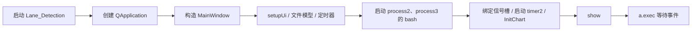

## 7.2 选视频识别（主演示路径）

完整交互时序见 [[#图 0-B：从选视频到屏幕出图的真实时序|图 0-B]]。复盘时只记住五个边界：

1. `filename2` 只交给播放器；ffmpeg 实际读取固定的 `test.mp4`。
2. ffmpeg 把连续编号帧写到 `LSTR/videos/frames/`。
3. `process2` 启动 `./LSTR`，模型构造一次，帧循环多次。
4. 每帧结果落到 `LSTR/result/`，Qt 再从磁盘读回。
5. `timer2` 的监控事件与上述流程并存，但 UI 被 `waitKey()` 阻塞时事件处理会受影响。

## 7.3 每一帧算法内部（浓缩）

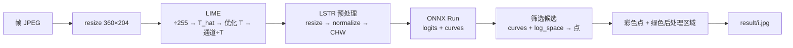

细节分别见 [[#图 0-D：LIME::enhance 内部完整调用树|图 0-D]]、[[#图 0-E：LSTR::detect 内部完整调用树|图 0-E]] 和 [[#图 0-G：一帧图像的尺寸、类型与存储位置变化|图 0-G]]。

---

# 第八部分：速查与风险

## 8.1 函数调用速查表

| 调用者 / 触发源 | 被调函数 | 文件 | 结果 |
|---|---|---|---|
| OS | Qt `main()` | `Lane_Detection/main.cpp` | 进入事件循环 |
| Qt `main()` | `MainWindow::MainWindow()` | `mainwindow.cpp` | 完成窗口初始化 |
| 窗口生命周期结束 | `MainWindow::~MainWindow()` | `mainwindow.cpp` | 释放 `ui` |
| `Open.clicked` | `on_Open_triggered()` | `mainwindow.cpp` | 打开摄像头、启动 timer |
| `timer.timeout` | `readFrame()` | `mainwindow.cpp` | 预览并保存摄像头帧 |
| `Stop.clicked` | `on_Stop_triggered()` | `mainwindow.cpp` | 停止采集 |
| `result.clicked` | `on_Select_triggered()` | `mainwindow.cpp` | 播放文件、启动 ffmpeg |
| `yolop_process.clicked` | `yolop_process()` | `mainwindow.cpp` | 启动 LSTR、轮播结果 |
| `process2` stdout | `readBashStandardOutputInfo()` | `mainwindow.cpp` | 刷新日志 |
| `timer2.timeout` | `timerTimeOut()` | `mainwindow.cpp` | 触发 CPU/内存采样 |
| 构造函数 | `InitChart()` | `mainwindow.cpp` | 创建监控图表 |
| `timerTimeOut()` | `receivedData_cpu()` / `receivedDate_mem()` | `mainwindow.cpp` | 重画监控曲线 |
| 图例点击 | `on_LegendMarkerClicked()` | `mainwindow.cpp` | 显示/隐藏曲线 |
| bash | 集成版 LSTR `main()` | `LSTR/main.cpp` | 进入图片批处理 |
| LSTR `main()` | `LSTR::LSTR()` / `~LSTR()` | `LSTR/main.cpp` | 初始化/释放模型对象 |
| LSTR `main()` | `lime::enhance()` | `lime.h` / `lime.cpp` | 低照度增强 |
| `enhance()` | `_init_IllumMap()` / `optIllumMap()` 等 | LIME 实现 | 求解光照图 |
| LSTR `main()` | `LSTR::detect()` | `LSTR/main.cpp` | 推理、解码、绘图 |
| `detect()` | `normalize_()` / `Session::Run()` | `LSTR/main.cpp` | 构造张量并推理 |
| 命令行 | Unet `main()` | `Unet_NCNN/src/unet.cpp` | 独立语义分割 |

## 8.2 源码风险与易误判点

| 类别 | 源码行为 | 影响 |
|---|---|---|
| 路径 | 多处写死 `/home/kylin/桌面/project_v1.0/...` | 换用户、目录或部署机后直接失效 |
| 输入错配 | 播放 `filename2`，ffmpeg 却固定读取 `test.mp4` | 用户看到的视频可能不是被识别的视频 |
| 输入断链 | 摄像头写 `/project_v1.0/frames/0.jpg...`，LSTR 读 `LSTR/videos/frames/1.jpg...` | 摄像头支路默认不会进入识别主链 |
| 残留文件 | 抽帧前不清空 `frames/`，识别前不清空 `result/` | 新旧帧、结果可能混合 |
| 同步 | `waitKey(2000/10000)` 在 Qt 主线程固定等待 | UI 卡顿，且不能证明子进程已完成 |
| 轮询 | 结果读取遇到第一个空图就 `break` | 中间缺号或尚未写完会提前停止 |
| 进程日志 | 只连接 `readyReadStandardOutput` | ffmpeg/LSTR 的 stderr 错误可能不显示 |
| 命名 | 按钮和函数名为 `yolop_process`，实际启动 LSTR | 阅读和讲解时容易把模型说错 |
| 图像转换 | 灰度分支调用 `memcmp` 而不是 `memcpy` | 只比较内存，不会把灰度像素复制进 QImage |
| 颜色顺序 | `normalize_()` 直接按 BGR 使用三组 `mean/std` | 若模型期望 RGB，输入语义会错位 |
| LSTR 后处理 | `right_lane.size() == left_lane.size()` 后直接访问 `[0]` | 两侧都为空时仍可能越界 |
| 曲线解码 | `x(y)` 含 `1/(y-p3)`，且坐标不裁剪 | 分母接近 0 或点落出图像时结果不稳定 |
| 资源 | `LSTR::~LSTR()` 未删除 `ort_session` | 会话资源生命周期不完整 |
| 资源 | `MainWindow::~MainWindow()` 只删除 `ui` | 无父对象的进程和播放器可能泄漏 |
| NEON | 四象限循环 `j += 4`，没有标量尾部 | 半宽不是 4 的倍数时可能越界或重复跨区 |
| OpenMP | 多个 section 共同更新 `total_sum` | `Frobenius()` 存在数据竞争；并行区后的 `critical` 无法补救 |
| 算法一致性 | 优化版 `Frobenius()` 返回平方和，原版返回平方根 | `epsilon` 尺度和迭代次数可能改变 |

---

## 结束：建议的源码跟踪顺序

1. 用 [[#图 0-A：整机运行边界与数据通道|图 0-A]] 区分 Qt、LSTR、磁盘目录和独立 Unet。
2. 对照 `mainwindow.cpp` 跟 `on_Select_triggered()` 与 `yolop_process()`。
3. 用 [[#图 0-B：从选视频到屏幕出图的真实时序|图 0-B]] 核对 QProcess、固定等待和文件交换。
4. 打开集成版 `LSTR/main.cpp`，按第二部分跟完一帧。
5. 用图 0-D、0-E、0-G 交叉检查 LIME、Tensor 和坐标恢复。
6. 最后阅读 Unet，比较“逐像素类别”与“参数化曲线”两种输出。

> [!tip] 阅读判断标准
> 当你能解释“用户选中的文件为何可能没有被识别”“绿色区域为什么不是模型 mask”“摄像头帧为何默认不进入 LSTR”时，就已经抓住了这份源码最重要的系统边界。
