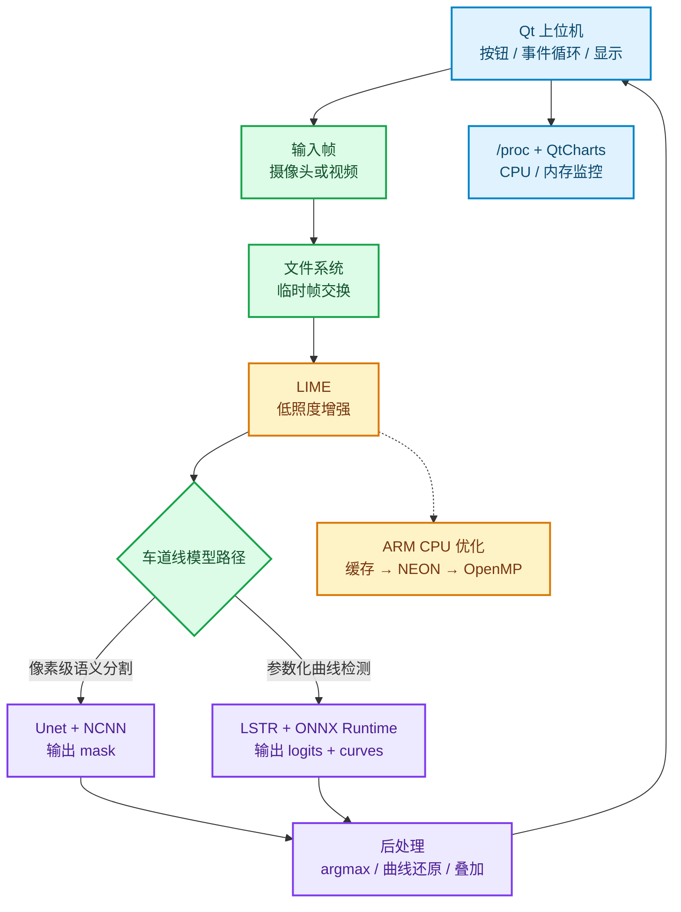
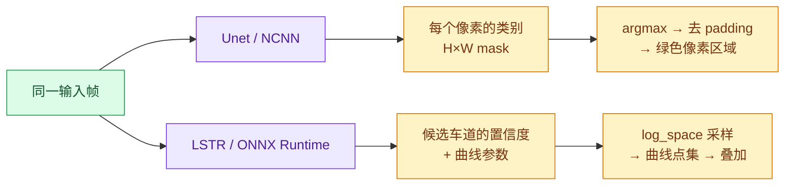

# 深度学习入口：系统地图与阅读顺序

<!-- WIKI_NAV_START -->
> [!info] 视觉感知 Wiki 导航
> [[projects/linux视觉感知项目/index|项目首页]] · [[0.2 主动回忆与破坏测试手册|下一篇：1.2 主动回忆与破坏测试手册 →]]
<!-- WIKI_NAV_END -->

## Linux 视觉感知处理系统 · 深度学习入口

> 这不是“从头到尾读一遍”的资料库，而是一条从系统主线走到源码细节、再回到面试表达的学习路径。先看图建立骨架，再按代码地标核对；每个模块都要经历：**痛点 → 心智模型 → 函数地图 → 完整调用链 → 手写追踪 → 破坏测试 → 闭卷重建**。

## 先看这一张图：系统到底在做什么

### 一句话版本

Qt 负责**调度、显示和监控**；LIME 负责**把低光图像变成更适合识别的输入**；Unet 或 LSTR 负责**识别车道线**；NEON 和 OpenMP 负责**在没有可用 GPU 的 ARM 平台上压缩 CPU 计算时间**。

## 推荐阅读顺序

| 阶段 | 先读什么 | 学习产出 | 通过标准 |
|---|---|---|---|
| 1. 全景 | [[projects/Linux视觉感知项目/00 项目总览/1.1 项目概述|项目概述]]、[[projects/Linux视觉感知项目/00 项目总览/1.5 系统全景与数据流|系统全景]] | 画出输入、增强、模型、显示四段链 | 不看资料能讲清模块职责 |
| 2. 控制层 | [[projects/Linux视觉感知项目/01 Qt 上位机/2.1 界面布局与UI控件|Qt 上位机]]、[[projects/Linux视觉感知项目/01 Qt 上位机/2.2 信号槽机制与交互|信号槽]]、[[projects/Linux视觉感知项目/01 Qt 上位机/2.3 QProcess 进程管理|QProcess]] | 追踪一次按钮点击到结果显示 | 能解释为什么不能堵塞 UI 线程 |
| 3. LIME 主线 | [[projects/Linux视觉感知项目/02 LIME 低照度增强/3.1 算法原理：Retinex与光照图|Retinex 与光照图]]、[[projects/Linux视觉感知项目/02 LIME 低照度增强/3.2 ADMM优化框架|ADMM]] | 串起 `T_hat → T → G/Z/u → enhance` | 能说明 `solveT()` 使用的旧值和新值 |
| 4. LIME 加速 | [[projects/Linux视觉感知项目/02 LIME 低照度增强/3.5 NEON SIMD向量化加速|NEON]]、[[projects/Linux视觉感知项目/02 LIME 低照度增强/3.6 OpenMP多线程并行|OpenMP]]、[[projects/Linux视觉感知项目/02 LIME 低照度增强/3.7 优化前后性能对比|性能对比]] | 把瓶颈、优化手段、前提对应起来 | 能指出尾部处理和数据竞争风险 |
| 5. 模型部署 | [[projects/Linux视觉感知项目/03 模型推理部署/4.4 Unet编码器-解码器架构|Unet/NCNN]]、[[projects/Linux视觉感知项目/03 模型推理部署/4.5 NCNN部署与HWC-CHW转换|NCNN 后处理]]、[[projects/Linux视觉感知项目/03 模型推理部署/4.1 LSTR模型架构与曲线解码|LSTR/ONNX]] | 完成两条推理链的纸面追踪 | 不把 `mask`、`pred_curves`、绿色区域混为一谈 |
| 6. 闭卷复盘 | [[projects/Linux视觉感知项目/00 项目总览/0.2 主动回忆与破坏测试手册|主动回忆与破坏测试]]、[[projects/Linux视觉感知项目/05 面试与复习/6.5 系统设计决策与追问应对|系统设计追问]] | 输出 2 分钟项目回答和故障定位路径 | 能解释“为什么这样设计”而不只背名词 |

## 两条模型链，要用“输出语义”来区分

| 问题 | Unet | LSTR |
|---|---|---|
| 把车道线看成什么 | 一片需要分类的像素 | 一条可参数化的几何曲线 |
| 模型输出 | 多通道像素得分 | `pred_logits`、`pred_curves` |
| 关键后处理 | `argmax`、去 padding | 筛选 query、曲线采样、构造显示区域 |
| 重点风险 | HWC→CHW、尺寸恢复 | 双输入、输出形状、`log_space.bin` |

## 每个模块都按这 8 步学

1. **痛点**：它为什么存在？删掉会怎样？
2. **心智模型**：把术语映射到“调度台、补光工位、画家、曲线拟合器”等角色。
3. **函数地图**：先列文件、入口和所有关键函数，不急着背实现。
4. **完整代码浏览**：按真实文件逐函数走完，不只看“灵魂函数”。
5. **手写追踪**：用 2×2 图像、4 个 NEON 元素或一次 Qt 事件追踪状态。
6. **费曼检验**：用自己的话回答痛点、核心变量、边界条件、删除后果。
7. **破坏测试**：故意去掉安全下界、布局转换或线程前提，预测故障。
8. **闭卷重建**：回到系统主线，说明本模块如何影响下游。

## 证据标记

| 标记 | 使用规则 |
|---|---|
| **代码已验证** | 能在当前工作区文件和具体函数/行附近找到依据 |
| **原作者资料** | 来自项目原始文档或历史实验，不等同于本次重新测量 |
| **待验证/风险** | 需要补充数值对照、边界测试、线程正确性或部署配置 |

学习时优先相信“当前源码 + 可复现实验”，不要把原始文档中的历史数据直接当成今天的运行结果。

## 代码入口速查

| 模块 | 入口文件 |
|---|---|
| Qt 上位机 | `上位机程序/Lane_Detection/main.cpp`、`mainwindow.cpp` |
| LIME 原始版 | `图像预处理（加速前+加速后）/Lime/lime.cpp` |
| LIME 优化版 | `图像预处理（加速前+加速后）/Lime_NEON+OpenMP/lime_opt.cpp` |
| Unet/NCNN | `卷积神经网络/卷积神经网络/Unet_NCNN/src/unet.cpp` |
| LSTR/ONNX Runtime | `卷积神经网络/卷积神经网络/LSTR_ONNX/main.cpp` |

## 开始学习前的自测

先不要翻后面的页面，尝试只用三句话回答：

1. 这个系统解决了什么真实问题？
2. 为什么需要 LIME、Unet/LSTR 和 Qt 三类模块？
3. 如果结果图全黑或 UI 卡死，你先查哪一层？

把回答保留下来；学完一个模块后再对照，而不是一开始就背标准答案。

<!-- WIKI_FOOTER_START -->
---
> [!tip] 继续阅读
> [[projects/linux视觉感知项目/index|项目首页]] · [[0.2 主动回忆与破坏测试手册|下一篇：1.2 主动回忆与破坏测试手册 →]]
<!-- WIKI_FOOTER_END -->
