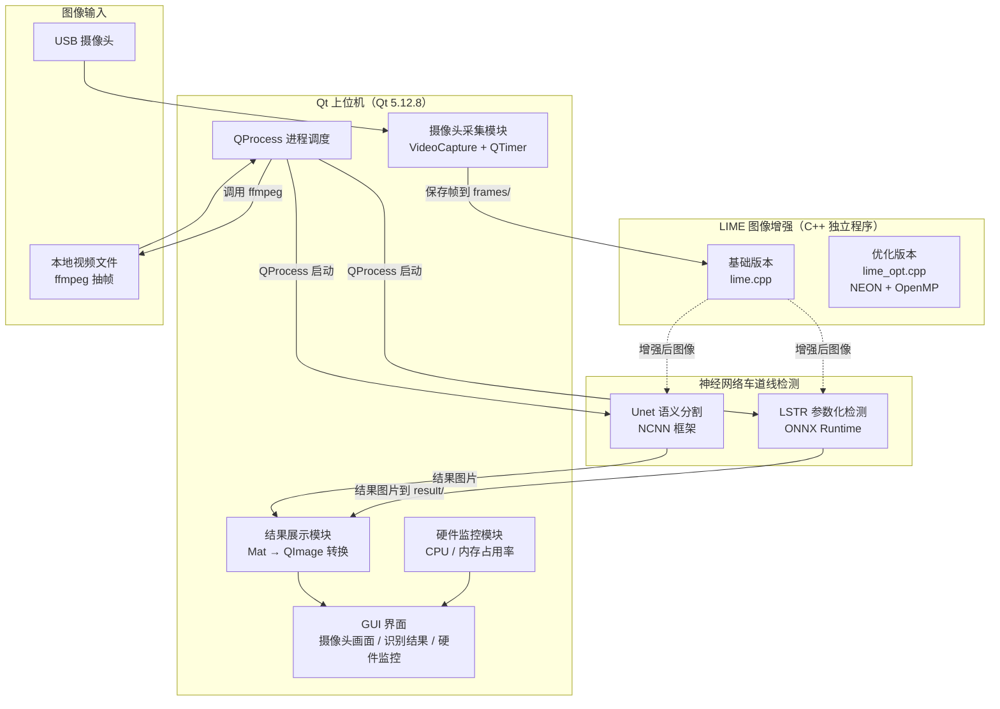
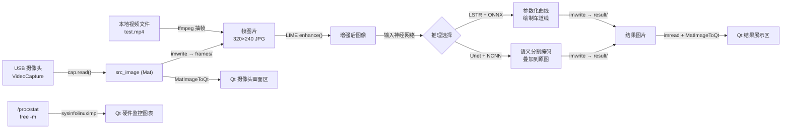

# 项目概述

<!-- WIKI_NAV_START -->
> [!info] 视觉感知 Wiki 导航
> [[projects/linux视觉感知项目/index|项目首页]] · [[0.2 主动回忆与破坏测试手册|← 上一篇：1.2 主动回忆与破坏测试手册]] · [[projects/Linux视觉感知项目/00 项目总览/1.2 环境搭建与依赖安装|下一篇：2.2 环境搭建与依赖安装 →]]
<!-- WIKI_NAV_END -->

本页面是整个文档体系的起点，旨在帮助开发者在深入任何单一模块之前，先建立对 **Linux 视觉感知处理系统** 的全局认知。我们将从项目定位出发，逐层剖析系统架构、模块职责、数据流向和技术选型依据，使读者在后续阅读中始终拥有清晰的"地图感"。

## 一、项目定位与核心目标

本系统是一个面向 **ARM 嵌入式 Linux 开发板**（Kylin OS / AArch64）的车道线视觉感知方案。它将传统的图像增强算法与深度学习推理整合到一个统一的 Qt 上位机平台中，形成从 **图像采集 → 低照度增强 → 神经网络推理 → 结果可视化** 的完整处理链路。

项目的核心设计目标有三个层面：第一，在低照度行车环境下通过 LIME 算法提升图像质量，为后续神经网络推理提供更可靠的输入；第二，部署两种轻量化车道线检测模型（Unet 语义分割和 LSTR 参数化检测），验证不同技术路线在嵌入式场景下的可行性；第三，通过 ARM NEON 向量化和 OpenMP 多线程并行对 LIME 算法进行性能优化，探索嵌入式平台上的计算加速策略。

Sources: [readme.txt](projects/linux视觉感知项目/源码/readme.txt#L1-L83), [mainwindow.cpp](mainwindow.cpp#L37-L47)

## 二、系统整体架构

系统采用 **"上位机 + 独立算法进程"** 的分层架构。Qt 上位机作为总控入口，负责用户交互、图像采集、结果展示和硬件监控；LIME 图像增强和神经网络推理作为独立的 C++ 可执行程序，由上位机通过 `QProcess` 进行调度调用。这种松耦合设计使得各算法模块可以独立编译、独立测试，也便于后续替换推理框架。



Sources: [mainwindow.h](mainwindow.h#L1-L121), [mainwindow.cpp](mainwindow.cpp#L37-L55), [1102demo3.pro](1102demo3.pro#L1-L41)

## 三、三大核心模块概览

### 3.1 Qt 上位机程序

Qt 上位机是整个系统的控制中枢和用户交互界面。基于 Qt 5.12.8 构建，使用了 `QtMultimedia`（视频播放）、`QtCharts`（硬件监控图表）等组件。界面布局分为四个功能区域：左上方为视频文件播放区（`QVideoWidget`），左下方为摄像头实时画面区（`QLabel`），右上方为车道线识别结果展示区（`QLabel`）和硬件监控图表（`QChartView`），右下方为终端输出信息区（`QTextBrowser`）和识别结果文件浏览区（`QTreeView`）。

| 区域 | 控件类型 | 功能 |
|------|----------|------|
| 视频播放区 | `QVideoWidget` | 播放本地视频文件 |
| 摄像头画面区 | `QLabel` | 显示摄像头实时采集画面 |
| 识别结果区 | `QLabel` | 显示神经网络识别后的车道线标注图 |
| 终端输出区 | `QTextBrowser` | 显示 QProcess 子进程的标准输出 |
| 硬件监控区 | `QChartView` | 实时曲线图展示 CPU 和内存占用率 |
| 文件浏览区 | `QTreeView` | 浏览识别结果图片目录 |

上位机通过两个 `QTimer` 定时器分别控制摄像头采集帧率（3ms 间隔）和硬件监控刷新率（1s 间隔），通过两个 `QProcess` 实例分别管理视频抽帧和神经网络推理的终端命令执行。

Sources: [mainwindow.ui](mainwindow.ui#L1-L310), [mainwindow.cpp](mainwindow.cpp#L28-L55), [mainwindow.h](mainwindow.h#L43-L121)

### 3.2 LIME 低照度图像增强

LIME（Low-Light Image Enhancement）模块负责在神经网络推理之前对低照度图像进行增强预处理。该模块包含两个版本：**基础版本**（`lime.cpp`）使用纯 OpenCV 实现，核心算法通过 ADMM（交替方向乘子法）迭代优化求解最优光照图 T，然后将原始图像除以光照图实现增强；**优化版本**（`lime_opt.cpp`）在基础版本之上引入了 **ARM NEON 向量化指令**（每次处理 4 个 float32 元素）和 **OpenMP 多线程并行**（将图像分块后并行计算），实现了显著的性能提升。

基础版本 LIME 的核心处理流程为：输入图像归一化 → 取三通道最大值构建初始光照图 T_hat → 计算权重矩阵 W → 通过 ADMM 迭代求解优化光照图 T（子问题 T/G/Z/u 循环） → 原始图像各通道除以 T 得到增强结果。优化版本在此基础上，对 `getMax`、`Frobenius` 等计算密集函数使用 NEON intrinsic 重写，并通过 OpenMP `sections` / `parallel for` 实现行级和象限级并行。

| 版本 | 源文件 | 加速技术 | 特点 |
|------|--------|----------|------|
| 基础版 | `lime.cpp` | 无（纯 OpenCV） | 逻辑清晰，便于理解算法原理 |
| 优化版 | `lime_opt.cpp` | ARM NEON + OpenMP | 向量化 + 多线程并行，适合嵌入式部署 |

Sources: [lime.cpp](lime.cpp#L1-L418), [lime_opt.cpp](lime_opt.cpp#L1-L200), [CMakeLists.txt](projects/linux视觉感知项目/源码/图像预处理（加速前+加速后）/Lime/CMakeLists.txt#L1-L26)

### 3.3 神经网络车道线检测

本模块部署了两种车道线检测模型，代表了两种不同的技术路线：

**Unet 语义分割方案**基于 NCNN 推理框架部署。NCNN 是腾讯开源的高性能神经网络推理库，专为移动端和嵌入式设备优化，无需依赖第三方库，支持静态编译为单一可执行文件。Unet 模型将输入图像（720×720）逐像素分类为车道线区域和背景，输出分割掩码后叠加到原图上显示。其处理流程包括：图像填充为正方形 → 归一化 → HWC 到 CHW 布局转换 → NCNN 推理 → argmax 取分类结果 → 去除填充边界 → 可视化。

**LSTR 参数化检测方案**基于 ONNX Runtime 推理框架部署。LSTR 采用 Transformer 架构，直接输出车道线的参数化曲线表示（8 个参数），而非逐像素分割。其后处理流程为：对输出 logits 取 argmax 筛选有效检测 → 利用 8 个曲线参数（y 范围参数 + 二次有理函数参数）通过数学公式计算车道线上 50 个采样点的坐标 → 区分左右车道线 → 绘制车道线和可行驶区域。

| 方案 | 模型 | 推理框架 | 输入尺寸 | 输出形式 | 特点 |
|------|------|----------|----------|----------|------|
| Unet | 语义分割模型 | NCNN | 720×720 | 像级掩码 | 直观，像素级精度 |
| LSTR | 参数化检测模型 | ONNX Runtime | 360×640 | 曲线参数 | 轻量，端到端 |

Sources: [unet.cpp](unet.cpp#L1-L144), [main.cpp(LSTR)](projects/linux视觉感知项目/源码/卷积神经网络/卷积神经网络/LSTR_ONNX/main.cpp#L1-L223), [CMakeLists.txt(Unet)](projects/linux视觉感知项目/源码/卷积神经网络/卷积神经网络/Unet_NCNN/CMakeLists.txt#L1-L30), [CMakeLists.txt(LSTR)](projects/linux视觉感知项目/源码/卷积神经网络/卷积神经网络/LSTR_ONNX/CMakeLists.txt#L1-L20)

## 四、系统数据流全景

理解数据如何在模块间流转是掌握本系统的关键。下图展示了从图像输入到最终展示的完整数据路径：



**关键路径说明**：摄像头采集帧经 `resize` 到 320×240 后保存到 `frames/` 目录；Qt 上位机通过 `QProcess` 发送终端命令启动 LSTR 推理程序处理 `frames/` 中的图片；推理结果保存到 `result/` 目录后，上位机逐帧读取并显示。视频文件则通过 `ffmpeg` 以 10fps 速率抽帧后再走相同路径。

Sources: [mainwindow.cpp](mainwindow.cpp#L86-L103), [mainwindow.cpp](mainwindow.cpp#L105-L130), [mainwindow.cpp](mainwindow.cpp#L146-L170)

## 五、项目目录结构

```
Linux视觉感知处理系统/
├── 上位机程序/Lane_Detection/          # Qt 上位机工程
│   ├── main.cpp                        # Qt 程序入口
│   ├── mainwindow.h / .cpp / .ui       # 主窗口（GUI + 业务逻辑）
│   ├── sysinfolinuximpl.h / .cpp       # CPU/内存监控模块
│   ├── 1102demo3.pro                   # Qt 工程配置文件
│   ├── res.qrc / resource/             # Qt 资源文件（背景图等）
│   ├── frames/                         # 摄像头采集帧存放目录
│   └── LSTR/                          # LSTR 推理程序及结果目录
│       ├── videos/                     # 视频源文件
│       └── result/                     # 识别结果图片
│
├── 图像预处理（加速前+加速后）/          # LIME 增强模块
│   ├── Lime/                           # 基础版本
│   │   ├── lime.cpp                    # LIME 算法完整实现
│   │   ├── CMakeLists.txt              # CMake 构建配置
│   │   ├── include/                    # 头文件（lime.h, omp.h）
│   │   └── data/                       # 测试图片素材
│   └── Lime_NEON+OpenMP/              # 优化版本
│       ├── lime_opt.cpp                # NEON + OpenMP 优化实现
│       ├── xinlime.cpp                 # 简化版实现
│       └── CMakeLists.txt              # 含 OpenMP 链接配置
│
├── 卷积神经网络/卷积神经网络/            # 车道线检测模块
│   ├── LSTR_ONNX/                     # LSTR + ONNX Runtime
│   │   ├── main.cpp                    # LSTR 推理与后处理
│   │   ├── lstr_360x640.onnx           # 预训练 ONNX 模型
│   │   ├── log_space.bin               # 对数空间采样数据
│   │   ├── include/                    # ONNX Runtime 头文件
│   │   └── lib/                        # ONNX Runtime 动态库
│   └── Unet_NCNN/                     # Unet + NCNN
│       ├── src/unet.cpp                # Unet 推理与后处理
│       ├── models/                     # NCNN 模型文件（.param + .bin）
│       ├── include/ncnn/               # NCNN 头文件
│       └── lib/libncnn.a               # NCNN 静态库
│
└── 文档/                               # 项目文档（本 Wiki）
    ├── Linux视觉感知处理原作者文档.md
    ├── Linux视觉感知处理系统复习文档.md
    └── linux视觉感知高频面试问答.md
```

Sources: [readme.txt](projects/linux视觉感知项目/源码/readme.txt#L50-L83)

## 六、技术选型与依赖关系

本系统的技术栈围绕 **ARM Linux 嵌入式开发** 展开，每一项技术选型都有明确的场景驱动因素：

| 技术组件 | 版本 | 选型理由 |
|----------|------|----------|
| **Qt** | 5.12.8 LTS | 跨平台 GUI 框架，`QtMultimedia` 支持视频播放，`QtCharts` 支持硬件监控可视化 |
| **OpenCV** | 4.7.0 | 图像处理基础设施，提供 `VideoCapture`、`Mat` 运算、色彩空间转换等核心能力 |
| **NCNN** | — | 腾讯开源推理框架，无外部依赖，支持静态编译，专为 ARM 优化 |
| **ONNX Runtime** | 1.16.0 | 微软开源推理框架，支持 ONNX 模型格式，跨平台部署便捷 |
| **ARM NEON** | — | ARM 处理器 SIMD 指令集，单指令处理 4 个 float32，加速 LIME 像素级运算 |
| **OpenMP** | — | 多线程并行编程接口，通过 `#pragma omp` 指令实现循环/区域级并行 |
| **ffmpeg** | 系统自带 | 视频抽帧工具，由 Qt 通过 `QProcess` 调用，以 10fps 速率提取帧画面 |
| **CMake** | ≥ 3.5 | 跨平台构建系统，管理编译选项、第三方库链接和编译目标 |

所有第三方库的头文件和链接库均已包含在各工程目录中（`include/` 和 `lib/` 子目录），开发者无需额外下载即可完成编译。

Sources: [readme.txt](projects/linux视觉感知项目/源码/readme.txt#L1-L49), [1102demo3.pro](1102demo3.pro#L13-L22), [CMakeLists.txt(NEON+OpenMP)](projects/linux视觉感知项目/源码/图像预处理（加速前+加速后）/Lime_NEON+OpenMP/CMakeLists.txt#L1-L41)

## 七、建议阅读路径

根据文档目录结构和模块间的依赖关系，建议按以下顺序阅读：

1. **[开发环境搭建与编译运行](2-kai-fa-huan-jing-da-jian-yu-bian-yi-yun-xing)** — 搭建开发环境，编译运行各模块获得直观感受
2. **[系统数据流与模块总览](3-xi-tong-shu-ju-liu-yu-mo-kuai-zong-lan)** — 深入理解模块间的数据流转和调用关系
3. **Qt 上位机开发**（[程序入口](4-qt-cheng-xu-ru-kou-yu-shi-jian-xun-huan-yuan-li) → [信号槽](5-xin-hao-cao-ji-zhi-yu-an-niu-jiao-hu-liu-cheng) → [摄像头采集](6-she-xiang-tou-cai-ji-yu-shi-pin-zheng-du-qu) → [QProcess](7-qprocess-diao-yong-wai-bu-tui-li-cheng-xu) → [图像格式转换](8-mat-yu-qimage-tu-xiang-ge-shi-zhuan-huan) → [性能监控](9-cpu-yu-nei-cun-xing-neng-jian-kong-mo-kuai)）— 从控制中枢开始理解系统运行机制
4. **LIME 图像增强**（[算法原理](10-lime-suan-fa-yuan-li-yu-guang-zhao-tu-gu-ji) → [核心函数](11-lime-he-xin-han-shu-zhu-xing-jie-xi) → [ADMM 迭代](12-admm-die-dai-you-hua-yu-shou-lian-kong-zhi) → [循环优化](13-xun-huan-zhong-pai-yu-xun-huan-zhan-kai-you-hua) → [NEON 加速](14-arm-neon-xiang-liang-hua-jia-su) → [OpenMP 并行](15-openmp-duo-xian-cheng-bing-xing-jia-su)）— 先理解算法再学习优化
5. **车道线检测神经网络**（[Unet 原理](16-unet-wang-luo-jie-gou-yu-yu-yi-fen-ge-yuan-li) → [NCNN 部署](17-unet-mo-xing-qing-liang-hua-yu-ncnn-bu-shu) → [LSTR 原理](18-lstr-wang-luo-jie-gou-yu-can-shu-hua-jian-ce-yuan-li) → [LSTR 部署](19-lstr-mo-xing-bu-shu-yu-hou-chu-li-liu-cheng)）— 理解两种技术路线的原理与工程实现
6. **[模块集成与技术选型](20-mo-kuai-ji-cheng-xing-neng-shu-ju-yu-ji-zhu-xuan-xing)** → **[面试准备](21-gao-pin-mian-shi-wen-da-yu-xiang-mu-jiang-jie-mo-ban)** — 最后进行综合回顾和面试准备
