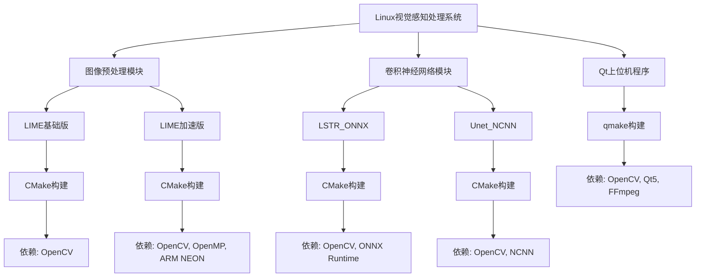

# 各模块 CMake 构建指南

<!-- WIKI_NAV_START -->
> [!info] 视觉感知 Wiki 导航
> [[projects/linux视觉感知项目/index|项目首页]] · [[projects/Linux视觉感知项目/00 项目总览/1.2 环境搭建与依赖安装|← 上一篇：2.2 环境搭建与依赖安装]] · [[projects/Linux视觉感知项目/00 项目总览/1.4 快速运行车道线检测|下一篇：2.3.2 快速运行车道线检测流程 →]]
<!-- WIKI_NAV_END -->

本指南为初学者提供 Linux 视觉感知处理系统各模块的 CMake 构建详细步骤。项目包含四个主要模块：LIME 低照度增强算法（基础版与加速版）、LSTR 车道线检测（ONNX Runtime）、Unet 语义分割（NCNN）以及 Qt 上位机程序。每个模块采用独立的构建系统，但都遵循相似的构建流程。

## 构建系统概述

项目采用混合构建策略：**CMake** 用于图像预处理和卷积神经网络模块，**qmake** 用于 Qt 上位机程序。这种设计基于各模块的技术栈差异——CMake 更适合跨平台 C++ 项目，而 Qt 项目使用 qmake 能更好地集成 Qt 特定组件。

下图展示了整个项目的构建依赖关系：



## 通用依赖库安装

在构建任何模块前，需要安装以下基础依赖库：

| 依赖库 | 版本要求 | 安装命令 | 用途 |
|--------|----------|----------|------|
| OpenCV | 4.x | 源码编译安装 | 图像处理核心库 |
| CMake | ≥3.5 | `sudo apt-get install cmake` | 构建系统生成器 |
| GCC/G++ | 支持C++11 | `sudo apt-get install build-essential` | 编译器 |

**OpenCV 安装步骤**（参考 `readme.txt`）：
```bash
# 下载OpenCV 4.7.0源码
wget https://github.com/opencv/opencv/archive/4.7.0.zip
unzip 4.7.0.zip && cd opencv-4.7.0

# 配置、编译、安装
./configure
make -j8
sudo make install
```

Sources: `readme.txt#L1-L20`

## LIME 基础版构建

LIME 基础版实现原始算法，无 SIMD 或并行优化，适合理解算法原理。

**构建步骤**：
```bash
# 进入LIME基础版目录
cd 图像预处理（加速前+加速后）/Lime

# 创建构建目录
mkdir build && cd build

# 生成构建文件
cmake ..

# 编译
make

# 运行测试
./lime
```

**CMake 配置分析**：
- 最低版本：CMake 3.12
- 编译标准：C++11（通过 `-std=c++11` 指定）
- 优化级别：Release 模式
- 依赖库：仅 OpenCV

**关键配置项**：
```cmake
cmake_minimum_required(VERSION 3.12)
project(lime_processing)
set(CMAKE_CXX_STANDARD 14)
set(CMAKE_BUILD_TYPE "Release")
set(CMAKE_CXX_FLAGS "-std=c++11")
find_package(OpenCV REQUIRED)
```

**测试数据位置**：`图像预处理（加速前+加速后）/Lime/data/` 目录包含多种格式的测试图像。

Sources: `图像预处理（加速前+加速后）/Lime/CMakeLists.txt#L1-L26`

## LIME 加速版构建

LIME 加速版集成了 ARM NEON SIMD 指令和 OpenMP 多线程并行优化，专为 ARM 平台设计。

**构建步骤**：
```bash
# 进入LIME加速版目录
cd 图像预处理（加速前+加速后）/Lime_NEON+OpenMP

# 创建构建目录
mkdir build && cd build

# 生成构建文件
cmake ..

# 编译
make

# 运行测试
./lime
```

**关键依赖**：
1. **OpenMP**：用于多线程并行
2. **ARM NEON**：SIMD 指令集优化（仅限 ARM 平台）

**CMake 配置特点**：
- 添加了 `-O3` 优化标志
- 自动检测并链接 OpenMP
- 包含 ARM NEON 头文件

**平台兼容性说明**：
```cmake
# 自动检测OpenMP
find_package(OpenMP REQUIRED)
if (OPENMP_FOUND)
    message("OPENMP FOUND")
    set(CMAKE_C_FLAGS "${CMAKE_C_FLAGS} ${OpenMP_C_FLAGS}")
    set(CMAKE_CXX_FLAGS "${CMAKE_CXX_FLAGS} ${OpenMP_CXX_FLAGS}")
else ()
    message(FATAL_ERROR "OpenMP Not Found!")
endif ()
```

**注意**：NEON 头文件 `arm_neon.h` 是平台特定的，仅在 ARM 架构上可用。在 x86 平台上编译此模块需要禁用 NEON 相关代码或提供模拟层。

Sources: `图像预处理（加速前+加速后）/Lime_NEON+OpenMP/CMakeLists.txt#L1-L41`

## LSTR 车道线检测构建

LSTR 模块使用 ONNX Runtime 进行参数化车道线检测，支持 ONNX 模型格式。

**构建步骤**：
```bash
# 进入LSTR_ONNX目录
cd 卷积神经网络/卷积神经网络/LSTR_ONNX

# 创建构建目录
mkdir build && cd build

# 生成构建文件
cmake ..

# 编译
make

# 运行测试
./LSTR
```

**依赖库安装**：
```bash
# 安装ONNX Runtime（从源码编译）
git clone --recursive https://github.com/Microsoft/onnxruntime
cd onnxruntime
./build.sh --config RelWithDebInfo --build_wheel --update --build
```

**关键配置**：
- 编译标准：C++11
- 链接库：OpenCV、ONNX Runtime、pthread、ncurses
- 模型文件：`lstr_360x640.onnx`

**CMake 关键部分**：
```cmake
# ONNX Runtime库路径设置
set(ONNXRUNTIME_LIB ${PROJECT_SOURCE_DIR}/lib/libonnxruntime.so)

# 链接所有依赖库
target_link_libraries(LSTR 
    libpthread.so
    libncurses.so
    ${OpenCV_LIBS}
    ${ONNXRUNTIME_LIB}
)
```

**测试数据**：`卷积神经网络/卷积神经网络/LSTR_ONNX/images/` 目录包含测试图像。

Sources: `卷积神经神经网络/LSTR_ONNX/CMakeLists.txt#L1-L20`

## Unet 语义分割构建

Unet 模块使用腾讯 NCNN 框架进行像素级语义分割，适用于车道线精细检测。

**构建步骤**：
```bash
# 进入Unet_NCNN目录
cd 卷积神经网络/卷积神经网络/Unet_NCNN

# 创建构建目录
mkdir build && cd build

# 生成构建文件
cmake ..

# 编译
make

# 运行测试
./unet_ncnn ../images/0.jpg
```

**NCNN 框架安装**：
```bash
# 1. 安装protobuf依赖
sudo apt-get install autoconf automake libtool curl make g++ unzip
git clone https://github.com/google/protobuf.git
cd protobuf
git submodule update --init --recursive
./autogen.sh
./configure
make
make check
sudo make install
sudo ldconfig

# 2. 安装NCNN
git clone https://github.com/Tencent/ncnn
cd ncnn
mkdir -p build && cd build
cmake ..
make -j4
```

**CMake 配置特点**：
- 支持 OpenMP 多线程优化
- 链接本地 NCNN 库
- 包含安全编译标志 `-pie -fPIE -fPIC -Wall`

**模型文件**：
- `models/model.ncnn.param`：网络结构定义
- `models/model.ncnn.bin`：模型权重

**关键配置**：
```cmake
# 包含NCNN头文件和库
include_directories(${CMAKE_CURRENT_SOURCE_DIR}/include)
include_directories(${CMAKE_CURRENT_SOURCE_DIR}/include/ncnn)
link_directories(${CMAKE_CURRENT_SOURCE_DIR}/lib)

# 链接NCNN库
target_link_libraries(unet_ncnn ncnn ${OpenCV_LIBS})
```

Sources: `卷积神经网络/卷积神经网络/Unet_NCNN/CMakeLists.txt#L1-L30`

## Qt 上位机程序构建

Qt 上位机程序使用 qmake 构建系统，提供图形用户界面和系统监控功能。

**构建步骤**：
```bash
# 进入Qt项目目录
cd 上位机程序/Lane_Detection

# 使用qmake生成Makefile
qmake 1102demo3.pro

# 编译
make

# 运行
./camera_test
```

**Qt 5.12.8 安装**：
```bash
# 从Qt官网下载qt5.12.8源码包
# 编译安装Qt基础库
./configure -prefix /usr/local/qt5.12.8
make -j8
sudo make install

# 安装Qt Charts和Qt Multimedia子模块
# 从官网下载对应源码包编译安装
```

**关键依赖**：
- **Qt 5.12.8**：核心框架
- **OpenCV**：图像处理
- **FFmpeg**：视频采集处理

**项目文件分析**：
```pro
QT += core gui multimedia multimediawidgets charts
greaterThan(QT_MAJOR_VERSION, 4): QT += widgets

# OpenCV库路径配置
INCLUDEPATH += /usr/local/include /usr/local/include/opencv4
LIBS += /usr/local/lib/libopencv_highgui.so \
        /usr/local/lib/libopencv_core.so \
        /usr/local/lib/libopencv_imgproc.so
```

**注意**：Qt 项目使用绝对路径配置，实际部署时需要根据系统环境调整路径。

Sources: `上位机程序/Lane_Detection/1102demo3.pro#L1-L41`

## 构建常见问题与解决方案

### OpenCV 找不到
**现象**：`CMake Error: Could not find a package configuration file provided by "OpenCV"`
**解决方案**：
```bash
# 确保OpenCV已正确安装
pkg-config --modversion opencv4

# 如果使用源码安装，设置环境变量
export OpenCV_DIR=/usr/local/lib/cmake/opencv4
```

### ONNX Runtime 链接失败
**现象**：`undefined reference to 'Ort::...'`
**解决方案**：
```bash
# 检查库文件是否存在
ls -la 卷积神经网络/卷积神经网络/LSTR_ONNX/lib/

# 确保库文件路径正确
# 如果lib目录为空，需要从ONNX Runtime安装目录复制
cp /path/to/onnxruntime/lib/libonnxruntime.so 卷积神经神经网络/LSTR_ONNX/lib/
```

### NCNN 头文件找不到
**现象**：`fatal error: net.h: No such file or directory`
**解决方案**：
```bash
# 检查include目录结构
ls 卷积神经网络/卷积神经网络/Unet_NCNN/include/ncnn/

# 确保NCNN安装正确，头文件已复制到项目include目录
```

### ARM NEON 编译错误
**现象**：`arm_neon.h: No such file or directory`
**解决方案**：
- 确保在 ARM 平台上编译
- 或者在 x86 平台上禁用 NEON 优化

### Qt 组件缺失
**现象**：`Project ERROR: Unknown module(s) in QT: charts`
**解决方案**：
```bash
# 安装Qt Charts组件
sudo apt-get install qtcharts5-dev

# 或者从源码编译Qt Charts模块
```

## 构建脚本示例

以下是一个自动化构建脚本示例，可一次性构建所有模块：

```bash
#!/bin/bash
# 一键构建脚本

echo "=== 构建LIME基础版 ==="
cd 图像预处理（加速前+加速后）/Lime
mkdir -p build && cd build
cmake .. && make -j4
cd ../../..

echo "=== 构建LIME加速版 ==="
cd 图像预处理（加速前+加速后）/Lime_NEON+OpenMP
mkdir -p build && cd build
cmake .. && make -j4
cd ../../..

echo "=== 构建LSTR ONNX ==="
cd 卷积神经网络/卷积神经网络/LSTR_ONNX
mkdir -p build && cd build
cmake .. && make -j4
cd ../../..

echo "=== 构建Unet NCNN ==="
cd 卷积神经网络/卷积神经网络/Unet_NCNN
mkdir -p build && cd build
cmake .. && make -j4
cd ../../..

echo "=== 构建Qt上位机 ==="
cd 上位机程序/Lane_Detection
qmake 1102demo3.pro
make -j4
cd ../..

echo "=== 所有模块构建完成 ==="
```

## 构建系统对比总结

| 模块 | 构建系统 | 依赖库 | 输出文件 | 特点 |
|------|----------|--------|----------|------|
| LIME基础版 | CMake | OpenCV | lime | 纯算法实现，无平台依赖 |
| LIME加速版 | CMake | OpenCV, OpenMP, ARM NEON | lime | ARM平台优化，SIMD指令 |
| LSTR ONNX | CMake | OpenCV, ONNX Runtime | LSTR | ONNX模型推理，参数化检测 |
| Unet NCNN | CMake | OpenCV, NCNN | unet_ncnn | 像素级分割，移动端友好 |
| Qt上位机 | qmake | OpenCV, Qt5, FFmpeg | camera_test | 图形界面，系统集成 |

## 与系统其他部分的连接

构建完成后，各模块将按以下方式协作：

1. **Qt 上位机**作为主控界面，调用其他模块
2. **LIME 模块**负责图像预处理，改善低光照条件下的图像质量
3. **LSTR/Unet 模块**负责车道线检测，提供不同粒度的检测结果
4. 各模块通过文件系统交换数据（详见 [[projects/Linux视觉感知项目/04 系统集成与性能/5.3 文件系统数据交换设计|文件系统作为模块间数据交换媒介的设计权衡]]）

## 学习建议

对于初学者，建议按以下顺序学习：

1. **先构建 LIME 基础版**：理解算法原理和基本 CMake 语法
2. **再构建 Unet NCNN**：学习深度学习模型部署基础
3. **然后构建 LSTR ONNX**：了解不同推理框架的使用
4. **最后构建 Qt 上位机**：掌握图形界面程序构建

相关学习资源：
- [[projects/Linux视觉感知项目/00 项目总览/1.1 项目概述|项目概述]]：了解系统整体架构
- [[projects/Linux视觉感知项目/00 项目总览/1.2 环境搭建与依赖安装|环境搭建与依赖安装]]：详细安装步骤
- [[projects/Linux视觉感知项目/00 项目总览/1.4 快速运行车道线检测|快速运行车道线检测流程]]：构建后的测试方法
- [[projects/Linux视觉感知项目/00 项目总览/1.5 系统全景与数据流|系统全景与数据流总览]]：理解模块间协作

<!-- WIKI_FOOTER_START -->
---
> [!tip] 继续阅读
> [[projects/linux视觉感知项目/index|项目首页]] · [[projects/Linux视觉感知项目/00 项目总览/1.2 环境搭建与依赖安装|← 上一篇：2.2 环境搭建与依赖安装]] · [[projects/Linux视觉感知项目/00 项目总览/1.4 快速运行车道线检测|下一篇：2.3.2 快速运行车道线检测流程 →]]
<!-- WIKI_FOOTER_END -->
