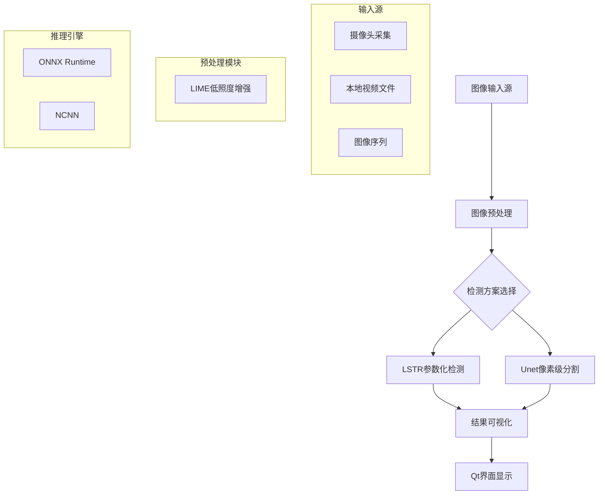
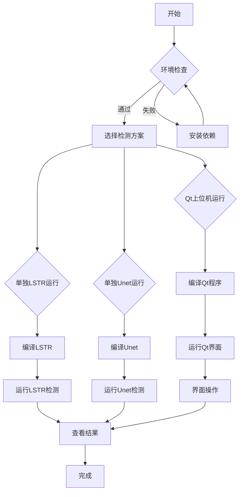

# 快速运行车道线检测流程

<!-- WIKI_NAV_START -->
> [!info] 视觉感知 Wiki 导航
> [[projects/linux视觉感知项目/index|项目首页]] · [[projects/Linux视觉感知项目/00 项目总览/1.3 CMake 构建指南|← 上一篇：2.3.1 各模块 CMake 构建指南]] · [[projects/Linux视觉感知项目/00 项目总览/1.5 系统全景与数据流|下一篇：3.1 系统全景与数据流总览 →]]
<!-- WIKI_NAV_END -->

本页面为初级开发者提供车道线检测系统的快速运行指南。通过本指南，您可以在最短时间内启动并运行完整的车道线检测流程，体验从图像采集到结果可视化的完整工作流。

## 系统运行架构概览

车道线检测系统采用模块化设计，核心流程包括**图像采集**、**低照度增强预处理**、**神经网络推理**和**结果可视化**四个阶段。系统支持两种检测方案：**LSTR参数化检测**（基于ONNX Runtime）和**Unet像素级分割**（基于NCNN）。



## 环境准备与依赖检查

在运行系统前，请确保已安装以下依赖环境：

| 依赖项 | 版本要求 | 作用 | 安装命令 |
|--------|----------|------|----------|
| OpenCV | 4.7.0+ | 图像处理、格式转换 | `sudo apt install libopencv-dev` |
| ONNX Runtime | 1.12+ | LSTR模型推理引擎 | 从源码编译或下载预编译包 |
| NCNN | 20230820+ | Unet模型推理引擎 | `git clone https://github.com/Tencent/ncnn` |
| Qt | 5.12.8 | 图形界面框架 | `sudo apt install qt5-default` |
| FFmpeg | 4.0+ | 视频文件处理 | `sudo apt install ffmpeg` |
| CMake | 3.12+ | 构建系统 | `sudo apt install cmake` |

**关键检查点**：在终端中运行以下命令验证环境：
```bash
# 检查OpenCV
pkg-config --modversion opencv4

# 检查Qt
qmake --version

# 检查FFmpeg
ffmpeg -version
```

## 两种检测方案快速对比

根据您的需求选择合适的检测方案：

| 特性 | LSTR方案（ONNX Runtime） | Unet方案（NCNN） |
|------|--------------------------|------------------|
| **检测方式** | 参数化曲线拟合 | 像素级语义分割 |
| **输入尺寸** | 360×204 | 720×720 |
| **输出格式** | 车道线曲线参数 + 掩码 | 像素级分割掩码 |
| **推理速度** | 较快（参数化） | 较慢（像素级） |
| **精度** | 曲线拟合精度高 | 边界定位精确 |
| **适用场景** | 实时检测、嵌入式平台 | 高精度分割需求 |
| **依赖框架** | ONNX Runtime | NCNN |

## 快速运行步骤

### 方案一：通过Qt上位机运行（推荐）

Qt上位机提供完整的图形化操作界面，适合初次体验系统功能。

**步骤1：编译Qt上位机程序**
```bash
# 进入Qt项目目录
cd 上位机程序/Lane_Detection

# 使用qmake生成Makefile
qmake 1102demo3.pro

# 编译项目
make -j4
```

**步骤2：编译LSTR推理程序**
```bash
# 进入LSTR目录
cd 上位机程序/Lane_Detection/LSTR

# 创建构建目录
mkdir build && cd build

# 编译
cmake ..
make -j4
```

**步骤3：运行Qt上位机**
```bash
# 返回Qt项目根目录
cd 上位机程序/Lane_Detection

# 运行程序
./camera_test
```

**步骤4：在Qt界面中操作**
1. 点击"打开摄像头"按钮开始实时采集
2. 或点击"选择视频文件"选择本地视频
3. 点击"神经网络识别"按钮启动车道线检测
4. 在右侧结果区域查看检测结果

Sources: `上位机程序/Lane_Detection/mainwindow.cpp#L40-L57`

### 方案二：单独运行LSTR检测模块

如果您只需要运行LSTR车道线检测功能，可以单独编译运行。

**步骤1：进入LSTR目录**
```bash
cd 上位机程序/Lane_Detection/LSTR
```

**步骤2：准备测试图像**
将测试图像放入`images`目录，或使用已有的测试图像：
```bash
# 查看可用测试图像
ls images/
# 输出示例：0.jpg  1.jpg  2.jpg  test1.jpg  test2.jpg  ...
```

**步骤3：编译并运行**
```bash
mkdir build && cd build
cmake ..
make -j4

# 运行检测（以图像序列为例）
./LSTR ../images/
```

**步骤4：查看结果**
检测结果将保存在`result`目录中，包含车道线可视化结果。

Sources: `上位机程序/Lane_Detection/LSTR/main.cpp#L208-L245`

### 方案三：单独运行Unet分割模块

**步骤1：进入Unet目录**
```bash
cd 卷积神经网络/卷积神经网络/Unet_NCNN
```

**步骤2：编译并运行**
```bash
mkdir build && cd build
cmake ..
make -j4

# 运行检测（指定单张图像）
./unet_ncnn ../images/0.jpg
```

**步骤3：查看结果**
检测结果将生成`result.jpg`文件，包含车道线分割区域的可视化。

Sources: `卷积神经网络/卷积神经网络/Unet_NCNN/src/unet.cpp#L16-L143`

## 关键配置参数说明

### LSTR模型参数
```cpp
// 模型输入尺寸
const int inpWidth = 360;    // 输入宽度
const int inpHeight = 204;   // 输入高度

// 图像归一化参数
float mean[3] = {0.485, 0.456, 0.406};  // 均值
float std[3] = {0.229, 0.224, 0.225};   // 标准差

// 日志空间采样点数
const int len_log_space = 50;
```

Sources: `上位机程序/Lane_Detection/LSTR/main.cpp#L27-L31`

### Unet模型参数
```cpp
// 模型输入尺寸
#define INPUT_WIDTH     720
#define INPUT_HEIGHT    720

// 模型文件路径
Unet.load_param("../models/model.ncnn.param");
Unet.load_model("../models/model.ncnn.bin");
```

Sources: `卷积神经网络/卷积神经网络/Unet_NCNN/src/unet.cpp#L13-L25`

## 常见问题排查

### 问题1：编译错误 - 找不到OpenCV库
**症状**：`CMake Error: Could not find OpenCV`
**解决方案**：
```bash
# 安装OpenCV开发包
sudo apt install libopencv-dev

# 或指定OpenCV路径
cmake -DOpenCV_DIR=/usr/local/lib/cmake/opencv4 ..
```

### 问题2：ONNX Runtime加载失败
**症状**：`Failed to load ONNX Runtime library`
**解决方案**：
```bash
# 检查库文件是否存在
ls lib/libonnxruntime.so

# 设置库路径
export LD_LIBRARY_PATH=$PWD/lib:$LD_LIBRARY_PATH
```

### 问题3：模型文件缺失
**症状**：`Model file not found`
**解决方案**：
```bash
# 检查模型文件
ls lstr_360x640.onnx  # LSTR模型
ls models/model.ncnn.*  # Unet模型
```

### 问题4：图像路径错误
**症状**：`Image file not found`
**解决方案**：
```bash
# 检查测试图像目录
ls images/  # 或 test/

# 使用绝对路径
./LSTR /full/path/to/images/
```

## 性能基准测试

在不同硬件平台上的性能表现（单帧处理时间）：

| 平台 | LSTR方案 | Unet方案 | 备注 |
|------|----------|----------|------|
| x86_64 (Intel i7) | 45ms | 120ms | 无GPU加速 |
| ARM FT2000/4 | 85ms | 210ms | 无GPU，NEON优化 |
| NVIDIA Jetson | 25ms | 65ms | GPU加速 |

**优化建议**：
1. 对于实时应用，优先使用LSTR方案
2. 在ARM平台启用NEON和OpenMP优化
3. 调整输入图像尺寸平衡精度与速度

## 下一步学习建议

完成快速运行后，建议按以下顺序深入学习：

1. **系统架构理解**：[[projects/Linux视觉感知项目/00 项目总览/1.5 系统全景与数据流|系统全景与数据流总览]]
2. **LIME算法原理**：[[projects/Linux视觉感知项目/02 LIME 低照度增强/3.1 算法原理：Retinex与光照图|LIME 低照度图像增强算法基础版]]
3. **LSTR模型详解**：[[projects/Linux视觉感知项目/03 模型推理部署/4.1 LSTR模型架构与曲线解码|LSTR 模型架构与参数化曲线输出解码]]
4. **Unet模型详解**：[[projects/Linux视觉感知项目/03 模型推理部署/4.4 Unet编码器-解码器架构|Unet 编码器-解码器架构与 skip connection]]
5. **Qt上位机开发**：[[projects/Linux视觉感知项目/01 Qt 上位机/2.1 界面布局与UI控件|Qt Designer 界面布局与 UI 控件映射]]

## 快速运行流程图



## 关键文件路径速查表

| 模块 | 文件路径 | 主要功能 |
|------|----------|----------|
| Qt上位机 | `上位机程序/Lane_Detection/` | 图形界面、系统控制 |
| LSTR推理 | `上位机程序/Lane_Detection/LSTR/` | LSTR模型推理 |
| Unet推理 | `卷积神经网络/卷积神经网络/Unet_NCNN/` | Unet模型推理 |
| LIME基础版 | `图像预处理（加速前+加速后）/Lime/` | 低照度增强 |
| LIME优化版 | `图像预处理（加速前+加速后）/Lime_NEON+OpenMP/` | NEON+OpenMP加速 |
| 测试图像 | `上位机程序/Lane_Detection/images/` | 测试用图像序列 |

**注意**：所有路径均为相对于项目根目录的相对路径。在Linux系统中运行时，请确保路径分隔符正确。

<!-- WIKI_FOOTER_START -->
---
> [!tip] 继续阅读
> [[projects/linux视觉感知项目/index|项目首页]] · [[projects/Linux视觉感知项目/00 项目总览/1.3 CMake 构建指南|← 上一篇：2.3.1 各模块 CMake 构建指南]] · [[projects/Linux视觉感知项目/00 项目总览/1.5 系统全景与数据流|下一篇：3.1 系统全景与数据流总览 →]]
<!-- WIKI_FOOTER_END -->
