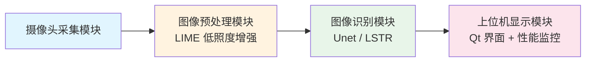
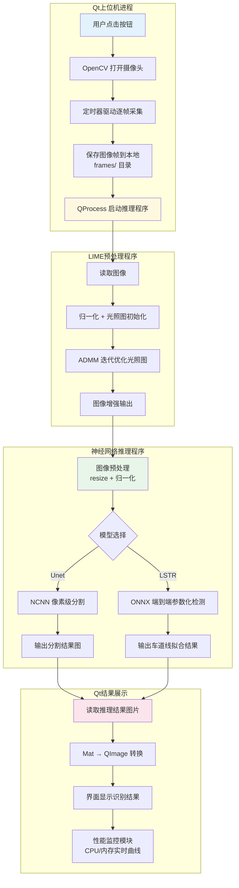
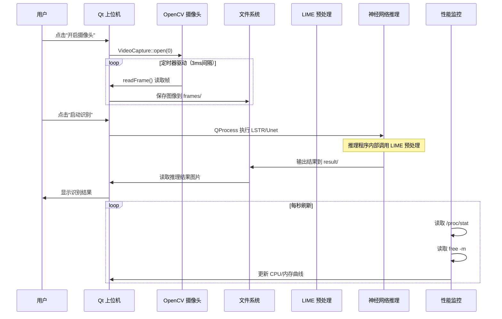
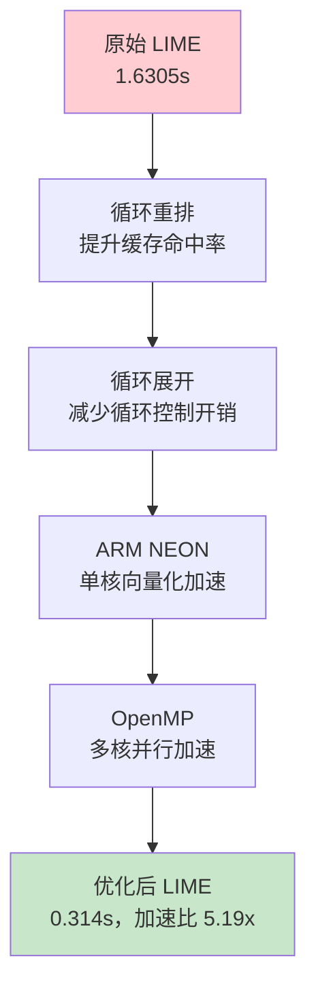

# 系统全景与数据流总览

<!-- WIKI_NAV_START -->
> [!info] 视觉感知 Wiki 导航
> [[projects/linux视觉感知项目/index|项目首页]] · [[projects/Linux视觉感知项目/00 项目总览/1.4 快速运行车道线检测|← 上一篇：2.3.2 快速运行车道线检测流程]] · [[projects/Linux视觉感知项目/01 Qt 上位机/2.1 界面布局与UI控件|下一篇：3.2.1 Qt 上位机程序：界面控制与系统监控 →]]
<!-- WIKI_NAV_END -->

本文档是 Linux 视觉感知处理系统的全景入口，旨在帮助开发者在深入任何单一模块之前，先建立对整个系统架构、数据流转路径和模块职责边界的清晰认知。理解全局后，后续各模块文档的学习将事半功倍。

## 一、系统定位与硬件平台

本项目是一个面向校园无人配送车的**实时车道线识别系统**，运行在国产飞腾 FT2000/4 处理器平台上。系统的核心挑战在于：在没有 GPU 加速的嵌入式 ARM 环境下，实现从图像采集、低照度增强、神经网络推理到可视化显示的全流程实时处理。

硬件平台由以下核心组件构成：

| 组件 | 型号/规格 | 职责 |
|------|-----------|------|
| 主控处理器 | 飞腾 FT2000/4（4核 FTC663，主频 2.6GHz） | 执行所有软件逻辑，包括图像处理、模型推理、界面控制 |
| 显卡 | AMD R5-230 | 处理 CPU 输送的图像信息，辅助显示输出 |
| 摄像头 | 海康威视 DS-E12 | 实时采集车道行驶画面 |
| 操作系统 | 银河麒麟 V10 | 提供 Linux 运行环境和 Qt 开发环境 |

Sources: [Linux视觉感知处理原作者文档.md](Linux视觉感知处理原作者文档.md#L60-L95)

## 二、系统模块架构

整个系统被划分为四个功能模块，各模块间形成清晰的流水线关系：



| 模块 | 核心技术 | 运行位置 | 关键职责 |
|------|----------|----------|----------|
| 图像采集模块 | Qt + OpenCV | Qt 主进程 | 摄像头控制、视频帧读取、图像保存 |
| 图像预处理模块 | LIME 算法 + NEON + OpenMP | CPU（独立可执行程序） | 低照度图像增强，提升夜间车道线辨识度 |
| 图像识别模块 | Unet/NCNN 或 LSTR/ONNX | CPU（独立可执行程序） | 车道线检测与分割推理 |
| 上位机显示模块 | Qt Charts + QProcess | Qt 主进程 | 结果可视化、性能监控、系统调度 |

Sources: [Linux视觉感知处理原作者文档.md](Linux视觉感知处理原作者文档.md#L97-L105)

## 三、端到端数据流

系统的完整数据流如下图所示。理解这条链路是掌握整个项目的关键：



**数据流关键节点说明：**

1. **采集阶段**：Qt 上位机通过 OpenCV 的 `VideoCapture` 打开摄像头，由定时器（QTimer）以约 3ms 间隔驱动帧采集，采集的图像保存到 `frames/` 目录
2. **预处理阶段**：LIME 算法对低照度图像进行增强，核心是通过 ADMM 迭代优化光照图 T，最终执行 `通道 / T` 完成增强
3. **推理阶段**：增强后的图像送入神经网络，Unet 输出像素级分割图，LSTR 输出参数化车道线多项式
4. **显示阶段**：推理结果图片由 Qt 上位机读取，经格式转换后显示在界面上

Sources: [Linux视觉感知处理系统.md](Linux视觉感知处理系统.md#L62-L68), [mainwindow.cpp](mainwindow.cpp#L27-L35)

## 四、项目目录结构

项目代码按功能模块组织，每个模块是独立的 CMake 或 Qt 工程：

```
Linux视觉感知处理系统/
├── 上位机程序/Lane_Detection/     # Qt 上位机工程（系统入口）
│   ├── main.cpp                   # Qt 程序入口
│   ├── mainwindow.cpp/h           # 主窗口逻辑（摄像头、调度、显示）
│   ├── sysinfolinuximpl.cpp/h     # 性能监控模块（CPU/内存采集）
│   ├── frames/                    # 摄像头采集帧保存目录
│   └── LSTR/                      # 推理程序及结果目录
│
├── 图像预处理（加速前+加速后）/
│   ├── Lime/                      # LIME 原始实现
│   │   └── lime.cpp               # 核心算法（418行）
│   └── Lime_NEON+OpenMP/          # LIME 优化实现
│       ├── lime_opt.cpp           # NEON+OpenMP 优化版
│       └── xinlime.cpp            # 辅助函数
│
└── 卷积神经网络/卷积神经网络/
    ├── Unet_NCNN/                 # Unet 模型（NCNN 部署）
    │   ├── src/unet.cpp           # 推理代码
    │   └── models/                # 模型文件
    └── LSTR_ONNX/                 # LSTR 模型（ONNX 部署）
        ├── main.cpp               # 推理代码
        └── lstr_360x640.onnx      # 模型文件
```

Sources: [readme.txt](projects/linux视觉感知项目/源码/readme.txt#L60-L83)

## 五、模块间调用关系

Qt 上位机是整个系统的**调度中心**，通过 `QProcess` 调用外部推理程序。以下是模块间的调用链路：



**关键调用代码**：Qt 上位机通过以下方式调用推理程序：

```cpp
// mainwindow.cpp 中的调用逻辑
process2->write("cd /上位机软件根目录/LSTR/build\n");
process2->write("./LSTR ../videos/frames/\n");
```

Sources: [mainwindow.cpp](mainwindow.cpp#L127-L128), [Linux视觉感知处理系统.md](Linux视觉感知处理系统.md#L64-L68)

## 六、技术栈总览

| 层次 | 技术 | 版本 | 用途 |
|------|------|------|------|
| 上位机界面 | Qt | 5.12.8 | 界面开发、事件处理、进程调度 |
| 图像处理 | OpenCV | 4.7.0 | 图像读写、格式转换、基础处理 |
| 模型部署（Unet） | NCNN | - | 移动端推理框架，轻量高效 |
| 模型部署（LSTR） | ONNX Runtime | 1.16.0 | 跨平台推理框架 |
| CPU 加速 | ARM NEON | - | 单指令多数据向量化加速 |
| 多线程并行 | OpenMP | - | 多核并行加速 |
| 构建系统 | CMake / qmake | - | 工程编译管理 |

Sources: [readme.txt](projects/linux视觉感知项目/源码/readme.txt#L1-L20)

## 七、为什么是两条车道线识别路线

系统同时实现了 Unet 和 LSTR 两种车道线识别方案，这不是功能冗余，而是技术路线的对比验证：

| 对比维度 | Unet（语义分割） | LSTR（端到端参数化） |
|----------|------------------|----------------------|
| 输出形式 | 像素级分割图 | 车道线多项式参数 |
| 部署框架 | NCNN | ONNX Runtime |
| 实时性 | 相对较慢 | 0.1～0.2s/帧，更快 |
| 核心思想 | 编码器-解码器 + 跳跃连接 | Transformer + 多项式拟合 |
| 适用场景 | 精细分割需求 | 实时性要求高的部署场景 |

引入 LSTR 是为了在嵌入式端进一步提升实时性，并探索比 Unet 更适合部署的车道线检测路线。

Sources: [Linux视觉感知处理系统.md](Linux视觉感知处理系统.md#L4725-L4758)

## 八、LIME 预处理的优化策略分层

LIME 优化是本项目的重要创新点，采用分层叠加的优化策略：



这四类优化不是替代关系，而是**分层叠加关系**：循环重排解决访问顺序，循环展开适配 NEON 特性，NEON 解决单核多数据处理，OpenMP 解决多核协作。

Sources: [Linux视觉感知处理系统.md](Linux视觉感知处理系统.md#L2270-L2280)

## 九、性能监控模块

Qt 上位机内置了实时性能监控模块，通过读取 Linux 系统文件获取 CPU 和内存使用率：

- **CPU 占用率**：读取 `/proc/stat`，采用差值法计算（当前时刻与上一时刻的 CPU 时间差比值）
- **内存使用率**：执行 `free -m` 命令，计算 `(total - free) / total` 的百分比

监控数据通过 Qt Charts 绘制成实时曲线，每秒刷新一次，用于观察各模块运行时的系统资源消耗变化。

Sources: [sysinfolinuximpl.cpp](sysinfolinuximpl.cpp#L15-L45)

## 十、推荐阅读路径

基于本系统的模块依赖关系，建议按以下顺序深入学习：

1. **先理解入口**：[Qt 程序入口与事件循环原理](4-qt-cheng-xu-ru-kou-yu-shi-jian-xun-huan-yuan-li) — 掌握系统如何启动
2. **再理解交互**：[信号槽机制与按钮交互流程](5-xin-hao-cao-ji-zhi-yu-an-niu-jiao-hu-liu-cheng) — 理解用户操作如何驱动数据流
3. **然后理解采集**：[摄像头采集与视频帧读取](6-she-xiang-tou-cai-ji-yu-shi-pin-zheng-du-qu) — 数据流的源头
4. **接着理解调度**：[QProcess 调用外部推理程序](7-qprocess-diao-yong-wai-bu-tui-li-cheng-xu) — 模块间的桥梁
5. **深入预处理**：[LIME 算法原理与光照图估计](10-lime-suan-fa-yuan-li-yu-guang-zhao-tu-gu-ji) — 数据流中的关键变换
6. **学习优化**：[循环重排与循环展开优化](13-xun-huan-zhong-pai-yu-xun-huan-zhan-kai-you-hua) → [ARM NEON 向量化加速](14-arm-neon-xiang-liang-hua-jia-su) → [OpenMP 多线程并行加速](15-openmp-duo-xian-cheng-bing-xing-jia-su)
7. **理解推理**：[Unet 网络结构与语义分割原理](16-unet-wang-luo-jie-gou-yu-yu-yi-fen-ge-yuan-li) 或 [LSTR 网络结构与参数化检测原理](18-lstr-wang-luo-jie-gou-yu-can-shu-hua-jian-ce-yuan-li)
8. **最后串联**：[模块集成、性能数据与技术选型](20-mo-kuai-ji-cheng-xing-neng-shu-ju-yu-ji-zhu-xuan-xing) — 回到全局视角
